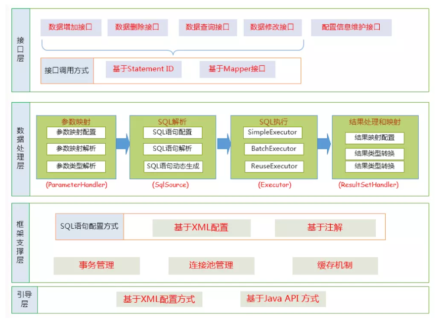
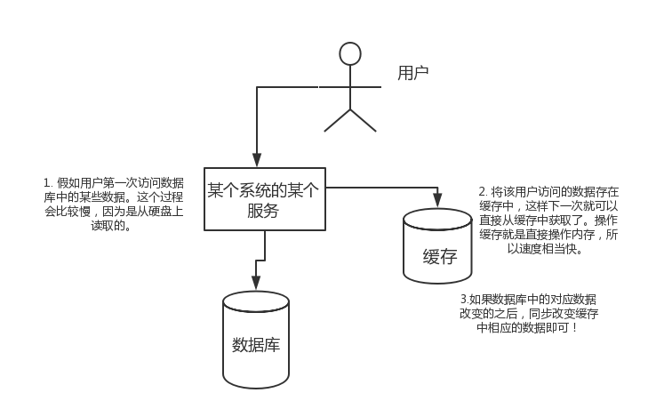
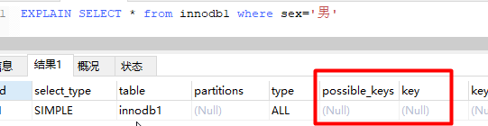
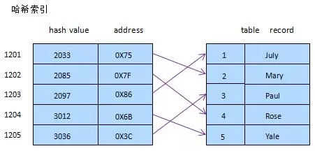

# Interview Questions - Database

## MyBatis 简介

### MyBatis 是什么

MyBatis 是一款优秀的持久层框架，一个半 ORM（对象关系映射）框架，它支持定制化 SQL、存储过程以及高级映射。MyBatis 避免了几乎所有的 JDBC 代码和手动设置参数以及获取结果集。MyBatis 可以使用简单的 XML 或注解来配置和映射原生类型、接口和 Java 的 POJO（Plain Old Java Objects，普通老式 Java 对象）为数据库中的记录。

### ORM 是什么

ORM（Object Relational Mapping），对象关系映射，是一种为了解决关系型数据库数据与简单 Java 对象（POJO）的映射关系的技术。简单的说，ORM 是通过使用描述对象和数据库之间映射的元数据，将程序中的对象自动持久化到关系型数据库中。

### 为什么说 Mybatis 是半自动 ORM 映射工具？它与全自动的区别在哪里

Hibernate 属于全自动 ORM 映射工具，使用 Hibernate 查询关联对象或者关联集合对象时，可以根据对象关系模型直接获取，所以它是全自动的。

而 Mybatis 在查询关联对象或关联集合对象时，需要手动编写 sql 来完成，所以，称之为半自动 ORM 映射工具。

### 传统 JDBC 开发存在的问题

1. 频繁创建数据库连接对象、释放，容易造成系统资源浪费，影响系统性能。可以使用连接池解决这个问题。但是使用 jdbc 需要自己实现连接池。
2. sql 语句定义、参数设置、结果集处理存在硬编码。实际项目中 sql 语句变化的可能性较大，一旦发生变化，需要修改 java 代码，系统需要重新编译，重新发布。不好维护。
3. 使用 preparedStatement 向占有位符号传参数存在硬编码，因为 sql 语句的 where 条件不一定，可能多也可能少，修改 sql 还要修改代码，系统不易维护。
4. 结果集处理存在重复代码，处理麻烦。如果可以映射成 Java 对象会比较方便。

### JDBC 编程有哪些不足之处，MyBatis 是如何解决这些问题的

1. 数据库链接创建、释放频繁造成系统资源浪费从而影响系统性能，如果使用数据库连接池可解决此问题。
    解决：在 mybatis-config.xml 中配置数据链接池，使用连接池管理数据库连接。
2. Sql 语句写在代码中造成代码不易维护，实际应用 sql 变化的可能较大，sql 变动需要改变 java 代码。
    解决：将 Sql 语句配置在 XXXXmapper.xml 文件中与 java 代码分离。
3. 向 sql 语句传参数麻烦，因为 sql 语句的 where 条件不一定，可能多也可能少，占位符需要和参数一一对应。
    解决： Mybatis 自动将 java 对象映射至 sql 语句。
4. 对结果集解析麻烦，sql 变化导致解析代码变化，且解析前需要遍历，如果能将数据库记录封装成 pojo 对象解析比较方便。
    解决：Mybatis 自动将 sql 执行结果映射至 java 对象。

### Mybatis 优缺点

优点

与传统的数据库访问技术相比，ORM 有以下优点：

1. 基于 SQL 语句编程，相当灵活，不会对应用程序或者数据库的现有设计造成任何影响，SQL 写在 XML 里，解除 sql 与程序代码的耦合，便于统一管理；提供 XML 标签，支持编写动态 SQL 语句，并可重用
2. 与 JDBC 相比，减少了 50% 以上的代码量，消除了 JDBC 大量冗余的代码，不需要手动开关连接
3. 很好的与各种数据库兼容（因为 MyBatis 使用 JDBC 来连接数据库，所以只要 JDBC 支持的数据库 MyBatis 都支持）
4. 提供映射标签，支持对象与数据库的 ORM 字段关系映射；提供对象关系映射标签，支持对象关系组件维护
5. 能够与 Spring 很好的集成

缺点

1. SQL 语句的编写工作量较大，尤其当字段多、关联表多时，对开发人员编写 SQL 语句的功底有一定要求
2. SQL 语句依赖于数据库，导致数据库移植性差，不能随意更换数据库

### MyBatis 框架适用场景

1. MyBatis 专注于 SQL 本身，是一个足够灵活的 DAO 层解决方案。
2. 对性能的要求很高，或者需求变化较多的项目，如互联网项目，MyBatis 将是不错的选择。

### Hibernate 和 MyBatis 的区别

相同点

1. 都是对 jdbc 的封装，都是持久层的框架，都用于 dao 层的开发。

不同点

1. 映射关系
   1. MyBatis 是一个半自动映射的框架，配置 Java 对象与 sql 语句执行结果的对应关系，多表关联关系配置简单
   2. Hibernate 是一个全表映射的框架，配置 Java 对象与数据库表的对应关系，多表关联关系配置复杂
2. SQL 优化和移植性
   1. Hibernate 对 SQL 语句封装，提供了日志、缓存、级联（级联比 MyBatis 强大）等特性，此外还提供 HQL（Hibernate Query Language）操作数据库，数据库无关性支持好，但会多消耗性能。如果项目需要支持多种数据库，代码开发量少，但 SQL 语句优化困难。
   2. MyBatis 需要手动编写 SQL，支持动态 SQL、处理列表、动态生成表名、支持存储过程。开发工作量相对大些。直接使用 SQL 语句操作数据库，不支持数据库无关性，但 sql 语句优化容易。
3. 开发难易程度和学习成本
   1. Hibernate 是重量级框架，学习使用门槛高，适合于需求相对稳定，中小型的项目，比如：办公自动化系统
   2. MyBatis 是轻量级框架，学习使用门槛低，适合于需求变化频繁，大型的项目，比如：互联网电子商务系统

总结

1. MyBatis 是一个小巧、方便、高效、简单、直接、半自动化的持久层框架，
2. Hibernate 是一个强大、方便、高效、复杂、间接、全自动化的持久层框架。

## MyBatis 的解析和运行原理

### MyBatis 编程步骤是什么样的

1. 创建 SqlSessionFactory
2. 通过 SqlSessionFactory 创建 SqlSession
3. 通过 sqlsession 执行数据库操作
4. 调用 session.commit () 提交事务
5. 调用 session.close () 关闭会话

### 请说说 MyBatis 的工作原理

在学习 MyBatis 程序之前，需要了解一下 MyBatis 工作原理，以便于理解程序。MyBatis 的工作原理如下图


1. 读取 MyBatis 配置文件：mybatis-config.xml 为 MyBatis 的全局配置文件，配置了 MyBatis 的运行环境等信息，例如数据库连接信息。
2. 加载映射文件。映射文件即 SQL 映射文件，该文件中配置了操作数据库的 SQL 语句，需要在 MyBatis 配置文件 mybatis-config.xml 中加载。mybatis-config.xml 文件可以加载多个映射文件，每个文件对应数据库中的一张表。
3. 构造会话工厂：通过 MyBatis 的环境等配置信息构建会话工厂 SqlSessionFactory。
4. 创建会话对象：由会话工厂创建 SqlSession 对象，该对象中包含了执行 SQL 语句的所有方法。
5. Executor 执行器：MyBatis 底层定义了一个 Executor 接口来操作数据库，它将根据 SqlSession 传递的参数动态地生成需要执行的 SQL 语句，同时负责查询缓存的维护。
6. MappedStatement 对象：在 Executor 接口的执行方法中有一个 MappedStatement 类型的参数，该参数是对映射信息的封装，用于存储要映射的 SQL 语句的 id、参数等信息。
7. 输入参数映射：输入参数类型可以是 Map、List 等集合类型，也可以是基本数据类型和 POJO 类型。输入参数映射过程类似于 JDBC 对 preparedStatement 对象设置参数的过程。
8. 输出结果映射：输出结果类型可以是 Map、 List 等集合类型，也可以是基本数据类型和 POJO 类型。输出结果映射过程类似于 JDBC 对结果集的解析过程。

### MyBatis 的功能架构是怎样的



我们把 Mybatis 的功能架构分为三层：

1. API 接口层：提供给外部使用的接口 API，开发人员通过这些本地 API 来操纵数据库。接口层一接收到调用请求就会调用数据处理层来完成具体的数据处理。
2. 数据处理层：负责具体的 SQL 查找、SQL 解析、SQL 执行和执行结果映射处理等。它主要的目的是根据调用的请求完成一次数据库操作。
3. 基础支撑层：负责最基础的功能支撑，包括连接管理、事务管理、配置加载和缓存处理，这些都是共用的东西，将他们抽取出来作为最基础的组件。为上层的数据处理层提供最基础的支撑。

### MyBatis 的框架架构设计是怎么样的


这张图从上往下看。MyBatis 的初始化，会从 mybatis-config.xml 配置文件，解析构造成 Configuration 这个类，就是图中的红框。

1. 加载配置：配置来源于两个地方，一处是配置文件，一处是 Java 代码的注解，将 SQL 的配置信息加载成为一个个 MappedStatement 对象（包括了传入参数映射配置、执行的 SQL 语句、结果映射配置），存储在内存中。
2. SQL 解析：当 API 接口层接收到调用请求时，会接收到传入 SQL 的 ID 和传入对象（可以是 Map、JavaBean 或者基本数据类型），Mybatis 会根据 SQL 的 ID 找到对应的 MappedStatement，然后根据传入参数对象对 MappedStatement 进行解析，解析后可以得到最终要执行的 SQL 语句和参数。
3. SQL 执行：将最终得到的 SQL 和参数拿到数据库进行执行，得到操作数据库的结果。
4. 结果映射：将操作数据库的结果按照映射的配置进行转换，可以转换成 HashMap、JavaBean 或者基本数据类型，并将最终结果返回。

### 为什么需要预编译

1. 定义：
    SQL 预编译指的是数据库驱动在发送 SQL 语句和参数给 DBMS 之前对 SQL 语句进行编译，这样 DBMS 执行 SQL 时，就不需要重新编译。
2. 为什么需要预编译
    JDBC 中使用对象 PreparedStatement 来抽象预编译语句，使用预编译。预编译阶段可以优化 SQL 的执行。预编译之后的 SQL 多数情况下可以直接执行，DBMS 不需要再次编译，越复杂的 SQL，编译的复杂度将越大，预编译阶段可以合并多次操作为一个操作。同时预编译语句对象可以重复利用。把一个 SQL 预编译后产生的 PreparedStatement 对象缓存下来，下次对于同一个 SQL，可以直接使用这个缓存的 PreparedState 对象。Mybatis 默认情况下，将对所有的 SQL 进行预编译。

### Mybatis 都有哪些 Executor 执行器？它们之间的区别是什么

Mybatis 有三种基本的 Executor 执行器，SimpleExecutor、ReuseExecutor、BatchExecutor。

1. SimpleExecutor：每执行一次 update 或 select，就开启一个 Statement 对象，用完立刻关闭 Statement 对象。
2. ReuseExecutor：执行 update 或 select，以 sql 作为 key 查找 Statement 对象，存在就使用，不存在就创建，用完后，不关闭 Statement 对象，而是放置于 `Map<String, Statement>` 内，供下一次使用。简言之，就是重复使用 Statement 对象。
3. BatchExecutor：执行 update（没有 select，JDBC 批处理不支持 select），将所有 sql 都添加到批处理中（addBatch ()），等待统一执行（executeBatch ()），它缓存了多个 Statement 对象，每个 Statement 对象都是 addBatch () 完毕后，等待逐一执行 executeBatch () 批处理。与 JDBC 批处理相同。

作用范围：Executor 的这些特点，都严格限制在 SqlSession 生命周期范围内。

### Mybatis 中如何指定使用哪一种 Executor 执行器

在 Mybatis 配置文件中，在设置（settings）可以指定默认的 ExecutorType 执行器类型，也可以手动给 DefaultSqlSessionFactory 的创建 SqlSession 的方法传递 ExecutorType 类型参数，如 SqlSession openSession (ExecutorType execType)。

配置默认的执行器。SIMPLE 就是普通的执行器；REUSE 执行器会重用预处理语句（prepared statements）； BATCH 执行器将重用语句并执行批量更新。

### Mybatis 是否支持延迟加载？如果支持，它的实现原理是什么

Mybatis 仅支持 association 关联对象和 collection 关联集合对象的延迟加载，association 指的就是一对一，collection 指的就是一对多查询。在 Mybatis 配置文件中，可以配置是否启用延迟加载 lazyLoadingEnabled=true|false。

它的原理是，使用 CGLIB 创建目标对象的代理对象，当调用目标方法时，进入拦截器方法，比如调用 a.getB ().getName ()，拦截器 invoke () 方法发现 a.getB () 是 null 值，那么就会单独发送事先保存好的查询关联 B 对象的 sql，把 B 查询上来，然后调用 a.setB (b)，于是 a 的对象 b 属性就有值了，接着完成 a.getB ().getName () 方法的调用。这就是延迟加载的基本原理。

当然了，不光是 Mybatis，几乎所有的包括 Hibernate，支持延迟加载的原理都是一样的。

## 映射器

### #{} 和 ${} 的区别

1. #{} 是占位符，预编译处理；${} 是拼接符，字符串替换，没有预编译处理。
2. Mybatis 在处理 #{} 时，#{} 传入参数是以字符串传入，会将 SQL 中的 #{} 替换为？号，调用 PreparedStatement 的 set 方法来赋值。
3. Mybatis 在处理时，是原值传入，就是把时，是原值传入，就是把 {} 替换成变量的值，相当于 JDBC 中的 Statement 编译
4. 变量替换后，#{} 对应的变量自动加上单引号 ‘’；变量替换后，${} 对应的变量不会加上单引号 ‘’
5. #{} 可以有效的防止 SQL 注入，提高系统安全性；${} 不能防止 SQL 注入
6. #{} 的变量替换是在 DBMS 中；${} 的变量替换是在 DBMS 外

### 模糊查询 like 语句该怎么写

1. `’%${question}%’` 可能引起 SQL 注入，不推荐
2. `"%"#{question}"%"` 注意：因为 `#{…}` 解析成 sql 语句时候，会在变量外侧自动加单引号`’ '`，所以这里 `%` 需要使用双引号 `" "`，不能使用单引号 `’ '`，不然会查不到任何结果。
3. `CONCAT (’%’,#{question},’%’)` 使用 CONCAT () 函数，推荐
4. 使用 bind 标签

```xml
<select id="listUserLikeUsername" resultType="com.jourwon.pojo.User">
　　<bind name="pattern" value="'%' + username + '%'" />
　　select id,sex,age,username,password from person where username LIKE #{pattern}
</select>
```

### 在 mapper 中如何传递多个参数

**方法 1：顺序传参法:**

```java
public User selectUser(String name, int deptId);
```

```xml
<select id="selectUser" resultMap="UserResultMap">
    select * from user
    where user_name = #{0} and dept_id = #{1}
</select>
```

`#{}` 里面的数字代表传入参数的顺序。

这种方法不建议使用，sql 层表达不直观，且一旦顺序调整容易出错。

**方法 2：@Param 注解传参法:**

```java
public User selectUser(@Param("userName") String name, int @Param("deptId") deptId);

```

```xml
<select id="selectUser" resultMap="UserResultMap">
    select * from user
    where user_name = #{userName} and dept_id = #{deptId}
</select>
```

`#{}` 里面的名称对应的是注解 @Param 括号里面修饰的名称。

这种方法在参数不多的情况还是比较直观的，推荐使用。

**方法 3：Map 传参法:**

```java
public User selectUser(Map<String, Object> params);
```

```xml
<select id="selectUser" parameterType="java.util.Map" resultMap="UserResultMap">
    select * from user
    where user_name = #{userName} and dept_id = #{deptId}
</select>
```

`#{}` 里面的名称对应的是 Map 里面的 key 名称。

这种方法适合传递多个参数，且参数易变能灵活传递的情况。

**方法 4：Java Bean 传参法:**

```java
public User selectUser(User user);
```

```xml
<select id="selectUser" parameterType="com.jourwon.pojo.User" resultMap="UserResultMap">
    select * from user
    where user_name = #{userName} and dept_id = #{deptId}
</select>
```

`#{}` 里面的名称对应的是 User 类里面的成员属性。

这种方法直观，需要建一个实体类，扩展不容易，需要加属性，但代码可读性强，业务逻辑处理方便，推荐使用。

### Mybatis 如何执行批量操作

1. 使用 foreach 标签
    foreach 的主要用在构建 in 条件中，它可以在 SQL 语句中进行迭代一个集合。foreach 标签的属性主要有 item，index，collection，open，separator，close。

    1. item　　表示集合中每一个元素进行迭代时的别名，随便起的变量名；
    2. index　　指定一个名字，用于表示在迭代过程中，每次迭代到的位置，不常用；
    3. open　　表示该语句以什么开始，常用 “(”；
    4. separator 表示在每次进行迭代之间以什么符号作为分隔符，常用 “,”；
    5. close　　表示以什么结束，常用 “)”。

    在使用 foreach 的时候最关键的也是最容易出错的就是 collection 属性，该属性是必须指定的，但是在不同情况下，该属性的值是不一样的，主要有一下 3 种情况：

    1. 如果传入的是单参数且参数类型是一个 List 的时候，collection 属性值为 list
    2. 如果传入的是单参数且参数类型是一个 array 数组的时候，collection 的属性值为 array
    3. 如果传入的参数是多个的时候，我们就需要把它们封装成一个 Map 了，当然单参数也可以封装成 map，实际上如果你在传入参数的时候，在 MyBatis 里面也是会把它封装成一个 Map 的，
    map 的 key 就是参数名，所以这个时候 collection 属性值就是传入的 List 或 array 对象在自己封装的 map 里面的 key

    具体用法如下：

    ```xml
    <!-- 批量保存(foreach插入多条数据两种方法)
        int addEmpsBatch(@Param("emps") List<Employee> emps); -->
    <!-- MySQL下批量保存，可以foreach遍历 mysql支持values(),(),()语法 --> //推荐使用
    <insert id="addEmpsBatch">
        INSERT INTO emp(ename,gender,email,did)
        VALUES
        <foreach collection="emps" item="emp" separator=",">
            (#{emp.eName},#{emp.gender},#{emp.email},#{emp.dept.id})
        </foreach>
    </insert>
    ```

    ```xml
    <!-- 这种方式需要数据库连接属性allowMutiQueries=true的支持
    如jdbc.url=jdbc:mysql://localhost:3306/mybatis?allowMultiQueries=true -->
    <insert id="addEmpsBatch">
        <foreach collection="emps" item="emp" separator=";">
            INSERT INTO emp(ename,gender,email,did)
            VALUES(#{emp.eName},#{emp.gender},#{emp.email},#{emp.dept.id})
        </foreach>
    </insert>
    ```

2. 使用 ExecutorType.BATCH

    Mybatis 内置的 ExecutorType 有 3 种，默认为 simple, 该模式下它为每个语句的执行创建一个新的预处理语句，单条提交 sql；而 batch 模式重复使用已经预处理的语句，并且批量执行所有更新语句，显然 batch 性能将更优； 但 batch 模式也有自己的问题，比如在 Insert 操作时，在事务没有提交之前，是没有办法获取到自增的 id，这在某型情形下是不符合业务要求的

    具体用法如下

    ```java
    //批量保存方法测试
    @Test
    public void testBatch() throws IOException{
        SqlSessionFactory sqlSessionFactory = getSqlSessionFactory();
        //可以执行批量操作的sqlSession
        SqlSession openSession = sqlSessionFactory.openSession(ExecutorType.BATCH);

        //批量保存执行前时间
        long start = System.currentTimeMillis();
        try {
            EmployeeMapper mapper = openSession.getMapper(EmployeeMapper.class);
            for (int i = 0; i < 1000; i++) {
                mapper.addEmp(new Employee(UUID.randomUUID().toString().substring(0, 5), "b", "1"));
            }

            openSession.commit();
            long end = System.currentTimeMillis();
            //批量保存执行后的时间
            System.out.println("执行时长" + (end - start));
            //批量 预编译sql一次==》设置参数==》10000次==》执行1次   677
            //非批量  （预编译=设置参数=执行 ）==》10000次   1121

        } finally {
            openSession.close();
        }
    }
    ```

    mapper 和 mapper.xml 如下

    ```java
    public interface EmployeeMapper {
        //批量保存员工
        Long addEmp(Employee employee);
    }
    ```

    ```xml
    <mapper namespace="com.jourwon.mapper.EmployeeMapper"
        <!--批量保存员工 -->
        <insert id="addEmp">
            insert into employee(lastName,email,gender)
            values(#{lastName},#{email},#{gender})
        </insert>
    </mapper>
    ```

### 如何获取生成的主键

1. 对于支持主键自增的数据库（MySQL）

    ```xml
    <insert id="insertUser" useGeneratedKeys="true" keyProperty="userId" >
        insert into user(
        user_name, user_password, create_time)
        values(#{userName}, #{userPassword} , #{createTime, jdbcType= TIMESTAMP})
    </insert>
    ```

    parameterType 可以不写，Mybatis 可以推断出传入的数据类型。如果想要访问主键，那么应当 parameterType 应当是 java 实体或者 Map。这样数据在插入之后 可以通过 ava 实体或者 Map 来获取主键值。通过 getUserId 获取主键

2. 不支持主键自增的数据库（Oracle）

    对于像 Oracle 这样的数据，没有提供主键自增的功能，而是使用序列的方式获取自增主键。
    可以使用`＜selectKey＞`标签来获取主键的值，这种方式不仅适用于不提供主键自增功能的数据库，也适用于提供主键自增功能的数据库`＜selectKey＞`一般的用法

    ```xml
    <selectKey keyColumn="id" resultType="long" keyProperty="id" order="BEFORE">
    </selectKey>
    ```

    | 属性 | 描述 |
    |:-:|:-:|
    | keyProperty | selectKey 语句结果应该被设置的目标属性。如果希望得到多个生成的列，也可以是逗号分隔的属性名称列表。 |
    | keyColumn | 匹配属性的返回结果集中的列名称。如果希望得到多个生成的列，也可以是逗号分隔的属性名称列表。 |
    | resultType | 结果的类型，MyBatis 通常可以推算出来。MyBatis 允许任何简单类型用作主键的类型，包括字符串。如果希望作用于多个生成的列，则可以使用一个包含期望属性的 Object 或一个 Map。 |
    | order | 值可为 BEFORE 或 AFTER。如果是 BEFORE，那么它会先执行 selectKey 设置 keyProperty 然后执行插入语句。如果为 AFTER 则相反。 |
    | statementType | 使用何种语句类型，默认 PREPARED。 有 STATEMENT，PREPARED 和 CALLABLE 语句的映射类型。 |

    ```xml
    <insert id="insertUser" >
        <selectKey keyColumn="id" resultType="long" keyProperty="userId" order="BEFORE">
            SELECT USER_ID.nextval as id from dual
        </selectKey>
        insert into user(
        user_id,user_name, user_password, create_time)
        values(#{userId},#{userName}, #{userPassword} , #{createTime, jdbcType= TIMESTAMP})
    </insert>
    ```

    此时会将 Oracle 生成的主键值赋予 userId 变量。这个 userId 就是 USER 对象的属性，这样就可以将生成的主键值返回了。如果仅仅是在 insert 语句中使用但是不返回，此时 keyProperty=“任意自定义变量名”，resultType 可以不写。
    Oracle 数据库中的值要设置为 BEFORE ，这是因为 Oracle 中需要先从序列获取值，然后将值作为主键插入到数据库中。

**扩展:**

如果 Mysql 使用 selectKey 的方式获取主键，需要注意下面两点：

order ： AFTER
获取递增主键值 ：SELECT LAST_INSERT_ID ()

### 当实体类中的属性名和表中的字段名不一样 ，怎么办

第 1 种： 通过在查询的 SQL 语句中定义字段名的别名，让字段名的别名和实体类的属性名一致。

```xml
<select id="getOrder" parameterType="int" resultType="com.jourwon.pojo.Order">
       select order_id id, order_no orderno ,order_price price form orders where order_id=#{id};
</select>
```

第 2 种： 通过 `<resultMap>` 来映射字段名和实体类属性名的一一对应的关系。

```xml
<select id="getOrder" parameterType="int" resultMap="orderResultMap">
    select * from orders where order_id=#{id}
</select>

<resultMap type="com.jourwon.pojo.Order" id="orderResultMap">
    <!–用id属性来映射主键字段–>
    <id property="id" column="order_id">

    <!–用result属性来映射非主键字段，property为实体类属性名，column为数据库表中的属性–>
    <result property ="orderno" column ="order_no"/>
    <result property="price" column="order_price" />
</reslutMap>
```

### Mapper 编写有哪几种方式

第一种：接口实现类继承 SqlSessionDaoSupport：使用此种方法需要编写 mapper 接口，mapper 接口实现类、mapper.xml 文件。

1. 在 sqlMapConfig.xml 中配置 mapper.xml 的位置

    ```xml
    <mappers>
        <mapper resource="mapper.xml 文件的地址" />
        <mapper resource="mapper.xml 文件的地址" />
    </mappers>
    ```

2. 定义 mapper 接口
3. 实现类集成 SqlSessionDaoSupport
    mapper 方法中可以 this.getSqlSession () 进行数据增删改查。
4. spring 配置

    ```xml
    <bean id=" " class="mapper 接口的实现">
        <property name="sqlSessionFactory"
        ref="sqlSessionFactory"></property>
    </bean>
    ```

第二种：使用 org.mybatis.spring.mapper.MapperFactoryBean：

1. 在 sqlMapConfig.xml 中配置 mapper.xml 的位置，如果 mapper.xml 和 mappre 接口的名称相同且在同一个目录，这里可以不用配置

    ```xml
    <mappers>
        <mapper resource="mapper.xml 文件的地址" />
        <mapper resource="mapper.xml 文件的地址" />
    </mappers>
    ```

2. 定义 mapper 接口：
3. mapper.xml 中的 namespace 为 mapper 接口的地址
4. mapper 接口中的方法名和 mapper.xml 中的定义的 statement 的 id 保持一致
5. Spring 中定义

    ```xml
    <bean id="" class="org.mybatis.spring.mapper.MapperFactoryBean">
        <property name="mapperInterface" value="mapper 接口地址" />
        <property name="sqlSessionFactory" ref="sqlSessionFactory" />
    </bean>
    ```

第三种：使用 mapper 扫描器：

1. mapper.xml 文件编写：
    mapper.xml 中的 namespace 为 mapper 接口的地址；
    mapper 接口中的方法名和 mapper.xml 中的定义的 statement 的 id 保持一致；
    如果将 mapper.xml 和 mapper 接口的名称保持一致则不用在 sqlMapConfig.xml 中进行配置。
2. 定义 mapper 接口：
    注意 mapper.xml 的文件名和 mapper 的接口名称保持一致，且放在同一个目录
3. 配置 mapper 扫描器：

    ```xml
    <bean class="org.mybatis.spring.mapper.MapperScannerConfigurer">
        <property name="basePackage" value="mapper 接口包地址
        "></property>
        <property name="sqlSessionFactoryBeanName"
        value="sqlSessionFactory"/>
    </bean>
    ```

4. 使用扫描器后从 spring 容器中获取 mapper 的实现对象。

### 什么是 MyBatis 的接口绑定？有哪些实现方式

接口绑定，就是在 MyBatis 中任意定义接口，然后把接口里面的方法和 SQL 语句绑定，我们直接调用接口方法就可以，这样比起原来了 SqlSession 提供的方法我们可以有更加灵活的选择和设置。

接口绑定有两种实现方式

1. 通过注解绑定，就是在接口的方法上面加上 @Select、@Update 等注解，里面包含 Sql 语句来绑定；
2. 通过 xml 里面写 SQL 来绑定， 在这种情况下，要指定 xml 映射文件里面的 namespace 必须为接口的全路径名。当 Sql 语句比较简单时候，用注解绑定， 当 SQL 语句比较复杂时候，用 xml 绑定，一般用 xml 绑定的比较多。

### 使用 MyBatis 的 mapper 接口调用时有哪些要求

1. Mapper 接口方法名和 mapper.xml 中定义的每个 sql 的 id 相同。
2. Mapper 接口方法的输入参数类型和 mapper.xml 中定义的每个 sql 的 parameterType 的类型相同。
3. Mapper 接口方法的输出参数类型和 mapper.xml 中定义的每个 sql 的 resultType 的类型相同。
4. Mapper.xml 文件中的 namespace 即是 mapper 接口的类路径。

### 最佳实践中，通常一个 Xml 映射文件，都会写一个 Dao 接口与之对应，请问，这个 Dao 接口的工作原理是什么？Dao 接口里的方法，参数不同时，方法能重载吗

Dao 接口，就是人们常说的 Mapper 接口，接口的全限名，就是映射文件中的 namespace 的值，接口的方法名，就是映射文件中 MappedStatement 的 id 值，接口方法内的参数，就是传递给 sql 的参数。Mapper 接口是没有实现类的，当调用接口方法时，接口全限名 + 方法名拼接字符串作为 key 值，可唯一定位一个 MappedStatement，举例：com.mybatis3.mappers.StudentDao.findStudentById，可以唯一找到 namespace 为 com.mybatis3.mappers.StudentDao 下面 id = findStudentById 的 MappedStatement。在 Mybatis 中，每一个 `<select>`、`<insert>`、`<update>`、`<delete>` 标签，都会被解析为一个 MappedStatement 对象。

Dao 接口里的方法，是不能重载的，因为是全限名 + 方法名的保存和寻找策略。

Dao 接口的工作原理是 JDK 动态代理，Mybatis 运行时会使用 JDK 动态代理为 Dao 接口生成代理 proxy 对象，代理对象 proxy 会拦截接口方法，转而执行 MappedStatement 所代表的 sql，然后将 sql 执行结果返回。

### Mybatis 的 Xml 映射文件中，不同的 Xml 映射文件，id 是否可以重复

不同的 Xml 映射文件，如果配置了 namespace，那么 id 可以重复；如果没有配置 namespace，那么 id 不能重复；毕竟 namespace 不是必须的，只是最佳实践而已。

原因就是 namespace+id 是作为 `Map<String, MappedStatement>` 的 key 使用的，如果没有 namespace，就剩下 id，那么，id 重复会导致数据互相覆盖。有了 namespace，自然 id 就可以重复，namespace 不同，namespace+id 自然也就不同。

### 简述 Mybatis 的 Xml 映射文件和 Mybatis 内部数据结构之间的映射关系

答：Mybatis 将所有 Xml 配置信息都封装到 All-In-One 重量级对象 Configuration 内部。在 Xml 映射文件中，`<parameterMap>` 标签会被解析为 ParameterMap 对象，其每个子元素会被解析为 ParameterMapping 对象。`<resultMap>` 标签会被解析为 ResultMap 对象，其每个子元素会被解析为 ResultMapping 对象。每一个 `<select>`、`<insert>`、`<update>`、`<delete>` 标签均会被解析为 MappedStatement 对象，标签内的 sql 会被解析为 BoundSql 对象。

### Mybatis 是如何将 sql 执行结果封装为目标对象并返回的？都有哪些映射形式

第一种是使用 `<resultMap>` 标签，逐一定义列名和对象属性名之间的映射关系。

第二种是使用 sql 列的别名功能，将列别名书写为对象属性名，比如 T_NAME AS NAME，对象属性名一般是 name，小写，但是列名不区分大小写，Mybatis 会忽略列名大小写，智能找到与之对应对象属性名，你甚至可以写成 T_NAME AS NaMe，Mybatis 一样可以正常工作。

有了列名与属性名的映射关系后，Mybatis 通过反射创建对象，同时使用反射给对象的属性逐一赋值并返回，那些找不到映射关系的属性，是无法完成赋值的。

### Xml 映射文件中，除了常见的 select|insert|updae|delete 标签之外，还有哪些标签

还有很多其他的标签，`<resultMap>`、`<parameterMap>`、`<sql>`、`<include>`、`<selectKey>`，加上动态 sql 的 9 个标签，trim | where | set | foreach | if | choose | when | otherwise | bind 等，其中 `<sql>` 为 sql 片段标签，通过 `<include>` 标签引入 sql 片段，`<selectKey>` 为不支持自增的主键生成策略标签。

### Mybatis 映射文件中，如果 A 标签通过 include 引用了 B 标签的内容，请问，B 标签能否定义在 A 标签的后面，还是说必须定义在 A 标签的前面

虽然 Mybatis 解析 Xml 映射文件是按照顺序解析的，但是，被引用的 B 标签依然可以定义在任何地方，Mybatis 都可以正确识别。

原理是，Mybatis 解析 A 标签，发现 A 标签引用了 B 标签，但是 B 标签尚未解析到，尚不存在，此时，Mybatis 会将 A 标签标记为未解析状态，然后继续解析余下的标签，包含 B 标签，待所有标签解析完毕，Mybatis 会重新解析那些被标记为未解析的标签，此时再解析 A 标签时，B 标签已经存在，A 标签也就可以正常解析完成了。

## 高级查询

### MyBatis 实现一对一，一对多有几种方式，怎么操作的

有联合查询和嵌套查询。联合查询是几个表联合查询，只查询一次，通过在 resultMap 里面的 association，collection 节点配置一对一，一对多的类就可以完成

嵌套查询是先查一个表，根据这个表里面的结果的外键 id，去再另外一个表里面查询数据，也是通过配置 association，collection，但另外一个表的查询通过 select 节点配置。

### Mybatis 是否可以映射 Enum 枚举类

Mybatis 可以映射枚举类，不单可以映射枚举类，Mybatis 可以映射任何对象到表的一列上。映射方式为自定义一个 TypeHandler，实现 TypeHandler 的 setParameter () 和 getResult () 接口方法。

TypeHandler 有两个作用，一是完成从 javaType 至 jdbcType 的转换，二是完成 jdbcType 至 javaType 的转换，体现为 setParameter () 和 getResult () 两个方法，分别代表设置 sql 问号占位符参数和获取列查询结果。

### 动态 SQL

### Mybatis 动态 sql 是做什么的？都有哪些动态 sql？能简述一下动态 sql 的执行原理不

Mybatis 动态 sql 可以让我们在 Xml 映射文件内，以标签的形式编写动态 sql，完成逻辑判断和动态拼接 sql 的功能，Mybatis 提供了 9 种动态 sql 标签 trim|where|set|foreach|if|choose|when|otherwise|bind。

其执行原理为，使用 OGNL 从 sql 参数对象中计算表达式的值，根据表达式的值动态拼接 sql，以此来完成动态 sql 的功能。

## 插件模块

### Mybatis 是如何进行分页的？分页插件的原理是什么

Mybatis 使用 RowBounds 对象进行分页，它是针对 ResultSet 结果集执行的内存分页，而非物理分页，可以在 sql 内直接书写带有物理分页的参数来完成物理分页功能，也可以使用分页插件来完成物理分页。

分页插件的基本原理是使用 Mybatis 提供的插件接口，实现自定义插件，在插件的拦截方法内拦截待执行的 sql，然后重写 sql，根据 dialect 方言，添加对应的物理分页语句和物理分页参数。

举例：`select * from student`，拦截 sql 后重写为：`select t.* from (select * from student) t limit 0, 10`

### 简述 Mybatis 的插件运行原理，以及如何编写一个插件

Mybatis 仅可以编写针对 ParameterHandler、ResultSetHandler、StatementHandler、Executor 这 4 种接口的插件，Mybatis 使用 JDK 的动态代理，为需要拦截的接口生成代理对象以实现接口方法拦截功能，每当执行这 4 种接口对象的方法时，就会进入拦截方法，具体就是 InvocationHandler 的 invoke () 方法，当然，只会拦截那些你指定需要拦截的方法。

实现 Mybatis 的 Interceptor 接口并复写 intercept () 方法，然后在给插件编写注解，指定要拦截哪一个接口的哪些方法即可，记住，别忘了在配置文件中配置你编写的插件。

## 缓存

### Mybatis 的一级、二级缓存

1. 一级缓存：基于 PerpetualCache 的 HashMap 本地缓存，其存储作用域为 Session，当 Session flush 或 close 之后，该 Session 中的所有 Cache 就将清空，默认打开一级缓存。
2. 二级缓存与一级缓存其机制相同，默认也是采用 PerpetualCache，HashMap 存储，不同在于其存储作用域为 Mapper (Namespace)，并且可自定义存储源，如 Ehcache。默认不打开二级缓存，要开启二级缓存，使用二级缓存属性类需要实现 Serializable 序列化接口 (可用来保存对象的状态), 可在它的映射文件中配置 `<cache/>` ；
3. 对于缓存数据更新机制，当某一个作用域 (一级缓存 Session / 二级缓存 Namespaces) 的进行了 C/U/D 操作后，默认该作用域下所有 select 中的缓存将被 clear。

## Redis 概述

### 什么是 Redis

Redis (Remote Dictionary Server) 是一个使用 C 语言编写的，开源的（BSD 许可）高性能非关系型（NoSQL）的键值对数据库。

Redis 可以存储键和五种不同类型的值之间的映射。键的类型只能为字符串，值支持五种数据类型：字符串、列表、集合、散列表、有序集合。

与传统数据库不同的是 Redis 的数据是存在内存中的，所以读写速度非常快，因此 redis 被广泛应用于缓存方向，每秒可以处理超过 10 万次读写操作，是已知性能最快的 Key-Value DB。另外，Redis 也经常用来做分布式锁。除此之外，Redis 支持事务 、持久化、LUA 脚本、LRU 驱动事件、多种集群方案。

### Redis 有哪些优缺点

优点

1. 读写性能优异， Redis 能读的速度是 110000 次 /s，写的速度是 81000 次 /s。
2. 支持数据持久化，支持 AOF 和 RDB 两种持久化方式。
3. 支持事务，Redis 的所有操作都是原子性的，同时 Redis 还支持对几个操作合并后的原子性执行。
4. 数据结构丰富，除了支持 string 类型的 value 外还支持 hash、set、zset、list 等数据结构。
5. 支持主从复制，主机会自动将数据同步到从机，可以进行读写分离。

缺点

1. 数据库容量受到物理内存的限制，不能用作海量数据的高性能读写，因此 Redis 适合的场景主要局限在较小数据量的高性能操作和运算上。
2. Redis 不具备自动容错和恢复功能，主机从机的宕机都会导致前端部分读写请求失败，需要等待机器重启或者手动切换前端的 IP 才能恢复。
3. 主机宕机，宕机前有部分数据未能及时同步到从机，切换 IP 后还会引入数据不一致的问题，降低了系统的可用性。
4. Redis 较难支持在线扩容，在集群容量达到上限时在线扩容会变得很复杂。为避免这一问题，运维人员在系统上线时必须确保有足够的空间，这对资源造成了很大的浪费。

### 为什么要用 Redis / 为什么要用缓存

主要从 “高性能” 和 “高并发” 这两点来看待这个问题。

**高性能：**

假如用户第一次访问数据库中的某些数据。这个过程会比较慢，因为是从硬盘上读取的。将该用户访问的数据存在数缓存中，这样下一次再访问这些数据的时候就可以直接从缓存中获取了。操作缓存就是直接操作内存，所以速度相当快。如果数据库中的对应数据改变的之后，同步改变缓存中相应的数据即可！



高并发：

直接操作缓存能够承受的请求是远远大于直接访问数据库的，所以我们可以考虑把数据库中的部分数据转移到缓存中去，这样用户的一部分请求会直接到缓存这里而不用经过数据库。


### 为什么要用 Redis 而不用 map/guava 做缓存

缓存分为本地缓存和分布式缓存。以 Java 为例，使用自带的 map 或者 guava 实现的是本地缓存，最主要的特点是轻量以及快速，生命周期随着 jvm 的销毁而结束，并且在多实例的情况下，每个实例都需要各自保存一份缓存，缓存不具有一致性。

使用 redis 或 memcached 之类的称为分布式缓存，在多实例的情况下，各实例共用一份缓存数据，缓存具有一致性。缺点是需要保持 redis 或 memcached 服务的高可用，整个程序架构上较为复杂。

### Redis 为什么这么快

1. 完全基于内存，绝大部分请求是纯粹的内存操作，非常快速。数据存在内存中，类似于 HashMap，HashMap 的优势就是查找和操作的时间复杂度都是 O (1)；
2. 数据结构简单，对数据操作也简单，Redis 中的数据结构是专门进行设计的；
3. 采用单线程，避免了不必要的上下文切换和竞争条件，也不存在多进程或者多线程导致的切换而消耗 CPU，不用去考虑各种锁的问题，不存在加锁释放锁操作，没有因为可能出现死锁而导致的性能消耗；
4. 使用多路 I/O 复用模型，非阻塞 IO；
5. 使用底层模型不同，它们之间底层实现方式以及与客户端之间通信的应用协议不一样，Redis 直接自己构建了 VM 机制 ，因为一般的系统调用系统函数的话，会浪费一定的时间去移动和请求；

## 数据类型

### Redis 有哪些数据类型

Redis 主要有 5 种数据类型，包括 String，List，Set，Zset，Hash，满足大部分的使用要求

| 数据类型 | 可以存储的值 | 操作 | 应用场景 |
|-|-|-|:-:|
| STRING | 字符串、整数或者浮点数 | 对整个字符串或者字符串的其中一部分执行操作 对整数和浮点数执行自增或者自减操作 | 做简单的键值对缓存 |
| LIST | 列表 | 从两端压入或者弹出元素 对单个或者多个元素进行修剪， 只保留一个范围内的元素 | 存储一些列表型的数据结构，类似粉丝列表、文章的评论列表之类的数据 |
| SET | 无序集合 | 添加、获取、移除单个元素 检查一个元素是否存在于集合中 计算交集、并集、差集 从集合里面随机获取元素 | 交集、并集、差集的操作，比如交集，可以把两个人的粉丝列表整一个交集 |
| HASH | 包含键值对的无序散列表 | 添加、获取、移除单个键值对 获取所有键值对 检查某个键是否存在 | 结构化的数据，比如一个对象 |
| ZSET | 有序集合 | 添加、获取、删除元素 根据分值范围或者成员来获取元素 计算一个键的排名 | 去重但可以排序，如获取排名前几名的用户 |

### Redis 的应用场景

**总结一:**

1. 计数器
    可以对 String 进行自增自减运算，从而实现计数器功能。Redis 这种内存型数据库的读写性能非常高，很适合存储频繁读写的计数量。
2. 缓存
    将热点数据放到内存中，设置内存的最大使用量以及淘汰策略来保证缓存的命中率。
3. 会话缓存
    可以使用 Redis 来统一存储多台应用服务器的会话信息。当应用服务器不再存储用户的会话信息，也就不再具有状态，一个用户可以请求任意一个应用服务器，从而更容易实现高可用性以及可伸缩性。
4. 全页缓存（FPC）
    除基本的会话 token 之外，Redis 还提供很简便的 FPC 平台。以 Magento 为例，Magento 提供一个插件来使用 Redis 作为全页缓存后端。此外，对 WordPress 的用户来说，Pantheon 有一个非常好的插件 wp-redis，这个插件能帮助你以最快速度加载你曾浏览过的页面。
5. 查找表
    例如 DNS 记录就很适合使用 Redis 进行存储。查找表和缓存类似，也是利用了 Redis 快速的查找特性。但是查找表的内容不能失效，而缓存的内容可以失效，因为缓存不作为可靠的数据来源。
6. 消息队列 (发布 / 订阅功能)
    List 是一个双向链表，可以通过 lpush 和 rpop 写入和读取消息。不过最好使用 Kafka、RabbitMQ 等消息中间件。
7. 分布式锁实现
    在分布式场景下，无法使用单机环境下的锁来对多个节点上的进程进行同步。可以使用 Redis 自带的 SETNX 命令实现分布式锁，除此之外，还可以使用官方提供的 RedLock 分布式锁实现。
8. 其它
    Set 可以实现交集、并集等操作，从而实现共同好友等功能。ZSet 可以实现有序性操作，从而实现排行榜等功能。

**总结二:**

Redis 相比其他缓存，有一个非常大的优势，就是支持多种数据类型。

数据类型说明 string 字符串，最简单的 k-v 存储 hashhash 格式，value 为 field 和 value，适合 ID-Detail 这样的场景。list 简单的 list，顺序列表，支持首位或者末尾插入数据 set 无序 list，查找速度快，适合交集、并集、差集处理 sorted set 有序的 set

其实，通过上面的数据类型的特性，基本就能想到合适的应用场景了。

1. string—— 适合最简单的 k-v 存储，类似于 memcached 的存储结构，短信验证码，配置信息等，就用这种类型来存储。
2. hash—— 一般 key 为 ID 或者唯一标示，value 对应的就是详情了。如商品详情，个人信息详情，新闻详情等。
3. list—— 因为 list 是有序的，比较适合存储一些有序且数据相对固定的数据。如省市区表、字典表等。因为 list 是有序的，适合根据写入的时间来排序，如：最新的 ***，消息队列等。
4. set—— 可以简单的理解为 ID-List 的模式，如微博中一个人有哪些好友，set 最牛的地方在于，可以对两个 set 提供交集、并集、差集操作。例如：查找两个人共同的好友等。
5. Sorted Set—— 是 set 的增强版本，增加了一个 score 参数，自动会根据 score 的值进行排序。比较适合类似于 top 10 等不根据插入的时间来排序的数据。

如上所述，虽然 Redis 不像关系数据库那么复杂的数据结构，但是，也能适合很多场景，比一般的缓存数据结构要多。了解每种数据结构适合的业务场景，不仅有利于提升开发效率，也能有效利用 Redis 的性能。

## 持久化

### 什么是 Redis 持久化

持久化就是把内存的数据写到磁盘中去，防止服务宕机了内存数据丢失。

### Redis 的持久化机制是什么？各自的优缺点

Redis 提供两种持久化机制 RDB（默认） 和 AOF 机制:

1. RDB：是 Redis DataBase 缩写快照
    RDB 是 Redis 默认的持久化方式。按照一定的时间将内存的数据以快照的形式保存到硬盘中，对应产生的数据文件为 dump.rdb。通过配置文件中的 save 参数来定义快照的周期。

    

    优点：

    1. 只有一个文件 dump.rdb，方便持久化。
    2. 容灾性好，一个文件可以保存到安全的磁盘。
    3. 性能最大化，fork 子进程来完成写操作，让主进程继续处理命令，所以是 IO 最大化。使用单独子进程来进行持久化，主进程不会进行任何 IO 操作，保证了 redis 的高性能
    4. 相对于数据集大时，比 AOF 的启动效率更高。

    缺点：

    1. 数据安全性低。RDB 是间隔一段时间进行持久化，如果持久化之间 redis 发生故障，会发生数据丢失。所以这种方式更适合数据要求不严谨的时候)
    2. AOF（Append-only file) 持久化方式： 是指所有的命令行记录以 redis 命令请 求协议的格式完全持久化存储) 保存为 aof 文件。
    AOF：持久化

2. AOF 持久化 (即 Append Only File 持久化)，则是将 Redis 执行的每次写命令记录到单独的日志文件中，当重启 Redis 会重新将持久化的日志中文件恢复数据。

    当两种方式同时开启时，数据恢复 Redis 会优先选择 AOF 恢复。

    

    优点：

    1. 数据安全，aof 持久化可以配置 appendfsync 属性，有 always，每进行一次 命令操作就记录到 aof 文件中一次。
    2. 通过 append 模式写文件，即使中途服务器宕机，可以通过 redis-check-aof 工具解决数据一致性问题。
    3. AOF 机制的 rewrite 模式。AOF 文件没被 rewrite 之前（文件过大时会对命令 进行合并重写），可以删除其中的某些命令（比如误操作的 flushall）)

    缺点：

    1. AOF 文件比 RDB 文件大，且恢复速度慢。
    2. 数据集大的时候，比 rdb 启动效率低。

**优缺点是什么？**

1. AOF 文件比 RDB 更新频率高，优先使用 AOF 还原数据。
2. AOF 比 RDB 更安全也更大
3. RDB 性能比 AOF 好
4. 如果两个都配了优先加载 AOF

### 如何选择合适的持久化方式

1. 一般来说， 如果想达到足以媲美 PostgreSQL 的数据安全性，你应该同时使用两种持久化功能。在这种情况下，当 Redis 重启的时候会优先载入 AOF 文件来恢复原始的数据，因为在通常情况下 AOF 文件保存的数据集要比 RDB 文件保存的数据集要完整。
2. 如果你非常关心你的数据， 但仍然可以承受数分钟以内的数据丢失，那么你可以只使用 RDB 持久化。
3. 有很多用户都只使用 AOF 持久化，但并不推荐这种方式，因为定时生成 RDB 快照（snapshot）非常便于进行数据库备份， 并且 RDB 恢复数据集的速度也要比 AOF 恢复的速度要快，除此之外，使用 RDB 还可以避免 AOF 程序的 bug。
4. 如果你只希望你的数据在服务器运行的时候存在，你也可以不使用任何持久化方式。

### Redis 持久化数据和缓存怎么做扩容

1. 如果 Redis 被当做缓存使用，使用一致性哈希实现动态扩容缩容。
2. 如果 Redis 被当做一个持久化存储使用，必须使用固定的 keys-to-nodes 映射关系，节点的数量一旦确定不能变化。否则的话 (即 Redis 节点需要动态变化的情况），必须使用可以在运行时进行数据再平衡的一套系统，而当前只有 Redis 集群可以做到这样。

## 过期键的删除策略

### Redis 的过期键的删除策略

我们都知道，Redis 是 key-value 数据库，我们可以设置 Redis 中缓存的 key 的过期时间。Redis 的过期策略就是指当 Redis 中缓存的 key 过期了，Redis 如何处理。

过期策略通常有以下三种：

1. 定时过期：每个设置过期时间的 key 都需要创建一个定时器，到过期时间就会立即清除。该策略可以立即清除过期的数据，对内存很友好；但是会占用大量的 CPU 资源去处理过期的数据，从而影响缓存的响应时间和吞吐量。
2. 惰性过期：只有当访问一个 key 时，才会判断该 key 是否已过期，过期则清除。该策略可以最大化地节省 CPU 资源，却对内存非常不友好。极端情况可能出现大量的过期 key 没有再次被访问，从而不会被清除，占用大量内存。
3. 定期过期：每隔一定的时间，会扫描一定数量的数据库的 expires 字典中一定数量的 key，并清除其中已过期的 key。该策略是前两者的一个折中方案。通过调整定时扫描的时间间隔和每次扫描的限定耗时，可以在不同情况下使得 CPU 和内存资源达到最优的平衡效果。
    (expires 字典会保存所有设置了过期时间的 key 的过期时间数据，其中，key 是指向键空间中的某个键的指针，value 是该键的毫秒精度的 UNIX 时间戳表示的过期时间。键空间是指该 Redis 集群中保存的所有键。)
Redis 中同时使用了惰性过期和定期过期两种过期策略。

### Redis key 的过期时间和永久有效分别怎么设置

EXPIRE 和 PERSIST 命令。

### 我们知道通过 expire 来设置 key 的过期时间，那么对过期的数据怎么处理呢

除了缓存服务器自带的缓存失效策略之外（Redis 默认的有 6 中策略可供选择），我们还可以根据具体的业务需求进行自定义的缓存淘汰，常见的策略有两种：

1. 定时去清理过期的缓存；
2. 当有用户请求过来时，再判断这个请求所用到的缓存是否过期，过期的话就去底层系统得到新数据并更新缓存。

两者各有优劣，第一种的缺点是维护大量缓存的 key 是比较麻烦的，第二种的缺点就是每次用户请求过来都要判断缓存失效，逻辑相对比较复杂！具体用哪种方案，大家可以根据自己的应用场景来权衡。

## 内存相关

### MySQL 里有 2000w 数据，redis 中只存 20w 的数据，如何保证 redis 中的数据都是热点数据

redis 内存数据集大小上升到一定大小的时候，就会施行数据淘汰策略。

### Redis 的内存淘汰策略有哪些

Redis 的内存淘汰策略是指在 Redis 的用于缓存的内存不足时，怎么处理需要新写入且需要申请额外空间的数据。

1. 全局的键空间选择性移除
   1. noeviction：当内存不足以容纳新写入数据时，新写入操作会报错。
   2. allkeys-lru：当内存不足以容纳新写入数据时，在键空间中，移除最近最少使用的 key。（这个是最常用的）
   3. allkeys-random：当内存不足以容纳新写入数据时，在键空间中，随机移除某个 key。
2. 设置过期时间的键空间选择性移除
   1. volatile-lru：当内存不足以容纳新写入数据时，在设置了过期时间的键空间中，移除最近最少使用的 key。
   2. volatile-random：当内存不足以容纳新写入数据时，在设置了过期时间的键空间中，随机移除某个 key。
   3. volatile-ttl：当内存不足以容纳新写入数据时，在设置了过期时间的键空间中，有更早过期时间的 key 优先移除。

**总结:**

Redis 的内存淘汰策略的选取并不会影响过期的 key 的处理。内存淘汰策略用于处理内存不足时的需要申请额外空间的数据；过期策略用于处理过期的缓存数据。

### Redis 主要消耗什么物理资源

内存。

### Redis 的内存用完了会发生什么

如果达到设置的上限，Redis 的写命令会返回错误信息（但是读命令还可以正常返回。）或者你可以配置内存淘汰机制，当 Redis 达到内存上限时会冲刷掉旧的内容。

### Redis 如何做内存优化

可以好好利用 Hash,list,sorted set,set 等集合类型数据，因为通常情况下很多小的 Key-Value 可以用更紧凑的方式存放到一起。尽可能使用散列表（hashes），散列表（是说散列表里面存储的数少）使用的内存非常小，所以你应该尽可能的将你的数据模型抽象到一个散列表里面。比如你的 web 系统中有一个用户对象，不要为这个用户的名称，姓氏，邮箱，密码设置单独的 key，而是应该把这个用户的所有信息存储到一张散列表里面

## 线程模型

### Redis 线程模型

Redis 基于 Reactor 模式开发了网络事件处理器，这个处理器被称为文件事件处理器（file event handler）。它的组成结构为 4 部分：多个套接字、IO 多路复用程序、文件事件分派器、事件处理器。因为文件事件分派器队列的消费是单线程的，所以 Redis 才叫单线程模型。

1. 文件事件处理器使用 I/O 多路复用（multiplexing）程序来同时监听多个套接字， 并根据套接字目前执行的任务来为套接字关联不同的事件处理器。
2. 当被监听的套接字准备好执行连接应答（accept）、读取（read）、写入（write）、关闭（close）等操作时， 与操作相对应的文件事件就会产生， 这时文件事件处理器就会调用套接字之前关联好的事件处理器来处理这些事件。

虽然文件事件处理器以单线程方式运行， 但通过使用 I/O 多路复用程序来监听多个套接字， 文件事件处理器既实现了高性能的网络通信模型， 又可以很好地与 redis 服务器中其他同样以单线程方式运行的模块进行对接， 这保持了 Redis 内部单线程设计的简单性。

## Redis 事务

### 什么是事务

事务是一个单独的隔离操作：事务中的所有命令都会序列化、按顺序地执行。事务在执行的过程中，不会被其他客户端发送来的命令请求所打断。

事务是一个原子操作：事务中的命令要么全部被执行，要么全部都不执行。

### Redis 事务的概念

Redis 事务的本质是通过 MULTI、EXEC、WATCH 等一组命令的集合。事务支持一次执行多个命令，一个事务中所有命令都会被序列化。在事务执行过程，会按照顺序串行化执行队列中的命令，其他客户端提交的命令请求不会插入到事务执行命令序列中。

总结说：redis 事务就是一次性、顺序性、排他性的执行一个队列中的一系列命令。

### Redis 事务的三个阶段

1. 事务开始 MULTI
2. 命令入队
3. 事务执行 EXEC
事务执行过程中，如果服务端收到有 EXEC、DISCARD、WATCH、MULTI 之外的请求，将会把请求放入队列中排队

### Redis 事务相关命令

Redis 事务功能是通过 MULTI、EXEC、DISCARD 和 WATCH 四个原语实现的

Redis 会将一个事务中的所有命令序列化，然后按顺序执行。

1. redis 不支持回滚，“Redis 在事务失败时不进行回滚，而是继续执行余下的命令”， 所以 Redis 的内部可以保持简单且快速。
2. 如果在一个事务中的命令出现错误，那么所有的命令都不会执行；
3. 如果在一个事务中出现运行错误，那么正确的命令会被执行。

---

1. WATCH 命令是一个乐观锁，可以为 Redis 事务提供 check-and-set （CAS）行为。 可以监控一个或多个键，一旦其中有一个键被修改（或删除），之后的事务就不会执行，监控一直持续到 EXEC 命令。
2. MULTI 命令用于开启一个事务，它总是返回 OK。 MULTI 执行之后，客户端可以继续向服务器发送任意多条命令，这些命令不会立即被执行，而是被放到一个队列中，当 EXEC 命令被调用时，所有队列中的命令才会被执行。
3. EXEC：执行所有事务块内的命令。返回事务块内所有命令的返回值，按命令执行的先后顺序排列。 当操作被打断时，返回空值 nil 。
4. 通过调用 DISCARD，客户端可以清空事务队列，并放弃执行事务， 并且客户端会从事务状态中退出。
5. UNWATCH 命令可以取消 watch 对所有 key 的监控。

### 事务管理（ACID）概述

1. 原子性（Atomicity）
    原子性是指事务是一个不可分割的工作单位，事务中的操作要么都发生，要么都不发生。
2. 一致性（Consistency）
    事务前后数据的完整性必须保持一致。
3. 隔离性（Isolation）
    多个事务并发执行时，一个事务的执行不应影响其他事务的执行
4. 持久性（Durability）
    持久性是指一个事务一旦被提交，它对数据库中数据的改变就是永久性的，接下来即使数据库发生故障也不应该对其有任何影响

**Redis 的事务总是具有 ACID 中的一致性和隔离性，** 其他特性是不支持的。当服务器运行在 AOF 持久化模式下，并且 appendfsync 选项的值为 always 时，事务也具有耐久性。

#### Redis 事务支持隔离性吗

Redis 是单进程程序，并且它保证在执行事务时，不会对事务进行中断，事务可以运行直到执行完所有事务队列中的命令为止。因此，**Redis 的事务是总是带有隔离性的。**

### Redis 事务保证原子性吗，支持回滚吗

Redis 中，单条命令是原子性执行的，但 **事务不保证原子性，且没有回滚**。事务中任意命令执行失败，其余的命令仍会被执行。

### Redis 事务其他实现

1. 基于 Lua 脚本，Redis 可以保证脚本内的命令一次性、按顺序地执行，
    其同时也不提供事务运行错误的回滚，执行过程中如果部分命令运行错误，剩下的命令还是会继续运行完
2. 基于中间标记变量，通过另外的标记变量来标识事务是否执行完成，读取数据时先读取该标记变量判断是否事务执行完成。但这样会需要额外写代码实现，比较繁琐

## 集群方案

### 哨兵模式


**哨兵的介绍:**

sentinel，中文名是哨兵。哨兵是 redis 集群机构中非常重要的一个组件，主要有以下功能：

1. 集群监控：负责监控 redis master 和 slave 进程是否正常工作。
2. 消息通知：如果某个 redis 实例有故障，那么哨兵负责发送消息作为报警通知给管理员。
3. 故障转移：如果 master node 挂掉了，会自动转移到 slave node 上。
4. 配置中心：如果故障转移发生了，通知 client 客户端新的 master 地址。

**哨兵用于实现 redis 集群的高可用，** 本身也是分布式的，作为一个哨兵集群去运行，互相协同工作。

1. 故障转移时，判断一个 master node 是否宕机了，需要大部分的哨兵都同意才行，涉及到了分布式选举的问题。
2. 即使部分哨兵节点挂掉了，哨兵集群还是能正常工作的，因为如果一个作为高可用机制重要组成部分的故障转移系统本身是单点的，那就很坑爹了。

**哨兵的核心知识:**

1. 哨兵至少需要 3 个实例，来保证自己的健壮性。
2. 哨兵 + redis 主从的部署架构，是不保证数据零丢失的，只能保证 redis 集群的高可用性。
3. 对于哨兵 + redis 主从这种复杂的部署架构，尽量在测试环境和生产环境，都进行充足的测试和演练。

### 官方 Redis Cluster 方案 (服务端路由查询)


redis 集群模式的工作原理能说一下么？在集群模式下，redis 的 key 是如何寻址的？分布式寻址都有哪些算法？了解一致性 hash 算法吗？

**简介:**

Redis Cluster 是一种服务端 Sharding 技术，3.0 版本开始正式提供。Redis Cluster 并没有使用一致性 hash，而是采用 slot (槽) 的概念，一共分成 16384 个槽。将请求发送到任意节点，接收到请求的节点会将查询请求发送到正确的节点上执行

**方案说明:**

1. 通过哈希的方式，将数据分片，每个节点均分存储一定哈希槽 (哈希值) 区间的数据，默认分配了 16384 个槽位
2. 每份数据分片会存储在多个互为主从的多节点上
3. 数据写入先写主节点，再同步到从节点 (支持配置为阻塞同步)
4. 同一分片多个节点间的数据不保持一致性
5. 读取数据时，当客户端操作的 key 没有分配在该节点上时，redis 会返回转向指令，指向正确的节点
6. 扩容时时需要需要把旧节点的数据迁移一部分到新节点

在 redis cluster 架构下，每个 redis 要放开两个端口号，比如一个是 6379，另外一个就是 加 1w 的端口号，比如 16379。

16379 端口号是用来进行节点间通信的，也就是 cluster bus 的东西，cluster bus 的通信，用来进行故障检测、配置更新、故障转移授权。cluster bus 用了另外一种二进制的协议，gossip 协议，用于节点间进行高效的数据交换，占用更少的网络带宽和处理时间。

**节点间的内部通信机制:**

基本通信原理

集群元数据的维护有两种方式：集中式、Gossip 协议。redis cluster 节点间采用 gossip 协议进行通信。

**分布式寻址算法:**

1. hash 算法（大量缓存重建）
2. 一致性 hash 算法（自动缓存迁移）+ 虚拟节点（自动负载均衡）
3. redis cluster 的 hash slot 算法

**优点:**

1. 无中心架构，支持动态扩容，对业务透明
2. 具备 Sentinel 的监控和自动 Failover (故障转移) 能力
3. 客户端不需要连接集群所有节点，连接集群中任何一个可用节点即可
4. 高性能，客户端直连 redis 服务，免去了 proxy 代理的损耗

**缺点:**

1. 运维也很复杂，数据迁移需要人工干预
2. 只能使用 0 号数据库
3. 不支持批量操作 (pipeline 管道操作)
4. 分布式逻辑和存储模块耦合等

### 基于客户端分配


**简介:**

Redis Sharding 是 Redis Cluster 出来之前，业界普遍使用的多 Redis 实例集群方法。其主要思想是采用哈希算法将 Redis 数据的 key 进行散列，通过 hash 函数，特定的 key 会映射到特定的 Redis 节点上。Java redis 客户端驱动 jedis，支持 Redis Sharding 功能，即 ShardedJedis 以及结合缓存池的 ShardedJedisPool

**优点:**

优势在于非常简单，服务端的 Redis 实例彼此独立，相互无关联，每个 Redis 实例像单服务器一样运行，非常容易线性扩展，系统的灵活性很强

**缺点:**

1. 由于 sharding 处理放到客户端，规模进一步扩大时给运维带来挑战。
2. 客户端 sharding 不支持动态增删节点。服务端 Redis 实例群拓扑结构有变化时，每个客户端都需要更新调整。连接不能共享，当应用规模增大时，资源浪费制约优化

### 基于代理服务器分片


**简介:**

客户端发送请求到一个代理组件，代理解析客户端的数据，并将请求转发至正确的节点，最后将结果回复给客户端

**特征:**

1. 透明接入，业务程序不用关心后端 Redis 实例，切换成本低
2. Proxy 的逻辑和存储的逻辑是隔离的
3. 代理层多了一次转发，性能有所损耗

**业界开源方案:**

1. Twtter 开源的 Twemproxy
2. 豌豆荚开源的 Codis

### Redis 主从架构

单机的 redis，能够承载的 QPS 大概就在上万到几万不等。对于缓存来说，一般都是用来支撑 **读高并发** 的。因此架构做成主从 (master-slave) 架构，一主多从，主负责写，并且将数据复制到其它的 slave 节点，从节点负责读。所有的 **读请求全部走从节点**。这样也可以很轻松实现水平扩容，**支撑读高并发**。


redis replication -> 主从架构 -> 读写分离 -> 水平扩容支撑读高并发

**redis replication 的核心机制:**

1. redis 采用异步方式复制数据到 slave 节点，不过 redis2.8 开始，slave node 会周期性地确认自己每次复制的数据量；
2. 一个 master node 是可以配置多个 slave node 的；
3. slave node 也可以连接其他的 slave node；
4. slave node 做复制的时候，不会 block master node 的正常工作；
5. slave node 在做复制的时候，也不会 block 对自己的查询操作，它会用旧的数据集来提供服务；但是复制完成的时候，需要删除旧数据集，加载新数据集，这个时候就会暂停对外服务了；
6. slave node 主要用来进行横向扩容，做读写分离，扩容的 slave node 可以提高读的吞吐量。

注意，如果采用了主从架构，那么建议必须开启 master node 的持久化，不建议用 slave node 作为 master node 的数据热备，因为那样的话，如果你关掉 master 的持久化，可能在 master 宕机重启的时候数据是空的，然后可能一经过复制， slave node 的数据也丢了。

另外，master 的各种备份方案，也需要做。万一本地的所有文件丢失了，从备份中挑选一份 rdb 去恢复 master，这样才能 **确保启动的时候，是有数据的**，即使采用了后续讲解的高可用机制，slave node 可以自动接管 master node，但也可能 sentinel 还没检测到 master failure，master node 就自动重启了，还是可能导致上面所有的 slave node 数据被清空。

**redis 主从复制的核心原理:**

1. 当启动一个 slave node 的时候，它会发送一个 `PSYNC` 命令给 master node。
2. 如果这是 slave node 初次连接到 master node，那么会触发一次 `full resynchronization` 全量复制。此时 master 会启动一个后台线程，开始生成一份 `RDB` 快照文件，
3. 同时还会将从客户端 client 新收到的所有写命令缓存在内存中。`RDB` 文件生成完毕后， master 会将这个 `RDB` 发送给 slave，slave 会先写入本地磁盘，然后再从本地磁盘加载到内存中，
4. 接着 master 会将内存中缓存的写命令发送到 slave，slave 也会同步这些数据。
5. slave node 如果跟 master node 有网络故障，断开了连接，会自动重连，连接之后 master node 仅会复制给 slave 部分缺少的数据。


**过程原理:**

1. 当从库和主库建立 MS 关系后，会向主数据库发送 SYNC 命令
2. 主库接收到 SYNC 命令后会开始在后台保存快照 (RDB 持久化过程)，并将期间接收到的写命令缓存起来
3. 当快照完成后，主 Redis 会将快照文件和所有缓存的写命令发送给从 Redis
4. 从 Redis 接收到后，会载入快照文件并且执行收到的缓存的命令
5. 之后，主 Redis 每当接收到写命令时就会将命令发送从 Redis，从而保证数据的一致

**缺点:**

所有的 slave 节点数据的复制和同步都由 master 节点来处理，会照成 master 节点压力太大，使用主从从结构来解决

### Redis 集群的主从复制模型是怎样的

为了使在部分节点失败或者大部分节点无法通信的情况下集群仍然可用，所以集群使用了主从复制模型，每个节点都会有 N-1 个复制品

### 生产环境中的 redis 是怎么部署的

redis cluster，10 台机器，5 台机器部署了 redis 主实例，另外 5 台机器部署了 redis 的从实例，每个主实例挂了一个从实例，5 个节点对外提供读写服务，每个节点的读写高峰 qps 可能可以达到每秒 5 万，5 台机器最多是 25 万读写请求 /s。

机器是什么配置？32G 内存 + 8 核 CPU + 1T 磁盘，但是分配给 redis 进程的是 10g 内存，一般线上生产环境，redis 的内存尽量不要超过 10g，超过 10g 可能会有问题。

5 台机器对外提供读写，一共有 50g 内存。

因为每个主实例都挂了一个从实例，所以是高可用的，任何一个主实例宕机，都会自动故障迁移，redis 从实例会自动变成主实例继续提供读写服务。

你往内存里写的是什么数据？每条数据的大小是多少？商品数据，每条数据是 10kb。100 条数据是 1mb，10 万条数据是 1g。常驻内存的是 200 万条商品数据，占用内存是 20g，仅仅不到总内存的 50%。目前高峰期每秒就是 3500 左右的请求量。

其实大型的公司，会有基础架构的 team 负责缓存集群的运维。

### 说说 Redis 哈希槽的概念

Redis 集群没有使用一致性 hash, 而是引入了哈希槽的概念，Redis 集群有 16384 个哈希槽，每个 key 通过 CRC16 校验后对 16384 取模来决定放置哪个槽，集群的每个节点负责一部分 hash 槽。

### Redis 集群会有写操作丢失吗？为什么

Redis 并不能保证数据的强一致性，这意味这在实际中集群在特定的条件下可能会丢失写操作。

### Redis 集群之间是如何复制的

异步复制

### Redis 集群最大节点个数是多少

16384 个

### Redis 集群如何选择数据库

Redis 集群目前无法做数据库选择，默认在 0 数据库。

## Radis 分区

### Redis 是单线程的，如何提高多核 CPU 的利用率

可以在同一个服务器部署多个 Redis 的实例，并把他们当作不同的服务器来使用，在某些时候，无论如何一个服务器是不够的， 所以，如果你想使用多个 CPU，你可以考虑一下分片（shard）。

### 为什么要做 Redis 分区

分区可以让 Redis 管理更大的内存，Redis 将可以使用所有机器的内存。如果没有分区，你最多只能使用一台机器的内存。分区使 Redis 的计算能力通过简单地增加计算机得到成倍提升，Redis 的网络带宽也会随着计算机和网卡的增加而成倍增长。

### 你知道有哪些 Redis 分区实现方案

1. 客户端分区就是在客户端就已经决定数据会被存储到哪个 redis 节点或者从哪个 redis 节点读取。大多数客户端已经实现了客户端分区。
2. 代理分区 意味着客户端将请求发送给代理，然后代理决定去哪个节点写数据或者读数据。代理根据分区规则决定请求哪些 Redis 实例，然后根据 Redis 的响应结果返回给客户端。redis 和 memcached 的一种代理实现就是 Twemproxy
3. 查询路由 (Query routing) 的意思是客户端随机地请求任意一个 redis 实例，然后由 Redis 将请求转发给正确的 Redis 节点。Redis Cluster 实现了一种混合形式的查询路由，但并不是直接将请求从一个 redis 节点转发到另一个 redis 节点，而是在客户端的帮助下直接 redirected 到正确的 redis 节点。

### Redis 分区有什么缺点

1. 涉及多个 key 的操作通常不会被支持。例如你不能对两个集合求交集，因为他们可能被存储到不同的 Redis 实例（实际上这种情况也有办法，但是不能直接使用交集指令）。
2. 同时操作多个 key, 则不能使用 Redis 事务.
3. 分区使用的粒度是 key，不能使用一个非常长的排序 key 存储一个数据集（The partitioning granularity is the key, so it is not possible to shard a dataset with a single huge key like a very big sorted set）
4. 当使用分区的时候，数据处理会非常复杂，例如为了备份你必须从不同的 Redis 实例和主机同时收集 RDB / AOF 文件。
5. 分区时动态扩容或缩容可能非常复杂。Redis 集群在运行时增加或者删除 Redis 节点，能做到最大程度对用户透明地数据再平衡，但其他一些客户端分区或者代理分区方法则不支持这种特性。然而，有一种预分片的技术也可以较好的解决这个问题。

## 分布式问题

### Redis 实现分布式锁

Redis 为单进程单线程模式，采用队列模式将并发访问变成串行访问，且多客户端对 Redis 的连接并不存在竞争关系 Redis 中可以使用 SETNX 命令实现分布式锁。

当且仅当 key 不存在，将 key 的值设为 value。 若给定的 key 已经存在，则 SETNX 不做任何动作

SETNX 是『SET if Not eXists』(如果不存在，则 SET) 的简写。

返回值：设置成功，返回 1 。设置失败，返回 0 。


使用 SETNX 完成同步锁的流程及事项如下：

使用 SETNX 命令获取锁，若返回 0（key 已存在，锁已存在）则获取失败，反之获取成功

为了防止获取锁后程序出现异常，导致其他线程 / 进程调用 SETNX 命令总是返回 0 而进入死锁状态，需要为该 key 设置一个 “合理” 的过期时间

释放锁，使用 DEL 命令将锁数据删除

### 如何解决 Redis 的并发竞争 Key 问题

所谓 Redis 的并发竞争 Key 的问题也就是多个系统同时对一个 key 进行操作，但是最后执行的顺序和我们期望的顺序不同，这样也就导致了结果的不同！

推荐一种方案：分布式锁（zookeeper 和 redis 都可以实现分布式锁）。（如果不存在 Redis 的并发竞争 Key 问题，不要使用分布式锁，这样会影响性能）

基于 zookeeper 临时有序节点可以实现的分布式锁。大致思想为：每个客户端对某个方法加锁时，在 zookeeper 上的与该方法对应的指定节点的目录下，生成一个唯一的瞬时有序节点。 判断是否获取锁的方式很简单，只需要判断有序节点中序号最小的一个。 当释放锁的时候，只需将这个瞬时节点删除即可。同时，其可以避免服务宕机导致的锁无法释放，而产生的死锁问题。完成业务流程后，删除对应的子节点释放锁。

在实践中，当然是从以可靠性为主。所以首推 Zookeeper。

### 分布式 Redis 是前期做还是后期规模上来了再做好？为什么

既然 Redis 是如此的轻量（单实例只使用 1M 内存），为防止以后的扩容，最好的办法就是一开始就启动较多实例。即便你只有一台服务器，你也可以一开始就让 Redis 以分布式的方式运行，使用分区，在同一台服务器上启动多个实例。

一开始就多设置几个 Redis 实例，例如 32 或者 64 个实例，对大多数用户来说这操作起来可能比较麻烦，但是从长久来看做这点牺牲是值得的。

这样的话，当你的数据不断增长，需要更多的 Redis 服务器时，你需要做的就是仅仅将 Redis 实例从一台服务迁移到另外一台服务器而已（而不用考虑重新分区的问题）。一旦你添加了另一台服务器，你需要将你一半的 Redis 实例从第一台机器迁移到第二台机器。

### 什么是 RedLock

Redis 官方站提出了一种权威的基于 Redis 实现分布式锁的方式名叫 Redlock，此种方式比原先的单节点的方法更安全。它可以保证以下特性：

1. 安全特性：互斥访问，即永远只有一个 client 能拿到锁
2. 避免死锁：最终 client 都可能拿到锁，不会出现死锁的情况，即使原本锁住某资源的 client crash 了或者出现了网络分区
3. 容错性：只要大部分 Redis 节点存活就可以正常提供服务

## 缓存异常

### 缓存雪崩

缓存雪崩是指缓存同一时间大面积的失效，所以，后面的请求都会落到数据库上，造成数据库短时间内承受大量请求而崩掉。

**解决方案:**

1. 缓存数据的过期时间设置随机，防止同一时间大量数据过期现象发生。
2. 一般并发量不是特别多的时候，使用最多的解决方案是加锁排队。
3. 给每一个缓存数据增加相应的缓存标记，记录缓存的是否失效，如果缓存标记失效，则更新数据缓存。

### 缓存穿透

缓存穿透是指缓存和数据库中都没有的数据，导致所有的请求都落到数据库上，造成数据库短时间内承受大量请求而崩掉。

**解决方案:**

1. 接口层增加校验，如用户鉴权校验，id 做基础校验，id<=0 的直接拦截；
2. 从缓存取不到的数据，在数据库中也没有取到，这时也可以将 key-value 对写为 key-null，缓存有效时间可以设置短点，如 30 秒（设置太长会导致正常情况也没法使用）。这样可以防止攻击用户反复用同一个 id 暴力攻击
3. 采用布隆过滤器，将所有可能存在的数据哈希到一个足够大的 bitmap 中，一个一定不存在的数据会被这个 bitmap 拦截掉，从而避免了对底层存储系统的查询压力

**附加:**

对于空间的利用到达了一种极致，那就是 Bitmap 和布隆过滤器 (Bloom Filter)。
Bitmap： 典型的就是哈希表
缺点是，Bitmap 对于每个元素只能记录 1bit 信息，如果还想完成额外的功能，恐怕只能靠牺牲更多的空间、时间来完成了。

布隆过滤器（推荐）

就是引入了 k (k>1) k (k>1) 个相互独立的哈希函数，保证在给定的空间、误判率下，完成元素判重的过程。
它的优点是空间效率和查询时间都远远超过一般的算法，缺点是有一定的误识别率和删除困难。
Bloom-Filter 算法的核心思想就是利用多个不同的 Hash 函数来解决 “冲突”。
Hash 存在一个冲突（碰撞）的问题，用同一个 Hash 得到的两个 URL 的值有可能相同。为了减少冲突，我们可以多引入几个 Hash，如果通过其中的一个 Hash 值我们得出某元素不在集合中，那么该元素肯定不在集合中。只有在所有的 Hash 函数告诉我们该元素在集合中时，才能确定该元素存在于集合中。这便是 Bloom-Filter 的基本思想。
Bloom-Filter 一般用于在大数据量的集合中判定某元素是否存在。

### 缓存击穿

缓存击穿是指缓存中没有但数据库中有的数据（一般是缓存时间到期），这时由于并发用户特别多，同时读缓存没读到数据，又同时去数据库去取数据，引起数据库压力瞬间增大，造成过大压力。和缓存雪崩不同的是，缓存击穿指并发查同一条数据，缓存雪崩是不同数据都过期了，很多数据都查不到从而查数据库。

**解决方案:**

1. 设置热点数据永远不过期。
2. 加互斥锁，互斥锁

### 缓存预热

缓存预热就是系统上线后，将相关的缓存数据直接加载到缓存系统。这样就可以避免在用户请求的时候，先查询数据库，然后再将数据缓存的问题！用户直接查询事先被预热的缓存数据！

**解决方案:**

1. 直接写个缓存刷新页面，上线时手工操作一下；
2. 数据量不大，可以在项目启动的时候自动进行加载；
3. 定时刷新缓存；

### 缓存降级

当访问量剧增、服务出现问题（如响应时间慢或不响应）或非核心服务影响到核心流程的性能时，仍然需要保证服务还是可用的，即使是有损服务。系统可以根据一些关键数据进行自动降级，也可以配置开关实现人工降级。

缓存降级的最终目的是保证核心服务可用，即使是有损的。而且有些服务是无法降级的（如加入购物车、结算）。

在进行降级之前要对系统进行梳理，看看系统是不是可以丢卒保帅；从而梳理出哪些必须誓死保护，哪些可降级；比如可以参考日志级别设置预案：

1. 一般：比如有些服务偶尔因为网络抖动或者服务正在上线而超时，可以自动降级；
2. 警告：有些服务在一段时间内成功率有波动（如在 95~100% 之间），可以自动降级或人工降级，并发送告警；
3. 错误：比如可用率低于 90%，或者数据库连接池被打爆了，或者访问量突然猛增到系统能承受的最大阀值，此时可以根据情况自动降级或者人工降级；
4. 严重错误：比如因为特殊原因数据错误了，此时需要紧急人工降级。

服务降级的目的，是为了防止 Redis 服务故障，导致数据库跟着一起发生雪崩问题。因此，对于不重要的缓存数据，可以采取服务降级策略，例如一个比较常见的做法就是，Redis 出现问题，不去数据库查询，而是直接返回默认值给用户。

### 热点数据和冷数据

热点数据，缓存才有价值

对于冷数据而言，大部分数据可能还没有再次访问到就已经被挤出内存，不仅占用内存，而且价值不大。频繁修改的数据，看情况考虑使用缓存

对于热点数据，比如我们的某 IM 产品，生日祝福模块，当天的寿星列表，缓存以后可能读取数十万次。再举个例子，某导航产品，我们将导航信息，缓存以后可能读取数百万次。

数据更新前至少读取两次，缓存才有意义。这个是最基本的策略，如果缓存还没有起作用就失效了，那就没有太大价值了。

那存不存在，修改频率很高，但是又不得不考虑缓存的场景呢？有！比如，这个读取接口对数据库的压力很大，但是又是热点数据，这个时候就需要考虑通过缓存手段，减少数据库的压力，比如我们的某助手产品的，点赞数，收藏数，分享数等是非常典型的热点数据，但是又不断变化，此时就需要将数据同步保存到 Redis 缓存，减少数据库压力。

### 缓存热点 key

缓存中的一个 Key (比如一个促销商品)，在某个时间点过期的时候，恰好在这个时间点对这个 Key 有大量的并发请求过来，这些请求发现缓存过期一般都会从后端 DB 加载数据并回设到缓存，这个时候大并发的请求可能会瞬间把后端 DB 压垮。

解决方案

对缓存查询加锁，如果 KEY 不存在，就加锁，然后查 DB 入缓存，然后解锁；其他进程如果发现有锁就等待，然后等解锁后返回数据或者进入 DB 查询

## 常用工具

### Redis 支持的 Java 客户端都有哪些？官方推荐用哪个

Redisson、Jedis、lettuce 等等，官方推荐使用 Redisson。

### Redis 和 Redisson 有什么关系

Redisson 是一个高级的分布式协调 Redis 客服端，能帮助用户在分布式环境中轻松实现一些 Java 的对象 (Bloom filter, BitSet, Set, SetMultimap, ScoredSortedSet, SortedSet, Map, ConcurrentMap, List, ListMultimap, Queue, BlockingQueue, Deque, BlockingDeque, Semaphore, Lock, ReadWriteLock, AtomicLong, CountDownLatch, Publish / Subscribe, HyperLogLog)。

### Jedis 与 Redisson 对比有什么优缺点

Jedis 是 Redis 的 Java 实现的客户端，其 API 提供了比较全面的 Redis 命令的支持；Redisson 实现了分布式和可扩展的 Java 数据结构，和 Jedis 相比，功能较为简单，不支持字符串操作，不支持排序、事务、管道、分区等 Redis 特性。Redisson 的宗旨是促进使用者对 Redis 的关注分离，从而让使用者能够将精力更集中地放在处理业务逻辑上。

## Redis 其他问题

### Redis 与 Memcached 的区别

两者都是非关系型内存键值数据库，现在公司一般都是用 Redis 来实现缓存，而且 Redis 自身也越来越强大了！Redis 与 Memcached 主要有以下不同：
| 对比参数 | Redis | Memcached |
|-|-|-|
| 类型 | 1. 支持内存 2. 非关系型数据库 | 1. 支持内存 2. 键值对形式 3. 缓存形式 |
| 数据存储类型 | 1. String 2. List 3. Set 4. Hash 5. Sort Set 【俗称 ZSet】 | 1. 文本型 2. 二进制类型 |
| 查询【操作】类型 | 1. 批量操作 2. 事务支持 3. 每个类型不同的 CRUD | 1. 常用的 CRUD 2. 少量的其他命令 |
| 附加功能 | 1. 发布 / 订阅模式 2. 主从分区 3. 序列化支持 4. 脚本支持【Lua 脚本】 | 1. 多线程服务支持 |
| 网络 IO 模型 | 1. 单线程的多路 IO 复用模型 | 1. 多线程，非阻塞 IO 模式 |
| 事件库 | 自封转简易事件库 AeEvent | 贵族血统的 LibEvent 事件库 |
| 持久化支持 | 1. RDB 2. AOF | 不支持 |
| 集群模式 | 原生支持 cluster 模式，可以实现主从复制，读写分离 | 没有原生的集群模式，需要依靠客户端来实现往集群中分片写入数据 |
| 内存管理机制 | 在 Redis 中，并不是所有数据都一直存储在内存中，可以将一些很久没用的 value 交换到磁盘 | Memcached 的数据则会一直在内存中，Memcached 将内存分割成特定长度的块来存储数据，以完全解决内存碎片的问题。但是这种方式会使得内存的利用率不高，例如块的大小为 128 bytes，只存储 100 bytes 的数据，那么剩下的 28 bytes 就浪费掉了。 |
| 适用场景 | 复杂数据结构，有持久化，高可用需求，value 存储内容较大 | 纯 key-value，数据量非常大，并发量非常大的业务 |

1. memcached 所有的值均是简单的字符串，redis 作为其替代者，支持更为丰富的数据类型
2. redis 的速度比 memcached 快很多
3. redis 可以持久化其数据

### 如何保证缓存与数据库双写时的数据一致性

你只要用缓存，就可能会涉及到缓存与数据库双存储双写，你只要是双写，就一定会有数据一致性的问题，那么你如何解决一致性问题？

一般来说，就是如果你的系统不是严格要求缓存 + 数据库必须一致性的话，缓存可以稍微的跟数据库偶尔有不一致的情况，最好不要做这个方案，读请求和写请求串行化，串到一个内存队列里去，这样就可以保证一定不会出现不一致的情况

串行化之后，就会导致系统的吞吐量会大幅度的降低，用比正常情况下多几倍的机器去支撑线上的一个请求。

还有一种方式就是可能会暂时产生不一致的情况，但是发生的几率特别小，就是**先更新数据库，然后再删除缓存。**

| 问题场景 | 描述 | 解决 |
|:-:|:-:|:-:|
| 先写缓存，再写数据库，缓存写成功，数据库写失败 | 缓存写成功，但写数据库失败或者响应延迟，则下次读取（并发读）缓存时，就出现脏读 | 这个写缓存的方式，本身就是错误的，需要改为先写数据库，把旧缓存置为失效；读取数据的时候，如果缓存不存在，则读取数据库再写缓存 |
| 先写数据库，再写缓存，数据库写成功，缓存写失败 | 写数据库成功，但写缓存失败，则下次读取（并发读）缓存时，则读不到数据 | 缓存使用时，假如读缓存失败，先读数据库，再回写缓存的方式实现 |
| 需要缓存异步刷新 | 指数据库操作和写缓存不在一个操作步骤中，比如在分布式场景下，无法做到同时写缓存或需要异步刷新（补救措施）时候 | 确定哪些数据适合此类场景，根据经验值确定合理的数据不一致时间，用户数据刷新的时间间隔 |

### Redis 常见性能问题和解决方案

1. Master 最好不要做任何持久化工作，包括内存快照和 AOF 日志文件，特别是不要启用内存快照做持久化。
2. 如果数据比较关键，某个 Slave 开启 AOF 备份数据，策略为每秒同步一次。
3. 为了主从复制的速度和连接的稳定性，Slave 和 Master 最好在同一个局域网内。
4. 尽量避免在压力较大的主库上增加从库
5. Master 调用 BGREWRITEAOF 重写 AOF 文件，AOF 在重写的时候会占大量的 CPU 和内存资源，导致服务 load 过高，出现短暂服务暂停现象。
6. 为了 Master 的稳定性，主从复制不要用图状结构，用单向链表结构更稳定，即主从关系为：Master<–Slave1<–Slave2<–Slave3…，这样的结构也方便解决单点故障问题，实现 Slave 对 Master 的替换，也即，如果 Master 挂了，可以立马启用 Slave1 做 Master，其他不变。

### Redis 官方为什么不提供 Windows 版本

因为目前 Linux 版本已经相当稳定，而且用户量很大，无需开发 windows 版本，反而会带来兼容性等问题。

### 一个字符串类型的值能存储最大容量是多少

512M

### Redis 如何做大量数据插入

Redis2.6 开始 redis-cli 支持一种新的被称之为 pipe mode 的新模式用于执行大量数据插入工作。

### 假如 Redis 里面有 1 亿个 key，其中有 10w 个 key 是以某个固定的已知的前缀开头的，如果将它们全部找出来

使用 keys 指令可以扫出指定模式的 key 列表。
对方接着追问：如果这个 redis 正在给线上的业务提供服务，那使用 keys 指令会有什么问题？
这个时候你要回答 redis 关键的一个特性：redis 的单线程的。keys 指令会导致线程阻塞一段时间，线上服务会停顿，直到指令执行完毕，服务才能恢复。这个时候可以使用 scan 指令，scan 指令可以无阻塞的提取出指定模式的 key 列表，但是会有一定的重复概率，在客户端做一次去重就可以了，但是整体所花费的时间会比直接用 keys 指令长。

### 使用 Redis 做过异步队列吗，是如何实现的

使用 list 类型保存数据信息，rpush 生产消息，lpop 消费消息，当 lpop 没有消息时，可以 sleep 一段时间，然后再检查有没有信息，如果不想 sleep 的话，可以使用 blpop, 在没有信息的时候，会一直阻塞，直到信息的到来。redis 可以通过 pub/sub 主题订阅模式实现一个生产者，多个消费者，当然也存在一定的缺点，当消费者下线时，生产的消息会丢失。

### Redis 如何实现延时队列

使用 sortedset，使用时间戳做 score, 消息内容作为 key, 调用 zadd 来生产消息，消费者使用 zrangbyscore 获取 n 秒之前的数据做轮询处理。

### Redis 回收进程如何工作的

一个客户端运行了新的命令，添加了新的数据。
Redis 检查内存使用情况，如果大于 maxmemory 的限制， 则根据设定好的策略进行回收。
一个新的命令被执行，等等。
所以我们不断地穿越内存限制的边界，通过不断达到边界然后不断地回收回到边界以下。
如果一个命令的结果导致大量内存被使用（例如很大的集合的交集保存到一个新的键），不用多久内存限制就会被这个内存使用量超越。

### Redis 回收使用的是什么算法

LRU 算法

## 数据库基础知识

### 为什么要使用数据库

1. 数据保存在内存
    优点： 存取速度快
    缺点： 数据不能永久保存
2. 数据保存在文件
    优点： 数据永久保存
    缺点：
    1. 速度比内存操作慢，频繁的 IO 操作。
    2. 查询数据不方便
3. 数据保存在数据库
    1. 数据永久保存
    2. 使用 SQL 语句，查询方便效率高。
    3. 管理数据方便

### 什么是 SQL

结构化查询语言 (Structured Query Language) 简称 SQL，是一种数据库查询语言。

作用：用于存取数据、查询、更新和管理关系数据库系统。

### 什么是 MySQL

MySQL 是一个关系型数据库管理系统，由瑞典 MySQL AB 公司开发，属于 Oracle 旗下产品。MySQL 是最流行的关系型数据库管理系统之一，在 WEB 应用方面，MySQL 是最好的 RDBMS (Relational Database Management System，关系数据库管理系统) 应用软件之一。在 Java 企业级开发中非常常用，因为 MySQL 是开源免费的，并且方便扩展。

### 数据库三大范式是什么

第一范式：每个列都不可以再拆分。

第二范式：在第一范式的基础上，非主键列完全依赖于主键，而不能是依赖于主键的一部分。

第三范式：在第二范式的基础上，非主键列只依赖于主键，不依赖于其他非主键。

在设计数据库结构的时候，要尽量遵守三范式，如果不遵守，必须有足够的理由。比如性能。事实上我们经常会为了性能而妥协数据库的设计。

### mysql 有关权限的表都有哪几个

MySQL 服务器通过权限表来控制用户对数据库的访问，权限表存放在 mysql 数据库里，由 mysql_install_db 脚本初始化。这些权限表分别 user，db，table_priv，columns_priv 和 host。下面分别介绍一下这些表的结构和内容：

1. user 权限表：记录允许连接到服务器的用户帐号信息，里面的权限是全局级的。
2. db 权限表：记录各个帐号在各个数据库上的操作权限。
3. table_priv 权限表：记录数据表级的操作权限。
4. columns_priv 权限表：记录数据列级的操作权限。
5. host 权限表：配合 db 权限表对给定主机上数据库级操作权限作更细致的控制。这个权限表不受 GRANT 和 REVOKE 语句的影响。

### MySQL 的 binlog 有有几种录入格式？分别有什么区别

有三种格式，statement，row 和 mixed。

1. statement 模式下，每一条会修改数据的 sql 都会记录在 binlog 中。不需要记录每一行的变化，减少了 binlog 日志量，节约了 IO，提高性能。由于 sql 的执行是有上下文的，因此在保存的时候需要保存相关的信息，同时还有一些使用了函数之类的语句无法被记录复制。
2. row 级别下，不记录 sql 语句上下文相关信息，仅保存哪条记录被修改。记录单元为每一行的改动，基本是可以全部记下来但是由于很多操作，会导致大量行的改动 (比如 alter table)，因此这种模式的文件保存的信息太多，日志量太大。
3. mixed，一种折中的方案，普通操作使用 statement 记录，当无法使用 statement 的时候使用 row。
此外，新版的 MySQL 中对 row 级别也做了一些优化，当表结构发生变化的时候，会记录语句而不是逐行记录。

## MySQL 数据类型

### mysql 有哪些数据类型

| 分类 | 类型名称 | 说明 |
|:-:|:-:|:-:|
| 整数类型 | tinyInt | 很小的整数 (8 位二进制) |
|  | smallint | 小的整数 (16 位二进制) |
|  | mediumint | 中等大小的整数 (24 位二进制) |
|  | int(integer) | 普通大小的整数 (32 位二进制) |
| 小数类型 | float | 单精度浮点数 |
|  | double | 双精度浮点数 |
|  | decimal(m,d) | 压缩严格的定点数 |
| 日期类型 | year | YYYY 1901~2155 |
|  | time | HH:MM:SS -838:59:59~838:59:59 |
|  | date | YYYY-MM-DD 1000-01-01~9999-12-3 |
|  | datetime | YYYY-MM-DD HH:MM:SS 1000-01-01 00:00:00~ 9999-12-31 23:59:59 |
|  | timestamp | YYYY-MM-DD HH:MM:SS 19700101 00:00:01 UTC~2038-01-19 03:14:07UTC |
| 文本、二进制类型 | CHAR(M) | M 为 0~255 之间的整数 |
|  | VARCHAR(M) | M 为 0~65535 之间的整数 |
|  | TINYBLOB | 允许长度 0~255 字节 |
|  | BLOB | 允许长度 0~65535 字节 |
|  | MEDIUMBLOB | 允许长度 0~167772150 字节 |
|  | LONGBLOB | 允许长度 0~4294967295 字节 |
|  | TINYTEXT | 允许长度 0~255 字节 |
|  | TEXT | 允许长度 0~65535 字节 |
|  | MEDIUMTEXT | 允许长度 0~167772150 字节 |
|  | LONGTEXT | 允许长度 0~4294967295 字节 |
|  | VARBINARY(M) | 允许长度 0~M 个字节的变长字节字符串 |
|  | BINARY(M) | 允许长度 0~M 个字节的定长字节字符串 |

1. 整数类型，包括 TINYINT、SMALLINT、MEDIUMINT、INT、BIGINT，分别表示 1 字节、2 字节、3 字节、4 字节、8 字节整数。任何整数类型都可以加上 UNSIGNED 属性，表示数据是无符号的，即非负整数。
    长度：整数类型可以被指定长度，例如：INT (11) 表示长度为 11 的 INT 类型。长度在大多数场景是没有意义的，它不会限制值的合法范围，只会影响显示字符的个数，而且需要和 UNSIGNED ZEROFILL 属性配合使用才有意义。
    例子，假定类型设定为 INT (5)，属性为 UNSIGNED ZEROFILL，如果用户插入的数据为 12 的话，那么数据库实际存储数据为 00012。

2. 实数类型，包括 FLOAT、DOUBLE、DECIMAL。
    DECIMAL 可以用于存储比 BIGINT 还大的整型，能存储精确的小数。
    而 FLOAT 和 DOUBLE 是有取值范围的，并支持使用标准的浮点进行近似计算。
    计算时 FLOAT 和 DOUBLE 相比 DECIMAL 效率更高一些，DECIMAL 你可以理解成是用字符串进行处理。

3. 字符串类型，包括 VARCHAR、CHAR、TEXT、BLOB
    VARCHAR 用于存储可变长字符串，它比定长类型更节省空间。
    VARCHAR 使用额外 1 或 2 个字节存储字符串长度。列长度小于 255 字节时，使用 1 字节表示，否则使用 2 字节表示。
    VARCHAR 存储的内容超出设置的长度时，内容会被截断。
    CHAR 是定长的，根据定义的字符串长度分配足够的空间。
    CHAR 会根据需要使用空格进行填充方便比较。
    CHAR 适合存储很短的字符串，或者所有值都接近同一个长度。
    CHAR 存储的内容超出设置的长度时，内容同样会被截断。

    使用策略：
    1. 对于经常变更的数据来说，CHAR 比 VARCHAR 更好，因为 CHAR 不容易产生碎片。
    2. 对于非常短的列，CHAR 比 VARCHAR 在存储空间上更有效率。
    3. 使用时要注意只分配需要的空间，更长的列排序时会消耗更多内存。
    4. 尽量避免使用 TEXT/BLOB 类型，查询时会使用临时表，导致严重的性能开销。

4. 枚举类型（ENUM），把不重复的数据存储为一个预定义的集合。
    有时可以使用 ENUM 代替常用的字符串类型。
    ENUM 存储非常紧凑，会把列表值压缩到一个或两个字节。
    ENUM 在内部存储时，其实存的是整数。
    尽量避免使用数字作为 ENUM 枚举的常量，因为容易混乱。
    排序是按照内部存储的整数

5. 日期和时间类型，尽量使用 timestamp，空间效率高于 datetime，
    用整数保存时间戳通常不方便处理。
    如果需要存储微妙，可以使用 bigint 存储。
    看到这里，这道真题是不是就比较容易回答了。

## 引擎

### MySQL 存储引擎 MyISAM 与 InnoDB 区别

存储引擎 Storage engine：MySQL 中的数据、索引以及其他对象是如何存储的，是一套文件系统的实现。

常用的存储引擎有以下：

1. Innodb 引擎：Innodb 引擎提供了对数据库 ACID 事务的支持。并且还提供了行级锁和外键的约束。它的设计的目标就是处理大数据容量的数据库系统。
2. MyIASM 引擎 (原本 Mysql 的默认引擎)：不提供事务的支持，也不支持行级锁和外键。
3. MEMORY 引擎：所有的数据都在内存中，数据的处理速度快，但是安全性不高。

**MyISAM 与 InnoDB 区别:**

| | MyISAM | Innodb |
|:-:|:-:|:-:|
| 存储结构 | 每张表被存放在三个文件：frm - 表格定义、MYD (MYData)- 数据文件、MYI (MYIndex)- 索引文件 | 所有的表都保存在同一个数据文件中（也可能是多个文件，或者是独立的表空间文件），InnoDB 表的大小只受限于操作系统文件的大小，一般为 2GB |
| 存储空间 | MyISAM 可被压缩，存储空间较小 | InnoDB 的表需要更多的内存和存储，它会在主内存中建立其专用的缓冲池用于高速缓冲数据和索引 |
| 可移植性、备份及恢复 | 由于 MyISAM 的数据是以文件的形式存储，所以在跨平台的数据转移中会很方便。在备份和恢复时可单独针对某个表进行操作 | 免费的方案可以是拷贝数据文件、备份 binlog，或者用 mysqldump，在数据量达到几十 G 的时候就相对痛苦了 |
| 文件格式 | 数据和索引是分别存储的，数据.MYD，索引.MYI | 数据和索引是集中存储的，.ibd |
| 记录存储顺序 | 按记录插入顺序保存 | 按主键大小有序插入 |
| 外键 | 不支持 | 支持 |
| 事务 | 不支持 | 支持 |
| 锁支持（锁是避免资源争用的一个机制，MySQL 锁对用户几乎是透明的） | 表级锁定 | 行级锁定、表级锁定，锁定力度小并发能力高 |
| SELECT | MyISAM 更优 |  |
| INSERT、UPDATE、DELETE |  | InnoDB 更优 |
| select count(*) | myisam 更快，因为 myisam 内部维护了一个计数器，可以直接调取。 |  |
| 索引的实现方式 | B + 树索引，myisam 是堆表 | B + 树索引，Innodb 是索引组织表 |
| 哈希索引 | 不支持 | 支持 |
| 全文索引 | 支持 | 不支持 |

### MyISAM 索引与 InnoDB 索引的区别

1. InnoDB 索引是聚簇索引，MyISAM 索引是非聚簇索引。
2. InnoDB 的主键索引的叶子节点存储着行数据，因此主键索引非常高效。
3. MyISAM 索引的叶子节点存储的是行数据地址，需要再寻址一次才能得到数据。
4. InnoDB 非主键索引的叶子节点存储的是主键和其他带索引的列数据，因此查询时做到覆盖索引会非常高效。

### InnoDB 引擎的 4 大特性

1. 插入缓冲（insert buffer)
2. 二次写 (double write)
3. 自适应哈希索引 (ahi)
4. 预读 (read ahead)

### 存储引擎选择

如果没有特别的需求，使用默认的 **Innodb** 即可。

MyISAM：以读写插入为主的应用程序，比如博客系统、新闻门户网站。

Innodb：更新（删除）操作频率也高，或者要保证数据的完整性；并发量高，支持事务和外键。比如 OA 自动化办公系统。

## MySQL 索引

### 什么是索引

索引是一种特殊的文件 (InnoDB 数据表上的索引是表空间的一个组成部分)，它们包含着对数据表里所有记录的引用指针。

索引是一种数据结构。数据库索引，是数据库管理系统中一个排序的数据结构，以协助快速查询、更新数据库表中数据。索引的实现通常使用 B 树及其变种 B + 树。

更通俗的说，索引就相当于目录。为了方便查找书中的内容，通过对内容建立索引形成目录。索引是一个文件，它是要占据物理空间的。

### 索引有哪些优缺点

索引的优点

1. 可以大大加快数据的检索速度，这也是创建索引的最主要的原因。
2. 通过使用索引，可以在查询的过程中，使用优化隐藏器，提高系统的性能。

索引的缺点

1. 时间方面：创建索引和维护索引要耗费时间，具体地，当对表中的数据进行增加、删除和修改的时候，索引也要动态的维护，会降低增 / 改 / 删的执行效率；
2. 空间方面：索引需要占物理空间。

### 索引使用场景（重点）

where


上图中，根据 `id` 查询记录，因为 `id` 字段仅建立了主键索引，因此此 SQL 执行可选的索引只有主键索引，如果有多个，最终会选一个较优的作为检索的依据。

```sql
-- 增加一个没有建立索引的字段
alter table innodb1 add sex char(1);
-- 按sex检索时可选的索引为null
EXPLAIN SELECT * from innodb1 where sex='男';
```



可以尝试在一个字段未建立索引时，根据该字段查询的效率，然后对该字段建立索引（`alter table 表名 add index(字段名)`），同样的 SQL 执行的效率，你会发现查询效率会有明显的提升（数据量越大越明显）。

order by

当我们使用 order by 将查询结果按照某个字段排序时，如果该字段没有建立索引，那么执行计划会将查询出的所有数据使用外部排序（将数据从硬盘分批读取到内存使用内部排序，最后合并排序结果），这个操作是很影响性能的，因为需要将查询涉及到的所有数据从磁盘中读到内存（如果单条数据过大或者数据量过多都会降低效率），更无论读到内存之后的排序了。

但是如果我们对该字段建立索引 `alter table 表名 add index(字段名)`，那么由于索引本身是有序的，因此直接按照索引的顺序和映射关系逐条取出数据即可。而且如果分页的，那么只用取出索引表某个范围内的索引对应的数据，而不用像上述那取出所有数据进行排序再返回某个范围内的数据。（从磁盘取数据是最影响性能的）

join

对 join 语句匹配关系（on）涉及的字段建立索引能够提高效率

索引覆盖

如果要查询的字段都建立过索引，那么引擎会直接在索引表中查询而不会访问原始数据（否则只要有一个字段没有建立索引就会做全表扫描），这叫索引覆盖。因此我们需要尽可能的在 select 后只写必要的查询字段，以增加索引覆盖的几率。

这里值得注意的是不要想着为每个字段建立索引，因为优先使用索引的优势就在于其体积小。

### 索引有哪几种类型

1. 主键索引: 数据列不允许重复，不允许为 NULL，一个表只能有一个主键。
2. 唯一索引: 数据列不允许重复，允许为 NULL 值，一个表允许多个列创建唯一索引。
    可以通过 `ALTER TABLE table_name ADD UNIQUE (column);` 创建唯一索引
    可以通过 `ALTER TABLE table_name ADD UNIQUE (column1,column2);` 创建唯一组合索引
3. 普通索引: 基本的索引类型，没有唯一性的限制，允许为 NULL 值。
    可以通过 `ALTER TABLE table_name ADD INDEX index_name (column);` 创建普通索引
    可以通过 `ALTER TABLE table_name ADD INDEX index_name(column1, column2, column3);` 创建组合索引

4. 全文索引： 是目前搜索引擎使用的一种关键技术。
    可以通过 ALTER TABLE table_name ADD FULLTEXT (column); 创建全文索引

### 索引的数据结构（b 树，hash）

索引的数据结构和具体存储引擎的实现有关，在 MySQL 中使用较多的索引有 **Hash 索引， B + 树索引** 等，而我们经常使用的 InnoDB 存储引擎的默认索引实现为：B + 树索引。对于哈希索引来说，底层的数据结构就是哈希表，因此在绝大多数需求为单条记录查询的时候，可以选择哈希索引，查询性能最快；其余大部分场景，建议选择 BTree 索引。

1. B 树索引

    mysql 通过存储引擎取数据，基本上 90% 的人用的就是 InnoDB 了，按照实现方式分，InnoDB 的索引类型目前只有两种：BTREE（B 树）索引和 HASH 索引。B 树索引是 Mysql 数据库中使用最频繁的索引类型，基本所有存储引擎都支持 BTree 索引。通常我们说的索引不出意外指的就是（B 树）索引（实际是用 B + 树实现的，因为在查看表索引时，mysql 一律打印 BTREE，所以简称为 B 树索引）

    

    **查询方式：**

    1. 主键索引区：PI (关联保存的时数据的地址) 按主键查询，
    2. 普通索引区:si (关联的 id 的地址，然后再到达上面的地址)。所以按主键查询，速度最快

    **B+tree 性质：**

    1. n 棵子 tree 的节点包含 n 个关键字，不用来保存数据而是保存数据的索引。
    2. 所有的叶子结点中包含了全部关键字的信息，及指向含这些关键字记录的指针，且叶子结点本身依关键字的大小自小而大顺序链接。
    3. 所有的非终端结点可以看成是索引部分，结点中仅含其子树中的最大（或最小）关键字。
    4. B+ 树中，数据对象的插入和删除仅在叶节点上进行。
    5. B + 树有 2 个头指针，一个是树的根节点，一个是最小关键码的叶节点。

2. 哈希索引

    简要说下，类似于数据结构中简单实现的 HASH 表（散列表）一样，当我们在 mysql 中用哈希索引时，主要就是通过 Hash 算法（常见的 Hash 算法有直接定址法、平方取中法、折叠法、除数取余法、随机数法），将数据库字段数据转换成定长的 Hash 值，与这条数据的行指针一并存入 Hash 表的对应位置；如果发生 Hash 碰撞（两个不同关键字的 Hash 值相同），则在对应 Hash 键下以链表形式存储。当然这只是简略模拟图。

    

### 索引的基本原理

索引用来快速地寻找那些具有特定值的记录。如果没有索引，一般来说执行查询时遍历整张表。

索引的原理很简单，就是把无序的数据变成有序的查询

1. 把创建了索引的列的内容进行排序
2. 对排序结果生成倒排表
3. 在倒排表内容上拼上数据地址链
4. 在查询的时候，先拿到倒排表内容，再取出数据地址链，从而拿到具体数据

### 索引算法有哪些

索引算法有 BTree 算法和 Hash 算法

**BTree 算法:**

BTree 是最常用的 mysql 数据库索引算法，也是 mysql 默认的算法。因为它不仅可以被用在 =,>,>=,<,<= 和 between 这些比较操作符上，而且还可以用于 like 操作符，只要它的查询条件是一个不以通配符开头的常量， 例如：

```sql
-- 只要它的查询条件是一个不以通配符开头的常量
select * from user where name like 'jack%';
-- 如果一通配符开头，或者没有使用常量，则不会使用索引，例如：
select * from user where name like '%jack';
```

**Hash 算法:**

Hash Hash 索引只能用于对等比较，例如 =,<=>（相当于 =）操作符。由于是一次定位数据，不像 BTree 索引需要从根节点到枝节点，最后才能访问到页节点这样多次 IO 访问，所以检索效率远高于 BTree 索引。

### 索引设计的原则

1. 适合索引的列是出现在 where 子句中的列，或者连接子句中指定的列
2. 基数较小的类，索引效果较差，没有必要在此列建立索引
3. 使用短索引，如果对长字符串列进行索引，应该指定一个前缀长度，这样能够节省大量索引空间
4. 不要过度索引。索引需要额外的磁盘空间，并降低写操作的性能。在修改表内容的时候，索引会进行更新甚至重构，索引列越多，这个时间就会越长。所以只保持需要的索引有利于查询即可。

### 创建索引的原则（重中之重）

索引虽好，但也不是无限制的使用，最好符合一下几个原则

1. 最左前缀匹配原则，组合索引非常重要的原则，mysql 会一直向右匹配直到遇到范围查询 (>、<、between、like) 就停止匹配，比如 a = 1 and b = 2 and c > 3 and d = 4 如果建立 (a,b,c,d) 顺序的索引，d 是用不到索引的，如果建立 (a,b,d,c) 的索引则都可以用到，a,b,d 的顺序可以任意调整。
2. 较频繁作为查询条件的字段才去创建索引
3. 更新频繁字段不适合创建索引
4. 若是不能有效区分数据的列不适合做索引列 (如性别，男女未知，最多也就三种，区分度实在太低)
5. 尽量的扩展索引，不要新建索引。比如表中已经有 a 的索引，现在要加 (a,b) 的索引，那么只需要修改原来的索引即可。
6. 定义有外键的数据列一定要建立索引。
7. 对于那些查询中很少涉及的列，重复值比较多的列不要建立索引。
8. 对于定义为 text、image 和 bit 的数据类型的列不要建立索引。

### 创建索引的三种方式，删除索引

第一种方式：在执行 CREATE TABLE 时创建索引

```xml
CREATE TABLE user_index2 (
    id INT auto_increment PRIMARY KEY,
    first_name VARCHAR (16),
    last_name VARCHAR (16),
    id_card VARCHAR (18),
    information text,
    KEY name (first_name, last_name),
    FULLTEXT KEY (information),
    UNIQUE KEY (id_card)
);
```

第二种方式：使用 ALTER TABLE 命令去增加索引

```sql
ALTER TABLE table_name ADD INDEX index_name (column_list);
```

ALTER TABLE 用来创建普通索引、UNIQUE 索引或 PRIMARY KEY 索引。

其中 table_name 是要增加索引的表名，column_list 指出对哪些列进行索引，多列时各列之间用逗号分隔。

索引名 index_name 可自己命名，缺省时，MySQL 将根据第一个索引列赋一个名称。另外，ALTER TABLE 允许在单个语句中更改多个表，因此可以在同时创建多个索引。

第三种方式：使用 CREATE INDEX 命令创建

```sql
CREATE INDEX index_name ON table_name (column_list);
```

CREATE INDEX 可对表增加普通索引或 UNIQUE 索引。（但是，不能创建 PRIMARY KEY 索引）

删除索引

根据索引名删除普通索引、唯一索引、全文索引：`alter table 表名 drop KEY 索引名`

```sql
alter table user_index drop KEY name;
alter table user_index drop KEY id_card;
alter table user_index drop KEY information;
```

删除主键索引：`alter table 表名 drop primary key（因为主键只有一个）`。这里值得注意的是，如果主键自增长，那么不能直接执行此操作（自增长依赖于主键索引）：


需要取消自增长再行删除：

```sql
alter table user_index
-- 重新定义字段
MODIFY id int,
drop PRIMARY KEY
```

但通常不会删除主键，因为设计主键一定与业务逻辑无关。

### 创建索引时需要注意什么

1. 非空字段：应该指定列为 NOT NULL，除非你想存储 NULL。在 mysql 中，含有空值的列很难进行查询优化，因为它们使得索引、索引的统计信息以及比较运算更加复杂。你应该用 0、一个特殊的值或者一个空串代替空值；
2. 取值离散大的字段：（变量各个取值之间的差异程度）的列放到联合索引的前面，可以通过 count () 函数查看字段的差异值，返回值越大说明字段的唯一值越多字段的离散程度高；
3. 索引字段越小越好：数据库的数据存储以页为单位一页存储的数据越多一次 IO 操作获取的数据越大效率越高。

### 使用索引查询一定能提高查询的性能吗？为什么

通常，通过索引查询数据比全表扫描要快。但是我们也必须注意到它的代价。

1. 索引需要空间来存储，也需要定期维护， 每当有记录在表中增减或索引列被修改时，索引本身也会被修改。 这意味着每条记录的 INSERT，DELETE，UPDATE 将为此多付出 4，5 次的磁盘 I/O。 因为索引需要额外的存储空间和处理，那些不必要的索引反而会使查询反应时间变慢。使用索引查询不一定能提高查询性能，索引范围查询 (INDEX RANGE SCAN) 适用于两种情况:
2. 基于一个范围的检索，一般查询返回结果集小于表中记录数的 30%
3. 基于非唯一性索引的检索

### 百万级别或以上的数据如何删除

关于索引：由于索引需要额外的维护成本，因为索引文件是单独存在的文件，所以当我们对数据的增加，修改，删除，都会产生额外的对索引文件的操作，这些操作需要消耗额外的 IO, 会降低增 / 改 / 删的执行效率。所以，在我们删除数据库百万级别数据的时候，查询 MySQL 官方手册得知删除数据的速度和创建的索引数量是成正比的。

1. 所以我们想要删除百万数据的时候可以先删除索引（此时大概耗时三分多钟）
2. 然后删除其中无用数据（此过程需要不到两分钟）
3. 删除完成后重新创建索引 (此时数据较少了) 创建索引也非常快，约十分钟左右。
4. 与之前的直接删除绝对是要快速很多，更别说万一删除中断，一切删除会回滚。那更是坑了。

### 前缀索引

语法：`index(field(10))`，使用字段值的前 10 个字符建立索引，默认是使用字段的全部内容建立索引。

前提：前缀的标识度高。比如密码就适合建立前缀索引，因为密码几乎各不相同。

实操的难度：在于前缀截取的长度。

我们可以利用 `select count(*)/count(distinct left(password,prefixLen));`，通过从调整 `prefixLen` 的值（从 1 自增）查看不同前缀长度的一个平均匹配度，接近 1 时就可以了（表示一个密码的前 `prefixLen` 个字符几乎能确定唯一一条记录）

### 什么是最左前缀原则？什么是最左匹配原则

1. 顾名思义，就是最左优先，在创建多列索引时，要根据业务需求，where 子句中使用最频繁的一列放在最左边。
2. 最左前缀匹配原则，非常重要的原则，mysql 会一直向右匹配直到遇到范围查询 (>、<、between、like) 就停止匹配，比如 a = 1 and b = 2 and c > 3 and d = 4 如果建立 (a,b,c,d) 顺序的索引，d 是用不到索引的，如果建立 (a,b,d,c) 的索引则都可以用到，a,b,d 的顺序可以任意调整。
3. = 和 in 可以乱序，比如 a = 1 and b = 2 and c = 3 建立 (a,b,c) 索引可以任意顺序，mysql 的查询优化器会帮你优化成索引可以识别的形式

### B 树和 B + 树的区别

1. 在 B 树中，你可以将键和值存放在内部节点和叶子节点；但在 B + 树中，内部节点都是键，没有值，叶子节点同时存放键和值。
2. B + 树的叶子节点有一条链相连，而 B 树的叶子节点各自独立。


### 使用 B 树的好处

B 树可以在内部节点同时存储键和值，因此，把频繁访问的数据放在靠近根节点的地方将会大大提高热点数据的查询效率。这种特性使得 B 树在特定数据重复多次查询的场景中更加高效。

### 使用 B + 树的好处

由于 B + 树的内部节点只存放键，不存放值，因此，一次读取，可以在内存页中获取更多的键，有利于更快地缩小查找范围。 B + 树的叶节点由一条链相连，因此，当需要进行一次全数据遍历的时候，B + 树只需要使用 O (logN) 时间找到最小的一个节点，然后通过链进行 O (N) 的顺序遍历即可。而 B 树则需要对树的每一层进行遍历，这会需要更多的内存置换次数，因此也就需要花费更多的时间

### Hash 索引和 B + 树所有有什么区别或者说优劣呢

首先要知道 Hash 索引和 B + 树索引的底层实现原理：

hash 索引底层就是 hash 表，进行查找时，调用一次 hash 函数就可以获取到相应的键值，之后进行回表查询获得实际数据。B + 树底层实现是多路平衡查找树。对于每一次的查询都是从根节点出发，查找到叶子节点方可以获得所查键值，然后根据查询判断是否需要回表查询数据。

那么可以看出他们有以下的不同：

1. hash 索引进行等值查询更快 (一般情况下)，但是却无法进行范围查询。

因为在 hash 索引中经过 hash 函数建立索引之后，索引的顺序与原顺序无法保持一致，不能支持范围查询。而 B + 树的的所有节点皆遵循 (左节点小于父节点，右节点大于父节点，多叉树也类似)，天然支持范围。

1. hash 索引不支持使用索引进行排序，原理同上。
2. hash 索引不支持模糊查询以及多列索引的最左前缀匹配。原理也是因为 hash 函数的不可预测。AAAA 和 AAAAB 的索引没有相关性。
3. hash 索引任何时候都避免不了回表查询数据，而 B + 树在符合某些条件 (聚簇索引，覆盖索引等) 的时候可以只通过索引完成查询。
4. hash 索引虽然在等值查询上较快，但是不稳定。性能不可预测，当某个键值存在大量重复的时候，发生 hash 碰撞，此时效率可能极差。而 B + 树的查询效率比较稳定，对于所有的查询都是从根节点到叶子节点，且树的高度较低。

因此，在大多数情况下，直接选择 B + 树索引可以获得稳定且较好的查询速度。而不需要使用 hash 索引。

### 数据库为什么使用 B + 树而不是 B 树

1. B 树只适合随机检索，而 B + 树同时支持随机检索和顺序检索；
2. B + 树空间利用率更高，可减少 I/O 次数，磁盘读写代价更低。一般来说，索引本身也很大，不可能全部存储在内存中，因此索引往往以索引文件的形式存储的磁盘上。这样的话，索引查找过程中就要产生磁盘 I/O 消耗。B + 树的内部结点并没有指向关键字具体信息的指针，只是作为索引使用，其内部结点比 B 树小，盘块能容纳的结点中关键字数量更多，一次性读入内存中可以查找的关键字也就越多，相对的，IO 读写次数也就降低了。而 IO 读写次数是影响索引检索效率的最大因素；
3. B + 树的查询效率更加稳定。B 树搜索有可能会在非叶子结点结束，越靠近根节点的记录查找时间越短，只要找到关键字即可确定记录的存在，其性能等价于在关键字全集内做一次二分查找。而在 B + 树中，顺序检索比较明显，随机检索时，任何关键字的查找都必须走一条从根节点到叶节点的路，所有关键字的查找路径长度相同，导致每一个关键字的查询效率相当。
4. B - 树在提高了磁盘 IO 性能的同时并没有解决元素遍历的效率低下的问题。B + 树的叶子节点使用指针顺序连接在一起，只要遍历叶子节点就可以实现整棵树的遍历。而且在数据库中基于范围的查询是非常频繁的，而 B 树不支持这样的操作。
5. 增删文件（节点）时，效率更高。因为 B + 树的叶子节点包含所有关键字，并以有序的链表结构存储，这样可很好提高增删效率。

### B + 树在满足聚簇索引和覆盖索引的时候不需要回表查询数据

在 B + 树的索引中，叶子节点可能存储了当前的 key 值，也可能存储了当前的 key 值以及整行的数据，这就是聚簇索引和非聚簇索引。 在 InnoDB 中，只有主键索引是聚簇索引，如果没有主键，则挑选一个唯一键建立聚簇索引。如果没有唯一键，则隐式的生成一个键来建立聚簇索引。

当查询使用聚簇索引时，在对应的叶子节点，可以获取到整行数据，因此不用再次进行回表查询。

### 什么是聚簇索引？何时使用聚簇索引与非聚簇索引

1. 聚簇索引：将数据存储与索引放到了一块，找到索引也就找到了数据
2. 非聚簇索引：将数据存储于索引分开结构，索引结构的叶子节点指向了数据的对应行，myisam 通过 key_buffer 把索引先缓存到内存中，当需要访问数据时（通过索引访问数据），在内存中直接搜索索引，然后通过索引找到磁盘相应数据，这也就是为什么索引不在 key buffer 命中时，速度慢的原因

澄清一个概念：innodb 中，在聚簇索引之上创建的索引称之为辅助索引，辅助索引访问数据总是需要二次查找，非聚簇索引都是辅助索引，像复合索引、前缀索引、唯一索引，辅助索引叶子节点存储的不再是行的物理位置，而是主键值

何时使用聚簇索引与非聚簇索引


### 非聚簇索引一定会回表查询吗

不一定，这涉及到查询语句所要求的字段是否全部命中了索引，如果全部命中了索引，那么就不必再进行回表查询。

举个简单的例子，假设我们在员工表的年龄上建立了索引，那么当进行 `select age from employee where age < 20` 的查询时，在索引的叶子节点上，已经包含了 age 信息，不会再次进行回表查询。

### 联合索引是什么？为什么需要注意联合索引中的顺序

MySQL 可以使用多个字段同时建立一个索引，叫做联合索引。在联合索引中，如果想要命中索引，需要按照建立索引时的字段顺序挨个使用，否则无法命中索引。

具体原因为:

MySQL 使用索引时需要索引有序，假设现在建立了 "name，age，school" 的联合索引，那么索引的排序为：先按照 name 排序，如果 name 相同，则按照 age 排序，如果 age 的值也相等，则按照 school 进行排序。

当进行查询时，此时索引仅仅按照 name 严格有序，因此必须首先使用 name 字段进行等值查询，之后对于匹配到的列而言，其按照 age 字段严格有序，此时可以使用 age 字段用做索引查找，以此类推。因此在建立联合索引的时候应该注意索引列的顺序，一般情况下，将查询需求频繁或者字段选择性高的列放在前面。此外可以根据特例的查询或者表结构进行单独的调整。

## MySQL 事务

### 什么是数据库事务

事务是一个不可分割的数据库操作序列，也是数据库并发控制的基本单位，其执行的结果必须使数据库从一种一致性状态变到另一种一致性状态。事务是逻辑上的一组操作，要么都执行，要么都不执行。

事务最经典也经常被拿出来说例子就是转账了。

假如小明要给小红转账 1000 元，这个转账会涉及到两个关键操作就是：将小明的余额减少 1000 元，将小红的余额增加 1000 元。万一在这两个操作之间突然出现错误比如银行系统崩溃，导致小明余额减少而小红的余额没有增加，这样就不对了。事务就是保证这两个关键操作要么都成功，要么都要失败。

### 事物的四大特性 (ACID) 介绍一下

关系性数据库需要遵循 ACID 规则，具体内容如下：


1. 原子性： 事务是最小的执行单位，不允许分割。事务的原子性确保动作要么全部完成，要么完全不起作用；
2. 一致性： 执行事务前后，数据保持一致，多个事务对同一个数据读取的结果是相同的；
3. 隔离性： 并发访问数据库时，一个用户的事务不被其他事务所干扰，各并发事务之间数据库是独立的；
4. 持久性： 一个事务被提交之后。它对数据库中数据的改变是持久的，即使数据库发生故障也不应该对其有任何影响。

### 什么是脏读？幻读？不可重复读

1. 脏读 (Drity Read)：某个事务已更新一份数据，另一个事务在此时读取了同一份数据，由于某些原因，前一个 RollBack 了操作，则后一个事务所读取的数据就会是不正确的。
2. 不可重复读 (Non-repeatable read): 在一个事务的两次查询之中数据不一致，这可能是两次查询过程中间插入了一个事务更新的原有的数据。
3. 幻读 (Phantom Read): 在一个事务的两次查询中数据笔数不一致，例如有一个事务查询了几列 (Row) 数据，而另一个事务却在此时插入了新的几列数据，先前的事务在接下来的查询中，就会发现有几列数据是它先前所没有的。

### 什么是事务的隔离级别？MySQL 的默认隔离级别是什么

为了达到事务的四大特性，数据库定义了 4 种不同的事务隔离级别，由低到高依次为 Read uncommitted、Read committed、Repeatable read、Serializable，这四个级别可以逐个解决脏读、不可重复读、幻读这几类问题。

| 隔离级别 | 脏读 | 不可重复读 | 幻影读 |
|-|-|-|-|
| READ-UNCOMMITTED | √ | √ | √ |
| READ-COMMITTED | × | √ | √ |
| REPEATABLE-READ | × | × | √ |
| SERIALIZABLE | × | × | × |

**SQL 标准定义了四个隔离级别:**

1. READ-UNCOMMITTED (读取未提交)： 最低的隔离级别，允许读取尚未提交的数据变更，可能会导致脏读、幻读或不可重复读。
2. READ-COMMITTED (读取已提交)： 允许读取并发事务已经提交的数据，可以阻止脏读，但是幻读或不可重复读仍有可能发生。
3. REPEATABLE-READ (可重复读)： 对同一字段的多次读取结果都是一致的，除非数据是被本身事务自己所修改，可以阻止脏读和不可重复读，但幻读仍有可能发生。
4. SERIALIZABLE (可串行化)： 最高的隔离级别，完全服从 ACID 的隔离级别。所有的事务依次逐个执行，这样事务之间就完全不可能产生干扰，也就是说，该级别可以防止脏读、不可重复读以及幻读。

这里需要注意的是：Mysql 默认采用的 REPEATABLE_READ 隔离级别 Oracle 默认采用的 READ_COMMITTED 隔离级别

事务隔离机制的实现基于锁机制和并发调度。其中并发调度使用的是 MVVC（多版本并发控制），通过保存修改的旧版本信息来支持并发一致性读和回滚等特性。

因为隔离级别越低，事务请求的锁越少，所以大部分数据库系统的隔离级别都是 READ-COMMITTED (读取提交内容):，但是你要知道的是 InnoDB 存储引擎默认使用 **REPEATABLE-READ（可重读）** 并不会有任何性能损失。

InnoDB 存储引擎在 分布式事务 的情况下一般会用到 **SERIALIZABLE (可串行化)** 隔离级别。

## 锁

### 对 MySQL 的锁了解吗

当数据库有并发事务的时候，可能会产生数据的不一致，这时候需要一些机制来保证访问的次序，锁机制就是这样的一个机制。

就像酒店的房间，如果大家随意进出，就会出现多人抢夺同一个房间的情况，而在房间上装上锁，申请到钥匙的人才可以入住并且将房间锁起来，其他人只有等他使用完毕才可以再次使用。

### 隔离级别与锁的关系

1. 在 Read Uncommitted 级别下，读取数据不需要加共享锁，这样就不会跟被修改的数据上的排他锁冲突
2. 在 Read Committed 级别下，读操作需要加共享锁，但是在语句执行完以后释放共享锁；
3. 在 Repeatable Read 级别下，读操作需要加共享锁，但是在事务提交之前并不释放共享锁，也就是必须等待事务执行完毕以后才释放共享锁。

SERIALIZABLE 是限制性最强的隔离级别，因为该级别锁定整个范围的键，并一直持有锁，直到事务完成。

### 按照锁的粒度分数据库锁有哪些？锁机制与 InnoDB 锁算法

在关系型数据库中，可以按照锁的粒度把数据库锁分为行级锁 (INNODB 引擎)、表级锁 (MYISAM 引擎) 和页级锁 (BDB 引擎 )。

MyISAM 和 InnoDB 存储引擎使用的锁：

1. MyISAM 采用表级锁 (table-level locking)。
2. InnoDB 支持行级锁 (row-level locking) 和表级锁，默认为行级锁

行级锁，表级锁和页级锁对比

1. 行级锁 行级锁是 Mysql 中锁定粒度最细的一种锁，表示只针对当前操作的行进行加锁。行级锁能大大减少数据库操作的冲突。其加锁粒度最小，但加锁的开销也最大。行级锁分为共享锁 和 排他锁。
    特点：开销大，加锁慢；会出现死锁；锁定粒度最小，发生锁冲突的概率最低，并发度也最高。
2. 表级锁 表级锁是 MySQL 中锁定粒度最大的一种锁，表示对当前操作的整张表加锁，它实现简单，资源消耗较少，被大部分 MySQL 引擎支持。最常使用的 MYISAM 与 INNODB 都支持表级锁定。表级锁定分为表共享读锁（共享锁）与表独占写锁（排他锁）。
    特点：开销小，加锁快；不会出现死锁；锁定粒度大，发出锁冲突的概率最高，并发度最低。

3. 页级锁 页级锁是 MySQL 中锁定粒度介于行级锁和表级锁中间的一种锁。表级锁速度快，但冲突多，行级冲突少，但速度慢。所以取了折衷的页级，一次锁定相邻的一组记录。
    特点：开销和加锁时间界于表锁和行锁之间；会出现死锁；锁定粒度界于表锁和行锁之间，并发度一般

### 从锁的类别上分 MySQL 都有哪些锁呢？像上面那样子进行锁定岂不是有点阻碍并发效率了

从锁的类别上来讲，有共享锁和排他锁。

1. 共享锁：又叫做读锁。 当用户要进行数据的读取时，对数据加上共享锁。共享锁可以同时加上多个。
2. 排他锁：又叫做写锁。 当用户要进行数据的写入时，对数据加上排他锁。排他锁只可以加一个，他和其他的排他锁，共享锁都相斥。

用上面的例子来说就是用户的行为有两种，一种是来看房，多个用户一起看房是可以接受的。 一种是真正的入住一晚，在这期间，无论是想入住的还是想看房的都不可以。

锁的粒度取决于具体的存储引擎，InnoDB 实现了行级锁，页级锁，表级锁。

他们的加锁开销从大到小，并发能力也是从大到小。

### MySQL 中 InnoDB 引擎的行锁是怎么实现的

答：InnoDB 是基于索引来完成行锁

例: `select * from tab_with_index where id = 1 for update;`

for update 可以根据条件来完成行锁锁定，并且 id 是有索引键的列，如果 id 不是索引键那么 InnoDB 将完成表锁，并发将无从谈起

### InnoDB 存储引擎的锁的算法有三种

1. Record lock：单个行记录上的锁
2. Gap lock：间隙锁，锁定一个范围，不包括记录本身
3. Next-key lock：record+gap 锁定一个范围，包含记录本身

**相关知识点：**

1. innodb 对于行的查询使用 next-key lock
2. Next-locking keying 为了解决 Phantom Problem 幻读问题
3. 当查询的索引含有唯一属性时，将 next-key lock 降级为 record key
4. Gap 锁设计的目的是为了阻止多个事务将记录插入到同一范围内，而这会导致幻读问题的产生
5. 有两种方式显式关闭 gap 锁：（除了外键约束和唯一性检查外，其余情况仅使用 record lock） A. 将事务隔离级别设置为 RC B. 将参数 innodb_locks_unsafe_for_binlog 设置为 1

### 什么是死锁？怎么解决

死锁是指两个或多个事务在同一资源上相互占用，并请求锁定对方的资源，从而导致恶性循环的现象。

常见的解决死锁的方法

1. 如果不同程序会并发存取多个表，尽量约定以相同的顺序访问表，可以大大降低死锁机会。
2. 在同一个事务中，尽可能做到一次锁定所需要的所有资源，减少死锁产生概率；
3. 对于非常容易产生死锁的业务部分，可以尝试使用升级锁定颗粒度，通过表级锁定来减少死锁产生的概率；

如果业务处理不好可以用分布式事务锁或者使用乐观锁

### 数据库的乐观锁和悲观锁是什么？怎么实现的

数据库管理系统（DBMS）中的并发控制的任务是确保在多个事务同时存取数据库中同一数据时不破坏事务的隔离性和统一性以及数据库的统一性。乐观并发控制（乐观锁）和悲观并发控制（悲观锁）是并发控制主要采用的技术手段。

1. 悲观锁：假定会发生并发冲突，屏蔽一切可能违反数据完整性的操作。在查询完数据的时候就把事务锁起来，直到提交事务。实现方式：使用数据库中的锁机制
2. 乐观锁：假设不会发生并发冲突，只在提交操作时检查是否违反数据完整性。在修改数据的时候把事务锁起来，通过 version 的方式来进行锁定。实现方式：乐一般会使用版本号机制或 CAS 算法实现。

两种锁的使用场景

1. 从上面对两种锁的介绍，我们知道两种锁各有优缺点，不可认为一种好于另一种，像乐观锁适用于写比较少的情况下（多读场景），即冲突真的很少发生的时候，这样可以省去了锁的开销，加大了系统的整个吞吐量。
2. 但如果是多写的情况，一般会经常产生冲突，这就会导致上层应用会不断的进行 retry，这样反倒是降低了性能，所以一般多写的场景下用悲观锁就比较合适。

## 何谓悲观锁与乐观锁

乐观锁对应于生活中乐观的人总是想着事情往好的方向发展，悲观锁对应于生活中悲观的人总是想着事情往坏的方向发展。这两种人各有优缺点，不能不以场景而定说一种人好于另外一种人。

### 悲观锁

总是假设最坏的情况，每次去拿数据的时候都认为别人会修改，所以每次在拿数据的时候都会上锁，这样别人想拿这个数据就会阻塞直到它拿到锁（**共享资源每次只给一个线程使用，其它线程阻塞，用完后再把资源转让给其它线程**）。传统的关系型数据库里边就用到了很多这种锁机制，比如行锁，表锁等，读锁，写锁等，都是在做操作之前先上锁。Java 中 synchronized 和ReentrantLock 等独占锁就是悲观锁思想的实现。

### 乐观锁

总是假设最好的情况，每次去拿数据的时候都认为别人不会修改，所以不会上锁，但是在更新的时候会判断一下在此期间别人有没有去更新这个数据，可以使用版本号机制和 CAS 算法实现。**乐观锁适用于多读的应用类型**，这样可以**提高吞吐量**，像数据库提供的类似于 **write_condition 机制**，其实都是提供的乐观锁。在 Java 中 java.util.concurrent.atomic 包下面的原子变量类就是使用了乐观锁的一种实现方式 CAS 实现的。

### 两种锁的使用场景

从上面对两种锁的介绍，我们知道两种锁各有优缺点，不可认为一种好于另一种，像**乐观锁适用于写比较少的情况下（多读场景）**，即冲突真的很少发生的时候，这样可以省去了锁的开销，加大了系统的整个吞吐量。但如果是多写的情况，一般会经常产生冲突，这就会导致上层应用会不断的进行 retry，这样反倒是降低了性能，所以一般**多写的场景下用悲观锁就比较合适**。

### 乐观锁常见的两种实现方式

乐观锁一般会使用版本号机制或 CAS 算法实现。

1. 版本号机制
    一般是在数据表中加上一个数据版本号 version 字段，表示数据被修改的次数，当数据被修改时，version 值会加一。当线程 A 要更新数据值时，在读取数据的同时也会读取 version 值，在提交更新时，若刚才读取到的 version 值为当前数据库中的 version 值相等时才更新，否则重试更新操作，直到更新成功。
    举一个简单的例子： 假设数据库中帐户信息表中有一个 version 字段，当前值为 1 ；而当前帐户余额字段（ balance ）为 $100 。
    1. 操作员 A 此时将其读出（ version=1 ），并从其帐户余额中扣除 $50 （ $100-$50 ）。
    2. 在操作员 A 操作的过程中，操作员 B 也读入此用户信息（version=1 ），并从其帐户余额中扣除 $20 （ $100-$20 ）。
    3. 操作员 A 完成了修改工作，将数据版本号加一（ version=2 ），连同帐户扣除后余额（ balance=$50 ），提交至数据库更新，此时由于提交数据版本大于数据库记录当前版本，数据被更新，数据库记录version 更新为 2 。
    4. 操作员 B 完成了操作，也将版本号加一（ version=2 ）试图向数据库提交数据（ balance=$80 ），但此时比对数据库记录版本时发现，操作员 B 提交的数据版本号为 2 ，数据库记录当前版本也为 2 ，不满足 “ 提交版本必须大于记录当前版本才能执行更新 “ 的乐观锁策略，因此，操作员 B 的提交被驳回。
    这样，就避免了操作员 B 用基于 version=1 的旧数据修改的结果覆盖操作员 A 的操作结果的可能。
2. CAS 算法
    即 **compare and swap（比较与交换）**，是一种有名的**无锁算法**。无锁编程，即不使用锁的情况下实现多线程之间的变量同步，也就是在没有线程被阻塞的情况下实现变量的同步，所以也叫非阻塞同步（Non-blocking Synchronization）。CAS 算法涉及到三个操作数
    - 需要读写的内存值 V
    - 进行比较的值 A
    - 拟写入的新值 B
    当且仅当 V 的值等于 A 时，CAS 通过原子方式用新值 B 来更新 V 的值，否则不会执行任何操作（比较和替换是一个原子操作）。一般情况下是**一个自旋操作**，即不断的重试。
    关于自旋锁，大家可以看一下这篇文章，非常不错：《 面试必备之深入理解自旋锁》

### 乐观锁的缺点

ABA 问题是乐观锁一个常见的问题

1. ABA 问题
    如果一个变量 V 初次读取的时候是 A 值，并且在准备赋值的时候检查到它仍然是 A 值，那我们就能说明它的值没有被其他线程修改过了吗？很明显是不能的，因为在这段时间它的值可能被改为其他值，然后又改回 A，那 CAS 操作就会误认为它从来没有被修改过。这个问题被称为 CAS 操作的 **"ABA"问题**。

    JDK 1.5 以后的 AtomicStampedReference 类就提供了此种能力，其中的compareAndSet 方法就是首先检查当前引用是否等于预期引用，并且当前标志是否等于预期标志，如果全部相等，则以原子方式将该引用和该标志的值设置为给定的更新值。

2. 循环时间长开销大
    **自旋 CAS（也就是不成功就一直循环执行直到成功）如果长时间不成功，会给 CPU 带来非常大的执行开销。** 如果 JVM 能支持处理器提供的 pause 指令那么效率会有一定的提升，pause 指令有两个作用，第一它可以延迟流水线执行指令（de-pipeline）,使 CPU 不会消耗过多的执行资源，延迟的时间取决于具体实现的版本，在一些处理器上延迟时间是零。第二它可以避免在退出循环的时候因内存顺序冲突（memory order violation）而引起 CPU 流水线被清空（CPU pipeline flush），从而提高 CPU 的执行效率。

3. 只能保证一个共享变量的原子操作
    CAS 只对单个共享变量有效，当操作涉及跨多个共享变量时 CAS 无效。但是从 JDK 1.5 开始，提供了 AtomicReference 类来保证引用对象之间的原子性，你可以把多个变量放在一个对象里来进行 CAS 操作.所以我们可以使用锁或者利用 AtomicReference 类把多个共享变量合并成一个共享变量来操作。

### CAS 与 synchronized 的使用情景

简单的来说

- CAS 适用于写比较少的情况下（多读场景，冲突一般较少），
- synchronized 适用于写比较多的情况下（多写场景，冲突一般较多）

1. 对于资源竞争较少（线程冲突较轻）的情况，使用 synchronized 同步锁进行线程阻塞和唤醒切换以及用户态内核态间的切换操作额外浪费消耗 cpu 资源；而 CAS 基于硬件实现，不需要进入内核，不需要切换线程，操作自旋几率较少，因此可以获得更高的性能。
2. 对于资源竞争严重（线程冲突严重）的情况，CAS 自旋的概率会比较大，从而浪费更多的 CPU 资源，效率低于 synchronized。

补充： Java 并发编程这个领域中 synchronized 关键字一直都是元老级的角色，很久之前很多人都会称它为 **“重量级锁”** 。但是，在 JavaSE 1.6 之后进行了主要包括为了减少获得锁和释放锁带来的性能消耗而引入的 **偏向锁** 和 **轻量级锁** 以及其它**各种优化**之后变得在某些情况下并不是那么重了。synchronized 的底层实现主要依靠 **Lock-Free** 的队列，基本思路是 **自旋后阻塞，竞争切换后继续竞争锁，稍微牺牲了公平性，但获得了高吞吐量**。在线程冲突较少的情况下，可以获得和 CAS 类似的性能；而线程冲突严重的情况下，性能远高于 CAS。

## 视图

### 为什么要使用视图？什么是视图

为了提高复杂 SQL 语句的复用性和表操作的安全性，MySQL 数据库管理系统提供了视图特性。所谓视图，本质上是一种虚拟表，在物理上是不存在的，其内容与真实的表相似，包含一系列带有名称的列和行数据。但是，视图并不在数据库中以储存的数据值形式存在。行和列数据来自定义视图的查询所引用基本表，并且在具体引用视图时动态生成。

视图使开发者只关心感兴趣的某些特定数据和所负责的特定任务，只能看到视图中所定义的数据，而不是视图所引用表中的数据，从而提高了数据库中数据的安全性。

### 视图有哪些特点

视图的特点如下:

1. 视图的列可以来自不同的表，是表的抽象和在逻辑意义上建立的新关系。
2. 视图是由基本表 (实表) 产生的表 (虚表)。
3. 视图的建立和删除不影响基本表。
4. 对视图内容的更新 (添加，删除和修改) 直接影响基本表。
5. 当视图来自多个基本表时，不允许添加和删除数据。

视图的操作包括创建视图，查看视图，删除视图和修改视图。

### 视图的使用场景有哪些

视图根本用途：简化 sql 查询，提高开发效率。如果说还有另外一个用途那就是兼容老的表结构。

下面是视图的常见使用场景：

1. 重用 SQL 语句；
2. 简化复杂的 SQL 操作。在编写查询后，可以方便的重用它而不必知道它的基本查询细节；
3. 使用表的组成部分而不是整个表；
4. 保护数据。可以给用户授予表的特定部分的访问权限而不是整个表的访问权限；
5. 更改数据格式和表示。视图可返回与底层表的表示和格式不同的数据。

### 视图的优点

1. 查询简单化。视图能简化用户的操作
2. 数据安全性。视图使用户能以多种角度看待同一数据，能够对机密数据提供安全保护
3. 逻辑数据独立性。视图对重构数据库提供了一定程度的逻辑独立性

### 视图的缺点

1. 性能。数据库必须把视图的查询转化成对基本表的查询，如果这个视图是由一个复杂的多表查询所定义，那么，即使是视图的一个简单查询，数据库也把它变成一个复杂的结合体，需要花费一定的时间。
2. 修改限制。当用户试图修改视图的某些行时，数据库必须把它转化为对基本表的某些行的修改。事实上，当从视图中插入或者删除时，情况也是这样。对于简单视图来说，这是很方便的，但是，对于比较复杂的视图，可能是不可修改的
    这些视图有如下特征：
    1. 有 UNIQUE 等集合操作符的视图。
    2. 有 GROUP BY 子句的视图。
    3. 有诸如 AVG\SUM\MAX 等聚合函数的视图。
    4. 使用 DISTINCT 关键字的视图。5. 连接表的视图（其中有些例外）

### 什么是游标

游标是系统为用户开设的一个数据缓冲区，存放 SQL 语句的执行结果，每个游标区都有一个名字。用户可以通过游标逐一获取记录并赋给主变量，交由主语言进一步处理。

## 存储过程与函数

### 什么是存储过程？有哪些优缺点

存储过程是一个预编译的 SQL 语句，优点是允许模块化的设计，就是说只需要创建一次，以后在该程序中就可以调用多次。如果某次操作需要执行多次 SQL，使用存储过程比单纯 SQL 语句执行要快。

优点

1. 存储过程是预编译过的，执行效率高。
2. 存储过程的代码直接存放于数据库中，通过存储过程名直接调用，减少网络通讯。
3. 安全性高，执行存储过程需要有一定权限的用户。
4. 存储过程可以重复使用，减少数据库开发人员的工作量。

缺点

1. 调试麻烦，但是用 PL/SQL Developer 调试很方便！弥补这个缺点。
2. 移植问题，数据库端代码当然是与数据库相关的。但是如果是做工程型项目，基本不存在移植问题。
3. 重新编译问题，因为后端代码是运行前编译的，如果带有引用关系的对象发生改变时，受影响的存储过程、包将需要重新编译（不过也可以设置成运行时刻自动编译）。
4. 如果在一个程序系统中大量的使用存储过程，到程序交付使用的时候随着用户需求的增加会导致数据结构的变化，接着就是系统的相关问题了，最后如果用户想维护该系统可以说是很难很难、而且代价是空前的，维护起来更麻烦。

## MySQL 存储过程与函数

> 存储过程和函数是事先经过编译并存储在数据库中的一段 SQL 语句的集合，调用存储过程和函数可以简化应用开发人员的很多工作，减少数据在数据库和应用服务器之间的传输，对于提高数据处理的效率是有好处的
> 存储过程和函数的区别在于函数必须有返回值，而存储过程没有，存储过程的参数可以使用 `in`，`out`，`inout` 类型，而函数的参数只能是 `in` 类型的。如果有函数从其他类型的数据库迁移到 MySQL，那么就可能因此需要将函数改造成存储过程

### 存储过程和函数的相关操作

在对存储过程或函数进行操作时，需要首先确认用户是否具有相应的权限。例如，创建存储过程或者函数需要 `CREATE ROUTINE` 权限，修改或者删除存储过程或者函数需要 `ALTER ROUTINE` 权限，执行存储过程或者函数需要 `EXECUTE` 权限

#### 创建，修改存储过程或者函数

```sql
CREATE PROCEDURE sp_name ([proc_parameter[,...]])
[characteristic ...] routine_body

CREATE FUNCTION sp_name ([func_parameter[,...]])
RETURNS type
[characteristic ...] routine_body

    proc_parameter:[ IN | OUT | INOUT ] param_name type

    func_parameter:param_name type

    type:Any valid MySQL data type

    characteristic:LANGUAGE SQL| [NOT] DETERMINISTIC| { CONTAINS SQL | NO SQL | READS SQL DATA | MODIFIES SQL DATA }| SQL SECURITY { DEFINER |INVOKER }| COMMENT 'string'

    routine_body:Valid SQL procedure statement or statements

ALTER {PROCEDURE | FUNCTION} sp_name [characteristic ...]

    characteristic:{ CONTAINS SQL | NO SQL | READS SQL DATA | MODIFIES SQL DATA }| SQL SECURITY { DEFINER | INVOKER }| COMMENT 'string'
```

调用过程的语法：`CALL sp_name([parameter[,...]]);`

调用函数与调用过程存在一些差异。可以以调用内置函数的相同方式调用一个存储函数 `SELECT functionname();`

MySQL 的存储过程和函数中允许包含 DDL 语句，也允许在存储过程中执行提交（`COMMIT`，即确认之前的修改）或者回滚（`ROLLBACK`，即放弃之前的修改），但是存储过程和函数中不允许执行 `LOAD DATA INFILE` 语句。此外，存储过程和函数中可以调用其他的过程或者函数

通常我们在执行创建过程和函数之前，都会通过 `DELIMITER $$` 命令将语句的结束符从 `;` 修改成其他符号，这里使用的是 `$$`，这样在过程和函数中的 `;` 就不会被 MySQL 解释成语句的结束而提示错误。在存储过程或者函数创建完毕，通过 `DELIMITER ;` 命令再将结束符改回成 `;`

和视图的创建语法稍有不同，存储过程和函数的 `CREATE` 语法不支持使用 `CREATE OR REPLACE` 对存储过程和函数进行修改，如果需要对已有的存储过程或者函数进行修改，需要执行 `ALTER` 语法

下面对 `characteristic` 特征值的部分进行简单的说明：

- `LANGUAGE SQL` 说明下面过程的 BODY 是使用 SQL 语言编写，这条是系统默认的，为今后 MySQL 会支持的除 SQL 外的其他语言支持的存储过程而准备
- `DETERMINISTIC` 确定的，即每次输入一样输出也一样的程序
- `NOT DETERMINISTIC` 非确定的，默认是非确定的。当前，这个特征值还没有被优化程序使用
- `{ CONTAINS SQL | NO SQL | READS SQL DATA | MODIFIES SQL DATA }` 这些特征值提供子程序使用数据的内在信息，这些特征值目前只是提供给服务器，并没有根据这些特征值来约束过程实际使用数据的情况
- `CONTAINS SQL` 表示子程序不包含读或写数据的语句
- `NO SQL` 表示子程序不包含 SQL 语句
- `READS SQL DATA` 表示子程序包含读数据的语句，但不包含写数据的语句
- `MODIFIES SQL DATA` 表示子程序包含写数据的语句。如果这些特征没有明确给定，默认使用的值是 `CONTAINS SQL`
- `SQL SECURITY { DEFINER | INVOKER }` 可以用来指定子程序该用创建子程序者的许可来执行，还是使用调用者的许可来执行。默认值是 `DEFINER`
- `COMMENT 'string'` 存储过程或者函数的注释信息

#### 删除存储过程或者函数

一次只能删除一个存储过程或者函数，删除存储过程或者函数需要有该过程或者函数的 ALTER ROUTINE 权限，具体语法如下：

```sql
DROP {PROCEDURE | FUNCTION} [IF EXISTS] sp_name
```

#### 查看存储过程或者函数

查看存储过程或者函数的状态

```sql
SHOW {PROCEDURE | FUNCTION} STATUS [LIKE 'pattern']
```

查看存储过程或者函数的定义

```sql
SHOW CREATE {PROCEDURE | FUNCTION} sp_name
```

通过查看 `information_schema.Routines` 了解存储过程和函数的信息

#### 变量的使用

> 存储过程和函数中可以使用变量，变量是不区分大小写的

通过 `DECLARE` 可以定义一个局部变量，该变量的作用范围只能在 `BEGIN…END` 块中，可以用在嵌套的块中。变量的定义必须写在复合语句的开头，并且在任何其他语句的前面。可以一次声明多个相同类型的变量。如果需要，可以使用 `DEFAULT` 赋默认值

定义一个变量的语法如下：

```sql
DECLARE var_name[,...] type [DEFAULT value]
```

直接赋值使用 SET，可以赋常量或者赋表达式，具体语法如下：

```sql
SET var_name = expr [, var_name = expr] ...
```

也可以通过查询将结果赋给变量，这要求查询返回的结果必须只有一行，具体语法如下：

```sql
SELECT col_name[,...] INTO var_name[,...] table_expr
```

#### 定义条件和处理

条件的定义和处理可以用来定义在处理过程中遇到问题时相应的处理步骤

条件的定义

```sql
DECLARE condition_name CONDITION FOR condition_value

    condition_value:SQLSTATE [VALUE] sqlstate_value
        | mysql_error_code
```

条件的处理

```sql
DECLARE handler_type HANDLER FOR condition_value[,...] sp_statement

    handler_type:CONTINUE | EXIT | UNDO

    condition_value:SQLSTATE [VALUE] sqlstate_value
        | condition_name
        | SQLWARNING
        | NOT FOUND
        | SQLEXCEPTION
        | mysql_error_code
```

`handler_type`：`CONTINUE` 表示继续执行下面的语句，`EXIT` 则表示执行终止

`condition_value` 的值可以是通过 `DECLARE` 定义的 `condition_name`，可以是 `SQLSTATE` 的值或者 `mysql-error-code` 的值或者 `SQLWARNING`、`NOT FOUND`、`SQLEXCEPTION`，这 3 个值是 3 种定义好的错误类别，分别代表不同的含义：

1. `SQLWARNING` 是对所有以 01 开头的 `SQLSTATE` 代码的速记
2. `NOT FOUND` 是对所有以 02 开头的 `SQLSTATE` 代码的速记
3. `SQLEXCEPTION` 是对所有没有被 `SQLWARNING` 或 `NOT FOUND` 捕获的 `SQLSTATE` 代码的速记

#### 光标的使用

在存储过程和函数中可以使用光标对结果集进行循环的处理。光标的使用包括光标的声明，OPEN， FETCH 和 CLOSE，其语法分别如下：

1. 声明光标：

    ```sql
    DECLARE cursor_name CURSOR FOR select_statement
    ```

2. OPEN 光标：

    ```sql
    OPEN cursor_name
    ```

3. FETCH 光标：

    ```sql
    FETCH cursor_name INTO var_name [, var_name] ...
    ```

4. CLOSE 光标：

    ```sql
    CLOSE cursor_name
    ```

**注意：** 变量、条件、处理程序、光标都是通过 `DECLARE` 定义的，它们之间是有先后顺序的要求的。变量和条件必须在最前面声明，然后才能是光标的声明，最后才可以是处理程序的声明

#### 流程控制

1. IF 语句

    IF 实现条件判断，满足不同的条件执行不同的语句列表，具体语法如下：

    ```sql
    IF search_condition THEN statement_list
    [ELSEIF search_condition THEN statement_list] ...
    [ELSE statement_list]
    END IF
    ```

2. CASE 语句

    CASE 实现比 IF 更复杂一些的条件构造，具体语法如下：

    ```sql
    CASE case_value
    WHEN when_value THEN statement_list
    [WHEN when_value THEN statement_list] ...
    [ELSE statement_list]
    END CASE
    Or：

    CASE
    WHEN search_condition THEN statement_list
    [WHEN search_condition THEN statement_list] ...
    [ELSE statement_list]
    END CASE
    ```

3. LOOP 语句

    LOOP 实现简单的循环，退出循环的条件需要使用其他的语句定义，通常可以使用 LEAVE 语句实现，具体语法如下：

    ```sql
    [begin_label:] LOOP
    statement_list
    END LOOP [end_label]
    ```

    如果不在 statement_list 中增加退出循环的语句，那么 LOOP 语句可以用来实现简单的死循环

4. LEAVE 语句

    用来从标注的流程构造中退出，通常和 BEGIN ... END 或者循环一起使用

5. ITERATE 语句

    ITERATE 语句必须用在循环中，作用是跳过当前循环的剩下的语句，直接进入下一轮循环

6. REPEAT 语句

    有条件的循环控制语句，当满足条件的时候退出循环，具体语法如下：

    ```sql
    [begin_label:] REPEAT
    statement_list
    UNTIL search_condition
    END REPEAT [end_label]
    ```

7. WHILE 语句

    WHILE 语句实现的也是有条件的循环控制语句，即当满足条件时执行循环的内容，具体语法如下：

    ```sql
    [begin_label:] WHILE search_condition DO
    statement_listEND WHILE [end_label]
    ```

    WHILE 循环和 REPEAT 循环的区别在于：WHILE 是满足条件才执行循环，REPEAT 是满足条件退出循环；WHILE 在首次循环执行之前就判断条件，所以循环最少执行 0 次，而 REPEAT 是在首次执行循环之后才判断条件，所以循环最少执行 1 次

#### 事件调度器

事件调度器可以将数据库按自定义的时间周期触发某种操作，可以理解为时间触发器

下面是一个最简单的事件调度器，每 5 秒向表中插入数据

```sql
CREATE EVENT eventname
ON SCHEMA
EVERY 5 SECOND
DO
INSERT INTO tablename VALUES(value)
```

- 事件名称在 CREATE EVENT 关键字后指定
- 通过 ON SCHEMA 子句指定事件在何时执行及执行频次
- 通过 DO 子句指定要执行的具体操作或事件

查看事件：`SHOW EVENTS;`

查看调度器：`SHOW VARIABLES LIKE '%scheduler'` 默认是关闭的

打开调度器：`SET GLOBAL event_scheduler=1;`，事件才能启动

查看后台进程：`SHOW PROCESSLIST;`

禁用事件：`ALTER EVENT eventname DISABLE;`

删掉事件：`DROP EVENT eventname;`

## 触发器

### 什么是触发器？触发器的使用场景有哪些

触发器是用户定义在关系表上的一类由事件驱动的特殊的存储过程。触发器是指一段代码，当触发某个事件时，自动执行这些代码。

使用场景

1. 可以通过数据库中的相关表实现级联更改。
2. 实时监控某张表中的某个字段的更改而需要做出相应的处理。
3. 例如可以生成某些业务的编号。
4. 注意不要滥用，否则会造成数据库及应用程序的维护困难。
5. 大家需要牢记以上基础知识点，重点是理解数据类型 CHAR 和 VARCHAR 的差异，表存储引擎 InnoDB 和 MyISAM 的区别。

### MySQL 中都有哪些触发器

在 MySQL 数据库中有如下六种触发器：

1. Before Insert
2. After Insert
3. Before Update
4. After Update
5. Before Delete
6. After Delete

## 常用 SQL 语句

### SQL 语句主要分为哪几类

1. 数据定义语言 DDL（Data Ddefinition Language）CREATE，DROP，ALTER
    主要为以上操作 即对逻辑结构等有操作的，其中包括表结构，视图和索引。
2. 数据查询语言 DQL（Data Query Language）SELECT
    这个较为好理解 即查询操作，以 select 关键字。各种简单查询，连接查询等 都属于 DQL。
3. 数据操纵语言 DML（Data Manipulation Language）INSERT，UPDATE，DELETE
    主要为以上操作 即对数据进行操作的，对应上面所说的查询操作 DQL 与 DML 共同构建了多数初级程序员常用的增删改查操作。而查询是较为特殊的一种 被划分到 DQL 中。
4. 数据控制功能 DCL（Data Control Language）GRANT，REVOKE，COMMIT，ROLLBACK

主要为以上操作 即对数据库安全性完整性等有操作的，可以简单的理解为权限控制等。

### 超键、候选键、主键、外键分别是什么

1. 超键：在关系中能唯一标识元组的属性集称为关系模式的超键。一个属性可以为作为一个超键，多个属性组合在一起也可以作为一个超键。超键包含候选键和主键。
2. 候选键：是最小超键，即没有冗余元素的超键。
3. 主键：数据库表中对储存数据对象予以唯一和完整标识的数据列或属性的组合。一个数据列只能有一个主键，且主键的取值不能缺失，即不能为空值（Null）。
4. 外键：在一个表中存在的另一个表的主键称此表的外键。

### SQL 约束有哪几种

1. NOT NULL: 用于控制字段的内容一定不能为空（NULL）。
2. UNIQUE: 控件字段内容不能重复，一个表允许有多个 Unique 约束。
3. PRIMARY KEY: 也是用于控件字段内容不能重复，但它在一个表只允许出现一个。
4. FOREIGN KEY: 用于预防破坏表之间连接的动作，也能防止非法数据插入外键列，因为它必须是它指向的那个表中的值之一。
5. CHECK: 用于控制字段的值范围。

### 六种关联查询

1. 交叉连接（CROSS JOIN）
2. 内连接（INNER JOIN）
3. 外连接（LEFT JOIN/RIGHT JOIN）
4. 联合查询（UNION 与 UNION ALL）
5. 全连接（FULL JOIN）
6. 交叉连接（CROSS JOIN）

```sql
SELECT * FROM A,B(,C)或者SELECT * FROM A CROSS JOIN B (CROSS JOIN C)#没有任何关联条件，结果是笛卡尔积，结果集会很大，没有意义，很少使用内连接（INNER JOIN）SELECT * FROM A,B WHERE A.id=B.id或者SELECT * FROM A INNER JOIN B ON A.id=B.id多表中同时符合某种条件的数据记录的集合，INNER JOIN可以缩写为JOIN
```

内连接分为三类

1. 等值连接：ON A.id=B.id
2. 不等值连接：ON A.id > B.id
3. 自连接：SELECT * FROM A T1 INNER JOIN A T2 ON T1.id=T2.pid

外连接（LEFT JOIN/RIGHT JOIN）

1. 左外连接：LEFT OUTER JOIN, 以左表为主，先查询出左表，按照 ON 后的关联条件匹配右表，没有匹配到的用 NULL 填充，可以简写成 LEFT JOIN
2. 右外连接：RIGHT OUTER JOIN, 以右表为主，先查询出右表，按照 ON 后的关联条件匹配左表，没有匹配到的用 NULL 填充，可以简写成 RIGHT JOIN

联合查询（UNION 与 UNION ALL）

```sql
SELECT * FROM A UNION SELECT * FROM B UNION ...
```

1. 就是把多个结果集集中在一起，UNION 前的结果为基准，需要注意的是联合查询的列数要相等，相同的记录行会合并
2. 如果使用 UNION ALL，不会合并重复的记录行
3. 效率 UNION 高于 UNION ALL

全连接（FULL JOIN）

1. MySQL 不支持全连接
2. 可以使用 LEFT JOIN 和 UNION 和 RIGHT JOIN 联合使用

```sql
SELECT * FROM A LEFT JOIN B ON A.id=B.id UNIONSELECT * FROM A RIGHT JOIN B ON A.id=B.id
```

表连接面试题

有 2 张表，1 张 R、1 张 S，R 表有 ABC 三列，S 表有 CD 两列，表中各有三条记录。

R 表

| A | B | C |
|:-:|:-:|:-:|
| a1 | b1 | c1 |
| a2 | b2 | c2 |
| a3 | b3 | c3 |

S 表

| C | D |
|:-:|:-:|
| c1 | d1 |
| c2 | d2 |
| c4 | d3 |

交叉连接 (笛卡尔积):

`select r.*,s.* from r,s`

| A | B | C | C | D |
|:-:|:-:|:-:|:-:|:-:|
| a1 | b1 | c1 | c1 | d1 |
| a2 | b2 | c2 | c1 | d1 |
| a3 | b3 | c3 | c1 | d1 |
| a1 | b1 | c1 | c2 | d2 |
| a2 | b2 | c2 | c2 | d2 |
| a3 | b3 | c3 | c2 | d2 |
| a1 | b1 | c1 | c4 | d3 |
| a2 | b2 | c2 | c4 | d3 |
| a3 | b3 | c3 | c4 | d3 |

内连接结果：

`select r.*,s.* from r inner join s on r.c=s.c`

| A | B | C | C | D |
|:-:|:-:|:-:|:-:|:-:|
| a1 | b1 | c1 | c1 | d1 |
| a2 | b2 | c2 | c2 | d2 |

左连接结果：

`select r.*,s.* from r left join s on r.c=s.c`

| A | B | C | C | D |
|:-:|:-:|:-:|:-:|:-:|
| A | B | C | C | D |
| a1 | b1 | c1 | c1 | d1 |
| a2 | b2 | c2 | c2 | d2 |
| a3 | b3 | c3 |  |  |

右连接结果：

`select r.*,s.* from r right join s on r.c=s.c`

| A | B | C | C | D |
|:-:|:-:|:-:|:-:|:-:|
| a1 | b1 | c1 | c1 | d1 |
| a2 | b2 | c2 | c2 | d2 |
|  |  |  | c4 | d3 |

全表连接的结果（MySql 不支持，Oracle 支持）：

`select r.*,s.* from r full join s on r.c=s.c`

| A | B | C | C | D |
|:-:|:-:|:-:|:-:|:-:|
| a1 | b1 | c1 | c1 | d1 |
| a2 | b2 | c2 | c2 | d2 |
| a3 | b3 | c3 |  |  |
|  |  |  | c4 | d3 |

### 什么是子查询

1. 条件：一条 SQL 语句的查询结果做为另一条查询语句的条件或查询结果
2. 嵌套：多条 SQL 语句嵌套使用，内部的 SQL 查询语句称为子查询。

### 子查询的三种情况

1. 子查询是单行单列的情况：结果集是一个值，父查询使用：=、 <、> 等运算符

    ```sql
    -- 查询工资最高的员工是谁？
    select  * from employee where salary=(select max(salary) from employee);
    ```

2. 子查询是多行单列的情况：结果集类似于一个数组，父查询使用：in 运算符

    ```sql
    -- 查询工资最高的员工是谁？
    select  * from employee where salary=(select max(salary) from employee);
    ```

3. 子查询是多行多列的情况：结果集类似于一张虚拟表，不能用于 where 条件，用于 select 子句中做为子表

    ```sql
    -- 1) 查询出2011年以后入职的员工信息
    -- 2) 查询所有的部门信息，与上面的虚拟表中的信息比对，找出所有部门ID相等的员工。
    select * from dept d,  (select * from employee where join_date > '2011-1-1') e where e.dept_id =  d.id;

    -- 使用表连接：
    select d.*, e.* from  dept d inner join employee e on d.id = e.dept_id where e.join_date >  '2011-1-1'
    ```

### mysql 中 in 和 exists 区别

mysql 中的 in 语句是把外表和内表作 hash 连接，而 exists 语句是对外表作 loop 循环，每次 loop 循环再对内表进行查询。一直大家都认为 exists 比 in 语句的效率要高，这种说法其实是不准确的。这个是要区分环境的。

1. 如果查询的两个表大小相当，那么用 in 和 exists 差别不大。
2. 如果两个表中一个较小，一个是大表，则子查询表大的用 exists，子查询表小的用 in。
3. not in 和 not exists：如果查询语句使用了 not in，那么内外表都进行全表扫描，没有用到索引；而 not extsts 的子查询依然能用到表上的索引。所以无论那个表大，用 not exists 都比 not in 要快。

### varchar 与 char 的区别

char 的特点

1. char 表示定长字符串，长度是固定的；
2. 如果插入数据的长度小于 char 的固定长度时，则用空格填充；
3. 因为长度固定，所以存取速度要比 varchar 快很多，甚至能快 50%，但正因为其长度固定，所以会占据多余的空间，是空间换时间的做法；
4. 对于 char 来说，最多能存放的字符个数为 255，和编码无关

varchar 的特点

1. varchar 表示可变长字符串，长度是可变的；
2. 插入的数据是多长，就按照多长来存储；
3. varchar 在存取方面与 char 相反，它存取慢，因为长度不固定，但正因如此，不占据多余的空间，是时间换空间的做法；
4. 对于 varchar 来说，最多能存放的字符个数为 65532

总之，结合性能角度（char 更快）和节省磁盘空间角度（varchar 更小），具体情况还需具体来设计数据库才是妥当的做法。

### varchar (50) 中 50 的涵义

最多存放 50 个字符，varchar (50) 和 (200) 存储 hello 所占空间一样，但后者在排序时会消耗更多内存，因为 order by col 采用 fixed_length 计算 col 长度 (memory 引擎也一样)。在早期 MySQL 版本中， 50 代表字节数，现在代表字符数。

### int (20) 中 20 的涵义

是指显示字符的长度。20 表示最大显示宽度为 20，但仍占 4 字节存储，存储范围不变；

不影响内部存储，只是影响带 zerofill 定义的 int 时，前面补多少个 0，易于报表展示

### mysql 为什么这么设计

对大多数应用没有意义，只是规定一些工具用来显示字符的个数；int (1) 和 int (20) 存储和计算均一样；

### mysql 中 int (10) 和 char (10) 以及 varchar (10) 的区别

1. int (10) 的 10 表示显示的数据的长度，不是存储数据的大小；chart (10) 和 varchar (10) 的 10 表示存储数据的大小，即表示存储多少个字符。
    int (10) 10 位的数据长度 9999999999，占 32 个字节，int 型 4 位
    char (10) 10 位固定字符串，不足补空格 最多 10 个字符
    varchar (10) 10 位可变字符串，不足补空格 最多 10 个字符
2. char (10) 表示存储定长的 10 个字符，不足 10 个就用空格补齐，占用更多的存储空间
3. varchar (10) 表示存储 10 个变长的字符，存储多少个就是多少个，空格也按一个字符存储，这一点是和 char (10) 的空格不同的，char (10) 的空格表示占位不算一个字符

### FLOAT 和 DOUBLE 的区别是什么

1. FLOAT 类型数据可以存储至多 8 位十进制数，并在内存中占 4 字节。
2. DOUBLE 类型数据可以存储至多 18 位十进制数，并在内存中占 8 字节。

### drop、delete 与 truncate 的区别

三者都表示删除，但是三者有一些差别：

| | Delete | Truncate | Drop |
|-|-|-|-|
| 类型 | 属于 DML | 属于 DDL | 属于 DDL |
| 回滚 | 可回滚 | 不可回滚 | 不可回滚 |
| 删除内容 | 表结构还在，删除表的全部或者一部分数据行 | 表结构还在，删除表中的所有数据 | 从数据库中删除表，所有的数据行，索引和权限也会被删除 |
| 删除速度 | 删除速度慢，需要逐行删除 | 删除速度快 | 删除速度最快 |

### UNION 与 UNION ALL 的区别

1. 如果使用 UNION ALL，不会合并重复的记录行
2. 效率 UNION 高于 UNION ALL

## SQL 优化

### 如何定位及优化 SQL 语句的性能问题？创建的索引有没有被使用到？或者说怎么才可以知道这条语句运行很慢的原因

对于低性能的 SQL 语句的定位，最重要也是最有效的方法就是使用执行计划，MySQL 提供了 explain 命令来查看语句的执行计划。 我们知道，不管是哪种数据库，或者是哪种数据库引擎，在对一条 SQL 语句进行执行的过程中都会做很多相关的优化，对于查询语句，最重要的优化方式就是使用索引。 而执行计划，就是显示数据库引擎对于 SQL 语句的执行的详细情况，其中包含了是否使用索引，使用什么索引，使用的索引的相关信息等。


执行计划包含的信息 id 有一组数字组成。表示一个查询中各个子查询的执行顺序；

1. id 相同执行顺序由上至下。
2. id 不同，id 值越大优先级越高，越先被执行。
3. id 为 null 时表示一个结果集，不需要使用它查询，常出现在包含 union 等查询语句中。

select_type 每个子查询的查询类型，一些常见的查询类型。

| id | select_type | description |
|:-:|:-:|:-:|
| 1 | SIMPLE | 不包含任何子查询或 union 等查询 |
| 2 | PRIMARY | 包含子查询最外层查询就显示为 PRIMARY |
| 3 | SUBQUERY | 在 select 或 where 字句中包含的查询 |
| 4 | DERIVED | from 字句中包含的查询 |
| 5 | UNION | 出现在 union 后的查询语句中 |
| 6 | UNION RESULT | 从 UNION 中获取结果集，例如上文的第三个例子 |

table 查询的数据表，当从衍生表中查数据时会显示 x 表示对应的执行计划 id partitions 表分区、表创建的时候可以指定通过那个列进行表分区。 举个例子：

```sql
create table tmp (
    id int unsigned not null AUTO_INCREMENT,
    name varchar(255),
    PRIMARY KEY (id)
) engine = innodb
partition by key (id) partitions 5;
```

type(非常重要，可以看到有没有走索引) 访问类型

1. ALL 扫描全表数据
2. index 遍历索引
3. range 索引范围查找
4. index_subquery 在子查询中使用 ref
5. unique_subquery 在子查询中使用 eq_ref
6. ref_or_null 对 Null 进行索引的优化的 ref
7. fulltext 使用全文索引
8. ref 使用非唯一索引查找数据
9. eq_ref 在 join 查询中使用 PRIMARY KEYorUNIQUE NOT NULL 索引关联。

possible_keys 可能使用的索引，注意不一定会使用。查询涉及到的字段上若存在索引，则该索引将被列出来。当该列为 NULL 时就要考虑当前的 SQL 是否需要优化了。

key 显示 MySQL 在查询中实际使用的索引，若没有使用索引，显示为 NULL。

TIPS: 查询中若使用了覆盖索引 (覆盖索引：索引的数据覆盖了需要查询的所有数据)，则该索引仅出现在 key 列表中

key_length 索引长度

ref 表示上述表的连接匹配条件，即哪些列或常量被用于查找索引列上的值

rows 返回估算的结果集数目，并不是一个准确的值。

extra 的信息非常丰富，常见的有：

1. Using index 使用覆盖索引
2. Using where 使用了用 where 子句来过滤结果集
3. Using filesort 使用文件排序，使用非索引列进行排序时出现，非常消耗性能，尽量优化。
4. Using temporary 使用了临时表 sql 优化的目标可以参考阿里开发手册

```sql
【推荐】SQL性能优化的目标：至少要达到 range 级别，要求是ref级别，如果可以是consts最好。
说明：
1） consts 单表中最多只有一个匹配行（主键或者唯一索引），在优化阶段即可读取到数据。
2） ref 指的是使用普通的索引（normal index）。
3） range 对索引进行范围检索。
反例：explain表的结果，type=index，索引物理文件全扫描，速度非常慢，这个index级别比较range还低，与全表扫描是小巫见大巫。
```

### SQL 的生命周期

1. 应用服务器与数据库服务器建立一个连接
2. 数据库进程拿到请求 sql
3. 解析并生成执行计划，执行
4. 读取数据到内存并进行逻辑处理
5. 通过步骤一的连接，发送结果到客户端
6. 关掉连接，释放资源


### 大表数据查询，怎么优化

1. 优化 shema、sql 语句 + 索引；
2. 第二加缓存，memcached, redis；
3. 主从复制，读写分离；
4. 垂直拆分，根据你模块的耦合度，将一个大的系统分为多个小的系统，也就是分布式系统；
5. 水平切分，针对数据量大的表，这一步最麻烦，最能考验技术水平，要选择一个合理的 sharding key, 为了有好的查询效率，表结构也要改动，做一定的冗余，应用也要改，sql 中尽量带 sharding key，将数据定位到限定的表上去查，而不是扫描全部的表；

### 超大分页怎么处理

超大的分页一般从两个方向上来解决.

数据库层面，这也是我们主要集中关注的 (虽然收效没那么大), 类似于 `select * from table where age > 20 limit 1000000,10` 这种查询其实也是有可以优化的余地的。这条语句需要 load1000000 数据然后基本上全部丢弃，只取 10 条当然比较慢。当时我们可以修改为 `select * from table where id in (select id from table where age > 20 limit 1000000,10)`. 这样虽然也 load 了一百万的数据，但是由于索引覆盖，要查询的所有字段都在索引中，所以速度会很快。同时如果 ID 连续的好，我们还可以 `select * from table where id > 1000000 limit 10`, 效率也是不错的，优化的可能性有许多种，但是核心思想都一样，就是减少 load 的数据.
从需求的角度减少这种请求… 主要是不做类似的需求 (直接跳转到几百万页之后的具体某一页。只允许逐页查看或者按照给定的路线走，这样可预测，可缓存) 以及防止 ID 泄漏且连续被人恶意攻击.
解决超大分页，其实主要是靠缓存，可预测性的提前查到内容，缓存至 redis 等 k-V 数据库中，直接返回即可.

在阿里巴巴《Java 开发手册》中，对超大分页的解决办法是类似于上面提到的第一种.

```sql
【推荐】利用延迟关联或者子查询优化超多分页场景。

说明：MySQL并不是跳过offset行，而是取offset+N行，然后返回放弃前offset行，返回N行，那当offset特别大的时候，效率就非常的低下，要么控制返回的总页数，要么对超过特定阈值的页数进行SQL改写。

正例：先快速定位需要获取的id段，然后再关联：

SELECT a.* FROM 表1 a, (select id from 表1 where 条件 LIMIT 100000,20 ) b where a.id=b.id
```

### mysql 分页

LIMIT 子句可以被用于强制 SELECT 语句返回指定的记录数。LIMIT 接受一个或两个数字参数。参数必须是一个整数常量。如果给定两个参数，第一个参数指定第一个返回记录行的偏移量，第二个参数指定返回记录行的最大数目。初始记录行的偏移量是 0 (而不是 1)

```sql
mysql> SELECT * FROM table LIMIT 5,10; // 检索记录行 6-15
```

为了检索从某一个偏移量到记录集的结束所有的记录行，可以指定第二个参数为 -1：

```sql
mysql> SELECT * FROM table LIMIT 95,-1; // 检索记录行 96-last.
```

如果只给定一个参数，它表示返回最大的记录行数目：

```sql
mysql> SELECT * FROM table LIMIT 5; //检索前 5 个记录行
```

换句话说，LIMIT n 等价于 LIMIT 0,n。

### 慢查询日志

用于记录执行时间超过某个临界值的 SQL 日志，用于快速定位慢查询，为我们的优化做参考。

开启慢查询日志

配置项：slow_query_log

可以使用 show variables like ‘slov_query_log’查看是否开启，如果状态值为 OFF，可以使用 set GLOBAL slow_query_log = on 来开启，它会在 datadir 下产生一个 xxx-slow.log 的文件。

设置临界时间

配置项：long_query_time

查看：show VARIABLES like 'long_query_time'，单位秒

设置：set long_query_time=0.5

实操时应该从长时间设置到短的时间，即将最慢的 SQL 优化掉

查看日志，一旦 SQL 超过了我们设置的临界时间就会被记录到 xxx-slow.log 中

### 关心过业务系统里面的 sql 耗时吗？统计过慢查询吗？对慢查询都怎么优化过

在业务系统中，除了使用主键进行的查询，其他的我都会在测试库上测试其耗时，慢查询的统计主要由运维在做，会定期将业务中的慢查询反馈给我们。

慢查询的优化首先要搞明白慢的原因是什么？ 是查询条件没有命中索引？是 load 了不需要的数据列？还是数据量太大？

所以优化也是针对这三个方向来的，

1. 首先分析语句，看看是否 load 了额外的数据，可能是查询了多余的行并且抛弃掉了，可能是加载了许多结果中并不需要的列，对语句进行分析以及重写。
2. 分析语句的执行计划，然后获得其使用索引的情况，之后修改语句或者修改索引，使得语句可以尽可能的命中索引。
3. 如果对语句的优化已经无法进行，可以考虑表中的数据量是否太大，如果是的话可以进行横向或者纵向的分表。

### 为什么要尽量设定一个主键

主键是数据库确保数据行在整张表唯一性的保障，即使业务上本张表没有主键，也建议添加一个自增长的 ID 列作为主键。设定了主键之后，在后续的删改查的时候可能更加快速以及确保操作数据范围安全。

### 主键使用自增 ID 还是 UUID

推荐使用自增 ID，不要使用 UUID。

因为在 InnoDB 存储引擎中，主键索引是作为聚簇索引存在的，也就是说，主键索引的 B + 树叶子节点上存储了主键索引以及全部的数据 (按照顺序)，如果主键索引是自增 ID，那么只需要不断向后排列即可，如果是 UUID，由于到来的 ID 与原来的大小不确定，会造成非常多的数据插入，数据移动，然后导致产生很多的内存碎片，进而造成插入性能的下降。

总之，在数据量大一些的情况下，用自增主键性能会好一些。

关于主键是聚簇索引，如果没有主键，InnoDB 会选择一个唯一键来作为聚簇索引，如果没有唯一键，会生成一个隐式的主键。

### 字段为什么要求定义为 not null

null 值会占用更多的字节，且会在程序中造成很多与预期不符的情况。

### 如果要存储用户的密码散列，应该使用什么字段进行存储

密码散列，盐，用户身份证号等固定长度的字符串应该使用 char 而不是 varchar 来存储，这样可以节省空间且提高检索效率。

### 优化查询过程中的数据访问

1. 访问数据太多导致查询性能下降
2. 确定应用程序是否在检索大量超过需要的数据，可能是太多行或列
3. 确认 MySQL 服务器是否在分析大量不必要的数据行
4. 避免犯如下 SQL 语句错误
5. 查询不需要的数据。解决办法：使用 limit 解决
6. 多表关联返回全部列。解决办法：指定列名
7. 总是返回全部列。解决办法：避免使用 SELECT *
8. 重复查询相同的数据。解决办法：可以缓存数据，下次直接读取缓存
9. 是否在扫描额外的记录。解决办法：
10. 使用 explain 进行分析，如果发现查询需要扫描大量的数据，但只返回少数的行，可以通过如下技巧去优化：
11. 使用索引覆盖扫描，把所有的列都放到索引中，这样存储引擎不需要回表获取对应行就可以返回结果。
12. 改变数据库和表的结构，修改数据表范式
13. 重写 SQL 语句，让优化器可以以更优的方式执行查询。

### 优化长难的查询语句

1. 一个复杂查询还是多个简单查询
2. MySQL 内部每秒能扫描内存中上百万行数据，相比之下，响应数据给客户端就要慢得多
3. 使用尽可能小的查询是好的，但是有时将一个大的查询分解为多个小的查询是很有必要的。
4. 切分查询
5. 将一个大的查询分为多个小的相同的查询
6. 一次性删除 1000 万的数据要比一次删除 1 万，暂停一会的方案更加损耗服务器开销。
7. 分解关联查询，让缓存的效率更高。
8. 执行单个查询可以减少锁的竞争。
9. 在应用层做关联更容易对数据库进行拆分。
10. 查询效率会有大幅提升。
11. 较少冗余记录的查询。

### 优化特定类型的查询语句

1. count (*) 会忽略所有的列，直接统计所有列数，不要使用 count (列名)
2. MyISAM 中，没有任何 where 条件的 count (*) 非常快。
3. 当有 where 条件时，MyISAM 的 count 统计不一定比其它引擎快。
4. 可以使用 explain 查询近似值，用近似值替代 count (*)
5. 增加汇总表
6. 使用缓存

### 优化关联查询

1. 确定 ON 或者 USING 子句中是否有索引。
2. 确保 GROUP BY 和 ORDER BY 只有一个表中的列，这样 MySQL 才有可能使用索引。

### 优化子查询

1. 用关联查询替代
2. 优化 GROUP BY 和 DISTINCT
3. 这两种查询据可以使用索引来优化，是最有效的优化方法
4. 关联查询中，使用标识列分组的效率更高
5. 如果不需要 ORDER BY，进行 GROUP BY 时加 ORDER BY NULL，MySQL 不会再进行文件排序。
6. WITH ROLLUP 超级聚合，可以挪到应用程序处理

### 优化 LIMIT 分页

1. LIMIT 偏移量大的时候，查询效率较低
2. 可以记录上次查询的最大 ID，下次查询时直接根据该 ID 来查询

### 优化 UNION 查询

1. UNION ALL 的效率高于 UNION

### 优化 WHERE 子句

解题方法

对于此类考题，先说明如何定位低效 SQL 语句，然后根据 SQL 语句可能低效的原因做排查，先从索引着手，如果索引没有问题，考虑以上几个方面，数据访问的问题，长难查询句的问题还是一些特定类型优化的问题，逐一回答。

SQL 语句优化的一些方法？

1. 对查询进行优化，应尽量避免全表扫描，首先应考虑在 where 及 order by 涉及的列上建立索引。
2. 应尽量避免在 where 子句中对字段进行 null 值判断，否则将导致引擎放弃使用索引而进行全表扫描，如：

    ```sql
    select id from t where num is null
    -- 可以在num上设置默认值0，确保表中num列没有null值，然后这样查询：
    select id from t where num=
    ```

3. 应尽量避免在 where 子句中使用！= 或 <> 操作符，否则引擎将放弃使用索引而进行全表扫描。
4. 应尽量避免在 where 子句中使用 or 来连接条件，否则将导致引擎放弃使用索引而进行全表扫描，如：

    ```sql
    select id from t where num=10 or num=20
    -- 可以这样查询：
    select id from t where num=10 union all select id from t where num=20
    ```

5. in 和 not in 也要慎用，否则会导致全表扫描，如：

    ```sql
    select id from t where num in(1,2,3)
    -- 对于连续的数值，能用 between 就不要用 in 了：
    select id from t where num between 1 and 3
    ```

6. 下面的查询也将导致全表扫描：select id from t where name like ‘% 李 %’若要提高效率，可以考虑全文检索。
7. 如果在 where 子句中使用参数，也会导致全表扫描。因为 SQL 只有在运行时才会解析局部变量，但优化程序不能将访问计划的选择推迟到运行时；它必须在编译时进行选择。然 而，如果在编译时建立访问计划，变量的值还是未知的，因而无法作为索引选择的输入项。如下面语句将进行全表扫描：

    ```sql
    select id from t where num=@num
    -- 可以改为强制查询使用索引：
    select id from t with(index(索引名)) where num=@num
    ```

8. 应尽量避免在 where 子句中对字段进行表达式操作，这将导致引擎放弃使用索引而进行全表扫描。如：

    ```sql
    select id from t where num/2=100
    -- 应改为:
    select id from t where num=100*2
    ```

9. 应尽量避免在 where 子句中对字段进行函数操作，这将导致引擎放弃使用索引而进行全表扫描。如：

    ```sql
    select id from t where substring(name,1,3)=’abc’
    -- name以abc开头的id应改为:
    select id from t where name like ‘abc%’
    ```

10. 不要在 where 子句中的 “=” 左边进行函数、算术运算或其他表达式运算，否则系统将可能无法正确使用索引。

## 数据库优化

### 为什么要优化

1. 系统的吞吐量瓶颈往往出现在数据库的访问速度上
2. 随着应用程序的运行，数据库的中的数据会越来越多，处理时间会相应变慢
3. 数据是存放在磁盘上的，读写速度无法和内存相比

优化原则：减少系统瓶颈，减少资源占用，增加系统的反应速度。

### 数据库结构优化

一个好的数据库设计方案对于数据库的性能往往会起到事半功倍的效果。

需要考虑数据冗余、查询和更新的速度、字段的数据类型是否合理等多方面的内容。

#### 将字段很多的表分解成多个表

对于字段较多的表，如果有些字段的使用频率很低，可以将这些字段分离出来形成新表。

因为当一个表的数据量很大时，会由于使用频率低的字段的存在而变慢。

#### 增加中间表

对于需要经常联合查询的表，可以建立中间表以提高查询效率。

通过建立中间表，将需要通过联合查询的数据插入到中间表中，然后将原来的联合查询改为对中间表的查询。

#### 增加冗余字段

设计数据表时应尽量遵循范式理论的规约，尽可能的减少冗余字段，让数据库设计看起来精致、优雅。但是，合理的加入冗余字段可以提高查询速度。

表的规范化程度越高，表和表之间的关系越多，需要连接查询的情况也就越多，性能也就越差。

**注意：**

冗余字段的值在一个表中修改了，就要想办法在其他表中更新，否则就会导致数据不一致的问题。

### MySQL 数据库 cpu 飙升到 500% 的话他怎么处理

当 cpu 飙升到 500% 时，先用操作系统命令 top 命令观察是不是 mysqld 占用导致的，如果不是，找出占用高的进程，并进行相关处理。

如果是 mysqld 造成的， show processlist，看看里面跑的 session 情况，是不是有消耗资源的 sql 在运行。找出消耗高的 sql，看看执行计划是否准确， index 是否缺失，或者实在是数据量太大造成。

一般来说，肯定要 kill 掉这些线程 (同时观察 cpu 使用率是否下降)，等进行相应的调整 (比如说加索引、改 sql、改内存参数) 之后，再重新跑这些 SQL。

也有可能是每个 sql 消耗资源并不多，但是突然之间，有大量的 session 连进来导致 cpu 飙升，这种情况就需要跟应用一起来分析为何连接数会激增，再做出相应的调整，比如说限制连接数等

### 大表怎么优化？某个表有近千万数据，CRUD 比较慢，如何优化？分库分表了是怎么做的？分表分库了有什么问题？有用到中间件么？他们的原理知道么

当 MySQL 单表记录数过大时，数据库的 CRUD 性能会明显下降，一些常见的优化措施如下：

1. 限定数据的范围： 务必禁止不带任何限制数据范围条件的查询语句。比如：我们当用户在查询订单历史的时候，我们可以控制在一个月的范围内。；
2. 读 / 写分离： 经典的数据库拆分方案，主库负责写，从库负责读；
3. 缓存： 使用 MySQL 的缓存，另外对重量级、更新少的数据可以考虑使用应用级别的缓存；

还有就是通过分库分表的方式进行优化，主要有垂直分表和水平分表

1. 垂直分区：

    **根据数据库里面数据表的相关性进行拆分**。 例如，用户表中既有用户的登录信息又有用户的基本信息，可以将用户表拆分成两个单独的表，甚至放到单独的库做分库。

    **简单来说垂直拆分是指数据表列的拆分，把一张列比较多的表拆分为多张表**。 如下图所示，这样来说大家应该就更容易理解了。

    

    **垂直拆分的优点：** 可以使得行数据变小，在查询时减少读取的 Block 数，减少 I/O 次数。此外，垂直分区可以简化表的结构，易于维护。

    **垂直拆分的缺点：** 主键会出现冗余，需要管理冗余列，并会引起 Join 操作，可以通过在应用层进行 Join 来解决。此外，垂直分区会让事务变得更加复杂；

    **垂直分表**

    把主键和一些列放在一个表，然后把主键和另外的列放在另一个表中

    

    **适用场景:**

    1. 如果一个表中某些列常用，另外一些列不常用
    2. 可以使数据行变小，一个数据页能存储更多数据，查询时减少 I/O 次数

    **缺点:**

    1. 有些分表的策略基于应用层的逻辑算法，一旦逻辑算法改变，整个分表逻辑都会改变，扩展性较差
    2. 对于应用层来说，逻辑算法增加开发成本
    3. 管理冗余列，查询所有数据需要 join 操作

2. 水平分区：

    **保持数据表结构不变，通过某种策略存储数据分片。这样每一片数据分散到不同的表或者库中，达到了分布式的目的。 水平拆分可以支撑非常大的数据量。**

    水平拆分是指数据表行的拆分，表的行数超过 200 万行时，就会变慢，这时可以把一张的表的数据拆成多张表来存放。举个例子：我们可以将用户信息表拆分成多个用户信息表，这样就可以避免单一表数据量过大对性能造成影响。

    

    水品拆分可以支持非常大的数据量。需要注意的一点是：分表仅仅是解决了单一表数据过大的问题，但由于表的数据还是在同一台机器上，其实对于提升 MySQL 并发能力没有什么意义，所以 **水平拆分最好分库** 。

    水平拆分能够 **支持非常大的数据量存储**，应用端改造也少，但 **分片事务难以解决** ，跨界点 Join 性能较差，逻辑复杂。

    《Java 工程师修炼之道》的作者推荐 **尽量不要对数据进行分片，因为拆分会带来逻辑、部署、运维的各种复杂度** ，一般的数据表在优化得当的情况下支撑千万以下的数据量是没有太大问题的。如果实在要分片，尽量选择客户端分片架构，这样可以减少一次和中间件的网络 I/O。

    **水平分表：**

    表很大，分割后可以降低在查询时需要读的数据和索引的页数，同时也降低了索引的层数，提高查询次数

    

    **适用场景:**

    1. 表中的数据本身就有独立性，例如表中分表记录各个地区的数据或者不同时期的数据，特别是有些数据常用，有些不常用。
    2. 需要把数据存放在多个介质上。

    **水平切分的缺点:**

    1. 给应用增加复杂度，通常查询时需要多个表名，查询所有数据都需 UNION 操作
    2. 在许多数据库应用中，这种复杂度会超过它带来的优点，查询时会增加读一个索引层的磁盘次数

    **下面补充一下数据库分片的两种常见方案：**

    1. **客户端代理： 分片逻辑在应用端，封装在 jar 包中，通过修改或者封装 JDBC 层来实现**。 当当网的 **Sharding-JDBC** 、阿里的 TDDL 是两种比较常用的实现。
    2. **中间件代理： 在应用和数据中间加了一个代理层。分片逻辑统一维护在中间件服务中**。 我们现在谈的 **Mycat** 、360 的 Atlas、网易的 DDB 等等都是这种架构的实现。

**分库分表后面临的问题:**

1. 事务支持 分库分表后，就成了分布式事务了。如果依赖数据库本身的分布式事务管理功能去执行事务，将付出高昂的性能代价； 如果由应用程序去协助控制，形成程序逻辑上的事务，又会造成编程方面的负担。
2. 跨库 join
    只要是进行切分，跨节点 Join 的问题是不可避免的。但是良好的设计和切分却可以减少此类情况的发生。解决这一问题的普遍做法是分两次查询实现。在第一次查询的结果集中找出关联数据的 id, 根据这些 id 发起第二次请求得到关联数据。 分库分表方案产品
3. 跨节点的 count,order by,group by 以及聚合函数问题 这些是一类问题，因为它们都需要基于全部数据集合进行计算。多数的代理都不会自动处理合并工作。解决方案：与解决跨节点 join 问题的类似，分别在各个节点上得到结果后在应用程序端进行合并。和 join 不同的是每个结点的查询可以并行执行，因此很多时候它的速度要比单一大表快很多。但如果结果集很大，对应用程序内存的消耗是一个问题。
4. 数据迁移，容量规划，扩容等问题 来自淘宝综合业务平台团队，它利用对 2 的倍数取余具有向前兼容的特性（如对 4 取余得 1 的数对 2 取余也是 1）来分配数据，避免了行级别的数据迁移，但是依然需要进行表级别的迁移，同时对扩容规模和分表数量都有限制。总得来说，这些方案都不是十分的理想，多多少少都存在一些缺点，这也从一个侧面反映出了 Sharding 扩容的难度。
5. ID 问题
6. 一旦数据库被切分到多个物理结点上，我们将不能再依赖数据库自身的主键生成机制。一方面，某个分区数据库自生成的 ID 无法保证在全局上是唯一的；另一方面，应用程序在插入数据之前需要先获得 ID, 以便进行 SQL 路由。一些常见的主键生成策略

UUID 使用 UUID 作主键是最简单的方案，但是缺点也是非常明显的。由于 UUID 非常的长，除占用大量存储空间外，最主要的问题是在索引上，在建立索引和基于索引进行查询时都存在性能问题。 **Twitter 的分布式自增 ID 算法 Snowflake** 在分布式系统中，需要生成全局 UID 的场合还是比较多的，twitter 的 snowflake 解决了这种需求，实现也还是很简单的，除去配置信息，核心代码就是毫秒级时间 41 位 机器 ID 10 位 毫秒内序列 12 位。

跨分片的排序分页

一般来讲，分页时需要按照指定字段进行排序。当排序字段就是分片字段的时候，我们通过分片规则可以比较容易定位到指定的分片，而当排序字段非分片字段的时候，情况就会变得比较复杂了。为了最终结果的准确性，我们需要在不同的分片节点中将数据进行排序并返回，并将不同分片返回的结果集进行汇总和再次排序，最后再返回给用户。如下图所示：


### MySQL 的复制原理以及流程

主从复制：将主数据库中的 DDL 和 DML 操作通过二进制日志（BINLOG）传输到从数据库上，然后将这些日志重新执行（重做）；从而使得从数据库的数据与主数据库保持一致。

#### 主从复制的作用

1. 主数据库出现问题，可以切换到从数据库。
2. 可以进行数据库层面的读写分离。
3. 可以在从数据库上进行日常备份。

#### MySQL 主从复制解决的问题

1. 数据分布：随意开始或停止复制，并在不同地理位置分布数据备份
2. 负载均衡：降低单个服务器的压力
3. 高可用和故障切换：帮助应用程序避免单点失败
4. 升级测试：可以用更高版本的 MySQL 作为从库

#### MySQL 主从复制工作原理

1. 在主库上把数据更高记录到二进制日志
2. 从库将主库的日志复制到自己的中继日志
3. 从库读取中继日志的事件，将其重放到从库数据中

### 基本原理流程，3 个线程以及之间的关联

主：binlog 线程 —— 记录下所有改变了数据库数据的语句，放进 master 上的 binlog 中；

从：io 线程 —— 在使用 start slave 之后，负责从 master 上拉取 binlog 内容，放进自己的 relay log 中；

从：sql 执行线程 —— 执行 relay log 中的语句；

复制过程

![p30-复制过程](./img/p30-复制过程.jpeg

Binary log：主数据库的二进制日志

Relay log：从服务器的中继日志

1. 第一步：master 在每个事务更新数据完成之前，将该操作记录串行地写入到 binlog 文件中。
2. 第二步：salve 开启一个 I/O Thread，该线程在 master 打开一个普通连接，主要工作是 binlog dump process。如果读取的进度已经跟上了 master，就进入睡眠状态并等待 master 产生新的事件。I/O 线程最终的目的是将这些事件写入到中继日志中。
3. 第三步：SQL Thread 会读取中继日志，并顺序执行该日志中的 SQL 事件，从而与主数据库中的数据保持一致。

### 读写分离有哪些解决方案

读写分离是依赖于主从复制，而主从复制又是为读写分离服务的。因为主从复制要求 slave 不能写只能读（如果对 slave 执行写操作，那么 show slave status 将会呈现 Slave_SQL_Running=NO，此时你需要按照前面提到的手动同步一下 slave）。

1. 方案一

    使用 mysql-proxy 代理

    优点：直接实现读写分离和负载均衡，不用修改代码，master 和 slave 用一样的帐号，mysql 官方不建议实际生产中使用

    缺点：降低性能， 不支持事务

2. 方案二

    使用 AbstractRoutingDataSource+aop+annotation 在 dao 层决定数据源。
    如果采用了 mybatis， 可以将读写分离放在 ORM 层，比如 mybatis 可以通过 mybatis plugin 拦截 sql 语句，所有的 insert/update/delete 都访问 master 库，所有的 select 都访问 salve 库，这样对于 dao 层都是透明。 plugin 实现时可以通过注解或者分析语句是读写方法来选定主从库。不过这样依然有一个问题， 也就是不支持事务， 所以我们还需要重写一下 DataSourceTransactionManager， 将 read-only 的事务扔进读库， 其余的有读有写的扔进写库。

3. 方案三

    使用 AbstractRoutingDataSource+aop+annotation 在 service 层决定数据源，可以支持事务.

    缺点：类内部方法通过 this.xx () 方式相互调用时，aop 不会进行拦截，需进行特殊处理。

### 备份计划，mysqldump 以及 xtranbackup 的实现原理

1. 备份计划

    视库的大小来定，一般来说 100G 内的库，可以考虑使用 mysqldump 来做，因为 mysqldump 更加轻巧灵活，备份时间选在业务低峰期，可以每天进行都进行全量备份 (mysqldump 备份出来的文件比较小，压缩之后更小)。

    100G 以上的库，可以考虑用 xtranbackup 来做，备份速度明显要比 mysqldump 要快。一般是选择一周一个全备，其余每天进行增量备份，备份时间为业务低峰期。

2. 备份恢复时间

    物理备份恢复快，逻辑备份恢复慢

    这里跟机器，尤其是硬盘的速率有关系，以下列举几个仅供参考

    20G 的 2 分钟（mysqldump）

    80G 的 30 分钟 (mysqldump)

    111G 的 30 分钟（mysqldump)

    288G 的 3 小时（xtra)

    3T 的 4 小时（xtra)

    逻辑导入时间一般是备份时间的 5 倍以上

3. 备份恢复失败如何处理

    首先在恢复之前就应该做足准备工作，避免恢复的时候出错。比如说备份之后的有效性检查、权限检查、空间检查等。如果万一报错，再根据报错的提示来进行相应的调整。

4. mysqldump 和 xtrabackup 实现原理

    mysqldump

    mysqldump 属于逻辑备份。加入–single-transaction 选项可以进行一致性备份。后台进程会先设置 session 的事务隔离级别为 RR (SET SESSION TRANSACTION ISOLATION LEVELREPEATABLE READ)，之后显式开启一个事务 `(START TRANSACTION /*!40100 WITH CONSISTENTSNAPSHOT */)`，这样就保证了该事务里读到的数据都是事务事务时候的快照。之后再把表的数据读取出来。如果加上–master-data=1 的话，在刚开始的时候还会加一个数据库的读锁 (FLUSH TABLES WITH READ LOCK), 等开启事务后，再记录下数据库此时 binlog 的位置 (showmaster status)，马上解锁，再读取表的数据。等所有的数据都已经导完，就可以结束事务

    Xtrabackup:

    xtrabackup 属于物理备份，直接拷贝表空间文件，同时不断扫描产生的 redo 日志并保存下来。最后完成 innodb 的备份后，会做一个 flush engine logs 的操作 (老版本在有 bug，在 5.6 上不做此操作会丢数据)，确保所有的 redo log 都已经落盘 (涉及到事务的两阶段提交

    概念，因为 xtrabackup 并不拷贝 binlog，所以必须保证所有的 redo log 都落盘，否则可能会丢最后一组提交事务的数据)。这个时间点就是 innodb 完成备份的时间点，数据文件虽然不是一致性的，但是有这段时间的 redo 就可以让数据文件达到一致性 (恢复的时候做的事

    情)。然后还需要 flush tables with read lock，把 myisam 等其他引擎的表给备份出来，备份完后解锁。这样就做到了完美的热备。

### 数据表损坏的修复方式有哪些

使用 myisamchk 来修复，具体步骤：

1. 修复前将 mysql 服务停止。
2. 打开命令行方式，然后进入到 mysql 的 /bin 目录。
3. 执行 myisamchk –recover 数据库所在路径 /*.MYI

使用 repair table 或者 OPTIMIZE table 命令来修复，REPAIR TABLE table_name 修复表 OPTIMIZE TABLE table_name 优化表 REPAIR TABLE 用于修复被破坏的表。 OPTIMIZE TABLE 用于回收闲置的数据库空间，当表上的数据行被删除时，所占据的磁盘空间并没有立即被回收，使用了 OPTIMIZE TABLE 命令后这些空间将被回收，并且对磁盘上的数据行进行重排（注意：是磁盘上，而非数据库）

## SQL (Structure Query Language) 基础

- DDL (Data Definition Language) 语句：数据定义语句，这些语句定义了不同的数据段，数据库，表，列，索引等数据库对象
- DML (Data Manipulation Language) 语句：数据操纵语句，用于添加，删除，更新和查询数据库记录，并检查数据完整性
- DCL (Data Control Language) 语句：数据控制语句，用于控制不同数据段直接的许可和访问级别的语句。这些语句定义了数据库，表，字段，用户的访问权限和安全级别

### DDL 语句

#### 数据库

1. 连接数据库
    `mysql -u root -p`
    `mysql` 代表客户端命令
    `-u` 后面跟连接的数据库用户
    `-p` 表示需要输入密码

2. 查看数据库
    `show databases;`
3. 选择要操作的数据库
    `use dbname;`
4. 查看数据库的表
    `show tables;`
5. 删除数据库
    `drop database dbname;`

#### 表

1. 创建表

    ```sql
    CREATE TABLE tablename(
        column_name1 column_type1 constraints,
        ...
        column_name_n column_type_n constraints
    );
    ```

    `column_name` 是列的名字
    `column_type` 是列的类型
    `constraints` 是这个列的约束条件

2. 查看表的定义

    ```sql
    DESC tablename;
    ```

    查看更全面的表的定义

    ```sql
    SHOW CREATE TABLE tablename;
    ```

3. 删除表

    ```sql
    DROP TABLE tablename;
    ```

4. 修改表

    ```sql
    修改表的类型
    ALTER TABLE tablename
    MODIFY [COLUMN] col_name column_definition
    [FIRST | AFTER col_name];
    增加表字段
    ALTER TABLE tablename
    ADD [COLUMN] col_name column_definition
    [FIRST | AFTER col_name];
    删除表字段
    ALTER TABLE tablename
    DROP [COLUMN] col_name;
    字段改名，同时修改字段类型
    ALTER TABLE tablename
    CHANGE [COLUMN] old_col_name new_col_name column_definition
    [FIRST | AFTER col_name];
    修改字段排列顺序
    前面介绍的的字段增加和修改语法（ADD/CNAHGE/MODIFY）中，都有一个可选项 FIRST|AFTER col_name，这个选项可以用来修改字段在表中的位置，默认 ADD 增加的新字段是加在表的最后位置，而 CHANGE/MODIFY 默认都不会改变字段的位置
    表改名
    ALTER TABLE tablename
    RENAME [TO] new_tablename;
    ```

### DML 语句

1. 插入记录

    ```sql
    INSERT INTO tablename [(field1,field2,……fieldn)]
    VALUES(value1,value2,……valuesn)[,(value1,value2,......valuesn)]*;
    ```

    对于含可空字段、非空但是含有默认值的字段、自增字段，可以不用在 INSERT 后的字段列表里面出现，values 后面只写对应字段名称的 value，这些没写的字段可以自动设置为 NULL、
    默认值、自增的下一个数字，这样在某些情况下可以大大缩短 SQL 语句的复杂性。

    也可显示的插入特定的值，设置为可空的字段都显示为 NULL

    ```sql
    INSERT INTO tablename (field1,field3)
    VALUES(value1,value3);
    ```

2. 更新记录

    ```sql
    UPDATE tablename
    SET field1=value1，field2=value2，……fieldn=valuen
    [WHERE CONDITION];
    ```

    同时更新多个表中数据

    ```sql
    UPDATE t1 [a],t2 [b]
    SET a.field1=expr1,b.field2=expr2
    [WHERE CONDITION];
    // a 和 b 是 t1 和 t2 这两个表的别名
    ```

3. 删除记录

    ```sql
    DELETE FROM tablename
    [WHERE CONDITION];
    ```

    一次删除多个表的数据

    ```sql
    DELETE t1,t2…tn
    FROM t1,t2…tn
    [WHERE CONDITION]
    ```

    如果 from 后面的表名用别名，则 delete 后面的也要用相应的别名，否则会提示语法错误

4. 查询记录

    ```sql
    SELECT *
    FROM tablename
    [WHERE CONDITION];
    // * 表示要将所有的记录都选出来，也可以用逗号分割的所有字段来代替
    ```

    查询不重复的记录
    有时需要将表中的记录去掉重复后显示出来，可以用 distinct 关键字来实现

    ```sql
    SELECT DISTINCT colname1,colname2
    FROM tablename;
    ```

    条件查询
    在很多情况下，用户并不需要查询所有的记录，而只是需要根据限定条件来查询一部分数据，用 where 关键字可以实现

    排序和限制

    ```sql
    SELECT *
    FROM tablename
    [WHERE CONDITION]
    [ORDER BY field1 [DESC|ASC] ， field2 [DESC|ASC]，……fieldn [DESC|ASC]]
    ```

    其中，DESC (descending order) 和 ASC (ascending order) 是排序顺序关键字，DESC 表示按照字段进行降序排列，ASC 则表示升序排列，如果不写此关键字默认是升序排列。ORDER BY 后面可以跟多个不同的排序字段，并且每个排序字段可以有不同的排序顺序。如果排序字段的值一样，则值相同的字段按照第二个排序字段进行排序，以此类推。如果只有一个排序字段，则这些字段相同的记录将会无序排列

    对于排序后的记录，如果希望只显示一部分，而不是全部，这时，就可以使用 LIMIT 关键字

    ```sql
    SELECT ……
    [LIMIT offset_start,row_count]
    ```

    其中 offset_start 表示记录的起始偏移量，row_count 表示显示的行数。在默认情况下，起始偏移量为 0，只需要写记录行数就可以，这时候，显示的实际就是前 n 条记录

    聚合

    ```sql
    SELECT [field1,field2,……fieldn] fun_name
    FROM tablename
    [WHERE where_contition]
    [GROUP BY field1,field2,……fieldn [WITH ROLLUP]]
    [HAVING where_contition];
    ```

    fun_name 表示要做的聚合操作，也就是聚合函数，常用的有 sum（求和）、count (*)（记录数）、max（最大值）、min（最小值）

    GROUP BY 关键字表示要进行分类聚合的字段

    WITH ROLLUP 是可选语法，表明是否对分类聚合后的结果进行再汇总

    HAVING 关键字表示对分类后的结果再进行条件的过滤

    **注意：** having 和 where 的区别在于 having 是对聚合后的结果进行条件的过滤，而 where 是在聚合前就对记录进行过滤，如果逻辑允许，我们尽可能用 where 先过滤记录，这样因为结果集减小，将对聚合的效率大大提高，最后再根据逻辑看是否用 having 进行再过滤

    表连接
    表连接分为内连接和外连接，它们之间的最主要区别是內连接仅选出两张表中互相匹配的记录，而外连接会选出其他不匹配的记录。

    我们最常用的是内连接

    ```sql
    SELECT ename,deptname
    FROM emp,dept
    WHERE emp.deptno=dept.deptno;
    ```

    外连接有分为左连接和右连接

    左连接：包含所有的左边表中的记录甚至是右边表中没有和它匹配的记录

    ```sql
    SELECT ename,deptname
    FROM emp
    LEFT JOIN dept
    ON emp.deptno=dept.deptno;
    ```

    右连接：包含所有的右边表中的记录甚至是左边表中没有和它匹配的记录。右连接和左连接类似，两者之间可以互相转化。

    ```sql
    SELECT ename,deptname
    FROM dept
    RIGHT JOIN emp
    ON dept.deptno=emp.deptno;
    ```

    子查询
    某些情况下，当我们查询的时候，需要的条件是另外一个 select 语句的结果，这个时候，就要用到子查询。用于子查询的关键字主要包括 in、not in、=、!=、exists、not exists 等

    ```sql
    SELECT *
    FROM emp
    WHERE deptno
        IN(SELECT deptno
           FROM dept);
    ```

    记录联合
    我们经常会碰到这样的应用，将两个表的数据按照一定的查询条件查询出来后，将结果合并到一起显示出来，这个时候就需要用 union 和 union all 关键字来实现这样的功能

    ```sql
    SELECT *
    FROM t1
    UNION|UNION ALL
    SELECT *
    FROM t2;
    ```

    UNION 和 UNION ALL 的主要区别是 UNION ALL 是把结果集直接合并在一起，而 UNION 是将 UNION ALL 后的结果进行一次 DISTINCT，去除重复记录后的结果

### DCL 语句

grant 和 revoke

帮助的使用

1. 如果不知道帮助能够提供些什么，可以用 `? contents` 命令来显示所有可供查询的的分类
2. 对于列出的分类，可以使用 `? 类别名称` 的方式针对用户感兴趣的内容做进一步的查看
3. 在实际应用当中，如果需要快速查阅某项语法时，可以使用关键字进行快速查询

例如，想知道 show 命令都能看些什么东西，可以用 `? show` 命令

## DDL

1. 连接：`mysql -uroot -p`
2. 显示所有数据库：`show databases`
3. 创建数据库：`create database dbname`
4. 删除数据库：`drop database dbname`
5. 使用数据库：`use dbname`
6. 显示所有表：`show tables`
7. 创建表：`create table tname(cname1 ctype1 constraints,cname2 ctype2 constraints,...)`
8. 查看表定义：`desc tname`
9. 查看创建表定义： `show create table tname`
10. 删除表：`drop table tname`
11. 修改表类型：`alter table tname modify [column] column_definition [first|after cname]`
12. 增加表字段：`alter talbe tname add [column] column_definition [first|after cname]`
13. 删除表字段：`alter table tname drop [column] cname`
14. 字段改名：`alter table tname change ocname cname cdefinition [first|after cname]`
15. 表改名：`alter table otname [to] rename tname`

## DML

1. 插入记录：`insert into tname (cname1,cname2,...) values (cvalue1,cvalue2,...),(cvalue1,...)` 不指定字段名时，values 后面的顺序要和字段顺序一样
2. 更新记录：`update tname set cname1=cvalue1,cname2=cvalue2,...[where condition]`
3. 多表更新：`update tname1 a,tname2 b set a.cname=b.cname,b.cname=a.cname [where condition]`
4. 删除记录：`delete from tname [where condition]`
5. 删除多表记录：`delete t1,t2,... from t1,t2,...[where condition]`
6. 查询记录：`select * from tname [where condition]`
7. 去重复查询：`select distinct cname from tname [where condition]`
8. 条件查询：`select * from tname where cname=value`
9. 排序：`select * from tname [where condition] [order by cname1 [desc|asc],cname2 [desc|asc],...]`
10. 限制：`select * from tname [where condition] [limit offset_start, row_count]` 起始偏移量（offset_start）默认为 0，row_count 表示显示的行数
11. 聚合：`select cname fun_name from tname [where condition] [group by cname1,cname2,...] [with rollup] [having condition]`
    - `fun_name` 表示要做的聚合操作 (`sum ()`,`count ()`,`max ()`,`min ()`)
    - `group by` 表示要进行聚合的字段
    - `with rollup` 对聚合后的结果汇总
    - `having` 对聚合后的结果过滤
12. 表连接
    - 内连接：`select * from tname1,tname2 [where condition]`
    - 外连接：
        - 左连接：`select cn1,cn2 from tn1 left join tn2 on tn1.cn2==tn2.cn2`
        - 右连接：`select cn1,cn2 from tn1 right join tn2 on tn1.cn2==tn2.cn2`
13. 子查询：`select * from tn1 where cn in (select * from tn2)` 关键字包括 `in`,`not in`,`=`,`!=`
14. 记录联合：`select * from tn1 union|union all select * from tn2`

## DCL

1. 创建用户授予权限：`grant select,insert on dataname.* to 'username'@'localhost' identified by 'password'`
2. 变更权限：`revoke select on dataname.* from 'username'@'localhost'`

## others

1. 数据库支持的存储引擎： `show engines`
2. 创建表时设置存储引擎：`create table tn (cn int)engine=innodb defualt charset=utf8`
3. 修改存储引擎：`alter table tn engine=myisam dufault charset=gbk`
4. 设置 auto_increment 的初始值，默认从 1 开始：`alter table tn auto_increment=10`
5. 查询当前线程最后插入记录使用的值：`select last_insert_id()`
6. 关闭外键检查：`set foreign_key_checks=0`
7. 查看表的状态：`show table status like 'tn'`
8. 增加外键：`alter table tn1 constraint fkname add foreign key(indexname) references tn2(indexname) on delete no action on update cascade`
    - cascade 跟随父表更新删除
    - restrict 默认值，和 no action 一样，限制父表更新删除
    - set null 父表更新删除，子表设置为 null
9. 创建表时添加外键：`create table tn (cn int primary key,foreign key(cn) references tn2(cn) on update cascade on delete restrict)`
10. 删除外键：`alter table tn drop foreign key fkname`
11. 查看字符集：`show character set，information_schema.character_sets`
12. 查看字符集的校对规则：`show collation like 'utf8%'，information_schema.collations`
13. 服务器级字符集，在 my.cnf 文件中设置： `[mysqld] character-set-server=utf8`
14. 查看服务器字符集：`show variables like 'character_set_server'`
15. 显示数据库字符集和校对规则：`show variables like 'character_set_database'，show variables like 'collation_database'`
16. 修改数据库字符集：`alter database db character set utf8`
17. 显示表字符集：`show create table tn`
18. 修改表字符集：`alter table tn default character set utf8`
19. 设置连接字符集，在 my.cnf 文件中设置：`[mysql] default-character-set=utf8`，或每次通过命令 `set names utf8`
20. 导出表：`mysqldump -uroot -p db>newdb.sql`
    -d 不导出插入的数据
    -t 不导出表创建表结构
    -n 不导出创建数据库的语句
    --quick 该选项用于转储大的表。它强制 mysqldump 从服务器一次一行地检索表中的行而不是检索所有的行，并在输出前将它缓存到内存中
    --extended-insert 使用包括几个 values 列表的多行 insert 语法。这样使转储文件更小，重载文件时可以加速插入
    --no-create-info 不导出每个转储表的 create table 语句
    --default-character-set=Latin1 按照原有的字符集导出所有数据，这样导出的文件中，所有中文都是可见的，不会保存成乱码
21. 导入数据：`mysql -uroot -p db<newdb.sql`
22. 创建索引：`create [unique|fulltext|spatial]index indexname on tname(cname(length),...)`
23. 增加索引：`alter table tn add index indexname(length)`
24. 删除索引：`drop index indexname on tname 或 alter table tname drop index indexname`
25. 创建视图： `create [or replace] [algorithm = {undefined | merge | temptable}] view viewname as select_statement [with [cascaded | local] check ption]`
26. 修改视图：`alter [algorithm = {undefined | merge | temptable}] view viewname as select_statement [with [cascaded | local] check option]`
27. 删除视图：`drop view viewname`
28. 查看视图：`show create view viewname，show table status like 'viewname'`
29. 修改定界符：`delimiter ;`
30. 创建存储过程： `create procedure pname([parameter[,...]])[characteristic ...] routine_body`
31. 创建函数：`create function fname([parameter[,...]])returns type[characteristic ...] routine_body`
32. 修改存储过程或函数：`alter {procedure|function} name [characteristic...]`
33. 调用过程：`call name(parameter[,...])`
34. 删除存储过程或函数：`drop {procedure|function} [if exists] name`
35. 查看存储过程或函数的状态：`show [procedure|function] status like 'name'`
36. 查看存储过程或函数的定义：`show create [procedure|function] name`
37. 查看 information_schema.routines 表了解存储过程和函数的信息`
38. 定义变量：`declare varname[,...] type [default value]`
39. 变量赋值：`set varname=value,[varname=value]...`
40. 通过查询赋值：`select cname into varname from tname`
41. 定义条件：`declare condition_name condition for sqlstate_value|mysql_error_code`
42. 定义条件处理：`create continue|exit|undo handler for (sqlstate_value|condition_name|sqlwarning|not fond|sqlexception|mysql_error_code)[,...] p_statement`
43. 创建光标：`declare cursor_name cursor for select_statement`
44. open 光标：`open cursor_name`
45. fetch 光标：`fetch cursor_name into var_name[,var_name]...`
46. close 光标：`close curosr_name`
47. 变量，条件，处理程序，光标都是通过 declare 定义的，它们之间是有先后顺序要求的。（变量，条件，光标，处理程序）
48. if 语句：`if search_condition then statement_list [elseif search_condition then statement_list]... [else statement_list] endif`
49. case 语句：`case case_value when when_value then statement_list [when when_value then statement_list]...[else statement_list] end case 或 case when search_condition then statement_list [when search_condition then statement_list]... [else statement_list] end case`
50. loop 语句: `[begin_label:]loop statement_list end loop[end_label]`
51. leave 语句：`leava label` 退出循环
52. iterate 语句：`iterate label` 放弃循环剩下的语句，进入下一个循环
53. repeat 语句：`[begin_label:] repeat statement_list until search_condition end repeat [end_label]` 满足条件退出循环，至少执行一次
54. while 语句：`[begin_label:] while search_condition do statement_list end while[end_label]` 满足条件执行循环
55. 事件调度器：`create event eventname on schedule every 5 second do insert into tname values(1,2,3)`
56. 查看事件：`show events`
57. 查看事件状态：`show variables like '%scheduler%'`
58. 打开事件调度器：`set global event_scheduler = 1`
59. 禁用事件：`alter event eventname disabled`
60. 删除事件：`drop event eventname`
61. 清空表：`truncate table tablename`
62. 查看线程：`show processlist`
63. 创建触发器：`create trigger triggername before|after update|delete|insert on tname for each row begin ... end`
64. 删除触发器：`drop trigger triggername`
65. 查看触发器：`show triggers` 或 `information_schema.triggers` 表
66. 表锁：`lock tables tname {read [local]|[low_priority]write},tname... 或 lock table tname read|write`
67. 表解锁：`unlock tables`
68. 开始事务：`start transaction 或 begin`
69. 提交事务：`commit [and chain|release]`
70. 回滚：`rollback [to savepoint pointname]`
71. 关闭自动提交：`set autocommit=0`
72. 指定事务回滚的位置：`savepoint pointname`
73. 删除位置：`release savepoint pointname`
74. 查看 SQL `mode：select @@sql_mode`
75. 设置 SQL `mode：set (session|global)? sql_mode='modes'`
76. range 分区：`create table tname (...)partition by range [columns](cname)(partition p0 values less than(10),partition p1 values less than(20),...artition pn values less than maxvalue)`
77. 删除分区 (range|list)：`alter table tname drop partition p0`
78. 增加分区 (range|list)：`alter table tname add partition (partition p3 values less than (30))`
79. list 分区：`create table tname (...) partition by list[columns](cname)(partition p0 in (1,3,5),partition p1 in (2,4,6),...)`
80. hash 分区 (整数)：`create table tname (...) partition by [linear] hash (cname) partitions n`
81. key 分区：`create table tname(...) partition by [linear] key (cname) partitions n``
82. 子分区：`create table tname(...)partition by range|list (cname) subpartition by hash|key(cname) subpartitions n (partition p0 values less than 10),partition p1 values less than (20))`
83. 重组分区 (range|list)：`alter table tname reorganize partition p0,p1 into (partition p0 values less than (20))`
84. 合并分区 (key|hash)：`alter table tname coalesce partition 2`
85. 增加分区 (key|hash)：`alter table tname add partition partitions 8`
86. 显示 SQL 执行频率：`show status like 'com%'`
87. 显示 SQL 执行计划：`explain select * from tname` 或 `explain extended select * from tname` 或 `explain partitions select * from tname`
88. 检查是否支持 profile：`select @@have_profiling`
89. 检查是否开启 profiling：`select @@profiling`
90. 设置 profiling：`set profiling = 1`
91. 查看 profiles：`show profiles`
92. 查看 profile：`show profile [all|cpu|block io|context switch| page faults] for query queryid`
93. 查看索引使用情况：`show status like 'handler_read%'`
94. 分析表：`analyze [local|no_write_to_binlog] table tname[,tname]...`
95. 检查表：`check table tname[,tname]... [quick|fast|medium|extended|changed]`
96. 优化表：`optimize [local|no_write_to_binlog] table tname[,tname]...`
97. 设置 MyISAM 表非唯一索引的更新： `alter table tname enable|disable keys`
98. 设置唯一性校验：`set unique_checks=0|1`
99. 显示表的索引：`show index from tname`
100. SQL 提示：`select * from tname use index(indexname)` 或 `select * from tname ignore index (indexname)` 或 `select * from tname force index(indexname)`
101. 随机排序：`order by rand()`
102. 不排序：`order by null`
103. bit_or(cn) 和 `bit_and(cname)`
104. 优化表的数据类型：`select * from tn procudure analyse()`
105. 查看表锁争夺情况：`show status like 'table%'`
106. 降低更新请求的优先级：`set low_priority_updates=1`
107. 查看行锁争夺情况：`show status like 'innodb_row_lock%'`
108. 共享读锁：`select * from tn where ... lock in share mode`
109. 排他写锁：`select ... for update`
110. 行锁是给索引加锁，不然会给所有行加锁，相同索引的值都会加锁
111. 查看隔离级别：`select @@tx_isolation`
112. 查看发生死锁的原因：`show innodb status`
113. 查看所有线程的状态：`show engine innodb status`
114. 查看缓存区大小：`show variables like 'key_buffer_size'`
115. 查看查询缓存：`show variables like 'query_cache'`
116. 显示所有命令 `mysql --help`
117. 查看当前连接的用户：`select current_user()`
118. 连接时设置连接字符集：`mysql -uroot -p --default-character-set=utf8`
119. 在 mysqld 开启 binlog：`bin-log=master-bin`
120. 在 mysqld 设置 binlogindex：`bin-log-index=master-bin.index`
121. 查看所有 binlog：`show master logs`
122. 查看最新 binlog：`show master status`
123. binlog 读取：`mysqlbinlog binlogname-bin.000001` 或 `show binlog events in 'binlogname-bin.000001' [from pos] [limit]`
124. 刷新 binlog（所有新的记录都记录在新的 binlog 中）：`flush logs`
125. 清空 binlog：`reset master`
126. 删除 binlog.000006 之前的 binlog：`purge master logs to 'binlog.000006'`
127. 删除某时间之前的 binlog：`purge master logs before '2017-11-8 14:47:00'`
128. 从 binlog 恢复：`mysqlbinlog --stop-position=1234 binlog-bin.000002 | mysql -uroot -p`
129. 在 mysqld 设置日志的过期天数：`expire_logs_day=n`
130. 设置查询日志：`set global general_log=1`
131. 导出表：`select * from tn into outfile 'filename'`
132. 导入表：`load data infile 'filename' into table tn [fileds terminated by ',' (optionally)? enclosed by '"' ...]`
133. 创建用户 (授予权限)：`grant all privileges on *.* to name@'127.0.0.1' identified by '123' [with grant option|max_queries_per_hours n|ax_updates_per_hours n|max_connections_per_hours n|max_user_connections n]`
134. 查看用户权限：`show grants for user@host`
135. 收回权限：`revoke all privileges,grant option on *.* from user@host[,user...]`
136. 修改密码：`set password for user@host=password('123')`
137. 删除用户：`drop user username@host`
138. 刷新权限：`flush privileges|flush user_resources|mysqladmin reload`
139. 设置 mysqld 跳过权限表：`skip-grant-tables`

## MySQL 常用函数

在 MySQL 数据库中，函数可以用在 `SELECT` 语句及其子句（例如 `where`、`order by`、`having` 等）中，也可以用在 `UPDATE`、`DELETE` 语句及其子句中

### 字符串函数

| 函数 | 功能 |
| - | - |
| concat(s1,s2,...sn) | 连接 s1,s2,...sn 为一个字符串 |
| insert(str,x,y,instr) | 将字符串 str 从第 x 位置开始，y 个字符长的子串替换为字符串 instr |
| lower(str) | 将 str 转换为小写 |
| upper(str) | 将 str 转换为大写 |
| left(str,x) | 返回 str 最左边的 x 个字符 |
| right(str,x) | 返回 str 最右边的 x 个字符 |
| lpad(str,n,pad) | 用字符串 pad 对 str 最左边进行填充，直到字符串长度为 n |
| rpad(str,n,pad) | 用字符串 pad 对 str 最右边进行填充，直到字符串长度为 n |
| ltrim(str) | 去掉 str 行首的空格 |
| rtrim(str) | 去掉 str 行尾的空格 |
| trim(str) | 去掉 str 首尾的空格 |
| repeat(str,x) | 返回 str 重复 x 次的结果 |
| replace(str,a,b) | 用字符串 b 替换 str 中所有出现的字符串 a |
| strcmp(s1,s2) | 比较字符串 s1 和 s2 的 ASCII 码值的大小 |
| substring(str,x,y) | 返回从 str 的 x 位置起 y 个字符长度的子串 |

1. `concat()` 函数与 NULL 连接时返回 NULL
2. `insert()` 和 `substring()` 的位置从 1 开始

### 数值函数

| 函数 | 功能 |
| - | - |
| abs(x) | 返回 x 的绝对值 |
| ceil(x) | 向上取整 |
| floor(x) | 向下取整 |
| mod(x,y) | 取模 |
| rand() | 返回 0 ~ 1 内的随机数 |
| round(x,y) | 返回 x 的四舍五入的有 y 位小数的值 |
| truncate(x,y) | 返回数字 x 截断为 y 为小数的值 |

1. `round()` 函数 y 默认为 0

### 日期和时间函数

| 函数 | 功能 |
| - | - |
|  curdate() |  返回当前日期 |
|  curtime() |  返回当前时间 |
|  now() |  返回当前的日期和时间 |
|  unix_timestamp(date) |  返回日期 date 的 unix 时间戳 |
|  from_unixtime(timestamp) |  返回 unix 的时间戳的日期值 |
|  week(date) |  返回日期 date 为一年中的第几周 |
|  year(date) |  返回 date 的年份 |
|  hour(date) |  返回 date 的小时 |
|  minute(date) |  返回 date 的分钟 |
|  month(date) |  返回 month 的月份 |
|  monthname(date) |  返回 date 的英文月份名 |
|  date_format(date,fmt) |  返回按字符串 fmt 格式化日期 date 值 |
|  date_add(date,interval expr type) |  返回一个日期或时间值加上一个时间间隔的日期值 |
|  date_diff(expr,expr2) |  返回起始时间 expr 和结束时间 expr2 之间的天数 |

1. `unix_timestamp()` 和 `from_unixtime()` 函数互为逆操作
2. `date_format()` 格式符

    | 格式符 | 格式说明 |
    | - | - |
    |  % s 和 % S |  两位数字形式的秒 (00,01,...,59) |
    | %i |  两位数字形式的分 (00,01,...,59) |
    | %H |  两位数字形式的小时，24 小时 (00,01,...,23) |
    | % h 和 % I |  两位数字形式的小时，12 小时 (01,02,...,12) |
    | %k |  数字形式的小时，24 小时 (0,1,...,23) |
    | %l |  数字形式的小时，12 小时 (1,2,...,12) |
    | %T | 24 小时的时间形式 (hh:mm:ss) |
    | %r | 12 小时的时间形式 (hh:mm:ssAM 或 hh:mm:ssPM) |
    | %p | AM 或 PM |
    | %W |  一周中每一天的名称 (Sunday,Monday,...,Saturday) |
    | %a |  一周中每一天名称的缩写 (Sun，Mon,...,Sat) |
    | %d |  两位数字表示月中的天数 (00,01,...,31) |
    | %e |  数字形式表示月中的天数 (1,2,...,31) |
    | %D |  英文后缀表示月中的天数 (1st,2nd,3rd,...) |
    | %w |  以数字形式表示周中的天数 (0=Sunday,1=Monday,...,6=Saturday) |
    | %j |  以 3 位数字表示年中的天数 (001,002,...,366) |
    | %U |  周 (0,1,52)，其中 Sunday 为周中的第一天 |
    |  %u |  周 (0,1,52), 其中 Monday 为周中的第一天 |
    |  %M |  月名 (January,February,...,December) |
    | %b |  缩写的月名 (Jan,Feb,...,Dec) |
    | %m |  两位数字表示的月份 (01,02,...,12) |
    | %c |  数字表示的月份 (1,2,...,12) |
    | %Y | 4 位数字表示的年份 |
    |  %y | 2 位数字表示的年份 |
    |  %% |  直接值 % |
    |  %% |  直接值 % |

3. `date_add(date,interval expr type)` 函数，interval 是间隔类型关键字，expr 是表达式，对应后面的类型，type 是间隔类型

    | 间隔类型 | 描述 | 格式 |
    | - | - | - |
    |  hour |  小时 |  hh |
    | minute |  分 |  mm |
    | second |  秒 |  ss |
    | year |  年 |  YY |
    | month |  月 |  MM |
    | day |  日 |  DD |
    | year_month |  年和月 |  YY-MM |
    | day_hour |  日和小时 |  DD hh |
    | day_minute |  日和分钟 |  DD hh:mm |
    | day_second |  日和秒 |  DD hh:mm:ss |
    | hour_minute |  小时和分 |  hh:mm |
    | hour_second |  小时和秒 |  hh:ss |
    | minute_second |  分钟和秒 |  mm:ss |

    ```sql
    select date_add(now(),interval 1_2 year_month)
    ```

### 流程函数

| 函数 | 功能 |
| - | - |
|  if(value,t f) |  如果 value 为真，返回 t，否则返回 f |
| ifnull(value1,value2) |  如果 value1 不为空，返回 value1，否则返回 value2 |
| case when [value1] then [result1]...else [default] end |  如果 value1 是真，返回 result1，否则返回 default |
| case [expr] when [value1] then [result1]...else [default] end |  如果 expr 等于 value1，返回 result1，否则返回 default |

1. `ifnull(value1,value2)` 函数一般用来替换 null 值。当 value1 为 null 时返回 value2

### 其它常用函数

| 函数 | 功能 |
| - | - |
|  database() |  返回当前数据库名 |
|  version() |  返回当前数据库版本 |
|  user() |  返回当前登录用户名 |
|  inet_aton(IP) |  返回 IP 地址的数字表示 |
|  inet_ntoa(num) |  返回数字代表的 IP 地址 |
|  password(str) |  返回字符串 str 的加密版本 |
|  md5(str) |  返回字符串 str 的 md5 值 |
