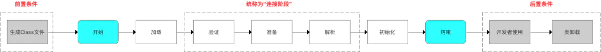
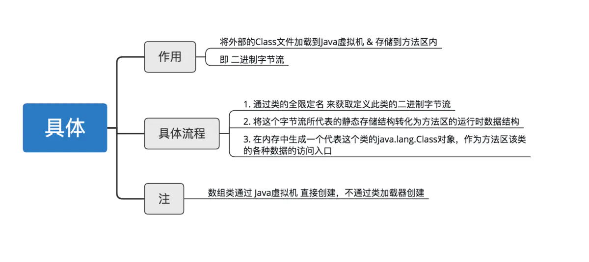
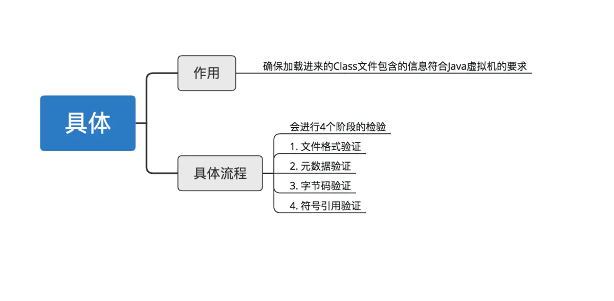
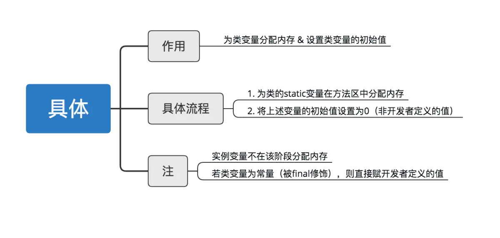
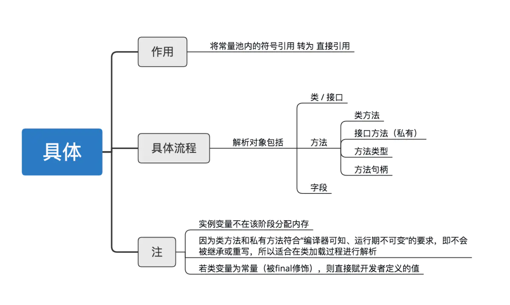
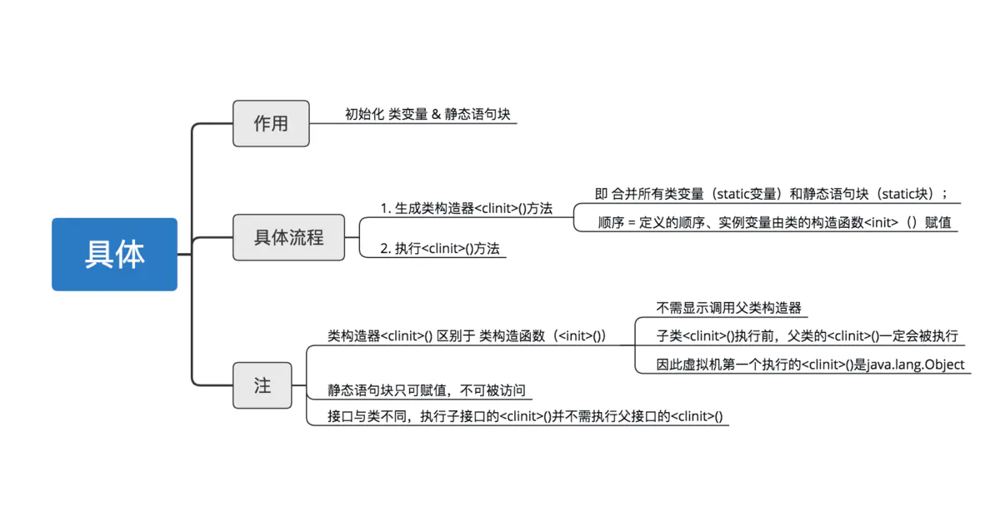
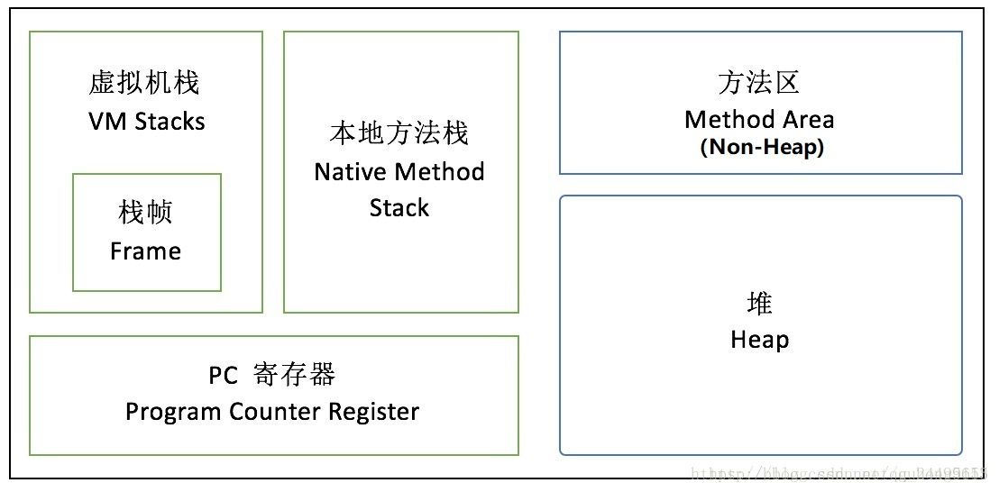
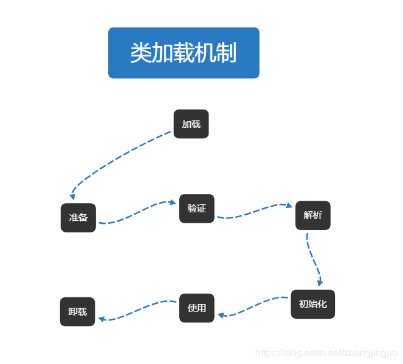
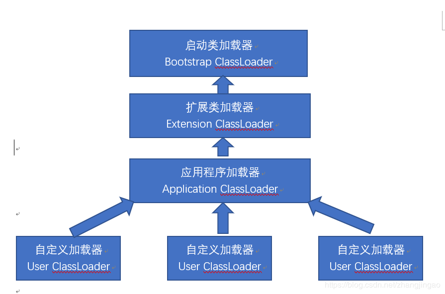
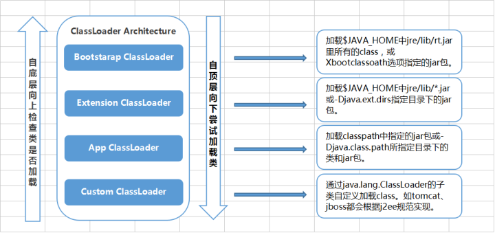

# 面试专题

## JVM

### 1. 内存模型以及分区 需要详细到每个区放什么

Java 内存模型 (即 Java Memory Model，简称 JMM) 本身是一种抽象的概念。

Java 内存模型中分为主内存和工作内存。主内存里面存储着所有变量，主内存是共享内存区域，所有线程都可以访问。

每一个线程都私有一个工作内存，工作内存里面保存着主内存里面变量值的副本，线程对变量的操作都是在工作内存中完成，操作结束后再放回主内存。

主内存可粗略认为是堆，工作内存认为是栈。

操作系统中，一般 CPU 都会从内存取数据到寄存器，然后进行处理，但由于内存的处理速度远远低于 CPU，导致 CPU 在处理指令时往往花费很多时间在等待内存做准备工作，于是在寄存器和主内存间添加了 CPU 缓存，CPU 缓存比较小，但访问速度比主内存快得多。Java 虚拟机在程序执行过程会把 JVM 的内存分为若干个不同的数据区域来管理，这些区域有自己的用途，以及创建和销毁时间。

**JVM 管理的内存区域包括以下几个区域：**


**栈区：**

栈分为 Java 虚拟机栈和本地方法栈

1. 重点是 Java 虚拟机栈，它是线程私有的，生命周期与线程相同
2. 每个方法执行都会创建一个栈帧，用于存放局部变量表，操作栈，动态链接，方法出口等。每个方法从被调用，直到被执行完。对应着一个栈帧在虚拟机中从入栈到出栈的过程
3. 通常说的栈就是指局部变量表部分，存放编译期间可知的 8 种基本数据类型，及对象引用和指令地址。局部变量表是在编译期间完成分配，当进入一个方法时，这个栈中的局部变量分配内存大小是确定的
4. 会有两种异常 StackOverFlowError 和 OutOfMemoneyError。当线程请求栈深度大于虚拟机所允许的深度就会抛出 StackOverFlowError 错误；虚拟机栈动态扩展，当扩展无法申请到足够的内存空间时候，抛出 OutOfMemoneyError
5. 本地方法栈 为虚拟机使用到本地方法服务（native）

**堆区：**

1. 堆被所有线程共享区域，在虚拟机启动时创建，唯一目的存放对象实例
2. 堆区是 GC 的主要区域，通常情况下分为两个区块年轻代和年老代。更细一点年轻代又分为 Eden 区，放新创建对象，From survivor 和 To survivor 保存 GC 后幸存下的对象，默认情况下各自占比 8:1:1
3. 会有异常 OutOfMemoneyError

**方法区：**

1. 被所有线程共享区域，用于存放已被虚拟机加载的类信息，常量，静态变量等数据。被 Java 虚拟机描述为堆的一个逻辑部分。习惯是也叫它永久代（permanmentgeneration）
2. 垃圾回收很少光顾这个区域，不过也是需要回收的，主要针对常量池回收，类型卸载
3. 常量池具有一定的动态性，里面可以存放编译期生成的常量；运行期间的常量也可以添加进入常量池中，比如 String 的 intern() 方法

**程序计数器：**

1. 当前线程所执行的行号指示器。通过改变计数器的值来确定下一条指令，比如循环，分支，跳转，异常处理，线程恢复等都是依赖计数器来完成
2. Java 虚拟机多线程是通过线程轮流切换并分配处理器执行时间的方式实现的。为了线程切换能恢复到正确的位置，每条线程都需要一个独立的程序计数器，所以它是线程私有的
3. 唯一一块 Java 虚拟机没有规定任何 OutofMemoryError 的区块

### 2. 堆里面的分区 Eden (Survival from to) 老年代 各自的特点

1. **Eden 区**

   Eden 区位于 Java 堆的年轻代，是新对象分配内存的地方，由于堆是所有线程共享的，因此在堆上分配内存需要加锁。而 Sun JDK 为提升效率，会为每个新建的线程在 Eden 上分配一块独立的空间由该线程独享，这块空间称为 TLAB（Thread Local Allocation Buffer）。在 TLAB 上分配内存不需要加锁，因此 JVM 在给线程中的对象分配内存时会尽量在 TLAB 上分配。如果对象过大或 TLAB 用完，则仍然在堆上进行分配。如果 Eden 区内存也用完了，则会进行一次 Minor GC（young GC）。

2. **Survival from to**

   Survival 区与 Eden 区相同都在 Java 堆的年轻代。Survival 区有两块，一块称为 from 区，另一块为 to 区，这两个区是相对的，在发生一次 Minor GC 后，from 区就会和 to 区互换。在发生 Minor GC 时，Eden 区和 Survival from 区会把一些仍然存活的对象复制进 Survival to 区，并清除内存。Survival to 区会把一些存活得足够旧的对象移至年老代。

3. **年老代**

   年老代里存放的都是存活时间较久的，大小较大的对象，因此年老代使用标记整理算法。当年老代容量满的时候，会触发一次 Major GC（full GC），回收年老代和年轻代中不再被使用的对象资源。

> 堆里面分为新生代和老生代（Java8 取消了永久代，采用了 Metaspace）。
> 新生代包含 Eden+Survivor 区，Survivor 区里面分为 from 和 to 区。
> 内存回收时，如果用的是复制算法，从 from 复制到 to。
> 当经过一次或者多次 GC 之后，存活下来的对象会被移动到老年区。
> 当 JVM 内存不够用的时候，会触发 Full GC，清理 JVM 老年区。
>
> 当新生区满了之后会触发 YGC, 先把存活的对象放到其中一个 Survice 区，然后进行垃圾清理。
> 因为如果仅仅清理需要删除的对象，这样会导致内存碎片，因此一般会把 Eden 进行完全的清理，然后整理内存。
> 那么下次 GC 的时候，就会使用下一个 Survive，这样循环使用。
> 如果有特别大的对象，新生代放不下，就会使用老年代的担保，直接放到老年代里面。
> 因为 JVM 认为，一般大对象的存活时间一般比较久远。

### 3. 对象创建方法 对象的内存分配 对象的访问定位

1. **对象创建方法：**

   JVM 遇到一条 new 指令时，首先检查这个指令的参数是否能在常量池中定位到一个类的符号引用，并且检查这个符号引用代表的类是否已被加载、连接和初始化过。如果没有，那必须先执行相应的类的加载过程。

2. **对象的内存分配：**

   对象所需内存的大小在类加载完成后便完全确定（对象内存布局），为对象分配空间的任务等同于把一块确定大小的内存从 Java 堆中划分出来。
   根据 Java 堆中是否规整有两种内存的分配方式：

   **指针碰撞：** 所有用过的内存在一边，空闲内存在另一边，中间放着一个指针作为分界点的指示器，分配内存就是把指针往空闲内存那边挪一段与对象大小相等的距离。在使用 Serial，ParNew 等收集器，（也就是用复制算法，标记 - 整理算法的收集器），分配算法通常采用指针碰撞。

   **空闲列表：** 虚拟机维护一个列表，记录哪些内存是可用的，分配的时候从列表中找到一块足够大的空间划分给对象，并更新列表。使用 CMS 这种基于标记 - 清除算法的收集器，通常用空闲列表。

   对象创建在虚拟机中时非常频繁的行为，即使是仅仅修改一个指针指向的位置，在并发情况下也并不是线程安全的，可能出现正在给对象 A 分配内存，指针还没来得及修改，对象 B 又同时使用了原来的指针来分配内存的情况。

   解决这个问题的方案有两种，其中一种虚拟机采用 CAS 配上失败重试的方式保证更新操作的原子性本地线程分配缓冲（Thread Local Allocation Buffer, TLAB）把内存分配的动作按照线程划分为在不同的空间之中进行，即每个线程在 Java 堆中预先分配一小块内存（TLAB）。哪个线程要分配内存，就在哪个线程的 TLAB 上分配。只有 TLAB 用完并分配新的 TLAB 时，才需要同步锁定。

   内存分配完之后，虚拟机要将分配到的内存空间都初始化为零值（不包括对象头），保证了对象的实例字段在 Java 代码中可以不赋初始值就直接使用。

3. **对象的内存布局：**

   对象在内存中可分为 3 个部分，对象头，实例数据，对齐填充。

   对象头的第一部分用于存储对象自身的 **运行时数据**，如对象的哈希码，GC 分代年龄，锁状态标志，线程持有的锁等。

   另一部分是类型指针，即对象指向它的类元数据的指针，通过这个来确定这个对象是哪个类的实例。

   实例数据是对象真正存储的有效信息。

4. **对象的访问定位：**

   程序要通过栈上的 reference 数据来操作堆上的具体对象。对象的访问方式有 **使用句柄** 和 **直接指针**。

   **使用句柄：** Java 堆会划分一块内存作为句柄池，reference 中存的是对象的 **句柄地址**，而句柄中包含了 **对象的实例数据的地址和类型数据的地址（在方法区）**。
   **优点：** 对象被移动，reference 不用修改，只会改变句柄中保存的地址。

   **使用直接指针：** reference 中存的是对象的地址，对象中分一小块内存保存类型数据的地址。
   **优点：** 速度快。

### 4. GC 的两种判定方法

引用计数法：指的是如果某个地方引用了这个对象就 + 1，如果失效了就 - 1，当为 0 就会回收但是 JVM 没有用这种方式，因为无法判定相互循环引用（A 引用 B, B 引用 A）的情况

引用链法： 通过一种 GC ROOT 的对象（方法区中静态变量引用的对象等 - static 变量）来判断，如果有一条链能够到达 GC ROOT 就说明，不能到达 GC ROOT 就说明可以回收

### 5. SafePoint 是什么

SafePoint 是 Java 代码中的一个线程可能暂停执行的位置。SafePoint 保存了在其他位置没有的一些运行时信息。SafePoint 保存了线程上下文中的任何东西，包括对象，指向对象或非对象的内部指针。(原文如下：)

> A safepoint is a place in Java code where a Java thread may halt its execution. The safepoint contains information for the runtime that isn't available in other places, such as which registers contain objects (needed by the GC). The safepoint also guarantees that everything in the thread context is either an object, an internal pointer to an object or not an object.

在 JVM 处于 SafePoint 时，所有在执行代码的 Java 线程将会被暂停。不与 JVM 交互的运行 Native Code 的能继续执行（如果需要通过 JNI 访问 Java 对象，调用 JAVA 方法，从 Native 回到 JAVA 的话，则必须等到 Safepoint 结束）。

SafePoint 的发起者可以做一些疯狂的事情：比如对 Java Object 的排他性访问，移除堆上的对象，改变正在执行方法的代码（比如栈上替换）。排他性访问就是 Why SafePoint 的原因，不至于这个过程中有 Race condition 的问题。

比如 GC 的时候必须要等到 Java 线程都进入到 safepoint 的时候 VMThread 才能开始执行 GC，

1. 循环的末尾 (防止大循环的时候一直不进入 safepoint，而其他线程在等待它进入 safepoint)
2. 方法返回前
3. 调用方法的 call 之后
4. 抛出异常的位置

### 6. GC 的三种收集方法 标记清除 标记整理 复制算法的原理与特点 分别用在什么地方 如果让你优化收集方法 有什么思路

- **第一种：标记清除**

  它是最基础的收集算法

  **原理：** 分为标记和清除两个阶段：首先标记出所有的需要回收的对象，在标记完成以后统一回收所有被标记的对象

  **特点：**

  1. 效率问题，标记和清除的效率都不高
  2. 空间的问题，标记清除以后会产生大量不连续的空间碎片，空间碎片太多可能会导致程序运行过程需要分配较大的对象时候，无法找到足够连续内存而不得不提前触发一次垃圾收集

  **地方 ：** 适合在老年代进行垃圾回收，比如 CMS 收集器就是采用该算法进行回收的

- **第二种：标记整理**

  **原理：** 分为标记和整理两个阶段：首先标记出所有需要回收的对象，让所有存活的对象都向一端移动，然后直接清理掉端边界以外的内存

  **特点：** 不会产生空间碎片，但是整理会花一定的时间

  **地方：** 适合老年代进行垃圾收集，parallel Old（针对 parallel scanvange gc 的） gc 和 Serial old 收集器就是采用该算法进行回收的

- **第三种：复制算法**

  **原理：** 它先将可用的内存按容量划分为大小相同的两块，每次只是用其中的一块。当这块内存用完了，就将还存活着的对象复制到另一块上面，然后把已经使用过的内存空间一次清理掉

  **特点：** 没有内存碎片，只要移动堆顶指针，按顺序分配内存即可。代价是将内存缩小位原来的一半

  **地方：** 适合新生代区进行垃圾回收。serial new，parallel new 和 parallel scanvage 收集器，就是采用该算法进行回收的

  **复制算法改进思路：** 由于新生代都是朝生夕死的，所以不需要 1 ：1 划分内存空间，可以将内存划分为一块较大的 Eden 和两块较小的 Suvivor 空间。每次使用 Eden 和其中一块 Survivor。当回收的时候，将 Eden 和 Survivor 中还活着的对象一次性地复制到另一块 Survivor 空间上，最后清理掉 Eden 和刚才使用过的 Suevivor 空间。其中 Eden 和 Suevivor 的大小比例是 8 ：1。缺点是需要老年代进行分配担保，如果第二块的 Survovor 空间不够的时候，需要对老年代进行垃圾回收，然后存储新生代的对象，这些新生代当然会直接进入来老年代

**优化收集方法的思路**
**分代收集算法**

**原理：** 根据对象存活的周期的不同将内存划分为几块，然后再选择合适的收集算法。

一般是把 Java 堆分成新生代和老年代，这样就可以根据各个年待的特点采用最适合的收集算法。在新生代中，每次垃圾收集都会有大量的对象死去，只有少量存活，所以选用复制算法。老年代因为对象存活率高，没有额外空间对他进行分配担保，所以一般采用标记整理或者标记清除算法进行回收。

### 7. GC 收集器有哪些 CMS 收集器与 G1 收集器的特点

并行收集器：串行收集器使用一个单独的线程进行收集，GC 时服务有停顿时间

串行收集器：次要回收中使用多线程来执行

CMS 收集器是基于 “标记—清除” 算法实现的，经过多次标记才会被清除

G1 从整体来看是基于 “标记—整理” 算法实现的收集器，从局部（两个 Region 之间）上来看是基于 “复制” 算法实现的

### 8. Minor GC 与 Full GC 分别在什么时候发生

**Minor GC:**

1. Eden 区域满了，或者新创建的对象大小 > Eden 所剩空间

2. CMS 设置了 CMSScavengeBeforeRemark 参数，这样在 CMS 的 Remark 之前会先做一次 Minor GC 来清理新生代，加速之后的 Remark 的速度。这样整体的 stop the world 时间反而短

3. Full GC 的时候会先触发 Minor GC。执行 Minor GC 需要注意：

   - 当 JVM 无法为一个新的对象分配空间时会触发 Minor GC，比如当 Eden 区满了。所以分配率越高，越频繁执行 Minor GC。

   - 内存池被填满的时候，其中的内容全部会被复制，指针会从 0 开始跟踪空闲内存。Eden 和 Survivor 区进行了标记和复制操作，取代了经典的标记、扫描、压缩、清理操作。所以 Eden 和 Survivor 区不存在内存碎片。写指针总是停留在所使用内存池的顶部。

   - 执行 Minor GC 操作时，不会影响到永久代。从永久代到年轻代的引用被当成 GC roots，从年轻代到永久代的引用在标记阶段被直接忽略掉。

   - 质疑常规的认知，所有的 Minor GC 都会触发 “全世界的暂停 (stop the world)”，停止应用程序的线程。对于大部分应用程序，停顿导致的延迟都是可以忽略不计的。其中的真相就是，大部分 Eden 区中的对象都能被认为是垃圾，永远也不会被复制到 Survivor 区或者老年代空间。如果正好相反，Eden 区大部分新生对象不符合 GC 条件，Minor GC 执行时暂停的时间将会长很多。

**Major GC:**

    清理永久代，但是由于很多 Mojor GC 是由 Minor GC 触发的，所以有时候很难将 Major GC 和 Minor GC 区分开。

**Full GC：**

    是清理整个堆空间—包括年轻代和永久代。Full GC 一般消耗的时间比较长，远远大于 Minor GC，因此，有时候我们必须降低 Full GC 发生的频率。

1. Minor GC 后存活的对象晋升到老年代时由于悲观策略的原因，有两种情况会触发 Full GC

   - 之前每次晋升的对象的平均大小 > 老年代剩余空间
   - Minor GC 后存活的对象超过了老年代剩余空间

   这两种情况都是因为老年代会为新生代对象的晋升提供担保，而每次晋升的对象的大小是无法预测的，所以只能基于统计，1 个是基于历史平均水平，一个是基于下一次可能要晋升的最大水平。
   这两种情况都是属于 promotion failure

2. CMS 失败，发生 concurrent mode failure 会引起 Full GC，这种情况下会使用 Serial Old 收集器，是单线程的，对 GC 的影响很大。concurrent mode failure 产生的原因是老年代剩余的空间不够，导致了和 gc 线程并发执行的用户线程创建的大对象 (由 PretenureSizeThreshold 控制新生代直接晋升老年代的对象 size 阀值) 不能进入到老年代，只要 stop the world 来暂停用户线程，执行 GC 清理。可以通过设置 CMSInitiatingOccupancyFraction 预留合适的 CMS 执行时剩余的空间

3. 新生代直接晋升到老年代的大对象超过了老年代的剩余空间，引发 Full GC。注意于 promotion failure 的区别，promotion failure 指的是 Minor GC 后发生的担保失败

4. Perm 永久代空间不足会触发 Full GC，可以让 CMS 清理永久代的空间。设置 CMSClassUnloadingEnabled 即可

5. System.gc() 引起的 Full GC，可以设置 DisableExplicitGC 来禁止调用 System.gc 引发 Full GC

### 9. 几种常用的 JVM 监控工具

**jps:**

1. 介绍

    用来查看基于 HotSpot JVM 里面所有进程的具体状态, 包括进程 ID，进程启动的路径等等。与 unix 上的 ps 类似，用来显示本地有权限的 Java 进程，可以查看本地运行着几个 Java 程序，并显示他们的进程号。使用 jps 时，不需要传递进程号做为参数
    Jps 也可以显示远程系统上的 Java 进程，这需要远程服务上开启了 jstat 服务，以及 RMI 注及服务，不过常用都是对本对的 Java 进程的查看

2. 命令格式

        ```Shell
        jps [options] [ hostid ]
        ```

3. 常用参数说明

    `-m` 输出传递给 main 方法的参数，如果是内嵌的 JVM 则输出为 null
    `-l` 输出应用程序主类的完整包名，或者是应用程序 JAR 文件的完整路径
    `-v` 输出传给 JVM 的参数

**jstat:**

1. 介绍

   jstat 是 JDK 自带的一个轻量级小工具。全称 "Java Virtual Machine statistics monitoring tool"，它位于 Java 的 bin 目录下，主要利用 JVM 内建的指令对 Java 应用程序的资源和性能进行实时的命令行的监控，包括了对 Heap size 和垃圾回收状况的监控

   可见，Jstat 是轻量级的、专门针对 JVM 的工具，非常适用。由于 JVM 内存设置较大，图中百分比变化不太明显一个极强的监视 VM 内存工具。可以用来监视 VM 内存内的各种堆和非堆的大小及其内存使用量

   jstat 工具特别强大，有众多的可选项，详细查看堆内各个部分的使用量，以及加载类的数量

   使用时，需加上查看进程的进程 id，和所选参数

   它主要是用来显示 GC 及 PermGen 相关的信息，否则其中即使你会使用 jstat 这个命令，你也看不懂它的输出

2. 命令格式

        ````Shell
        jstat [generalOption | outputOptions vmid [interval[s|ms] [count]] ]
        ```

3. 参数说明

   1. `generalOption` ：单个的常用的命令行选项，如 `-help` , `-options` , 或 `-version`
   2. `outputOptions` ：一个或多个输出选项，由单个的 statOption 选项组件，可以 `-t` , `-h` , `-J` 选项配合使用

        statOption：
        -class Option
        -compiler Option
        -gc Option
        -gccapacity Option
        -gccause Option
        -gcnew Option
        -gcnewcapacity Option
        -gcold Option
        -gcoldcapacity Option
        -gcpermcapacity Option
        -gcutil Option
        -printcompilation Option

        注：其中最常用的就是 - gcutil 选项了，因为他能够给我们展示大致的 GC 信息

        Option：指的是 vmid、显示间隔时间及间隔次数等
        vmid    — VM 的进程号，即当前运行的 java 进程号
        interval– 间隔时间，单位为秒或者毫秒
        count   — 打印次数，如果缺省则打印无数次

   3. jstat 命令输出参数说明

        S0  — Heap 上的 Survivor space 0 区已使用空间的百分比
        S0C：S0 当前容量的大小
        S0U：S0 已经使用的大小
        S1  — Heap 上的 Survivor space 1 区已使用空间的百分比
        S1C：S1 当前容量的大小
        S1U：S1 已经使用的大小
        E   — Heap 上的 Eden space 区已使用空间的百分比
        EC：Eden space 当前容量的大小
        EU：Eden space 已经使用的大小
        O   — Heap 上的 Old space 区已使用空间的百分比
        OC：Old space 当前容量的大小
        OU：Old space 已经使用的大小
        P   — Perm space 区已使用空间的百分比
        OC：Perm space 当前容量的大小
        OU：Perm space 已经使用的大小
        YGC — 从应用程序启动到采样时发生 Young GC 的次数
        YGCT– 从应用程序启动到采样时 Young GC 所用的时间 (单位秒)
        FGC — 从应用程序启动到采样时发生 Full GC 的次数
        FGCT– 从应用程序启动到采样时 Full GC 所用的时间 (单位秒)
        GCT — 从应用程序启动到采样时用于垃圾回收的总时间 (单位秒)，它的值等于 YGC+FGC

**jmap:**(常用)

1. 介绍

    打印出某个 Java 进程（使用 pid ）内存内的，所有对象的情况（如：产生那些对象，及其数量）
    可以输出所有内存中对象的工具，甚至可以将 VM 中的 heap ，以二进制输出成文本。使用方法 `jmap -histo pid` 。
    如果连用 SHELL `jmap -histo pid > a.log` 可以将其保存到文本中去，在一段时间后，使用文本对比工具，可以对比出 GC 回收了哪些对象`jmap -dump:format=b,file=outfile 3024` 可以将 3024 进程的内存 heap 输出出来到 outfile 文件里，再配合 MAT（内存分析工具 (Memory Analysis Tool）或与 jhat (Java Heap Analysis Tool) 一起使用，能够以图像的形式直观的展示当前内存是否有问题

    64 位机上使用需要使用如下方式：
    `jmap -J-d64 -heap pid`
2. 命令格式

        ``` Shell
        SYNOPSIS
        jmap [option] pid
        jmap [option] executable core
        jmap [option] [server-id@]remote-hostname-or-IP
        ```

3. 参数说明

   1. `options` ：executable Java executable from which the core dump was produced
    (可能是产生 core dump 的 Java 可执行程序)
    `core` 将被打印信息的 core dump 文件
    `remote-hostname-or-IP` 远程 debug 服务的主机名或 ip
    `server-id` 唯一 id , 假如一台主机上多个远程 debug 服务

   2. 基本参数：
    `-dump:[live,]format=b,file=<filename>` 使用 hprof 二进制形式, 输出 JVM 的 heap 内容到文件 = . live 子选项是可选的，假如指定 live 选项, 那么只输出活的对象到文件
    `-finalizerinfo` 打印正等候回收的对象的信息
    `-heap` 打印 heap 的概要信息，GC 使用的算法，heap 的配置及 wise heap 的使用情况
    `-histo[:live]` 打印每个 class 的实例数目, 内存占用, 类全名信息. VM 的内部类名字开头会加上前缀”*”. 如果 live 子参数加上后, 只统计活的对象数量
    `-permstat` 打印 classload 和 JVM heap 长久层的信息. 包含每个 classloader 的名字, 活泼性, 地址, 父 classloader 和加载的 class 数量. 另外, 内部 String 的数量和占用内存数也会打印出来
    `-F` 强迫. 在 pid 没有相应的时候使用 -dump 或者 -histo 参数. 在这个模式下, live 子参数无效
    `-h | -help` 打印辅助信息
    `-J` 传递参数给 jmap 启动的 JVM
    `pid` 需要被打印配相信息的 Java 进程 id , 可以用 jps 查问

**jstack:**

1. 介绍

    jstack 用于打印出给定的 Java 进程 ID 或 core file 或远程调试服务的 Java 堆栈信息，如果是在 64 位机器上，需要指定选项 `-J-d64` ，Windows 的 jstack 使用方式只支持以下的这种方式： `jstack [-l] pid`
    如果 Java 程序崩溃生成 core 文件，jstack 工具可以用来获得 core 文件的 Java Stack 和 Native Stack 的信息，从而可以轻松地知道 Java 程序是如何崩溃和在程序何处发生问题
    另外，jstack 工具还可以附属到正在运行的 Java 程序中，看到当时运行的 Java 程序的 Java Stack 和 Native Stack 的信息, 如果现在运行的 Java 程序呈现 hung 的状态，jstack 是非常有用的

2. 命令格式

        ``` Shell
        jstack [option] pid
        jstack [option] executable core
        jstack [option] [server-id@]remote-hostname-or-IP
        ```

3. 常用参数说明
    1. `options` ：executable Java executable from which the core dump was produced.

        (可能是产生 core dump 的 java 可执行程序)
        `core` 将被打印信息的 core dump 文件
        `remote-hostname-or-IP` 远程 debug 服务的主机名或 ip
        `server-id` 唯一 id, 假如一台主机上多个远程 debug 服务

    2. 基本参数：

        `-F` 当 `jstack [-l] pid` 没有相应的时候强制打印栈信息
        `-l` 长列表. 打印关于锁的附加信息, 例如属于 java.util.concurrent 的 ownable synchronizers 列表
        `-m` 打印 java 和 native c/c++ 框架的所有栈信息.
        `-h | -help` 打印帮助信息
        `pid` 需要被打印配置信息的 Java 进程 id, 可以用 jps 查询

**jconsole 和 jvisualvm:**

- jconsole:

    一个 Java GUI 监视工具，可以以图表化的形式显示各种数据。并可通过远程连接监视远程的服务器 VM。用 Java 写的 GUI 程序，用来监控 VM，并可监控远程的 VM，非常易用，而且功能非常强。命令行里打 jconsole，选则进程就可以了

    需要注意的就是在运行 jconsole 之前，必须要先设置环境变量 DISPLAY，否则会报错误，Linux 下设置环境变量如下： `export DISPLAY=:0.0`
- jvisualvm:

    同 jconsole 都是一个基于图形化界面的、可以查看本地及远程的 JAVA GUI 监控工具，Jvisualvm 同 jconsole 的使用方式一样，直接在命令行打入 Jvisualvm 即可启动，不过 Jvisualvm 相比，界面更美观一些，数据更实时

**jhat:**

jhat 用于对 Java heap 进行离线分析的工具，他可以对不同虚拟机中导出的 heap 信息文件进行分析，如 Linux 上导出的文件可以拿到 windows 上进行分析，可以查找诸如内存方面的问题，不过 jhat 和 MAT 比较起来，就没有 MAT 那么直观了，MAT 是以图形界面的方式展现结果

### 10. 类加载的几个过程

**类加载本质：**

将描述类的数据 从 Class 文件加载到内存 & 对数据进行校验、转换解析 和 初始化，最终形成可被虚拟机直接使用的 Java 使用类型

> Class 文件是一串二进制字节流

**类加载过程：**



1. **加载**

    

2. **验证**

    

3. **准备**

    

4. **解析**

    

5. **初始化**

    

### 11. JVM 内存分哪几个区每个区的作用是什么

JVM 内存区域分为五个部分，分别是堆，方法区，虚拟机栈，本地方法栈，程序计数器



1. 方法区

   1. 有时候也成为永久代，在该区内很少发生垃圾回收，但是并不代表不发生 GC，在这里进行的 GC 主要是对方法区里的常量池和对类型的卸载
   2. 方法区主要用来存储已被虚拟机加载的类的信息、常量、静态变量和即时编译器编译后的代码等数据
   3. 该区域是被线程共享的
   4. 方法区里有一个运行时常量池，用于存放静态编译产生的字面量和符号引用。该常量池具有动态性，也就是说常量并不一定是编译时确定，运行时生成的常量也会存在这个常量池中

2. 虚拟机栈

   1. 虚拟机栈也就是我们平常所称的栈内存, 它为 Java 方法服务，每个方法在执行的时候都会创建一个栈帧，用于存储局部变量表、操作数栈、动态链接和方法出口等信息
   2. 虚拟机栈是线程私有的，它的生命周期与线程相同
   3. 局部变量表里存储的是基本数据类型、returnAddress 类型（指向一条字节码指令的地址）和对象引用，这个对象引用有可能是指向对象起始地址的一个指针，也有可能是代表对象的句柄或者与对象相关联的位置。局部变量所需的内存空间在编译器间确定
   4. 操作数栈的作用主要用来存储运算结果以及运算的操作数，它不同于局部变量表通过索引来访问，而是压栈和出栈的方式
   5. 每个栈帧都包含一个指向运行时常量池中该栈帧所属方法的引用，持有这个引用是为了支持方法调用过程中的动态连接. 动态链接就是将常量池中的符号引用在运行期转化为直接引用

3. 本地方法栈

    本地方法栈和虚拟机栈类似，只不过本地方法栈为 Native 方法服务

4. 堆

    Java 堆是所有线程所共享的一块内存，在虚拟机启动时创建，几乎所有的对象实例都在这里创建，因此该区域经常发生垃圾回收操作

5. 程序计数器

    内存空间小，字节码解释器工作时通过改变这个计数值可以选取下一条需要执行的字节码指令，分支、循环、跳转、异常处理和线程恢复等功能都需要依赖这个计数器完成。该内存区域是唯一一个 Java 虚拟机规范没有规定任何 OOM 情况的区域

### 12. 如和判断一个对象是否存活?(或者 GC 对象的判定方法)

判断一个对象是否存活有两种方法:

1. 引用计数法

    所谓引用计数法就是给每一个对象设置一个引用计数器，每当有一个地方引用这个对象时，就将计数器加一，引用失效时，计数器就减一。当一个对象的引用计数器为零时，说明此对象没有被引用，也就是 “死对象”, 将会被垃圾回收.
    引用计数法有一个缺陷就是无法解决循环引用问题，也就是说当对象 A 引用对象 B，对象 B 又引用者对象 A，那么此时 A,B 对象的引用计数器都不为零，也就造成无法完成垃圾回收，所以主流的虚拟机都没有采用这种算法。

2. 可达性算法 (引用链法)

    该算法的思想是：从一个被称为 GC Roots 的对象开始向下搜索，如果一个对象到 GC Roots 没有任何引用链相连时，则说明此对象不可用。

    在 Java 中可以作为 GC Roots 的对象有以下几种:

    - 虚拟机栈中引用的对象
    - 方法区类静态属性引用的对象
    - 方法区常量池引用的对象
    - 本地方法栈 JNI 引用的对象

    虽然这些算法可以判定一个对象是否能被回收，但是当满足上述条件时，一个对象比不一定会被回收。当一个对象不可达 GC Root 时，这个对象并不会立马被回收，而是出于一个死缓的阶段，若要被真正的回收需要经历两次标记
    如果对象在可达性分析中没有与 GC Root 的引用链，那么此时就会被第一次标记并且进行一次筛选，筛选的条件是是否有必要执行 finalize() 方法。当对象没有覆盖 finalize() 方法
    或者已被虚拟机调用过，那么就认为是没必要的
    如果该对象有必要执行 finalize() 方法，那么这个对象将会放在一个称为 F-Queue 的对队列中，虚拟机会触发一个 Finalize() 线程去执行，此线程是低优先级的，并且虚拟机不会承诺一直等待它运行完，这是因为如果 finalize() 执行缓慢或者发生了死锁，那么就会造成 F-Queue 队列一直等待，造成了内存回收系统的崩溃。GC 对处于 F-Queue 中的对象进行第二次被标记，这时，该对象将被移除” 即将回收” 集合，等待回收

### 13. 简述 Java 垃圾回收机制

在 Java 中，程序员是不需要显示的去释放一个对象的内存的，而是由虚拟机自行执行。

在 JVM 中，有一个垃圾回收线程，它是低优先级的，在正常情况下是不会执行的，只有在虚拟机空闲或者当前堆内存不足时，才会触发执行，扫面那些没有被任何引用的对象，并将它们添加到要回收的集合中，进行回收。

### 14. Java 中垃圾收集的方法有哪些

1. 标记 - 清除

    这是垃圾收集算法中最基础的，根据名字就可以知道，它的思想就是标记哪些要被回收的对象，然后统一回收。这种方法很简单，但是会有两个主要问题

    1. 效率不高，标记和清除的效率都很低
    2. 会产生大量不连续的内存碎片，导致以后程序在分配较大的对象时，由于没有充足的连续内存而提前触发一次 GC 动作
2. 复制算法

    为了解决效率问题，复制算法将可用内存按容量划分为相等的两部分，然后每次只使用其中的一块，当一块内存用完时，就将还存活的对象复制到第二块内存上，然后一次性清楚完第一块内存，再将第二块上的对象复制到第一块。但是这种方式，内存的代价太高，每次基本上都要浪费一般的内存
    于是将该算法进行了改进，内存区域不再是按照 1：1 去划分，而是将内存划分为 8:1:1 三部分，较大那份内存交 Eden 区，其余是两块较小的内存区叫 Survior 区
    每次都会优先使用 Eden 区，若 Eden 区满，就将对象复制到第二块内存区上，然后清除 Eden 区，如果此时存活的对象太多，以至于 Survivor 不够时，会将这些对象通过分配担保机制复制到老年代中。(java 堆又分为新生代和老年代)

3. 标记 - 整理

    该算法主要是为了解决标记 - 清除，产生大量内存碎片的问题；当对象存活率较高时，也解决了复制算法的效率问题
    它的不同之处就是在清除对象的时候现将可回收对象移动到一端，然后清除掉端边界以外的对象，这样就不会产生内存碎片了

4. 分代收集

    现在的虚拟机垃圾收集大多采用这种方式，它根据对象的生存周期，将堆分为新生代和老年代
    在新生代中，由于对象生存期短，每次回收都会有大量对象死去，那么这时就采用复制算法
    老年代里的对象存活率较高，没有额外的空间进行分配担保，所以可以使用标记 - 整理 或者 标记 - 清除

### 15. Java 内存模型

Java 内存模型 (JMM) 是线程间通信的控制机制. JMM 定义了主内存和线程之间抽象关系。

线程之间的共享变量存储在主内存（main memory）中，每个线程都有一个私有的本地内存（local memory），本地内存中存储了该线程以读 / 写共享变量的副本。

本地内存是 JMM 的一个抽象概念，并不真实存在。它涵盖了缓存，写缓冲区，寄存器以及其他的硬件和编译器优化。

Java 内存模型的抽象示意图如下：


从上图来看，线程 A 与线程 B 之间如要通信的话，必须要经历下面 2 个步骤：

1. 首先，线程 A 把本地内存 A 中更新过的共享变量刷新到主内存中去
2. 然后，线程 B 到主内存中去读取线程 A 之前已更新过的共享变量

### 16. Java 类加载过程

Java 类加载需要经历一下 5 个过程：

1. 加载 加载时类加载的第一个过程，在这个阶段，将完成一下三件事情

   1. 通过一个类的全限定名获取该类的二进制流
   2. 将该二进制流中的静态存储结构转化为方法去运行时数据结构
   3. 在内存中生成该类的 Class 对象，作为该类的数据访问入口

2. 验证 验证的目的是为了确保 Class 文件的字节流中的信息不回危害到虚拟机. 在该阶段主要完成以下四钟验证

   1. 文件格式验证：验证字节流是否符合 Class 文件的规范，如主次版本号是否在当前虚拟机范围内，常量池中的常量是否有不被支持的类型
   2. 元数据验证: 对字节码描述的信息进行语义分析，如这个类是否有父类，是否集成了不被继承的类等
   3. 字节码验证：是整个验证过程中最复杂的一个阶段，通过验证数据流和控制流的分析，确定程序语义是否正确，主要针对方法体的验证。如：方法中的类型转换是否正确，跳转指令是否正确等
   4. 符号引用验证：这个动作在后面的解析过程中发生，主要是为了确保解析动作能正确执行

3. 准备

    准备阶段是为类的静态变量分配内存并将其初始化为默认值，这些内存都将在方法区中进行分配。准备阶段不分配类中的实例变量的内存，实例变量将会在对象实例化时随着对象一起分配在 Java 堆中。 `public static int value=123;// 在准备阶段 value 初始值为 0 。在初始化阶段才会变为 123`
4. 解析

    该阶段主要完成符号引用到直接引用的转换动作。解析动作并不一定在初始化动作完成之前，也有可能在初始化之后。

5. 初始化

    初始化时类加载的最后一步，前面的类加载过程，除了在加载阶段用户应用程序可以通过自定义类加载器参与之外，其余动作完全由虚拟机主导和控制。到了初始化阶段，才真正开始执行类中定义的 Java 程序代码。

### 17. 简述 Java 类加载机制

虚拟机将描述类的数据从 class 文件加载到内存中，对加载的数据进行验证，解析，初始化，最后得到虚拟机认可后转化为直接可以使用的 Java 类型的过程

类加载机制一共有七个阶段：加载，验证，准备，解析，初始化，使用，卸载。其中的验证，准备，解析合称为连接阶段

加载，验证，准备，初始化，卸载的顺序是确定的，另两个由动态绑定等情况可能会在初始化后面



### 18. 类加载器双亲委派模型机制

类加载器有是三个：启动类加载器、扩展类加载器、应用程序加载器（系统加载器）



**工作过程是：** 如果一个类加载器收到了一个类加载的请求，它首先不会去加载类，而是去把这个请求委派给父加载器去加载，直到顶层启动类加载器，如果父类加载不了（不在父类加载的搜索范围内），才会自己去加载。

1. 启动类加载器：加载的是 lib 目录中的类加载出来，包名是 `java.xxx` （如： `java.lang.Object` ）
2. 扩展类加载器：加载的是 lib/ext 目录下的类，包名是 `javax.xxx` （如： `javax.swing.xxx` ）
3. 应用程序扩展器：这个加载器就是 ClassLoader 的 getSystemClassLoader 的返回值，这个也是默认的类加载器。

双亲委派模型的意义在于不同的类之间分别负责所搜索范围内的类的加载工作，这样能保证同一个类在使用中才不会出现不相等的类，举例：如果出现了两个不同的 Object，明明是该相等的业务逻辑就会不相等，应用程序也会变得混乱。

### 19. 什么是类加载器 类加载器有哪些

实现通过类的权限定名获取该类的二进制字节流的代码块叫做类加载器



主要有一下四种类加载器:

1. 启动类加载器 (Bootstrap ClassLoader) 用来加载 Java 核心类库，无法被 Java 程序直接引用
2. 扩展类加载器 (extensions class loader): 它用来加载 Java 的扩展库。Java 虚拟机的实现会提供一个扩展库目录。该类加载器在此目录里面查找并加载 Java 类
3. 系统类加载器（system class loader）：它根据 Java 应用的类路径（CLASSPATH）来加载 Java 类。一般来说，Java 应用的类都是由它来完成加载的。可以通过 ClassLoader.getSystemClassLoader() 来获取它
4. 用户自定义类加载器，通过继承 java.lang.ClassLoader 类的方式实现

### 20. 简述 Java 内存分配与回收策率以及 Minor GC 和 Major GC

**内存分配：**

1. 栈区：栈可分为 Java 虚拟机和本地方法栈
2. 堆区：堆被所有线程共享，在虚拟机启动时创建，是唯一的目的是存放对象实例，是 gc 的主要区域。通常可分为两个区块年轻代和年老代。更新一点年轻代可分为 Eden 区，主要放新创建对象，From survivor 和 To survivor 保存 gc 后幸存下的对象，默认情况下各自占比 8:1:1。
3. 方法区：被所有线程共享，用于存放已被虚拟机加载的信息，常量，静态变量等，是 Java 虚拟机描述为堆的一个逻辑部分。习惯被称为永久代。
4. 程序计数器：是当前线程所执行的行号指示器，跳转指令等都依赖这个完成，线程私有。

**回收策略以及 Minor GC 和 Major GC(Full GC):**

1. 对象优先在堆的 Eden 区分配
2. 大对象直接进入老年代
3. 长期存活的对象将直接进入老年代

**回收：**

当 Eden 区没有足够的空间进行分配时，虚拟机会执行一次 Minor GC. Minor Gc 通常发生在新生代的 Eden 区，在这个区的对象生存期短，往往发生 Gc 的频率较高，回收速度比较快。

Full Gc/Major GC 发生在老年代，一般情况下，触发老年代 GC 的时候不会触发 Minor GC, 但是通过配置，可以在 Full GC 之前进行一次 Minor GC 这样可以加快老年代的回收速度。
