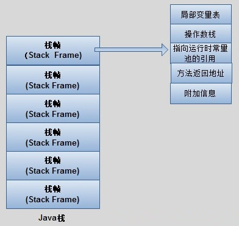
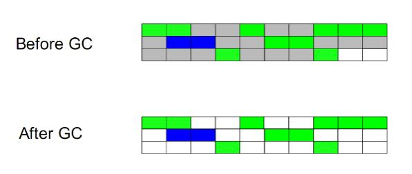
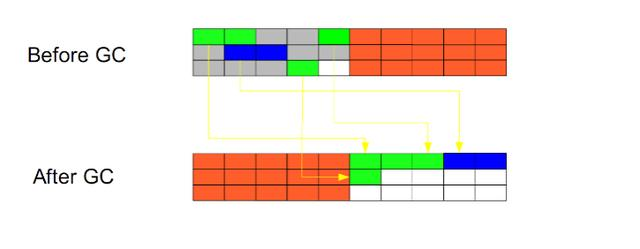
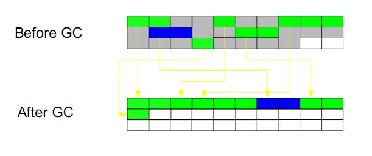
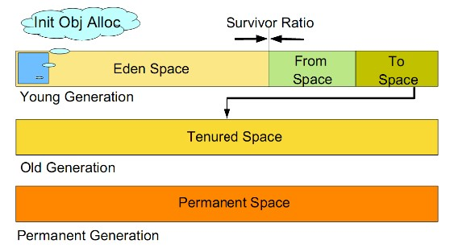
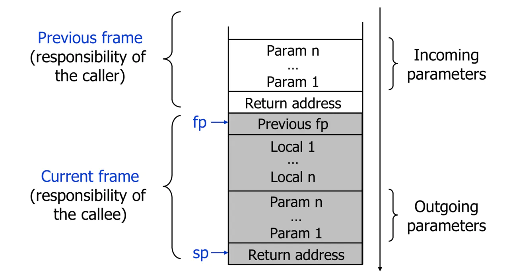

# JVM 与性能优化知识

## JVM 内存区域划分

### 1.程序计数器（线程私有）

程序计数器（Program Counter Register），也有称作为 PC 寄存器。

保存的是程序当前执行的指令的地址（也可以说保存下一条指令的所在存储单元的地址），当 CPU 需要执行指令时，需要从程序计数器中得到当前需要执行的指令所在存储单元的地址，然后根据得到的地址获取到指令，在得到指令之后，程序计数器便自动加 1 或者根据转移指针得到下一条指令的地址，如此循环，直至执行完所有的指令。也就是说是**用来指示执行哪条指令的**。

由于在 JVM 中，多线程是通过**线程轮流切换来获得 CPU 执行时间的**，因此，在任一具体时刻，一个 CPU 的内核只会执行一条线程中的指令，因此，为了能够使得每个线程都在线程切换后能够恢复在切换之前的程序执行位置，每个线程都需要有自己独立的程序计数器，并且不能互相被干扰，否则就会影响到程序的正常执行次序。因此，可以这么说，程序计数器是**每个线程所私有的**。

在 JVM 规范中规定，如果线程执行的是非 native 方法，则程序计数器中保存的是当前需要执行的指令的地址；如果线程执行的是 **native 方法**，则程序计数器中的值是 **undefined**。
由于程序计数器中存储的数据所占空间的大小不会随程序的执行而发生改变，因此，对于程序计数器是不会发生内存溢出现象(OutOfMemory)的。

**异常情况**： 不存在

### 2.Java 栈（线程私有）

Java 栈也称作虚拟机栈（Java Vitual Machine Stack）

Java 栈中存放的是一个个的栈帧，**每个栈帧对应一个被调用的方法**，在栈帧中包括**局部变量表、操作数栈、指向当前方法所属的类的运行时常量池的引用、方法返回地址、额外的附加信息**。当线程执行一个方法时，就会随之创建一个对应的栈帧，并将建立的栈帧压栈。当方法执行完毕之后，便会将栈帧出栈。因此可知，线程**当前执行的方法**所对应的栈帧必定位于 **Java 栈的顶部**。



**局部变量表**，用来**存储**方法中的局部变量（包括在方法中**声明的非静态变量以及函数形参**）。对于**基本数据类型**的变量，则**直接存储**它的值，对于**引用类型**的变量，则**存的**是指向**对象**的**引用**。局部变量表的大小在编译器就可以确定其大小了，因此在程序执行期间局部变量表的大小是不会改变的。

**存储内容：**引用对象，returnAddress 类型。Long 和 double 类型占用 2 个局部变量空间，其余的数据类型占据一个。局部变量表空间在编译期间完成分配。

**操作数栈，**栈最典型的一个应用就是用来**对表达式求值**。想想一个线程执行方法的过程中，实际上就是不断执行语句的过程，而归根到底就是进行计算的过程。因此可以这么说，程序中的**所有计算过程**都是在借助于**操作数栈来完成的**。

指向运行时常量池的引用，因为在方法执行的过程中有可能需要用到类中的常量，所以必须要有一个引用指向运行时常量。

方法返回地址，当一个方法执行完毕之后，要返回之前调用它的地方（**参考汇编**），因此在栈帧中必须保存一个方法返回地址。

由于每个线程正在执行的方法可能不同，因此每个线程都会有一个自己的 Java 栈**线程私有，互不干扰**。

**异常情况：**

1. 栈深度大于已有深度：StackOverflowError
2. 可扩展深度大于能够申请的内存：OutOfMemoryError

### 3.本地方法栈（线程私有）

本地方法栈与 Java 栈的作用和原理非常相似。区别只不过是 **Java 栈**是为执行 **Java 方法服务的**，而**本地方法栈**则是为**执行本地方法（Native Method）服务**的。在JVM 规范中，并没有对本地方发展的具体实现方法以及数据结构作强制规定，虚拟机可以自由实现它。在 **HotSopt 虚拟机中直接就把本地方法栈和 Java 栈合二为一**。

**异常情况：**

1. 栈深度大于已有深度：StackOverflowError
2. 可扩展深度大于能够申请的内存：OutOfMemoryError

### 4.堆（线程共享）

**Java 中**的堆是用来**存储对象本身**的以**及数组**（当然，数组引用是存放在 Java 栈中的），堆是被所有**线程共享**的，在 JVM 中只有一个堆。所有对象实例以及数组都要在堆上分配内存，单随着 JIT 发展，**栈上分配，标量替换优化技术**，在堆上分配变得不那么到绝对，只能在 **server 模式下**才能启用**逃逸分析**。

栈上分配：

1. 一是逃逸分析：逃逸分析的目的是判断对象的作用域是否有可能逃逸出函数体。
2. 二是标量替换：允许将对象打散分配在栈上，比如若一个对象拥有两个字段，会将这两个字段视作局部变量进行分配。

垃圾收集器管理的主要区域，很多时候被称作 **GC 堆**。现在收集器基本采用分代收集算法：新生代和老年代，再细致点 Eden 空间，From Survivor 空间，ToSurvivor 空间等。

**异常情况：**

1. 可以处于物理上不连续的内存空间，逻辑连续即可。既可实现固定大小，也可扩展。如果堆中没有内存
完成实例分配，并且堆无法再扩展是，将会抛出 OutOfMemoryError；

### 5.方法区（线程共享）

1. 方法区中，**存储**了每个**类**的**信息**（包括类的名称、方法信息、字段信息）、**静态变量、常量**以及**编译器编译后的代码**等。
在 Class 文件中除了类的字段、方法、接口等描述信息外，还有一项信息是**常量池**，用来**存储**编译期间生成的**字面量**和符号**引用**。

2. 方法区还有一块内存，**运行时常量池**，它是每一个类或接口的常量池的运行时表示形式，在**类**和接口被**加载**到 JVM 后，对应的运行时**常量池**就**被创建**出来。当然**并非 Class** 文件常量池中的内容**才能进入运行时常量池**，在**运行期间也可将新的常量放入运行时常量池中**，比如 **String** 的 **intern** 方法。

在 JVM 规范中，没有强制要求方法区必须实现垃圾回收。很多人习惯将**方法区称为“永久代”**，是因为 HotSpot 虚拟机以永久代来实现方法区，从而 JVM 的**垃圾收集器**可以像管理堆区一样**管理这部分区域**，从而不需要专门为这部分设计垃圾回收机制。不过自从 **JDK7 之后**，Hotspot 虚拟机便将**运行时常量池从永久代移除**了。

**异常情况：**

1. 方法区调用递归，内存会溢出，报 OutOfMemoryError；
2. 当常量池无法再申请到内存时 OutOfMemoryError；

### 6.直接内存（线程共享）

NIO,使用 native 函数库直接分配堆外内存，不经过 JVM 内存直接访问系统物理内存的类——DirectBuffer。 DirectBuffer 类继承自 ByteBuffer，但和普通的 ByteBuffer 不同，普通的 ByteBuffer 仍在 JVM 堆上分配内存，其最大内存受到最大堆内存的限制；而DirectBuffer 直接分配在物理内存中，并不占用堆空间，其可申请的最大内存受操作系统限制。

**堆内存比较：**

1. 直接内存申请空间耗费更高的性能，当频繁申请到一定量时尤为明显
2. 直接内存 IO 读写的性能要优于普通的堆内存，在多次读写操作的情况下差异明显

**异常情况：**

1. DirectBuffer 分配内存溢出

## 对象

### 1.对象访问

对象访问在 Java 语言中无处不在，即使是最简单的访问，也会涉及到 Java 栈，Java 堆，方法区这三个最重要的内存区域之间的关联关系。如下面的代码：

`Object obj = new Object();`

假设这段代码出现在方法体中，那么“Object obj”部分的语义将会反映到 Java 栈的本地变量表中，作为一个 reference 类型的数据存在。而“new Object();”部分的语义将会反应到 Java 堆中，形成一块存储 Object 类型所有实例数据值（Instance Data）的结构化内存，根据具体类型以及虚拟机实现的对象分布的不同，这块内存的长度是不固定的。另外，在 Java 堆中还必须包含能查找到此对象内存数据的地址信息，这些类型数据则存储在方法区中。

由于 reference 类型在 Java 虚拟机中之规定了指向对象的引用，并没有规定这个引用要通过哪种方式去定位，以及访问到 Java 堆中的对象的具体位置，因此虚拟机实现的对象访问方式会有所不同。主流的访问方式有两种：句柄访问方式和直接指针。

1. 如果使用句柄访问方式，Java 堆中将会划分出一块内存来作为句柄池，reference 中存储的就是对象的地址，而句柄中包含了对象实例数据和类型数据各自的具体地址信息。
    

2. 如果通过直接指针方式访问，Java 堆对象的布局中就必须考虑如何放置访问类型数据的相关信息，reference 中直接存储的就是对象的地址。
    

两种方式各有优势，

- 句柄访问方式最大的好处是 reference 中存放的是稳定的句柄地址，在对象被移动时，只会改变句柄中的实例数据指针，而 reference 本身不需要被修改。
- 而指针访问的最大优势是速度快，它节省了一次指针定位的开销，由于对象访问在 Java 中非常频繁，一次这类开销积少成多后也是一项非常可观的成本。

具体的访问方式都是有虚拟机指定的，虚拟机 Sun HotSpot 使用的是直接指针方式，不过从整个软件开发的范围来看，各种语言和框架使用句柄访问方式的情况十分常见。

### 2.TLAB

TLAB 的全称是 Thread Local Allocation Buffer，即线程本地分配缓存区，这是一个线程专用的内存分配区域。

由于对象一般会分配在堆上，而堆是全局共享的。因此在同一时间，可能会有多个线程在堆上申请空间。因此，每次对象分配都必须要进行同步（虚拟机采用 **CAS** 配上失败重试的方式保证更新操作的原子性），而在竞争激烈的场合分配的效率又会进一步下降。JVM 使用 TLAB 来**避免多线程冲突**，在给对象分配内存时，**每个线程使用自己的 TLAB**，这样可以**避免线程同步**，提高了对象分配的**效率**。

## JVM 内存整理及垃圾回收

### 1.Java 中是值传递还是引用传递

但是传引用的**错觉**是如何造成的呢？在运行栈中，基本类型和引用的处理是一样的，都是传值，所以，如果是传引用的方法调用，也同时可以理解为“传引用值”的传值调用，即引用的处理跟基本类型是完全一样的。但是当进入被调用方法时，**被传递的这个引用的值，被程序解释（或者查找）到堆中的对象，这个时候才对应到真正的对象**。如果此时进行修改，修改的是引用对应的对象，而不是引用本身，即：修改的是堆中的数据。所以这个修改是可以保持的了。

对象，从某种意义上说，是由基本类型组成的。可以把一个对象看作为一棵树，对象的属性如果还是对象，则还是一颗树（即非叶子节点），基本类型则为树的叶子节点。程序参数传递时，被传递的值本身都是不能进行修改的，但是，如果这个值是一个非叶子节点（即一个对象引用），则可以修改这个节点下面的所有内容。

### 2.引用类型

对象引用类型分为强引用、软引用、弱引用和虚引用。

- 强引用:就是我们一般声明对象是时虚拟机生成的引用，强引用环境下，垃圾回收时需要严格判断当前对象是否被强引用，如果被强引用，则不会被垃圾回收
- 软引用:软引用一般被做为缓存来使用。与强引用的区别是，软引用在垃圾回收时，虚拟机会根据当前系统的剩余内存来决定是否对软引用进行回收。如果剩余内存比较紧张，则虚拟机会回收软引用所引用的空间；如果剩余内存相对富裕，则不会进行回收。换句话说，虚拟机在发生 OutOfMemory 时，肯定是没有软引用存在的。
- 弱引用:弱引用与软引用类似，都是作为缓存来使用。但与软引用不同，弱引用在进行垃圾回收时，是一定会被回收掉的，因此其生命周期只存在于一个垃圾回收周期内。

强引用不用说，我们系统一般在使用时都是用的强引用。而“软引用”和“弱引用”比较少见。
他们一般被作为缓存使用，而且一般是在内存大小比较受限的情况下做为缓存。
因为如果内存足够大的话，可以直接使用强引用作为缓存即可，同时可控性更高。
因而，他们常见的是被使用在桌面应用系统的缓存。

### 3.基本垃圾回收算法

1. 按照基本回收策略分
   1. 引用计数（Reference Counting）:
   比较古老的回收算法。原理是此对象有一个引用，即增加一个计数，删除一个引用则减少一个计数。垃圾回收时，只用收集计数为 0 的对象。此算法最致命的是无法处理循环引用的问题。
   2. 标记-清除（Mark-Sweep）:
   
   此算法执行分两阶段。第一阶段从引用根节点开始标记所有被引用的对象，第二阶段遍历整个堆，把未标记的对象清除。此算法需要暂停整个应用，同时，会产生内存碎片。
   3. 复制（Copying）:
   
   此算法把内存空间划为两个相等的区域，每次只使用其中一个区域。垃圾回收时，遍历当前使用区域，把正在使用中的对象复制到另外一个区域中。次算法每次只处理正在使用中的对象，因此复制成本比较小，同时复制过去以后还能进行相应的内存整理，不会出现“碎片”问题。当然，此算法的缺点也是很明显的，就是需要两倍内存空间。
   4. 标记-整理（Mark-Compact）:
   
   此算法结合了“标记-清除”和“复制”两个算法的优点。也是分两阶段，第一阶段从根节点开始标记所有被引用对象，第二阶段遍历整个堆，清除标记对象，并未标记对象并且把存活对象“压缩”到堆的其中一块，按顺序排放。此算法避免了“标记-清除”的碎片问题，同时也避免了“复制”算法的空间问题。

2. 按分区对待的方式分
   1. 增量收集（Incremental Collecting）:
   实时垃圾回收算法，即：在应用进行的同时进行垃圾回收。不知道什么原因 JDK5.0 中的收集器没有使用这种算法的。
   1. 分代收集（Generational Collecting）:
   基于对对象生命周期分析后得出的垃圾回收算法。把对象分为年青代、年老代、持久代，对不同生命周期的对象使用不同的算法（上述方式中的一个）进行回收。现在的垃圾回收器（从 J2SE1.2 开始）都是使用此算法的。

3. 按系统线程分
   1. 串行收集 :
   串行收集使用单线程处理所有垃圾回收工作，因为无需多线程交互，实现容易，而且效率比较高。但是，其局限性也比较明显，即无法使用多处理器的优势，所以此收集适合单处理器机器。当然，此收集器也可以用在小数据量（100M 左右）情况下的多处理器机器上。
   1. 并行收集 :
   并行收集使用多线程处理垃圾回收工作，因而速度快，效率高。而且理论上 CPU 数目越多，越能体现出并行收集器的优势。
   1. 并发收集 :
   相对于串行收集和并行收集而言，前面两个在进行垃圾回收工作时，需要暂停整个运行环境，而只有垃圾回收程序在运行，因此，系统在垃圾回收时会有明显的暂停，而且暂停时间会因为堆越大而越长。

4. 分代处理垃圾

    

    试想，在不进行对象存活时间区分的情况下，每次垃圾回收都是对整个堆空间进行回收，花费时间相对会长，同时，因为每次回收都需要遍历所有存活对象，但实际上，对于生命周期长的对象而言，这种遍历是没有效果的，因为可能进行了很多次遍历，但是他们依旧存在。因此，分代垃圾回收采用分治的思想，进行代的划分，把不同生命周期的对象放在不同代上，不同代上采用最适合它的垃圾回收方式进行回收。

    虚拟机中的共划分为三个代：**年轻代（Young Generation）**、**年老代（Old Generation**）和**持久代（Permanent Generation）**。其中持久代主要存放的是 Java 类的类信息，与垃圾收集要收集的 Java 对象关系不大。年轻代和年老代的划分是对垃圾收集影响比较大的。

   - 年轻代:所有新生成的对象首先都是放在年轻代的。年轻代的目标就是尽可能快速的收集掉那些生命周期短的对象。年轻代分三个区。一个 **Eden 区**，**两个 Survivor 区**(一般而言)。大部分对象在 Eden 区中生成。当 Eden 区满时，还存活的对象将被复制到 Survivor 区（两个中的一个），当这个 Survivor 区满时，此区的存活对象将被复制到另外一个Survivor 区，当这个 Survivor 去也满了的时候，从第一个 Survivor 区复制过来的并且此时还存活的对象，将被复制“年老区(Tenured)”。需要注意，Survivor 的两个区是对称的，没先后关系，所以同一个区中可能同时存在从 Eden 复制过来 对象，和从前一个 Survivor 复制过来的对象，而复制到年老区的只有从第一个 Survivor 去过来的对象。而且，Survivor 区总有一个是空的。同时，根据程序需要，Survivor 区是可以配置为多个的（多于两个），这样可以增加对象在年轻代中的存在时间，减少被放到年老代的可能。
   - 年老代:在年轻代中经历了 **N 次垃圾回收后**仍然**存活的**对象，就会被放到年老代中。因此，可以认为年老代中存放的都是一些生命周期较长的对象。
   - 持久代:用于存放静态文件，如今 Java 类、方法等。持久代对垃圾回收没有显著影响，但是有些应用可能动态生成或者调用一些 class，例如 Hibernate 等，在这种时候需要设置一个比较大的持久代空间来存放这些运行过程中新增的类。持久代大小通过`-XX:MaxPermSize=<N>`进行设置。

### 5.JAVA 中垃圾回收 GC 的类型

由于对象进行了分代处理，因此垃圾回收区域、时间也不一样。GC 有两种类型：Scavenge GC 和 Full GC。

- Scavenge GC： 一般情况下，当新对象生成，并且在 Eden 申请空间失败时，就会触发 Scavenge GC，对 Eden 区域进行 GC，清除非存活对象，并且把尚且存活的对象移动到 Survivor 区。然后整理 Survivor 的两个区。这种方式的 GC 是对年轻代的 Eden 区进行，不会影响到年老代。因为大部分对象都是从 Eden 区开始的，同时 Eden 区不会分配的很大，所以 Eden 区的 GC 会频繁进行。因而，一般在这里需要使用速度快、效率高的算法，使 Eden 去能尽快空闲出来。

- Full GC：
   对整个堆进行整理，包括 Young、Tenured 和 Perm。Full GC 因为需要对整个对进行回收，所以比 Scavenge GC 要慢，因此应该尽可能减少 Full GC 的次数。
   在对 JVM 调优的过程中，很大一部分工作就是对于 Full GC 的调节。
   有如下原因可能导致 Full GC：
  - 年老代（Tenured）被写满
  - 持久代（Perm）被写满
  - System.gc()被显示调用
  - 上一次 GC 之后 Heap 的各域分配策略动态变化

## JVM 执行子系统

### Class 类文件结构

#### Java 跨平台的基础

各种不同平台的虚拟机与所有平台都统一使用的程序存储格式——字节码（ByteCode）是构成平台无关性的基石，也是语言无关性的基础。
Java 虚拟机不和包括 Java 在内的任何语言绑定，它只与“Class 文件”这种特定的二进制文件格式所关联，Class 文件中包含了Java 虚拟机指令集和符号表以及若干其他辅助信息。

#### Class 类的本质

任何一个 Class 文件都对应着唯一一个类或接口的定义信息，但反过来说，Class 文件实际上它并不一定以磁盘文件的形式存在。
Class 文件是一组以 8 位字节为基础单位的二进制流。

#### Class 文件格式

各个数据项目严格按照顺序紧凑地排列在 Class 文件之中，中间没有添加任何分隔符，这使得整个 Class 文件中存储的内容几乎全部是程序运行的必要数据，没有空隙存在。
Class 文件格式采用一种类似于 C 语言结构体的伪结构来存储数据，这种伪结构中只有两种数据类型：无符号数和表。
无符号数属于基本的数据类型，以 u1、u2、u4、u8 来分别代表 1 个字节、2 个字节、4 个字节和 8 个字节的无符号数，无符号数可以用来描述数字、索引引用、数量值或者按照 UTF-8 编码构成字符串值。
表是由多个无符号数或者其他表作为数据项构成的复合数据类型，所有表都习惯性地以“_info”结尾。
表用于描述有层次关系的复合结构的数据，整个 Class 文件本质上就是一张表。

#### Class 文件格式详解

Class 的结构不像 XML 等描述语言，由于它没有任何分隔符号，所以在其中的数据项，无论是顺序还是数量，都是被严格限定的，哪个字节代表什么含义，长度是多少，先后顺序如何，都不允许改变。
按顺序包括：

1. 魔数与 Class 文件的版本

    每个 Class 文件的头 4 个字节称为魔数（Magic Number），它的唯一作用是确定这个文件是否为一个能被虚拟机接受的 Class 文件。使用魔数而不是扩展名来进行识别主要是基于安全方面的考虑，因为文件扩展名可以随意地改动。文件格式的制定者可以自由地选择魔数值，只要这个魔数值还没有被广泛采用过同时又不会引起混淆即可。
    紧接着魔数的 4 个字节存储的是 Class 文件的版本号：第 5 和第 6 个字节是次版本号（MinorVersion），第 7 和第 8 个字节是主版本号（Major Version）。Java 的版本号是从45 开始的，JDK 1.1 之后的每个 JDK 大版本发布主版本号向上加 1 高版本的 JDK 能向下兼容以前版本的 Class 文件，但不能运行以后版本的 Class 文件，即使文件格式并未发生任何变化，虚拟机也必须拒绝执行超过其版本号的 Class 文件。

2. 常量池
    常量池中常量的数量是不固定的，所以在常量池的入口需要放置一项 u2 类型的数据，代表常量池容量计数值（constant_pool_count）。与 Java 中语言习惯不一样的是，这个容量计数是从 1 而不是 0 开始的
    常量池中主要存放两大类常量：字面量（Literal）和符号引用（Symbolic References）。字面量比较接近于 Java 语言层面的常量概念，如文本字符串、声明为 final 的常量值等。而符号引用则属于编译原理方面的概念，包括了下面三类常量：
    - 类和接口的全限定名（Fully Qualified Name）、
    - 字段的名称和描述符（Descriptor）、
    - 方法的名称和描述符

3. 访问标志
用于识别一些类或者接口层次的访问信息，包括：这个 Class 是类还是接口；是否定义为 public 类型；是否定义为 abstract 类型；如果是类的话，是否被声明为 final 等

4. 类索引、父类索引与接口索引集合
    这三项数据来确定这个类的继承关系。类索引用于确定这个类的全限定名，父类索引用于确定这个类的父类的全限定名。由于 Java 语言不允许多重继承，所以父类索引只有一个，除了 java.lang.Object 之外，所有的 Java 类都有父类，因此除了 java.lang.Object 外，所有 Java 类的父类索引都不为 0。接口索引集合就用来描述这个类实现了哪些接口，这些被实现的接口将按 implements 语句（如果这个类本身是一个接口，则应当是 extends 语句）后的接口顺序从左到右排列在接口索引集合中

5. 字段表集合
    描述接口或者类中声明的变量。字段（field）包括类级变量以及实例级变量。而字段叫什么名字、字段被定义为什么数据类型，这些都是无法固定的，只能引用常量池中的常量来描述。字段表集合中不会列出从超类或者父接口中继承而来的字段，但有可能列出原本 Java 代码之中不存在的字段，譬如在内部类中为了保持对外部类的访问性，会自动添加指向外部类实例的字段。

6. 方法表集合
    描述了方法的定义，但是方法里的 Java 代码，经过编译器编译成字节码指令后，存放在属性表集合中的方法属性表集合中一个名为“Code”的属性里面。与字段表集合相类似的，如果父类方法在子类中没有被重写（Override），方法表集合中就不会出现来自父类的方法信息。但同样的，有可能会出现由编译器自动添加的方法，最典型的便是类构造器“＜clinit＞”方法和实例构造器“＜init＞”

7. 属性表集合
    存储 Class 文件、字段表、方法表都自己的属性表集合，以用于描述某些场景专有的信息。如方法的代码就存储在 Code 属性表中。

### 字节码指令

Java 虚拟机的指令由一个字节长度的、代表着某种特定操作含义的数字（称为操作码，Opcode）以及跟随其后的零至多个代表此操作所需参数（称为操作数，Operands）而构成。
由于限制了 Java 虚拟机操作码的长度为一个字节（即 0～255），这意味着指令集的操作码总数不可能超过 256 条。
大多数的指令都包含了其操作所对应的数据类型信息。例如：
iload 指令用于从局部变量表中加载 int 型的数据到操作数栈中，而 fload 指令加载的则是float 类型的数据。
大部分的指令都没有支持整数类型 byte、char 和 short，甚至没有任何指令支持 boolean 类型。大多数对于 boolean、byte、short 和 char 类型数据的操作，实际上都是使用相应的 int 类型作为运算类型

阅读字节码作为了解 Java 虚拟机的基础技能，请熟练掌握。请熟悉并掌握常见指令即可。

#### 加载和存储指令

用于将数据在栈帧中的局部变量表和操作数栈之间来回传输，这类指令包括如下内容。

1. 将一个局部变量加载到操作栈：

    ```instruction
    iload、iload_＜n＞、lload、lload_＜n＞、fload、fload_＜n＞、dload、dload_＜n＞、aload、aload_＜n＞
    ```

2. 将一个数值从操作数栈存储到局部变量表：

    ```instruction
    istore、istore_＜n＞、lstore、lstore_＜n＞、fstore、fstore_＜n＞、dstore、dstore_＜n＞、astore、astore_＜n＞
    ```

3. 将一个常量加载到操作数栈：

    ```instruction
    bipush、sipush、ldc、ldc_w、ldc2_w、aconst_null、iconst_m1、iconst_＜i＞、lconst_＜l＞、fconst_＜f＞、dconst_＜d＞
    ```

4. 扩充局部变量表的访问索引的指令：

    ```instruction
    wide
    ```

#### 运算或算术指令

用于对两个操作数栈上的值进行某种特定运算，并把结果重新存入到操作栈顶。

加法指令：iadd、ladd、fadd、dadd。
减法指令：isub、lsub、fsub、dsub。
乘法指令：imul、lmul、fmul、dmul 等等

#### 类型转换指令

可以将两种不同的数值类型进行相互转换，

1. Java 虚拟机直接支持以下数值类型的宽化类型转换（即小范围类型向大范围类型的安全转换）：

   1. int 类型到 long、float 或者 double 类型
   2. long 类型到 float、double 类型
   3. float 类型到 double 类型

2. 处理窄化类型转换（Narrowing Numeric Conversions）时，必须显式地使用转换指令来完成，这些转换指令包括：

    i2b、i2c、i2s、l2i、f2i、f2l、d2i、d2l 和 d2f

#### 创建类实例的指令

new

#### 创建数组的指令

newarray、anewarray、multianewarray。

#### 访问字段指令

getfield、putfield、getstatic、putstatic。

#### 数组存取相关指令

1. 把一个数组元素加载到操作数栈的指令：
baload、caload、saload、iaload、laload、faload、daload、aaload。
2. 将一个操作数栈的值存储到数组元素中的指令：bastore、castore、sastore、iastore、fastore、dastore、aastore。
取数组长度的指令：arraylength。

#### 检查类实例类型的指令

instanceof、checkcast。

#### 操作数栈管理指令

如同操作一个普通数据结构中的堆栈那样，Java 虚拟机提供了一些用于直接操作操作数栈的指令，包括：

1. 将操作数栈的栈顶一个或两个元素出栈：
   pop、pop2。
2. 复制栈顶一个或两个数值并将复制值或双份的复制值重新压入栈顶：
   dup、dup2、dup_x1、dup2_x1、dup_x2、dup2_x2。
3. 将栈最顶端的两个数值互换：
   swap。

#### 控制转移指令

控制转移指令可以让 Java 虚拟机有条件或无条件地从指定的位置指令而不是控制转移指令的下一条指令继续执行程序，从概念模型上理解，可以认为控制转移指令就是在有条件或无条件地修改 PC 寄存器的值。控制转移指令如下。

1. 条件分支：
   ifeq、iflt、ifle、ifne、ifgt、ifge、ifnull、ifnonnull、if_icmpeq、if_icmpne、if_icmplt、if_icmpgt、if_icmple、if_icmpge、if_acmpeq 和 f_acmpne。
2. 复合条件分支：
   tableswitch、lookupswitch。
3. 无条件分支：
   goto、goto_w、jsr、jsr_w、ret。

#### 方法调用指令

1. invokevirtual 指令用于调用对象的实例方法，根据对象的实际类型进行分派（虚方法分派），这也是 Java 语言中最常见的方法分派方式。
2. invokeinterface 指令用于调用接口方法，它会在运行时搜索一个实现了这个接口方法的对象，找出适合的方法进行调用。
3. invokespecial 指令用于调用一些需要特殊处理的实例方法，包括实例初始化方法、私有方法和父类方法。
4. invokestatic 指令用于调用类方法（static 方法）。
5. invokedynamic 指令用于在运行时动态解析出调用点限定符所引用的方法，并执行该方法，前面 4 条调用指令的分派逻辑都固化在 Java 虚拟机内部，而 invokedynamic 指令的

分派逻辑是由用户所设定的引导方法决定的。

方法调用指令与数据类型无关。

#### 方法返回指令

是根据返回值的类型区分的，包括 ireturn（当返回值是 boolean、byte、char、short 和 int 类型时使用）、lreturn、freturn、dreturn 和 areturn，另外还有一条 return 指令供声明为 void 的方法、实例初始化方法以及类和接口的类初始化方法使用。

#### 异常处理指令

在 Java 程序中显式抛出异常的操作（throw 语句）都由 athrow 指令来实现同步指令有 monitorenter 和 monitorexit 两条指令来支持 synchronized 关键字的语义

### 类加载机制

#### 概述

类从被加载到虚拟机内存中开始，到卸载出内存为止，它的整个生命周期包括：
加载（Loading）、验证（Verification）、准备（Preparation）、解析（Resolution）、初始化（Initialization）、使用（Using）和卸载（Unloading）7 个阶段。
其中验证、准备、解析3 个部分统称为连接（Linking）
于初始化阶段，虚拟机规范则是严格规定了有且只有 5 种情况必须立即对类进行“初始化”（而加载、验证、准备自然需要在此之前开始）：

1. 遇到 new、getstatic、putstatic 或 invokestatic 这 4 条字节码指令时，如果类没有进行过初始化，则需要先触发其初始化。
   生成这 4 条指令的最常见的 Java 代码场景是：
   使用 new 关键字实例化对象的时候、读取或设置一个类的静态字段（被 final 修饰、已在编译期把结果放入常量池的静态字段除外）的时候，以及调用一个类的静态方法的时候。
2. 使用 java.lang.reflect 包的方法对类进行反射调用的时候，如果类没有进行过初始化，则需要先触发其初始化。
3. 当初始化一个类的时候，如果发现其父类还没有进行过初始化，则需要先触发其父类的初始化。
4. 当虚拟机启动时，用户需要指定一个要执行的主类（包含 main()方法的那个类），虚拟机会先初始化这个主类。
5. 当使用 JDK 1.7 的动态语言支持时，如果一个 java.lang.invoke.MethodHandle 实例最后的解析结果 REF_getStatic、REF_putStatic、REF_invokeStatic 的方法句柄，并且这个方法句柄所对应的类没有进行过初始化，则需要先触发其初始化。

#### 注意

对于静态字段，只有直接定义这个字段的类才会被初始化，因此通过其子类来引用父类中定义的静态字段，只会触发父类的初始化而不会触发子类的初始化。

常量 HELLOWORLD，但其实在编译阶段通过常量传播优化，已经将此常量的值“hello world”存储到了 NotInitialization 类的常量池中，以后 NotInitialization 对常量 ConstClass.HELLOWORLD 的引用实际都被转化为 NotInitialization 类对自身常量池的引用了。

也就是说，实际上 NotInitialization 的 Class 文件之中并没有 ConstClass 类的符号引用入口，这两个类在编译成 Class 之后就不存在任何联系了。

#### 加载阶段

虚拟机需要完成以下 3 件事情：

1. 通过一个类的全限定名来获取定义此类的二进制字节流。
2. 将这个字节流所代表的静态存储结构转化为方法区的运行时数据结构。
3. 在内存中生成一个代表这个类的 java.lang.Class 对象，作为方法区这个类的各种数据的访问入口。

### 验证

是连接阶段的第一步，这一阶段的目的是为了确保 Class 文件的字节流中包含的信息符合当前虚拟机的要求，并且不会危害虚拟机自身的安全。但从整体上看，验证阶段大致上会完成下面 4 个阶段的检验动作：

1. 文件格式验证
2. 元数据验证
3. 字节码验证
4. 符号引用验证

#### 准备阶段

是正式为类变量分配内存并设置类变量初始值的阶段，这些变量所使用的内存都将在方法区中进行分配。这个阶段中有两个容易产生混淆的概念需要强调一下，首先，这时候进行内存分配的仅包括类变量（被 static 修饰的变量），而不包括实例变量，实例变量将会在对象实例化时随着对象一起分配在 Java 堆中。其次，这里所说的初始值“通常情况”下是数据类型的零值，假设一个类变量的定义为：

`public static int value=123；`

那变量 value 在准备阶段过后的初始值为 0 而不是 123，因为这时候尚未开始执行任何 Java 方法，而把 value 赋值为 123 的 putstatic 指令是程序被编译后，存放于类构造器`<clinit>()`方法之中，所以把 value 赋值为 123 的动作将在初始化阶段才会执行。下表列出了 Java 中所有基本数据类型的零值。

Java 中 8 种基本数据类型及其默认值:

| 序号 | 数据类型       | 大小/位 | 封装类    | 默认值 | 可表示数据范围                           |
| ---- | -------------- | ------- | --------- | ------ | ---------------------------------------- |
| 1    | byte(位)       | 8       | Byte      | 0      | -128~127                                 |
| 2    | short(短整数)  | 16      | Short     | 0      | -32768~32767                             |
| 3    | int(整数)      | 32      | Integer   | 0      | -2147483648~2147483647                   |
| 4    | long(长整数)   | 64      | Long      | 0      | -9223372036854775808~9223372036854775807 |
| 5    | float(单精度)  | 32      | Float     | 0.0    | 1.4E-45~3.4028235E38                     |
| 6    | double(双精度) | 64      | Double    | 0.0    | 4.9E-324~1.7976931348623157E308          |
| 7    | char(字符)     | 16      | Character | 空     | 0~65535                                  |
| 8    | boolean        | 8       | Boolean   | flase  | true 或 false                            |

假设上面类变量 value 的定义变为：`public static final int value=123；`

编译时 Javac 将会为 value 生成 ConstantValue 属性，在准备阶段虚拟机就会根据 ConstantValue 的设置将 value 赋值为 123。

#### 解析阶段

是虚拟机将常量池内的符号引用替换为直接引用的过程

#### 类初始化阶段

是类加载过程的最后一步，前面的类加载过程中，除了在加载阶段用户应用程序可以通过自定义类加载器参与之外，其余动作完全由虚拟机主导和控制。到了初始化阶段，才真正开始执行类中定义的 Java 程序代码在准备阶段，变量已经赋过一次系统要求的初始值，而在初始化阶段，则根据程序员通过程序制定的主观计划去初始化类变量和其他资源，或者可以从另外一个角度来表达：初始化阶段是执行类构造器``<clinit>()``方法的过程。`<clinit>()`方法是由编译器自动收集类中的所有类变量的赋值动作和静态语句块（static{}块）中的语句合并产生的，编译器收集的顺序是由语句在源文件中出现的顺序所决定的。`<clinit>()`方法对于类或接口来说并不是必需的，如果一个类中没有静态语句块，也没有对变量的赋值操作，那么编译器可以不为这个类生成`<clinit>()`方法。

虚拟机会保证一个类的`<clinit>()`方法在多线程环境中被正确地加锁、同步，如果多个线程同时去初始化一个类，那么只会有一个线程去执行这个类的`<clinit>()`方法，其他
线程都需要阻塞等待，直到活动线程执行`<clinit>()`方法完毕。如果在一个类的`<clinit>()`方法中有耗时很长的操作，就可能造成多个进程阻塞。

### 类加载器

1. 如果不想打破双亲委派模型，那么只需要重写 findClass 方法即可
2. 如果想打破双亲委派模型，那么就重写整个 loadClass 方法

当然，我们自定义的 ClassLoader 不想打破双亲委派模型，所以自定义的 ClassLoader 继承自 java.lang.ClassLoader 并且只重写 findClass 方法。

#### 系统的类加载器

对于任意一个类，都需要由加载它的类加载器和这个类本身一同确立其在 Java 虚拟机中的唯一性，每一个类加载器，都拥有一个独立的类名称空间。这句话可以表达得更通俗一些：
比较两个类是否“相等”，只有在这两个类是由同一个类加载器加载的前提下才有意义，否则，即使这两个类来源于同一个 Class 文件，被同一个虚拟机加载，只要加载它们的类加载器不同，那这两个类就必定不相等。

这里所指的“相等”，包括代表类的 Class 对象的 equals()方法、isAssignableFrom()方法、isInstance()方法的返回结果，也包括使用 instanceof 关键字做对象所属关系判定等情况。

在自定义 ClassLoader 的子类时候，我们常见的会有两种做法，一种是重写 loadClass 方法，另一种是重写 findClass 方法。其实这两种方法本质上差不多，毕竟 loadClass 也会调用 findClass，但是从逻辑上讲我们最好不要直接修改 loadClass 的内部逻辑。我建议的做法是只在 findClass 里重写自定义类的加载方法。

loadClass 这个方法是实现双亲委托模型逻辑的地方，擅自修改这个方法会导致模型被破坏，容易造成问题。因此我们最好是在双亲委托模型框架内进行小范围的改动，不破坏原有的稳定结构。同时，也避免了自己重写 loadClass 方法的过程中必须写双亲委托的重复代码，从代码的复用性来看，不直接修改这个方法始终是比较好的选择。

#### 双亲委派模型

从 Java 虚拟机的角度来讲，只存在两种不同的类加载器：

- 一种是启动类加载器（Bootstrap ClassLoader），这个类加载器使用 C++语言实现，是虚拟机自身的一部分
- 另一种就是所有其他的类加载器，这些类加载器都由 Java 语言实现，独立于虚拟机外部，并且全都继承自抽象类 java.lang.ClassLoader

1. 启动类加载器（Bootstrap ClassLoader）：
   这个类将器负责将存放在＜JAVA_HOME＞\lib目录中的，或者被-Xbootclasspath 参数所指定的路径中的，并且是虚拟机识别的（仅按照
文件名识别，如 rt.jar，名字不符合的类库即使放在 lib 目录中也不会被加载）类库加载到虚拟机内存中。启动类加载器无法被 Java 程序直接引用，用户在编写自定义类加载器时，如果需要把加载请求委派给引导类加载器，那直接使用 null 代替即可。

2. 扩展类加载器（Extension ClassLoader）：
   这个加载器由 sun.misc.Launcher$ExtClassLoader 实现，它负责加载＜JAVA_HOME＞\lib\ext 目录中的，或者被 java.ext.dirs 系统变量所指定的路径中的所有类库，开发者可以直接使用扩展类加载器。

3. 应用程序类加载器（Application ClassLoader）：
   这个类加载器由 sun.misc.Launcher $App-ClassLoader 实现。由于这个类加载器是 ClassLoader 中的 gettSystemClassLoader() 方法的返回值，所以一般也称它为系统类加载器。它负责加载用户类路径（ClassPath）上所指定的类库，开发者可以直接使用这个类加载器，如果应用程序中没有自定义过自己的类加载器，一般情况下这个就是程序中默认的类加载器。

我们的应用程序都是由这 3 种类加载器互相配合进行加载的，如果有必要，还可以加入自己定义的类加载器。

双亲委派模型要求除了顶层的启动类加载器外，其余的类加载器都应当有自己的父类加载器。这里类加载器之间的父子关系一般不会以继承（Inheritance）的关系来实现，而是都使用组合（Composition）关系来复用父加载器的代码。

使用双亲委派模型来组织类加载器之间的关系，有一个显而易见的好处就是 Java 类随着它的类加载器一起具备了一种带有优先级的层次关系。例如类 java.lang.Object，它存放在 rt.jar 之中，无论哪一个类加载器要加载这个类，最终都是委派给处于模型最顶端的启动类加载器进行加载，因此 Object 类在程序的各种类加载器环境中都是同一个类。相反，如果没有使用双亲委派模型，由各个类加载器自行去加载的话，如果用户自己编写了一个称为 java.lang.Object 的类，并放在程序的 ClassPath 中，那系统中将会出现多个不同的 Object 类，Java 类型体系中最基础的行为也就无法保证，应用程序也将会变得一片混乱。

#### Tomcat 类加载机制

Tomcat 本身也是一个 Java 项目，因此其也需要被 JDK 的类加载机制加载，也就必然存在引导类加载器、扩展类加载器和应用(系统)类加载器。

Common ClassLoader 作为 Catalina ClassLoader 和 Shared ClassLoader 的 parent，而Shared ClassLoader 又可能存在多个 children 类加载器 WebApp ClassLoader，一个WebApp ClassLoader 实际上就对应一个 Web 应用，那 Web 应用就有可能存在 Jsp 页面，这些 Jsp 页面最终会转成 class 类被加载，因此也需要一个 Jsp 的类加载器。

需要注意的是，在代码层面 Catalina ClassLoader、Shared ClassLoader、Common ClassLoader 对应的实体类实际上都是 URLClassLoader 或者 SecureClassLoader，一般我们只是根据加载内容的不同和加载父子顺序的关系，在逻辑上划分为这三个类加载器；而 WebApp ClassLoader 和 JasperLoader 都是存在对应的类加载器类的。

当 tomcat 启动时，会创建几种类加载器：

1. Bootstrap 引导类加载器 加载 JVM 启动所需的类，以及标准扩展类（位于 jre/lib/ext下）
2. System 系统类加载器 加载 tomcat 启动的类，比如 bootstrap.jar，通常在 catalina.bat 或者 catalina.sh 中指定。位于 CATALINA_HOME/bin 下。
3. Common 通用类加载器 加载 tomcat 使用以及应用通用的一些类，位于 CATALINA_HOME/lib 下，比如 servlet-api.jar
4. webapp 应用类加载器每个应用在部署后，都会创建一个唯一的类加载器。该类加载器会加载位于 WEB-INF/lib 下的 jar 文件中的 class 和 WEB-INF/classes 下的 class 文件。

### 栈桢

什么是栈帧 (Stack Frame) 呢？ 每一次函数的调用，都会在调用栈 (call stack) 上维护一个独立的栈帧 (stack frame). 每个独立的栈帧一般包括:

- 函数的返回地址和参数
- 临时变量：包括函数的非静态局部变量以及编译器自动生成的其他临时变量
- 函数调用的上下文
- 栈是从高地址向低地址延伸，一个函数的栈帧用 ebp 和 esp 这两个寄存器来划定范围.ebp 指向当前的栈帧的底部，esp 始终指向栈帧的顶部；
    ebp 寄存器又被称为帧指针 (Frame Pointer);
    esp 寄存器又被称为栈指针 (Stack Pointer);



#### 栈桢详解

1. 函数调用
    函数调用分为以下几步:
   - 参数入栈：将参数按照调用约定 (C 是从右向左) 依次压入系统栈中；
   - 返回地址入栈：将当前代码区调用指令的下一条指令地址压入栈中，供函数返回时继续执行；
   - 代码跳转：处理器将代码区跳转到被调用函数的入口处；
   - 栈帧调整:
     1. 将调用者的 ebp 压栈处理，保存指向栈底的 ebp 的地址（方便函数返回之后的现场恢复），此时 esp 指向新的栈顶位置； push ebp
     2. 将当前栈帧切换到新栈帧 (将 eps 值装入 ebp，更新栈帧底部), 这时 ebp 指向栈顶，而此时栈顶就是 old ebp  mov ebp, esp
     3. 给新栈帧分配空间 sub esp, XXX

2. 函数返回
    函数返回分为以下几步:
   - 保存被调用函数的返回值到 eax 寄存器中 mov eax, xxx
   - 恢复 esp 同时回收局部变量空间 mov ebp, esp
   - 将上一个栈帧底部位置恢复到 ebp pop ebp
   - 弹出当前栈顶元素，从栈中取到返回地址，并跳转到该位置 ret

到这里栈帧以及函数的调用与返回已经结束了，这里涉及一些汇编的知道，这里还没有记录不同平台的调用约定和一些特殊的寄存器.

### 方法调用详解

#### 解析

调用目标在程序代码写好、编译器进行编译时就必须确定下来。这类方法的调用称为解析。

在 Java 语言中符合“编译期可知，运行期不可变”这个要求的方法，主要包括静态方法和私有方法两大类，前者与类型直接关联，后者在外部不可被访问，这两种方法各自的特点决定了它们都不可能通过继承或别的方式重写其他版本，因此它们都适合在类加载阶段进行解析。

#### 静态分派

多见于方法的重载。

```Java
public class StaticDispatch {

    static abstract class Human { }
    static class Man extends Human { }
    static class Woman extends Human { }
    static class Child extends Human { }

    public void say(Human human) {
        System.out.println("human");
    }

    public void say(Man man) {
        System.out.println("man");
    }

    public void say(Woman woman) {
        System.out.println("woman");
    }

    public void say(Child child) {
        System.out.println("child");
    }
}
```

```Java
public static void main(String[] args) {
    Human man = new Man();
    Human woman = new Woman();
    Human child = new Child();

    StaticDispatch dispatch = new StaticDispatch();
    dispatch.say(man);
    dispatch.say(woman);
    dispatch.say(child);
}
```

“Human”称为变量的静态类型（Static Type），或者叫做的外观类型（Apparent Type），后面的“Man”则称为变量的实际类型（Actual Type），静态类型和实际类型在程序中都可以发生一些变化，区别是静态类型的变化仅仅在使用时发生，变量本身的静态类型不会被改变，并且最终的静态类型是在编译期可知的；而实际类型变化的结果在运行期才可确定，编译器在编译程序的时候并不知道一个对象的实际类型是什么。

代码中定义了两个静态类型相同但实际类型不同的变量，但虚拟机（准确地说是编译器）在重载时是通过参数的静态类型而不是实际类型作为判定依据的。并且静态类型是编译期可知的，因此，在编译阶段，Javac 编译器会根据参数的静态类型决定使用哪个重载版本，所以选择了 sayHello（Human）作为调用目标。所有依赖静态类型来定位方法执行版本的分派动作称为静态分派。静态分派的典型应用是方法重载。静态分派发生在编译阶段，因此确定静态分派的动作实际上不是由虚拟机来执行的。

#### 动态分派

```Java
public class DynamicDispatch {

    static class Human {
        public void say() {
            System.out.println("human");
        }
    }

    static class Man extends Human {
        @Override
        public void say() {
            System.out.println("man");
        }
    }

    static class Woman extends Human {
        @Override
        public void say() {
            System.out.println("woman");
        }
    }
}
```

```Java
public static void main(String[] args) {
    Human human = new Human();
    Human man = new Man();
    Human woman = new Woman();
    human.say();
    man.say();
    woman.say();
}
```

静态类型同样都是 Human 的两个变量 man 和 woman 在调用 sayHello()方法时执行了不同的行为，并且变量 man 在两次调用中执行了不同的方法。导致这个现象的原因很明显，是这两个变量的实际类型不同。

在实现上，最常用的手段就是为类在方法区中建立一个虚方法表。虚方法表中存放着各个方法的实际入口地址。如果某个方法在子类中没有被重写，那子类的虚方法表里面的地址入口和父类相同方法的地址入口是一致的，都指向父类的实现入口。如果子类中重写了这个方法，子类方法表中的地址将会替换为指向子类实现版本的入口地址。PPT 图中，Son 重写了来自 Father 的全部方法，因此 Son 的方法表没有指向 Father 类型数据的箭头。但是 Son 和 Father 都没有重写来自 Object 的方法，所以它们的方法表中所有从 Object 继承来的方法都指向了 Object 的数据类型。

### 基于栈的字节码解释执行引擎

Java 编译器输出的指令流，基本上]是一种基于栈的指令集架构，指令流中的指令大部分都是零地址指令，它们依赖操作数栈进行工作。与基于寄存器的指令集，最典型的就是 x86 的二地址指令集，说得通俗一些，就是现在我们主流 PC 机中直接支持的指令集架构，这些指令依赖寄存器进行工作。

举个最简单的例子，分别使用这两种指令集计算“1+1”的结果，基于栈的指令集会是这样子的：

iconst_1
iconst_1
iadd
istore_0

两条 iconst_1 指令连续把两个常量 1 压入栈后，iadd 指令把栈顶的两个值出栈、相加，然后把结果放回栈顶，最后 istore_0 把栈顶的值放到局部变量表的第 0 个 Slot 中。如果基于寄存器，那程序可能会是这个样子：

mov eax，1
add eax，1

mov 指令把 EAX 寄存器的值设为 1，然后 add 指令再把这个值加 1，结果就保存在 EAX 寄存器里面。

基于栈的指令集主要的优点就是可移植，寄存器由硬件直接提供，程序直接依赖这些硬件寄存器则不可避免地要受到硬件的约束。栈架构指令集的主要缺点是执行速度相对来说会稍慢一些。所有主流物理机的指令集都是寄存器架构也从侧面印证了这一点。

## 深入了解性能优化

### 影响一个系统性能的方方面面

一个 Web 应用不是一个孤立的个体，它是一个系统的部分，系统中的每一部分都会影响整个系统的性能

### 常用的性能评价/测试指标

#### 响应时间

提交请求和返回该请求的响应之间使用的时间，一般比较关注平均响应时间。常用操作的响应时间列表：

| 操作                                | 响应时间 |
| ----------------------------------- | -------- |
| 打开一个站点                        | 几秒     |
| 数据库查询一条记录（有索引）        | 十几毫秒 |
| 机械磁盘一次寻址定位                | 4 毫秒   |
| 从机械磁盘顺序读取 1M 数据          | 2 毫秒   |
| 从 SSD 磁盘顺序读取 1M 数据         | 0.3 毫秒 |
| 从远程分布式换成 Redis 读取一个数据 | 0.5 毫秒 |
| 从内存读取 1M 数据                  | 十几微妙 |
| Java 程序本地方法调用               | 几微妙   |
| 网络传输 2Kb 数据                   | 1 微妙   |

#### 并发数

同一时刻，对服务器有实际交互的请求数。
和网站在线用户数的关联：1000 个同时在线用户数，可以估计并发数在 5%到 15%之间，也就是同时并发数在 50~150 之间。

#### 吞吐量

对单位时间内完成的工作量(请求)的量度

#### 关系

系统吞吐量和系统并发数以及响应时间的关系：
理解为高速公路的通行状况：
吞吐量是每天通过收费站的车辆数目（可以换算成收费站收取的高速费），
并发数是高速公路上的正在行驶的车辆数目，
响应时间是车速。
车辆很少时，车速很快。但是收到的高速费也相应较少；随着高速公路上车辆数目的增多，车速略受影响，但是收到的高速费增加很快；
随着车辆的继续增加，车速变得越来越慢，高速公路越来越堵，收费不增反降；
如果车流量继续增加，超过某个极限后，任务偶然因素都会导致高速全部瘫痪，车走不动，当然后也收不着，而高速公路成了停车场（资源耗尽）。

### 常用的性能优化手段

#### 避免过早优化

**不应该把大量的时间耗费在小的性能改进上，过早考虑优化是所有噩梦的根源。**

所以，我们应该编写清晰，直接，易读和易理解的代码，真正的优化应该留到以后，等到性能分析表明优化措施有巨大的收益时再进行。

但是过早优化，不表示我们应该编写已经知道的对性能不好的的代码结构。如《4、编写高效优雅 Java 程序》中的《15、当心字符串连接的性能》所说的部分。

#### 进行系统性能测试

所有的性能调优，都有应该建立在性能测试的基础上，直觉很重要，但是要用数据说话，可以推测，但是要通过测试求证。

#### 寻找系统瓶颈，分而治之，逐步优化

性能测试后，对整个请求经历的各个环节进行分析，排查出现性能瓶颈的地方，定位问题，分析影响性能的的主要因素是什么？内存、磁盘 IO、网络、CPU，还是代码问题？架构设计不足？或者确实是系统资源不足？

### 前端优化常用手段

#### 浏览器/App

1. 减少请求数；
    合并 CSS，Js，图片
2. 使用客户端缓冲；
    静态资源文件缓存在浏览器中，有关的属性 Cache-Control 和 Expires 如果文件发生了变化，需要更新，则通过改变文件名来解决。
3. 启用压缩
    减少网络传输量，但会给浏览器和服务器带来性能的压力，需要权衡使用。
4. 资源文件加载顺序
    css 放在页面最上面，js 放在最下面
5. 减少 Cookie 传输
    cookie 包含在每次的请求和响应中，因此哪些数据写入 cookie 需要慎重考虑
6. 给用户一个提示
    有时候在前端给用户一个提示，就能收到良好的效果。毕竟用户需要的是不要不理他。

#### CDN 加速

CDN，又称内容分发网络，本质仍然是一个缓存，而且是将数据缓存在用户最近的地方。无法自行实现 CDN 的时候，可以考虑商用 CDN 服务。

#### 反向代理缓存

将静态资源文件缓存在反向代理服务器上，一般是 Nginx。

#### WEB 组件分离

将 js，css 和图片文件放在不同的域名下。可以提高浏览器在下载 web 组件的并发数。因为浏览器在下载同一个域名的的数据存在并发数限制。

### 应用服务性能优化

#### 缓存

网站性能优化第一定律：优先考虑使用缓存优化性能
Mark 老师的推论：缓存离用户越近越好

1. 缓存的基本原理和本质
    缓存是将数据存在访问速度较高的介质中。可以减少数据访问的时间，同时避免重复计算。
2. 合理使用缓冲的准则
    - 频繁修改的数据，尽量不要缓存，读写比 2:1 以上才有缓存的价值。
    - 缓存一定是热点数据。
    - 应用需要容忍一定时间的数据不一致。
    - 缓存可用性问题，一般通过热备或者集群来解决。
    - 缓存预热，新启动的缓存系统没有任何数据，可以考虑将一些热点数据提前加载到缓存系统。
    - 解决缓存击穿：
      1. 布隆过滤器
      2. 把不存在的数据也缓存起来 ，比如有请求总是访问 key = 23 的数据，但是这个 key = 23 的数据在系统中不存在，可以考虑在缓存中构建一个( key=23 value = null)的数据。
3. 分布式缓存与一致性哈希
   以集群的方式提供缓存服务，有两种实现；
   1. 需要更新同步的分布式缓存，所有的服务器保存相同的缓存数据，带来的问题就是，缓存的数据量受限制，其次，数据要在所有的机器上同步，代价很大。
   2. 每台机器只缓存一部分数据，然后通过一定的算法选择缓存服务器。常见的余数 hash 算法存在当有服务器上下线的时候，大量缓存数据重建的问题。所以提出了一致性哈希算法。

一致性哈希：

1. 首先求出服务器（节点）的哈希值，并将其配置到 0～232 的圆（continuum）上。
2. 然后采用同样的方法求出存储数据的键的哈希值，并映射到相同的圆上。
3. 然后从数据映射到的位置开始顺时针查找，将数据保存到找到的第一个服务器上。如果超过 232 仍然找不到服务器，就会保存到第一台服务器上。

一致性哈希算法对于节点的增减都只需重定位环空间中的一小部分数据，具有较好的容错性和可扩展性。

一致性哈希算法在服务节点太少时，容易因为节点分部不均匀而造成数据倾斜问题，此时必然造成大量数据集中到 Node A 上，而只有极少量会定位到 Node B 上。为了解决这种数据倾斜问题，一致性哈希算法引入了虚拟节点机制，即对每一个服务节点计算多个哈希，每个计算结果位置都放置一个此服务节点，称为虚拟节点。具体做法可以在服务器 ip 或主机名的后面增加编号来实现。例如，可以为每台服务器计算三个虚拟节点，于是可以分别计算 “Node A#1”、“Node A#2”、“Node A#3”、“Node B#1”、“Node B#2”、“Node B#3”的哈希值，于是形成六个虚拟节点：同时数据定位算法不变，只是多了一步虚拟节点到实际节点的映射，例如定位到“Node A#1”、“Node A#2”、“Node A#3”三个虚拟节点的数据均定位到 Node A 上。这样就解决了服务节点少时数据倾斜的问题。在实际应用中，通常将虚拟节点数设置为 32 甚至更大，因此即使很少的服务节点也能做到相对均匀的数据分布。

### 异步

#### 同步和异步，阻塞和非阻塞

同步和异步关注的是结果消息的通信机制

- 同步:同步的意思就是调用方需要主动等待结果的返回
- 异步:异步的意思就是不需要主动等待结果的返回，而是通过其他手段比如，状态通知，回调函数等。

阻塞和非阻塞主要关注的是等待结果返回调用方的状态

- 阻塞:是指结果返回之前，当前线程被挂起，不做任何事
- 非阻塞:是指结果在返回之前，线程可以做一些其他事，不会被挂起。

1. 同步阻塞:同步阻塞基本也是编程中最常见的模型，打个比方你去商店买衣服，你去了之后发现衣服卖完了，那你就在店里面一直等，期间不做任何事(包括看手机)，等着商家进货，直到有货为止，这个效率很低。jdk 里的 BIO 就属于 同步阻塞
2. 同步非阻塞:同步非阻塞在编程中可以抽象为一个轮询模式，你去了商店之后，发现衣服卖完了，这个时候不需要傻傻的等着，你可以去其他地方比如奶茶店，买杯水，但是你还是需要时不时的去商店问老板新衣服到了吗。jdk 里的 NIO 就属于 同步非阻塞
3. 异步阻塞:异步阻塞这个编程里面用的较少，有点类似你写了个线程池, submit 然后马上 future.get()，这样线程其实还是挂起的。有点像你去商店买衣服，这个时候发现衣服没有了，这个时候你就给老板留给电话，说衣服到了就给我打电话，然后你就守着这个电话，一直等着他响什么事也不做。这样感觉的确有点傻，所以这个模式用得比较少。
4. 异步非阻塞:好比你去商店买衣服，衣服没了，你只需要给老板说这是我的电话，衣服到了就打。然后你就随心所欲的去玩，也不用操心衣服什么时候到，衣服一到，电话一响就可以去买衣服了。jdk 里的 AIO 就属于异步

#### 常见异步的手段

1. Servlet 异步
    servlet3 中才有，支持的 web 容器在 tomcat7 和 jetty8 以后。
2. 多线程
3. 消息队列

### 集群

可以很好的将用户的请求分配到多个机器处理，对总体性能有很大的提升

### 程序

#### 代码级别

一个应用的性能归根结底取决于代码是如何编写的。

1. 选择合适的数据结构
选择 ArrayList 和 LinkedList 对我们的程序性能影响很大，为什么？因为 ArrayList 内部是数组实现，存在着不停的扩容和数据复制。

2. 选择更优的算法
举个例子，最大子列和问题：
给定一个整数序列，a0, a1, a2, …… , an（项可以为负数），求其中最大的子序列和。
如果所有整数都是负数，那么最大子序列和为 0；
例如（a[1],a[2],a[3],a[4],a[5],a[6]）=(-2,11,-4,13,-5,-2)时，最大子段和为 20，子段为 a[2],a[3],a[4]。
最坏的算法：穷举法，所需要的的计算时间是 O(n^3).
一般的算法：分治法的计算时间复杂度为 O(nlogn).
最好的算法：最大子段和的动态规划算法，计算时间复杂度为 O(n)n 越大，时间就相差越大，比如 10000 个元素，最坏的算法和最好的算法之间的差距绝非多线程或者集群化能轻松解决的。
3. 编写更少的代码
同样正确的程序，小程序比大程序要快，这点无关乎编程语言。

### 并发编程

#### 充分利用 CPU 多核

#### 实现线程安全的类，避免线程安全问题

#### 同步下减少锁的竞争

### 资源的复用

目的是减少开销很大的系统资源的创建和销毁，比如数据库连接，网络通信连接，线程资源等等。

#### 单例模式

#### 池化技术

### JVM

#### 与 JIT 编译器相关的优化

对 JVM 性能影响最大的是编译器。选择编译器是运行 Java 程序首先要做的选择之一

#### 热点编译的概念

对于程序来说，通常只有一部分代码被经常执行，这些关键代码被称为应用的热点，执行的越多就认为是越热。将这些代码编译为本地机器特定的二进制码，可以有效提高应用性能。

#### 选择编译器类型

`-server` 更晚编译，但是编译后的优化更多，性能更高
`-client` 很早就开始编译
`-XX:+TieredCompilation` 开启分层编译，可以让 jvm 在启动时启用 client 编译，随着代码变热后再转为 server 编译。
缺省编译器取决于机器位数、操作系统和 CPU 数目。32 位的机器上，一般默认都是 client 编译，64 位机器上一般都是 server 编译，多核机器一般是 server 编译。

mix mode 一般指编译时机：
`-Xint` 表示禁用 JIT，所有字节码都被解释执行，这个模式的速度最慢的。
`-Xcomp` 表示所有字节码都首先被编译成本地代码，然后再执行。
`-Xmixed`默认模式，让 JIT 根据程序运行的情况，有选择地将某些代码编译成本地代
码。
`-Xcomp` 和 `-Xmixed` 到底谁的速度快，针对不同的程序可能有不同的结果，基本还是推荐用默认模式。

#### 代码缓存相关

在编译后，会有一个代码缓存保存编译后的代码，一旦这个缓存满了，JVM 将无法继续编译代码。

当 JVM 提示： CodeCache is full，就表示需要增加代码缓存大小。
–XX:ReservedCodeCacheSize=N 可以用来调整这个大小。

#### 编译阈值

代码是否进行编译，取决于代码执行的频度，是否到达编译阈值。

计数器有两种：方法调用计数器和方法里的循环回边计数器

一个方法是否达到编译阈值取决于方法中的两种计数器之和。编译阈值调整的参数为：-XX:CompileThreshold=N

方法调用计数器统计的并不是方法被调用的绝对次数，而是一个相对的执行频率，即一段时间之内方法被调用的次数。当超过一定的时间限度，如果方法的调用次数仍然不足以让它提交给即时编译器编译，那这个方法的调用计数器就会被减少一半，这个过程称为方法调用计数器热度的衰减（Counter Decay），而这段时间就称为此方法统计的半衰周期（Counter Half Life Time）。进行热度衰减的动作是在虚拟机进行垃圾收集时顺便进行的，可以使用虚拟机参数-XX：-UseCounterDecay 来关闭热度衰减，让方法计数器统计方法调用的绝对次数，这样，只要系统运行时间足够长，绝大部分方法都会被编译成本地代码。另外，可以使用-XX：CounterHalfLifeTime 参数设置半衰周期的时间，单位是秒。与方法计数器不同，回边计数器没有计数热度衰减的过程，因此这个计数器统计的就是该方法循环执行的绝对次数。

#### 编译线程

进行代码编译的时候，是采用多线程进行编译的。

#### 方法内联

内联默认开启，-XX:-Inline，可以关闭，但是不要关闭，一旦关闭对性能有巨大影响。

方法是否内联取决于方法有多热和方法的大小，
很热的方法如果方法字节码小于 325 字节才会内联，这个大小由参数 -XX:MaxFreqInlinesSzie=N 调整，但是这个很热与热点编译不同，没有任何参数可以调整热度。
方法小于 35 个字节码，一定会内联，这个大小可以通过参数-XX:MaxInlinesSzie=N 调整。

#### 逃逸分析

是 JVM 所做的最激进的优化，最好不要调整相关的参数。

### GC 调优

#### 目的

GC 的时间够小
GC 的次数够少
发生 Full GC 的周期足够的长，时间合理，最好是不发生。

#### 调优的原则和步骤

1. 大多数的 java 应用不需要 GC 调优
2. 大部分需要 GC 调优的的，不是参数问题，是代码问题
3. 在实际使用中，分析 GC 情况优化代码比优化 GC 参数要多得多；
4. GC 调优是最后的手段

GC 调优的最重要的三个选项：
第一位：选择合适的 GC 回收器
第二位：选择合适的堆大小
第三位：选择年轻代在堆中的比重

#### 步骤

1. 监控 GC 的状态
   使用各种 JVM 工具，查看当前日志，分析当前 JVM 参数设置，并且分析当前堆内存快照和 gc 日志，根据实际的各区域内存划分和 GC 执行时间，觉得是否进行优化；
2. 分析结果，判断是否需要优化
   如果各项参数设置合理，系统没有超时日志出现，GC 频率不高，GC 耗时不高，那么没有必要进行 GC 优化；如果 GC 时间超过 1-3 秒，或者频繁 GC，则必须优化；
注：**如果满足下面的指标，则一般不需要进行 GC**：
   1. Minor GC 执行时间不到 50ms；
   2. Minor GC 执行不频繁，约 10 秒一次；
   3. Full GC 执行时间不到 1s；
   4. Full GC 执行频率不算频繁，不低于 10 分钟 1 次；
3. 调整 GC 类型和内存分配
   如果内存分配过大或过小，或者采用的 GC 收集器比较慢，则应该优先调整这些参数，并且先找 1 台或几台机器进行 beta，然后比较优化过的机器和没有优化的机器的性能对比，并有针对性的做出最后选择；
4. 不断的分析和调整
   通过不断的试验和试错，分析并找到最合适的参数
5. 全面应用参数
   如果找到了最合适的参数，则将这些参数应用到所有服务器，并进行后续跟踪。

#### 学会阅读 GC 日志

以参数`-Xms5m -Xmx5m -XX:+PrintGCDetails -XX:+UseSerialGC` 为例：

`[DefNew: 1855K->1855K(1856K), 0.0000148 secs][Tenured: 2815K->4095K(4096K),0.0134819 secs] 4671K`

DefNew 指明了收集器类型，而且说明了收集发生在新生代。

1855K->1855K(1856K)表示，回收前 新生代占用 1855K，回收后占用 1855K，新生代大小 1856K。

0.0000148 secs 表明新生代回收耗时。

Tenured 表明收集发生在老年代

2815K->4095K(4096K), 0.0134819 secs：含义同新生代

最后的 4671K 指明堆的大小。

收集器参数变为`-XX:+UseParNewGC`，日志变为：`[ParNew: 1856K->1856K(1856K), 0.0000107 secs][Tenured: 2890K->4095K(4096K),0.0121148 secs]`
收集器参数变为`-XX:+ UseParallelGC` 或 `UseParallelOldGC`，日志变为：`[PSYoungGen: 1024K->1022K(1536K)] [ParOldGen: 3783K->3782K(4096K)]4807K->4804K(5632K)`

CMS 收集器和 G1 收集器会有明显的相关字样

#### 其他与 GC 相关的参数

调试跟踪之 打印简单的 GC 信息 参数: `-verbose:gc`, `-XX:+PrintGC`

打印详细的 GC 信息 `-XX:+PrintGCDetails`, `+XX:+PrintGCTimeStamps`

`-Xlogger:logpath` 设置 gc 的日志路，如： `-Xlogger:log/gc.log`， 将 gc.log 的路径设置到当前目录的 log 目录下.
应用场景： 将 gc 的日志独立写入日志文件，将 GC 日志与系统业务日志进行了分离，方便开发人员进行追踪分析。

`-XX:+PrintHeapAtGC`， 打印堆信息
参数设置： `-XX：+PrintHeapAtGC`
应用场景： 获取 Heap 在每次垃圾回收前后的使用状况

`-XX:+TraceClassLoading`
参数方法： `-XX:+TraceClassLoading`
应用场景： 在系统控制台信息中看到 class 加载的过程和具体的 class 信息，可用以分析类的加载顺序以及是否可进行精简操作。

`-XX:+DisableExplicitGC` 禁止在运行期显式地调用 System.gc()
`-XX:-HeapDumpOnOutOfMemoryError` 默认关闭，建议开启，在java.lang.OutOfMemoryError 异常出现时，输出一个 dump.core 文件，记录当时的堆内存快照。
`-XX:HeapDumpPath=./java_pid<pid>.hprof` 默认是 java 进程启动位置，用来设置堆内存快照的存储文件路径。

#### 推荐策略

1. 年轻代大小选择
   - 响应时间优先的应用:尽可能设大,直到接近系统的最低响应时间限制(根据实际情况选择).在此种情况下,年轻代收集发生的频率也是最小的.同时,减少到达年老代的对象.
   - 吞吐量优先的应用:尽可能的设置大,可能到达 Gbit 的程度.因为对响应时间没有要求,垃圾收集可以并行进行,一般适合 8CPU 以上的应用.
   - 避免设置过小.当新生代设置过小时会导致:1.YGC 次数更加频繁 2.可能导致 YGC 对象直接进入旧生代,如果此时旧生代满了,会触发 FGC.

2. 年老代大小选择
   - 响应时间优先的应用:年老代使用并发收集器,所以其大小需要小心设置,一般要考虑并发会话率和会话持续时间等一些参数.如果堆设置小了,可以会造成内存碎 片,高回收频率以及应用暂停而使用传统的标记清除方式;如果堆大了,则需要较长的收集时间.最优化的方案,一般需要参考以下数据获得:并发垃圾收集信息、持久代并发收集次数、传统 GC 信息、花在年轻代和年老代回收上的时间比例。
   - 吞吐量优先的应用:一般吞吐量优先的应用都有一个很大的年轻代和一个较小的年老代.原因是,这样可以尽可能回收掉大部分短期对象,减少中期的对象,而年老代尽存放长期存活对象

### 存储性能优化

1. 尽量使用 SSD
2. 定时清理数据或者按数据的性质分开存放
3. 结果集处理
用 setFetchSize 控制 jdbc 每次从数据库中返回多少数据。

### 总结

调优是个很复杂、很细致的过程，要根据实际情况调整，不同的机器、不同的应用、不同的性能要求调优的手段都是不同的。也没有一个放之四海而皆准的配置或者公式。

## 编写高效优雅的 Java 程序

### 面向对象

#### 构造器参数太多怎么办

用 builder 模式，用在

1. 5 个或者 5 个以上的成员变量
2. 参数不多，但是在未来，参数会增加

#### Builder 模式

属于对象的创建模式，一般有

1. 抽象建造者：一般来说是个接口，包含
   - 建造方法，建造部件的方法（不止一个）
   - 返回产品的方法
2. 具体建造者
3. 导演者，调用具体的建造者，创建产品对象
4. 产品，需要建造的复杂对象

对于客户端，创建导演者和具体建造者，并把具体建造者交给导演者，然后由客户端通知导演者操纵建造者进行产品的创建。

在实际的应用过程中，有时会省略抽象建造者和导演者。

#### 不需要实例化的类应该构造器私有

如，一些工具类提供的都是静态方法，这些类是不应该提供具体的实例的。可以参考 JDK 中的 Arrays。

#### 不要创建不必要的对象

1. 避免无意中创建的对象，如自动装箱
2. 可以在类的多个实例之间重用的成员变量，尽量使用 static。

但是，要记住，是不要创建不必要的对象，而不是不要创建对象。

对象池要谨慎使用，除非创建的对象是非常昂贵的操作，如数据库的连接，巨型对象等等。

#### 避免使用终结方法

finalizer 方法，JDK 不能保证何时执行，也不能保证一定会执行。如果有确实要释放的资源应该用 try/finally。

#### 使类和成员的可访问性最小化

编写程序和设计架构，最重要的目标之一就是模块之间的解耦。使类和成员的可访问性最小化无疑是有效的途径之一。

#### 使可变性最小化

尽量使类不可变，不可变的类比可变的类更加易于设计、实现和使用，而且更不容易出错，更安全。

常用的手段：

1. 不提供任何可以修改对象状态的方法；
2. 使所有的域都是 final 的。
3. 使所有的域都是私有的。
4. 使用写时复制机制。带来的问题：会导致系统产生大量的对象，而且性能有一定的影响，需要在使用过程中小心权衡。

#### 复合优先于继承

继承容易破坏封装性，而且会使子类的实现依赖于父类。
复合则是在类中增加一个私有域，引用类的一个实例，这样的话就避免了依赖类的具体实现。
只有在子类确实是父类的一个子类型时，才比较适合用继承。

#### 接口优于抽象类

Java 是个单继承的，但是类允许实现多个接口。

所以当发生业务变化时，新增接口，并且需要进行业务变化的类现新接口即可。
但是抽象类有可能导致不需要变化的类也不得不实现新增的业务方法。

在 JDK 里常用的一种设计方法是：定义一个接口，声明一个抽象的骨架类实现接口，骨架类类实现通用的方法，而实际的业务类可以同时实现接口又继承骨架类，也可以只实现接口。

如 HashSet 实现了 implements Set 接口 但是又 extends 类 AbstractSet，而 AbstractSet 本身也实现了 Set 接口。其他如 Map，List 都是这样的设计的。

### 方法

#### 可变参数要谨慎使用

可变参数是允许传 0 个参数的
如果是参数个数在 1~多个之间的时候，要做单独的业务控制。
看代码

#### 返回零长度的数组或集合，不要返回 null

方法的结果返回 null，会导致调用方的要单独处理为 null 的情况。返回零长度，调用方可以统一处理，如使用 foreach 即可。

JDK 中也为我们提供了 Collections.EMPTY_LIST 这样的零长度集合

#### 优先使用标准的异常

要尽量追求代码的重用，同时减少类加载的数目，提高类装载的性能。

常用的异常：

- IlegalAraumentException -- 调用者传递的参数不合适
- lllegalStateException – 接收的对象状态不对，
- NullPointUnsupportedOperationException –不支持的操作

### 通用程序设计

#### 用枚举代替 int 常量

声明的一个枚举本质就是一个类，每个具体的枚举值就是这个枚举类的实例。
枚举更多作用，看代码。

#### 将局部变量的作用域最小化

1. 在第一次使用的地方进行声明
2. 局部变量都是要自行初始化，初始化条件不满足，就不要声明

最小化的好处，减小局部变量表的大小，提示性能；同时避免局部变量过早声明导致不正确的使用。

#### 精确计算，避免使用 float 和 double

可以使用 int 或者 long 以及 BigDecimal

#### 当心字符串连接的性能

参考代码 com.xiangxue.ch04.StringUnion15.Test。

在存在大量字符串拼接或者大型字符串拼接的时候，尽量使用 StringBuilder 和 StringBuffer

#### 控制方法的大小
