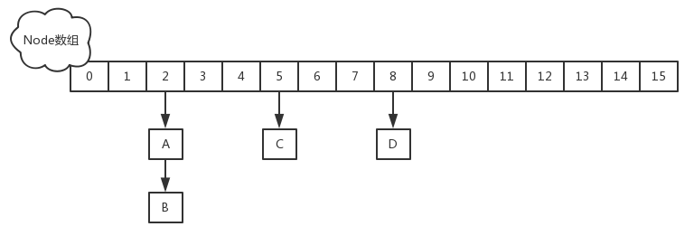
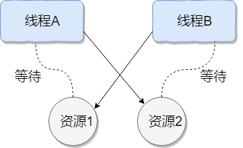

# The interview questions - Java Basics

## Java 概述

### 何为编程

编程就是让计算机为解决某个问题而使用某种程序设计语言编写程序代码，并最终得到结果的过程。

为了使计算机能够理解人的意图，人类就必须要将需解决的问题的思路、方法、和手段通过计算机能够理解的形式告诉计算机，使得计算机能够根据人的指令一步一步去工作，完成某种特定的任务。这种人和计算机之间交流的过程就是编程。

### 什么是 Java

Java 是一门面向对象编程语言，不仅吸收了 C++ 语言的各种优点，还摒弃了 C++ 里难以理解的多继承、指针等概念，因此 Java 语言具有功能强大和简单易用两个特征。Java 语言作为静态面向对象编程语言的代表，极好地实现了面向对象理论，允许程序员以优雅的思维方式进行复杂的编程 。

### jdk 1.5 之后的三大版本

- Java SE（J2SE，Java 2 Platform Standard Edition，标准版）
    Java SE 以前称为 J2SE。它允许开发和部署在桌面、服务器、嵌入式环境和实时环境中使用的 Java 应用程序。Java SE 包含了支持 Java Web 服务开发的类，并为 Java EE 和 Java ME 提供基础。
- Java EE（J2EE，Java 2 Platform Enterprise Edition，企业版）
    Java EE 以前称为 J2EE。企业版本帮助开发和部署可移植、健壮、可伸缩且安全的服务器端 Java 应用程序。Java EE 是在 Java SE 的基础上构建的，它提供 Web 服务、组件模型、管理和通信 API，可以用来实现企业级的面向服务体系结构（service-oriented architecture，SOA）和 Web2.0 应用程序。2018 年 2 月，Eclipse 宣布正式将 JavaEE 更名为 JakartaEE
- Java ME（J2ME，Java 2 Platform Micro Edition，微型版）
    Java ME 以前称为 J2ME。Java ME 为在移动设备和嵌入式设备（比如手机、PDA、电视机顶盒和打印机）上运行的应用程序提供一个健壮且灵活的环境。Java ME 包括灵活的用户界面、健壮的安全模型、许多内置的网络协议以及对可以动态下载的连网和离线应用程序的丰富支持。基于 Java ME 规范的应用程序只需编写一次，就可以用于许多设备，而且可以利用每个设备的本机功能。

### JVM、JRE 和 JDK 的关系

JVM
Java Virtual Machine 是 Java 虚拟机，Java 程序需要运行在虚拟机上，不同的平台有自己的虚拟机，因此 Java 语言可以实现跨平台。

JRE
Java Runtime Environment 包括 Java 虚拟机和 Java 程序所需的核心类库等。核心类库主要是 java.lang 包：包含了运行 Java 程序必不可少的系统类，如基本数据类型、基本数学函数、字符串处理、线程、异常处理类等，系统缺省加载这个包

如果想要运行一个开发好的 Java 程序，计算机中只需要安装 JRE 即可。

JDK
Java Development Kit 是提供给 Java 开发人员使用的，其中包含了 Java 的开发工具，也包括了 JRE。所以安装了 JDK，就无需再单独安装 JRE 了。其中的开发工具：编译工具 (javac.exe)，打包工具 (jar.exe) 等

JVM & JRE  & JDK 关系图


### 什么是跨平台性？原理是什么

所谓跨平台性，是指 java 语言编写的程序，一次编译后，可以在多个系统平台上运行。

实现原理：Java 程序是通过 java 虚拟机在系统平台上运行的，只要该系统可以安装相应的 java 虚拟机，该系统就可以运行 java 程序。

### Java 语言有哪些特点

1. 简单易学（Java 语言的语法与 C 语言和 C++ 语言很接近）
2. 面向对象（封装，继承，多态）
3. 平台无关性（Java 虚拟机实现平台无关性）
4. 支持网络编程并且很方便（Java 语言诞生本身就是为简化网络编程设计的）
5. 支持多线程（多线程机制使应用程序在同一时间并行执行多项任）
6. 健壮性（Java 语言的强类型机制、异常处理、垃圾的自动收集等）

安全性

### 什么是字节码？采用字节码的最大好处是什么

**字节码：** Java 源代码经过虚拟机编译器编译后产生的文件（即扩展为.class 的文件），它不面向任何特定的处理器，只面向虚拟机。

**采用字节码的好处：**

Java 语言通过字节码的方式，在一定程度上解决了传统解释型语言执行效率低的问题，同时又保留了解释型语言可移植的特点。所以 Java 程序运行时比较高效，而且，由于字节码并不专对一种特定的机器，因此，Java 程序无须重新编译便可在多种不同的计算机上运行。

**先看下 java 中的编译器和解释器：**

Java 中引入了虚拟机的概念，即在机器和编译程序之间加入了一层抽象的虚拟机器。这台虚拟的机器在任何平台上都提供给编译程序一个的共同的接口。编译程序只需要面向虚拟机，生成虚拟机能够理解的代码，然后由解释器来将虚拟机代码转换为特定系统的机器码执行。在 Java 中，这种供虚拟机理解的代码叫做字节码（即扩展为.class 的文件），它不面向任何特定的处理器，只面向虚拟机。每一种平台的解释器是不同的，但是实现的虚拟机是相同的。Java 源程序经过编译器编译后变成字节码，字节码由虚拟机解释执行，虚拟机将每一条要执行的字节码送给解释器，解释器将其翻译成特定机器上的机器码，然后在特定的机器上运行，这就是上面提到的 Java 的特点的编译与解释并存的解释。

`Java 源代码 ----> 编译器 ----> jvm 可执行的 Java 字节码(即虚拟指令) ----> jvm ----> jvm 中解释器 -----> 机器可执行的二进制机器码 ----> 程序运行`

### 什么是 Java 程序的主类？应用程序和小程序的主类有何不同

一个程序中可以有多个类，但只能有一个类是主类。在 Java 应用程序中，这个主类是指包含 main () 方法的类。而在 Java 小程序中，这个主类是一个继承自系统类 JApplet 或 Applet 的子类。应用程序的主类不一定要求是 public 类，但小程序的主类要求必须是 public 类。主类是 Java 程序执行的入口点。

### Java 应用程序与小程序之间有那些差别

简单说应用程序是从主线程启动 (也就是 main () 方法)。applet 小程序没有 main 方法，主要是嵌在浏览器页面上运行 (调用 init () 线程或者 run () 来启动)，嵌入浏览器这点跟 flash 的小游戏类似。

### Java 和 C++ 的区别

我知道很多人没学过 C++，但是面试官就是没事喜欢拿咱们 Java 和 C++ 比呀！没办法！！！就算没学过 C++，也要记下来！

1. 都是面向对象的语言，都支持封装、继承和多态
2. Java 不提供指针来直接访问内存，程序内存更加安全
3. Java 的类是单继承的，C++ 支持多重继承；虽然 Java 的类不可以多继承，但是接口可以多继承。
4. Java 有自动内存管理机制，不需要程序员手动释放无用内存

### Oracle JDK 和 OpenJDK 的对比

1. Oracle JDK 版本将每三年发布一次，而 OpenJDK 版本每三个月发布一次；
2. OpenJDK 是一个参考模型并且是完全开源的，而 Oracle JDK 是 OpenJDK 的一个实现，并不是完全开源的；
3. Oracle JDK 比 OpenJDK 更稳定。OpenJDK 和 Oracle JDK 的代码几乎相同，但 Oracle JDK 有更多的类和一些错误修复。因此，如果您想开发企业 / 商业软件，我建议您选择 Oracle JDK，因为它经过了彻底的测试和稳定。某些情况下，有些人提到在使用 OpenJDK 可能会遇到了许多应用程序崩溃的问题，但是，只需切换到 Oracle JDK 就可以解决问题；
4. 在响应性和 JVM 性能方面，Oracle JDK 与 OpenJDK 相比提供了更好的性能；
5. Oracle JDK 不会为即将发布的版本提供长期支持，用户每次都必须通过更新到最新版本获得支持来获取最新版本；
6. Oracle JDK 根据二进制代码许可协议获得许可，而 OpenJDK 根据 GPL v2 许可获得许可。

## 基础语法

### 数据类型

#### Java 有哪些数据类型

定义：Java 语言是强类型语言，对于每一种数据都定义了明确的具体的数据类型，在内存中分配了不同大小的内存空间。

**分类:**

- 基本数据类型
  - 数值型
    - 整数类型 (byte,short,int,long)
    - 浮点类型 (float,double)
  - 字符型 (char)
  - 布尔型 (boolean)
- 引用数据类型
  - 类 (class)
  - 接口 (interface)
  - 数组 ([])

Java 基本数据类型图


#### switch 是否能作用在 byte 上，是否能作用在 long 上，是否能作用在 String 上

在 Java 5 以前，switch (expr) 中，expr 只能是 byte、short、char、int。从 Java 5 开始，Java 中引入了枚举类型，expr 也可以是 enum 类型，从 Java 7 开始，expr 还可以是字符串（String），但是长整型（long）在目前所有的版本中都是不可以的。

#### 用最有效率的方法计算 2 乘以 8

2 << 3（左移 3 位相当于乘以 2 的 3 次方，右移 3 位相当于除以 2 的 3 次方）。

#### Math.round (11.5) 等于多少？Math.round (-11.5) 等于多少

Math.round (11.5) 的返回值是 12，Math.round (-11.5) 的返回值是 - 11。四舍五入的原理是在参数上加 0.5 然后进行下取整。

#### float f = 3.4; 是否正确

不正确。3.4 是双精度数，将双精度型（double）赋值给浮点型（float）属于下转型（down-casting，也称为窄化）会造成精度损失，因此需要强制类型转换 float f =(float) 3.4; 或者写成 float f =3.4F;。

#### short s1 = 1; s1 = s1 + 1; 有错吗？short s1 = 1; s1 += 1; 有错吗

对于 short s1 = 1; s1 = s1 + 1; 由于 1 是 int 类型，因此 s1+1 运算结果也是 int 型，需要强制转换类型才能赋值给 short 型。

而 short s1 = 1; s1 += 1; 可以正确编译，因为 s1+= 1; 相当于 s1 = (short (s1 + 1); 其中有隐含的强制类型转换。

### 编码

#### Java 语言采用何种编码方案？有何特点

Java 语言采用 Unicode 编码标准，Unicode（标准码），它为每个字符制订了一个唯一的数值，因此在任何的语言，平台，程序都可以放心的使用。

### 注释

#### 什么 Java 注释

**定义：** 用于解释说明程序的文字

**分类:**

- 单行注释
    格式： // 注释文字
- 多行注释
    格式： `/* 注释文字 */`
- 文档注释
    格式：`/** 注释文字 */`

**作用:**

在程序中，尤其是复杂的程序中，适当地加入注释可以增加程序的可读性，有利于程序的修改、调试和交流。注释的内容在程序编译的时候会被忽视，不会产生目标代码，注释的部分不会对程序的执行结果产生任何影响。

注意事项：多行和文档注释都不能嵌套使用。

### 访问修饰符

#### 访问修饰符 public,private,protected, 以及不写（默认）时的区别

**定义：** Java 中，可以使用访问修饰符来保护对类、变量、方法和构造方法的访问。Java 支持 4 种不同的访问权限。

**分类：**

- private : 在同一类内可见。使用对象：变量、方法。 注意：不能修饰类（外部类）
- default (即缺省，什么也不写，不使用任何关键字）: 在同一包内可见，不使用任何修饰符。使用对象：类、接口、变量、方法。
- protected : 对同一包内的类和所有子类可见。使用对象：变量、方法。 注意：不能修饰类（外部类）。
- public : 对所有类可见。使用对象：类、接口、变量、方法


### 运算符

#### & 和 && 的区别

& 运算符有两种用法：(1) 按位与；(2) 逻辑与。

&& 运算符是短路与运算。逻辑与跟短路与的差别是非常巨大的，虽然二者都要求运算符左右两端的布尔值都是 true 整个表达式的值才是 true。&& 之所以称为短路运算，是因为如果 && 左边的表达式的值是 false，右边的表达式会被直接短路掉，不会进行运算。

注意：逻辑或运算符（|）和短路或运算符（||）的差别也是如此。

### 关键字

#### Java 有没有 goto

goto 是 Java 中的保留字，在目前版本的 Java 中没有使用。

#### final 有什么用

用于修饰类、属性和方法；

1. 被 final 修饰的类不可以被继承
2. 被 final 修饰的方法不可以被重写
3. 被 final 修饰的变量不可以被改变，被 final 修饰不可变的是变量的引用，而不是引用指向的内容，引用指向的内容是可以改变的

#### final finally finalize 区别

1. final 可以修饰类、变量、方法，修饰类表示该类不能被继承、修饰方法表示该方法不能被重写、修饰变量表示该变量是一个常量不能被重新赋值。
2. finally 一般作用在 try-catch 代码块中，在处理异常的时候，通常我们将一定要执行的代码方法 finally 代码块中，表示不管是否出现异常，该代码块都会执行，一般用来存放一些关闭资源的代码。
3. finalize 是一个方法，属于 Object 类的一个方法，而 Object 类是所有类的父类，该方法一般由垃圾回收器来调用，当我们调用 System.gc () 方法的时候，由垃圾回收器调用 finalize ()，回收垃圾，一个对象是否可回收的最后判断。

#### this 关键字的用法

this 是自身的一个对象，代表对象本身，可以理解为：指向对象本身的一个指针。

this 的用法在 java 中大体可以分为 3 种：

1. 普通的直接引用，this 相当于是指向当前对象本身。

2. 形参与成员名字重名，用 this 来区分：

    ```java
    public Person(String name, int age) {
        this.name = name;
        this.age = age;
    }
    ```

3. 引用本类的构造函数

    ```java
    class Person{
        private String name;
        private int age;

        public Person() {
        }

        public Person(String name) {
            this.name = name;
        }

        public Person(String name, int age) {
            this(name);
            this.age = age;
        }
    }
    ```

#### super 关键字的用法

super 可以理解为是指向自己超（父）类对象的一个指针，而这个超类指的是离自己最近的一个父类。

super 也有三种用法：

1. 普通的直接引用

    与 this 类似，super 相当于是指向当前对象的父类的引用，这样就可以用 super.xxx 来引用父类的成员。

2. 子类中的成员变量或方法与父类中的成员变量或方法同名时，用 super 进行区分

    ```java
    class Person{
        protected String name;

        public Person(String name) {
            this.name = name;
        }

    }

    class Student extends Person{
        private String name;

        public Student(String name, String name1) {
            super(name);
            this.name = name1;
        }

        public void getInfo(){
            System.out.println(this.name);      //Child
            System.out.println(super.name);     //Father
        }

    }

    public class Test {
        public static void main(String[] args) {
        Student s1 = new Student("Father","Child");
        s1.getInfo();

        }
    }
    ```

3. 引用父类构造函数

- super（参数）：调用父类中的某一个构造函数（应该为构造函数中的第一条语句）。
- this（参数）：调用本类中另一种形式的构造函数（应该为构造函数中的第一条语句）。

#### this 与 super 的区别

1. super:　它引用当前对象的直接父类中的成员（用来访问直接父类中被隐藏的父类中成员数据或函数，基类与派生类中有相同成员定义时如：super. 变量名 super. 成员函数据名（实参）
2. this：它代表当前对象名（在程序中易产生二义性之处，应使用 this 来指明当前对象；如果函数的形参与类中的成员数据同名，这时需用 this 来指明成员变量名）
3. super () 和 this () 类似，区别是，super () 在子类中调用父类的构造方法，this () 在本类内调用本类的其它构造方法。
4. super () 和 this () 均需放在构造方法内第一行。
5. 尽管可以用 this 调用一个构造器，但却不能调用两个。
6. this 和 super 不能同时出现在一个构造函数里面，因为 this 必然会调用其它的构造函数，其它的构造函数必然也会有 super 语句的存在，所以在同一个构造函数里面有相同的语句，就失去了语句的意义，编译器也不会通过。
7. this () 和 super () 都指的是对象，所以，均不可以在 static 环境中使用。包括：static 变量，static 方法，static 语句块。
8. 从本质上讲，this 是一个指向本对象的指针，然而 super 是一个 Java 关键字。

#### static 存在的主要意义

static 的主要意义是在于创建独立于具体对象的域变量或者方法。**以致于即使没有创建对象，也能使用属性和调用方法！**

static 关键字还有一个比较关键的作用就是 **用来形成静态代码块以优化程序性能**。static 块可以置于类中的任何地方，类中可以有多个 static 块。在类初次被加载的时候，会按照 static 块的顺序来执行每个 static 块，并且只会执行一次。

为什么说 static 块可以用来优化程序性能，是因为它的特性：只会在类加载的时候执行一次。因此，很多时候会将一些只需要进行一次的初始化操作都放在 static 代码块中进行。

#### static 的独特之处

1. 被 static 修饰的变量或者方法是独立于该类的任何对象，也就是说，这些变量和方法不属于任何一个实例对象，而是被类的实例对象所共享。
    怎么理解 “被类的实例对象所共享” 这句话呢？就是说，一个类的静态成员，它是属于大伙的【大伙指的是这个类的多个对象实例，我们都知道一个类可以创建多个实例！】，所有的类对象共享的，不像成员变量是自个的【自个指的是这个类的单个实例对象】…
2. 在该类被第一次加载的时候，就会去加载被 static 修饰的部分，而且只在类第一次使用时加载并进行初始化，注意这是第一次用就要初始化，后面根据需要是可以再次赋值的。

3. static 变量值在类加载的时候分配空间，以后创建类对象的时候不会重新分配。赋值的话，是可以任意赋值的！

4. 被 static 修饰的变量或者方法是优先于对象存在的，也就是说当一个类加载完毕之后，即便没有创建对象，也可以去访问。

#### static 应用场景

因为 static 是被类的实例对象所共享，因此如果**某个成员变量是被所有对象所共享的，那么这个成员变量就应该定义为静态变量。**

因此比较常见的 static 应用场景有：

1. 修饰成员变量
2. 修饰成员方法
3. 静态代码块
4. 修饰类【只能修饰内部类也就是静态内部类】
5. 静态导包

#### static 注意事项

1. 静态只能访问静态。
2. 非静态既可以访问非静态的，也可以访问静态的。

### 流程控制语句

#### break ,continue ,return 的区别及作用

break 跳出总上一层循环，不再执行循环 (结束当前的循环体)

continue 跳出本次循环，继续执行下次循环 (结束正在执行的循环 进入下一个循环条件)

return 程序返回，不再执行下面的代码 (结束当前的方法 直接返回)

#### 在 Java 中，如何跳出当前的多重嵌套循环

在 Java 中，要想跳出多重循环，可以在外面的循环语句前定义一个标号，然后在里层循环体的代码中使用带有标号的 break 语句，即可跳出外层循环。例如：

```java
public static void main(String[] args) {
    ok:
    for (int i = 0; i < 10; i++) {
        for (int j = 0; j < 10; j++) {
            System.out.println("i=" + i + ",j=" + j);
            if (j == 5) {
                break ok;
            }

        }
    }
}
```

## 面向对象

### 面向对象概述

#### 面向对象和面向过程的区别

**面向过程：**

优点：性能比面向对象高，因为类调用时需要实例化，开销比较大，比较消耗资源；比如单片机、嵌入式开发、Linux/Unix 等一般采用面向过程开发，性能是最重要的因素。

缺点：没有面向对象易维护、易复用、易扩展

**面向对象：**

优点：易维护、易复用、易扩展，由于面向对象有封装、继承、多态性的特性，可以设计出低耦合的系统，使系统更加灵活、更加易于维护

缺点：性能比面向过程低

**面向过程是具体化的，流程化的，解决一个问题，你需要一步一步的分析，一步一步的实现。**

**面向对象是模型化的，你只需抽象出一个类，这是一个封闭的盒子，在这里你拥有数据也拥有解决问题的方法。需要什么功能直接使用就可以了，不必去一步一步的实现，至于这个功能是如何实现的，管我们什么事？我们会用就可以了。**

面向对象的底层其实还是面向过程，把面向过程抽象成类，然后封装，方便我们使用的就是面向对象了。

### 面向对象三大特征

#### 面向对象的特征有哪些方面

1. 抽象：抽象是将一类对象的共同特征总结出来构造类的过程，包括数据抽象和行为抽象两方面。抽象只关注对象有哪些属性和行为，并不关注这些行为的细节是什么。
2. 封装：封装把一个对象的属性私有化，同时提供一些可以被外界访问的属性的方法，如果属性不想被外界访问，我们大可不必提供方法给外界访问。但是如果一个类没有提供给外界访问的方法，那么这个类也没有什么意义了。
3. 继承：继承是使用已存在的类的定义作为基础建立新类的技术，新类的定义可以增加新的数据或新的功能，也可以用父类的功能，但不能选择性地继承父类。通过使用继承我们能够非常方便地复用以前的代码。
    关于继承如下 3 点请记住：
    1. 子类拥有父类非 private 的属性和方法。
    2. 子类可以拥有自己属性和方法，即子类可以对父类进行扩展。
    3. 子类可以用自己的方式实现父类的方法。（以后介绍）。
4. 多态：所谓多态就是指程序中定义的引用变量所指向的具体类型和通过该引用变量发出的方法调用在编程时并不确定，而是在程序运行期间才确定，即一个引用变量到底会指向哪个类的实例对象，该引用变量发出的方法调用到底是哪个类中实现的方法，必须在由程序运行期间才能决定。

    在 Java 中有两种形式可以实现多态：继承（多个子类对同一方法的重写）和接口（实现接口并覆盖接口中同一方法）。

    方法重载（overload）实现的是编译时的多态性（也称为前绑定），而方法重写（override）实现的是运行时的多态性（也称为后绑定）。

一个引用变量到底会指向哪个类的实例对象，该引用变量发出的方法调用到底是哪个类中实现的方法，必须在由程序运行期间才能决定。运行时的多态是面向对象最精髓的东西，要实现多态需要做两件事：

1. 方法重写（子类继承父类并重写父类中已有的或抽象的方法）；
2. 对象造型（用父类型引用子类型对象，这样同样的引用调用同样的方法就会根据子类对象的不同而表现出不同的行为）。

#### 什么是多态机制？Java 语言是如何实现多态的

所谓多态就是指程序中定义的引用变量所指向的具体类型和通过该引用变量发出的方法调用在编程时并不确定，而是在程序运行期间才确定，即一个引用变量倒底会指向哪个类的实例对象，该引用变量发出的方法调用到底是哪个类中实现的方法，必须在由程序运行期间才能决定。因为在程序运行时才确定具体的类，这样，不用修改源程序代码，就可以让引用变量绑定到各种不同的类实现上，从而导致该引用调用的具体方法随之改变，即不修改程序代码就可以改变程序运行时所绑定的具体代码，让程序可以选择多个运行状态，这就是多态性。

多态分为编译时多态和运行时多态。其中编辑时多态是静态的，主要是指方法的重载，它是根据参数列表的不同来区分不同的函数，通过编辑之后会变成两个不同的函数，在运行时谈不上多态。而运行时多态是动态的，它是通过动态绑定来实现的，也就是我们所说的多态性。

#### 多态的实现

Java 实现多态有三个必要条件：继承、重写、向上转型。

继承：在多态中必须存在有继承关系的子类和父类。

重写：子类对父类中某些方法进行重新定义，在调用这些方法时就会调用子类的方法。

向上转型：在多态中需要将子类的引用赋给父类对象，只有这样该引用才能够具备技能调用父类的方法和子类的方法。

只有满足了上述三个条件，我们才能够在同一个继承结构中使用统一的逻辑实现代码处理不同的对象，从而达到执行不同的行为。

对于 Java 而言，它多态的实现机制遵循一个原则：当超类对象引用变量引用子类对象时，被引用对象的类型而不是引用变量的类型决定了调用谁的成员方法，但是这个被调用的方法必须是在超类中定义过的，也就是说被子类覆盖的方法。

#### 面向对象五大基本原则是什么（可选）

1. 单一职责原则 SRP (Single Responsibility Principle)
    类的功能要单一，不能包罗万象，跟杂货铺似的。
2. 开放封闭原则 OCP (Open－Close Principle)
    一个模块对于拓展是开放的，对于修改是封闭的，想要增加功能热烈欢迎，想要修改，哼，一万个不乐意。
3. 里式替换原则 LSP (the Liskov Substitution Principle LSP)
    子类可以替换父类出现在父类能够出现的任何地方。比如你能代表你爸去你姥姥家干活。哈哈～～
4. 依赖倒置原则 DIP (the Dependency Inversion Principle DIP)
    高层次的模块不应该依赖于低层次的模块，他们都应该依赖于抽象。抽象不应该依赖于具体实现，具体实现应该依赖于抽象。就是你出国要说你是中国人，而不能说你是哪个村子的。比如说中国人是抽象的，下面有具体的 xx 省，xx 市，xx 县。你要依赖的抽象是中国人，而不是你是 xx 村的。
5. 接口分离原则 ISP (the Interface Segregation Principle ISP)
    设计时采用多个与特定客户类有关的接口比采用一个通用的接口要好。就比如一个手机拥有打电话，看视频，玩游戏等功能，把这几个功能拆分成不同的接口，比在一个接口里要好的多。

### 类与接口

#### 抽象类和接口的对比

抽象类是用来捕捉子类的通用特性的。接口是抽象方法的集合。

从设计层面来说，抽象类是对类的抽象，是一种模板设计，接口是行为的抽象，是一种行为的规范。

相同点

1. 接口和抽象类都不能实例化
2. 都位于继承的顶端，用于被其他实现或继承
3. 都包含抽象方法，其子类都必须覆写这些抽象方法
不同点

| 参数 | 抽象类 | 接口 |
|:-:|:-:|:-:|
| 声明 | 抽象类使用 abstract 关键字声明 | 接口使用 interface 关键字声明 |
| 实现 | 子类使用 extends 关键字来继承抽象类。如果子类不是抽象类的话，它需要提供抽象类中所有声明的方法的实现 | 子类使用 implements 关键字来实现接口。它需要提供接口中所有声明的方法的实现 |
| 构造器 | 抽象类可以有构造器 | 接口不能有构造器 |
| 访问修饰符 | 抽象类中的方法可以是任意访问修饰符 | 接口方法默认修饰符是 public。并且不允许定义为 private 或者 protected |
| 多继承 | 一个类最多只能继承一个抽象类 | 一个类可以实现多个接口 |
| 字段声明 | 抽象类的字段声明可以是任意的 | 接口的字段默认都是 static 和 final 的 |

**备注：** Java 8 中接口中引入默认方法和静态方法，以此来减少抽象类和接口之间的差异。

现在，我们可以为接口提供默认实现的方法了，并且不用强制子类来实现它。

接口和抽象类各有优缺点，在接口和抽象类的选择上，必须遵守这样一个原则：

1. 行为模型应该总是通过接口而不是抽象类定义，所以通常是优先选用接口，尽量少用抽象类。
2. 选择抽象类的时候通常是如下情况：需要定义子类的行为，又要为子类提供通用的功能。

#### 普通类和抽象类有哪些区别

1. 普通类不能包含抽象方法，抽象类可以包含抽象方法。
2. 抽象类不能直接实例化，普通类可以直接实例化。

#### 抽象类能使用 final 修饰吗

不能，定义抽象类就是让其他类继承的，如果定义为 final 该类就不能被继承，这样彼此就会产生矛盾，所以 final 不能修饰抽象类

#### 创建一个对象用什么关键字？对象实例与对象引用有何不同

new 关键字，new 创建对象实例（对象实例在堆内存中），对象引用指向对象实例（对象引用存放在栈内存中）。一个对象引用可以指向 0 个或 1 个对象（一根绳子可以不系气球，也可以系一个气球）; 一个对象可以有 n 个引用指向它（可以用 n 条绳子系住一个气球）

### 变量与方法

#### 成员变量与局部变量的区别有哪些

变量：在程序执行的过程中，在某个范围内其值可以发生改变的量。从本质上讲，变量其实是内存中的一小块区域

成员变量：方法外部，类内部定义的变量

局部变量：类的方法中的变量。

成员变量和局部变量的区别

#### 作用域

成员变量：针对整个类有效。

局部变量：只在某个范围内有效。(一般指的就是方法，语句体内)

#### 存储位置

成员变量：随着对象的创建而存在，随着对象的消失而消失，存储在堆内存中。

局部变量：在方法被调用，或者语句被执行的时候存在，存储在栈内存中。当方法调用完，或者语句结束后，就自动释放。

#### 生命周期

成员变量：随着对象的创建而存在，随着对象的消失而消失

局部变量：当方法调用完，或者语句结束后，就自动释放。

#### 初始值

成员变量：有默认初始值。

局部变量：没有默认初始值，使用前必须赋值。

使用原则

在使用变量时需要遵循的原则为：就近原则
首先在局部范围找，有就使用；接着在成员位置找。

#### 在 Java 中定义一个不做事且没有参数的构造方法的作用

Java 程序在执行子类的构造方法之前，如果没有用 super () 来调用父类特定的构造方法，则会调用父类中 “没有参数的构造方法”。因此，如果父类中只定义了有参数的构造方法，而在子类的构造方法中又没有用 super () 来调用父类中特定的构造方法，则编译时将发生错误，因为 Java 程序在父类中找不到没有参数的构造方法可供执行。解决办法是在父类里加上一个不做事且没有参数的构造方法。

#### 在调用子类构造方法之前会先调用父类没有参数的构造方法，其目的是

帮助子类做初始化工作。

#### 一个类的构造方法的作用是什么？若一个类没有声明构造方法，改程序能正确执行吗？为什么

主要作用是完成对类对象的初始化工作。可以执行。因为一个类即使没有声明构造方法也会有默认的不带参数的构造方法。

#### 构造方法有哪些特性

1. 名字与类名相同；
2. 没有返回值，但不能用 void 声明构造函数；
3. 生成类的对象时自动执行，无需调用。

#### 静态变量和实例变量区别

静态变量： 静态变量由于不属于任何实例对象，属于类的，所以在内存中只会有一份，在类的加载过程中，JVM 只为静态变量分配一次内存空间。

实例变量： 每次创建对象，都会为每个对象分配成员变量内存空间，实例变量是属于实例对象的，在内存中，创建几次对象，就有几份成员变量。

#### 静态变量与普通变量区别

static 变量也称作静态变量，静态变量和非静态变量的区别是：静态变量被所有的对象所共享，在内存中只有一个副本，它当且仅当在类初次加载时会被初始化。而非静态变量是对象所拥有的，在创建对象的时候被初始化，存在多个副本，各个对象拥有的副本互不影响。

还有一点就是 static 成员变量的初始化顺序按照定义的顺序进行初始化。

#### 静态方法和实例方法有何不同

静态方法和实例方法的区别主要体现在两个方面：

1. 在外部调用静态方法时，可以使用 "类名。方法名" 的方式，也可以使用 "对象名。方法名" 的方式。而实例方法只有后面这种方式。也就是说，调用静态方法可以无需创建对象。
2. 静态方法在访问本类的成员时，只允许访问静态成员（即静态成员变量和静态方法），而不允许访问实例成员变量和实例方法；实例方法则无此限制

#### 在一个静态方法内调用一个非静态成员为什么是非法的

由于静态方法可以不通过对象进行调用，因此在静态方法里，不能调用其他非静态变量，也不可以访问非静态变量成员。

#### 什么是方法的返回值？返回值的作用是什么

方法的返回值是指我们获取到的某个方法体中的代码执行后产生的结果！（前提是该方法可能产生结果）。返回值的作用：接收出结果，使得它可以用于其他的操作！

### 内部类

#### 什么是内部类

在 Java 中，可以将一个类的定义放在另外一个类的定义内部，这就是内部类。内部类本身就是类的一个属性，与其他属性定义方式一致。

#### 内部类的分类有哪些

内部类可以分为四种：成员内部类、局部内部类、匿名内部类和静态内部类。

1. 静态内部类
    定义在类内部的静态类，就是静态内部类。

    ```java
    public class Outer {

        private static int radius = 1;

        static class StaticInner {
            public void visit() {
                System.out.println("visit outer static  variable:" + radius);
            }
        }
    }
    ```

    静态内部类可以访问外部类所有的静态变量，而不可访问外部类的非静态变量；静态内部类的创建方式，new 外部类.静态内部类()，如下：

    ```java
    Outer.StaticInner inner = new Outer.StaticInner();
    inner.visit();
    ```

2. 成员内部类
定义在类内部，成员位置上的非静态类，就是成员内部类。

    ```java
    public class Outer {

        private static  int radius = 1;
        private int count =2;

        class Inner {
            public void visit() {
                System.out.println("visit outer static  variable:" + radius);
                System.out.println("visit outer   variable:" + count);
            }
        }
    }
    ```

    成员内部类可以访问外部类所有的变量和方法，包括静态和非静态，私有和公有。成员内部类依赖于外部类的实例，它的创建方式`外部类实例.new 内部类()`，如下：

    ```java
    Outer outer = new Outer();
    Outer.Inner inner = outer.new Inner();
    inner.visit();
    ```

3. 局部内部类
    定义在方法中的内部类，就是局部内部类。

    ```java
    public class Outer {

        private  int out_a = 1;
        private static int STATIC_b = 2;

        public void testFunctionClass(){
            int inner_c =3;
            class Inner {
                private void fun(){
                    System.out.println(out_a);
                    System.out.println(STATIC_b);
                    System.out.println(inner_c);
                }
            }
            Inner  inner = new Inner();
            inner.fun();
        }
        public static void testStaticFunctionClass(){
            int d =3;
            class Inner {
                private void fun(){
                    // System.out.println(out_a); 编译错误，定义在静态方法中的局部类不可以访问外部类的实例变量
                    System.out.println(STATIC_b);
                    System.out.println(d);
                }
            }
            Inner  inner = new Inner();
            inner.fun();
        }
    }
    ```

    定义在实例方法中的局部类可以访问外部类的所有变量和方法，定义在静态方法中的局部类只能访问外部类的静态变量和方法。局部内部类的创建方式，在对应方法内，new 内部类()，如下：

    ```java
    public static void testStaticFunctionClass(){
        class Inner {
        }
        Inner  inner = new Inner();
    }
    ```

4. 匿名内部类
    匿名内部类就是没有名字的内部类，日常开发中使用的比较多。

    ```java
    public class Outer {

        private void test(final int i) {
            new Service() {
                public void method() {
                    for (int j = 0; j < i; j++) {
                        System.out.println("匿名内部类" );
                    }
                }
            }.method();
        }
    }
    //匿名内部类必须继承或实现一个已有的接口
    interface Service{
        void method();
    }
    ```

    除了没有名字，匿名内部类还有以下特点：

    1. 匿名内部类必须继承一个抽象类或者实现一个接口。
    2. 匿名内部类不能定义任何静态成员和静态方法。
    3. 当所在的方法的形参需要被匿名内部类使用时，必须声明为 final。
    4. 匿名内部类不能是抽象的，它必须要实现继承的类或者实现的接口的所有抽象方法。

    匿名内部类创建方式：

    ```java
    new 类/接口{
    //匿名内部类实现部分
    }
    ```

#### 内部类的优点

我们为什么要使用内部类呢？因为它有以下优点：

1. 一个内部类对象可以访问创建它的外部类对象的内容，包括私有数据！
2. 内部类不为同一包的其他类所见，具有很好的封装性；
3. 内部类有效实现了 “多重继承”，优化 java 单继承的缺陷。
4. 匿名内部类可以很方便的定义回调。

#### 内部类有哪些应用场景

1. 一些多算法场合
2. 解决一些非面向对象的语句块。
3. 适当使用内部类，使得代码更加灵活和富有扩展性。
4. 当某个类除了它的外部类，不再被其他的类使用时。

#### 局部内部类和匿名内部类访问局部变量的时候，为什么变量必须要加上 final

局部内部类和匿名内部类访问局部变量的时候，为什么变量必须要加上 final 呢？它内部原理是什么呢？

先看这段代码：

```java
public class Outer {

    void outMethod(){
        final int a =10;
        class Inner {
            void innerMethod(){
                System.out.println(a);
            }

        }
    }
}
```

以上例子，为什么要加 final 呢？是因为 **生命周期不一致** ， 局部变量直接存储在栈中，当方法执行结束后，非 final 的局部变量就被销毁。而局部内部类对局部变量的引用依然存在，如果局部内部类要调用局部变量时，就会出错。加了 final，可以确保局部内部类使用的变量与外层的局部变量区分开，解决了这个问题。

#### 内部类相关，看程序说出运行结果

```java
public class Outer {
    private int age = 12;

    class Inner {
        private int age = 13;
        public void print() {
            int age = 14;
            System.out.println("局部变量：" + age);
            System.out.println("内部类变量：" + this.age);
            System.out.println("外部类变量：" + Outer.this.age);
        }
    }

    public static void main(String[] args) {
        Outer.Inner in = new Outer().new Inner();
        in.print();
    }
}
```

运行结果：

```java
局部变量：14
内部类变量：13
外部类变量：12
```

### 重写与重载

#### 构造器（constructor）是否可被重写（override）

构造器不能被继承，因此不能被重写，但可以被重载。

#### 重载（Overload）和重写（Override）的区别。重载的方法能否根据返回类型进行区分

方法的重载和重写都是实现多态的方式，区别在于前者实现的是编译时的多态性，而后者实现的是运行时的多态性。

重载：发生在同一个类中，方法名相同参数列表不同（参数类型不同、个数不同、顺序不同），与方法返回值和访问修饰符无关，即重载的方法不能根据返回类型进行区分

重写：发生在父子类中，方法名、参数列表必须相同，返回值小于等于父类，抛出的异常小于等于父类，访问修饰符大于等于父类（里氏代换原则）；如果父类方法访问修饰符为 private 则子类中就不是重写。

### 对象相等判断

#### == 和 equals 的区别是什么

== : 它的作用是判断两个对象的地址是不是相等。即，判断两个对象是不是同一个对象。(基本数据类型 == 比较的是值，引用数据类型 == 比较的是内存地址)

**equals()** : 它的作用也是判断两个对象是否相等。但它一般有两种使用情况：

情况 1：类没有覆盖 equals () 方法。则通过 equals () 比较该类的两个对象时，等价于通过 “==” 比较这两个对象。

情况 2：类覆盖了 equals () 方法。一般，我们都覆盖 equals () 方法来两个对象的内容相等；若它们的内容相等，则返回 true (即，认为这两个对象相等)。

**举个例子：**

```java
public class test1 {
    public static void main(String[] args) {
        String a = new String("ab"); // a 为一个引用
        String b = new String("ab"); // b为另一个引用,对象的内容一样
        String aa = "ab"; // 放在常量池中
        String bb = "ab"; // 从常量池中查找
        if (aa == bb) // true
            System.out.println("aa==bb");
        if (a == b) // false，非同一对象
            System.out.println("a==b");
        if (a.equals(b)) // true
            System.out.println("aEQb");
        if (42 == 42.0) { // true
            System.out.println("true");
        }
    }
}
```

**说明：**

- String 中的 equals 方法是被重写过的，因为 object 的 equals 方法是比较的对象的内存地址，而 String 的 equals 方法比较的是对象的值。
- 当创建 String 类型的对象时，虚拟机会在常量池中查找有没有已经存在的值和要创建的值相同的对象，如果有就把它赋给当前引用。如果没有就在常量池中重新创建一个 String 对象。

### hashCode 与 equals (重要)

HashSet 如何检查重复

两个对象的 hashCode () 相同，则 equals () 也一定为 true，对吗？

hashCode 和 equals 方法的关系

面试官可能会问你：“你重写过 hashcode 和 equals 么，为什么重写 equals 时必须重写 hashCode 方法？”

#### hashCode () 介绍

hashCode () 的作用是获取哈希码，也称为散列码；它实际上是返回一个 int 整数。这个哈希码的作用是确定该对象在哈希表中的索引位置。hashCode () 定义在 JDK 的 Object.java 中，这就意味着 Java 中的任何类都包含有 hashCode () 函数。

散列表存储的是键值对 (key-value)，它的特点是：能根据 “键” 快速的检索出对应的 “值”。这其中就利用到了散列码！（可以快速找到所需要的对象）

#### 为什么要有 hashCode

我们以 “HashSet 如何检查重复” 为例子来说明为什么要有 hashCode：

当你把对象加入 HashSet 时，HashSet 会先计算对象的 hashcode 值来判断对象加入的位置，同时也会与其他已经加入的对象的 hashcode 值作比较，如果没有相符的 hashcode，HashSet 会假设对象没有重复出现。但是如果发现有相同 hashcode 值的对象，这时会调用 equals () 方法来检查 hashcode 相等的对象是否真的相同。如果两者相同，HashSet 就不会让其加入操作成功。如果不同的话，就会重新散列到其他位置。（摘自我的 Java 启蒙书《Head first java》第二版）。这样我们就大大减少了 equals 的次数，相应就大大提高了执行速度。

hashCode () 与 equals () 的相关规定

如果两个对象相等，则 hashcode 一定也是相同的

两个对象相等，对两个对象分别调用 equals 方法都返回 true

两个对象有相同的 hashcode 值，它们也不一定是相等的

**因此，equals 方法被覆盖过，则 hashCode 方法也必须被覆盖.**

hashCode () 的默认行为是对堆上的对象产生独特值。如果没有重写 hashCode ()，则该 class 的两个对象无论如何都不会相等（即使这两个对象指向相同的数据）

#### 对象的相等与指向他们的引用相等，两者有什么不同

对象的相等 比的是内存中存放的内容是否相等而 引用相等 比较的是他们指向的内存地址是否相等。

### 值传递

#### 当一个对象被当作参数传递到一个方法后，此方法可改变这个对象的属性，并可返回变化后的结果，那么这里到底是值传递还是引用传递

是值传递。Java 语言的方法调用只支持参数的值传递。当一个对象实例作为一个参数被传递到方法中时，参数的值就是对该对象的引用。对象的属性可以在被调用过程中被改变，但对对象引用的改变是不会影响到调用者的

#### 为什么 Java 中只有值传递

首先回顾一下在程序设计语言中有关将参数传递给方法（或函数）的一些专业术语。**按值调用 (call by value) 表示方法接收的是调用者提供的值，而按引用调用（call by reference) 表示方法接收的是调用者提供的变量地址。一个方法可以修改传递引用所对应的变量值，而不能修改传递值调用所对应的变量值。** 它用来描述各种程序设计语言（不只是 Java) 中方法参数传递方式。

**Java 程序设计语言总是采用按值调用。也就是说，方法得到的是所有参数值的一个拷贝，也就是说，方法不能修改传递给它的任何参数变量的内容。**

下面通过 3 个例子来给大家说明

example 1

```java
public static void main(String[] args) {
    int num1 = 10;
    int num2 = 20;

    swap(num1, num2);

    System.out.println("num1 = " + num1);
    System.out.println("num2 = " + num2);
}

public static void swap(int a, int b) {
    int temp = a;
    a = b;
    b = temp;

    System.out.println("a = " + a);
    System.out.println("b = " + b);
}
```

**结果：**

```java
a = 20
b = 10
num1 = 10
num2 = 20
```

**解析：**


在 swap 方法中，a、b 的值进行交换，并不会影响到 num1、num2。因为，a、b 中的值，只是从 num1、num2 的复制过来的。也就是说，a、b 相当于 num1、num2 的副本，副本的内容无论怎么修改，都不会影响到原件本身。

**通过上面例子，我们已经知道了一个方法不能修改一个基本数据类型的参数，而对象引用作为参数就不一样，请看 example2.**

example 2

```java
    public static void main(String[] args) {
        int[] arr = { 1, 2, 3, 4, 5 };
        System.out.println(arr[0]);
        change(arr);
        System.out.println(arr[0]);
    }

    public static void change(int[] array) {
        // 将数组的第一个元素变为0
        array[0] = 0;
    }
```

**结果：**

```java
1
0
```

**解析：**


array 被初始化 arr 的拷贝也就是一个对象的引用，也就是说 array 和 arr 指向的时同一个数组对象。 因此，外部对引用对象的改变会反映到所对应的对象上。

**通过 example2 我们已经看到，实现一个改变对象参数状态的方法并不是一件难事。理由很简单，方法得到的是对象引用的拷贝，对象引用及其他的拷贝同时引用同一个对象。**

**很多程序设计语言（特别是，C++ 和 Pascal) 提供了两种参数传递的方式：值调用和引用调用。有些程序员（甚至本书的作者）认为 Java 程序设计语言对对象采用的是引用调用，实际上，这种理解是不对的。由于这种误解具有一定的普遍性，所以下面给出一个反例来详细地阐述一下这个问题。**

example 3

```java
public class Test {

    public static void main(String[] args) {
        // TODO Auto-generated method stub
        Student s1 = new Student("小张");
        Student s2 = new Student("小李");
        Test.swap(s1, s2);
        System.out.println("s1:" + s1.getName());
        System.out.println("s2:" + s2.getName());
    }

    public static void swap(Student x, Student y) {
        Student temp = x;
        x = y;
        y = temp;
        System.out.println("x:" + x.getName());
        System.out.println("y:" + y.getName());
    }
}
```

**结果：**

```java
x:小李
y:小张
s1:小张
s2:小李
```

**解析：**

交换之前：


交换之后：


通过上面两张图可以很清晰的看出： 方**法并没有改变存储在变量 s1 和 s2 中的对象引用。swap 方法的参数 x 和 y 被初始化为两个对象引用的拷贝，这个方法交换的是这两个拷贝**

总结

Java 程序设计语言对对象采用的不是引用调用，实际上，对象引用是按值传递的。

下面再总结一下 Java 中方法参数的使用情况：

1. 一个方法不能修改一个基本数据类型的参数（即数值型或布尔型》
2. 一个方法可以改变一个对象参数的状态。
3. 一个方法不能让对象参数引用一个新的对象。

#### 值传递和引用传递有什么区别

值传递：指的是在方法调用时，传递的参数是按值的拷贝传递，传递的是值的拷贝，也就是说传递后就互不相关了。

引用传递：指的是在方法调用时，传递的参数是按引用进行传递，其实传递的引用的地址，也就是变量所对应的内存空间的地址。传递的是值的引用，也就是说传递前和传递后都指向同一个引用（也就是同一个内存空间）。

### Java 包

#### JDK 中常用的包有哪些

1. java.lang：这个是系统的基础类；
2. java.io：这里面是所有输入输出有关的类，比如文件操作等；
3. java.nio：为了完善 io 包中的功能，提高 io 包中性能而写的一个新包；
4. java.net：这里面是与网络有关的类；
5. java.util：这个是系统辅助类，特别是集合类；
6. java.sql：这个是数据库操作的类。

#### import java 和 javax 有什么区别

刚开始的时候 JavaAPI 所必需的包是 java 开头的包，javax 当时只是扩展 API 包来说使用。然而随着时间的推移，javax 逐渐的扩展成为 Java API 的组成部分。但是，将扩展从 javax 包移动到 java 包将是太麻烦了，最终会破坏一堆现有的代码。因此，最终决定 javax 包将成为标准 API 的一部分。

所以，实际上 java 和 javax 没有区别。这都是一个名字。

## IO 流

### java 中 IO 流分为几种

1. 按照流的流向分，可以分为输入流和输出流；
2. 按照操作单元划分，可以划分为字节流和字符流；
3. 按照流的角色划分为节点流和处理流。

Java Io 流共涉及 40 多个类，这些类看上去很杂乱，但实际上很有规则，而且彼此之间存在非常紧密的联系， Java I0 流的 40 多个类都是从如下 4 个抽象类基类中派生出来的。

1. InputStream/Reader: 所有的输入流的基类，前者是字节输入流，后者是字符输入流。
2. OutputStream/Writer: 所有输出流的基类，前者是字节输出流，后者是字符输出流。

按操作方式分类结构图：


按操作对象分类结构图：


### BIO,NIO,AIO 有什么区别

简答

- BIO：Block IO 同步阻塞式 IO，就是我们平常使用的传统 IO，它的特点是模式简单使用方便，并发处理能力低。
- NIO：Non IO 同步非阻塞 IO，是传统 IO 的升级，客户端和服务器端通过 Channel（通道）通讯，实现了多路复用。
- AIO：Asynchronous IO 是 NIO 的升级，也叫 NIO2，实现了异步非堵塞 IO ，异步 IO 的操作基于事件和回调机制。

详细回答

- BIO (Blocking I/O): 同步阻塞 I/O 模式，数据的读取写入必须阻塞在一个线程内等待其完成。在活动连接数不是特别高（小于单机 1000）的情况下，这种模型是比较不错的，可以让每一个连接专注于自己的 I/O 并且编程模型简单，也不用过多考虑系统的过载、限流等问题。线程池本身就是一个天然的漏斗，可以缓冲一些系统处理不了的连接或请求。但是，当面对十万甚至百万级连接的时候，传统的 BIO 模型是无能为力的。因此，我们需要一种更高效的 I/O 处理模型来应对更高的并发量。
- NIO (New I/O): NIO 是一种同步非阻塞的 I/O 模型，在 Java 1.4 中引入了 NIO 框架，对应 java.nio 包，提供了 Channel , Selector，Buffer 等抽象。NIO 中的 N 可以理解为 Non-blocking，不单纯是 New。它支持面向缓冲的，基于通道的 I/O 操作方法。 NIO 提供了与传统 BIO 模型中的 Socket 和 ServerSocket 相对应的 SocketChannel 和 ServerSocketChannel 两种不同的套接字通道实现，两种通道都支持阻塞和非阻塞两种模式。阻塞模式使用就像传统中的支持一样，比较简单，但是性能和可靠性都不好；非阻塞模式正好与之相反。对于低负载、低并发的应用程序，可以使用同步阻塞 I/O 来提升开发速率和更好的维护性；对于高负载、高并发的（网络）应用，应使用 NIO 的非阻塞模式来开发
- AIO (Asynchronous I/O): AIO 也就是 NIO 2。在 Java 7 中引入了 NIO 的改进版 NIO 2, 它是异步非阻塞的 IO 模型。异步 IO 是基于事件和回调机制实现的，也就是应用操作之后会直接返回，不会堵塞在那里，当后台处理完成，操作系统会通知相应的线程进行后续的操作。AIO 是异步 IO 的缩写，虽然 NIO 在网络操作中，提供了非阻塞的方法，但是 NIO 的 IO 行为还是同步的。对于 NIO 来说，我们的业务线程是在 IO 操作准备好时，得到通知，接着就由这个线程自行进行 IO 操作，IO 操作本身是同步的。查阅网上相关资料，我发现就目前来说 AIO 的应用还不是很广泛，Netty 之前也尝试使用过 AIO，不过又放弃了。

### Files 的常用方法都有哪些

1. Files. exists ()：检测文件路径是否存在。
2. Files. createFile ()：创建文件。
3. Files. createDirectory ()：创建文件夹。
4. Files. delete ()：删除一个文件或目录。
5. Files. copy ()：复制文件。
6. Files. move ()：移动文件。
7. Files. size ()：查看文件个数。
8. Files. read ()：读取文件。
9. Files. write ()：写入文件。

## 反射

### 什么是反射机制

JAVA 反射机制是在运行状态中，对于任意一个类，都能够知道这个类的所有属性和方法；对于任意一个对象，都能够调用它的任意一个方法和属性；这种动态获取的信息以及动态调用对象的方法的功能称为 java 语言的反射机制。

静态编译和动态编译

- **静态编译：** 在编译时确定类型，绑定对象
- **动态编译：** 运行时确定类型，绑定对象

### 反射机制优缺点

**优点：** 运行期类型的判断，动态加载类，提高代码灵活度。
**缺点：** 性能瓶颈：反射相当于一系列解释操作，通知 JVM 要做的事情，性能比直接的 java 代码要慢很多。

### 反射机制的应用场景有哪些

反射是框架设计的灵魂。

在我们平时的项目开发过程中，基本上很少会直接使用到反射机制，但这不能说明反射机制没有用，实际上有很多设计、开发都与反射机制有关，例如模块化的开发，通过反射去调用对应的字节码；动态代理设计模式也采用了反射机制，还有我们日常使用的 Spring／Hibernate 等框架也大量使用到了反射机制。

举例：①我们在使用 JDBC 连接数据库时使用 Class.forName () 通过反射加载数据库的驱动程序；②Spring 框架也用到很多反射机制，最经典的就是 xml 的配置模式。Spring 通过 XML 配置模式装载 Bean 的过程：1) 将程序内所有 XML 或 Properties 配置文件加载入内存中；2) Java 类里面解析 xml 或 properties 里面的内容，得到对应实体类的字节码字符串以及相关的属性信息；3) 使用反射机制，根据这个字符串获得某个类的 Class 实例；4) 动态配置实例的属性

### Java 获取反射的三种方法

1. 通过 new 对象实现反射机制 2. 通过路径实现反射机制 3. 通过类名实现反射机制

```java
public class Student {
    private int id;
    String name;
    protected boolean sex;
    public float score;
}
```

```java
public class Get {
    //获取反射机制三种方式
    public static void main(String[] args) throws ClassNotFoundException {
        //方式一(通过建立对象)
        Student stu = new Student();
        Class classobj1 = stu.getClass();
        System.out.println(classobj1.getName());
        //方式二（所在通过路径-相对路径）
        Class classobj2 = Class.forName("fanshe.Student");
        System.out.println(classobj2.getName());
        //方式三（通过类名）
        Class classobj3 = Student.class;
        System.out.println(classobj3.getName());
    }
}
```

### 网络编程

网络编程的面试题可以查看我的这篇文章重学 TCP/IP 协议和三次握手四次挥手，内容不仅包括 TCP/IP 协议和三次握手四次挥手的知识，还包括计算机网络体系结构，HTTP 协议，get 请求和 post 请求区别，session 和 cookie 的区别等，欢迎大家阅读。

## 常用 API

### String 相关

#### 字符型常量和字符串常量的区别

1. 形式上：字符常量是单引号引起的一个字符 字符串常量是双引号引起的若干个字符
2. 含义上：字符常量相当于一个整形值 (ASCII 值), 可以参加表达式运算 字符串常量代表一个地址值 (该字符串在内存中存放位置)
3. 占内存大小 字符常量只占一个字节 字符串常量占若干个字节 (至少一个字符结束标志)

#### 什么是字符串常量池

字符串常量池位于堆内存中，专门用来存储字符串常量，可以提高内存的使用率，避免开辟多块空间存储相同的字符串，在创建字符串时 JVM 会首先检查字符串常量池，如果该字符串已经存在池中，则返回它的引用，如果不存在，则实例化一个字符串放到池中，并返回其引用。

#### String 是最基本的数据类型吗

不是。Java 中的基本数据类型只有 8 个 ：byte、short、int、long、float、double、char、boolean；除了基本类型（primitive type），剩下的都是引用类型（referencetype），Java 5 以后引入的枚举类型也算是一种比较特殊的引用类型。

这是很基础的东西，但是很多初学者却容易忽视，Java 的 8 种基本数据类型中不包括 String，基本数据类型中用来描述文本数据的是 char，但是它只能表示单个字符，比如 ‘a’,‘好’ 之类的，如果要描述一段文本，就需要用多个 char 类型的变量，也就是一个 char 类型数组，比如 “你好” 就是长度为 2 的数组 char [] chars = {‘你’,‘好’};

但是使用数组过于麻烦，所以就有了 String，String 底层就是一个 char 类型的数组，只是使用的时候开发者不需要直接操作底层数组，用更加简便的方式即可完成对字符串的使用。

#### String 有哪些特性

- 不变性：String 是只读字符串，是一个典型的 immutable 对象，对它进行任何操作，其实都是创建一个新的对象，再把引用指向该对象。不变模式的主要作用在于当一个对象需要被多线程共享并频繁访问时，可以保证数据的一致性。
- 常量池优化：String 对象创建之后，会在字符串常量池中进行缓存，如果下次创建同样的对象时，会直接返回缓存的引用。
- final：使用 final 来定义 String 类，表示 String 类不能被继承，提高了系统的安全性。

#### String 为什么是不可变的吗

简单来说就是 String 类利用了 final 修饰的 char 类型数组存储字符，源码如下图所以：

```java
/** The value is used for character storage. */
private final char value[];
```

#### String 真的是不可变的吗

我觉得如果别人问这个问题的话，回答不可变就可以了。 下面只是给大家看两个有代表性的例子：

1) String 不可变但不代表引用不可以变

    ```java
    String str = "Hello";
    str = str + " World";
    System.out.println("str=" + str);
    ```

    结果：

    ```java
    str=Hello World
    ```

    解析：

    实际上，原来 String 的内容是不变的，只是 str 由原来指向 "Hello" 的内存地址转为指向 "Hello World" 的内存地址而已，也就是说多开辟了一块内存区域给 "Hello World" 字符串。

2) 通过反射是可以修改所谓的 “不可变” 对象

    ```java
    // 创建字符串"Hello World"， 并赋给引用s
    String s = "Hello World";

    System.out.println("s = " + s); // Hello World

    // 获取String类中的value字段
    Field valueFieldOfString = String.class.getDeclaredField("value");

    // 改变value属性的访问权限
    valueFieldOfString.setAccessible(true);

    // 获取s对象上的value属性的值
    char[] value = (char[]) valueFieldOfString.get(s);

    // 改变value所引用的数组中的第5个字符
    value[5] = '_';

    System.out.println("s = " + s); // Hello_World
    ```

    结果：

    ```java
    s = Hello World
    s = Hello_World
    ```

    解析：

    用反射可以访问私有成员， 然后反射出 String 对象中的 value 属性， 进而改变通过获得的 value 引用改变数组的结构。但是一般我们不会这么做，这里只是简单提一下有这个东西。

#### 是否可以继承 String 类

String 类是 final 类，不可以被继承。

#### String str="i" 与 String str=new String (“i”) 一样吗

不一样，因为内存的分配方式不一样。String str="i" 的方式，java 虚拟机会将其分配到常量池中；而 String str=new String (“i”) 则会被分到堆内存中。

#### String s = new String (“xyz”); 创建了几个字符串对象

两个对象，一个是静态区的 "xyz"，一个是用 new 创建在堆上的对象。

```java
String str1 = "hello"; //str1指向静态区
String str2 = new String("hello");  //str2指向堆上的对象
String str3 = "hello";
String str4 = new String("hello");
System.out.println(str1.equals(str2)); //true
System.out.println(str2.equals(str4)); //true
System.out.println(str1 == str3); //true
System.out.println(str1 == str2); //false
System.out.println(str2 == str4); //false
System.out.println(str2 == "hello"); //false
str2 = str1;
System.out.println(str2 == "hello"); //true
```

#### 如何将字符串反转

使用 StringBuilder 或者 stringBuffer 的 reverse () 方法。

示例代码：

```java
// StringBuffer reverse
StringBuffer stringBuffer = new StringBuffer();
stringBuffer. append("abcdefg");
System. out. println(stringBuffer. reverse()); // gfedcba
// StringBuilder reverse
StringBuilder stringBuilder = new StringBuilder();
stringBuilder. append("abcdefg");
System. out. println(stringBuilder. reverse()); // gfedcba
```

#### 数组有没有 length () 方法？String 有没有 length () 方法

数组没有 length () 方法 ，有 length 的属性。String 有 length () 方法。JavaScript 中，获得字符串的长度是通过 length 属性得到的，这一点容易和 Java 混淆。

#### String 类的常用方法都有那些

1. indexOf ()：返回指定字符的索引。
2. charAt ()：返回指定索引处的字符。
3. replace ()：字符串替换。
4. trim ()：去除字符串两端空白。
5. split ()：分割字符串，返回一个分割后的字符串数组。
6. getBytes ()：返回字符串的 byte 类型数组。
7. length ()：返回字符串长度。
8. toLowerCase ()：将字符串转成小写字母。
9. toUpperCase ()：将字符串转成大写字符。
10. substring ()：截取字符串。
11. equals ()：字符串比较。

#### 在使用 HashMap 的时候，用 String 做 key 有什么好处

HashMap 内部实现是通过 key 的 hashcode 来确定 value 的存储位置，因为字符串是不可变的，所以当创建字符串时，它的 hashcode 被缓存下来，不需要再次计算，所以相比于其他对象更快。

#### String 和 StringBuffer、StringBuilder 的区别是什么？String 为什么是不可变的

**可变性:**

String 类中使用字符数组保存字符串，private　final　char　value []，所以 string 对象是不可变的。StringBuilder 与 StringBuffer 都继承自 AbstractStringBuilder 类，在 AbstractStringBuilder 中也是使用字符数组保存字符串，char [] value，这两种对象都是可变的。

**线程安全性:**

String 中的对象是不可变的，也就可以理解为常量，线程安全。AbstractStringBuilder 是 StringBuilder 与 StringBuffer 的公共父类，定义了一些字符串的基本操作，如 expandCapacity、append、insert、indexOf 等公共方法。StringBuffer 对方法加了同步锁或者对调用的方法加了同步锁，所以是线程安全的。StringBuilder 并没有对方法进行加同步锁，所以是非线程安全的。

**性能:**

每次对 String 类型进行改变的时候，都会生成一个新的 String 对象，然后将指针指向新的 String 对象。StringBuffer 每次都会对 StringBuffer 对象本身进行操作，而不是生成新的对象并改变对象引用。相同情况下使用 StirngBuilder 相比使用 StringBuffer 仅能获得 10%~15% 左右的性能提升，但却要冒多线程不安全的风险。

**对于三者使用的总结:**

如果要操作少量的数据用 = String

单线程操作字符串缓冲区 下操作大量数据 = StringBuilder

多线程操作字符串缓冲区 下操作大量数据 = StringBuffer

### 包装类相关

#### 自动装箱与拆箱

**装箱：** 将基本类型用它们对应的引用类型包装起来；

**拆箱：** 将包装类型转换为基本数据类型；

#### int 和 Integer 有什么区别

Java 是一个近乎纯洁的面向对象编程语言，但是为了编程的方便还是引入了基本数据类型，但是为了能够将这些基本数据类型当成对象操作，Java 为每一个基本数据类型都引入了对应的包装类型（wrapper class），int 的包装类就是 Integer，从 Java 5 开始引入了自动装箱 / 拆箱机制，使得二者可以相互转换。

Java 为每个原始类型提供了包装类型：

原始类型: boolean，char，byte，short，int，long，float，double

包装类型：Boolean，Character，Byte，Short，Integer，Long，Float，Double

#### Integer a= 127 与 Integer b = 127 相等吗

对于对象引用类型：== 比较的是对象的内存地址。
对于基本数据类型：== 比较的是值。

如果整型字面量的值在 - 128 到 127 之间，那么自动装箱时不会 new 新的 Integer 对象，而是直接引用常量池中的 Integer 对象，超过范围 a1==b1 的结果是 false

```java
public static void main(String[] args) {
    Integer a = new Integer(3);
    Integer b = 3;  // 将3自动装箱成Integer类型
    int c = 3;
    System.out.println(a == b); // false 两个引用没有引用同一对象
    System.out.println(a == c); // true a自动拆箱成int类型再和c比较
    System.out.println(b == c); // true

    Integer a1 = 128;
    Integer b1 = 128;
    System.out.println(a1 == b1); // false

    Integer a2 = 127;
    Integer b2 = 127;
    System.out.println(a2 == b2); // true
}
```

## 集合容器概述

### 什么是集合

**集合框架:** 用于存储数据的容器。

集合框架是为表示和操作集合而规定的一种统一的标准的体系结构。
任何集合框架都包含三大块内容：对外的接口、接口的实现和对集合运算的算法。

**接口：** 表示集合的抽象数据类型。接口允许我们操作集合时不必关注具体实现，从而达到 “多态”。在面向对象编程语言中，接口通常用来形成规范。

**实现：** 集合接口的具体实现，是重用性很高的数据结构。

**算法：** 在一个实现了某个集合框架中的接口的对象身上完成某种有用的计算的方法，例如查找、排序等。这些算法通常是多态的，因为相同的方法可以在同一个接口被多个类实现时有不同的表现。事实上，算法是可复用的函数。
它减少了程序设计的辛劳。

集合框架通过提供有用的数据结构和算法使你能集中注意力于你的程序的重要部分上，而不是为了让程序能正常运转而将注意力于低层设计上。
通过这些在无关 API 之间的简易的互用性，使你免除了为改编对象或转换代码以便联合这些 API 而去写大量的代码。 它提高了程序速度和质量。

### 集合的特点

集合的特点主要有如下两点：

1. 对象封装数据，对象多了也需要存储。集合用于存储对象。

2. 对象的个数确定可以使用数组，对象的个数不确定的可以用集合。因为集合是可变长度的。

### 集合和数组的区别

1. 数组是固定长度的；集合可变长度的。

2. 数组可以存储基本数据类型，也可以存储引用数据类型；集合只能存储引用数据类型。

3. 数组存储的元素必须是同一个数据类型；集合存储的对象可以是不同数据类型。

**数据结构**：就是容器中存储数据的方式。

对于集合容器，有很多种。因为每一个容器的自身特点不同，其实原理在于每个容器的内部数据结构不同。

集合容器在不断向上抽取过程中，出现了集合体系。在使用一个体系的原则：参阅顶层内容。建立底层对象。

### 使用集合框架的好处

1. 容量自增长；
2. 提供了高性能的数据结构和算法，使编码更轻松，提高了程序速度和质量；
3. 允许不同 API 之间的互操作，API 之间可以来回传递集合；
4. 可以方便地扩展或改写集合，提高代码复用性和可操作性。
5. 通过使用 JDK 自带的集合类，可以降低代码维护和学习新 API 成本。

### 常用的集合类有哪些

Map 接口和 Collection 接口是所有集合框架的父接口：

1. Collection 接口的子接口包括：Set 接口和 List 接口
2. Map 接口的实现类主要有：HashMap、TreeMap、Hashtable、ConcurrentHashMap 以及 Properties 等
3. Set 接口的实现类主要有：HashSet、TreeSet、LinkedHashSet 等
4. List 接口的实现类主要有：ArrayList、LinkedList、Stack 以及 Vector 等

### List，Set，Map 三者的区别？List、Set、Map 是否继承自 Collection 接口？List、Map、Set 三个接口存取元素时，各有什么特点


Java 容器分为 Collection 和 Map 两大类，Collection 集合的子接口有 Set、List、Queue 三种子接口。我们比较常用的是 Set、List，Map 接口不是 collection 的子接口。

Collection 集合主要有 List 和 Set 两大接口

- List：一个有序（元素存入集合的顺序和取出的顺序一致）容器，元素可以重复，可以插入多个 null 元素，元素都有索引。常用的实现类有 ArrayList、LinkedList 和 Vector。
- Set：一个无序（存入和取出顺序有可能不一致）容器，不可以存储重复元素，只允许存入一个 null 元素，必须保证元素唯一性。Set 接口常用实现类是 HashSet、LinkedHashSet 以及 TreeSet。
Map 是一个键值对集合，存储键、值和之间的映射。 Key 无序，唯一；value 不要求有序，允许重复。Map 没有继承于 Collection 接口，从 Map 集合中检索元素时，只要给出键对象，就会返回对应的值对象。

Map 的常用实现类：HashMap、TreeMap、HashTable、LinkedHashMap、ConcurrentHashMap

### 集合框架底层数据结构

Collection

1. List
   - Arraylist： Object 数组
   - Vector： Object 数组
   - LinkedList： 双向循环链表
2. Set
   - HashSet（无序，唯一）：基于 HashMap 实现的，底层采用 HashMap 来保存元素
   - LinkedHashSet： LinkedHashSet 继承与 HashSet，并且其内部是通过 LinkedHashMap 来实现的。有点类似于我们之前说的 LinkedHashMap 其内部是基于 Hashmap 实现一样，不过还是有一点点区别的。
   - TreeSet（有序，唯一）： 红黑树 (自平衡的排序二叉树。)
3. Map
   - HashMap： JDK1.8 之前 HashMap 由数组 + 链表组成的，数组是 HashMap 的主体，链表则是主要为了解决哈希冲突而存在的（“拉链法” 解决冲突）.JDK1.8 以后在解决哈希冲突时有了较大的变化，当链表长度大于阈值（默认为 8）时，将链表转化为红黑树，以减少搜索时间
   - LinkedHashMap：LinkedHashMap 继承自 HashMap，所以它的底层仍然是基于拉链式散列结构即由数组和链表或红黑树组成。另外，LinkedHashMap 在上面结构的基础上，增加了一条双向链表，使得上面的结构可以保持键值对的插入顺序。同时通过对链表进行相应的操作，实现了访问顺序相关逻辑。
   - HashTable： 数组 + 链表组成的，数组是 HashMap 的主体，链表则是主要为了解决哈希冲突而存在的
   - TreeMap： 红黑树（自平衡的排序二叉树）

### 哪些集合类是线程安全的

1. vector：就比 arraylist 多了个同步化机制（线程安全），因为效率较低，现在已经不太建议使用。在 web 应用中，特别是前台页面，往往效率（页面响应速度）是优先考虑的。
2. statck：堆栈类，先进后出。
3. hashtable：就比 hashmap 多了个线程安全。
4. enumeration：枚举，相当于迭代器。

### Java 集合的快速失败机制 “fail-fast”

是 java 集合的一种错误检测机制，当多个线程对集合进行结构上的改变的操作时，有可能会产生 fail-fast 机制。

例如：假设存在两个线程（线程 1、线程 2），线程 1 通过 Iterator 在遍历集合 A 中的元素，在某个时候线程 2 修改了集合 A 的结构（是结构上面的修改，而不是简单的修改集合元素的内容），那么这个时候程序就会抛出 ConcurrentModificationException 异常，从而产生 fail-fast 机制。

原因：迭代器在遍历时直接访问集合中的内容，并且在遍历过程中使用一个 modCount 变量。集合在被遍历期间如果内容发生变化，就会改变 modCount 的值。每当迭代器使用 hashNext ()/next () 遍历下一个元素之前，都会检测 modCount 变量是否为 expectedmodCount 值，是的话就返回遍历；否则抛出异常，终止遍历。

解决办法：

1. 在遍历过程中，所有涉及到改变 modCount 值得地方全部加上 synchronized。
2. 使用 CopyOnWriteArrayList 来替换 ArrayList

### 怎么确保一个集合不能被修改

可以使用 Collections. unmodifiableCollection (Collection c) 方法来创建一个只读集合，这样改变集合的任何操作都会抛出 Java. lang. UnsupportedOperationException 异常。

示例代码如下：

```java
List<String> list = new ArrayList<>();
list. add("x");
Collection<String> clist = Collections. unmodifiableCollection(list);
clist. add("y"); // 运行时此行报错
System. out. println(list. size());
```

## Collection 接口

### List 接口

#### 迭代器 Iterator 是什么

Iterator 接口提供遍历任何 Collection 的接口。我们可以从一个 Collection 中使用迭代器方法来获取迭代器实例。迭代器取代了 Java 集合框架中的 Enumeration，迭代器允许调用者在迭代过程中移除元素。

#### Iterator 怎么使用？有什么特点

Iterator 使用代码如下：

```java
List<String> list = new ArrayList<>();
Iterator<String> it = list. iterator();
while(it. hasNext()){
  String obj = it. next();
  System. out. println(obj);
}
```

Iterator 的特点是只能单向遍历，但是更加安全，因为它可以确保，在当前遍历的集合元素被更改的时候，就会抛出 ConcurrentModificationException 异常。

### 如何边遍历边移除 Collection 中的元素

边遍历边修改 Collection 的唯一正确方式是使用 Iterator.remove () 方法，如下：

```java
Iterator<Integer> it = list.iterator();
while(it.hasNext()){
   *// do something*
   it.remove();
}
```

一种最常见的错误代码如下：

```java
for(Integer i : list){
   list.remove(i)
}
```

运行以上错误代码会报 **ConcurrentModificationException 异常** 。这是因为当使用 foreach (for (Integer i : list)) 语句时，会自动生成一个 iterator 来遍历该 list，但同时该 list 正在被 Iterator.remove () 修改。Java 一般不允许一个线程在遍历 Collection 时另一个线程修改它。

#### Iterator 和 ListIterator 有什么区别

1. Iterator 可以遍历 Set 和 List 集合，而 ListIterator 只能遍历 List。
2. Iterator 只能单向遍历，而 ListIterator 可以双向遍历（向前 / 后遍历）。
3. ListIterator 实现 Iterator 接口，然后添加了一些额外的功能，比如添加一个元素、替换一个元素、获取前面或后面元素的索引位置。

#### 遍历一个 List 有哪些不同的方式？每种方法的实现原理是什么？Java 中 List 遍历的最佳实践是什么

遍历方式有以下几种：

1. for 循环遍历，基于计数器。在集合外部维护一个计数器，然后依次读取每一个位置的元素，当读取到最后一个元素后停止。
2. 迭代器遍历，Iterator。Iterator 是面向对象的一个设计模式，目的是屏蔽不同数据集合的特点，统一遍历集合的接口。Java 在 Collections 中支持了 Iterator 模式。
3. foreach 循环遍历。foreach 内部也是采用了 Iterator 的方式实现，使用时不需要显式声明 Iterator 或计数器。优点是代码简洁，不易出错；缺点是只能做简单的遍历，不能在遍历过程中操作数据集合，例如删除、替换。

最佳实践：Java Collections 框架中提供了一个 RandomAccess 接口，用来标记 List 实现是否支持 Random Access。

- 如果一个数据集合实现了该接口，就意味着它支持 Random Access，按位置读取元素的平均时间复杂度为 O (1)，如 ArrayList。
- 如果没有实现该接口，表示不支持 Random Access，如 LinkedList。
推荐的做法就是，支持 Random Access 的列表可用 for 循环遍历，否则建议用 Iterator 或 foreach 遍历。

#### 说一下 ArrayList 的优缺点

ArrayList 的优点如下：

1. ArrayList 底层以数组实现，是一种随机访问模式。ArrayList 实现了 RandomAccess 接口，因此查找的时候非常快。
2. ArrayList 在顺序添加一个元素的时候非常方便。

ArrayList 的缺点如下：

1. 删除元素的时候，需要做一次元素复制操作。如果要复制的元素很多，那么就会比较耗费性能。
2. 插入元素的时候，也需要做一次元素复制操作，缺点同上。

ArrayList 比较适合顺序添加、随机访问的场景。

#### 如何实现数组和 List 之间的转换

- 数组转 List：使用 Arrays. asList (array) 进行转换。
- List 转数组：使用 List 自带的 toArray () 方法。

代码示例：

```java
// list to array
List<String> list = new ArrayList<String>();
list.add("123");
list.add("456");
list.toArray();

// array to list
String[] array = new String[]{"123","456"};
Arrays.asList(array);
```

#### ArrayList 和 LinkedList 的区别是什么

1. 数据结构实现：ArrayList 是动态数组的数据结构实现，而 LinkedList 是双向链表的数据结构实现。
2. 随机访问效率：ArrayList 比 LinkedList 在随机访问的时候效率要高，因为 LinkedList 是线性的数据存储方式，所以需要移动指针从前往后依次查找。
3. 增加和删除效率：在非首尾的增加和删除操作，LinkedList 要比 ArrayList 效率要高，因为 ArrayList 增删操作要影响数组内的其他数据的下标。
4. 内存空间占用：LinkedList 比 ArrayList 更占内存，因为 LinkedList 的节点除了存储数据，还存储了两个引用，一个指向前一个元素，一个指向后一个元素。
5. 线程安全：ArrayList 和 LinkedList 都是不同步的，也就是不保证线程安全；

综合来说，在需要频繁读取集合中的元素时，更推荐使用 ArrayList，而在插入和删除操作较多时，更推荐使用 LinkedList。

补充：数据结构基础之双向链表

双向链表也叫双链表，是链表的一种，它的每个数据结点中都有两个指针，分别指向直接后继和直接前驱。所以，从双向链表中的任意一个结点开始，都可以很方便地访问它的前驱结点和后继结点。

#### ArrayList 和 Vector 的区别是什么

这两个类都实现了 List 接口（List 接口继承了 Collection 接口），他们都是有序集合

1. 线程安全：Vector 使用了 Synchronized 来实现线程同步，是线程安全的，而 ArrayList 是非线程安全的。
2. 性能：ArrayList 在性能方面要优于 Vector。
3. 扩容：ArrayList 和 Vector 都会根据实际的需要动态的调整容量，只不过在 Vector 扩容每次会增加 1 倍，而 ArrayList 只会增加 50%。
Vector 类的所有方法都是同步的。可以由两个线程安全地访问一个 Vector 对象、但是一个线程访问 Vector 的话代码要在同步操作上耗费大量的时间。

Arraylist 不是同步的，所以在不需要保证线程安全时时建议使用 Arraylist。

#### 插入数据时，ArrayList、LinkedList、Vector 谁速度较快？阐述 ArrayList、Vector、LinkedList 的存储性能和特性

ArrayList、LinkedList、Vector 底层的实现都是使用数组方式存储数据。数组元素数大于实际存储的数据以便增加和插入元素，它们都允许直接按序号索引元素，但是插入元素要涉及数组元素移动等内存操作，所以索引数据快而插入数据慢。

Vector 中的方法由于加了 synchronized 修饰，因此 **Vector 是线程安全容器，但性能上较 ArrayList 差。**

LinkedList 使用双向链表实现存储，按序号索引数据需要进行前向或后向遍历，但插入数据时只需要记录当前项的前后项即可，所以 LinkedList 插入速度较快。

#### 多线程场景下如何使用 ArrayList

ArrayList 不是线程安全的，如果遇到多线程场景，可以通过 Collections 的 synchronizedList 方法将其转换成线程安全的容器后再使用。例如像下面这样：

```java
List<String> synchronizedList = Collections.synchronizedList(list);
synchronizedList.add("aaa");
synchronizedList.add("bbb");

for (int i = 0; i < synchronizedList.size(); i++) {
    System.out.println(synchronizedList.get(i));
}
```

#### 为什么 ArrayList 的 elementData 加上 transient 修饰

ArrayList 中的数组定义如下：

```java
private transient Object[] elementData;
```

再看一下 ArrayList 的定义：

```java
public class ArrayList<E> extends AbstractList<E>
     implements List<E>, RandomAccess, Cloneable, java.io.Serializable
```

可以看到 ArrayList 实现了 Serializable 接口，这意味着 ArrayList 支持序列化。transient 的作用是说不希望 elementData 数组被序列化，重写了 writeObject 实现：

```java
private void writeObject(java.io.ObjectOutputStream s) throws java.io.IOException{
    *// Write out element count, and any hidden stuff*
        int expectedModCount = modCount;
    s.defaultWriteObject();
    *// Write out array length*
        s.writeInt(elementData.length);
    *// Write out all elements in the proper order.*
        for (int i=0; i<size; i++)
            s.writeObject(elementData[i]);
    if (modCount != expectedModCount) {
        throw new ConcurrentModificationException();
}
```

每次序列化时，先调用 defaultWriteObject () 方法序列化 ArrayList 中的非 transient 元素，然后遍历 elementData，只序列化已存入的元素，这样既加快了序列化的速度，又减小了序列化之后的文件大小。

#### List 和 Set 的区别

List , Set 都是继承自 Collection 接口

List 特点：一个有序（元素存入集合的顺序和取出的顺序一致）容器，元素可以重复，可以插入多个 null 元素，元素都有索引。常用的实现类有 ArrayList、LinkedList 和 Vector。

Set 特点：一个无序（存入和取出顺序有可能不一致）容器，不可以存储重复元素，只允许存入一个 null 元素，必须保证元素唯一性。Set 接口常用实现类是 HashSet、LinkedHashSet 以及 TreeSet。

另外 List 支持 for 循环，也就是通过下标来遍历，也可以用迭代器，但是 set 只能用迭代，因为他无序，无法用下标来取得想要的值。

Set 和 List 对比

Set：检索元素效率低下，删除和插入效率高，插入和删除不会引起元素位置改变。
List：和数组类似，List 可以动态增长，查找元素效率高，插入删除元素效率低，因为会引起其他元素位置改变

### Set 接口

#### 说一下 HashSet 的实现原理

HashSet 是基于 HashMap 实现的，HashSet 的值存放于 HashMap 的 key 上，HashMap 的 value 统一为 PRESENT，因此 HashSet 的实现比较简单，相关 HashSet 的操作，基本上都是直接调用底层 HashMap 的相关方法来完成，HashSet 不允许重复的值。

#### HashSet 如何检查重复？HashSet 是如何保证数据不可重复的

向 HashSet 中 add () 元素时，判断元素是否存在的依据，不仅要比较 hash 值，同时还要结合 equles 方法比较。
HashSet 中的 add () 方法会使用 HashMap 的 put () 方法。

HashMap 的 key 是唯一的，由源码可以看出 HashSet 添加进去的值就是作为 HashMap 的 key，并且在 HashMap 中如果 K/V 相同时，会用新的 V 覆盖掉旧的 V，然后返回旧的 V。所以不会重复（ HashMap 比较 key 是否相等是先比较 hashcode 再比较 equals ）。

以下是 HashSet 部分源码：

```java
private static final Object PRESENT = new Object();
private transient HashMap<E,Object> map;

public HashSet() {
    map = new HashMap<>();
}

public boolean add(E e) {
    // 调用HashMap的put方法,PRESENT是一个至始至终都相同的虚值
    return map.put(e, PRESENT)==null;
}
```

**hashCode（）与 equals（）的相关规定：**

1. 如果两个对象相等，则 hashcode 一定也是相同的
2. 两个对象相等，对两个 equals 方法返回 true
3. 两个对象有相同的 hashcode 值，它们也不一定是相等的
4. 综上，equals 方法被覆盖过，则 hashCode 方法也必须被覆盖
5. hashCode () 的默认行为是对堆上的对象产生独特值。如果没有重写 hashCode ()，则该 class 的两个对象无论如何都不会相等（即使这两个对象指向相同的数据）。

**== 与 equals 的区别:**

1. == 是判断两个变量或实例是不是指向同一个内存空间 equals 是判断两个变量或实例所指向的内存空间的值是不是相同
2. == 是指对内存地址进行比较 equals () 是对字符串的内容进行比较 3.== 指引用是否相同 equals () 指的是值是否相同

#### HashSet 与 HashMap 的区别

| HashMap | HashSet |
|:-:|:-:|
| 实现了 Map 接口 | 实现 Set 接口 |
| 存储键值对 | 仅存储对象 |
| 调用 put（）向 map 中添加元素 | 调用 add（）方法向 Set 中添加元素 |
| HashMap 使用键（Key）计算 Hashcode | HashSet 使用成员对象来计算 hashcode 值，对于两个对象来说 hashcode 可能相同，所以 equals () 方法用来判断对象的相等性，如果两个对象不同的话，那么返回 false |
| HashMap 相对于 HashSet 较快，因为它是使用唯一的键获取对象 | HashSet 较 HashMap 来说比较慢 |

### Queue

#### BlockingQueue 是什么

Java.util.concurrent.BlockingQueue 是一个队列，在进行检索或移除一个元素的时候，它会等待队列变为非空；当在添加一个元素时，它会等待队列中的可用空间。BlockingQueue 接口是 Java 集合框架的一部分，主要用于实现生产者 - 消费者模式。我们不需要担心等待生产者有可用的空间，或消费者有可用的对象，因为它都在 BlockingQueue 的实现类中被处理了。Java 提供了集中 BlockingQueue 的实现，比如 ArrayBlockingQueue、LinkedBlockingQueue、PriorityBlockingQueue,、SynchronousQueue 等。

#### 在 Queue 中 poll () 和 remove () 有什么区别

- 相同点：都是返回第一个元素，并在队列中删除返回的对象。
- 不同点：如果没有元素 poll () 会返回 null，而 remove () 会直接抛出 NoSuchElementException 异常。

代码示例：

```java
Queue<String> queue = new LinkedList<String>();
queue. offer("string"); // add
System. out. println(queue. poll());
System. out. println(queue. remove());
System. out. println(queue. size());
```

## Map 接口

### 说一下 HashMap 的实现原理

HashMap 概述： HashMap 是基于哈希表的 Map 接口的非同步实现。此实现提供所有可选的映射操作，并允许使用 null 值和 null 键。此类不保证映射的顺序，特别是它不保证该顺序恒久不变。

HashMap 的数据结构： 在 Java 编程语言中，最基本的结构就是两种，一个是数组，另外一个是模拟指针（引用），所有的数据结构都可以用这两个基本结构来构造的，HashMap 也不例外。HashMap 实际上是一个 “链表散列” 的数据结构，即数组和链表的结合体。

HashMap 基于 Hash 算法实现的

1. 当我们往 Hashmap 中 put 元素时，利用 key 的 hashCode 重新 hash 计算出当前对象的元素在数组中的下标
2. 存储时，如果出现 hash 值相同的 key，此时有两种情况。(1) 如果 key 相同，则覆盖原始值；(2) 如果 key 不同（出现冲突），则将当前的 key-value 放入链表中
3. 获取时，直接找到 hash 值对应的下标，在进一步判断 key 是否相同，从而找到对应值
4. 理解了以上过程就不难明白 HashMap 是如何解决 hash 冲突的问题，核心就是使用了数组的存储方式，然后将冲突的 key 的对象放入链表中，一旦发现冲突就在链表中做进一步的对比。

需要注意 Jdk 1.8 中对 HashMap 的实现做了优化，当链表中的节点数据超过八个之后，该链表会转为红黑树来提高查询效率，从原来的 O (n) 到 O (logn)

### HashMap 在 JDK1.7 和 JDK1.8 中有哪些不同？HashMap 的底层实现

在 Java 中，保存数据有两种比较简单的数据结构：数组和链表。**数组的特点是：** 寻址容易，插入和删除困难；**链表的特点是：** 寻址困难，但插入和删除容易；所以我们将数组和链表结合在一起，发挥两者各自的优势，使用一种叫做拉链法的方式可以解决哈希冲突。

#### JDK1.8 之前

JDK1.8 之前采用的是拉链法。**拉链法：** 将链表和数组相结合。也就是说创建一个链表数组，数组中每一格就是一个链表。若遇到哈希冲突，则将冲突的值加到链表中即可。


#### JDK1.8 之后

相比于之前的版本，jdk1.8 在解决哈希冲突时有了较大的变化，当链表长度大于阈值（默认为 8）时，将链表转化为红黑树，以减少搜索时间。


#### JDK1.7 VS JDK1.8 比较

JDK1.8 主要解决或优化了一下问题：

1. resize 扩容优化
2. 引入了红黑树，目的是避免单条链表过长而影响查询效率，红黑树算法请参考
3. 解决了多线程死循环问题，但仍是非线程安全的，多线程时可能会造成数据丢失问题。

| 不同 | JDK 1.7 | JDK 1.8 |
|-|-|-|
| 存储结构 | 数组 + 链表 | 数组 + 链表 + 红黑树 |
| 初始化方式 | 单独函数：`inflateTable()` | 直接集成到了扩容函数 `resize()` 中 |
| hash 值计算方式 | 扰动处理 = 9 次扰动 = 4 次位运算 + 5 次异或运算 | 扰动处理 = 2 次扰动 = 1 次位运算 + 1 次异或运算 |
| 存放数据的规则 | 无冲突时，存放数组；冲突时，存放链表 | 无冲突时，存放数组；冲突 & 链表长度 <8：存放单链表；冲突 & 链表长度> 8：树化并存放红黑树 |
| 插入数据方式 | 头插法（先讲原位置的数据移到后 1 位，再插入数据到该位置） | 尾插法（直接插入到链表尾部 / 红黑树） |
| 扩容后存储位置的计算方式 | 全部按照原来方法进行计算（即 hashCode ->> 扰动函数 ->> (h&length-1)） | 按照扩容后的规律计算（即扩容后的位置 = 原位置 or 原位置 + 旧容量） |

### HashMap 的 put 方法的具体流程

当我们 put 的时候，首先计算 `key` 的 `hash` 值，这里调用了 `hash` 方法，`hash` 方法实际是让 `key.hashCode()` 与 `key.hashCode()>>>16` 进行异或操作，高 16bit 补 0，一个数和 0 异或不变，所以 hash 函数大概的作用就是：**高 16bit 不变，低 16bit 和高 16bit 做了一个异或，目的是减少碰撞。** 按照函数注释，因为 bucket 数组大小是 2 的幂，计算下标 `index = (table.length - 1) & hash`，如果不做 hash 处理，相当于散列生效的只有几个低 bit 位，为了减少散列的碰撞，设计者综合考虑了速度、作用、质量之后，使用高 16bit 和低 16bit 异或来简单处理减少碰撞，而且 JDK8 中用了复杂度 O（logn）的树结构来提升碰撞下的性能。

putVal 方法执行流程图


```java
public V put(K key, V value) {
    return putVal(hash(key), key, value, false, true);
}

static final int hash(Object key) {
    int h;
    return (key == null) ? 0 : (h = key.hashCode()) ^ (h >>> 16);
}

//实现Map.put和相关方法
final V putVal(int hash, K key, V value, boolean onlyIfAbsent,
                   boolean evict) {
    Node<K,V>[] tab; Node<K,V> p; int n, i;
    // 步骤①：tab为空则创建
    // table未初始化或者长度为0，进行扩容
    if ((tab = table) == null || (n = tab.length) == 0)
        n = (tab = resize()).length;
    // 步骤②：计算index，并对null做处理
    // (n - 1) & hash 确定元素存放在哪个桶中，桶为空，新生成结点放入桶中(此时，这个结点是放在数组中)
    if ((p = tab[i = (n - 1) & hash]) == null)
        tab[i] = newNode(hash, key, value, null);
    // 桶中已经存在元素
    else {
        Node<K,V> e; K k;
        // 步骤③：节点key存在，直接覆盖value
        // 比较桶中第一个元素(数组中的结点)的hash值相等，key相等
        if (p.hash == hash &&
            ((k = p.key) == key || (key != null && key.equals(k))))
                // 将第一个元素赋值给e，用e来记录
                e = p;
        // 步骤④：判断该链为红黑树
        // hash值不相等，即key不相等；为红黑树结点
        // 如果当前元素类型为TreeNode，表示为红黑树，putTreeVal返回待存放的node, e可能为null
        else if (p instanceof TreeNode)
            // 放入树中
            e = ((TreeNode<K,V>)p).putTreeVal(this, tab, hash, key, value);
        // 步骤⑤：该链为链表
        // 为链表结点
        else {
            // 在链表最末插入结点
            for (int binCount = 0; ; ++binCount) {
                // 到达链表的尾部

                //判断该链表尾部指针是不是空的
                if ((e = p.next) == null) {
                    // 在尾部插入新结点
                    p.next = newNode(hash, key, value, null);
                    //判断链表的长度是否达到转化红黑树的临界值，临界值为8
                    if (binCount >= TREEIFY_THRESHOLD - 1) // -1 for 1st
                        //链表结构转树形结构
                        treeifyBin(tab, hash);
                    // 跳出循环
                    break;
                }
                // 判断链表中结点的key值与插入的元素的key值是否相等
                if (e.hash == hash &&
                    ((k = e.key) == key || (key != null && key.equals(k))))
                    // 相等，跳出循环
                    break;
                // 用于遍历桶中的链表，与前面的e = p.next组合，可以遍历链表
                p = e;
            }
        }
        //判断当前的key已经存在的情况下，再来一个相同的hash值、key值时，返回新来的value这个值
        if (e != null) {
            // 记录e的value
            V oldValue = e.value;
            // onlyIfAbsent为false或者旧值为null
            if (!onlyIfAbsent || oldValue == null)
                //用新值替换旧值
                e.value = value;
            // 访问后回调
            afterNodeAccess(e);
            // 返回旧值
            return oldValue;
        }
    }
    // 结构性修改
    ++modCount;
    // 步骤⑥：超过最大容量就扩容
    // 实际大小大于阈值则扩容
    if (++size > threshold)
        resize();
    // 插入后回调
    afterNodeInsertion(evict);
    return null;
}
```

1. 判断键值对数组 table [i] 是否为空或为 null，否则执行 resize () 进行扩容；
2. 根据键值 key 计算 hash 值得到插入的数组索引 i，如果 table [i]==null，直接新建节点添加，转向 `6` ，如果 table [i] 不为空，转向 `3` ；
3. 判断 table [i] 的首个元素是否和 key 一样，如果相同直接覆盖 value，否则转向 `4`，这里的相同指的是 hashCode 以及 equals；
4. 判断 table [i] 是否为 treeNode，即 table [i] 是否是红黑树，如果是红黑树，则直接在树中插入键值对，否则转向`5`；
5. 遍历 table [i]，判断链表长度是否大于 8，大于 8 的话把链表转换为红黑树，在红黑树中执行插入操作，否则进行链表的插入操作；遍历过程中若发现 key 已经存在直接覆盖 value 即可；
6. 插入成功后，判断实际存在的键值对数量 size 是否超多了最大容量 threshold，如果超过，进行扩容。

### HashMap 的扩容操作是怎么实现的

1. 在 jdk1.8 中，resize 方法是在 hashmap 中的键值对大于阀值时或者初始化时，就调用 resize 方法进行扩容；
2. 每次扩展的时候，都是扩展 2 倍；
3. 扩展后 Node 对象的位置要么在原位置，要么移动到原偏移量两倍的位置。

在 putVal () 中，我们看到在这个函数里面使用到了 2 次 resize () 方法，resize () 方法表示的在进行第一次初始化时会对其进行扩容，或者当该数组的实际大小大于其临界值值 (第一次为 12), 这个时候在扩容的同时也会伴随的桶上面的元素进行重新分发，这也是 JDK1.8 版本的一个优化的地方，在 1.7 中，扩容之后需要重新去计算其 Hash 值，根据 Hash 值对其进行分发，但在 1.8 版本中，则是根据在同一个桶的位置中进行判断 (e.hash & oldCap) 是否为 0，重新进行 hash 分配后，该元素的位置要么停留在原始位置，要么移动到原始位置 + 增加的数组大小这个位置上

```java
final Node<K,V>[] resize() {
    Node<K,V>[] oldTab = table;//oldTab指向hash桶数组
    int oldCap = (oldTab == null) ? 0 : oldTab.length;
    int oldThr = threshold;
    int newCap, newThr = 0;
    if (oldCap > 0) {//如果oldCap不为空的话，就是hash桶数组不为空
        if (oldCap >= MAXIMUM_CAPACITY) {//如果大于最大容量了，就赋值为整数最大的阀值
            threshold = Integer.MAX_VALUE;
            return oldTab;//返回
        }//如果当前hash桶数组的长度在扩容后仍然小于最大容量 并且oldCap大于默认值16
        else if ((newCap = oldCap << 1) < MAXIMUM_CAPACITY &&
                 oldCap >= DEFAULT_INITIAL_CAPACITY)
            newThr = oldThr << 1; // double threshold 双倍扩容阀值threshold
    }
    // 旧的容量为0，但threshold大于零，代表有参构造有cap传入，threshold已经被初始化成最小2的n次幂
    // 直接将该值赋给新的容量
    else if (oldThr > 0) // initial capacity was placed in threshold
        newCap = oldThr;
    // 无参构造创建的map，给出默认容量和threshold 16, 16*0.75
    else {               // zero initial threshold signifies using defaults
        newCap = DEFAULT_INITIAL_CAPACITY;
        newThr = (int)(DEFAULT_LOAD_FACTOR * DEFAULT_INITIAL_CAPACITY);
    }
    // 新的threshold = 新的cap * 0.75
    if (newThr == 0) {
        float ft = (float)newCap * loadFactor;
        newThr = (newCap < MAXIMUM_CAPACITY && ft < (float)MAXIMUM_CAPACITY ?
                  (int)ft : Integer.MAX_VALUE);
    }
    threshold = newThr;
    // 计算出新的数组长度后赋给当前成员变量table
    @SuppressWarnings({"rawtypes","unchecked"})
        Node<K,V>[] newTab = (Node<K,V>[])new Node[newCap];//新建hash桶数组
    table = newTab;//将新数组的值复制给旧的hash桶数组
    // 如果原先的数组没有初始化，那么resize的初始化工作到此结束，否则进入扩容元素重排逻辑，使其均匀的分散
    if (oldTab != null) {
        // 遍历新数组的所有桶下标
        for (int j = 0; j < oldCap; ++j) {
            Node<K,V> e;
            if ((e = oldTab[j]) != null) {
                // 旧数组的桶下标赋给临时变量e，并且解除旧数组中的引用，否则就数组无法被GC回收
                oldTab[j] = null;
                // 如果e.next==null，代表桶中就一个元素，不存在链表或者红黑树
                if (e.next == null)
                    // 用同样的hash映射算法把该元素加入新的数组
                    newTab[e.hash & (newCap - 1)] = e;
                // 如果e是TreeNode并且e.next!=null，那么处理树中元素的重排
                else if (e instanceof TreeNode)
                    ((TreeNode<K,V>)e).split(this, newTab, j, oldCap);
                // e是链表的头并且e.next!=null，那么处理链表中元素重排
                else { // preserve order
                    // loHead,loTail 代表扩容后不用变换下标，见注1
                    Node<K,V> loHead = null, loTail = null;
                    // hiHead,hiTail 代表扩容后变换下标，见注1
                    Node<K,V> hiHead = null, hiTail = null;
                    Node<K,V> next;
                    // 遍历链表
                    do {
                        next = e.next;
                        if ((e.hash & oldCap) == 0) {
                            if (loTail == null)
                                // 初始化head指向链表当前元素e，e不一定是链表的第一个元素，初始化后loHead
                                // 代表下标保持不变的链表的头元素
                                loHead = e;
                            else
                                // loTail.next指向当前e
                                loTail.next = e;
                            // loTail指向当前的元素e
                            // 初始化后，loTail和loHead指向相同的内存，所以当loTail.next指向下一个元素时，
                            // 底层数组中的元素的next引用也相应发生变化，造成lowHead.next.next.....
                            // 跟随loTail同步，使得lowHead可以链接到所有属于该链表的元素。
                            loTail = e;
                        }
                        else {
                            if (hiTail == null)
                                // 初始化head指向链表当前元素e, 初始化后hiHead代表下标更改的链表头元素
                                hiHead = e;
                            else
                                hiTail.next = e;
                            hiTail = e;
                        }
                    } while ((e = next) != null);
                    // 遍历结束, 将tail指向null，并把链表头放入新数组的相应下标，形成新的映射。
                    if (loTail != null) {
                        loTail.next = null;
                        newTab[j] = loHead;
                    }
                    if (hiTail != null) {
                        hiTail.next = null;
                        newTab[j + oldCap] = hiHead;
                    }
                }
            }
        }
    }
    return newTab;
}
```

### HashMap 是怎么解决哈希冲突的

答：在解决这个问题之前，我们首先需要知道什么是哈希冲突，而在了解哈希冲突之前我们还要知道什么是哈希才行；

#### 什么是哈希

**Hash，一般翻译为 “散列”，也有直接音译为 “哈希” 的，这就是把任意长度的输入通过散列算法，变换成固定长度的输出，该输出就是散列值（哈希值）；** 这种转换是一种压缩映射，也就是，散列值的空间通常远小于输入的空间，不同的输入可能会散列成相同的输出，所以不可能从散列值来唯一的确定输入值。**简单的说就是一种将任意长度的消息压缩到某一固定长度的消息摘要的函数。
**
所有散列函数都有如下一个基本特性 `**`：根据同一散列函数计算出的散列值如果不同，那么输入值肯定也不同。但是，根据同一散列函数计算出的散列值如果相同，输入值不一定相同 `**`。

#### 什么是哈希冲突

**当两个不同的输入值，根据同一散列函数计算出相同的散列值的现象，我们就把它叫做碰撞（哈希碰撞）。**

#### HashMap 的数据结构

在 Java 中，保存数据有两种比较简单的数据结构：数组和链表。数组的特点是：寻址容易，插入和删除困难；链表的特点是：寻址困难，但插入和删除容易；所以我们将数组和链表结合在一起，发挥两者各自的优势，使用一种叫做链地址法的方式可以解决哈希冲突：


这样我们就可以将拥有相同哈希值的对象组织成一个链表放在 hash 值所对应的 bucket 下，但相比于 hashCode 返回的 int 类型，我们 HashMap 初始的容量大小 `DEFAULT_INITIAL_CAPACITY = 1 << 4`（即 2 的四次方 16）要远小于 int 类型的范围，所以我们如果只是单纯的用 hashCode 取余来获取对应的 bucket 这将会大大增加哈希碰撞的概率，并且最坏情况下还会将 HashMap 变成一个单链表，所以我们还需要对 hashCode 作一定的优化

#### hash () 函数

上面提到的问题，主要是因为如果使用 hashCode 取余，那么相当于 **参与运算的只有 hashCode 的低位** ，高位是没有起到任何作用的，所以我们的思路就是让 hashCode 取值出的高位也参与运算，进一步降低 hash 碰撞的概率，使得数据分布更平均，我们把这样的操作称为扰动，在 **JDK 1.8** 中的 hash () 函数如下：

```java
static final int hash(Object key) {
    int h;
    return (key == null) ? 0 : (h = key.hashCode()) ^ (h >>> 16);// 与自己右移16位进行异或运算（高低位异或）
}
```

这比在 JDK 1.7 中，更为简洁， **相比在 1.7 中的 4 次位运算，5 次异或运算（9 次扰动），在 1.8 中，只进行了 1 次位运算和 1 次异或运算（2 次扰动）；**

#### JDK1.8 新增红黑树


通过上面的 **链地址法（使用散列表）和扰动函数** 我们成功让我们的数据分布更平均，哈希碰撞减少，但是当我们的 HashMap 中存在大量数据时，加入我们某个 bucket 下对应的链表有 n 个元素，那么遍历时间复杂度就为 O (n)，为了针对这个问题，JDK1.8 在 HashMap 中新增了红黑树的数据结构，进一步使得遍历复杂度降低至 O (logn)；

#### 总结

简单总结一下 HashMap 是使用了哪些方法来有效解决哈希冲突的：

1. 使用链地址法（使用散列表）来链接拥有相同 hash 值的数据；
2. 使用 2 次扰动函数（hash 函数）来降低哈希冲突的概率，使得数据分布更平均；
3. 引入红黑树进一步降低遍历的时间复杂度，使得遍历更快；

### 能否使用任何类作为 Map 的 key

可以使用任何类作为 Map 的 key，然而在使用之前，需要考虑以下几点：

1. 如果类重写了 equals () 方法，也应该重写 hashCode () 方法。
2. 类的所有实例需要遵循与 equals () 和 hashCode () 相关的规则。
3. 如果一个类没有使用 equals ()，不应该在 hashCode () 中使用它。
4. 用户自定义 Key 类最佳实践是使之为不可变的，这样 hashCode () 值可以被缓存起来，拥有更好的性能。不可变的类也可以确保 hashCode () 和 equals () 在未来不会改变，这样就会解决与可变相关的问题了。

### 为什么 HashMap 中 String、Integer 这样的包装类适合作为 K

答：String、Integer 等包装类的特性能够保证 Hash 值的不可更改性和计算准确性，能够有效的减少 Hash 碰撞的几率

1. 都是 final 类型，即不可变性，保证 key 的不可更改性，不会存在获取 hash 值不同的情况
2. 内部已重写了 equals()、hashCode() 等方法，遵守了 HashMap 内部的规范（不清楚可以去上面看看 putValue 的过程），不容易出现 Hash 值计算错误的情况；

### 如果使用 Object 作为 HashMap 的 Key，应该怎么办呢

答：重写 `hashCode()` 和 `equals()` 方法

1. 重写 ·hashCode()` **是因为需要计算存储数据的存储位置** ，需要注意不要试图从散列码计算中排除掉一个对象的关键部分来提高性能，这样虽然能更快但可能会导致更多的 Hash 碰撞；
2. 重写 `equals()` 方法，需要遵守自反性、对称性、传递性、一致性以及对于任何非 null 的引用值 x，x.equals (null) 必须返回 false 的这几个特性，**目的是为了保证 key 在哈希表中的唯一性；**

### HashMap 为什么不直接使用 hashCode () 处理后的哈希值直接作为 table 的下标

答：`hashCode()` 方法返回的是 int 整数类型，其范围为 -(2 ^ 31)~(2 ^ 31 - 1)，约有 40 亿个映射空间，而 HashMap 的容量范围是在 16（初始化默认值）~2 ^ 30，HashMap 通常情况下是取不到最大值的，并且设备上也难以提供这么多的存储空间，从而导致通过 `hashCode()` 计算出的哈希值可能不在数组大小范围内，进而无法匹配存储位置；

**那怎么解决呢？**

1. HashMap 自己实现了自己的 `hash()` 方法，通过两次扰动使得它自己的哈希值高低位自行进行异或运算，降低哈希碰撞概率也使得数据分布更平均；
2. 在保证数组长度为 2 的幂次方的时候，使用 `hash()` 运算之后的值与运算（&）（数组长度 - 1）来获取数组下标的方式进行存储，这样一来是比取余操作更加有效率，二来也是因为只有当数组长度为 2 的幂次方时，h&(length-1) 才等价于 h% length，三来解决了 “哈希值与数组大小范围不匹配” 的问题；

### HashMap 的长度为什么是 2 的幂次方

为了能让 HashMap 存取高效，尽量较少碰撞，也就是要尽量把数据分配均匀，每个链表 / 红黑树长度大致相同。这个实现就是把数据存到哪个链表 / 红黑树中的算法。

**这个算法应该如何设计呢？**

我们首先可能会想到采用 % 取余的操作来实现。但是，重点来了：“取余 (%) 操作中如果除数是 2 的幂次则等价于与其除数减一的与 (&) 操作（也就是说 hash% length==hash&(length-1) 的前提是 length 是 2 的 n 次方；）。” 并且 采用二进制位操作 &，相对于 % 能够提高运算效率，这就解释了 HashMap 的长度为什么是 2 的幂次方。

**那为什么是两次扰动呢？**

答：这样就是加大哈希值低位的随机性，使得分布更均匀，从而提高对应数组存储下标位置的随机性 & 均匀性，最终减少 Hash 冲突，两次就够了，已经达到了高位低位同时参与运算的目的；

### HashMap 与 HashTable 有什么区别

1. 线程安全： HashMap 是非线程安全的，HashTable 是线程安全的；HashTable 内部的方法基本都经过 synchronized 修饰。（如果你要保证线程安全的话就使用 ConcurrentHashMap 吧！）；
2. 效率： 因为线程安全的问题，HashMap 要比 HashTable 效率高一点。另外，HashTable 基本被淘汰，不要在代码中使用它；
3. 对 Null key 和 Null value 的支持： HashMap 中，null 可以作为键，这样的键只有一个，可以有一个或多个键所对应的值为 null。但是在 HashTable 中 put 进的键值只要有一个 null，直接抛 NullPointerException。
4. **初始容量大小和每次扩充容量大小的不同**：
   1. 创建时如果不指定容量初始值，Hashtable 默认的初始大小为 11，之后每次扩充，容量变为原来的 2n+1。HashMap 默认的初始化大小为 16。之后每次扩充，容量变为原来的 2 倍。
   2. 创建时如果给定了容量初始值，那么 Hashtable 会直接使用你给定的大小，而 HashMap 会将其扩充为 2 的幂次方大小。也就是说 HashMap 总是使用 2 的幂作为哈希表的大小，后面会介绍到为什么是 2 的幂次方。
5. 底层数据结构： JDK1.8 以后的 HashMap 在解决哈希冲突时有了较大的变化，当链表长度大于阈值（默认为 8）时，将链表转化为红黑树，以减少搜索时间。Hashtable 没有这样的机制。
6. 推荐使用：在 Hashtable 的类注释可以看到，Hashtable 是保留类不建议使用，推荐在单线程环境下使用 HashMap 替代，如果需要多线程使用则用 ConcurrentHashMap 替代。

### 如何决定使用 HashMap 还是 TreeMap

对于在 Map 中插入、删除和定位元素这类操作，HashMap 是最好的选择。然而，假如你需要对一个有序的 key 集合进行遍历，TreeMap 是更好的选择。基于你的 collection 的大小，也许向 HashMap 中添加元素会更快，将 map 换为 TreeMap 进行有序 key 的遍历。

### HashMap 和 ConcurrentHashMap 的区别

1. ConcurrentHashMap 对整个桶数组进行了分割分段 (Segment)，然后在每一个分段上都用 lock 锁进行保护，相对于 HashTable 的 synchronized 锁的粒度更精细了一些，并发性能更好，而 HashMap 没有锁机制，不是线程安全的。（JDK1.8 之后 ConcurrentHashMap 启用了一种全新的方式实现，利用 CAS 算法。）
2. HashMap 的键值对允许有 null，但是 ConCurrentHashMap 都不允许。

### ConcurrentHashMap 和 Hashtable 的区别

ConcurrentHashMap 和 Hashtable 的区别主要体现在实现线程安全的方式上不同。

1. 底层数据结构： JDK1.7 的 ConcurrentHashMap 底层采用 分段的数组 + 链表 实现，JDK1.8 采用的数据结构跟 HashMap1.8 的结构一样，数组 + 链表 / 红黑二叉树。Hashtable 和 JDK1.8 之前的 HashMap 的底层数据结构类似都是采用 数组 + 链表 的形式，数组是 HashMap 的主体，链表则是主要为了解决哈希冲突而存在的；
2. 实现线程安全的方式（重要）： ① 在 JDK1.7 的时候，ConcurrentHashMap（分段锁） 对整个桶数组进行了分割分段 (Segment)，每一把锁只锁容器其中一部分数据，多线程访问容器里不同数据段的数据，就不会存在锁竞争，提高并发访问率。（默认分配 16 个 Segment，比 Hashtable 效率提高 16 倍。） 到了 JDK1.8 的时候已经摒弃了 Segment 的概念，而是直接用 Node 数组 + 链表 + 红黑树的数据结构来实现，并发控制使用 synchronized 和 CAS 来操作。（JDK1.6 以后 对 synchronized 锁做了很多优化） 整个看起来就像是优化过且线程安全的 HashMap，虽然在 JDK1.8 中还能看到 Segment 的数据结构，但是已经简化了属性，只是为了兼容旧版本；② Hashtable (同一把锁) : 使用 synchronized 来保证线程安全，效率非常低下。当一个线程访问同步方法时，其他线程也访问同步方法，可能会进入阻塞或轮询状态，如使用 put 添加元素，另一个线程不能使用 put 添加元素，也不能使用 get，竞争会越来越激烈效率越低。

两者的对比图：

HashTable:


JDK1.7 的 ConcurrentHashMap：


JDK1.8 的 ConcurrentHashMap（TreeBin: 红黑二叉树节点 Node: 链表节点）：


答：ConcurrentHashMap 结合了 HashMap 和 HashTable 二者的优势。HashMap 没有考虑同步，HashTable 考虑了同步的问题。但是 HashTable 在每次同步执行时都要锁住整个结构。 ConcurrentHashMap 锁的方式是稍微细粒度的。

### ConcurrentHashMap 底层具体实现知道吗？实现原理是什么

JDK1.7

首先将数据分为一段一段的存储，然后给每一段数据配一把锁，当一个线程占用锁访问其中一个段数据时，其他段的数据也能被其他线程访问。

在 JDK1.7 中，ConcurrentHashMap 采用 Segment + HashEntry 的方式进行实现，结构如下：

一个 ConcurrentHashMap 里包含一个 Segment 数组。Segment 的结构和 HashMap 类似，是一种数组和链表结构，一个 Segment 包含一个 HashEntry 数组，每个 HashEntry 是一个链表结构的元素，每个 Segment 守护着一个 HashEntry 数组里的元素，当对 HashEntry 数组的数据进行修改时，必须首先获得对应的 Segment 的锁。


该类包含两个静态内部类 HashEntry 和 Segment ；前者用来封装映射表的键值对，后者用来充当锁的角色；
Segment 是一种可重入的锁 ReentrantLock，每个 Segment 守护一个 HashEntry 数组里得元素，当对 HashEntry 数组的数据进行修改时，必须首先获得对应的 Segment 锁。
JDK1.8

在 JDK1.8 中，放弃了 Segment 臃肿的设计，取而代之的是采用 Node + CAS + Synchronized 来保证并发安全进行实现，synchronized 只锁定当前链表或红黑二叉树的首节点，这样只要 hash 不冲突，就不会产生并发，效率又提升 N 倍。

结构如下：



附加源码，有需要的可以看看

插入元素过程（建议去看看源码）：

如果相应位置的 Node 还没有初始化，则调用 CAS 插入相应的数据；

```java
else if ((f = tabAt(tab, i = (n - 1) & hash)) == null) {
    if (casTabAt(tab, i, null, new Node<K,V>(hash, key, value, null)))
        break;                   // no lock when adding to empty bin
}
```

如果相应位置的 Node 不为空，且当前该节点不处于移动状态，则对该节点加 synchronized 锁，如果该节点的 hash 不小于 0，则遍历链表更新节点或插入新节点；

```java
if (fh >= 0) {
    binCount = 1;
    for (Node<K,V> e = f;; ++binCount) {
        K ek;
        if (e.hash == hash &&
            ((ek = e.key) == key ||
             (ek != null && key.equals(ek)))) {
            oldVal = e.val;
            if (!onlyIfAbsent)
                e.val = value;
            break;
        }
        Node<K,V> pred = e;
        if ((e = e.next) == null) {
            pred.next = new Node<K,V>(hash, key, value, null);
            break;
        }
    }
}
```

1. 如果该节点是 TreeBin 类型的节点，说明是红黑树结构，则通过 putTreeVal 方法往红黑树中插入节点；如果 binCount 不为 0，说明 put 操作对数据产生了影响，如果当前链表的个数达到 8 个，则通过 treeifyBin 方法转化为红黑树，如果 oldVal 不为空，说明是一次更新操作，没有对元素个数产生影响，则直接返回旧值；
2. 如果插入的是一个新节点，则执行 addCount () 方法尝试更新元素个数 baseCount；

## 辅助工具类

### Array 和 ArrayList 有何区别

1. Array 可以存储基本数据类型和对象，ArrayList 只能存储对象。
2. Array 是指定固定大小的，而 ArrayList 大小是自动扩展的。
3. Array 内置方法没有 ArrayList 多，比如 addAll、removeAll、iteration 等方法只有 ArrayList 有。

对于基本类型数据，集合使用自动装箱来减少编码工作量。但是，当处理固定大小的基本数据类型的时候，这种方式相对比较慢。

### 如何实现 Array 和 List 之间的转换

1. Array 转 List： Arrays. asList (array) ；
2. List 转 Array：List 的 toArray () 方法。

### comparable 和 comparator 的区别

1. comparable 接口实际上是出自 java.lang 包，它有一个 compareTo (Object obj) 方法用来排序
2. comparator 接口实际上是出自 java.util 包，它有一个 compare (Object obj1, Object obj2) 方法用来排序
一般我们需要对一个集合使用自定义排序时，我们就要重写 compareTo 方法或 compare 方法，当我们需要对某一个集合实现两种排序方式，比如一个 song 对象中的歌名和歌手名分别采用一种排序方法的话，我们可以重写 compareTo 方法和使用自制的 Comparator 方法或者以两个 Comparator 来实现歌名排序和歌星名排序，第二种代表我们只能使用两个参数版的 Collections.sort ().

### Collection 和 Collections 有什么区别

1. java.util.Collection 是一个集合接口（集合类的一个顶级接口）。它提供了对集合对象进行基本操作的通用接口方法。Collection 接口在 Java 类库中有很多具体的实现。Collection 接口的意义是为各种具体的集合提供了最大化的统一操作方式，其直接继承接口有 List 与 Set。
2. Collections 则是集合类的一个工具类 / 帮助类，其中提供了一系列静态方法，用于对集合中元素进行排序、搜索以及线程安全等各种操作。

### TreeMap 和 TreeSet 在排序时如何比较元素？Collections 工具类中的 sort () 方法如何比较元素

TreeSet 要求存放的对象所属的类必须实现 Comparable 接口，该接口提供了比较元素的 compareTo () 方法，当插入元素时会回调该方法比较元素的大小。TreeMap 要求存放的键值对映射的键必须实现 Comparable 接口从而根据键对元素进 行排 序。

Collections 工具类的 sort 方法有两种重载的形式，

第一种要求传入的待排序容器中存放的对象比较实现 Comparable 接口以实现元素的比较；

第二种不强制性的要求容器中的元素必须可比较，但是要求传入第二个参数，参数是 Comparator 接口的子类型（需要重写 compare 方法实现元素的比较），相当于一个临时定义的排序规则，其实就是通过接口注入比较元素大小的算法，也是对回调模式的应用（Java 中对函数式编程的支持）。

## Java 异常架构与异常关键字

### Java 异常简介

Java 异常是 Java 提供的一种识别及响应错误的一致性机制。
Java 异常机制可以使程序中异常处理代码和正常业务代码分离，保证程序代码更加优雅，并提高程序健壮性。在有效使用异常的情况下，异常能清晰的回答 what, where, why 这 3 个问题：异常类型回答了 “什么” 被抛出，异常堆栈跟踪回答了 “在哪” 抛出，异常信息回答了 “为什么” 会抛出。

### Java 异常架构


#### 1. Throwable

Throwable 是 Java 语言中所有错误与异常的超类。

Throwable 包含两个子类：Error（错误）和 Exception（异常），它们通常用于指示发生了异常情况。

Throwable 包含了其线程创建时线程执行堆栈的快照，它提供了 printStackTrace () 等接口用于获取堆栈跟踪数据等信息。

#### 2. Error（错误）

定义：Error 类及其子类。程序中无法处理的错误，表示运行应用程序中出现了严重的错误。

特点：此类错误一般表示代码运行时 JVM 出现问题。通常有 Virtual MachineError（虚拟机运行错误）、NoClassDefFoundError（类定义错误）等。比如 OutOfMemoryError：内存不足错误；StackOverflowError：栈溢出错误。此类错误发生时，JVM 将终止线程。

这些错误是不受检异常，非代码性错误。因此，当此类错误发生时，应用程序不应该去处理此类错误。按照 Java 惯例，我们是不应该实现任何新的 Error 子类的！

#### 3. Exception（异常）

程序本身可以捕获并且可以处理的异常。Exception 这种异常又分为两类：运行时异常和编译时异常。

运行时异常
定义：RuntimeException 类及其子类，表示 JVM 在运行期间可能出现的异常。

特点：Java 编译器不会检查它。也就是说，当程序中可能出现这类异常时，倘若既 "没有通过 throws 声明抛出它"，也 "没有用 try-catch 语句捕获它"，还是会编译通过。比如 NullPointerException 空指针异常、ArrayIndexOutBoundException 数组下标越界异常、ClassCastException 类型转换异常、ArithmeticExecption 算术异常。此类异常属于不受检异常，一般是由程序逻辑错误引起的，在程序中可以选择捕获处理，也可以不处理。虽然 Java 编译器不会检查运行时异常，但是我们也可以通过 throws 进行声明抛出，也可以通过 try-catch 对它进行捕获处理。如果产生运行时异常，则需要通过修改代码来进行避免。例如，若会发生除数为零的情况，则需要通过代码避免该情况的发生！

RuntimeException 异常会由 Java 虚拟机自动抛出并自动捕获（就算我们没写异常捕获语句运行时也会抛出错误！！），此类异常的出现绝大数情况是代码本身有问题应该从逻辑上去解决并改进代码。

编译时异常
定义: Exception 中除 RuntimeException 及其子类之外的异常。

特点: Java 编译器会检查它。如果程序中出现此类异常，比如 ClassNotFoundException（没有找到指定的类异常），IOException（IO 流异常），要么通过 throws 进行声明抛出，要么通过 try-catch 进行捕获处理，否则不能通过编译。在程序中，通常不会自定义该类异常，而是直接使用系统提供的异常类。该异常我们必须手动在代码里添加捕获语句来处理该异常。

#### 4. 受检异常与非受检异常

Java 的所有异常可以分为受检异常（checked exception）和非受检异常（unchecked exception）。

受检异常
编译器要求必须处理的异常。正确的程序在运行过程中，经常容易出现的、符合预期的异常情况。一旦发生此类异常，就必须采用某种方式进行处理。除 RuntimeException 及其子类外，其他的 Exception 异常都属于受检异常。编译器会检查此类异常，也就是说当编译器检查到应用中的某处可能会此类异常时，将会提示你处理本异常 —— 要么使用 try-catch 捕获，要么使用方法签名中用 throws 关键字抛出，否则编译不通过。

非受检异常
编译器不会进行检查并且不要求必须处理的异常，也就说当程序中出现此类异常时，即使我们没有 try-catch 捕获它，也没有使用 throws 抛出该异常，编译也会正常通过。该类异常包括运行时异常（RuntimeException 极其子类）和错误（Error）。

### Java 异常关键字

1. try – 用于监听。将要被监听的代码 (可能抛出异常的代码) 放在 try 语句块之内，当 try 语句块内发生异常时，异常就被抛出。
2. catch – 用于捕获异常。catch 用来捕获 try 语句块中发生的异常。
3. finally – finally 语句块总是会被执行。它主要用于回收在 try 块里打开的物力资源 (如数据库连接、网络连接和磁盘文件)。只有 finally 块，执行完成之后，才会回来执行 try 或者 catch 块中的 return 或者 throw 语句，如果 finally 中使用了 return 或者 throw 等终止方法的语句，则就不会跳回执行，直接停止。
4. throw – 用于抛出异常。
5. throws – 用在方法签名中，用于声明该方法可能抛出的异常。

## Java 异常处理


Java 通过面向对象的方法进行异常处理，一旦方法抛出异常，系统自动根据该异常对象寻找合适异常处理器（Exception Handler）来处理该异常，把各种不同的异常进行分类，并提供了良好的接口。在 Java 中，每个异常都是一个对象，它是 Throwable 类或其子类的实例。当一个方法出现异常后便抛出一个异常对象，该对象中包含有异常信息，调用这个对象的方法可以捕获到这个异常并可以对其进行处理。Java 的异常处理是通过 5 个关键词来实现的：try、catch、throw、throws 和 finally。

在 Java 应用中，异常的处理机制分为声明异常，抛出异常和捕获异常。

### 声明异常

通常，应该捕获那些知道如何处理的异常，将不知道如何处理的异常继续传递下去。传递异常可以在方法签名处使用 throws 关键字声明可能会抛出的异常。

注意

1. 非检查异常（Error、RuntimeException 或它们的子类）不可使用 throws 关键字来声明要抛出的异常。
2. 一个方法出现编译时异常，就需要 try-catch/throws 处理，否则会导致编译错误。

### 抛出异常

如果你觉得解决不了某些异常问题，且不需要调用者处理，那么你可以抛出异常。

throw 关键字作用是在方法内部抛出一个 Throwable 类型的异常。任何 Java 代码都可以通过 throw 语句抛出异常。

### 捕获异常

程序通常在运行之前不报错，但是运行后可能会出现某些未知的错误，但是还不想直接抛出到上一级，那么就需要通过 try…catch… 的形式进行异常捕获，之后根据不同的异常情况来进行相应的处理。

### 如何选择异常类型

可以根据下图来选择是捕获异常，声明异常还是抛出异常


### 常见异常处理方式

#### 直接抛出异常

通常，应该捕获那些知道如何处理的异常，将不知道如何处理的异常继续传递下去。传递异常可以在方法签名处使用 throws 关键字声明可能会抛出的异常。

```java
private static void readFile(String filePath) throws IOException {
    File file = new File(filePath);
    String result;
    BufferedReader reader = new BufferedReader(new FileReader(file));
    while((result = reader.readLine())!=null) {
        System.out.println(result);
    }
    reader.close();
}
```

#### 封装异常再抛出

有时我们会从 catch 中抛出一个异常，目的是为了改变异常的类型。多用于在多系统集成时，当某个子系统故障，异常类型可能有多种，可以用统一的异常类型向外暴露，不需暴露太多内部异常细节。

```java
private static void readFile(String filePath) throws MyException {
    try {
        // code
    } catch (IOException e) {
        MyException ex = new MyException("read file failed.");
        ex.initCause(e);
        throw ex;
    }
}
```

#### 捕获异常处理

在一个 try-catch 语句块中可以捕获多个异常类型，并对不同类型的异常做出不同的处理

```java
private static void readFile(String filePath) {
    try {
        // code
    } catch (FileNotFoundException e) {
        // handle FileNotFoundException
    } catch (IOException e){
        // handle IOException
    }
}
```

同一个 catch 也可以捕获多种类型异常，用 | 隔开

```java
private static void readFile(String filePath) {
    try {
        // code
    } catch (FileNotFoundException | UnknownHostException e) {
        // handle FileNotFoundException or UnknownHostException
    } catch (IOException e){
        // handle IOException
    }
}
```

#### 自定义异常

习惯上，定义一个异常类应包含两个构造函数，一个无参构造函数和一个带有详细描述信息的构造函数（Throwable 的 toString 方法会打印这些详细信息，调试时很有用）

```java
public class MyException extends Exception {
    public MyException(){ }
    public MyException(String msg){
        super(msg);
    }
    // ...
}
```

#### try-catch-finally

当方法中发生异常，异常处之后的代码不会再执行，如果之前获取了一些本地资源需要释放，则需要在方法正常结束时和 catch 语句中都调用释放本地资源的代码，显得代码比较繁琐，finally 语句可以解决这个问题。

```java
private static void readFile(String filePath) throws MyException {
    File file = new File(filePath);
    String result;
    BufferedReader reader = null;
    try {
        reader = new BufferedReader(new FileReader(file));
        while((result = reader.readLine())!=null) {
            System.out.println(result);
        }
    } catch (IOException e) {
        System.out.println("readFile method catch block.");
        MyException ex = new MyException("read file failed.");
        ex.initCause(e);
        throw ex;
    } finally {
        System.out.println("readFile method finally block.");
        if (null != reader) {
            try {
                reader.close();
            } catch (IOException e) {
                e.printStackTrace();
            }
        }
    }
}
```

调用该方法时，读取文件时若发生异常，代码会进入 catch 代码块，之后进入 finally 代码块；若读取文件时未发生异常，则会跳过 catch 代码块直接进入 finally 代码块。所以无论代码中是否发生异常，fianlly 中的代码都会执行。

若 catch 代码块中包含 return 语句，finally 中的代码还会执行吗？将以上代码中的 catch 子句修改如下：

```java
catch (IOException e) {
    System.out.println("readFile method catch block.");
    return;
}
```

调用 readFile 方法，观察当 catch 子句中调用 return 语句时，finally 子句是否执行

```java
readFile method catch block.
readFile method finally block.
```

可见，即使 catch 中包含了 return 语句，finally 子句依然会执行。若 finally 中也包含 return 语句，finally 中的 return 会覆盖前面的 return.

#### try-with-resource

上面例子中，finally 中的 close 方法也可能抛出 IOException, 从而覆盖了原始异常。JAVA 7 提供了更优雅的方式来实现资源的自动释放，自动释放的资源需要是实现了 AutoCloseable 接口的类。

```java
private  static void tryWithResourceTest(){
    try (Scanner scanner = new Scanner(new FileInputStream("c:/abc"),"UTF-8")){
        // code
    } catch (IOException e){
        // handle exception
    }
}
```

try 代码块退出时，会自动调用 scanner.close 方法，和把 scanner.close 方法放在 finally 代码块中不同的是，若 scanner.close 抛出异常，则会被抑制，抛出的仍然为原始异常。被抑制的异常会由 addSusppressed 方法添加到原来的异常，如果想要获取被抑制的异常列表，可以调用 getSuppressed 方法来获取。

## Java 异常常见面试题

### 1. Error 和 Exception 区别是什么

Error 类型的错误通常为虚拟机相关错误，如系统崩溃，内存不足，堆栈溢出等，编译器不会对这类错误进行检测，JAVA 应用程序也不应对这类错误进行捕获，一旦这类错误发生，通常应用程序会被终止，仅靠应用程序本身无法恢复；

Exception 类的错误是可以在应用程序中进行捕获并处理的，通常遇到这种错误，应对其进行处理，使应用程序可以继续正常运行。

### 2. 运行时异常和一般异常 (受检异常) 区别是什么

运行时异常包括 RuntimeException 类及其子类，表示 JVM 在运行期间可能出现的异常。 Java 编译器不会检查运行时异常。

受检异常是 Exception 中除 RuntimeException 及其子类之外的异常。 Java 编译器会检查受检异常。

RuntimeException 异常和受检异常之间的区别：是否强制要求调用者必须处理此异常，如果强制要求调用者必须进行处理，那么就使用受检异常，否则就选择非受检异常 (RuntimeException)。一般来讲，如果没有特殊的要求，我们建议使用 RuntimeException 异常。

### 3. JVM 是如何处理异常的

在一个方法中如果发生异常，这个方法会创建一个异常对象，并转交给 JVM，该异常对象包含异常名称，异常描述以及异常发生时应用程序的状态。创建异常对象并转交给 JVM 的过程称为抛出异常。可能有一系列的方法调用，最终才进入抛出异常的方法，这一系列方法调用的有序列表叫做调用栈。

JVM 会顺着调用栈去查找看是否有可以处理异常的代码，如果有，则调用异常处理代码。当 JVM 发现可以处理异常的代码时，会把发生的异常传递给它。如果 JVM 没有找到可以处理该异常的代码块，JVM 就会将该异常转交给默认的异常处理器（默认处理器为 JVM 的一部分），默认异常处理器打印出异常信息并终止应用程序。

### 4. throw 和 throws 的区别是什么

Java 中的异常处理除了包括捕获异常和处理异常之外，还包括声明异常和拋出异常，可以通过 throws 关键字在方法上声明该方法要拋出的异常，或者在方法内部通过 throw 拋出异常对象。

throws 关键字和 throw 关键字在使用上的几点区别如下：

1. throw 关键字用在方法内部，只能用于抛出一种异常，用来抛出方法或代码块中的异常，受查异常和非受查异常都可以被抛出。
2. throws 关键字用在方法声明上，可以抛出多个异常，用来标识该方法可能抛出的异常列表。一个方法用 throws 标识了可能抛出的异常列表，调用该方法的方法中必须包含可处理异常的代码，否则也要在方法签名中用 throws 关键字声明相应的异常。

### 5. final、finally、finalize 有什么区别

1. final 可以修饰类、变量、方法，修饰类表示该类不能被继承、修饰方法表示该方法不能被重写、修饰变量表示该变量是一个常量不能被重新赋值。
2. finally 一般作用在 try-catch 代码块中，在处理异常的时候，通常我们将一定要执行的代码方法 finally 代码块中，表示不管是否出现异常，该代码块都会执行，一般用来存放一些关闭资源的代码。
3. finalize 是一个方法，属于 Object 类的一个方法，而 Object 类是所有类的父类，Java 中允许使用 finalize () 方法在垃圾收集器将对象从内存中清除出去之前做必要的清理工作。

### 6. NoClassDefFoundError 和 ClassNotFoundException 区别

NoClassDefFoundError 是一个 Error 类型的异常，是由 JVM 引起的，不应该尝试捕获这个异常。

引起该异常的原因是 JVM 或 ClassLoader 尝试加载某类时在内存中找不到该类的定义，该动作发生在运行期间，即编译时该类存在，但是在运行时却找不到了，可能是变异后被删除了等原因导致；

ClassNotFoundException 是一个受查异常，需要显式地使用 try-catch 对其进行捕获和处理，或在方法签名中用 throws 关键字进行声明。当使用 Class.forName, ClassLoader.loadClass 或 ClassLoader.findSystemClass 动态加载类到内存的时候，通过传入的类路径参数没有找到该类，就会抛出该异常；另一种抛出该异常的可能原因是某个类已经由一个类加载器加载至内存中，另一个加载器又尝试去加载它。

### 7. try-catch-finally 中哪个部分可以省略

答：catch 可以省略

原因

更为严格的说法其实是：try 只适合处理运行时异常，try+catch 适合处理运行时异常 + 普通异常。也就是说，如果你只用 try 去处理普通异常却不加以 catch 处理，编译是通不过的，因为编译器硬性规定，普通异常如果选择捕获，则必须用 catch 显示声明以便进一步处理。而运行时异常在编译时没有如此规定，所以 catch 可以省略，你加上 catch 编译器也觉得无可厚非。

理论上，编译器看任何代码都不顺眼，都觉得可能有潜在的问题，所以你即使对所有代码加上 try，代码在运行期时也只不过是在正常运行的基础上加一层皮。但是你一旦对一段代码加上 try，就等于显示地承诺编译器，对这段代码可能抛出的异常进行捕获而非向上抛出处理。如果是普通异常，编译器要求必须用 catch 捕获以便进一步处理；如果运行时异常，捕获然后丢弃并且 + finally 扫尾处理，或者加上 catch 捕获以便进一步处理。

至于加上 finally，则是在不管有没捕获异常，都要进行的 “扫尾” 处理。

### 8. try-catch-finally 中，如果 catch 中 return 了，finally 还会执行吗

答：会执行，在 return 前执行。

注意：在 finally 中改变返回值的做法是不好的，因为如果存在 finally 代码块，try 中的 return 语句不会立马返回调用者，而是记录下返回值待 finally 代码块执行完毕之后再向调用者返回其值，然后如果在 finally 中修改了返回值，就会返回修改后的值。显然，在 finally 中返回或者修改返回值会对程序造成很大的困扰，C# 中直接用编译错误的方式来阻止程序员干这种龌龊的事情，Java 中也可以通过提升编译器的语法检查级别来产生警告或错误。

代码示例 1：

```java
public static int getInt() {
    int a = 10;
    try {
        System.out.println(a / 0);
        a = 20;
    } catch (ArithmeticException e) {
        a = 30;
        return a;
        /*
         * return a 在程序执行到这一步的时候，这里不是return a 而是 return 30；这个返回路径就形成了
         * 但是呢，它发现后面还有finally，所以继续执行finally的内容，a=40
         * 再次回到以前的路径,继续走return 30，形成返回路径之后，这里的a就不是a变量了，而是常量30
         */
    } finally {
        a = 40;
    }
    return a;
}
```

执行结果：30

代码示例 2：

```java
public static int getInt() {
    int a = 10;
    try {
        System.out.println(a / 0);
        a = 20;
    } catch (ArithmeticException e) {
        a = 30;
        return a;
    } finally {
        a = 40;
        //如果这样，就又重新形成了一条返回路径，由于只能通过1个return返回，所以这里直接返回40
        return a;
    }

}
```

执行结果：40

### 9. 类 ExampleA 继承 Exception，类 ExampleB 继承 ExampleA

有如下代码片断：

```java
try {
    throw new ExampleB("b")
} catch（ExampleA e）{
    System.out.println("ExampleA");
} catch（Exception e）{
    System.out.println("Exception");
}
```

请问执行此段代码的输出是什么？

答：

输出：ExampleA。（根据里氏代换原则 [能使用父类型的地方一定能使用子类型]，抓取 ExampleA 类型异常的 catch 块能够抓住 try 块中抛出的 ExampleB 类型的异常）

面试题 - 说出下面代码的运行结果。（此题的出处是《Java 编程思想》一书）

```java
class Annoyance extends Exception {
}
class Sneeze extends Annoyance {
}
class Human {
    public static void main(String[] args)
    throws Exception {
        try {
            try {
                throw new Sneeze();
            } catch ( Annoyance a ) {
                System.out.println("Caught Annoyance");
                throw a;
            }
        } catch ( Sneeze s ) {
            System.out.println("Caught Sneeze");
            return ;
        } finally {
            System.out.println("Hello World!");
        }
    }
}
```

结果

```java
Caught Annoyance
Caught Sneeze
Hello World!
```

### 10. 常见的 RuntimeException 有哪些

1. ClassCastException (类转换异常)
2. IndexOutOfBoundsException (数组越界)
3. NullPointerException (空指针)
4. ArrayStoreException (数据存储异常，操作数组时类型不一致)
5. 还有 IO 操作的 BufferOverflowException 异常

### 11. Java 常见异常有哪些

1. java.lang.IllegalAccessError：违法访问错误。当一个应用试图访问、修改某个类的域（Field）或者调用其方法，但是又违反域或方法的可见性声明，则抛出该异常。
2. java.lang.InstantiationError：实例化错误。当一个应用试图通过 Java 的 new 操作符构造一个抽象类或者接口时抛出该异常.
3. java.lang.OutOfMemoryError：内存不足错误。当可用内存不足以让 Java 虚拟机分配给一个对象时抛出该错误。
4. java.lang.StackOverflowError：堆栈溢出错误。当一个应用递归调用的层次太深而导致堆栈溢出或者陷入死循环时抛出该错误。
5. java.lang.ClassCastException：类造型异常。假设有类 A 和 B（A 不是 B 的父类或子类），O 是 A 的实例，那么当强制将 O 构造为类 B 的实例时抛出该异常。该异常经常被称强制类型转换异常。
6. java.lang.ClassNotFoundException：找不到类异常。当应用试图根据字符串形式的类名构造类，而在遍历 CLASSPAH 之后找不到对应名称的 class 文件时，抛出该异常。
7. java.lang.ArithmeticException：算术条件异常。譬如：整数除零等。
8. java.lang.ArrayIndexOutOfBoundsException：数组索引越界异常。当对数组的索引值为负数或大于等于数组大小时抛出。
9. java.lang.IndexOutOfBoundsException：索引越界异常。当访问某个序列的索引值小于 0 或大于等于序列大小时，抛出该异常。
10. java.lang.InstantiationException：实例化异常。当试图通过 newInstance () 方法创建某个类的实例，而该类是一个抽象类或接口时，抛出该异常。
11. java.lang.NoSuchFieldException：属性不存在异常。当访问某个类的不存在的属性时抛出该异常。
12. java.lang.NoSuchMethodException：方法不存在异常。当访问某个类的不存在的方法时抛出该异常。
13. java.lang.NullPointerException：空指针异常。当应用试图在要求使用对象的地方使用了 null 时，抛出该异常。譬如：调用 null 对象的实例方法、访问 null 对象的属性、计 null 对象的长度、使用 throw 语句抛出 null 等等。
14. java.lang.NumberFormatException：数字格式异常。当试图将一个 String 转换为指定的数字类型，而该字符串确不满足数字类型要求的格式时，抛出该异常。
15. java.lang.StringIndexOutOfBoundsException：字符串索引越界异常。当使用索引值访问某个字符串中的字符，而该索引值小于 0 或大于等于序列大小时，抛出该异常。

## Java 异常处理最佳实践

在 Java 中处理异常并不是一个简单的事情。不仅仅初学者很难理解，即使一些有经验的开发者也需要花费很多时间来思考如何处理异常，包括需要处理哪些异常，怎样处理等等。这也是绝大多数开发团队都会制定一些规则来规范进行异常处理的原因。而团队之间的这些规范往往是截然不同的。

本文给出几个被很多团队使用的异常处理最佳实践。

### 1. 在 finally 块中清理资源或者使用 try-with-resource 语句

当使用类似 InputStream 这种需要使用后关闭的资源时，一个常见的错误就是在 try 块的最后关闭资源。

```java
public void doNotCloseResourceInTry() {
    FileInputStream inputStream = null;
    try {
        File file = new File("./tmp.txt");
        inputStream = new FileInputStream(file);
        // use the inputStream to read a file
        // do NOT do this
        inputStream.close();
    } catch (FileNotFoundException e) {
        log.error(e);
    } catch (IOException e) {
        log.error(e);
    }
}
```

问题就是，只有没有异常抛出的时候，这段代码才可以正常工作。try 代码块内代码会正常执行，并且资源可以正常关闭。但是，使用 try 代码块是有原因的，一般调用一个或多个可能抛出异常的方法，而且，你自己也可能会抛出一个异常，这意味着代码可能不会执行到 try 代码块的最后部分。结果就是，你并没有关闭资源。

所以，你应该把清理工作的代码放到 finally 里去，或者使用 try-with-resource 特性。

#### 1.1 使用 finally 代码块

与前面几行 try 代码块不同，finally 代码块总是会被执行。不管 try 代码块成功执行之后还是你在 catch 代码块中处理完异常后都会执行。因此，你可以确保你清理了所有打开的资源。

```java
public void closeResourceInFinally() {
    FileInputStream inputStream = null;
    try {
        File file = new File("./tmp.txt");
        inputStream = new FileInputStream(file);
        // use the inputStream to read a file
    } catch (FileNotFoundException e) {
        log.error(e);
    } finally {
        if (inputStream != null) {
            try {
                inputStream.close();
            } catch (IOException e) {
                log.error(e);
            }
        }
    }
}
```

#### 1.2 Java 7 的 try-with-resource 语法

如果你的资源实现了 AutoCloseable 接口，你可以使用这个语法。大多数的 Java 标准资源都继承了这个接口。当你在 try 子句中打开资源，资源会在 try 代码块执行后或异常处理后自动关闭。

```java
public void automaticallyCloseResource() {
    File file = new File("./tmp.txt");
    try (FileInputStream inputStream = new FileInputStream(file);) {
        // use the inputStream to read a file
    } catch (FileNotFoundException e) {
        log.error(e);
    } catch (IOException e) {
        log.error(e);
    }
}
```

### 2. 优先明确的异常

你抛出的异常越明确越好，永远记住，你的同事或者几个月之后的你，将会调用你的方法并且处理异常。

因此需要保证提供给他们尽可能多的信息。这样你的 API 更容易被理解。你的方法的调用者能够更好的处理异常并且避免额外的检查。

因此，总是尝试寻找最适合你的异常事件的类，例如，抛出一个 NumberFormatException 来替换一个 IllegalArgumentException 。避免抛出一个不明确的异常。

```java
public void doNotDoThis() throws Exception {
    ...
}
public void doThis() throws NumberFormatException {
    ...
}
```

### 3. 对异常进行文档说明

当在方法上声明抛出异常时，也需要进行文档说明。目的是为了给调用者提供尽可能多的信息，从而可以更好地避免或处理异常。
在 Javadoc 添加 @throws 声明，并且描述抛出异常的场景。

```java
public void doSomething(String input) throws MyBusinessException {
    ...
}
```

### 4. 使用描述性消息抛出异常

在抛出异常时，需要尽可能精确地描述问题和相关信息，这样无论是打印到日志中还是在监控工具中，都能够更容易被人阅读，从而可以更好地定位具体错误信息、错误的严重程度等。

但这里并不是说要对错误信息长篇大论，因为本来 Exception 的类名就能够反映错误的原因，因此只需要用一到两句话描述即可。

如果抛出一个特定的异常，它的类名很可能已经描述了这种错误。所以，你不需要提供很多额外的信息。一个很好的例子是 NumberFormatException 。当你以错误的格式提供 String 时，它将被 java.lang.Long 类的构造函数抛出。

```java
try {
    new Long("xyz");
} catch (NumberFormatException e) {
    log.error(e);
}
```

### 5. 优先捕获最具体的异常

大多数 IDE 都可以帮助你实现这个最佳实践。当你尝试首先捕获较不具体的异常时，它们会报告无法访问的代码块。

但问题在于，只有匹配异常的第一个 catch 块会被执行。 因此，如果首先捕获 IllegalArgumentException ，则永远不会到达应该处理更具体的 NumberFormatException 的 catch 块，因为它是 IllegalArgumentException 的子类。

总是优先捕获最具体的异常类，并将不太具体的 catch 块添加到列表的末尾。

你可以在下面的代码片断中看到这样一个 try-catch 语句的例子。 第一个 catch 块处理所有 NumberFormatException 异常，第二个处理所有非 NumberFormatException 异常的 IllegalArgumentException 异常。

```java
public void catchMostSpecificExceptionFirst() {
    try {
        doSomething("A message");
    } catch (NumberFormatException e) {
        log.error(e);
    } catch (IllegalArgumentException e) {
        log.error(e)
    }
}
```

### 6. 不要捕获 Throwable 类

Throwable 是所有异常和错误的超类。你可以在 catch 子句中使用它，但是你永远不应该这样做！

如果在 catch 子句中使用 Throwable ，它不仅会捕获所有异常，也将捕获所有的错误。JVM 抛出错误，指出不应该由应用程序处理的严重问题。 典型的例子是 OutOfMemoryError 或者 StackOverflowError 。两者都是由应用程序控制之外的情况引起的，无法处理。

所以，最好不要捕获 Throwable ，除非你确定自己处于一种特殊的情况下能够处理错误。

```java
public void doNotCatchThrowable() {
    try {
        // do something
    } catch (Throwable t) {
        // don't do this!
    }
}
```

### 7. 不要忽略异常

很多时候，开发者很有自信不会抛出异常，因此写了一个 catch 块，但是没有做任何处理或者记录日志。

```java
public void doNotIgnoreExceptions() {
    try {
        // do something
    } catch (NumberFormatException e) {
        // this will never happen
    }
}
```

但现实是经常会出现无法预料的异常，或者无法确定这里的代码未来是不是会改动 (删除了阻止异常抛出的代码)，而此时由于异常被捕获，使得无法拿到足够的错误信息来定位问题。

合理的做法是至少要记录异常的信息。

```java
public void logAnException() {
    try {
        // do something
    } catch (NumberFormatException e) {
        log.error("This should never happen: " + e);
    }
}
```

### 8. 不要记录并抛出异常

这可能是本文中最常被忽略的最佳实践。可以发现很多代码甚至类库中都会有捕获异常、记录日志并再次抛出的逻辑。如下：

try {
    new Long("xyz");
} catch (NumberFormatException e) {
    log.error(e);
    throw e;
}

这个处理逻辑看着是合理的。但这经常会给同一个异常输出多条日志。如下：

```log
17:44:28,945 ERROR TestExceptionHandling:65 - java.lang.NumberFormatException: For input string: "xyz"
Exception in thread "main" java.lang.NumberFormatException: For input string: "xyz"
at java.lang.NumberFormatException.forInputString(NumberFormatException.java:65)
at java.lang.Long.parseLong(Long.java:589)
at java.lang.Long.(Long.java:965)
at com.stackify.example.TestExceptionHandling.logAndThrowException(TestExceptionHandling.java:63)
at com.stackify.example.TestExceptionHandling.main(TestExceptionHandling.java:58)
```

如上所示，后面的日志也没有附加更有用的信息。如果想要提供更加有用的信息，那么可以将异常包装为自定义异常。

```java
public void wrapException(String input) throws MyBusinessException {
    try {
        // do something
    } catch (NumberFormatException e) {
        throw new MyBusinessException("A message that describes the error.", e);
    }
}
```

因此，仅仅当想要处理异常时才去捕获，否则只需要在方法签名中声明让调用者去处理。

### 9. 包装异常时不要抛弃原始的异常

捕获标准异常并包装为自定义异常是一个很常见的做法。这样可以添加更为具体的异常信息并能够做针对的异常处理。
在你这样做时，请确保将原始异常设置为原因（注：参考下方代码 NumberFormatException e 中的原始异常 e ）。Exception 类提供了特殊的构造函数方法，它接受一个 Throwable 作为参数。否则，你将会丢失堆栈跟踪和原始异常的消息，这将会使分析导致异常的异常事件变得困难。

```java
public void wrapException(String input) throws MyBusinessException {
    try {
        // do something
    } catch (NumberFormatException e) {
        throw new MyBusinessException("A message that describes the error.", e);
    }
}
```

### 10. 不要使用异常控制程序的流程

不应该使用异常控制应用的执行流程，例如，本应该使用 if 语句进行条件判断的情况下，你却使用异常处理，这是非常不好的习惯，会严重影响应用的性能。

### 11. 使用标准异常

如果使用内建的异常可以解决问题，就不要定义自己的异常。Java API 提供了上百种针对不同情况的异常类型，在开发中首先尽可能使用 Java API 提供的异常，如果标准的异常不能满足你的要求，这时候创建自己的定制异常。尽可能得使用标准异常有利于新加入的开发者看懂项目代码。

### 12. 异常会影响性能

异常处理的性能成本非常高，每个 Java 程序员在开发时都应牢记这句话。创建一个异常非常慢，抛出一个异常又会消耗 1~5ms，当一个异常在应用的多个层级之间传递时，会拖累整个应用的性能。

1. 仅在异常情况下使用异常；
2. 在可恢复的异常情况下使用异常；
尽管使用异常有利于 Java 开发，但是在应用中最好不要捕获太多的调用栈，因为在很多情况下都不需要打印调用栈就知道哪里出错了。因此，异常消息应该提供恰到好处的信息。

### 13. 总结

综上所述，当你抛出或捕获异常的时候，有很多不同的情况需要考虑，而且大部分事情都是为了改善代码的可读性或者 API 的可用性。

异常不仅仅是一个错误控制机制，也是一个通信媒介。因此，为了和同事更好的合作，一个团队必须要制定出一个最佳实践和规则，只有这样，团队成员才能理解这些通用概念，同时在工作中使用它。

## 并发基础知识

### 并发编程的优缺点

#### 为什么要使用并发编程（并发编程的优点）

1. 充分利用多核 CPU 的计算能力：通过并发编程的形式可以将多核 CPU 的计算能力发挥到极致，性能得到提升
2. 方便进行业务拆分，提升系统并发能力和性能：在特殊的业务场景下，先天的就适合于并发编程。现在的系统动不动就要求百万级甚至千万级的并发量，而多线程并发编程正是开发高并发系统的基础，利用好多线程机制可以大大提高系统整体的并发能力以及性能。面对复杂业务模型，并行程序会比串行程序更适应业务需求，而并发编程更能吻合这种业务拆分 。

#### 并发编程有什么缺点

并发编程的目的就是为了能提高程序的执行效率，提高程序运行速度，但是并发编程并不总是能提高程序运行速度的，而且并发编程可能会遇到很多问题，比如 **：内存泄漏、上下文切换、线程安全、死锁** 等问题。

#### 并发编程三要素是什么？在 Java 程序中怎么保证多线程的运行安全

并发编程三要素（线程的安全性问题体现在）：

1. 原子性：原子，即一个不可再被分割的颗粒。原子性指的是一个或多个操作要么全部执行成功要么全部执行失败。
2. 可见性：一个线程对共享变量的修改，另一个线程能够立刻看到。（synchronized,volatile）
3. 有序性：程序执行的顺序按照代码的先后顺序执行。（处理器可能会对指令进行重排序）

出现线程安全问题的原因：

1. 线程切换带来的原子性问题
2. 缓存导致的可见性问题
3. 编译优化带来的有序性问题

解决办法：

1. JDK Atomic 开头的原子类、synchronized、LOCK，可以解决原子性问题
2. synchronized、volatile、LOCK，可以解决可见性问题
3. Happens-Before 规则可以解决有序性问题

#### 并行和并发有什么区别

- 并发：多个任务在同一个 CPU 核上，按细分的时间片轮流 (交替) 执行，从逻辑上来看那些任务是同时执行。
- 并行：单位时间内，多个处理器或多核处理器同时处理多个任务，是真正意义上的 “同时进行”。
- 串行：有 n 个任务，由一个线程按顺序执行。由于任务、方法都在一个线程执行所以不存在线程不安全情况，也就不存在临界区的问题。

做一个形象的比喻：

并发 = 两个队列和一台咖啡机。
并行 = 两个队列和两台咖啡机。
串行 = 一个队列和一台咖啡机。

#### 什么是多线程，多线程的优劣

多线程：多线程是指程序中包含多个执行流，即在一个程序中可以同时运行多个不同的线程来执行不同的任务。

多线程的好处：

可以提高 CPU 的利用率。在多线程程序中，一个线程必须等待的时候，CPU 可以运行其它的线程而不是等待，这样就大大提高了程序的效率。也就是说允许单个程序创建多个并行执行的线程来完成各自的任务。

多线程的劣势：

1. 线程也是程序，所以线程需要占用内存，线程越多占用内存也越多；
2. 多线程需要协调和管理，所以需要 CPU 时间跟踪线程；
3. 线程之间对共享资源的访问会相互影响，必须解决竞用共享资源的问题。

### 线程和进程区别

#### 什么是线程和进程

进程

一个在内存中运行的应用程序。每个进程都有自己独立的一块内存空间，一个进程可以有多个线程，比如在 Windows 系统中，一个运行的 xx.exe 就是一个进程。

线程

进程中的一个执行任务（控制单元），负责当前进程中程序的执行。一个进程至少有一个线程，一个进程可以运行多个线程，多个线程可共享数据。

#### 进程与线程的区别

线程具有许多传统进程所具有的特征，故又称为轻型进程 (Light—Weight Process) 或进程元；而把传统的进程称为重型进程 (Heavy—Weight Process)，它相当于只有一个线程的任务。在引入了线程的操作系统中，通常一个进程都有若干个线程，至少包含一个线程。

1. 根本区别：进程是操作系统资源分配的基本单位，而线程是处理器任务调度和执行的基本单位
2. 资源开销：每个进程都有独立的代码和数据空间（程序上下文），程序之间的切换会有较大的开销；线程可以看做轻量级的进程，同一类线程共享代码和数据空间，每个线程都有自己独立的运行栈和程序计数器（PC），线程之间切换的开销小。
3. 包含关系：如果一个进程内有多个线程，则执行过程不是一条线的，而是多条线（线程）共同完成的；线程是进程的一部分，所以线程也被称为轻权进程或者轻量级进程。
4. 内存分配：同一进程的线程共享本进程的地址空间和资源，而进程之间的地址空间和资源是相互独立的
5. 影响关系：一个进程崩溃后，在保护模式下不会对其他进程产生影响，但是一个线程崩溃整个进程都死掉。所以多进程要比多线程健壮。
6. 执行过程：每个独立的进程有程序运行的入口、顺序执行序列和程序出口。但是线程不能独立执行，必须依存在应用程序中，由应用程序提供多个线程执行控制，两者均可并发执行

#### 什么是上下文切换

多线程编程中一般线程的个数都大于 CPU 核心的个数，而一个 CPU 核心在任意时刻只能被一个线程使用，为了让这些线程都能得到有效执行，CPU 采取的策略是为每个线程分配时间片并轮转的形式。当一个线程的时间片用完的时候就会重新处于就绪状态让给其他线程使用，这个过程就属于一次上下文切换。

概括来说就是：当前任务在执行完 CPU 时间片切换到另一个任务之前会先保存自己的状态，以便下次再切换回这个任务时，可以再加载这个任务的状态。**任务从保存到再加载的过程就是一次上下文切换。**

上下文切换通常是计算密集型的。也就是说，它需要相当可观的处理器时间，在每秒几十上百次的切换中，每次切换都需要纳秒量级的时间。所以，上下文切换对系统来说意味着消耗大量的 CPU 时间，事实上，可能是操作系统中时间消耗最大的操作。

Linux 相比与其他操作系统（包括其他类 Unix 系统）有很多的优点，其中有一项就是，其上下文切换和模式切换的时间消耗非常少。

#### 守护线程和用户线程有什么区别呢

守护线程和用户线程

- 用户 (User) 线程：运行在前台，执行具体的任务，如程序的主线程、连接网络的子线程等都是用户线程
- 守护 (Daemon) 线程：运行在后台，为其他前台线程服务。也可以说守护线程是 JVM 中非守护线程的 “佣人”。一旦所有用户线程都结束运行，守护线程会随 JVM 一起结束工作
main 函数所在的线程就是一个用户线程啊，main 函数启动的同时在 JVM 内部同时还启动了好多守护线程，比如垃圾回收线程。

比较明显的区别之一是用户线程结束，JVM 退出，不管这个时候有没有守护线程运行。而守护线程不会影响 JVM 的退出。

**注意事项：**

1. `setDaemon(true)` 必须在 `start()` 方法前执行，否则会抛出 `IllegalThreadStateException` 异常
2. 在守护线程中产生的新线程也是守护线程
3. 不是所有的任务都可以分配给守护线程来执行，比如读写操作或者计算逻辑
4. 守护 (Daemon) 线程中不能依靠 finally 块的内容来确保执行关闭或清理资源的逻辑。因为我们上面也说过了一旦所有用户线程都结束运行，守护线程会随 JVM 一起结束工作，所以守护 (Daemon) 线程中的 finally 语句块可能无法被执行。

#### 如何在 Windows 和 Linux 上查找哪个线程 cpu 利用率最高

windows 上面用任务管理器看，linux 下可以用 top 这个工具看。

1. 找出 cpu 耗用厉害的进程 pid， 终端执行 top 命令，然后按下 shift+p 查找出 cpu 利用最厉害的 pid 号
2. 根据上面第一步拿到的 pid 号，top -H -p pid 。然后按下 shift+p，查找出 cpu 利用率最厉害的线程号，比如 top -H -p 1328
3. 将获取到的线程号转换成 16 进制，去百度转换一下就行
4. 使用 jstack 工具将进程信息打印输出，jstack pid 号 > /tmp/t.dat，比如 jstack 31365 > /tmp/t.dat
5. 编辑 /tmp/t.dat 文件，查找线程号对应的信息

#### 什么是线程死锁

百度百科：死锁是指两个或两个以上的进程（线程）在执行过程中，由于竞争资源或者由于彼此通信而造成的一种阻塞的现象，若无外力作用，它们都将无法推进下去。此时称系统处于死锁状态或系统产生了死锁，这些永远在互相等待的进程（线程）称为死锁进程（线程）。

多个线程同时被阻塞，它们中的一个或者全部都在等待某个资源被释放。由于线程被无限期地阻塞，因此程序不可能正常终止。

如下图所示，线程 A 持有资源 2，线程 B 持有资源 1，他们同时都想申请对方的资源，所以这两个线程就会互相等待而进入死锁状态。



下面通过一个例子来说明线程死锁，代码模拟了上图的死锁的情况 (代码来源于《并发编程之美》)：

```java
public class DeadLockDemo {
    private static Object resource1 = new Object();//资源 1
    private static Object resource2 = new Object();//资源 2

    public static void main(String[] args) {
        new Thread(() -> {
            synchronized (resource1) {
                System.out.println(Thread.currentThread() + "get resource1");
                try {
                    Thread.sleep(1000);
                } catch (InterruptedException e) {
                    e.printStackTrace();
                }
                System.out.println(Thread.currentThread() + "waiting get resource2");
                synchronized (resource2) {
                    System.out.println(Thread.currentThread() + "get resource2");
                }
            }
        }, "线程 1").start();

        new Thread(() -> {
            synchronized (resource2) {
                System.out.println(Thread.currentThread() + "get resource2");
                try {
                    Thread.sleep(1000);
                } catch (InterruptedException e) {
                    e.printStackTrace();
                }
                System.out.println(Thread.currentThread() + "waiting get resource1");
                synchronized (resource1) {
                    System.out.println(Thread.currentThread() + "get resource1");
                }
            }
        }, "线程 2").start();
    }
}
```

输出结果

```java
Thread[线程 1,5,main]get resource1
Thread[线程 2,5,main]get resource2
Thread[线程 1,5,main]waiting get resource2
Thread[线程 2,5,main]waiting get resource1
```

线程 A 通过 synchronized (resource1) 获得 resource1 的监视器锁，然后通过 Thread.sleep(1000)；让线程 A 休眠 1s 为的是让线程 B 得到 CPU 执行权，然后获取到 resource2 的监视器锁。线程 A 和线程 B 休眠结束了都开始企图请求获取对方的资源，然后这两个线程就会陷入互相等待的状态，这也就产生了死锁。上面的例子符合产生死锁的四个必要条件。

#### 形成死锁的四个必要条件是什么

1. 互斥条件：线程 (进程) 对于所分配到的资源具有排它性，即一个资源只能被一个线程 (进程) 占用，直到被该线程 (进程) 释放
2. 请求与保持条件：一个线程 (进程) 因请求被占用资源而发生阻塞时，对已获得的资源保持不放。
3. 不剥夺条件：线程 (进程) 已获得的资源在末使用完之前不能被其他线程强行剥夺，只有自己使用完毕后才释放资源。
4. 循环等待条件：当发生死锁时，所等待的线程 (进程) 必定会形成一个环路（类似于死循环），造成永久阻塞

#### 如何避免线程死锁

我们只要破坏产生死锁的四个条件中的其中一个就可以了。

1. 破坏互斥条件
    这个条件我们没有办法破坏，因为我们用锁本来就是想让他们互斥的（临界资源需要互斥访问）。

2. 破坏请求与保持条件
    一次性申请所有的资源。

3. 破坏不剥夺条件
    占用部分资源的线程进一步申请其他资源时，如果申请不到，可以主动释放它占有的资源。

4. 破坏循环等待条件
    靠按序申请资源来预防。按某一顺序申请资源，释放资源则反序释放。破坏循环等待条件。

我们对线程 2 的代码修改成下面这样就不会产生死锁了。

```java
new Thread(() -> {
    synchronized (resource1) {
        System.out.println(Thread.currentThread() + "get resource1");
        try {
            Thread.sleep(1000);
        } catch (InterruptedException e) {
            e.printStackTrace();
        }
        System.out.println(Thread.currentThread() + "waiting get resource2");
        synchronized (resource2) {
            System.out.println(Thread.currentThread() + "get resource2");
        }
    }
}, "线程 2").start();
```

输出结果

```java
Thread[线程 1,5,main]get resource1
Thread[线程 1,5,main]waiting get resource2
Thread[线程 1,5,main]get resource2
Thread[线程 2,5,main]get resource1
Thread[线程 2,5,main]waiting get resource2
Thread[线程 2,5,main]get resource2
```

我们分析一下上面的代码为什么避免了死锁的发生？

线程 1 首先获得到 resource1 的监视器锁，这时候线程 2 就获取不到了。然后线程 1 再去获取 resource2 的监视器锁，可以获取到。然后线程 1 释放了对 resource1、resource2 的监视器锁的占用，线程 2 获取到就可以执行了。这样就破坏了破坏循环等待条件，因此避免了死锁。

### 创建线程的四种方式

#### 创建线程有哪几种方式

创建线程有四种方式：

1. 继承 Thread 类；
2. 实现 Runnable 接口；
3. 实现 Callable 接口；
4. 使用 Executors 工具类创建线程池

**继承 Thread 类:**

步骤

1. 定义一个 Thread 类的子类，重写 run 方法，将相关逻辑实现，run () 方法就是线程要执行的业务逻辑方法
2. 创建自定义的线程子类对象
3. 调用子类实例的 star () 方法来启动线程

```java
public class MyThread extends Thread {

    @Override
    public void run() {
        System.out.println(Thread.currentThread().getName() + " run()方法正在执行...");
    }

}
```

```java
public class TheadTest {

    public static void main(String[] args) {
        MyThread myThread = new MyThread();
        myThread.start();
        System.out.println(Thread.currentThread().getName() + " main()方法执行结束");
    }

}
```

运行结果

```java
main main()方法执行结束
Thread-0 run()方法正在执行...
```

**实现 Runnable 接口:**

步骤

1. 定义 Runnable 接口实现类 MyRunnable，并重写 run () 方法
2. 创建 MyRunnable 实例 myRunnable，以 myRunnable 作为 target 创建 Thead 对象，该 Thread 对象才是真正的线程对象
3. 调用线程对象的 start () 方法

```java
public class MyRunnable implements Runnable {

    @Override
    public void run() {
        System.out.println(Thread.currentThread().getName() + " run()方法执行中...");
    }

}
```

```java
public class RunnableTest {

    public static void main(String[] args) {
        MyRunnable myRunnable = new MyRunnable();
        Thread thread = new Thread(myRunnable);
        thread.start();
        System.out.println(Thread.currentThread().getName() + " main()方法执行完成");
    }

}
```

执行结果

```java
main main()方法执行完成
Thread-0 run()方法执行中...
```

**实现 Callable 接口:**

步骤

1. 创建实现 Callable 接口的类 myCallable
2. 以 myCallable 为参数创建 FutureTask 对象
3. 将 FutureTask 作为参数创建 Thread 对象
4. 调用线程对象的 start () 方法

```java
public class MyCallable implements Callable<Integer> {

    @Override
    public Integer call() {
        System.out.println(Thread.currentThread().getName() + " call()方法执行中...");
        return 1;
    }

}
```

```java
public class CallableTest {

    public static void main(String[] args) {
        FutureTask<Integer> futureTask = new FutureTask<Integer>(new MyCallable());
        Thread thread = new Thread(futureTask);
        thread.start();

        try {
            Thread.sleep(1000);
            System.out.println("返回结果 " + futureTask.get());
        } catch (InterruptedException e) {
            e.printStackTrace();
        } catch (ExecutionException e) {
            e.printStackTrace();
        }
        System.out.println(Thread.currentThread().getName() + " main()方法执行完成");
    }

}
```

执行结果

```java
Thread-0 call()方法执行中...
返回结果 1
main main()方法执行完成
```

**使用 Executors 工具类创建线程池：**

Executors 提供了一系列工厂方法用于创先线程池，返回的线程池都实现了 ExecutorService 接口。

主要有 newFixedThreadPool，newCachedThreadPool，newSingleThreadExecutor，newScheduledThreadPool，后续详细介绍这四种线程池

```java
public class MyRunnable implements Runnable {

    @Override
    public void run() {
        System.out.println(Thread.currentThread().getName() + " run()方法执行中...");
    }

}
```

```java
public class SingleThreadExecutorTest {

    public static void main(String[] args) {
        ExecutorService executorService = Executors.newSingleThreadExecutor();
        MyRunnable runnableTest = new MyRunnable();
        for (int i = 0; i < 5; i++) {
            executorService.execute(runnableTest);
        }

        System.out.println("线程任务开始执行");
        executorService.shutdown();
    }

}
```

执行结果

```java
线程任务开始执行
pool-1-thread-1 is running...
pool-1-thread-1 is running...
pool-1-thread-1 is running...
pool-1-thread-1 is running...
pool-1-thread-1 is running...
```

#### 说一下 runnable 和 callable 有什么区别

相同点

1. 都是接口
2. 都可以编写多线程程序
3. 都采用 Thread.start () 启动线程

主要区别

1. Runnable 接口 run 方法无返回值；Callable 接口 call 方法有返回值，是个泛型，和 Future、FutureTask 配合可以用来获取异步执行的结果
2. Runnable 接口 run 方法只能抛出运行时异常，且无法捕获处理；Callable 接口 call 方法允许抛出异常，可以获取异常信息

注：Callalbe 接口支持返回执行结果，需要调用 FutureTask.get () 得到，此方法会阻塞主进程的继续往下执行，如果不调用不会阻塞。

#### 线程的 run () 和 start () 有什么区别

每个线程都是通过某个特定 Thread 对象所对应的方法 run () 来完成其操作的，run () 方法称为线程体。通过调用 Thread 类的 start () 方法来启动一个线程。

start () 方法用于启动线程，run () 方法用于执行线程的运行时代码。run () 可以重复调用，而 start () 只能调用一次。

start () 方法来启动一个线程，真正实现了多线程运行。调用 start () 方法无需等待 run 方法体代码执行完毕，可以直接继续执行其他的代码； 此时线程是处于就绪状态，并没有运行。 然后通过此 Thread 类调用方法 run () 来完成其运行状态， run () 方法运行结束， 此线程终止。然后 CPU 再调度其它线程。

run () 方法是在本线程里的，只是线程里的一个函数，而不是多线程的。 如果直接调用 run ()，其实就相当于是调用了一个普通函数而已，直接待用 run () 方法必须等待 run () 方法执行完毕才能执行下面的代码，所以执行路径还是只有一条，根本就没有线程的特征，所以在多线程执行时要使用 start () 方法而不是 run () 方法。

#### 为什么我们调用 start () 方法时会执行 run () 方法，为什么我们不能直接调用 run () 方法

这是另一个非常经典的 java 多线程面试问题，而且在面试中会经常被问到。很简单，但是很多人都会答不上来！

new 一个 Thread，线程进入了新建状态。调用 start () 方法，会启动一个线程并使线程进入了就绪状态，当分配到时间片后就可以开始运行了。 start () 会执行线程的相应准备工作，然后自动执行 run () 方法的内容，这是真正的多线程工作。

而直接执行 run () 方法，会把 run 方法当成一个 main 线程下的普通方法去执行，并不会在某个线程中执行它，所以这并不是多线程工作。

总结： 调用 start 方法方可启动线程并使线程进入就绪状态，而 run 方法只是 thread 的一个普通方法调用，还是在主线程里执行。

#### 什么是 Callable 和 Future

Callable 接口类似于 Runnable，从名字就可以看出来了，但是 Runnable 不会返回结果，并且无法抛出返回结果的异常，而 Callable 功能更强大一些，被线程执行后，可以返回值，这个返回值可以被 Future 拿到，也就是说，Future 可以拿到异步执行任务的返回值。

Future 接口表示异步任务，是一个可能还没有完成的异步任务的结果。所以说 Callable 用于产生结果，Future 用于获取结果。

#### 什么是 FutureTask

FutureTask 表示一个异步运算的任务。FutureTask 里面可以传入一个 Callable 的具体实现类，可以对这个异步运算的任务的结果进行等待获取、判断是否已经完成、取消任务等操作。只有当运算完成的时候结果才能取回，如果运算尚未完成 get 方法将会阻塞。一个 FutureTask 对象可以对调用了 Callable 和 Runnable 的对象进行包装，由于 FutureTask 也是 Runnable 接口的实现类，所以 FutureTask 也可以放入线程池中。

### 线程的状态和基本操作

#### 说说线程的生命周期及五种基本状态

线程的基本状态


1. 新建 (new)：新创建了一个线程对象。
2. 可运行 (runnable)：线程对象创建后，当调用线程对象的 start () 方法，该线程处于就绪状态，等待被线程调度选中，获取 cpu 的使用权。
3. 运行 (running)：可运行状态 (runnable) 的线程获得了 cpu 时间片（timeslice），执行程序代码。注：就绪状态是进入到运行状态的唯一入口，也就是说，线程要想进入运行状态执行，首先必须处于就绪状态中；
4. 阻塞 (block)：处于运行状态中的线程由于某种原因，暂时放弃对 CPU 的使用权，停止执行，此时进入阻塞状态，直到其进入到就绪状态，才 有机会再次被 CPU 调用以进入到运行状态。
    阻塞的情况分三种：
    1. 等待阻塞：运行状态中的线程执行 wait () 方法，JVM 会把该线程放入等待队列 (waitting queue) 中，使本线程进入到等待阻塞状态；
    2. 同步阻塞：线程在获取 synchronized 同步锁失败 (因为锁被其它线程所占用)，，则 JVM 会把该线程放入锁池 (lock pool) 中，线程会进入同步阻塞状态；
    3. 其他阻塞：通过调用线程的 sleep () 或 join () 或发出了 I/O 请求时，线程会进入到阻塞状态。当 sleep () 状态超时、join () 等待线程终止或者超时、或者 I/O 处理完毕时，线程重新转入就绪状态。
5. 死亡 (dead)：线程 run ()、main () 方法执行结束，或者因异常退出了 run () 方法，则该线程结束生命周期。死亡的线程不可再次复生。

#### Java 中用到的线程调度算法是什么

计算机通常只有一个 CPU，在任意时刻只能执行一条机器指令，每个线程只有获得 CPU 的使用权才能执行指令。所谓多线程的并发运行，其实是指从宏观上看，各个线程轮流获得 CPU 的使用权，分别执行各自的任务。在运行池中，会有多个处于就绪状态的线程在等待 CPU，JAVA 虚拟机的一项任务就是负责线程的调度，线程调度是指按照特定机制为多个线程分配 CPU 的使用权。

有两种调度模型：分时调度模型和抢占式调度模型。

分时调度模型是指让所有的线程轮流获得 cpu 的使用权，并且平均分配每个线程占用的 CPU 的时间片这个也比较好理解。

Java 虚拟机采用抢占式调度模型，是指优先让可运行池中优先级高的线程占用 CPU，如果可运行池中的线程优先级相同，那么就随机选择一个线程，使其占用 CPU。处于运行状态的线程会一直运行，直至它不得不放弃 CPU。

#### 线程的调度策略

线程调度器选择优先级最高的线程运行，但是，如果发生以下情况，就会终止线程的运行：

1. 线程体中调用了 yield 方法让出了对 cpu 的占用权利
2. 线程体中调用了 sleep 方法使线程进入睡眠状态
3. 线程由于 IO 操作受到阻塞
4. 另外一个更高优先级线程出现
5. 在支持时间片的系统中，该线程的时间片用完

#### 什么是线程调度器 (Thread Scheduler) 和时间分片 (Time Slicing )

线程调度器是一个操作系统服务，它负责为 Runnable 状态的线程分配 CPU 时间。一旦我们创建一个线程并启动它，它的执行便依赖于线程调度器的实现。

时间分片是指将可用的 CPU 时间分配给可用的 Runnable 线程的过程。分配 CPU 时间可以基于线程优先级或者线程等待的时间。

线程调度并不受到 Java 虚拟机控制，所以由应用程序来控制它是更好的选择（也就是说不要让你的程序依赖于线程的优先级）。

#### 请说出与线程同步以及线程调度相关的方法

1. wait ()：使一个线程处于等待（阻塞）状态，并且释放所持有的对象的锁；
2. sleep ()：使一个正在运行的线程处于睡眠状态，是一个静态方法，调用此方法要处理 InterruptedException 异常；
3. notify ()：唤醒一个处于等待状态的线程，当然在调用此方法的时候，并不能确切的唤醒某一个等待状态的线程，而是由 JVM 确定唤醒哪个线程，而且与优先级无关；
4. notityAll ()：唤醒所有处于等待状态的线程，该方法并不是将对象的锁给所有线程，而是让它们竞争，只有获得锁的线程才能进入就绪状态；

#### sleep () 和 wait () 有什么区别

两者都可以暂停线程的执行

1. 类的不同：sleep () 是 Thread 线程类的静态方法，wait () 是 Object 类的方法。
2. 是否释放锁：sleep () 不释放锁；wait () 释放锁。
3. 用途不同：Wait 通常被用于线程间交互 / 通信，sleep 通常被用于暂停执行。
4. 用法不同：wait () 方法被调用后，线程不会自动苏醒，需要别的线程调用同一个对象上的 notify () 或者 notifyAll () 方法。sleep () 方法执行完成后，线程会自动苏醒。或者可以使用 wait (long timeout) 超时后线程会自动苏醒。

#### 你是如何调用 wait () 方法的？使用 if 块还是循环？为什么

处于等待状态的线程可能会收到错误警报和伪唤醒，如果不在循环中检查等待条件，程序就会在没有满足结束条件的情况下退出。

wait () 方法应该在循环调用，因为当线程获取到 CPU 开始执行的时候，其他条件可能还没有满足，所以在处理前，循环检测条件是否满足会更好。下面是一段标准的使用 wait 和 notify 方法的代码：

```java
synchronized (monitor) {
    //  判断条件谓词是否得到满足
    while(!locked) {
        //  等待唤醒
        monitor.wait();
    }
    //  处理其他的业务逻辑
}
```

#### 为什么线程通信的方法 wait (), notify () 和 notifyAll () 被定义在 Object 类里

Java 中，任何对象都可以作为锁，并且 wait ()，notify () 等方法用于等待对象的锁或者唤醒线程，在 Java 的线程中并没有可供任何对象使用的锁，所以任意对象调用方法一定定义在 Object 类中。

wait (), notify () 和 notifyAll () 这些方法在同步代码块中调用

有的人会说，既然是线程放弃对象锁，那也可以把 wait () 定义在 Thread 类里面啊，新定义的线程继承于 Thread 类，也不需要重新定义 wait () 方法的实现。然而，这样做有一个非常大的问题，一个线程完全可以持有很多锁，你一个线程放弃锁的时候，到底要放弃哪个锁？当然了，这种设计并不是不能实现，只是管理起来更加复杂。

综上所述，wait ()、notify () 和 notifyAll () 方法要定义在 Object 类中。

#### 为什么 wait (), notify () 和 notifyAll () 必须在同步方法或者同步块中被调用

当一个线程需要调用对象的 wait () 方法的时候，这个线程必须拥有该对象的锁，接着它就会释放这个对象锁并进入等待状态直到其他线程调用这个对象上的 notify () 方法。同样的，当一个线程需要调用对象的 notify () 方法时，它会释放这个对象的锁，以便其他在等待的线程就可以得到这个对象锁。由于所有的这些方法都需要线程持有对象的锁，这样就只能通过同步来实现，所以他们只能在同步方法或者同步块中被调用。

#### Thread 类中的 yield 方法有什么作用

使当前线程从执行状态（运行状态）变为可执行态（就绪状态）。

当前线程到了就绪状态，那么接下来哪个线程会从就绪状态变成执行状态呢？可能是当前线程，也可能是其他线程，看系统的分配了。

#### 为什么 Thread 类的 sleep () 和 yield () 方法是静态的

Thread 类的 sleep () 和 yield () 方法将在当前正在执行的线程上运行。所以在其他处于等待状态的线程上调用这些方法是没有意义的。这就是为什么这些方法是静态的。它们可以在当前正在执行的线程中工作，并避免程序员错误的认为可以在其他非运行线程调用这些方法。

#### 线程的 sleep () 方法和 yield () 方法有什么区别

1. sleep () 方法给其他线程运行机会时不考虑线程的优先级，因此会给低优先级的线程以运行的机会；yield () 方法只会给相同优先级或更高优先级的线程以运行的机会；
2. 线程执行 sleep () 方法后转入阻塞（blocked）状态，而执行 yield () 方法后转入就绪（ready）状态；
3. sleep () 方法声明抛出 InterruptedException，而 yield () 方法没有声明任何异常；
4. sleep () 方法比 yield () 方法（跟操作系统 CPU 调度相关）具有更好的可移植性，通常不建议使用 yield () 方法来控制并发线程的执行。

#### 如何停止一个正在运行的线程

在 java 中有以下 3 种方法可以终止正在运行的线程：

1. 使用退出标志，使线程正常退出，也就是当 run 方法完成后线程终止。
2. 使用 stop 方法强行终止，但是不推荐这个方法，因为 stop 和 suspend 及 resume 一样都是过期作废的方法。
3. 使用 interrupt 方法中断线程。

#### Java 中 interrupted 和 isInterrupted 方法的区别

interrupt：用于中断线程。调用该方法的线程的状态为将被置为” 中断” 状态。

注意：线程中断仅仅是置线程的中断状态位，不会停止线程。需要用户自己去监视线程的状态为并做处理。支持线程中断的方法（也就是线程中断后会抛出 interruptedException 的方法）就是在监视线程的中断状态，一旦线程的中断状态被置为 “中断状态”，就会抛出中断异常。

interrupted：是静态方法，查看当前中断信号是 true 还是 false 并且清除中断信号。如果一个线程被中断了，第一次调用 interrupted 则返回 true，第二次和后面的就返回 false 了。

isInterrupted：查看当前中断信号是 true 还是 false

#### 什么是阻塞式方法

阻塞式方法是指程序会一直等待该方法完成期间不做其他事情，ServerSocket 的 accept () 方法就是一直等待客户端连接。这里的阻塞是指调用结果返回之前，当前线程会被挂起，直到得到结果之后才会返回。此外，还有异步和非阻塞式方法在任务完成前就返回。

#### Java 中你怎样唤醒一个阻塞的线程

首先 ，wait ()、notify () 方法是针对对象的，调用任意对象的 wait () 方法都将导致线程阻塞，阻塞的同时也将释放该对象的锁，相应地，调用任意对象的 notify () 方法则将随机解除该对象阻塞的线程，但它需要重新获取该对象的锁，直到获取成功才能往下执行；

其次，wait、notify 方法必须在 synchronized 块或方法中被调用，并且要保证同步块或方法的锁对象与调用 wait、notify 方法的对象是同一个，如此一来在调用 wait 之前当前线程就已经成功获取某对象的锁，执行 wait 阻塞后当前线程就将之前获取的对象锁释放。

#### notify () 和 notifyAll () 有什么区别

如果线程调用了对象的 wait () 方法，那么线程便会处于该对象的等待池中，等待池中的线程不会去竞争该对象的锁。

notifyAll () 会唤醒所有的线程，notify () 只会唤醒一个线程。

notifyAll () 调用后，会将全部线程由等待池移到锁池，然后参与锁的竞争，竞争成功则继续执行，如果不成功则留在锁池等待锁被释放后再次参与竞争。而 notify () 只会唤醒一个线程，具体唤醒哪一个线程由虚拟机控制。

#### 如何在两个线程间共享数据

在两个线程间共享变量即可实现共享。

一般来说，共享变量要求变量本身是线程安全的，然后在线程内使用的时候，如果有对共享变量的复合操作，那么也得保证复合操作的线程安全性。

#### Java 如何实现多线程之间的通讯和协作

可以通过中断 和 共享变量的方式实现线程间的通讯和协作

比如说最经典的生产者 - 消费者模型：当队列满时，生产者需要等待队列有空间才能继续往里面放入商品，而在等待的期间内，生产者必须释放对临界资源（即队列）的占用权。因为生产者如果不释放对临界资源的占用权，那么消费者就无法消费队列中的商品，就不会让队列有空间，那么生产者就会一直无限等待下去。因此，一般情况下，当队列满时，会让生产者交出对临界资源的占用权，并进入挂起状态。然后等待消费者消费了商品，然后消费者通知生产者队列有空间了。同样地，当队列空时，消费者也必须等待，等待生产者通知它队列中有商品了。这种互相通信的过程就是线程间的协作。

Java 中线程通信协作的最常见的两种方式：

一.syncrhoized 加锁的线程的 Object 类的 wait ()/notify ()/notifyAll ()

二.ReentrantLock 类加锁的线程的 Condition 类的 await()/signal()/signalAll()

线程间直接的数据交换：

三。通过管道进行线程间通信：1）字节流；2）字符流

#### 同步方法和同步块，哪个是更好的选择

同步块是更好的选择，因为它不会锁住整个对象（当然你也可以让它锁住整个对象）。同步方法会锁住整个对象，哪怕这个类中有多个不相关联的同步块，这通常会导致他们停止执行并需要等待获得这个对象上的锁。

同步块更要符合开放调用的原则，只在需要锁住的代码块锁住相应的对象，这样从侧面来说也可以避免死锁。

请知道一条原则：同步的范围越小越好。

什么是线程同步和线程互斥，有哪几种实现方式？
当一个线程对共享的数据进行操作时，应使之成为一个” 原子操作 “，即在没有完成相关操作之前，不允许其他线程打断它，否则，就会破坏数据的完整性，必然会得到错误的处理结果，这就是线程的同步。

在多线程应用中，考虑不同线程之间的数据同步和防止死锁。当两个或多个线程之间同时等待对方释放资源的时候就会形成线程之间的死锁。为了防止死锁的发生，需要通过同步来实现线程安全。

线程互斥是指对于共享的进程系统资源，在各单个线程访问时的排它性。当有若干个线程都要使用某一共享资源时，任何时刻最多只允许一个线程去使用，其它要使用该资源的线程必须等待，直到占用资源者释放该资源。线程互斥可以看成是一种特殊的线程同步。

线程间的同步方法大体可分为两类：用户模式和内核模式。顾名思义，内核模式就是指利用系统内核对象的单一性来进行同步，使用时需要切换内核态与用户态，而用户模式就是不需要切换到内核态，只在用户态完成操作。

用户模式下的方法有：原子操作（例如一个单一的全局变量），临界区。内核模式下的方法有：事件，信号量，互斥量。

实现线程同步的方法

1. 同步代码方法：sychronized 关键字修饰的方法
2. 同步代码块：sychronized 关键字修饰的代码块
3. 使用特殊变量域 volatile 实现线程同步：volatile 关键字为域变量的访问提供了一种免锁机制
4. 使用重入锁实现线程同步：reentrantlock 类是可冲入、互斥、实现了 lock 接口的锁他与 sychronized 方法具有相同的基本行为和语义

#### 在监视器 (Monitor) 内部，是如何做线程同步的？程序应该做哪种级别的同步

在 java 虚拟机中，每个对象 (Object 和 class) 通过某种逻辑关联监视器，每个监视器和一个对象引用相关联，为了实现监视器的互斥功能，每个对象都关联着一把锁。

一旦方法或者代码块被 synchronized 修饰，那么这个部分就放入了监视器的监视区域，确保一次只能有一个线程执行该部分的代码，线程在获取锁之前不允许执行该部分的代码

另外 java 还提供了显式监视器 (Lock) 和隐式监视器 ( synchronized ) 两种锁方案

#### 如果你提交任务时，线程池队列已满，这时会发生什么

这里区分一下：

1. 如果使用的是无界队列 LinkedBlockingQueue，也就是无界队列的话，没关系，继续添加任务到阻塞队列中等待执行，因为 LinkedBlockingQueue 可以近乎认为是一个无穷大的队列，可以无限存放任务
2. 如果使用的是有界队列比如 ArrayBlockingQueue，任务首先会被添加到 ArrayBlockingQueue 中，ArrayBlockingQueue 满了，会根据 maximumPoolSize 的值增加线程数量，如果增加了线程数量还是处理不过来，ArrayBlockingQueue 继续满，那么则会使用拒绝策略 RejectedExecutionHandler 处理满了的任务，默认是 AbortPolicy

#### 什么叫线程安全？servlet 是线程安全吗

线程安全是编程中的术语，指某个方法在多线程环境中被调用时，能够正确地处理多个线程之间的共享变量，使程序功能正确完成。

Servlet 不是线程安全的，servlet 是单实例多线程的，当多个线程同时访问同一个方法，是不能保证共享变量的线程安全性的。

Struts2 的 action 是多实例多线程的，是线程安全的，每个请求过来都会 new 一个新的 action 分配给这个请求，请求完成后销毁。

SpringMVC 的 Controller 是线程安全的吗？不是的，和 Servlet 类似的处理流程。

Struts2 好处是不用考虑线程安全问题；Servlet 和 SpringMVC 需要考虑线程安全问题，但是性能可以提升不用处理太多的 gc，可以使用 ThreadLocal 来处理多线程的问题。

#### 在 Java 程序中怎么保证多线程的运行安全

方法一：使用安全类，比如 java.util.concurrent 下的类，使用原子类 AtomicInteger
方法二：使用自动锁 synchronized。
方法三：使用手动锁 Lock。
手动锁 Java 示例代码如下：

```java
Lock lock = new ReentrantLock();
lock. lock();
try {
    System. out. println("获得锁");
} catch (Exception e) {
    // TODO: handle exception
} finally {
    System. out. println("释放锁");
    lock. unlock();
}
```

#### 你对线程优先级的理解是什么

每一个线程都是有优先级的，一般来说，高优先级的线程在运行时会具有优先权，但这依赖于线程调度的实现，这个实现是和操作系统相关的 (OS dependent)。我们可以定义线程的优先级，但是这并不能保证高优先级的线程会在低优先级的线程前执行。线程优先级是一个 int 变量 (从 1-10)，1 代表最低优先级，10 代表最高优先级。

Java 的线程优先级调度会委托给操作系统去处理，所以与具体的操作系统优先级有关，如非特别需要，一般无需设置线程优先级。

#### 线程类的构造方法、静态块是被哪个线程调用的

这是一个非常刁钻和狡猾的问题。请记住：线程类的构造方法、静态块是被 new 这个线程类所在的线程所调用的，而 run 方法里面的代码才是被线程自身所调用的。

如果说上面的说法让你感到困惑，那么我举个例子，假设 Thread2 中 new 了 Thread1，main 函数中 new 了 Thread2，那么：

1. Thread2 的构造方法、静态块是 main 线程调用的，Thread2 的 run () 方法是 Thread2 自己调用的
2. Thread1 的构造方法、静态块是 Thread2 调用的，Thread1 的 run () 方法是 Thread1 自己调用的

#### Java 中怎么获取一份线程 dump 文件？你如何在 Java 中获取线程堆栈

Dump 文件是进程的内存镜像。可以把程序的执行状态通过调试器保存到 dump 文件中。

在 Linux 下，你可以通过命令 kill -3 PID （Java 进程的进程 ID）来获取 Java 应用的 dump 文件。

在 Windows 下，你可以按下 Ctrl + Break 来获取。这样 JVM 就会将线程的 dump 文件打印到标准输出或错误文件中，它可能打印在控制台或者日志文件中，具体位置依赖应用的配置。

#### 一个线程运行时发生异常会怎样

如果异常没有被捕获该线程将会停止执行。Thread.UncaughtExceptionHandler 是用于处理未捕获异常造成线程突然中断情况的一个内嵌接口。当一个未捕获异常将造成线程中断的时候，JVM 会使用 Thread.getUncaughtExceptionHandler () 来查询线程的 UncaughtExceptionHandler 并将线程和异常作为参数传递给 handler 的 uncaughtException () 方法进行处理。

#### Java 线程数过多会造成什么异常

1. 线程的生命周期开销非常高
2. 消耗过多的 CPU
   资源如果可运行的线程数量多于可用处理器的数量，那么有线程将会被闲置。大量空闲的线程会占用许多内存，给垃圾回收器带来压力，而且大量的线程在竞争 CPU 资源时还将产生其他性能的开销。
3. 降低稳定性 JVM
    在可创建线程的数量上存在一个限制，这个限制值将随着平台的不同而不同，并且承受着多个因素制约，包括 JVM 的启动参数、Thread 构造函数中请求栈的大小，以及底层操作系统对线程的限制等。如果破坏了这些限制，那么可能抛出 OutOfMemoryError 异常。

## 并发理论

### Java 内存模型

#### Java 中垃圾回收有什么目的？什么时候进行垃圾回收

垃圾回收是在内存中存在没有引用的对象或超过作用域的对象时进行的。

垃圾回收的目的是识别并且丢弃应用不再使用的对象来释放和重用资源。

### 如果对象的引用被置为 null，垃圾收集器是否会立即释放对象占用的内存

不会，在下一个垃圾回调周期中，这个对象将是被可回收的。

也就是说并不会立即被垃圾收集器立刻回收，而是在下一次垃圾回收时才会释放其占用的内存。

#### finalize () 方法什么时候被调用？析构函数 (finalization) 的目的是什么

1. 垃圾回收器（garbage colector）决定回收某对象时，就会运行该对象的 finalize () 方法；
    finalize 是 Object 类的一个方法，该方法在 Object 类中的声明 protected void finalize () throws Throwable {}
    在垃圾回收器执行时会调用被回收对象的 finalize () 方法，可以覆盖此方法来实现对其资源的回收。注意：一旦垃圾回收器准备释放对象占用的内存，将首先调用该对象的 finalize () 方法，并且下一次垃圾回收动作发生时，才真正回收对象占用的内存空间
2. GC 本来就是内存回收了，应用还需要在 finalization 做什么呢？ 答案是大部分时候，什么都不用做 (也就是不需要重载)。只有在某些很特殊的情况下，比如你调用了一些 native 的方法 (一般是 C 写的)，可以要在 finaliztion 里去调用 C 的释放函数。

### 重排序与数据依赖性

#### 为什么代码会重排序

在执行程序时，为了提供性能，处理器和编译器常常会对指令进行重排序，但是不能随意重排序，不是你想怎么排序就怎么排序，它需要满足以下两个条件：

1. 在单线程环境下不能改变程序运行的结果；
2. 存在数据依赖关系的不允许重排序

需要注意的是：重排序不会影响单线程环境的执行结果，但是会破坏多线程的执行语义。

### as-if-serial 规则和 happens-before 规则的区别

1. as-if-serial 语义保证单线程内程序的执行结果不被改变，happens-before 关系保证正确同步的多线程程序的执行结果不被改变。
2. as-if-serial 语义给编写单线程程序的程序员创造了一个幻境：单线程程序是按程序的顺序来执行的。happens-before 关系给编写正确同步的多线程程序的程序员创造了一个幻境：正确同步的多线程程序是按 happens-before 指定的顺序来执行的。
3. as-if-serial 语义和 happens-before 这么做的目的，都是为了在不改变程序执行结果的前提下，尽可能地提高程序执行的并行度。

## 并发关键字

### synchronized

#### synchronized 的作用

在 Java 中，synchronized 关键字是用来控制线程同步的，就是在多线程的环境下，控制 synchronized 代码段不被多个线程同时执行。synchronized 可以修饰类、方法、变量。

另外，在 Java 早期版本中，synchronized 属于重量级锁，效率低下，因为监视器锁（monitor）是依赖于底层的操作系统的 Mutex Lock 来实现的，Java 的线程是映射到操作系统的原生线程之上的。如果要挂起或者唤醒一个线程，都需要操作系统帮忙完成，而操作系统实现线程之间的切换时需要从用户态转换到内核态，这个状态之间的转换需要相对比较长的时间，时间成本相对较高，这也是为什么早期的 synchronized 效率低的原因。庆幸的是在 Java 6 之后 Java 官方对从 JVM 层面对 synchronized 较大优化，所以现在的 synchronized 锁效率也优化得很不错了。JDK1.6 对锁的实现引入了大量的优化，如自旋锁、适应性自旋锁、锁消除、锁粗化、偏向锁、轻量级锁等技术来减少锁操作的开销。

#### 说说自己是怎么使用 synchronized 关键字，在项目中用到了吗

synchronized 关键字最主要的三种使用方式：

1. 修饰实例方法: 作用于当前对象实例加锁，进入同步代码前要获得当前对象实例的锁
2. 修饰静态方法: 也就是给当前类加锁，会作用于类的所有对象实例，因为静态成员不属于任何一个实例对象，是类成员（ static 表明这是该类的一个静态资源，不管 new 了多少个对象，只有一份）。所以如果一个线程 A 调用一个实例对象的非静态 synchronized 方法，而线程 B 需要调用这个实例对象所属类的静态 synchronized 方法，是允许的，不会发生互斥现象， 因为访问静态 synchronized 方法占用的锁是当前类的锁，而访问非静态 synchronized 方法占用的锁是当前实例对象锁。
3. 修饰代码块: 指定加锁对象，对给定对象加锁，进入同步代码库前要获得给定对象的锁。

总结： synchronized 关键字加到 static 静态方法和 synchronized (class) 代码块上都是是给 Class 类上锁。synchronized 关键字加到实例方法上是给对象实例上锁。尽量不要使用 synchronized (String a) 因为 JVM 中，字符串常量池具有缓存功能！

下面我以一个常见的面试题为例讲解一下 synchronized 关键字的具体使用。

面试中面试官经常会说：“单例模式了解吗？来给我手写一下！给我解释一下双重检验锁方式实现单例模式的原理呗！”

双重校验锁实现对象单例（线程安全）

```java
public class Singleton {

    private volatile static Singleton uniqueInstance;

    private Singleton() {
    }

    public static Singleton getUniqueInstance() {
       //先判断对象是否已经实例过，没有实例化过才进入加锁代码
        if (uniqueInstance == null) {
            //类对象加锁
            synchronized (Singleton.class) {
                if (uniqueInstance == null) {
                    uniqueInstance = new Singleton();
                }
            }
        }
        return uniqueInstance;
    }
}
```

另外，需要注意 uniqueInstance 采用 volatile 关键字修饰也是很有必要。

uniqueInstance 采用 volatile 关键字修饰也是很有必要的， uniqueInstance = new Singleton (); 这段代码其实是分为三步执行：

1. 为 uniqueInstance 分配内存空间
2. 初始化 uniqueInstance
3. 将 uniqueInstance 指向分配的内存地址

但是由于 JVM 具有指令重排的特性，执行顺序有可能变成 1->3->2。指令重排在单线程环境下不会出现问题，但是在多线程环境下会导致一个线程获得还没有初始化的实例。例如，线程 T1 执行了 1 和 3，此时 T2 调用 getUniqueInstance () 后发现 uniqueInstance 不为空，因此返回 uniqueInstance，但此时 uniqueInstance 还未被初始化。

使用 volatile 可以禁止 JVM 的指令重排，保证在多线程环境下也能正常运行。

#### 说一下 synchronized 底层实现原理

synchronized 是 Java 中的一个关键字，在使用的过程中并没有看到显示的加锁和解锁过程。因此有必要通过 javap 命令，查看相应的字节码文件。

synchronized 同步语句块的情况

```java
public class SynchronizedDemo {
    public void method() {
        synchronized (this) {
            System.out.println("synchronized 代码块");
        }
    }
}
```

通过 JDK 反汇编指令 `javap -c -v SynchronizedDemo`


可以看出在执行同步代码块之前之后都有一个 monitor 字样，其中前面的是 monitorenter，后面的是离开 monitorexit，不难想象一个线程也执行同步代码块，首先要获取锁，而获取锁的过程就是 monitorenter ，在执行完代码块之后，要释放锁，释放锁就是执行 monitorexit 指令。

为什么会有两个 monitorexit 呢？

这个主要是防止在同步代码块中线程因异常退出，而锁没有得到释放，这必然会造成死锁（等待的线程永远获取不到锁）。因此最后一个 monitorexit 是保证在异常情况下，锁也可以得到释放，避免死锁。
仅有 ACC_SYNCHRONIZED 这么一个标志，该标记表明线程进入该方法时，需要 monitorenter，退出该方法时需要 monitorexit。

synchronized 可重入的原理

重入锁是指一个线程获取到该锁之后，该线程可以继续获得该锁。底层原理维护一个计数器，当线程获取该锁时，计数器加一，再次获得该锁时继续加一，释放锁时，计数器减一，当计数器值为 0 时，表明该锁未被任何线程所持有，其它线程可以竞争获取锁。

#### 什么是自旋

很多 synchronized 里面的代码只是一些很简单的代码，执行时间非常快，此时等待的线程都加锁可能是一种不太值得的操作，因为线程阻塞涉及到用户态和内核态切换的问题。既然 synchronized 里面的代码执行得非常快，不妨让等待锁的线程不要被阻塞，而是在 synchronized 的边界做忙循环，这就是自旋。如果做了多次循环发现还没有获得锁，再阻塞，这样可能是一种更好的策略。

多线程中 synchronized 锁升级的原理是什么？
synchronized 锁升级原理：在锁对象的对象头里面有一个 threadid 字段，在第一次访问的时候 threadid 为空，jvm 让其持有偏向锁，并将 threadid 设置为其线程 id，再次进入的时候会先判断 threadid 是否与其线程 id 一致，如果一致则可以直接使用此对象，如果不一致，则升级偏向锁为轻量级锁，通过自旋循环一定次数来获取锁，执行一定次数之后，如果还没有正常获取到要使用的对象，此时就会把锁从轻量级升级为重量级锁，此过程就构成了 synchronized 锁的升级。

锁的升级的目的：锁升级是为了减低了锁带来的性能消耗。在 Java 6 之后优化 synchronized 的实现方式，使用了偏向锁升级为轻量级锁再升级到重量级锁的方式，从而减低了锁带来的性能消耗。

#### 线程 B 怎么知道线程 A 修改了变量

1. volatile 修饰变量
2. synchronized 修饰修改变量的方法
3. wait/notify
4. while 轮询

#### 当一个线程进入一个对象的 synchronized 方法 A 之后，其它线程是否可进入此对象的 synchronized 方法 B

不能。其它线程只能访问该对象的非同步方法，同步方法则不能进入。因为非静态方法上的 synchronized 修饰符要求执行方法时要获得对象的锁，如果已经进入 A 方法说明对象锁已经被取走，那么试图进入 B 方法的线程就只能在等锁池（注意不是等待池哦）中等待对象的锁。

#### synchronized、volatile、CAS 比较

1. synchronized 是悲观锁，属于抢占式，会引起其他线程阻塞。
2. volatile 提供多线程共享变量可见性和禁止指令重排序优化。
3. CAS 是基于冲突检测的乐观锁（非阻塞）

#### synchronized 和 Lock 有什么区别

1. 首先 synchronized 是 Java 内置关键字，在 JVM 层面，Lock 是个 Java 类；
2. synchronized 可以给类、方法、代码块加锁；而 lock 只能给代码块加锁。
3. synchronized 不需要手动获取锁和释放锁，使用简单，发生异常会自动释放锁，不会造成死锁；而 lock 需要自己加锁和释放锁，如果使用不当没有 unLock () 去释放锁就会造成死锁。
4. 通过 Lock 可以知道有没有成功获取锁，而 synchronized 却无法办到。

#### synchronized 和 ReentrantLock 区别是什么

synchronized 是和 if、else、for、while 一样的关键字，ReentrantLock 是类，这是二者的本质区别。既然 ReentrantLock 是类，那么它就提供了比 synchronized 更多更灵活的特性，可以被继承、可以有方法、可以有各种各样的类变量

synchronized 早期的实现比较低效，对比 ReentrantLock，大多数场景性能都相差较大，但是在 Java 6 中对 synchronized 进行了非常多的改进。

相同点：两者都是可重入锁

两者都是可重入锁。“可重入锁” 概念是：自己可以再次获取自己的内部锁。比如一个线程获得了某个对象的锁，此时这个对象锁还没有释放，当其再次想要获取这个对象的锁的时候还是可以获取的，如果不可锁重入的话，就会造成死锁。同一个线程每次获取锁，锁的计数器都自增 1，所以要等到锁的计数器下降为 0 时才能释放锁。

主要区别如下：

1. ReentrantLock 使用起来比较灵活，但是必须有释放锁的配合动作；
2. ReentrantLock 必须手动获取与释放锁，而 synchronized 不需要手动释放和开启锁；
3. ReentrantLock 只适用于代码块锁，而 synchronized 可以修饰类、方法、变量等。
4. 二者的锁机制其实也是不一样的。ReentrantLock 底层调用的是 Unsafe 的 park 方法加锁，synchronized 操作的应该是对象头中 mark word

Java 中每一个对象都可以作为锁，这是 synchronized 实现同步的基础：

1. 普通同步方法，锁是当前实例对象
2. 静态同步方法，锁是当前类的 class 对象
3. 同步方法块，锁是括号里面的对象

### volatile

#### volatile 关键字的作用

对于可见性，Java 提供了 volatile 关键字来保证可见性和禁止指令重排。 volatile 提供 happens-before 的保证，确保一个线程的修改能对其他线程是可见的。当一个共享变量被 volatile 修饰时，它会保证修改的值会立即被更新到主存，当有其他线程需要读取时，它会去内存中读取新值。

从实践角度而言，volatile 的一个重要作用就是和 CAS 结合，保证了原子性，详细的可以参见 java.util.concurrent.atomic 包下的类，比如 AtomicInteger。

volatile 常用于多线程环境下的单次操作 (单次读或者单次写)。

#### Java 中能创建 volatile 数组吗

能，Java 中可以创建 volatile 类型数组，不过只是一个指向数组的引用，而不是整个数组。意思是，如果改变引用指向的数组，将会受到 volatile 的保护，但是如果多个线程同时改变数组的元素，volatile 标示符就不能起到之前的保护作用了。

#### volatile 变量和 atomic 变量有什么不同

volatile 变量可以确保先行关系，即写操作会发生在后续的读操作之前，但它并不能保证原子性。例如用 volatile 修饰 count 变量，那么 count++ 操作就不是原子性的。

而 AtomicInteger 类提供的 atomic 方法可以让这种操作具有原子性如 getAndIncrement () 方法会原子性的进行增量操作把当前值加一，其它数据类型和引用变量也可以进行相似操作。

#### volatile 能使得一个非原子操作变成原子操作吗

关键字 volatile 的主要作用是使变量在多个线程间可见，但无法保证原子性，对于多个线程访问同一个实例变量需要加锁进行同步。

虽然 volatile 只能保证可见性不能保证原子性，但用 volatile 修饰 long 和 double 可以保证其操作原子性。

所以从 Oracle Java Spec 里面可以看到：

1. 对于 64 位的 long 和 double，如果没有被 volatile 修饰，那么对其操作可以不是原子的。在操作的时候，可以分成两步，每次对 32 位操作。
2. 如果使用 volatile 修饰 long 和 double，那么其读写都是原子操作
3. 对于 64 位的引用地址的读写，都是原子操作
4. 在实现 JVM 时，可以自由选择是否把读写 long 和 double 作为原子操作
5. 推荐 JVM 实现为原子操作

#### volatile 修饰符的有过什么实践

单例模式

是否 Lazy 初始化：是

是否多线程安全：是

实现难度：较复杂

描述：对于 Double-Check 这种可能出现的问题（当然这种概率已经非常小了，但毕竟还是有的嘛～），解决方案是：只需要给 instance 的声明加上 volatile 关键字即可 volatile 关键字的一个作用是禁止指令重排，把 instance 声明为 volatile 之后，对它的写操作就会有一个内存屏障（什么是内存屏障？），这样，在它的赋值完成之前，就不用会调用读操作。注意：volatile 阻止的不是 singleton = newSingleton () 这句话内部 [1-2-3] 的指令重排，而是保证了在一个写操作（[1-2-3]）完成之前，不会调用读操作（if (instance == null)）。

```java
public class Singleton7 {

    private static volatile Singleton7 instance = null;

    private Singleton7() {}

    public static Singleton7 getInstance() {
        if (instance == null) {
            synchronized (Singleton7.class) {
                if (instance == null) {
                    instance = new Singleton7();
                }
            }
        }

        return instance;
    }

}
```

#### synchronized 和 volatile 的区别是什么

synchronized 表示只有一个线程可以获取作用对象的锁，执行代码，阻塞其他线程。

volatile 表示变量在 CPU 的寄存器中是不确定的，必须从主存中读取。保证多线程环境下变量的可见性；禁止指令重排序。

区别

1. volatile 是变量修饰符；synchronized 可以修饰类、方法、变量。
2. volatile 仅能实现变量的修改可见性，不能保证原子性；而 synchronized 则可以保证变量的修改可见性和原子性。
3. volatile 不会造成线程的阻塞；synchronized 可能会造成线程的阻塞。
4. volatile 标记的变量不会被编译器优化；synchronized 标记的变量可以被编译器优化。

volatile 关键字是线程同步的轻量级实现，所以 volatile 性能肯定比 synchronized 关键字要好。但是 volatile 关键字只能用于变量而 synchronized 关键字可以修饰方法以及代码块。synchronized 关键字在 JavaSE1.6 之后进行了主要包括为了减少获得锁和释放锁带来的性能消耗而引入的偏向锁和轻量级锁以及其它各种优化之后执行效率有了显著提升，实际开发中使用 synchronized 关键字的场景还是更多一些。

### final

#### 什么是不可变对象，它对写并发应用有什么帮助

不可变对象 (Immutable Objects) 即对象一旦被创建它的状态（对象的数据，也即对象属性值）就不能改变，反之即为可变对象 (Mutable Objects)。

不可变对象的类即为不可变类 (Immutable Class)。Java 平台类库中包含许多不可变类，如 String、基本类型的包装类、BigInteger 和 BigDecimal 等。

只有满足如下状态，一个对象才是不可变的；

1. 它的状态不能在创建后再被修改；
2. 所有域都是 final 类型；并且，它被正确创建（创建期间没有发生 this 引用的逸出）。

不可变对象保证了对象的内存可见性，对不可变对象的读取不需要进行额外的同步手段，提升了代码执行效率。

## Lock 体系

### Lock 简介与初识 AQS

#### Java Concurrency API 中的 Lock 接口 (Lock interface) 是什么？对比同步它有什么优势

Lock 接口比同步方法和同步块提供了更具扩展性的锁操作。他们允许更灵活的结构，可以具有完全不同的性质，并且可以支持多个相关类的条件对象。

它的优势有：

1. 可以使锁更公平
2. 可以使线程在等待锁的时候响应中断
3. 可以让线程尝试获取锁，并在无法获取锁的时候立即返回或者等待一段时间
4. 可以在不同的范围，以不同的顺序获取和释放锁

整体上来说 Lock 是 synchronized 的扩展版，Lock 提供了无条件的、可轮询的 (tryLock 方法)、定时的 (tryLock 带参方法)、可中断的 (lockInterruptibly)、可多条件队列的 (newCondition 方法) 锁操作。另外 Lock 的实现类基本都支持非公平锁 (默认) 和公平锁，synchronized 只支持非公平锁，当然，在大部分情况下，非公平锁是高效的选择。

#### 乐观锁和悲观锁的理解及如何实现，有哪些实现方式

悲观锁：总是假设最坏的情况，每次去拿数据的时候都认为别人会修改，所以每次在拿数据的时候都会上锁，这样别人想拿这个数据就会阻塞直到它拿到锁。传统的关系型数据库里边就用到了很多这种锁机制，比如行锁，表锁等，读锁，写锁等，都是在做操作之前先上锁。再比如 Java 里面的同步原语 synchronized 关键字的实现也是悲观锁。

乐观锁：顾名思义，就是很乐观，每次去拿数据的时候都认为别人不会修改，所以不会上锁，但是在更新的时候会判断一下在此期间别人有没有去更新这个数据，可以使用版本号等机制。乐观锁适用于多读的应用类型，这样可以提高吞吐量，像数据库提供的类似于 write_condition 机制，其实都是提供的乐观锁。在 Java 中 java.util.concurrent.atomic 包下面的原子变量类就是使用了乐观锁的一种实现方式 CAS 实现的。

乐观锁的实现方式：

1. 使用版本标识来确定读到的数据与提交时的数据是否一致。提交后修改版本标识，不一致时可以采取丢弃和再次尝试的策略。
2. java 中的 Compare and Swap 即 CAS ，当多个线程尝试使用 CAS 同时更新同一个变量时，只有其中一个线程能更新变量的值，而其它线程都失败，失败的线程并不会被挂起，而是被告知这次竞争中失败，并可以再次尝试。 CAS 操作中包含三个操作数 —— 需要读写的内存位置（V）、进行比较的预期原值（A）和拟写入的新值 (B)。如果内存位置 V 的值与预期原值 A 相匹配，那么处理器会自动将该位置值更新为新值 B。否则处理器不做任何操作。

#### 什么是 CAS

CAS 是 compare and swap 的缩写，即我们所说的比较交换。

cas 是一种基于锁的操作，而且是乐观锁。在 java 中锁分为乐观锁和悲观锁。悲观锁是将资源锁住，等一个之前获得锁的线程释放锁之后，下一个线程才可以访问。而乐观锁采取了一种宽泛的态度，通过某种方式不加锁来处理资源，比如通过给记录加 version 来获取数据，性能较悲观锁有很大的提高。

CAS 操作包含三个操作数 —— 内存位置（V）、预期原值（A）和新值 (B)。如果内存地址里面的值和 A 的值是一样的，那么就将内存里面的值更新成 B。CAS 是通过无限循环来获取数据的，若果在第一轮循环中，a 线程获取地址里面的值被 b 线程修改了，那么 a 线程需要自旋，到下次循环才有可能机会执行。

java.util.concurrent.atomic 包下的类大多是使用 CAS 操作来实现的 (AtomicInteger,AtomicBoolean,AtomicLong)。

#### CAS 的会产生什么问题

1. ABA 问题：
    比如说一个线程 one 从内存位置 V 中取出 A，这时候另一个线程 two 也从内存中取出 A，并且 two 进行了一些操作变成了 B，然后 two 又将 V 位置的数据变成 A，这时候线程 one 进行 CAS 操作发现内存中仍然是 A，然后 one 操作成功。尽管线程 one 的 CAS 操作成功，但可能存在潜藏的问题。从 Java1.5 开始 JDK 的 atomic 包里提供了一个类 AtomicStampedReference 来解决 ABA 问题。

2. 循环时间长开销大：
    对于资源竞争严重（线程冲突严重）的情况，CAS 自旋的概率会比较大，从而浪费更多的 CPU 资源，效率低于 synchronized。

3. 只能保证一个共享变量的原子操作：
    当对一个共享变量执行操作时，我们可以使用循环 CAS 的方式来保证原子操作，但是对多个共享变量操作时，循环 CAS 就无法保证操作的原子性，这个时候就可以用锁。

#### 什么是死锁

当线程 A 持有独占锁 a，并尝试去获取独占锁 b 的同时，线程 B 持有独占锁 b，并尝试获取独占锁 a 的情况下，就会发生 AB 两个线程由于互相持有对方需要的锁，而发生的阻塞现象，我们称为死锁。

#### 产生死锁的条件是什么？怎么防止死锁

产生死锁的必要条件：

1. 互斥条件：所谓互斥就是进程在某一时间内独占资源。
2. 请求与保持条件：一个进程因请求资源而阻塞时，对已获得的资源保持不放。
3. 不剥夺条件：进程已获得资源，在末使用完之前，不能强行剥夺。
4. 循环等待条件：若干进程之间形成一种头尾相接的循环等待资源关系。

这四个条件是死锁的必要条件，只要系统发生死锁，这些条件必然成立，而只要上述条件之 一不满足，就不会发生死锁。

理解了死锁的原因，尤其是产生死锁的四个必要条件，就可以最大可能地避免、预防和 解除死锁。

防止死锁可以采用以下的方法：

1. 尽量使用 tryLock (long timeout, TimeUnit unit) 的方法 (ReentrantLock、ReentrantReadWriteLock)，设置超时时间，超时可以退出防止死锁。
2. 尽量使用 Java. util. concurrent 并发类代替自己手写锁。
3. 尽量降低锁的使用粒度，尽量不要几个功能用同一把锁。
4. 尽量减少同步的代码块。

#### 死锁与活锁的区别，死锁与饥饿的区别

死锁：是指两个或两个以上的进程（或线程）在执行过程中，因争夺资源而造成的一种互相等待的现象，若无外力作用，它们都将无法推进下去。

活锁：任务或者执行者没有被阻塞，由于某些条件没有满足，导致一直重复尝试，失败，尝试，失败。

活锁和死锁的区别在于，处于活锁的实体是在不断的改变状态，这就是所谓的 “活”， 而处于死锁的实体表现为等待；活锁有可能自行解开，死锁则不能。

饥饿：一个或者多个线程因为种种原因无法获得所需要的资源，导致一直无法执行的状态。

Java 中导致饥饿的原因：

1. 高优先级线程吞噬所有的低优先级线程的 CPU 时间。
2. 线程被永久堵塞在一个等待进入同步块的状态，因为其他线程总是能在它之前持续地对该同步块进行访问。
3. 线程在等待一个本身也处于永久等待完成的对象 (比如调用这个对象的 wait 方法)，因为其他线程总是被持续地获得唤醒。

#### 多线程锁的升级原理是什么

在 Java 中，锁共有 4 种状态，级别从低到高依次为：无状态锁，偏向锁，轻量级锁和重量级锁状态，这几个状态会随着竞争情况逐渐升级。锁可以升级但不能降级。

### AQS (AbstractQueuedSynchronizer) 详解与源码分析

#### AQS 介绍

AQS 的全称为（AbstractQueuedSynchronizer），这个类在 java.util.concurrent.locks 包下面。


AQS 是一个用来构建锁和同步器的框架，使用 AQS 能简单且高效地构造出应用广泛的大量的同步器，比如我们提到的 ReentrantLock，Semaphore，其他的诸如 ReentrantReadWriteLock，SynchronousQueue，FutureTask 等等皆是基于 AQS 的。当然，我们自己也能利用 AQS 非常轻松容易地构造出符合我们自己需求的同步器。

#### AQS 原理分析

下面大部分内容其实在 AQS 类注释上已经给出了，不过是英语看着比较吃力一点，感兴趣的话可以看看源码。

**AQS 原理概览:**

AQS 核心思想是，如果被请求的共享资源空闲，则将当前请求资源的线程设置为有效的工作线程，并且将共享资源设置为锁定状态。如果被请求的共享资源被占用，那么就需要一套线程阻塞等待以及被唤醒时锁分配的机制，这个机制 AQS 是用 CLH 队列锁实现的，即将暂时获取不到锁的线程加入到队列中。

CLH (Craig,Landin,and Hagersten) 队列是一个虚拟的双向队列（虚拟的双向队列即不存在队列实例，仅存在结点之间的关联关系）。AQS 是将每条请求共享资源的线程封装成一个 CLH 锁队列的一个结点（Node）来实现锁的分配。

看个 AQS (AbstractQueuedSynchronizer) 原理图：


AQS 使用一个 int 成员变量来表示同步状态，通过内置的 FIFO 队列来完成获取资源线程的排队工作。AQS 使用 CAS 对该同步状态进行原子操作实现对其值的修改。

```java
private volatile int state;//共享变量，使用volatile修饰保证线程可见性
```

状态信息通过 protected 类型的 getState，setState，compareAndSetState 进行操作

```java
//返回同步状态的当前值
protected final int getState() {
        return state;
}
 // 设置同步状态的值
protected final void setState(int newState) {
        state = newState;
}
//原子地（CAS操作）将同步状态值设置为给定值update如果当前同步状态的值等于expect（期望值）
protected final boolean compareAndSetState(int expect, int update) {
        return unsafe.compareAndSwapInt(this, stateOffset, expect, update);
}
```

**AQS 对资源的共享方式:**

AQS 定义两种资源共享方式

1. Exclusive（独占）：只有一个线程能执行，如 ReentrantLock。又可分为公平锁和非公平锁：
    - 公平锁：按照线程在队列中的排队顺序，先到者先拿到锁
    - 非公平锁：当线程要获取锁时，无视队列顺序直接去抢锁，谁抢到就是谁的
2. Share（共享）：多个线程可同时执行，如 Semaphore/CountDownLatch。Semaphore、CountDownLatch、 CyclicBarrier、ReadWriteLock 我们都会在后面讲到。

ReentrantReadWriteLock 可以看成是组合式，因为 ReentrantReadWriteLock 也就是读写锁允许多个线程同时对某一资源进行读。

不同的自定义同步器争用共享资源的方式也不同。自定义同步器在实现时只需要实现共享资源 state 的获取与释放方式即可，至于具体线程等待队列的维护（如获取资源失败入队 / 唤醒出队等），AQS 已经在顶层实现好了。

**AQS 底层使用了模板方法模式:**

同步器的设计是基于模板方法模式的，如果需要自定义同步器一般的方式是这样（模板方法模式很经典的一个应用）：

1. 使用者继承 AbstractQueuedSynchronizer 并重写指定的方法。（这些重写方法很简单，无非是对于共享资源 state 的获取和释放）
2. 将 AQS 组合在自定义同步组件的实现中，并调用其模板方法，而这些模板方法会调用使用者重写的方法。

这和我们以往通过实现接口的方式有很大区别，这是模板方法模式很经典的一个运用。

**AQS 使用了模板方法模式，自定义同步器时需要重写下面几个 AQS 提供的模板方法：**

```java
isHeldExclusively()//该线程是否正在独占资源。只有用到condition才需要去实现它。
tryAcquire(int)//独占方式。尝试获取资源，成功则返回true，失败则返回false。
tryRelease(int)//独占方式。尝试释放资源，成功则返回true，失败则返回false。
tryAcquireShared(int)//共享方式。尝试获取资源。负数表示失败；0表示成功，但没有剩余可用资源；正数表示成功，且有剩余资源。
tryReleaseShared(int)//共享方式。尝试释放资源，成功则返回true，失败则返回false。
```

默认情况下，每个方法都抛出 `UnsupportedOperationException`。 这些方法的实现必须是内部线程安全的，并且通常应该简短而不是阻塞。AQS 类中的其他方法都是 final ，所以无法被其他类使用，只有这几个方法可以被其他类使用。

以 ReentrantLock 为例，state 初始化为 0，表示未锁定状态。A 线程 lock () 时，会调用 tryAcquire () 独占该锁并将 state+1。此后，其他线程再 tryAcquire () 时就会失败，直到 A 线程 unlock () 到 state=0（即释放锁）为止，其它线程才有机会获取该锁。当然，释放锁之前，A 线程自己是可以重复获取此锁的（state 会累加），这就是可重入的概念。但要注意，获取多少次就要释放多么次，这样才能保证 state 是能回到零态的。

再以 CountDownLatch 以例，任务分为 N 个子线程去执行，state 也初始化为 N（注意 N 要与线程个数一致）。这 N 个子线程是并行执行的，每个子线程执行完后 countDown () 一次，state 会 CAS (Compare and Swap) 减 1。等到所有子线程都执行完后 (即 state=0)，会 unpark () 主调用线程，然后主调用线程就会从 await () 函数返回，继续后余动作。

一般来说，自定义同步器要么是独占方法，要么是共享方式，他们也只需实现 `tryAcquire-tryRelease`、`tryAcquireShared-tryReleaseShared` 中的一种即可。但 AQS 也支持自定义同步器同时实现独占和共享两种方式，如 `ReentrantReadWriteLock`。

### ReentrantLock (重入锁) 实现原理与公平锁非公平锁区别

#### 什么是可重入锁（ReentrantLock）

ReentrantLock 重入锁，是实现 Lock 接口的一个类，也是在实际编程中使用频率很高的一个锁，支持重入性，表示能够对共享资源能够重复加锁，即当前线程获取该锁再次获取不会被阻塞。

在 java 关键字 synchronized 隐式支持重入性，synchronized 通过获取自增，释放自减的方式实现重入。与此同时，ReentrantLock 还支持公平锁和非公平锁两种方式。那么，要想完完全全的弄懂 ReentrantLock 的话，主要也就是 ReentrantLock 同步语义的学习：

1. 重入性的实现原理；
2. 公平锁和非公平锁。

重入性的实现原理

要想支持重入性，就要解决两个问题：

1. 在线程获取锁的时候，如果已经获取锁的线程是当前线程的话则直接再次获取成功；
2. 由于锁会被获取 n 次，那么只有锁在被释放同样的 n 次之后，该锁才算是完全释放成功。

ReentrantLock 支持两种锁：公平锁和非公平锁。何谓公平性，是针对获取锁而言的，如果一个锁是公平的，那么锁的获取顺序就应该符合请求上的绝对时间顺序，满足 FIFO。

#### 读写锁 ReentrantReadWriteLock 源码分析

ReadWriteLock 是什么
首先明确一下，不是说 ReentrantLock 不好，只是 ReentrantLock 某些时候有局限。如果使用 ReentrantLock，可能本身是为了防止线程 A 在写数据、线程 B 在读数据造成的数据不一致，但这样，如果线程 C 在读数据、线程 D 也在读数据，读数据是不会改变数据的，没有必要加锁，但是还是加锁了，降低了程序的性能。因为这个，才诞生了读写锁 ReadWriteLock。

ReadWriteLock 是一个读写锁接口，读写锁是用来提升并发程序性能的锁分离技术，ReentrantReadWriteLock 是 ReadWriteLock 接口的一个具体实现，实现了读写的分离，读锁是共享的，写锁是独占的，读和读之间不会互斥，读和写、写和读、写和写之间才会互斥，提升了读写的性能。

而读写锁有以下三个重要的特性：

1. 公平选择性：支持非公平（默认）和公平的锁获取方式，吞吐量还是非公平优于公平。
2. 重进入：读锁和写锁都支持线程重进入。
3. 锁降级：遵循获取写锁、获取读锁再释放写锁的次序，写锁能够降级成为读锁。

## 并发容器

### 并发容器之 ConcurrentHashMap 详解 (JDK1.8 版本) 与源码分析

#### 什么是 ConcurrentHashMap

ConcurrentHashMap 是 Java 中的一个线程安全且高效的 HashMap 实现。平时涉及高并发如果要用 map 结构，那第一时间想到的就是它。相对于 hashmap 来说，ConcurrentHashMap 就是线程安全的 map，其中利用了锁分段的思想提高了并发度。

那么它到底是如何实现线程安全的？

JDK 1.6 版本关键要素：

- segment 继承了 ReentrantLock 充当锁的角色，为每一个 segment 提供了线程安全的保障；

- segment 维护了哈希散列表的若干个桶，每个桶由 HashEntry 构成的链表。

JDK1.8 后，ConcurrentHashMap 抛弃了原有的 Segment 分段锁，而采用了 CAS + synchronized 来保证并发安全性。

#### Java 中 ConcurrentHashMap 的并发度是什么

ConcurrentHashMap 把实际 map 划分成若干部分来实现它的可扩展性和线程安全。这种划分是使用并发度获得的，它是 ConcurrentHashMap 类构造函数的一个可选参数，默认值为 16，这样在多线程情况下就能避免争用。

在 JDK8 后，它摒弃了 Segment（锁段）的概念，而是启用了一种全新的方式实现，利用 CAS 算法。同时加入了更多的辅助变量来提高并发度，具体内容还是查看源码吧。

#### 什么是并发容器的实现

何为同步容器：可以简单地理解为通过 synchronized 来实现同步的容器，如果有多个线程调用同步容器的方法，它们将会串行执行。比如 Vector，Hashtable，以及 Collections.synchronizedSet，synchronizedList 等方法返回的容器。可以通过查看 Vector，Hashtable 等这些同步容器的实现代码，可以看到这些容器实现线程安全的方式就是将它们的状态封装起来，并在需要同步的方法上加上关键字 synchronized。

并发容器使用了与同步容器完全不同的加锁策略来提供更高的并发性和伸缩性，例如在 ConcurrentHashMap 中采用了一种粒度更细的加锁机制，可以称为分段锁，在这种锁机制下，允许任意数量的读线程并发地访问 map，并且执行读操作的线程和写操作的线程也可以并发的访问 map，同时允许一定数量的写操作线程并发地修改 map，所以它可以在并发环境下实现更高的吞吐量。

#### Java 中的同步集合与并发集合有什么区别

同步集合与并发集合都为多线程和并发提供了合适的线程安全的集合，不过并发集合的可扩展性更高。在 Java1.5 之前程序员们只有同步集合来用且在多线程并发的时候会导致争用，阻碍了系统的扩展性。Java5 介绍了并发集合像 ConcurrentHashMap，不仅提供线程安全还用锁分离和内部分区等现代技术提高了可扩展性。

#### SynchronizedMap 和 ConcurrentHashMap 有什么区别

SynchronizedMap 一次锁住整张表来保证线程安全，所以每次只能有一个线程来访为 map。

ConcurrentHashMap 使用分段锁来保证在多线程下的性能。

ConcurrentHashMap 中则是一次锁住一个桶。ConcurrentHashMap 默认将 hash 表分为 16 个桶，诸如 get，put，remove 等常用操作只锁当前需要用到的桶。

这样，原来只能一个线程进入，现在却能同时有 16 个写线程执行，并发性能的提升是显而易见的。

另外 ConcurrentHashMap 使用了一种不同的迭代方式。在这种迭代方式中，当 iterator 被创建后集合再发生改变就不再是抛出 ConcurrentModificationException，取而代之的是在改变时 new 新的数据从而不影响原有的数据，iterator 完成后再将头指针替换为新的数据 ，这样 iterator 线程可以使用原来老的数据，而写线程也可以并发的完成改变。

### 并发容器之 CopyOnWriteArrayList 详解

#### CopyOnWriteArrayList 是什么，可以用于什么应用场景？有哪些优缺点

CopyOnWriteArrayList 是一个并发容器。有很多人称它是线程安全的，我认为这句话不严谨，缺少一个前提条件，那就是非复合场景下操作它是线程安全的。

CopyOnWriteArrayList (免锁容器) 的好处之一是当多个迭代器同时遍历和修改这个列表时，不会抛出 ConcurrentModificationException。在 CopyOnWriteArrayList 中，写入将导致创建整个底层数组的副本，而源数组将保留在原地，使得复制的数组在被修改时，读取操作可以安全地执行。

CopyOnWriteArrayList 的使用场景

通过源码分析，我们看出它的优缺点比较明显，所以使用场景也就比较明显。就是合适读多写少的场景。

CopyOnWriteArrayList 的缺点

1. 由于写操作的时候，需要拷贝数组，会消耗内存，如果原数组的内容比较多的情况下，可能导致 young gc 或者 full gc。
2. 不能用于实时读的场景，像拷贝数组、新增元素都需要时间，所以调用一个 set 操作后，读取到数据可能还是旧的，虽然 CopyOnWriteArrayList 能做到最终一致性，但是还是没法满足实时性要求。
3. 由于实际使用中可能没法保证 CopyOnWriteArrayList 到底要放置多少数据，万一数据稍微有点多，每次 add/set 都要重新复制数组，这个代价实在太高昂了。在高性能的互联网应用中，这种操作分分钟引起故障。

CopyOnWriteArrayList 的设计思想

1. 读写分离，读和写分开
2. 最终一致性
3. 使用另外开辟空间的思路，来解决并发冲突

### 并发容器之 ThreadLocal 详解

#### ThreadLocal 是什么？有哪些使用场景

ThreadLocal 是一个本地线程副本变量工具类，在每个线程中都创建了一个 ThreadLocalMap 对象，简单说 ThreadLocal 就是一种以空间换时间的做法，每个线程可以访问自己内部 ThreadLocalMap 对象内的 value。通过这种方式，避免资源在多线程间共享。

原理：线程局部变量是局限于线程内部的变量，属于线程自身所有，不在多个线程间共享。Java 提供 ThreadLocal 类来支持线程局部变量，是一种实现线程安全的方式。但是在管理环境下（如 web 服务器）使用线程局部变量的时候要特别小心，在这种情况下，工作线程的生命周期比任何应用变量的生命周期都要长。任何线程局部变量一旦在工作完成后没有释放，Java 应用就存在内存泄露的风险。

经典的使用场景是为每个线程分配一个 JDBC 连接 Connection。这样就可以保证每个线程的都在各自的 Connection 上进行数据库的操作，不会出现 A 线程关了 B 线程正在使用的 Connection； 还有 Session 管理 等问题。

ThreadLocal 使用例子：

```java
public class TestThreadLocal {

    //线程本地存储变量
    private static final ThreadLocal<Integer> THREAD_LOCAL_NUM
        = new ThreadLocal<Integer>() {
        @Override
        protected Integer initialValue() {
            return 0;
        }
    };

    public static void main(String[] args) {
        for (int i = 0; i <3; i++) {//启动三个线程
            Thread t = new Thread() {
                @Override
                public void run() {
                    add10ByThreadLocal();
                }
            };
            t.start();
        }
    }

    /**
     * 线程本地存储变量加 5
     */
    private static void add10ByThreadLocal() {
        for (int i = 0; i <5; i++) {
            Integer n = THREAD_LOCAL_NUM.get();
            n += 1;
            THREAD_LOCAL_NUM.set(n);
            System.out.println(Thread.currentThread().getName() + " : ThreadLocal num=" + n);
        }
    }

}
```

打印结果：启动了 3 个线程，每个线程最后都打印到 “ThreadLocal num=5”，而不是 num 一直在累加直到值等于 15

```java
Thread-0 : ThreadLocal num=1
Thread-1 : ThreadLocal num=1
Thread-0 : ThreadLocal num=2
Thread-0 : ThreadLocal num=3
Thread-1 : ThreadLocal num=2
Thread-2 : ThreadLocal num=1
Thread-0 : ThreadLocal num=4
Thread-2 : ThreadLocal num=2
Thread-1 : ThreadLocal num=3
Thread-1 : ThreadLocal num=4
Thread-2 : ThreadLocal num=3
Thread-0 : ThreadLocal num=5
Thread-2 : ThreadLocal num=4
Thread-2 : ThreadLocal num=5
Thread-1 : ThreadLocal num=5
```

#### 什么是线程局部变量

线程局部变量是局限于线程内部的变量，属于线程自身所有，不在多个线程间共享。Java 提供 ThreadLocal 类来支持线程局部变量，是一种实现线程安全的方式。但是在管理环境下（如 web 服务器）使用线程局部变量的时候要特别小心，在这种情况下，工作线程的生命周期比任何应用变量的生命周期都要长。任何线程局部变量一旦在工作完成后没有释放，Java 应用就存在内存泄露的风险。

### ThreadLocal 内存泄漏分析与解决方案

#### ThreadLocal 造成内存泄漏的原因

`ThreadLocalMap` 中使用的 key 为 `ThreadLocal` 的弱引用，而 value 是强引用。所以，如果 `ThreadLocal` 没有被外部强引用的情况下，在垃圾回收的时候，key 会被清理掉，而 value 不会被清理掉。这样一来，`ThreadLocalMap` 中就会出现 key 为 null 的 Entry。假如我们不做任何措施的话，value 永远无法被 GC 回收，这个时候就可能会产生内存泄露。ThreadLocalMap 实现中已经考虑了这种情况，在调用 `set()`、`get()`、`remove()` 方法的时候，会清理掉 key 为 null 的记录。使用完 `ThreadLocal` 方法后 最好手动调用 `remove()` 方法

#### ThreadLocal 内存泄漏解决方案

1. 每次使用完 ThreadLocal，都调用它的 remove () 方法，清除数据。
2. 在使用线程池的情况下，没有及时清理 ThreadLocal，不仅是内存泄漏的问题，更严重的是可能导致业务逻辑出现问题。所以，使用 ThreadLocal 就跟加锁完要解锁一样，用完就清理。

### 并发容器之 BlockingQueue 详解

#### 什么是阻塞队列？阻塞队列的实现原理是什么？如何使用阻塞队列来实现生产者 - 消费者模型

阻塞队列（BlockingQueue）是一个支持两个附加操作的队列。

这两个附加的操作是：在队列为空时，获取元素的线程会等待队列变为非空。当队列满时，存储元素的线程会等待队列可用。

阻塞队列常用于生产者和消费者的场景，生产者是往队列里添加元素的线程，消费者是从队列里拿元素的线程。阻塞队列就是生产者存放元素的容器，而消费者也只从容器里拿元素。

JDK7 提供了 7 个阻塞队列。分别是：

1. ArrayBlockingQueue ：一个由数组结构组成的有界阻塞队列。
2. LinkedBlockingQueue ：一个由链表结构组成的有界阻塞队列。
3. PriorityBlockingQueue ：一个支持优先级排序的无界阻塞队列。
4. DelayQueue：一个使用优先级队列实现的无界阻塞队列。
5. SynchronousQueue：一个不存储元素的阻塞队列。
6. LinkedTransferQueue：一个由链表结构组成的无界阻塞队列。
7. LinkedBlockingDeque：一个由链表结构组成的双向阻塞队列。

Java 5 之前实现同步存取时，可以使用普通的一个集合，然后在使用线程的协作和线程同步可以实现生产者，消费者模式，主要的技术就是用好，wait,notify,notifyAll,sychronized 这些关键字。而在 java 5 之后，可以使用阻塞队列来实现，此方式大大简少了代码量，使得多线程编程更加容易，安全方面也有保障。

BlockingQueue 接口是 Queue 的子接口，它的主要用途并不是作为容器，而是作为线程同步的的工具，因此他具有一个很明显的特性，当生产者线程试图向 BlockingQueue 放入元素时，如果队列已满，则线程被阻塞，当消费者线程试图从中取出一个元素时，如果队列为空，则该线程会被阻塞，正是因为它所具有这个特性，所以在程序中多个线程交替向 BlockingQueue 中放入元素，取出元素，它可以很好的控制线程之间的通信。

阻塞队列使用最经典的场景就是 socket 客户端数据的读取和解析，读取数据的线程不断将数据放入队列，然后解析线程不断从队列取数据解析。

并发容器之 ConcurrentLinkedQueue 详解与源码分析
并发容器之 ArrayBlockingQueue 与 LinkedBlockingQueue 详解

## 线程池

### Executors 类创建四种常见线程池

#### 什么是线程池？有哪几种创建方式

池化技术相比大家已经屡见不鲜了，线程池、数据库连接池、Http 连接池等等都是对这个思想的应用。池化技术的思想主要是为了减少每次获取资源的消耗，提高对资源的利用率。

在面向对象编程中，创建和销毁对象是很费时间的，因为创建一个对象要获取内存资源或者其它更多资源。在 Java 中更是如此，虚拟机将试图跟踪每一个对象，以便能够在对象销毁后进行垃圾回收。所以提高服务程序效率的一个手段就是尽可能减少创建和销毁对象的次数，特别是一些很耗资源的对象创建和销毁，这就是” 池化资源” 技术产生的原因。

线程池顾名思义就是事先创建若干个可执行的线程放入一个池（容器）中，需要的时候从池中获取线程不用自行创建，使用完毕不需要销毁线程而是放回池中，从而减少创建和销毁线程对象的开销。Java 5 + 中的 Executor 接口定义一个执行线程的工具。它的子类型即线程池接口是 ExecutorService。要配置一个线程池是比较复杂的，尤其是对于线程池的原理不是很清楚的情况下，因此在工具类 Executors 面提供了一些静态工厂方法，生成一些常用的线程池，如下所示：

1. newSingleThreadExecutor：创建一个单线程的线程池。这个线程池只有一个线程在工作，也就是相当于单线程串行执行所有任务。如果这个唯一的线程因为异常结束，那么会有一个新的线程来替代它。此线程池保证所有任务的执行顺序按照任务的提交顺序执行。
2. newFixedThreadPool：创建固定大小的线程池。每次提交一个任务就创建一个线程，直到线程达到线程池的最大大小。线程池的大小一旦达到最大值就会保持不变，如果某个线程因为执行异常而结束，那么线程池会补充一个新线程。如果希望在服务器上使用线程池，建议使用 newFixedThreadPool 方法来创建线程池，这样能获得更好的性能。
3. newCachedThreadPool：创建一个可缓存的线程池。如果线程池的大小超过了处理任务所需要的线程，那么就会回收部分空闲（60 秒不执行任务）的线程，当任务数增加时，此线程池又可以智能的添加新线程来处理任务。此线程池不会对线程池大小做限制，线程池大小完全依赖于操作系统（或者说 JVM）能够创建的最大线程大小。
4. newScheduledThreadPool：创建一个大小无限的线程池。此线程池支持定时以及周期性执行任务的需求。

#### 线程池有什么优点

1. 降低资源消耗：重用存在的线程，减少对象创建销毁的开销。
2. 提高响应速度。可有效的控制最大并发线程数，提高系统资源的使用率，同时避免过多资源竞争，避免堵塞。当任务到达时，任务可以不需要的等到线程创建就能立即执行。
3. 提高线程的可管理性。线程是稀缺资源，如果无限制的创建，不仅会消耗系统资源，还会降低系统的稳定性，使用线程池可以进行统一的分配，调优和监控。
4. 附加功能：提供定时执行、定期执行、单线程、并发数控制等功能。

综上所述使用线程池框架 Executor 能更好的管理线程、提供系统资源使用率。

#### 线程池都有哪些状态

1. RUNNING：这是最正常的状态，接受新的任务，处理等待队列中的任务。
2. SHUTDOWN：不接受新的任务提交，但是会继续处理等待队列中的任务。
3. STOP：不接受新的任务提交，不再处理等待队列中的任务，中断正在执行任务的线程。
4. TIDYING：所有的任务都销毁了，workCount 为 0，线程池的状态在转换为 TIDYING 状态时，会执行钩子方法 terminated ()。
5. TERMINATED：terminated () 方法结束后，线程池的状态就会变成这个。
6. 什么是 Executor 框架？为什么使用 Executor 框架？

#### Executor 框架是一个根据一组执行策略调用，调度，执行和控制的异步任务的框架

每次执行任务创建线程 new Thread () 比较消耗性能，创建一个线程是比较耗时、耗资源的，而且无限制的创建线程会引起应用程序内存溢出。

所以创建一个线程池是个更好的的解决方案，因为可以限制线程的数量并且可以回收再利用这些线程。利用 Executors 框架可以非常方便的创建一个线程池。

#### 在 Java 中 Executor 和 Executors 的区别

1. Executors 工具类的不同方法按照我们的需求创建了不同的线程池，来满足业务的需求。
2. Executor 接口对象能执行我们的线程任务。
3. ExecutorService 接口继承了 Executor 接口并进行了扩展，提供了更多的方法我们能获得任务执行的状态并且可以获取任务的返回值。
4. 使用 ThreadPoolExecutor 可以创建自定义线程池。
5. Future 表示异步计算的结果，他提供了检查计算是否完成的方法，以等待计算的完成，并可以使用 get () 方法获取计算的结果。

#### 线程池中 submit () 和 execute () 方法有什么区别

1. 接收参数：execute () 只能执行 Runnable 类型的任务。submit () 可以执行 Runnable 和 Callable 类型的任务。
2. 返回值：submit () 方法可以返回持有计算结果的 Future 对象，而 execute () 没有
3. 异常处理：submit () 方便 Exception 处理

#### 什么是线程组，为什么在 Java 中不推荐使用

ThreadGroup 类，可以把线程归属到某一个线程组中，线程组中可以有线程对象，也可以有线程组，组中还可以有线程，这样的组织结构有点类似于树的形式。

线程组和线程池是两个不同的概念，他们的作用完全不同，前者是为了方便线程的管理，后者是为了管理线程的生命周期，复用线程，减少创建销毁线程的开销。

为什么不推荐使用线程组？因为使用有很多的安全隐患吧，没有具体追究，如果需要使用，推荐使用线程池。

### 线程池之 ThreadPoolExecutor 详解

#### Executors 和 ThreaPoolExecutor 创建线程池的区别

《阿里巴巴 Java 开发手册》中强制线程池不允许使用 Executors 去创建，而是通过 ThreadPoolExecutor 的方式，这样的处理方式让写的同学更加明确线程池的运行规则，规避资源耗尽的风险

Executors 各个方法的弊端：

1. newFixedThreadPool 和 newSingleThreadExecutor:
    主要问题是堆积的请求处理队列可能会耗费非常大的内存，甚至 OOM。
2. newCachedThreadPool 和 newScheduledThreadPool:
    主要问题是线程数最大数是 Integer.MAX_VALUE，可能会创建数量非常多的线程，甚至 OOM。

ThreaPoolExecutor 创建线程池方式只有一种，就是走它的构造函数，参数自己指定

#### 你知道怎么创建线程池吗

创建线程池的方式有多种，这里你只需要答 ThreadPoolExecutor 即可。

ThreadPoolExecutor () 是最原始的线程池创建，也是阿里巴巴 Java 开发手册中明确规范的创建线程池的方式。

#### ThreadPoolExecutor 构造函数重要参数分析

ThreadPoolExecutor 3 个最重要的参数：

1. corePoolSize ：核心线程数，线程数定义了最小可以同时运行的线程数量。
2. maximumPoolSize ：线程池中允许存在的工作线程的最大数量
3. workQueue：当新任务来的时候会先判断当前运行的线程数量是否达到核心线程数，如果达到的话，任务就会被存放在队列中。

ThreadPoolExecutor 其他常见参数:

1. keepAliveTime：线程池中的线程数量大于 corePoolSize 的时候，如果这时没有新的任务提交，核心线程外的线程不会立即销毁，而是会等待，直到等待的时间超过了 keepAliveTime 才会被回收销毁；
2. unit ：keepAliveTime 参数的时间单位。
3. threadFactory：为线程池提供创建新线程的线程工厂
4. handler ：线程池任务队列超过 maxinumPoolSize 之后的拒绝策略

#### ThreadPoolExecutor 饱和策略

ThreadPoolExecutor 饱和策略定义:

如果当前同时运行的线程数量达到最大线程数量并且队列也已经被放满了任时，ThreadPoolTaskExecutor 定义一些策略:

1. ThreadPoolExecutor.AbortPolicy：抛出 RejectedExecutionException 来拒绝新任务的处理。
2. ThreadPoolExecutor.CallerRunsPolicy：调用执行自己的线程运行任务。您不会任务请求。但是这种策略会降低对于新任务提交速度，影响程序的整体性能。另外，这个策略喜欢增加队列容量。如果您的应用程序可以承受此延迟并且你不能任务丢弃任何一个任务请求的话，你可以选择这个策略。
3. ThreadPoolExecutor.DiscardPolicy：不处理新任务，直接丢弃掉。
4. ThreadPoolExecutor.DiscardOldestPolicy： 此策略将丢弃最早的未处理的任务请求。

举个例子： Spring 通过 ThreadPoolTaskExecutor 或者我们直接通过 ThreadPoolExecutor 的构造函数创建线程池的时候，当我们不指定 RejectedExecutionHandler 饱和策略的话来配置线程池的时候默认使用的是 ThreadPoolExecutor.AbortPolicy。在默认情况下，ThreadPoolExecutor 将抛出 RejectedExecutionException 来拒绝新来的任务 ，这代表你将丢失对这个任务的处理。 对于可伸缩的应用程序，建议使用 ThreadPoolExecutor.CallerRunsPolicy。当最大池被填满时，此策略为我们提供可伸缩队列。（这个直接查看 ThreadPoolExecutor 的构造函数源码就可以看出，比较简单的原因，这里就不贴代码了）

#### 一个简单的线程池 Demo:Runnable+ThreadPoolExecutor

线程池实现原理


为了让大家更清楚上面的面试题中的一些概念，我写了一个简单的线程池 Demo。

首先创建一个 Runnable 接口的实现类（当然也可以是 Callable 接口，我们上面也说了两者的区别。）

```java
import java.util.Date;

/**
 * 这是一个简单的Runnable类，需要大约5秒钟来执行其任务。
 */
public class MyRunnable implements Runnable {

    private String command;

    public MyRunnable(String s) {
        this.command = s;
    }

    @Override
    public void run() {
        System.out.println(Thread.currentThread().getName() + " Start. Time = " + new Date());
        processCommand();
        System.out.println(Thread.currentThread().getName() + " End. Time = " + new Date());
    }

    private void processCommand() {
        try {
            Thread.sleep(5000);
        } catch (InterruptedException e) {
            e.printStackTrace();
        }
    }

    @Override
    public String toString() {
        return this.command;
    }
}
```

编写测试程序，我们这里以阿里巴巴推荐的使用 ThreadPoolExecutor 构造函数自定义参数的方式来创建线程池。

```java
import java.util.concurrent.ArrayBlockingQueue;
import java.util.concurrent.ThreadPoolExecutor;
import java.util.concurrent.TimeUnit;

public class ThreadPoolExecutorDemo {

    private static final int CORE_POOL_SIZE = 5;
    private static final int MAX_POOL_SIZE = 10;
    private static final int QUEUE_CAPACITY = 100;
    private static final Long KEEP_ALIVE_TIME = 1L;
    public static void main(String[] args) {

        //使用阿里巴巴推荐的创建线程池的方式
        //通过ThreadPoolExecutor构造函数自定义参数创建
        ThreadPoolExecutor executor = new ThreadPoolExecutor(
                CORE_POOL_SIZE,
                MAX_POOL_SIZE,
                KEEP_ALIVE_TIME,
                TimeUnit.SECONDS,
                new ArrayBlockingQueue<>(QUEUE_CAPACITY),
                new ThreadPoolExecutor.CallerRunsPolicy());

        for (int i = 0; i < 10; i++) {
            //创建WorkerThread对象（WorkerThread类实现了Runnable 接口）
            Runnable worker = new MyRunnable("" + i);
            //执行Runnable
            executor.execute(worker);
        }
        //终止线程池
        executor.shutdown();
        while (!executor.isTerminated()) {
        }
        System.out.println("Finished all threads");
    }
}
```

可以看到我们上面的代码指定了：

1. corePoolSize: 核心线程数为 5。
2. maximumPoolSize ：最大线程数 10
3. keepAliveTime : 等待时间为 1L。
4. unit: 等待时间的单位为 TimeUnit.SECONDS。
5. workQueue：任务队列为 ArrayBlockingQueue，并且容量为 100;
6. handler: 饱和策略为 CallerRunsPolicy。

Output：

```java
pool-1-thread-2 Start. Time = Tue Nov 12 20:59:44 CST 2019
pool-1-thread-5 Start. Time = Tue Nov 12 20:59:44 CST 2019
pool-1-thread-4 Start. Time = Tue Nov 12 20:59:44 CST 2019
pool-1-thread-1 Start. Time = Tue Nov 12 20:59:44 CST 2019
pool-1-thread-3 Start. Time = Tue Nov 12 20:59:44 CST 2019
pool-1-thread-5 End. Time = Tue Nov 12 20:59:49 CST 2019
pool-1-thread-3 End. Time = Tue Nov 12 20:59:49 CST 2019
pool-1-thread-2 End. Time = Tue Nov 12 20:59:49 CST 2019
pool-1-thread-4 End. Time = Tue Nov 12 20:59:49 CST 2019
pool-1-thread-1 End. Time = Tue Nov 12 20:59:49 CST 2019
pool-1-thread-2 Start. Time = Tue Nov 12 20:59:49 CST 2019
pool-1-thread-1 Start. Time = Tue Nov 12 20:59:49 CST 2019
pool-1-thread-4 Start. Time = Tue Nov 12 20:59:49 CST 2019
pool-1-thread-3 Start. Time = Tue Nov 12 20:59:49 CST 2019
pool-1-thread-5 Start. Time = Tue Nov 12 20:59:49 CST 2019
pool-1-thread-2 End. Time = Tue Nov 12 20:59:54 CST 2019
pool-1-thread-3 End. Time = Tue Nov 12 20:59:54 CST 2019
pool-1-thread-4 End. Time = Tue Nov 12 20:59:54 CST 2019
pool-1-thread-5 End. Time = Tue Nov 12 20:59:54 CST 2019
pool-1-thread-1 End. Time = Tue Nov 12 20:59:54 CST 2019
```

线程池之 ScheduledThreadPoolExecutor 详解
FutureTask 详解

## 原子操作类

### 什么是原子操作？在 Java Concurrency API 中有哪些原子类 (atomic classes)

原子操作（atomic operation）意为” 不可被中断的一个或一系列操作” 。

处理器使用基于对缓存加锁或总线加锁的方式来实现多处理器之间的原子操作。在 Java 中可以通过锁和循环 CAS 的方式来实现原子操作。 CAS 操作 ——Compare & Set，或是 Compare & Swap，现在几乎所有的 CPU 指令都支持 CAS 的原子操作。

原子操作是指一个不受其他操作影响的操作任务单元。原子操作是在多线程环境下避免数据不一致必须的手段。

int++ 并不是一个原子操作，所以当一个线程读取它的值并加 1 时，另外一个线程有可能会读到之前的值，这就会引发错误。

为了解决这个问题，必须保证增加操作是原子的，在 JDK1.5 之前我们可以使用同步技术来做到这一点。到 JDK1.5，java.util.concurrent.atomic 包提供了 int 和 long 类型的原子包装类，它们可以自动的保证对于他们的操作是原子的并且不需要使用同步。

java.util.concurrent 这个包里面提供了一组原子类。其基本的特性就是在多线程环境下，当有多个线程同时执行这些类的实例包含的方法时，具有排他性，即当某个线程进入方法，执行其中的指令时，不会被其他线程打断，而别的线程就像自旋锁一样，一直等到该方法执行完成，才由 JVM 从等待队列中选择另一个线程进入，这只是一种逻辑上的理解。

原子类：AtomicBoolean，AtomicInteger，AtomicLong，AtomicReference

原子数组：AtomicIntegerArray，AtomicLongArray，AtomicReferenceArray

原子属性更新器：AtomicLongFieldUpdater，AtomicIntegerFieldUpdater，AtomicReferenceFieldUpdater

解决 ABA 问题的原子类：AtomicMarkableReference（通过引入一个 boolean 来反映中间有没有变过），AtomicStampedReference（通过引入一个 int 来累加来反映中间有没有变过）

### 说一下 atomic 的原理

Atomic 包中的类基本的特性就是在多线程环境下，当有多个线程同时对单个（包括基本类型及引用类型）变量进行操作时，具有排他性，即当多个线程同时对该变量的值进行更新时，仅有一个线程能成功，而未成功的线程可以向自旋锁一样，继续尝试，一直等到执行成功。

AtomicInteger 类的部分源码：

```java
// setup to use Unsafe.compareAndSwapInt for updates（更新操作时提供“比较并替换”的作用）
private static final Unsafe unsafe = Unsafe.getUnsafe();
private static final long valueOffset;

static {
    try {
        valueOffset = unsafe.objectFieldOffset
        (AtomicInteger.class.getDeclaredField("value"));
    } catch (Exception ex) { throw new Error(ex); }
}

private volatile int value;
```

AtomicInteger 类主要利用 CAS (compare and swap) + volatile 和 native 方法来保证原子操作，从而避免 synchronized 的高开销，执行效率大为提升。

CAS 的原理是拿期望的值和原本的一个值作比较，如果相同则更新成新的值。UnSafe 类的 objectFieldOffset () 方法是一个本地方法，这个方法是用来拿到 “原来的值” 的内存地址，返回值是 valueOffset。另外 value 是一个 volatile 变量，在内存中可见，因此 JVM 可以保证任何时刻任何线程总能拿到该变量的最新值。

## 并发工具

### 并发工具之 CountDownLatch 与 CyclicBarrier

#### 在 Java 中 CycliBarriar 和 CountdownLatch 有什么区别

CountDownLatch 与 CyclicBarrier 都是用于控制并发的工具类，都可以理解成维护的就是一个计数器，但是这两者还是各有不同侧重点的：

1. CountDownLatch 一般用于某个线程 A 等待若干个其他线程执行完任务之后，它才执行；而 CyclicBarrier 一般用于一组线程互相等待至某个状态，然后这一组线程再同时执行；CountDownLatch 强调一个线程等多个线程完成某件事情。CyclicBarrier 是多个线程互等，等大家都完成，再携手共进。
2. 调用 CountDownLatch 的 countDown 方法后，当前线程并不会阻塞，会继续往下执行；而调用 CyclicBarrier 的 await 方法，会阻塞当前线程，直到 CyclicBarrier 指定的线程全部都到达了指定点的时候，才能继续往下执行；
3. CountDownLatch 方法比较少，操作比较简单，而 CyclicBarrier 提供的方法更多，比如能够通过 getNumberWaiting ()，isBroken () 这些方法获取当前多个线程的状态，并且 CyclicBarrier 的构造方法可以传入 barrierAction，指定当所有线程都到达时执行的业务功能；
4. CountDownLatch 是不能复用的，而 CyclicLatch 是可以复用的。

### 并发工具之 Semaphore 与 Exchanger

#### Semaphore 有什么作用

Semaphore 就是一个信号量，它的作用是限制某段代码块的并发数。Semaphore 有一个构造函数，可以传入一个 int 型整数 n，表示某段代码最多只有 n 个线程可以访问，如果超出了 n，那么请等待，等到某个线程执行完毕这段代码块，下一个线程再进入。由此可以看出如果 Semaphore 构造函数中传入的 int 型整数 n=1，相当于变成了一个 synchronized 了。

Semaphore (信号量)- 允许多个线程同时访问： synchronized 和 ReentrantLock 都是一次只允许一个线程访问某个资源，Semaphore (信号量) 可以指定多个线程同时访问某个资源。

#### 什么是线程间交换数据的工具 Exchanger

Exchanger 是一个用于线程间协作的工具类，用于两个线程间交换数据。它提供了一个交换的同步点，在这个同步点两个线程能够交换数据。交换数据是通过 exchange 方法来实现的，如果一个线程先执行 exchange 方法，那么它会同步等待另一个线程也执行 exchange 方法，这个时候两个线程就都达到了同步点，两个线程就可以交换数据。

#### 常用的并发工具类有哪些

1. Semaphore (信号量)- 允许多个线程同时访问： synchronized 和 ReentrantLock 都是一次只允许一个线程访问某个资源，Semaphore (信号量) 可以指定多个线程同时访问某个资源。
2. CountDownLatch (倒计时器)： CountDownLatch 是一个同步工具类，用来协调多个线程之间的同步。这个工具通常用来控制线程等待，它可以让某一个线程等待直到倒计时结束，再开始执行。
3, CyclicBarrier (循环栅栏)： CyclicBarrier 和 CountDownLatch 非常类似，它也可以实现线程间的技术等待，但是它的功能比 CountDownLatch 更加复杂和强大。主要应用场景和 CountDownLatch 类似。CyclicBarrier 的字面意思是可循环使用（Cyclic）的屏障（Barrier）。它要做的事情是，让一组线程到达一个屏障（也可以叫同步点）时被阻塞，直到最后一个线程到达屏障时，屏障才会开门，所有被屏障拦截的线程才会继续干活。CyclicBarrier 默认的构造方法是 CyclicBarrier (int parties)，其参数表示屏障拦截的线程数量，每个线程调用 await () 方法告诉 CyclicBarrier 我已经到达了屏障，然后当前线程被阻塞。
