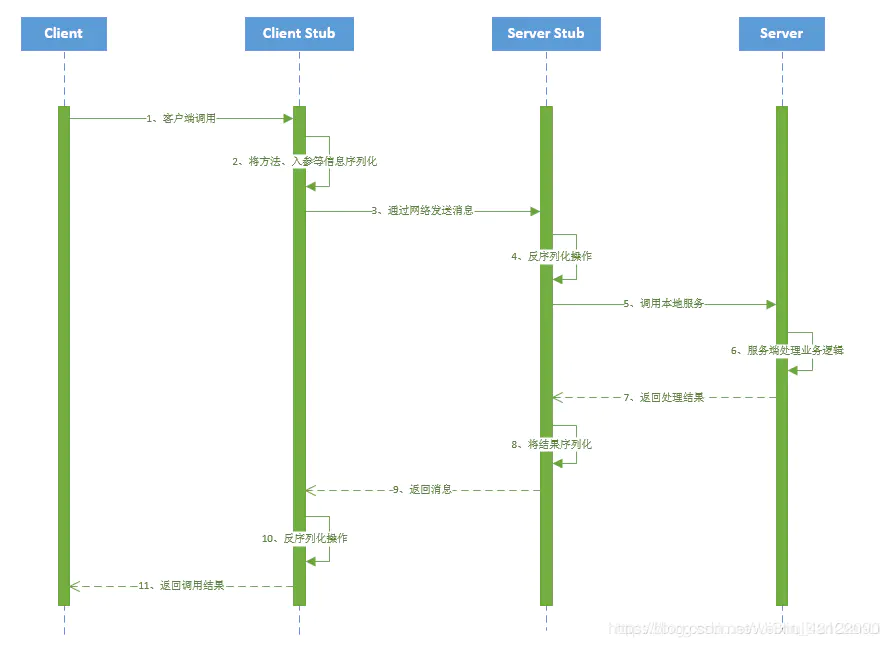

# Interview Questions - Middleware

## MQ

### 为什么使用 MQ？MQ 的优点

简答

1. 异步处理 - 相比于传统的串行、并行方式，提高了系统吞吐量。
2. 应用解耦 - 系统间通过消息通信，不用关心其他系统的处理。
3. 流量削锋 - 可以通过消息队列长度控制请求量；可以缓解短时间内的高并发请求。
4. 日志处理 - 解决大量日志传输。
5. 消息通讯 - 消息队列一般都内置了高效的通信机制，因此也可以用在纯的消息通讯。比如实现点对点消息队列，或者聊天室等。

详答

主要是：解耦、异步、削峰。

1. 解耦：A 系统发送数据到 BCD 三个系统，通过接口调用发送。如果 E 系统也要这个数据呢？那如果 C 系统现在不需要了呢？A 系统负责人几乎崩溃…A 系统跟其它各种乱七八糟的系统严重耦合，A 系统产生一条比较关键的数据，很多系统都需要 A 系统将这个数据发送过来。如果使用 MQ，A 系统产生一条数据，发送到 MQ 里面去，哪个系统需要数据自己去 MQ 里面消费。如果新系统需要数据，直接从 MQ 里消费即可；如果某个系统不需要这条数据了，就取消对 MQ 消息的消费即可。这样下来，A 系统压根儿不需要去考虑要给谁发送数据，不需要维护这个代码，也不需要考虑人家是否调用成功、失败超时等情况。
    就是一个系统或者一个模块，调用了多个系统或者模块，互相之间的调用很复杂，维护起来很麻烦。但是其实这个调用是不需要直接同步调用接口的，如果用 MQ 给它异步化解耦。
2. 异步：A 系统接收一个请求，需要在自己本地写库，还需要在 BCD 三个系统写库，自己本地写库要 3ms，BCD 三个系统分别写库要 300ms、450ms、200ms。最终请求总延时是 3 + 300 + 450 + 200 = 953ms，接近 1s，用户感觉搞个什么东西，慢死了慢死了。用户通过浏览器发起请求。如果使用 MQ，那么 A 系统连续发送 3 条消息到 MQ 队列中，假如耗时 5ms，A 系统从接受一个请求到返回响应给用户，总时长是 3 + 5 = 8ms。
3. 削峰：减少高峰时期对服务器压力。

### 消息队列有什么优缺点？RabbitMQ 有什么优缺点

优点上面已经说了，就是在特殊场景下有其对应的好处，解耦、异步、削峰。

缺点有以下几个：

1. 系统可用性降低
    本来系统运行好好的，现在你非要加入个消息队列进去，那消息队列挂了，你的系统不是呵呵了。因此，系统可用性会降低；
2. 系统复杂度提高
    加入了消息队列，要多考虑很多方面的问题，比如：一致性问题、如何保证消息不被重复消费、如何保证消息可靠性传输等。因此，需要考虑的东西更多，复杂性增大。
3. 一致性问题
    A 系统处理完了直接返回成功了，人都以为你这个请求就成功了；但是问题是，要是 BCD 三个系统那里，BD 两个系统写库成功了，结果 C 系统写库失败了，咋整？你这数据就不一致了。
    所以消息队列实际是一种非常复杂的架构，你引入它有很多好处，但是也得针对它带来的坏处做各种额外的技术方案和架构来规避掉，做好之后，你会发现，妈呀，系统复杂度提升了一个数量级，也许是复杂了 10 倍。但是关键时刻，用，还是得用的。

### 你们公司生产环境用的是什么消息中间件

这个首先你可以说下你们公司选用的是什么消息中间件，比如用的是 RabbitMQ，然后可以初步给一些你对不同 MQ 中间件技术的选型分析。

举个例子：比如说 ActiveMQ 是老牌的消息中间件，国内很多公司过去运用的还是非常广泛的，功能很强大。

但是问题在于没法确认 ActiveMQ 可以支撑互联网公司的高并发、高负载以及高吞吐的复杂场景，在国内互联网公司落地较少。而且使用较多的是一些传统企业，用 ActiveMQ 做异步调用和系统解耦。

然后你可以说说 RabbitMQ，他的好处在于可以支撑高并发、高吞吐、性能很高，同时有非常完善便捷的后台管理界面可以使用。

另外，他还支持集群化、高可用部署架构、消息高可靠支持，功能较为完善。

而且经过调研，国内各大互联网公司落地大规模 RabbitMQ 集群支撑自身业务的 case 较多，国内各种中小型互联网公司使用 RabbitMQ 的实践也比较多。

除此之外，RabbitMQ 的开源社区很活跃，较高频率的迭代版本，来修复发现的 bug 以及进行各种优化，因此综合考虑过后，公司采取了 RabbitMQ。

但是 RabbitMQ 也有一点缺陷，就是他自身是基于 erlang 语言开发的，所以导致较为难以分析里面的源码，也较难进行深层次的源码定制和改造，毕竟需要较为扎实的 erlang 语言功底才可以。

然后可以聊聊 RocketMQ，是阿里开源的，经过阿里的生产环境的超高并发、高吞吐的考验，性能卓越，同时还支持分布式事务等特殊场景。

而且 RocketMQ 是基于 Java 语言开发的，适合深入阅读源码，有需要可以站在源码层面解决线上生产问题，包括源码的二次开发和改造。

另外就是 Kafka。Kafka 提供的消息中间件的功能明显较少一些，相对上述几款 MQ 中间件要少很多。

但是 Kafka 的优势在于专为超高吞吐量的实时日志采集、实时数据同步、实时数据计算等场景来设计。

因此 Kafka 在大数据领域中配合实时计算技术（比如 Spark Streaming、Storm、Flink）使用的较多。但是在传统的 MQ 中间件使用场景中较少采用。

### Kafka、ActiveMQ、RabbitMQ、RocketMQ 有什么优缺点

| | ActiveMQ | RabbitMQ | RocketMQ | Kafka | ZeroMQ |
|:-:|:-:|:-:|:-:|:-:|:-:|
| 单机吞吐量 | 比 RabbitMQ 低 | 2.6w/s（消息做持久化） | 11.6w/s | 17.3w/s | 29w/s |
| 开发语言 | Java | Erlang | Java | Scala/Java | C |
| 主要维护者 | Apache | Mozilla/Spring | Alibaba | Apache | iMatix，创始人已去世 |
| 成熟度 | 成熟 | 成熟 | 开源版本不够成熟 | 比较成熟 | 只有 C、PHP 等版本成熟 |
| 订阅形式 | 点对点 (p2p)、广播（发布 - 订阅） | 提供了 4 种：direct, topic ,Headers 和 fanout。fanout 就是广播模式 | 基于 topic/messageTag 以及按照消息类型、属性进行正则匹配的发布订阅模式 | 基于 topic 以及按照 topic 进行正则匹配的发布订阅模式 | 点对点 (p2p) |
| 持久化 | 支持少量堆积 | 支持少量堆积 | 支持大量堆积 | 支持大量堆积 | 不支持 |
| 顺序消息 | 不支持 | 不支持 | 支持 | 支持 | 不支持 |
| 性能稳定性 | 好 | 好 | 一般 | 较差 | 很好 |
| 集群方式 | 支持简单集群模式，比如’主 - 备’，对高级集群模式支持不好。 | 支持简单集群，' 复制’模式，对高级集群模式支持不好。 | 常用 多对’Master-Slave’ 模式，开源版本需手动切换 Slave 变成 Master | 天然的‘Leader-Slave’无状态集群，每台服务器既是 Master 也是 Slave | 不支持 |
| 管理界面 | 一般 | 较好 | 一般 | 无 | 无 |

综上，各种对比之后，有如下建议：

一般的业务系统要引入 MQ，最早大家都用 ActiveMQ，但是现在确实大家用的不多了，没经过大规模吞吐量场景的验证，社区也不是很活跃，所以大家还是算了吧，我个人不推荐用这个了；

后来大家开始用 RabbitMQ，但是确实 erlang 语言阻止了大量的 Java 工程师去深入研究和掌控它，对公司而言，几乎处于不可控的状态，但是确实人家是开源的，比较稳定的支持，活跃度也高；

不过现在确实越来越多的公司会去用 RocketMQ，确实很不错，毕竟是阿里出品，但社区可能有突然黄掉的风险（目前 RocketMQ 已捐给 Apache，但 GitHub 上的活跃度其实不算高）对自己公司技术实力有绝对自信的，推荐用 RocketMQ，否则回去老老实实用 RabbitMQ 吧，人家有活跃的开源社区，绝对不会黄。

所以中小型公司，技术实力较为一般，技术挑战不是特别高，用 RabbitMQ 是不错的选择；大型公司，基础架构研发实力较强，用 RocketMQ 是很好的选择。

如果是大数据领域的实时计算、日志采集等场景，用 Kafka 是业内标准的，绝对没问题，社区活跃度很高，绝对不会黄，何况几乎是全世界这个领域的事实性规范。

### MQ 有哪些常见问题？如何解决这些问题

MQ 的常见问题有：

1. 消息的顺序问题
2. 消息的重复问题

#### 消息的顺序问题

消息有序指的是可以按照消息的发送顺序来消费。

假如生产者产生了 2 条消息：M1、M2，假定 M1 发送到 S1，M2 发送到 S2，如果要保证 M1 先于 M2 被消费，怎么做？


解决方案：

1. 保证生产者 - MQServer - 消费者是一对一对一的关系


缺陷：

1. 并行度就会成为消息系统的瓶颈（吞吐量不够）
2. 更多的异常处理，比如：只要消费端出现问题，就会导致整个处理流程阻塞，我们不得不花费更多的精力来解决阻塞的问题。 （2）通过合理的设计或者将问题分解来规避。
3. 不关注乱序的应用实际大量存在
4. 队列无序并不意味着消息无序 所以从业务层面来保证消息的顺序而不仅仅是依赖于消息系统，是一种更合理的方式。

#### 消息的重复问题

造成消息重复的根本原因是：网络不可达。

所以解决这个问题的办法就是绕过这个问题。那么问题就变成了：如果消费端收到两条一样的消息，应该怎样处理？

消费端处理消息的业务逻辑保持幂等性。只要保持幂等性，不管来多少条重复消息，最后处理的结果都一样。保证每条消息都有唯一编号且保证消息处理成功与去重表的日志同时出现。利用一张日志表来记录已经处理成功的消息的 ID，如果新到的消息 ID 已经在日志表中，那么就不再处理这条消息。

### 什么是 RabbitMQ

RabbitMQ 是一款开源的，Erlang 编写的，基于 AMQP 协议的消息中间件

### rabbitmq 的使用场景

1. 服务间异步通信
2. 顺序消费
3. 定时任务
4. 请求削峰

### RabbitMQ 基本概念

1. Broker： 简单来说就是消息队列服务器实体
2. Exchange： 消息交换机，它指定消息按什么规则，路由到哪个队列
3. Queue： 消息队列载体，每个消息都会被投入到一个或多个队列
4. Binding： 绑定，它的作用就是把 exchange 和 queue 按照路由规则绑定起来
5. Routing Key： 路由关键字，exchange 根据这个关键字进行消息投递
6. VHost： vhost 可以理解为虚拟 broker ，即 mini-RabbitMQ server。其内部均含有独立的 queue、exchange 和 binding 等，但最最重要的是，其拥有独立的权限系统，可以做到 vhost 范围的用户控制。当然，从 RabbitMQ 的全局角度，vhost 可以作为不同权限隔离的手段（一个典型的例子就是不同的应用可以跑在不同的 vhost 中）。
7. Producer： 消息生产者，就是投递消息的程序
8. Consumer： 消息消费者，就是接受消息的程序
9. Channel： 消息通道，在客户端的每个连接里，可建立多个 channel，每个 channel 代表一个会话任务

由 Exchange、Queue、RoutingKey 三个才能决定一个从 Exchange 到 Queue 的唯一的线路。

### RabbitMQ 的工作模式

#### 一.simple 模式（即最简单的收发模式）


1. 消息产生消息，将消息放入队列
2. 消息的消费者 (consumer) 监听 消息队列，如果队列中有消息，就消费掉，消息被拿走后，自动从队列中删除 (隐患 消息可能没有被消费者正确处理，已经从队列中消失了，造成消息的丢失，这里可以设置成手动的 ack, 但如果设置成手动 ack，处理完后要及时发送 ack 消息给队列，否则会造成内存溢出)。

#### 二.work 工作模式 (资源的竞争)


1. 消息产生者将消息放入队列消费者可以有多个，消费者 1, 消费者 2 同时监听同一个队列，消息被消费。C1 C2 共同争抢当前的消息队列内容，谁先拿到谁负责消费消息 (隐患：高并发情况下，默认会产生某一个消息被多个消费者共同使用，可以设置一个开关 (syncronize) 保证一条消息只能被一个消费者使用)。

#### 三.publish/subscribe 发布订阅 (共享资源)


1. 每个消费者监听自己的队列；
2. 生产者将消息发给 broker，由交换机将消息转发到绑定此交换机的每个队列，每个绑定交换机的队列都将接收到消息。

### 四.routing 路由模式


1. 消息生产者将消息发送给交换机按照路由判断，路由是字符串 (info) 当前产生的消息携带路由字符 (对象的方法), 交换机根据路由的 key, 只能匹配上路由 key 对应的消息队列，对应的消费者才能消费消息；
2. 根据业务功能定义路由字符串
3. 从系统的代码逻辑中获取对应的功能字符串，将消息任务扔到对应的队列中。
4. 业务场景:error 通知；EXCEPTION; 错误通知的功能；传统意义的错误通知；客户通知；利用 key 路由，可以将程序中的错误封装成消息传入到消息队列中，开发者可以自定义消费者，实时接收错误；

#### 五.topic 主题模式 (路由模式的一种)


1. 星号井号代表通配符
2. 星号代表多个单词，井号代表一个单词
3. 路由功能添加模糊匹配
4. 消息产生者产生消息，把消息交给交换机
5. 交换机根据 key 的规则模糊匹配到对应的队列，由队列的监听消费者接收消息消费

（在我的理解看来就是 routing 查询的一种模糊匹配，就类似 sql 的模糊查询方式）

### 如何保证 RabbitMQ 消息的顺序性

拆分多个 queue，每个 queue 一个 consumer，就是多一些 queue 而已，确实是麻烦点；或者就一个 queue 但是对应一个 consumer，然后这个 consumer 内部用内存队列做排队，然后分发给底层不同的 worker 来处理。

### 消息如何分发

若该队列至少有一个消费者订阅，消息将以循环（round-robin）的方式发送给消费者。每条消息只会分发给一个订阅的消费者（前提是消费者能够正常处理消息并进行确认）。通过路由可实现多消费的功能

### 消息怎么路由

消息提供方 -> 路由 -> 一至多个队列消息发布到交换器时，消息将拥有一个路由键（routing key），在消息创建时设定。通过队列路由键，可以把队列绑定到交换器上。消息到达交换器后，RabbitMQ 会将消息的路由键与队列的路由键进行匹配（针对不同的交换器有不同的路由规则）；

常用的交换器主要分为一下三种：

1. fanout：如果交换器收到消息，将会广播到所有绑定的队列上
2. direct：如果路由键完全匹配，消息就被投递到相应的队列
3. topic：可以使来自不同源头的消息能够到达同一个队列。 使用 topic 交换器时，可以使用通配符

### 消息基于什么传输

由于 TCP 连接的创建和销毁开销较大，且并发数受系统资源限制，会造成性能瓶颈。RabbitMQ 使用信道的方式来传输数据。信道是建立在真实的 TCP 连接内的虚拟连接，且每条 TCP 连接上的信道数量没有限制。

### 如何保证消息不被重复消费？或者说，如何保证消息消费时的幂等性

先说为什么会重复消费：正常情况下，消费者在消费消息的时候，消费完毕后，会发送一个确认消息给消息队列，消息队列就知道该消息被消费了，就会将该消息从消息队列中删除；

但是因为网络传输等等故障，确认信息没有传送到消息队列，导致消息队列不知道自己已经消费过该消息了，再次将消息分发给其他的消费者。

针对以上问题，一个解决思路是：保证消息的唯一性，就算是多次传输，不要让消息的多次消费带来影响；保证消息等幂性；

比如：在写入消息队列的数据做唯一标示，消费消息时，根据唯一标识判断是否消费过；

假设你有个系统，消费一条消息就往数据库里插入一条数据，要是你一个消息重复两次，你不就插入了两条，这数据不就错了？但是你要是消费到第二次的时候，自己判断一下是否已经消费过了，若是就直接扔了，这样不就保留了一条数据，从而保证了数据的正确性。

### 如何确保消息正确地发送至 RabbitMQ？ 如何确保消息接收方消费了消息

**发送方确认模式:**

将信道设置成 confirm 模式（发送方确认模式），则所有在信道上发布的消息都会被指派一个唯一的 ID。

一旦消息被投递到目的队列后，或者消息被写入磁盘后（可持久化的消息），信道会发送一个确认给生产者（包含消息唯一 ID）。

如果 RabbitMQ 发生内部错误从而导致消息丢失，会发送一条 nack（notacknowledged，未确认）消息。

发送方确认模式是异步的，生产者应用程序在等待确认的同时，可以继续发送消息。当确认消息到达生产者应用程序，生产者应用程序的回调方法就会被触发来处理确认消息。

**接收方确认机制:**

消费者接收每一条消息后都必须进行确认（消息接收和消息确认是两个不同操作）。只有消费者确认了消息，RabbitMQ 才能安全地把消息从队列中删除。

这里并没有用到超时机制，RabbitMQ 仅通过 Consumer 的连接中断来确认是否需要重新发送消息。也就是说，只要连接不中断，RabbitMQ 给了 Consumer 足够长的时间来处理消息。保证数据的最终一致性；

下面罗列几种特殊情况

1. 如果消费者接收到消息，在确认之前断开了连接或取消订阅，RabbitMQ 会认为消息没有被分发，然后重新分发给下一个订阅的消费者。（可能存在消息重复消费的隐患，需要去重）
2. 如果消费者接收到消息却没有确认消息，连接也未断开，则 RabbitMQ 认为该消费者繁忙，将不会给该消费者分发更多的消息。

### 如何保证 RabbitMQ 消息的可靠传输

消息不可靠的情况可能是消息丢失，劫持等原因；

丢失又分为：生产者丢失消息、消息列表丢失消息、消费者丢失消息；

**生产者丢失消息：** 从生产者弄丢数据这个角度来看，RabbitMQ 提供 transaction 和 confirm 模式来确保生产者不丢消息；

transaction 机制就是说：发送消息前，开启事务（channel.txSelect ()）, 然后发送消息，如果发送过程中出现什么异常，事务就会回滚（channel.txRollback ()）, 如果发送成功则提交事务（channel.txCommit ()）。然而，这种方式有个缺点：吞吐量下降；

confirm 模式用的居多：一旦 channel 进入 confirm 模式，所有在该信道上发布的消息都将会被指派一个唯一的 ID（从 1 开始），一旦消息被投递到所有匹配的队列之后；

rabbitMQ 就会发送一个 ACK 给生产者（包含消息的唯一 ID），这就使得生产者知道消息已经正确到达目的队列了；

如果 rabbitMQ 没能处理该消息，则会发送一个 Nack 消息给你，你可以进行重试操作。

**消息队列丢数据：** 消息持久化。

处理消息队列丢数据的情况，一般是开启持久化磁盘的配置。

这个持久化配置可以和 confirm 机制配合使用，你可以在消息持久化磁盘后，再给生产者发送一个 Ack 信号。

这样，如果消息持久化磁盘之前，rabbitMQ 阵亡了，那么生产者收不到 Ack 信号，生产者会自动重发。

那么如何持久化呢？

这里顺便说一下吧，其实也很容易，就下面两步

1. 将 queue 的持久化标识 durable 设置为 true, 则代表是一个持久的队列
2. 发送消息的时候将 deliveryMode=2

这样设置以后，即使 rabbitMQ 挂了，重启后也能恢复数据

**消费者丢失消息：** 消费者丢数据一般是因为采用了自动确认消息模式，改为手动确认消息即可！

消费者在收到消息之后，处理消息之前，会自动回复 RabbitMQ 已收到消息；

如果这时处理消息失败，就会丢失该消息；

解决方案：处理消息成功后，手动回复确认消息。

### 为什么不应该对所有的 message 都使用持久化机制

1. 首先，必然导致性能的下降，因为写磁盘比写 RAM 慢的多，message 的吞吐量可能有 10 倍的差距。
2. 其次，message 的持久化机制用在 RabbitMQ 的内置 cluster 方案时会出现 “坑爹” 问题。矛盾点在于，若 message 设置了 persistent 属性，但 queue 未设置 durable 属性，那么当该 queue 的 owner node 出现异常后，在未重建该 queue 前，发往该 queue 的 message 将被 blackholed ；若 message 设置了 persistent 属性，同时 queue 也设置了 durable 属性，那么当 queue 的 owner node 异常且无法重启的情况下，则该 queue 无法在其他 node 上重建，只能等待其 owner node 重启后，才能恢复该 queue 的使用，而在这段时间内发送给该 queue 的 message 将被 blackholed 。
3. 所以，是否要对 message 进行持久化，需要综合考虑性能需要，以及可能遇到的问题。若想达到 100,000 条 / 秒以上的消息吞吐量（单 RabbitMQ 服务器），则要么使用其他的方式来确保 message 的可靠 delivery ，要么使用非常快速的存储系统以支持全持久化（例如使用 SSD）。另外一种处理原则是：仅对关键消息作持久化处理（根据业务重要程度），且应该保证关键消息的量不会导致性能瓶颈。

### 如何保证高可用的？RabbitMQ 的集群

RabbitMQ 是比较有代表性的，因为是基于主从（非分布式）做高可用性的，我们就以 RabbitMQ 为例子讲解第一种 MQ 的高可用性怎么实现。RabbitMQ 有三种模式：单机模式、普通集群模式、镜像集群模式。

**单机模式，** 就是 Demo 级别的，一般就是你本地启动了玩玩儿的？，没人生产用单机模式

**普通集群模式** ，意思就是在多台机器上启动多个 RabbitMQ 实例，每个机器启动一个。你创建的 queue，只会放在一个 RabbitMQ 实例上，但是每个实例都同步 queue 的元数据（元数据可以认为是 queue 的一些配置信息，通过元数据，可以找到 queue 所在实例）。你消费的时候，实际上如果连接到了另外一个实例，那么那个实例会从 queue 所在实例上拉取数据过来。这方案主要是提高吞吐量的，就是说让集群中多个节点来服务某个 queue 的读写操作。

**镜像集群模式：** 这种模式，才是所谓的 RabbitMQ 的高可用模式。跟普通集群模式不一样的是，在镜像集群模式下，你创建的 queue，无论元数据还是 queue 里的消息都会存在于多个实例上，就是说，每个 RabbitMQ 节点都有这个 queue 的一个完整镜像，包含 queue 的全部数据的意思。然后每次你写消息到 queue 的时候，都会自动把消息同步到多个实例的 queue 上。RabbitMQ 有很好的管理控制台，就是在后台新增一个策略，这个策略是镜像集群模式的策略，指定的时候是可以要求数据同步到所有节点的，也可以要求同步到指定数量的节点，再次创建 queue 的时候，应用这个策略，就会自动将数据同步到其他的节点上去了。这样的话，好处在于，你任何一个机器宕机了，没事儿，其它机器（节点）还包含了这个 queue 的完整数据，别的 consumer 都可以到其它节点上去消费数据。坏处在于，第一，这个性能开销也太大了吧，消息需要同步到所有机器上，导致网络带宽压力和消耗很重！RabbitMQ 一个 queue 的数据都是放在一个节点里的，镜像集群下，也是每个节点都放这个 queue 的完整数据。

### 如何解决消息队列的延时以及过期失效问题？消息队列满了以后该怎么处理？有几百万消息持续积压几小时，说说怎么解决

消息积压处理办法：临时紧急扩容：

先修复 consumer 的问题，确保其恢复消费速度，然后将现有 cnosumer 都停掉。
新建一个 topic，partition 是原来的 10 倍，临时建立好原先 10 倍的 queue 数量。
然后写一个临时的分发数据的 consumer 程序，这个程序部署上去消费积压的数据，消费之后不做耗时的处理，直接均匀轮询写入临时建立好的 10 倍数量的 queue。
接着临时征用 10 倍的机器来部署 consumer，每一批 consumer 消费一个临时 queue 的数据。这种做法相当于是临时将 queue 资源和 consumer 资源扩大 10 倍，以正常的 10 倍速度来消费数据。
等快速消费完积压数据之后，得恢复原先部署的架构，重新用原先的 consumer 机器来消费消息。
MQ 中消息失效：假设你用的是 RabbitMQ，RabbtiMQ 是可以设置过期时间的，也就是 TTL。如果消息在 queue 中积压超过一定的时间就会被 RabbitMQ 给清理掉，这个数据就没了。那这就是第二个坑了。这就不是说数据会大量积压在 mq 里，而是大量的数据会直接搞丢。我们可以采取一个方案，就是批量重导，这个我们之前线上也有类似的场景干过。就是大量积压的时候，我们当时就直接丢弃数据了，然后等过了高峰期以后，比如大家一起喝咖啡熬夜到晚上 12 点以后，用户都睡觉了。这个时候我们就开始写程序，将丢失的那批数据，写个临时程序，一点一点的查出来，然后重新灌入 mq 里面去，把白天丢的数据给他补回来。也只能是这样了。假设 1 万个订单积压在 mq 里面，没有处理，其中 1000 个订单都丢了，你只能手动写程序把那 1000 个订单给查出来，手动发到 mq 里去再补一次。

mq 消息队列块满了：如果消息积压在 mq 里，你很长时间都没有处理掉，此时导致 mq 都快写满了，咋办？这个还有别的办法吗？没有，谁让你第一个方案执行的太慢了，你临时写程序，接入数据来消费，消费一个丢弃一个，都不要了，快速消费掉所有的消息。然后走第二个方案，到了晚上再补数据吧。

### 设计 MQ 思路

比如说这个消息队列系统，我们从以下几个角度来考虑一下：

首先这个 mq 得支持可伸缩性吧，就是需要的时候快速扩容，就可以增加吞吐量和容量，那怎么搞？设计个分布式的系统呗，参照一下 kafka 的设计理念，broker -> topic -> partition，每个 partition 放一个机器，就存一部分数据。如果现在资源不够了，简单啊，给 topic 增加 partition，然后做数据迁移，增加机器，不就可以存放更多数据，提供更高的吞吐量了？

其次你得考虑一下这个 mq 的数据要不要落地磁盘吧？那肯定要了，落磁盘才能保证别进程挂了数据就丢了。那落磁盘的时候怎么落啊？顺序写，这样就没有磁盘随机读写的寻址开销，磁盘顺序读写的性能是很高的，这就是 kafka 的思路。

其次你考虑一下你的 mq 的可用性啊？这个事儿，具体参考之前可用性那个环节讲解的 kafka 的高可用保障机制。多副本 -> leader & follower -> broker 挂了重新选举 leader 即可对外服务。

能不能支持数据 0 丢失啊？可以的，参考我们之前说的那个 kafka 数据零丢失方案。

## Zookeeper

### 1. ZooKeeper 是什么

ZooKeeper 是一个开源的分布式协调服务。它是一个为分布式应用提供一致性服务的软件，分布式应用程序可以基于 Zookeeper 实现诸如数据发布 / 订阅、负载均衡、命名服务、分布式协调 / 通知、集群管理、Master 选举、分布式锁和分布式队列等功能。

ZooKeeper 的目标就是封装好复杂易出错的关键服务，将简单易用的接口和性能高效、功能稳定的系统提供给用户。

Zookeeper 保证了如下分布式一致性特性：

1. 顺序一致性
2. 原子性
3. 单一视图
4. 可靠性
5. 实时性（最终一致性）

客户端的读请求可以被集群中的任意一台机器处理，如果读请求在节点上注册了监听器，这个监听器也是由所连接的 zookeeper 机器来处理。对于写请求，这些请求会同时发给其他 zookeeper 机器并且达成一致后，请求才会返回成功。因此，随着 zookeeper 的集群机器增多，读请求的吞吐会提高但是写请求的吞吐会下降。

有序性是 zookeeper 中非常重要的一个特性，所有的更新都是全局有序的，每个更新都有一个唯一的时间戳，这个时间戳称为 zxid（Zookeeper Transaction Id）。而读请求只会相对于更新有序，也就是读请求的返回结果中会带有这个 zookeeper 最新的 zxid。

### 2. ZooKeeper 提供了什么

1. 文件系统
2. 通知机制

### 3. Zookeeper 文件系统

Zookeeper 提供一个多层级的节点命名空间（节点称为 znode）。与文件系统不同的是，这些节点都可以设置关联的数据，而文件系统中只有文件节点可以存放数据而目录节点不行。

Zookeeper 为了保证高吞吐和低延迟，在内存中维护了这个树状的目录结构，这种特性使得 Zookeeper 不能用于存放大量的数据，每个节点的存放数据上限为 1M。

### 4. Zookeeper 怎么保证主从节点的状态同步

Zookeeper 的核心是原子广播机制，这个机制保证了各个 server 之间的同步。实现这个机制的协议叫做 Zab 协议。Zab 协议有两种模式，它们分别是恢复模式和广播模式。

1. 恢复模式
    当服务启动或者在领导者崩溃后，Zab 就进入了恢复模式，当领导者被选举出来，且大多数 server 完成了和 leader 的状态同步以后，恢复模式就结束了。状态同步保证了 leader 和 server 具有相同的系统状态。
2. 广播模式
    一旦 leader 已经和多数的 follower 进行了状态同步后，它就可以开始广播消息了，即进入广播状态。这时候当一个 server 加入 ZooKeeper 服务中，它会在恢复模式下启动，发现 leader，并和 leader 进行状态同步。待到同步结束，它也参与消息广播。ZooKeeper 服务一直维持在 Broadcast 状态，直到 leader 崩溃了或者 leader 失去了大部分的 followers 支持。

### 5. 四种类型的数据节点 Znode

1. PERSISTENT - 持久节点
    除非手动删除，否则节点一直存在于 Zookeeper 上
2. EPHEMERAL - 临时节点
    临时节点的生命周期与客户端会话绑定，一旦客户端会话失效（客户端与 zookeeper 连接断开不一定会话失效），那么这个客户端创建的所有临时节点都会被移除。
3. PERSISTENT_SEQUENTIAL - 持久顺序节点
    基本特性同持久节点，只是增加了顺序属性，节点名后边会追加一个由父节点维护的自增整型数字。
4. EPHEMERAL_SEQUENTIAL - 临时顺序节点
    基本特性同临时节点，增加了顺序属性，节点名后边会追加一个由父节点维护的自增整型数字。

### 6. Zookeeper Watcher 机制 – 数据变更通知

Zookeeper 允许客户端向服务端的某个 Znode 注册一个 Watcher 监听，当服务端的一些指定事件触发了这个 Watcher，服务端会向指定客户端发送一个事件通知来实现分布式的通知功能，然后客户端根据 Watcher 通知状态和事件类型做出业务上的改变。

工作机制：

1. 客户端注册 watcher
2. 服务端处理 watcher
3. 客户端回调 watcher

Watcher 特性总结：

1. 一次性
    无论是服务端还是客户端，一旦一个 Watcher 被 触 发 ，Zookeeper 都会将其从相应的存储中移除。这样的设计有效的减轻了服务端的压力，不然对于更新非常频繁的节点，服务端会不断的向客户端发送事件通知，无论对于网络还是服务端的压力都非常大。
2. 客户端串行执行
    客户端 Watcher 回调的过程是一个串行同步的过程。
3. 轻量
    1. Watcher 通知非常简单，只会告诉客户端发生了事件，而不会说明事件的具体内容。
    2. 客户端向服务端注册 Watcher 的时候，并不会把客户端真实的 Watcher 对象实体传递到服务端，仅仅是在客户端请求中使用 boolean 类型属性进行了标记。
4. watcher event 异步发送 watcher 的通知事件从 server 发送到 client 是异步的，这就存在一个问题，不同的客户端和服务器之间通过 socket 进行通信，由于网络延迟或其他因素导致客户端在不通的时刻监听到事件，由于 Zookeeper 本身提供了 ordering guarantee，即客户端监听事件后，才会感知它所监视 znode 发生了变化。所以我们使用 Zookeeper 不能期望能够监控到节点每次的变化。Zookeeper 只能保证最终的一致性，而无法保证强一致性。
5. 注册 watcher getData、exists、getChildren
6. 触发 watcher create、delete、setData
7. 当一个客户端连接到一个新的服务器上时，watch 将会被以任意会话事件触发。当与一个服务器失去连接的时候，是无法接收到 watch 的。而当 client 重新连接时，如果需要的话，所有先前注册过的 watch，都会被重新注册。通常这是完全透明的。只有在一个特殊情况下，watch 可能会丢失：对于一个未创建的 znode 的 exist watch，如果在客户端断开连接期间被创建了，并且随后在客户端连接上之前又删除了，这种情况下，这个 watch 事件可能会被丢失。

### 7. 客户端注册 Watcher 实现

1. 调用 getData ()/getChildren ()/exist () 三个 API，传入 Watcher 对象
2. 标记请求 request，封装 Watcher 到 WatchRegistration
3. 封装成 Packet 对象，发服务端发送 request
4. 收到服务端响应后，将 Watcher 注册到 ZKWatcherManager 中进行管理
5. 请求返回，完成注册。

### 8. 服务端处理 Watcher 实现

1. 服务端接收 Watcher 并存储
    接收到客户端请求，处理请求判断是否需要注册 Watcher，需要的话将数据节点的节点路径和 ServerCnxn（ServerCnxn 代表一个客户端和服务端的连接，实现了 Watcher 的 process 接口，此时可以看成一个 Watcher 对象）存储在 WatcherManager 的 WatchTable 和 watch2Paths 中去。
2. Watcher 触发
    以服务端接收到 setData () 事务请求触发 NodeDataChanged 事件为例：
    1. 封装 WatchedEvent
        将通知状态（SyncConnected）、事件类型（NodeDataChanged）以及节点路径封装成一个 WatchedEvent 对象
    2. 查询 Watcher
        从 WatchTable 中根据节点路径查找 Watcher
    3. 没找到；说明没有客户端在该数据节点上注册过 Watcher
    4. 找到；提取并从 WatchTable 和 Watch2Paths 中删除对应 Watcher（从这里可以看出 Watcher 在服务端是一次性的，触发一次就失效了）

3. 调用 process 方法来触发 Watcher
    这里 process 主要就是通过 ServerCnxn 对应的 TCP 连接发送 Watcher 事件通知。

### 9. 客户端回调 Watcher

客户端 SendThread 线程接收事件通知，交由 EventThread 线程回调 Watcher。

客户端的 Watcher 机制同样是一次性的，一旦被触发后，该 Watcher 就失效了。

### 10. ACL 权限控制机制

UGO（User/Group/Others）

目前在 Linux/Unix 文件系统中使用，也是使用最广泛的权限控制方式。是一种粗粒度的文件系统权限控制模式。

ACL（Access Control List）访问控制列表

包括三个方面：

1. 权限模式（Scheme）
    1. IP：从 IP 地址粒度进行权限控制
    2. Digest：最常用，用类似于 username:password 的权限标识来进行权限配置，便于区分不同应用来进行权限控制
    3. World：最开放的权限控制方式，是一种特殊的 digest 模式，只有一个权限标识 “world:anyone”
    4.Super：超级用户
2. 授权对象
    授权对象指的是权限赋予的用户或一个指定实体，例如 IP 地址或是机器灯。
3. 权限 Permission
    1. CREATE：数据节点创建权限，允许授权对象在该 Znode 下创建子节点
    2. DELETE：子节点删除权限，允许授权对象删除该数据节点的子节点
    3. READ：数据节点的读取权限，允许授权对象访问该数据节点并读取其数据内容或子节点列表等
    4. WRITE：数据节点更新权限，允许授权对象对该数据节点进行更新操作
    5. ADMIN：数据节点管理权限，允许授权对象对该数据节点进行 ACL 相关设置操作

### 11. Chroot 特性

3.2.0 版本后，添加了 Chroot 特性，该特性允许每个客户端为自己设置一个命名空间。如果一个客户端设置了 Chroot，那么该客户端对服务器的任何操作，都将会被限制在其自己的命名空间下。

通过设置 Chroot，能够将一个客户端应用于 Zookeeper 服务端的一颗子树相对应，在那些多个应用公用一个 Zookeeper 进群的场景下，对实现不同应用间的相互隔离非常有帮助。

### 12. 会话管理

1. 分桶策略：将类似的会话放在同一区块中进行管理，以便于 Zookeeper 对会话进行不同区块的隔离处理以及同一区块的统一处理。
2. 分配原则：每个会话的 “下次超时时间点”（ExpirationTime）

计算公式：

```math
ExpirationTime_ = currentTime + sessionTimeout
ExpirationTime = (ExpirationTime_ / ExpirationInrerval + 1) *
ExpirationInterval , ExpirationInterval 是指 Zookeeper 会话超时检查时间间隔，默认 tickTime
```

### 13. 服务器角色

1. Leader
    1. 事务请求的唯一调度和处理者，保证集群事务处理的顺序性
    2. 集群内部各服务的调度者
2. Follower
    1. 处理客户端的非事务请求，转发事务请求给 Leader 服务器
    2. 参与事务请求 Proposal 的投票
    3. 参与 Leader 选举投票
3. Observer
    1. 3.0 版本以后引入的一个服务器角色，在不影响集群事务处理能力的基础上提升集群的非事务处理能力
    2. 处理客户端的非事务请求，转发事务请求给 Leader 服务器
    3. 不参与任何形式的投票

### 14. Zookeeper 下 Server 工作状态

服务器具有四种状态，分别是 LOOKING、FOLLOWING、LEADING、OBSERVING。

1. LOOKING：寻 找 Leader 状态。当服务器处于该状态时，它会认为当前集群中没有 Leader，因此需要进入 Leader 选举状态。
2. FOLLOWING：跟随者状态。表明当前服务器角色是 Follower。
3. LEADING：领导者状态。表明当前服务器角色是 Leader。
4. OBSERVING：观察者状态。表明当前服务器角色是 Observer。

### 15.  数据同步

整个集群完成 Leader 选举之后，Learner（Follower 和 Observer 的统称）回向 Leader 服务器进行注册。当 Learner 服务器想 Leader 服务器完成注册后，进入数据同步环节。

数据同步流程：（均以消息传递的方式进行）

1. Learner 向 Learder 注册
2. 数据同步
3. 同步确认

Zookeeper 的数据同步通常分为四类：

1. 直接差异化同步（DIFF 同步）
2. 先回滚再差异化同步（TRUNC+DIFF 同步）
3. 仅回滚同步（TRUNC 同步）
4. 全量同步（SNAP 同步）

在进行数据同步前，Leader 服务器会完成数据同步初始化：

peerLastZxid：

1. 从 learner 服务器注册时发送的 ACKEPOCH 消息中提取 lastZxid（该 Learner 服务器最后处理的 ZXID）

minCommittedLog：

1. Leader 服务器 Proposal 缓存队列 committedLog 中最小 ZXIDmaxCommittedLog：
2. Leader 服务器 Proposal 缓存队列 committedLog 中最大 ZXID 直接差异化同步（DIFF 同步）
3. 场景：peerLastZxid 介于 minCommittedLog 和 maxCommittedLog 之间先回滚再差异化同步（TRUNC+DIFF 同步）
4. 场景：当新的 Leader 服务器发现某个 Learner 服务器包含了一条自己没有的事务记录，那么就需要让该 Learner 服务器进行事务回滚–回滚到 Leader 服务器上存在的，同时也是最接近于 peerLastZxid 的 ZXID 仅回滚同步（TRUNC 同步）
5. 场景：peerLastZxid 大于 maxCommittedLog

全量同步（SNAP 同步）

1. 场景一：peerLastZxid 小于 minCommittedLog
2. 场景二：Leader 服务器上没有 Proposal 缓存队列且 peerLastZxid 不等于 lastProcessZxid

### 16.  zookeeper 是如何保证事务的顺序一致性的

zookeeper 采用了全局递增的事务 Id 来标识，所有的 proposal（提议）都在被提出的时候加上了 zxid，zxid 实际上是一个 64 位的数字，高 32 位是 epoch（ 时期；纪元；世；新时代）用来标识 leader 周期，如果有新的 leader 产生出来，epoch 会自增，低 32 位用来递增计数。当新产生 proposal 的时候，会依据数据库的两阶段过程，首先会向其他的 server 发出事务执行请求，如果超过半数的机器都能执行并且能够成功，那么就会开始执行。

### 17. 分布式集群中为什么会有 Master 主节点

在分布式环境中，有些业务逻辑只需要集群中的某一台机器进行执行，其他的机器可以共享这个结果，这样可以大大减少重复计算，提高性能，于是就需要进行 leader 选举。

### 18. zk 节点宕机如何处理

Zookeeper 本身也是集群，推荐配置不少于 3 个服务器。Zookeeper 自身也要保证当一个节点宕机时，其他节点会继续提供服务。

如果是一个 Follower 宕机，还有 2 台服务器提供访问，因为 Zookeeper 上的数据是有多个副本的，数据并不会丢失；

如果是一个 Leader 宕机，Zookeeper 会选举出新的 Leader。

ZK 集群的机制是只要超过半数的节点正常，集群就能正常提供服务。只有在 ZK 节点挂得太多，只剩一半或不到一半节点能工作，集群才失效。

所以

3 个节点的 cluster 可以挂掉 1 个节点 (leader 可以得到 2 票> 1.5)

2 个节点的 cluster 就不能挂掉任何 1 个节点了 (leader 可以得到 1 票 <=1)

### 19. zookeeper 负载均衡和 nginx 负载均衡区别

zk 的负载均衡是可以调控，nginx 只是能调权重，其他需要可控的都需要自己写插件；但是 nginx 的吞吐量比 zk 大很多，应该说按业务选择用哪种方式。

### 20. Zookeeper 有哪几种几种部署模式

Zookeeper 有三种部署模式：

1. 单机部署：一台集群上运行；
2. 集群部署：多台集群运行；
3. 伪集群部署：一台集群启动多个 Zookeeper 实例运行。

### 21.  集群最少要几台机器，集群规则是怎样的？集群中有 3 台服务器，其中一个节点宕机，这个时候 Zookeeper 还可以使用吗

集群规则为 2N+1 台，N>0，即 3 台。可以继续使用，单数服务器只要没超过一半的服务器宕机就可以继续使用。

### 22. 集群支持动态添加机器吗

其实就是水平扩容了，Zookeeper 在这方面不太好。两种方式：

全部重启：关闭所有 Zookeeper 服务，修改配置之后启动。不影响之前客户端的会话。

逐个重启：在过半存活即可用的原则下，一台机器重启不影响整个集群对外提供服务。这是比较常用的方式。

3.5 版本开始支持动态扩容。

### 23. Zookeeper 对节点的 watch 监听通知是永久的吗？为什么不是永久的

不是。官方声明：一个 Watch 事件是一个一次性的触发器，当被设置了 Watch 的数据发生了改变的时候，则服务器将这个改变发送给设置了 Watch 的客户端，以便通知它们。

为什么不是永久的，举个例子，如果服务端变动频繁，而监听的客户端很多情况下，每次变动都要通知到所有的客户端，给网络和服务器造成很大压力。

一般是客户端执行 getData (“/ 节点 A”,true)，如果节点 A 发生了变更或删除，客户端会得到它的 watch 事件，但是在之后节点 A 又发生了变更，而客户端又没有设置 watch 事件，就不再给客户端发送。

在实际应用中，很多情况下，我们的客户端不需要知道服务端的每一次变动，我只要最新的数据即可。

### 24. Zookeeper 的 java 客户端都有哪些

java 客户端：zk 自带的 zkclient 及 Apache 开源的 Curator。

### 25. chubby 是什么，和 zookeeper 比你怎么看

chubby 是 google 的，完全实现 paxos 算法，不开源。zookeeper 是 chubby 的开源实现，使用 zab 协议，paxos 算法的变种。

### 26. 说几个 zookeeper 常用的命令

常用命令：ls get set create delete 等。

### 27. ZAB 和 Paxos 算法的联系与区别

相同点：

1. 两者都存在一个类似于 Leader 进程的角色，由其负责协调多个 Follower 进程的运行
2. Leader 进程都会等待超过半数的 Follower 做出正确的反馈后，才会将一个提案进行提交
3. ZAB 协议中，每个 Proposal 中都包含一个 epoch 值来代表当前的 Leader 周期，Paxos 中名字为 Ballot

不同点：

1. ZAB 用来构建高可用的分布式数据主备系统（Zookeeper），Paxos 是用来构建分布式一致性状态机系统。

### 28.  Zookeeper 的典型应用场景

Zookeeper 是一个典型的发布 / 订阅模式的分布式数据管理与协调框架，开发人员可以使用它来进行分布式数据的发布和订阅。

通过对 Zookeeper 中丰富的数据节点进行交叉使用，配合 Watcher 事件通知机制，可以非常方便的构建一系列分布式应用中年都会涉及的核心功能，如：

1. 数据发布 / 订阅
2. 负载均衡
3. 命名服务
4. 分布式协调 / 通知
5. 集群管理
6. Master 选举
7. 分布式锁
8. 分布式队列

#### 数据发布 / 订阅

**介绍:**

数据发布 / 订阅系统，即所谓的配置中心，顾名思义就是发布者发布数据供订阅者进行数据订阅。

**目的:**

1. 动态获取数据（配置信息）

2. 实现数据（配置信息）的集中式管理和数据的动态更新

**设计模式:**

1. Push 模式
2. Pull 模式

**数据（配置信息）特性:**

1. 数据量通常比较小
2. 数据内容在运行时会发生动态更新
3. 集群中各机器共享，配置一致

如：机器列表信息、运行时开关配置、数据库配置信息等

**基于 Zookeeper 的实现方式:**

1. 数据存储：将数据（配置信息）存储到 Zookeeper 上的一个数据节点
2. 数据获取：应用在启动初始化节点从 Zookeeper 数据节点读取数据，并在该节点上注册一个数据变更 Watcher
3. 数据变更：当变更数据时，更新 Zookeeper 对应节点数据，Zookeeper 会将数据变更通知发到各客户端，客户端接到通知后重新读取变更后的数据即可。

**负载均衡:**

zk 的命名服务

命名服务是指通过指定的名字来获取资源或者服务的地址，利用 zk 创建一个全局的路径，这个路径就可以作为一个名字，指向集群中的集群，提供的服务的地址，或者一个远程的对象等等。

**分布式通知和协调:**

对于系统调度来说：操作人员发送通知实际是通过控制台改变某个节点的状态，然后 zk 将这些变化发送给注册了这个节点的 watcher 的所有客户端。

对于执行情况汇报：每个工作进程都在某个目录下创建一个临时节点。并携带工作的进度数据，这样汇总的进程可以监控目录子节点的变化获得工作进度的实时的全局情况。

z**k 的命名服务（文件系统）:**

命名服务是指通过指定的名字来获取资源或者服务的地址，利用 zk 创建一个全局的路径，即是唯一的路径，这个路径就可以作为一个名字，指向集群中的集群，提供的服务的地址，或者一个远程的对象等等。

**zk 的配置管理（文件系统、通知机制）:**

程序分布式的部署在不同的机器上，将程序的配置信息放在 zk 的 znode 下，当有配置发生改变时，也就是 znode 发生变化时，可以通过改变 zk 中某个目录节点的内容，利用 watcher 通知给各个客户端，从而更改配置。

**Zookeeper 集群管理（文件系统、通知机制）:**

所谓集群管理无在乎两点：是否有机器退出和加入、选举 master。

对于第一点，所有机器约定在父目录下创建临时目录节点，然后监听父目录节点

的子节点变化消息。一旦有机器挂掉，该机器与 zookeeper 的连接断开，其所创建的临时目录节点被删除，所有其他机器都收到通知：某个兄弟目录被删除，于是，所有人都知道：它上船了。

新机器加入也是类似，所有机器收到通知：新兄弟目录加入，highcount 又有了，对于第二点，我们稍微改变一下，所有机器创建临时顺序编号目录节点，每次选取编号最小的机器作为 master 就好。

**Zookeeper 分布式锁（文件系统、通知机制）:**

有了 zookeeper 的一致性文件系统，锁的问题变得容易。锁服务可以分为两类，一个是保持独占，另一个是控制时序。

1. 对于第一类，我们将 zookeeper 上的一个 znode 看作是一把锁，通过 createznode 的方式来实现。所有客户端都去创建 /distribute_lock 节点，最终成功创建的那个客户端也即拥有了这把锁。用完删除掉自己创建的 distribute_lock 节点就释放出锁。
2. 对于第二类， /distribute_lock 已经预先存在，所有客户端在它下面创建临时顺序编号目录节点，和选 master 一样，编号最小的获得锁，用完删除，依次方便。

**Zookeeper 队列管理（文件系统、通知机制）:**

两种类型的队列：

1. 同步队列，当一个队列的成员都聚齐时，这个队列才可用，否则一直等待所有成员到达。
2. 队列按照 FIFO 方式进行入队和出队操作。

第一类，在约定目录下创建临时目录节点，监听节点数目是否是我们要求的数目。

第二类，和分布式锁服务中的控制时序场景基本原理一致，入列有编号，出列按编号。在特定的目录下创建 PERSISTENT_SEQUENTIAL 节点，创建成功时 Watcher 通知等待的队列，队列删除序列号最小的节点用以消费。此场景下 Zookeeper 的 znode 用于消息存储，znode 存储的数据就是消息队列中的消息内容，SEQUENTIAL 序列号就是消息的编号，按序取出即可。由于创建的节点是持久化的，所以不必担心队列消息的丢失问题。

### 29. Zookeeper 都有哪些功能

1. 集群管理：监控节点存活状态、运行请求等；
2. 主节点选举：主节点挂掉了之后可以从备用的节点开始新一轮选主，主节点选举说的就是这个选举的过程，使用 Zookeeper 可以协助完成这个过程；
3. 分布式锁：Zookeeper 提供两种锁：独占锁、共享锁。独占锁即一次只能有一个线程使用资源，共享锁是读锁共享，读写互斥，即可以有多线线程同时读同一个资源，如果要使用写锁也只能有一个线程使用。Zookeeper 可以对分布式锁进行控制。
4. 命名服务：在分布式系统中，通过使用命名服务，客户端应用能够根据指定名字来获取资源或服务的地址，提供者等信息。

### 30.  说一下 Zookeeper 的通知机制

client 端会对某个 znode 建立一个 watcher 事件，当该 znode 发生变化时，这些 client 会收到 zk 的通知，然后 client 可以根据 znode 变化来做出业务上的改变等。

### 31. Zookeeper 和 Dubbo 的关系

**Zookeeper 的作用：**

zookeeper 用来注册服务和进行负载均衡，哪一个服务由哪一个机器来提供必需让调用者知道，简单来说就是 ip 地址和服务名称的对应关系。当然也可以通过硬编码的方式把这种对应关系在调用方业务代码中实现，但是如果提供服务的机器挂掉调用者无法知晓，如果不更改代码会继续请求挂掉的机器提供服务。zookeeper 通过心跳机制可以检测挂掉的机器并将挂掉机器的 ip 和服务对应关系从列表中删除。至于支持高并发，简单来说就是横向扩展，在不更改代码的情况通过添加机器来提高运算能力。通过添加新的机器向 zookeeper 注册服务，服务的提供者多了能服务的客户就多了。

**dubbo：**

是管理中间层的工具，在业务层到数据仓库间有非常多服务的接入和服务提供者需要调度，dubbo 提供一个框架解决这个问题。
注意这里的 dubbo 只是一个框架，至于你架子上放什么是完全取决于你的，就像一个汽车骨架，你需要配你的轮子引擎。这个框架中要完成调度必须要有一个分布式的注册中心，储存所有服务的元数据，你可以用 zk，也可以用别的，只是大家都用 zk。

**zookeeper 和 dubbo 的关系：**

Dubbo 的将注册中心进行抽象，它可以外接不同的存储媒介给注册中心提供服务，有 ZooKeeper，Memcached，Redis 等。

引入了 ZooKeeper 作为存储媒介，也就把 ZooKeeper 的特性引进来。首先是负载均衡，单注册中心的承载能力是有限的，在流量达到一定程度的时 候就需要分流，负载均衡就是为了分流而存在的，一个 ZooKeeper 群配合相应的 Web 应用就可以很容易达到负载均衡；资源同步，单单有负载均衡还不 够，节点之间的数据和资源需要同步，ZooKeeper 集群就天然具备有这样的功能；命名服务，将树状结构用于维护全局的服务地址列表，服务提供者在启动 的时候，向 ZooKeeper 上的指定节点 /dubbo/${serviceName}/providers 目录下写入自己的 URL 地址，这个操作就完成了服务的发布。 其他特性还有 Mast 选举，分布式锁等。


## Dubbo 基础知识

### 为什么要用 Dubbo

随着服务化的进一步发展，服务越来越多，服务之间的调用和依赖关系也越来越复杂，诞生了面向服务的架构体系 (SOA)，也因此衍生出了一系列相应的技术，如对服务提供、服务调用、连接处理、通信协议、序列化方式、服务发现、服务路由、日志输出等行为进行封装的服务框架。就这样为分布式系统的服务治理框架就出现了，Dubbo 也就这样产生了。

### Dubbo 是什么

Dubbo 是一款高性能、轻量级的开源 RPC 框架，提供服务自动注册、自动发现等高效服务治理方案， 可以和 Spring 框架无缝集成。

### Dubbo 的使用场景有哪些

1. 透明化的远程方法调用：就像调用本地方法一样调用远程方法，只需简单配置，没有任何 API 侵入。
2. 软负载均衡及容错机制：可在内网替代 F5 等硬件负载均衡器，降低成本，减少单点。
3. 服务自动注册与发现：不再需要写死服务提供方地址，注册中心基于接口名查询服务提供者的 IP 地址，并且能够平滑添加或删除服务提供者。

### Dubbo 核心功能有哪些

1. Remoting：网络通信框架，提供对多种 NIO 框架抽象封装，包括 “同步转异步” 和 “请求 - 响应” 模式的信息交换方式。
2. Cluster：服务框架，提供基于接口方法的透明远程过程调用，包括多协议支持，以及软负载均衡，失败容错，地址路由，动态配置等集群支持。
3. Registry：服务注册，基于注册中心目录服务，使服务消费方能动态的查找服务提供方，使地址透明，使服务提供方可以平滑增加或减少机器。

### Dubbo 核心组件有哪些


1. Provider：暴露服务的服务提供方
2. Consumer：调用远程服务消费方
3. Registry：服务注册与发现注册中心
4. Monitor：监控中心和访问调用统计
5. Container：服务运行容器

### Dubbo 服务器注册与发现的流程

1. 服务容器 Container 负责启动，加载，运行服务提供者。
2. 服务提供者 Provider 在启动时，向注册中心注册自己提供的服务。
3. 服务消费者 Consumer 在启动时，向注册中心订阅自己所需的服务。
4. 注册中心 Registry 返回服务提供者地址列表给消费者，如果有变更，注册中心将基于长连接推送变更数据给消费者。
5. 服务消费者 Consumer，从提供者地址列表中，基于软负载均衡算法，选一台提供者进行调用，如果调用失败，再选另一台调用。
6. 服务消费者 Consumer 和提供者 Provider，在内存中累计调用次数和调用时间，定时每分钟发送一次统计数据到监控中心 Monitor。

## 架构设计

### Dubbo 的整体架构设计有哪些分层


1. 接口服务层（Service）：该层与业务逻辑相关，根据 provider 和 consumer 的业务设计对应的接口和实现
2. 配置层（Config）：对外配置接口，以 ServiceConfig 和 ReferenceConfig 为中心
3. 服务代理层（Proxy）：服务接口透明代理，生成服务的客户端 Stub 和 服务端的 Skeleton，以 ServiceProxy 为中心，扩展接口为 ProxyFactory
4. 服务注册层（Registry）：封装服务地址的注册和发现，以服务 URL 为中心，扩展接口为 RegistryFactory、Registry、RegistryService
5. 路由层（Cluster）：封装多个提供者的路由和负载均衡，并桥接注册中心，以 Invoker 为中心，扩展接口为 Cluster、Directory、Router 和 LoadBlancce
6. 监控层（Monitor）：RPC 调用次数和调用时间监控，以 Statistics 为中心，扩展接口为 MonitorFactory、Monitor 和 MonitorService
7. 远程调用层（Protocal）：封装 RPC 调用，以 Invocation 和 Result 为中心，扩展接口为 Protocal、Invoker 和 Exporter
8. 信息交换层（Exchange）：封装请求响应模式，同步转异步。以 Request 和 Response 为中心，扩展接口为 Exchanger、ExchangeChannel、ExchangeClient 和
9. changeServer
10. 网络 传输 层（Transport）：抽象 mina 和 netty 为统一接口，以 Message 为中心，扩展接口为 Channel、Transporter、Client、Server 和 Codec
11. 数据序列化层（Serialize）：可复用的一些工具，扩展接口为 Serialization、ObjectInput、ObjectOutput 和 ThreadPool

### Dubbo Monitor 实现原理

Consumer 端在发起调用之前会先走 filter 链；provider 端在接收到请求时也是先走 filter 链，然后才进行真正的业务逻辑处理。默认情况下，在 consumer 和 provider 的 filter 链中都会有 Monitorfilter。

1. MonitorFilter 向 DubboMonitor 发送数据
2. DubboMonitor 将数据进行聚合后（默认聚合 1min 中的统计数据）暂存到 `ConcurrentMap<Statistics, AtomicReference> statisticsMap`，然后使用一个含有 3 个线程（线程名字：DubboMonitorSendTimer）的线程池每隔 1min 钟，调用 SimpleMonitorService 遍历发送 statisticsMap 中的统计数据，每发送完毕一个，就重置当前的 Statistics 的 AtomicReference
3. SimpleMonitorService 将这些聚合数据塞入 BlockingQueue queue 中（队列大写为 100000）
4. SimpleMonitorService 使用一个后台线程（线程名为：DubboMonitorAsyncWriteLogThread）将 queue 中的数据写入文件（该线程以死循环的形式来写）
5. SimpleMonitorService 还会使用一个含有 1 个线程（线程名字：DubboMonitorTimer）的线程池每隔 5min 钟，将文件中的统计数据画成图表

## 分布式框架

### Dubbo 类似的分布式框架还有哪些

比较著名的就是 Spring Cloud。

### Dubbo 和 Spring Cloud 有什么关系

Dubbo 是 SOA 时代的产物，它的关注点主要在于服务的调用，流量分发、流量监控和熔断。而 Spring Cloud 诞生于微服务架构时代，考虑的是微服务治理的方方面面，另外由于依托了 Spring、Spring Boot 的优势之上，两个框架在开始目标就不一致，Dubbo 定位服务治理、Spring Cloud 是打造一个生态。

### Dubbo 和 Spring Cloud 有什么哪些区别

1. Dubbo 底层是使用 Netty 这样的 NIO 框架，是基于 TCP 协议传输的，配合以 Hession 序列化完成 RPC 通信。
2. Spring Cloud 是基于 Http 协议 Rest 接口调用远程过程的通信，相对来说 Http 请求会有更大的报文，占的带宽也会更多。但是 REST 相比 RPC 更为灵活，服务提供方和调用方的依赖只依靠一纸契约，不存在代码级别的强依赖，这在强调快速演化的微服务环境下，显得更为合适，至于注重通信速度还是方便灵活性，具体情况具体考虑。

### Dubbo 和 Dubbox 之间的区别

Dubbox 是继 Dubbo 停止维护后，当当网基于 Dubbo 做的一个扩展项目，如加了服务可 Restful 调用，更新了开源组件等。

## 注册中心

### Dubbo 有哪些注册中心

1. Multicast 注册中心：Multicast 注册中心不需要任何中心节点，只要广播地址，就能进行服务注册和发现，基于网络中组播传输实现。
2. Zookeeper 注册中心：基于分布式协调系统 Zookeeper 实现，采用 Zookeeper 的 watch 机制实现数据变更。
3. Redis 注册中心：基于 Redis 实现，采用 key/map 存储，key 存储服务名和类型，map 中 key 存储服务 url，value 服务过期时间。基于 Redis 的发布 / 订阅模式通知数据变。
4. Simple 注册中心。
5. 推荐使用 Zookeeper 作为注册中心

### Dubbo 的注册中心集群挂掉，发布者和订阅者之间还能通信么

可以通讯。启动 Dubbo 时，消费者会从 Zookeeper 拉取注册的生产者的地址接口等数据，缓存在本地。每次调用时，按照本地存储的地址进行调用。

## 集群

### Dubbo 集群提供了哪些负载均衡策略

1. Random LoadBalance: 随机选取提供者策略，有利于动态调整提供者权重。截面碰撞率高，调用次数越多，分布越均匀。
2. RoundRobin LoadBalance: 轮循选取提供者策略，平均分布，但是存在请求累积的问题。
3. LeastActive LoadBalance: 最少活跃调用策略，解决慢提供者接收更少的请求。
4. ConstantHash LoadBalance: 一致性 Hash 策略，使相同参数请求总是发到同一提供者，一台机器宕机，可以基于虚拟节点，分摊至其他提供者，避免引起提供者的剧烈变动。

默认为 Random 随机调用。

### Dubbo 的集群容错方案有哪些

1. Failover Cluster：失败自动切换，当出现失败，重试其它服务器。通常用于读操作，但重试会带来更长延迟。
2. Failfast Cluster：快速失败，只发起一次调用，失败立即报错。通常用于非幂等性的写操作，比如新增记录。
3. Failsafe Cluster：失败安全，出现异常时，直接忽略。通常用于写入审计日志等操作。
4. Failback Cluster：失败自动恢复，后台记录失败请求，定时重发。通常用于消息通知操作。
5. Forking Cluster：并行调用多个服务器，只要一个成功即返回。通常用于实时性要求较高的读操作，但需要浪费更多服务资源。可通过 forks=”2″ 来设置最大并行数。
6. Broadcast Cluster：广播调用所有提供者，逐个调用，任意一台报错则报错 。通常用于通知所有提供者更新缓存或日志等本地资源信息。

默认的容错方案是 Failover Cluster。

## Dubbo 配置

### Dubbo 配置文件是如何加载到 Spring 中的

Spring 容器在启动的时候，会读取到 Spring 默认的一些 schema 以及 Dubbo 自定义的 schema，每个 schema 都会对应一个自己的 NamespaceHandler，NamespaceHandler 里面通过 BeanDefinitionParser 来解析配置信息并转化为需要加载的 bean 对象！

### 说说核心的配置有哪些

| 标签 | 用途 | 解释 |
|:-:|:-:|-|
|  <dubbo:service/> |  服务配置 | 用于暴露一个服务，定义服务的元信息，一个服务可以用多个协议暴露，一个服务也可以注册到多个注册中心 |
|  <dubbo:reference/> |  引用配置 | 用于创建一个远程服务代理，一个引用可以指向多个注册中心 |
|  <dubbo:protocol/> |  协议配置 | 用于配置提供服务的协议信息，协议由提供方指定，消费方被动接受 |
|  <dubbo:application/> |  应用配置 | 用于配置当前应用信息，不管该应用是提供者还是消费者 |
|  <dubbo:module/> |  模块配置 | 用于配置当前模块信息，可选 |
|  <dubbo:registry/> |  注册中心配置 | 用于配置连接注册中心相关信息 |
|  <dubbo:monitor/> |  监控中心配置 | 用于配置连接监控中心相关信息，可选 |
|  <dubbo:provider/> |  提供方配置 | 当 ProtocolConfig 和 ServiceConfig 某属性没有配置时，采用此缺省值，可选 |
|  <dubbo:consumer/> |  消费方配置 | 当 ReferenceConfig 某属性没有配置时，采用此缺省值，可选 |
|  <dubbo:method/> |  方法配置 | 用于 ServiceConfig 和 ReferenceConfig 指定方法级的配置信息 |
|  <dubbo:argument> |  参数配置 | 用于指定方法参数配置 |

如果是SpringBoot项目就只需要注解，或者开Application配置文件！！！

### Dubbo 超时设置有哪些方式

#### Dubbo 超时设置有两种方式

1. 服务提供者端设置超时时间，在 Dubbo 的用户文档中，推荐如果能在服务端多配置就尽量多配置，因为服务提供者比消费者更清楚自己提供的服务特性。
2. 服务消费者端设置超时时间，如果在消费者端设置了超时时间，以消费者端为主，即优先级更高。因为服务调用方设置超时时间控制性更灵活。如果消费方超时，服务端线程不会定制，会产生警告。

### 服务调用超时会怎么样

dubbo 在调用服务不成功时，默认是会重试两次。

## Dubbo 通信协议

### Dubbo 使用的是什么通信框架

默认使用 Netty 作为通讯框架。

### Dubbo 支持哪些协议，它们的优缺点有哪些

1. Dubbo： 单一长连接和 NIO 异步通讯，适合大并发小数据量的服务调用，以及消费者远大于提供者。传输协议 TCP，异步 Hessian 序列化。Dubbo 推荐使用 dubbo 协议。
2. RMI： 采用 JDK 标准的 RMI 协议实现，传输参数和返回参数对象需要实现 Serializable 接口，使用 Java 标准序列化机制，使用阻塞式短连接，传输数据包大小混合，消费者和提供者个数差不多，可传文件，传输协议 TCP。 多个短连接 TCP 协议传输，同步传输，适用常规的远程服务调用和 RMI 互操作。在依赖低版本的 Common-Collections 包，Java 序列化存在安全漏洞。
3. WebService：基于 WebService 的远程调用协议，集成 CXF 实现，提供和原生 WebService 的互操作。多个短连接，基于 HTTP 传输，同步传输，适用系统集成和跨语言调用。
4. HTTP： 基于 Http 表单提交的远程调用协议，使用 Spring 的 HttpInvoke 实现。多个短连接，传输协议 HTTP，传入参数大小混合，提供者个数多于消费者，需要给应用程序和浏览器 JS 调用。
5. Hessian：集成 Hessian 服务，基于 HTTP 通讯，采用 Servlet 暴露服务，Dubbo 内嵌 Jetty 作为服务器时默认实现，提供与 Hession 服务互操作。多个短连接，同步 HTTP 传输，Hessian 序列化，传入参数较大，提供者大于消费者，提供者压力较大，可传文件。
6. Memcache：基于 Memcache 实现的 RPC 协议。
7. Redis：基于 Redis 实现的 RPC 协议。

## Dubbo 设计模式

### Dubbo 用到哪些设计模式

Dubbo 框架在初始化和通信过程中使用了多种设计模式，可灵活控制类加载、权限控制等功能。

1. 工厂模式
    Provider 在 export 服务时，会调用 ServiceConfig 的 export 方法。ServiceConfig 中有个字段：

    ```java
    private static final Protocol protocol = ExtensionLoader.getExtensionLoader(Protocol.class).getAdaptiveExtension();
    ```

    Dubbo 里有很多这种代码。这也是一种工厂模式，只是实现类的获取采用了 JDKSPI 的机制。这么实现的优点是可扩展性强，想要扩展实现，只需要在 classpath 下增加个文件就可以了，代码零侵入。另外，像上面的 Adaptive 实现，可以做到调用时动态决定调用哪个实现，但是由于这种实现采用了动态代理，会造成代码调试比较麻烦，需要分析出实际调用的实现类。

2. 装饰器模式

    Dubbo 在启动和调用阶段都大量使用了装饰器模式。以 Provider 提供的调用链为例，具体的调用链代码是在 ProtocolFilterWrapper 的 buildInvokerChain 完成的，具体是将注解中含有 group=provider 的 Filter 实现，按照 order 排序，最后的调用顺序是：

    ```java
    EchoFilter -> ClassLoaderFilter -> GenericFilter -> ContextFilter ->
    ExecuteLimitFilter -> TraceFilter -> TimeoutFilter -> MonitorFilter ->
    ExceptionFilter
    ```

    复制代码更确切地说，这里是装饰器和责任链模式的混合使用。例如，EchoFilter 的作用是判断是否是回声测试请求，是的话直接返回内容，这是一种责任链的体现。而像 ClassLoaderFilter 则只是在主功能上添加了功能，更改当前线程的 ClassLoader，这是典型的装饰器模式。

3. 观察者模式
    Dubbo 的 Provider 启动时，需要与注册中心交互，先注册自己的服务，再订阅自己的服务，订阅时，采用了观察者模式，开启一个 listener。注册中心会每 5 秒定时检查是否有服务更新，如果有更新，向该服务的提供者发送一个 notify 消息，provider 接受到 notify 消息后，运行 NotifyListener 的 notify 方法，执行监听器方法。
4. 动态代理模式
    Dubbo 扩展 JDK SPI 的类 ExtensionLoader 的 Adaptive 实现是典型的动态代理实现。Dubbo 需要灵活地控制实现类，即在调用阶段动态地根据参数决定调用哪个实现类，所以采用先生成代理类的方法，能够做到灵活的调用。生成代理类的代码是 ExtensionLoader 的 createAdaptiveExtensionClassCode 方法。代理类主要逻辑是，获取 URL 参数中指定参数的值作为获取实现类的 key。

## Dubbo 运维管理

### 服务上线怎么兼容旧版本

可以用版本号（version）过渡，多个不同版本的服务注册到注册中心，版本号不同的服务相互间不引用。这个和服务分组的概念有一点类似。

### Dubbo telnet 命令能做什么

dubbo 服务发布之后，我们可以利用 telnet 命令进行调试、管理。Dubbo2.0.5 以上版本服务提供端口支持 telnet 命令

### Dubbo 支持服务降级吗

以通过 dubbo:reference 中设置 mock=“return null”。mock 的值也可以修改为 true，然后再跟接口同一个路径下实现一个 Mock 类，命名规则是 “接口名称 + Mock” 后缀。然后在 Mock 类里实现自己的降级逻辑

### Dubbo 如何优雅停机

Dubbo 是通过 JDK 的 ShutdownHook 来完成优雅停机的，所以如果使用 kill -9 PID 等强制关闭指令，是不会执行优雅停机的，只有通过 kill PID 时，才会执行。

## SPI

### Dubbo SPI 和 Java SPI 区别

1. JDK SPI：
    JDK 标准的 SPI 会一次性加载所有的扩展实现，如果有的扩展很耗时，但也没用上，很浪费资源。所以只希望加载某个的实现，就不现实了
2. DUBBO SPI：
    1. 对 Dubbo 进行扩展，不需要改动 Dubbo 的源码
    2. 延迟加载，可以一次只加载自己想要加载的扩展实现。
    3. 增加了对扩展点 IOC 和 AOP 的支持，一个扩展点可以直接 setter 注入其它扩展点。
    4. Dubbo 的扩展机制能很好的支持第三方 IoC 容器，默认支持 Spring Bean。

## Dubbo 其他

### Dubbo 支持分布式事务吗

1. 目前暂时不支持，可与通过 tcc-transaction 框架实现
2. 介绍：tcc-transaction 是开源的 TCC 补偿性分布式事务框架
3. TCC-Transaction 通过 Dubbo 隐式传参的功能，避免自己对业务代码的入侵。

### Dubbo 可以对结果进行缓存吗

1. 为了提高数据访问的速度。Dubbo 提供了声明式缓存，以减少用户加缓存的工作量 `<dubbo:reference cache=“true” />`
2. 其实比普通的配置文件就多了一个标签 cache=“true”

### Dubbo 必须依赖的包有哪些

Dubbo 必须依赖 JDK，其他为可选。

### Dubbo 支持哪些序列化方式

默认使用 Hessian 序列化，还有 Duddo、FastJson、Java 自带序列化。

### Dubbo 在安全方面有哪些措施

1. Dubbo 通过 Token 令牌防止用户绕过注册中心直连，然后在注册中心上管理授权。
2. Dubbo 还提供服务黑白名单，来控制服务所允许的调用方。

### 服务调用是阻塞的吗

默认是阻塞的，可以异步调用，没有返回值的可以这么做。Dubbo 是基于 NIO 的非阻塞实现并行调用，客户端不需要启动多线程即可完成并行调用多个远程服务，相对多线程开销较小，异步调用会返回一个 Future 对象。

### 服务提供者能实现失效踢出是什么原理

服务失效踢出基于 zookeeper 的临时节点原理。

### 同一个服务多个注册的情况下可以直连某一个服务吗

可以点对点直连，修改配置即可，也可以通过 telnet 直接某个服务。

### Dubbo 服务降级，失败重试怎么做

可以通过 dubbo:reference 中设置 mock=“return null”。mock 的值也可以修改为 true，然后再跟接口同一个路径下实现一个 Mock 类，命名规则是 “接口名称 + Mock” 后缀。然后在 Mock 类里实现自己的降级逻辑

### Dubbo 使用过程中都遇到了些什么问题

在注册中心找不到对应的服务，检查 service 实现类是否添加了 @service 注解无法连接到注册中心，检查配置文件中的对应的测试 ip 是否正确

## RPC

### 为什么要有 RPC

1. http 接口是在接口不多、系统与系统交互较少的情况下，解决信息孤岛初期常使用的一种通信手段；优点就是简单、直接、开发方便。利用现成的 http 协议进行传输。但是如果是一个大型的网站，内部子系统较多、接口非常多的情况下，RPC 框架的好处就显示出来了，首先就是长链接，不必每次通信都要像 http 一样去 3 次握手什么的，减少了网络开销；其次就是 RPC 框架一般都有注册中心，有丰富的监控管理；发布、下线接口、动态扩展等，对调用方来说是无感知、统一化的操作。第三个来说就是安全性。最后就是最近流行的服务化架构、服务化治理，RPC 框架是一个强力的支撑。
2. socket 只是一个简单的网络通信方式，只是创建通信双方的通信通道，而要实现 rpc 的功能，还需要对其进行封装，以实现更多的功能。
3. RPC 一般配合 netty 框架、spring 自定义注解来编写轻量级框架，其实 netty 内部是封装了 socket 的，较新的 jdk 的 IO 一般是 NIO，即非阻塞 IO，在高并发网站中，RPC 的优势会很明显

### 什么是 RPC

RPC（Remote Procedure Call Protocol）远程过程调用协议，它是一种通过网络从远程计算机程序上请求服务，而不需要了解底层网络技术的协议。简言之，RPC 使得程序能够像访问本地系统资源一样，去访问远端系统资源。比较关键的一些方面包括：通讯协议、序列化、资源（接口）描述、服务框架、性能、语言支持等。


简单的说，RPC 就是从一台机器 (客户端) 上通过参数传递的方式调用另一台机器 (服务器) 上的一个函数或方法 (可以统称为服务) 并得到返回的结果。

### PRC 架构组件

一个基本的 RPC 架构里面应该至少包含以下 4 个组件：

1. 客户端（Client）: 服务调用方（服务消费者）
2. 客户端存根（Client Stub）: 存放服务端地址信息，将客户端的请求参数数据信息打包成网络消息，再通过网络传输发送给服务端
3. 服务端存根（Server Stub）: 接收客户端发送过来的请求消息并进行解包，然后再调用本地服务进行处理
4. 服务端（Server）: 服务的真正提供者



具体调用过程：

1. 服务消费者（client 客户端）通过调用本地服务的方式调用需要消费的服务；
2. 客户端存根（client stub）接收到调用请求后负责将方法、入参等信息序列化（组装）成能够进行网络传输的消息体；
3. 客户端存根（client stub）找到远程的服务地址，并且将消息通过网络发送给服务端；
4. 服务端存根（server stub）收到消息后进行解码（反序列化操作）；
5. 服务端存根（server stub）根据解码结果调用本地的服务进行相关处理；
6. 本地服务执行具体业务逻辑并将处理结果返回给服务端存根（server stub）；
7. 服务端存根（server stub）将返回结果重新打包成消息（序列化）并通过网络发送至消费方；
8. 客户端存根（client stub）接收到消息，并进行解码（反序列化）；
9. 服务消费方得到最终结果；

而RPC框架的实现目标则是将上面的第2-10步完好地封装起来，也就是把调用、编码/解码的过程给封装起来，让用户感觉上像调用本地服务一样的调用远程服务。

### RPC 和 SOA、SOAP、REST 的区别

1. REST
    可以看着是 HTTP 协议的一种直接应用，默认基于 JSON 作为传输格式，使用简单，学习成本低效率高，但是安全性较低。
2. SOAP
    SOAP 是一种数据交换协议规范，是一种轻量的、简单的、基于 XML 的协议的规范。而 SOAP 可以看着是一个重量级的协议，基于 XML、SOAP 在安全方面是通过使用 XML-Security 和 XML-Signature 两个规范组成了 WS-Security 来实现安全控制的，当前已经得到了各个厂商的支持 。
    它有什么优点？简单总结为：易用、灵活、跨语言、跨平台。
3. SOA
    面向服务架构，它可以根据需求通过网络对松散耦合的粗粒度应用组件进行分布式部署、组合和使用。服务层是 SOA 的基础，可以直接被应用调用，从而有效控制系统中与软件代理交互的人为依赖性。
    SOA 是一种粗粒度、松耦合服务架构，服务之间通过简单、精确定义接口进行通讯，不涉及底层编程接口和通讯模型。SOA 可以看作是 B/S 模型、XML（标准通用标记语言的子集）/Web Service 技术之后的自然延伸。
4. REST 和 SOAP、RPC 有何区别呢？
    没什么太大区别，他们的本质都是提供可支持分布式的基础服务，最大的区别在于他们各自的的特点所带来的不同应用场景 。

### RPC 框架需要解决的问题

1. 如何确定客户端和服务端之间的通信协议？
2. 如何更高效地进行网络通信？
3. 服务端提供的服务如何暴露给客户端？
4. 客户端如何发现这些暴露的服务？
5. 如何更高效地对请求对象和响应结果进行序列化和反序列化操作？

### RPC 的实现基础

1. 需要有非常高效的网络通信，比如一般选择 Netty 作为网络通信框架；
2. 需要有比较高效的序列化框架，比如谷歌的 Protobuf 序列化框架；
3. 可靠的寻址方式（主要是提供服务的发现），比如可以使用 Zookeeper 来注册服务等等；
4. 如果是带会话（状态）的 RPC 调用，还需要有会话和状态保持的功能；

### RPC 使用了哪些关键技术

1. 动态代理
    生成 Client Stub（客户端存根）和 Server Stub（服务端存根）的时候需要用到 Java 动态代理技术，可以使用 JDK 提供的原生的动态代理机制，也可以使用开源的：CGLib 代理，Javassist 字节码生成技术。
2. 序列化和反序列化
    在网络中，所有的数据都将会被转化为字节进行传送，所以为了能够使参数对象在网络中进行传输，需要对这些参数进行序列化和反序列化操作。

    1. 序列化：把对象转换为字节序列的过程称为对象的序列化，也就是编码的过程。
    2. 反序列化：把字节序列恢复为对象的过程称为对象的反序列化，也就是解码的过程。

    目前比较高效的开源序列化框架：如 Kryo、FastJson 和 Protobuf 等。
3. NIO 通信
    出于并发性能的考虑，传统的阻塞式 IO 显然不太合适，因此我们需要异步的 IO，即 NIO。Java 提供了 NIO 的解决方案，Java 7 也提供了更优秀的 NIO.2 支持。可以选择 Netty 或者 MINA 来解决 NIO 数据传输的问题。
4. 服务注册中心
    可选：Redis、Zookeeper、Consul 、Etcd。一般使用 ZooKeeper 提供服务注册与发现功能，解决单点故障以及分布式部署的问题 (注册中心)。

### 主流 RPC 框架有哪些

1. RMI
    利用 java.rmi 包实现，基于 Java 远程方法协议 (Java Remote Method Protocol) 和 java 的原生序列化。
2. Hessian
    是一个轻量级的 remoting onhttp 工具，使用简单的方法提供了 RMI 的功能。 基于 HTTP 协议，采用二进制编解码。
3. protobuf-rpc-pro
    是一个 Java 类库，提供了基于 Google 的 Protocol Buffers 协议的远程方法调用的框架。基于 Netty 底层的 NIO 技术。支持 TCP 重用 /keep-alive、SSL 加密、RPC 调用取消操作、嵌入式日志等功能。
4. Thrift
    是一种可伸缩的跨语言服务的软件框架。它拥有功能强大的代码生成引擎，无缝地支持 C + +，C#，Java，Python 和 PHP 和 Ruby。thrift 允许你定义一个描述文件，描述数据类型和服务接口。依据该文件，编译器方便地生成 RPC 客户端和服务器通信代码。
    最初由 facebook 开发用做系统内个语言之间的 RPC 通信，2007 年由 facebook 贡献到 apache 基金 ，现在是 apache 下的 opensource 之一 。支持多种语言之间的 RPC 方式的通信：php 语言 client 可以构造一个对象，调用相应的服务方法来调用 java 语言的服务，跨越语言的 C/S RPC 调用。底层通讯基于 SOCKET。
5. Avro
    出自 Hadoop 之父 Doug Cutting, 在 Thrift 已经相当流行的情况下推出 Avro 的目标不仅是提供一套类似 Thrift 的通讯中间件，更是要建立一个新的，标准性的云计算的数据交换和存储的 Protocol。支持 HTTP，TCP 两种协议。
6. Dubbo
    Dubbo 是 阿里巴巴公司开源的一个高性能优秀的服务框架，使得应用可通过高性能的 RPC 实现服务的输出和输入功能，可以和 Spring 框架无缝集成。

### RPC 的实现原理架构图


也就是说两台服务器 A，B，一个应用部署在 A 服务器上，想要调用 B 服务器上应用提供的函数 / 方法，由于不在一个内存空间，不能直接调用，需要通过网络来表达调用的语义和传达调用的数据。
比如说，A 服务器想调用 B 服务器上的一个方法：

1. 建立通信
    首先要解决通讯的问题：即 A 机器想要调用 B 机器，首先得建立起通信连接。
    主要是通过在客户端和服务器之间建立 TCP 连接，远程过程调用的所有交换的数据都在这个连接里传输。连接可以是按需连接，调用结束后就断掉，也可以是长连接，多个远程过程调用共享同一个连接。
    通常这个连接可以是按需连接（需要调用的时候就先建立连接，调用结束后就立马断掉），也可以是长连接（客户端和服务器建立起连接之后保持长期持有，不管此时有无数据包的发送，可以配合心跳检测机制定期检测建立的连接是否存活有效），多个远程过程调用共享同一个连接。
2. 服务寻址
    要解决寻址的问题，也就是说，A 服务器上的应用怎么告诉底层的 RPC 框架，如何连接到 B 服务器（如主机或 IP 地址）以及特定的端口，方法的名称名称是什么。
    通常情况下我们需要提供 B 机器（主机名或 IP 地址）以及特定的端口，然后指定调用的方法或者函数的名称以及入参出参等信息，这样才能完成服务的一个调用。
    可靠的寻址方式（主要是提供服务的发现）是 RPC 的实现基石，比如可以采用 Redis 或者 Zookeeper 来注册服务等等。
    1. 从服务提供者的角度看：
        当服务提供者启动的时候，需要将自己提供的服务注册到指定的注册中心，以便服务消费者能够通过服务注册中心进行查找；
        当服务提供者由于各种原因致使提供的服务停止时，需要向注册中心注销停止的服务；
        服务的提供者需要定期向服务注册中心发送心跳检测，服务注册中心如果一段时间未收到来自服务提供者的心跳后，认为该服务提供者已经停止服务，则将该服务从注册中心上去掉。
    2. 从调用者的角度看：
        服务的调用者启动的时候根据自己订阅的服务向服务注册中心查找服务提供者的地址等信息；
        当服务调用者消费的服务上线或者下线的时候，注册中心会告知该服务的调用者；
        服务调用者下线的时候，则取消订阅。
3. 网络传输
    1. 序列化
        当 A 机器上的应用发起一个 RPC 调用时，调用方法和其入参等信息需要通过底层的网络协议如 TCP 传输到 B 机器，由于网络协议是基于二进制的，所有我们传输的参数数据都需要先进行序列化（Serialize）或者编组（marshal）成二进制的形式才能在网络中进行传输。然后通过寻址操作和网络传输将序列化或者编组之后的二进制数据发送给 B 机器。
    2. 反序列化
    当 B 机器接收到 A 机器的应用发来的请求之后，又需要对接收到的参数等信息进行反序列化操作（序列化的逆操作），即将二进制信息恢复为内存中的表达方式，然后再找到对应的方法（寻址的一部分）进行本地调用（一般是通过生成代理 Proxy 去调用，
    通常会有 JDK 动态代理、CGLIB 动态代理、Javassist 生成字节码技术等），之后得到调用的返回值。
4. 服务调用
    B 机器进行本地调用（通过代理 Proxy 和反射调用）之后得到了返回值，此时还需要再把返回值发送回 A 机器，同样也需要经过序列化操作，然后再经过网络传输将二进制数据发送回 A 机器，而当 A 机器接收到这些返回值之后，则再次进行反序列化操作，恢复为内存中的表达方式，最后再交给 A 机器上的应用进行相关处理（一般是业务逻辑处理操作）。

通常，经过以上四个步骤之后，一次完整的RPC调用算是完成了，另外可能因为网络抖动等原因需要重试等。

## Nginx

### 什么是 Nginx

Nginx 是一个 轻量级 / 高性能的反向代理 Web 服务器，他实现非常高效的反向代理、负载平衡，他可以处理 2-3 万并发连接数，官方监测能支持 5 万并发，现在中国使用 nginx 网站用户有很多，例如：新浪、网易、 腾讯等。

### 为什么要用 Nginx

1. 跨平台、配置简单、方向代理、高并发连接：处理 2-3 万并发连接数，官方监测能支持 5 万并发，内存消耗小：开启 10 个 nginx 才占 150M 内存 ，nginx 处理静态文件好，耗费内存少，
2. 而且 Nginx 内置的健康检查功能：如果有一个服务器宕机，会做一个健康检查，再发送的请求就不会发送到宕机的服务器了。重新将请求提交到其他的节点上。
3. 使用 Nginx 的话还能：
    1. 节省宽带：支持 GZIP 压缩，可以添加浏览器本地缓存
    2. 稳定性高：宕机的概率非常小
    3. 接收用户请求是异步的

### 为什么 Nginx 性能这么高

因为他的事件处理机制：异步非阻塞事件处理机制：运用了 epoll 模型，提供了一个队列，排队解决

### Nginx 怎么处理请求的

nginx 接收一个请求后，首先由 listen 和 server_name 指令匹配 server 模块，再匹配 server 模块里的 location，location 就是实际地址

```xml
    server {                                # 第一个Server区块开始，表示一个独立的虚拟主机站点
        listen       80；                   # 提供服务的端口，默认80
        server_name  localhost；            # 提供服务的域名主机名
        location / {                        # 第一个location区块开始
            root   html；                   # 站点的根目录，相当于Nginx的安装目录
            index  index.html index.htm；   # 默认的首页文件，多个用空格分开
        }                                   # 第一个location区块结果
    }
```

### 什么是正向代理和反向代理

1. 正向代理就是一个人发送一个请求直接就到达了目标的服务器
2. 反方代理就是请求统一被 Nginx 接收，nginx 反向代理服务器接收到之后，按照一定的规则分发给了后端的业务处理服务器进行处理了

### 使用 “反向代理服务器的优点是什么

反向代理服务器可以隐藏源服务器的存在和特征。它充当互联网云和 web 服务器之间的中间层。这对于安全方面来说是很好的，特别是当您使用 web 托管服务时。

### Nginx 的优缺点

优点：

1. 占内存小，可实现高并发连接，处理响应快
2. 可实现 http 服务器、虚拟主机、方向代理、负载均衡
3. Nginx 配置简单
4. 可以不暴露正式的服务器 IP 地址

缺点：

1. 动态处理差：nginx 处理静态文件好，耗费内存少，但是处理动态页面则很鸡肋，现在一般前端用 nginx 作为反向代理抗住压力，

### Nginx 应用场景

1. http 服务器。Nginx 是一个 http 服务可以独立提供 http 服务。可以做网页静态服务器。
2. 虚拟主机。可以实现在一台服务器虚拟出多个网站，例如个人网站使用的虚拟机。
3. 反向代理，负载均衡。当网站的访问量达到一定程度后，单台服务器不能满足用户的请求时，需要用多台服务器集群可以使用 nginx 做反向代理。并且多台服务器可以平均分担负载，不会应为某台服务器负载高宕机而某台服务器闲置的情况。
4. nginz 中也可以配置安全管理、比如可以使用 Nginx 搭建 API 接口网关，对每个接口服务进行拦截。

### Nginx 目录结构有哪些

```shell
[root@localhost ~]# tree /usr/local/nginx
/usr/local/nginx
├── client_body_temp
├── conf                             # Nginx所有配置文件的目录
│   ├── fastcgi.conf                 # fastcgi相关参数的配置文件
│   ├── fastcgi.conf.default         # fastcgi.conf的原始备份文件
│   ├── fastcgi_params               # fastcgi的参数文件
│   ├── fastcgi_params.default
│   ├── koi-utf
│   ├── koi-win
│   ├── mime.types                   # 媒体类型
│   ├── mime.types.default
│   ├── nginx.conf                   # Nginx主配置文件
│   ├── nginx.conf.default
│   ├── scgi_params                  # scgi相关参数文件
│   ├── scgi_params.default
│   ├── uwsgi_params                 # uwsgi相关参数文件
│   ├── uwsgi_params.default
│   └── win-utf
├── fastcgi_temp                     # fastcgi临时数据目录
├── html                             # Nginx默认站点目录
│   ├── 50x.html                     # 错误页面优雅替代显示文件，例如当出现502错误时会调用此页面
│   └── index.html                   # 默认的首页文件
├── logs                             # Nginx日志目录
│   ├── access.log                   # 访问日志文件
│   ├── error.log                    # 错误日志文件
│   └── nginx.pid                    # pid文件，Nginx进程启动后，会把所有进程的ID号写到此文件
├── proxy_temp                       # 临时目录
├── sbin                             # Nginx命令目录
│   └── nginx                        # Nginx的启动命令
├── scgi_temp                        # 临时目录
└── uwsgi_temp                       # 临时目录
```

### Nginx 配置文件 nginx.conf 有哪些属性模块

```xml
worker_processes  1；                       # worker进程的数量
events {                                    # 事件区块开始
    worker_connections  1024；              # 每个worker进程支持的最大连接数
}                                           # 事件区块结束
http {                                      # HTTP区块开始
    include       mime.types；              # Nginx支持的媒体类型库文件
    default_type  application/octet-stream；            # 默认的媒体类型
    sendfile        on；                       # 开启高效传输模式
    keepalive_timeout  65；                    # 连接超时
    server {                                  # 第一个Server区块开始，表示一个独立的虚拟主机站点
        listen       80；                      # 提供服务的端口，默认80
        server_name  localhost；               # 提供服务的域名主机名
        location / {                           # 第一个location区块开始
            root   html；                       # 站点的根目录，相当于Nginx的安装目录
            index  index.html index.htm；       # 默认的首页文件，多个用空格分开
        }                                         # 第一个location区块结果
        error_page   500502503504  /50x.html；          # 出现对应的http状态码时，使用50x.html回应客户
        location = /50x.html {                  # location区块开始，访问50x.html
            root   html；                      # 指定对应的站点目录为html
        }
    }
    ......
```

### Nginx 静态资源

静态资源访问，就是存放在 nginx 的 html 页面，我们可以自己编写

### 如何用 Nginx 解决前端跨域问题

使用 Nginx 转发请求。把跨域的接口写成调本域的接口，然后将这些接口转发到真正的请求地址。

### Nginx 虚拟主机怎么配置

1. 基于域名的虚拟主机，通过域名来区分虚拟主机 —— 应用：外部网站
2. 基于端口的虚拟主机，通过端口来区分虚拟主机 —— 应用：公司内部网站，外部网站的管理后台
3. 基于 ip 的虚拟主机。

### 基于虚拟主机配置域名

需要建立 /data/www/data/bbs 目录，windows 本地 hosts 添加虚拟机 ip 地址对应的域名解析；对应域名网站目录下新增 index.html 文件；

```xml
    #当客户端访问www.lijie.com,监听端口号为80,直接跳转到data/www目录下文件
    server {
        listen       80;
        server_name  www.lijie.com;
        location / {
            root   data/www;
            index  index.html index.htm;
        }
    }

    #当客户端访问www.lijie.com,监听端口号为80,直接跳转到data/bbs目录下文件
    server {
        listen       80;
        server_name  bbs.lijie.com;
        location / {
            root   data/bbs;
            index  index.html index.htm;
        }
    }
```

### 基于端口的虚拟主机

使用端口来区分，浏览器使用域名或 ip 地址：端口号 访问

```xml
    #当客户端访问www.lijie.com,监听端口号为8080,直接跳转到data/www目录下文件
    server {
        listen       8080;
        server_name  8080.lijie.com;
        location / {
            root   data/www;
            index  index.html index.htm;
        }
    }

    #当客户端访问www.lijie.com,监听端口号为80直接跳转到真实ip服务器地址 127.0.0.1:8080
    server {
        listen       80;
        server_name  www.lijie.com;
        location / {
        proxy_pass http://127.0.0.1:8080;
                index  index.html index.htm;
        }
    }
```

### 复制代码location 的作用是什么

location 指令的作用是根据用户请求的 URI 来执行不同的应用，也就是根据用户请求的网站 URL 进行匹配，匹配成功即进行相关的操作。

### location 的语法能说出来吗

注意：~ 代表自己输入的英文字母

| 匹配符 | 匹配规则 | 优先级 |
|:-:|:-:|:-:|
|  = |  精确匹配 |  1 |
| ^~ |  以某个字符串开头 |  2 |
| ~ |  区分大小写的正则匹配 |  3 |
| ~* |  不区分大小写的正则匹配 |  4 |
| !~ |  区分大小写不匹配的正则 |  5 |
| !~* |  不区分大小写不匹配的正则 |  6 |
| / |  通用匹配，任何请求都会匹配到 |  7 |

### Location 正则案例

示例：

```xml
    #优先级1,精确匹配，根路径
    location =/ {
        return 400;
    }

    #优先级2,以某个字符串开头,以av开头的，优先匹配这里，区分大小写
    location ^~ /av {
       root /data/av/;
    }

    #优先级3，区分大小写的正则匹配，匹配/media*****路径
    location ~ /media {
          alias /data/static/;
    }

    #优先级4 ，不区分大小写的正则匹配，所有的****.jpg|gif|png 都走这里
    location ~* .*\.(jpg|gif|png|js|css)$ {
       root  /data/av/;
    }

    #优先7，通用匹配
    location / {
        return 403;
    }
```

### 限流怎么做的

1. Nginx 限流就是限制用户请求速度，防止服务器受不了
2. 限流有 3 种
    1. 正常限制访问频率（正常流量）
    2. 突发限制访问频率（突发流量）
    3. 限制并发连接数
3. Nginx 的限流都是基于漏桶流算法，底下会说道什么是桶铜流

### 实现三种限流算法

1. 正常限制访问频率（正常流量）：
    1. 限制一个用户发送的请求，我 Nginx 多久接收一个请求。
    2. Nginx 中使用 ngx_http_limit_req_module 模块来限制的访问频率，限制的原理实质是基于漏桶算法原理来实现的。在 nginx.conf 配置文件中可以使用 limit_req_zone 命令及 limit_req 命令限制单个 IP 的请求处理频率。

    ```xml
        #定义限流维度，一个用户一分钟一个请求进来，多余的全部漏掉
        limit_req_zone $binary_remote_addr zone=one:10m rate=1r/m;

        #绑定限流维度
        server{

            location/seckill.html{
                limit_req zone=zone;
                proxy_pass http://lj_seckill;
            }

        }
    ```

    1r/s 代表 1 秒一个请求，1r/m 一分钟接收一个请求， 如果 Nginx 这时还有别人的请求没有处理完，Nginx 就会拒绝处理该用户请求。

2. 突发限制访问频率（突发流量）：
   1. 限制一个用户发送的请求，我 Nginx 多久接收一个。
   2. 上面的配置一定程度可以限制访问频率，但是也存在着一个问题：如果突发流量超出请求被拒绝处理，无法处理活动时候的突发流量，这时候应该如何进一步处理呢？Nginx 提供 burst 参数结合 nodelay 参数可以解决流量突发的问题，可以设置能处理的超过设置的请求数外能额外处理的请求数。我们可以将之前的例子添加 burst 参数以及 nodelay 参数：

        ```xml
            #定义限流维度，一个用户一分钟一个请求进来，多余的全部漏掉
            limit_req_zone $binary_remote_addr zone=one:10m rate=1r/m;

            #绑定限流维度
            server{
                location/seckill.html{
                    limit_req zone=zone burst=5 nodelay;
                    proxy_pass http://lj_seckill;
                }
            }
        ```

   3. 为什么就多了一个  burst=5 nodelay; 呢，多了这个可以代表 Nginx 对于一个用户的请求会立即处理前五个，多余的就慢慢来落，没有其他用户的请求我就处理你的，有其他的请求的话我 Nginx 就漏掉不接受你的请求

3. 限制并发连接数

   1. Nginx 中的 ngx_http_limit_conn_module 模块提供了限制并发连接数的功能，可以使用 limit_conn_zone 指令以及 limit_conn 执行进行配置。接下来我们可以通过一个简单的例子来看下：

        ```xml
            http {
            limit_conn_zone $binary_remote_addr zone=myip:10m;
            limit_conn_zone $server_name zone=myServerName:10m;
            }

            server {
                location / {
                    limit_conn myip 10;
                    limit_conn myServerName 100;
                    rewrite / http://www.lijie.net permanent;
                }
            }
        ```

   2. 上面配置了单个 IP 同时并发连接数最多只能 10 个连接，并且设置了整个虚拟服务器同时最大并发数最多只能 100 个链接。当然，只有当请求的 header 被服务器处理后，虚拟服务器的连接数才会计数。刚才有提到过 Nginx 是基于漏桶算法原理实现的，实际上限流一般都是基于漏桶算法和令牌桶算法实现的。接下来我们来看看两个算法的介绍：

### 漏桶流算法和令牌桶算法知道

#### 漏桶算法

漏桶算法是网络世界中流量整形或速率限制时经常使用的一种算法，它的主要目的是控制数据注入到网络的速率，平滑网络上的突发流量。漏桶算法提供了一种机制，通过它，突发流量可以被整形以便为网络提供一个稳定的流量。也就是我们刚才所讲的情况。漏桶算法提供的机制实际上就是刚才的案例：**突发流量会进入到一个漏桶，漏桶会按照我们定义的速率依次处理请求，如果水流过大也就是突发流量过大就会直接溢出，则多余的请求会被拒绝。所以漏桶算法能控制数据的传输速率。**


### 令牌桶算法

令牌桶算法是网络流量整形和速率限制中最常使用的一种算法。典型情况下，令牌桶算法用来控制发送到网络上的数据的数目，并允许突发数据的发送。Google 开源项目 Guava 中的 RateLimiter 使用的就是令牌桶控制算法。**令牌桶算法的机制如下：存在一个大小固定的令牌桶，会以恒定的速率源源不断产生令牌。如果令牌消耗速率小于生产令牌的速度，令牌就会一直产生直至装满整个令牌桶。**


### 为什么要做动静分离

1. Nginx 是当下最热的 Web 容器，网站优化的重要点在于静态化网站，网站静态化的关键点则是是动静分离，动静分离是让动态网站里的动态网页根据一定规则把不变的资源和经常变的资源区分开来，动静资源做好了拆分以后，我们则根据静态资源的特点将其做缓存操作。
2. 让静态的资源只走静态资源服务器，动态的走动态的服务器
3. Nginx 的静态处理能力很强，但是动态处理能力不足，因此，在企业中常用动静分离技术。
4. 对于静态资源比如图片，js，css 等文件，我们则在反向代理服务器 nginx 中进行缓存。这样浏览器在请求一个静态资源时，代理服务器 nginx 就可以直接处理，无需将请求转发给后端服务器 tomcat。若用户请求的动态文件，比如 servlet,jsp 则转发给 Tomcat 服务器处理，从而实现动静分离。这也是反向代理服务器的一个重要的作用。

### Nginx 怎么做的动静分离

只需要指定路径对应的目录。location / 可以使用正则表达式匹配。并指定对应的硬盘中的目录。如下：（操作都是在 Linux 上）

```xml
        location /image/ {
            root   /usr/local/static/;
            autoindex on;
        }
```

1. 创建目录
    `mkdir /usr/local/static/image`
2. 进入目录
    `cd  /usr/local/static/image`
3. 放一张照片上去
    `1.jpg`
4. 重启 nginx
    `sudo nginx -s reload`
5. 打开浏览器 输入 server_name/image/1.jpg 就可以访问该静态图片了

### Nginx 负载均衡的算法怎么实现的？策略有哪些

为了避免服务器崩溃，大家会通过负载均衡的方式来分担服务器压力。将对台服务器组成一个集群，当用户访问时，先访问到一个转发服务器，再由转发服务器将访问分发到压力更小的服务器。

Nginx 负载均衡实现的策略有以下五种：

1. 轮询 (默认)

    每个请求按时间顺序逐一分配到不同的后端服务器，如果后端某个服务器宕机，能自动剔除故障系统。

    ```xml
    upstream backserver {
    server 192.168.0.12;
    server 192.168.0.13;
    }
    ```xml

2. 权重 weight

    1. weight 的值越大分配
    2. 到的访问概率越高，主要用于后端每台服务器性能不均衡的情况下。其次是为在主从的情况下设置不同的权值，达到合理有效的地利用主机资源。

        ```xml
            upstream backserver {
            server 192.168.0.12 weight=2;
            server 192.168.0.13 weight=8;
            }
        ```

    3. 权重越高，在被访问的概率越大，如上例，分别是 20%，80%。

3. ip_hash (IP 绑定)

    每个请求按访问 IP 的哈希结果分配，使来自同一个 IP 的访客固定访问一台后端服务器，并且可以有效解决动态网页存在的session共享问题

    ```xml
    upstream backserver {
    ip_hash;
    server 192.168.0.12:88;
    server 192.168.0.13:80;
    }
    ```

4. fair (第三方插件)
    1. 必须安装 upstream_fair 模块。
    2. 对比 weight、ip_hash 更加智能的负载均衡算法，fair 算法可以根据页面大小和加载时间长短智能地进行负载均衡，响应时间短的优先分配。

        ```xml
        upstream backserver {
        server server1;
        server server2;
        fair;
        }
        ```

    3. 哪个服务器的响应速度快，就将请求分配到那个服务器上。

5. url_hash (第三方插件)

    1. 必须安装 Nginx 的 hash 软件包
    2. 按访问 url 的 hash 结果来分配请求，使每个 url 定向到同一个后端服务器，可以进一步提高后端缓存服务器的效率。

    ```xml
    upstream backserver {
    server squid1:3128;
    server squid2:3128;
    hash $request_uri;
    hash_method crc32;
    }
    ```

### Nginx 配置高可用性怎么配置

1. 当上游服务器 (真实访问服务器)，一旦出现故障或者是没有及时相应的话，应该直接轮训到下一台服务器，保证服务器的高可用
2. Nginx 配置代码：

```xml
server {
        listen       80;
        server_name  www.lijie.com;
        location / {
            ### 指定上游服务器负载均衡服务器
            proxy_pass http://backServer;
            ###nginx与上游服务器(真实访问的服务器)超时时间 后端服务器连接的超时时间_发起握手等候响应超时时间
            proxy_connect_timeout 1s;
            ###nginx发送给上游服务器(真实访问的服务器)超时时间
            proxy_send_timeout 1s;
            ### nginx接受上游服务器(真实访问的服务器)超时时间
            proxy_read_timeout 1s;
            index  index.html index.htm;
        }
    }
```

### Nginx 怎么判断别 IP 不可访问

```xml
# 如果访问的ip地址为192.168.9.115,则返回403
if  ($remote_addr = 192.168.9.115) {
     return 403;
}
```

### 怎么限制浏览器访问

```xml
## 不允许谷歌浏览器访问 如果是谷歌浏览器返回500
if ($http_user_agent ~ Chrome) {
    return 500;
}
```

### Rewrite 全局变量是什么

| 变量 | 含义 |
|:-:|:-:|
|  $args |  这个变量等于请求行中的参数，同 $query_string |
| $content length |  请求头中的 Content-length 字段。 |
| $content_type |  请求头中的 Content-Type 字段。 |
| $document_root |  当前请求在 root 指令中指定的值。 |
| $host |  请求主机头字段，否则为服务器名称。 |
| $http_user_agent |  客户端 agent 信息 |
|  $http_cookie |  客户端 cookie 信息 |
|  $limit_rate |  这个变量可以限制连接速率。 |
| $request_method |  客户端请求的动作，通常为 GET 或 POST。 |
| $remote_addr |  客户端的 IP 地址。 |
| $remote_port |  客户端的端口。 |
| $remote_user |  已经经过 Auth Basic  Module 验证的用户名。 |
| $request_filename |  当前请求的文件路径，由 root 或 alias 指令与 URI 请求生成。 |
| $scheme | HTTP 方法（如 http，https）。 |
| $server_protocol |  请求使用的协议，通常是 HTTP/1.0 或 HTTP/1.1。 |
| $server_addr |  服务器地址，在完成一次系统调用后可以确定这个值。 |
| $server_name |  服务器名称。 |
| $server_port |  请求到达服务器的端口号。 |
| $request_uri |  包含请求参数的原始 URI，不包含主机名，如”/foo/bar.php?arg=baz”。 |
| $uri |  不带请求参数的当前 URI，$uri 不包含主机名，如”/foo/bar.html”。 |
| $document_uri |  与 $uri 相同。 |

## 一. Nginx 介绍

### 1.1. 引言

为什么要学习 Nginx

> 问题 1：客户端到底把请求发送给那台服务器
> 问题 2：如果所有客户端的请求都发给了服务器 1
> 问题 3：客户端发送的请求可能是申请动态资源的，也有申请静态资源的

**服务器搭建集群后：**


**在搭建集群后使用 Nginx 做反向代理服务器：**


### 1.2 Nginx 介绍

Nginx 是由俄罗斯人研发的，应对 Rambler 的网站，2004 年发布的第一个版本

Nginx 的特点：

1. 稳定性极强，7 \* 24 小时不间断运行
2. Nginx 提供了非常丰富的配置实例
3. 占用内存小，并发能力强

## 二. Nginx 的安装

### 2.1 安装 Nginx

```yml
version: '1.0'
services:
  nginx:
    restart: always
    image: daocloud.io/library/nginx:latest
    container_name: nginx
    ports:
      - 80:80
```

### 2.2 Nginx 配置文件

```json

worker_processes  1;

error_log  var/log/nginx/error.log warn;
pid        var/run/nginx.pid;

# 以上统称为全局块
# worker_processes 数值越大，Nginx 并发能力越强
# error_log 代表 Nginx 错误日志存放的位置

events {
    worker_connections  1024;
}
# events 块
# worker_connections 数值越大，Nginx 并发能力越强

http {
    include       /etc/nginx/mime.types;
    default_type  application/octet-stream;
    server {
        listen 80;
        server_name localhost;

        loaction / {
            root  /usr/share/nginx/html;
            index index.html index.htm;
        }
        # loaction 块
        # root: 将接收到的请求根据 /usr/share/nginx/html 查找资源
        # index: 默认去上述路径寻找 index.html 或者 index.htm
    }
    # server 块
    # listen: 代表 Nginx 监听的端口号
    # localhost: 代表 Nginx 接受请求的 IP
}

# http 块
# include 表示引入一个外部的文件 -> mime.types 中放着大量的媒体类型
# include /etc/nginx/conf.d/\*.conf -> 引入指定目录下的配置文件

```

### 2.3 修改 docker-compose 文件

```yml
version: '1.0'
services:
  nginx:
    restart: always
    image: daocloud.io/library/nginx:latest
    container_name: nginx
    ports:
      - 80:80
    volumes:
      - /opt/docker_nginx/conf.d:/etc/nginx/conf.d
```

## 三. Nginx 的反向代理

### 3.1 正向代理和反向代理介绍

**正向代理：**

1. 正向代理服务器是由客户端设立的
2. 客户端了解代理服务器和目标服务器是谁
3. 帮助实现了突破访问权限，提高访问速度，对目标服务器隐藏客户端的 IP 地址


**反向代理：**

1. 反向代理服务器是配置在服务端的
2. 客户端并不知道访问的是哪一台服务器
3. 达到负载均衡，并且可以隐藏服务器真正的 IP 地址


### 3.2 基于 Nginx 实现反向代理

```yml
server {
  listen 80;
  server_name localhost;

  # 基于反向代理访问到 Tomcat 服务器
  location / {
    proxy_pass http://192.168.100.150:8080/;
  }
}
```

### 3.3 关于 Nginx 的 location 路径映射

```yml
# 1. = 匹配
location  = / {
  # 精确匹配 / ，主机名后面不能带任何字符串
}

location  / {
  # 因为所有的地址都以 / 开头，所以这条规则将匹配到所有请求
  # 但是正则和最长字符串会优先匹配
}

# 2. 通用匹配
location /documents {
  # 匹配任何以 /documents 开头的地址
}

# 3. 正则匹配
location ~ /documents/Abc {
  # 匹配任何以 /documents/Abc 开头的地址
}

# 4. 匹配开头
location ^~ /images/ {
  # 匹配任何以 /images/ 开头的地址
}

# 5. 匹配结尾
location ~* \.(gif|jpg|jpeg)$ {
  # 匹配所有以 gif, jpg 或 jpeg 结尾的请求
}

```

**优先级：**

> (location =) > (location 完整路径) > (location ^~ 路径) > (location ~, ~* 正则顺序) > (location 部分起始路径) > (/)

## 四. Nginx 负载均衡

Nginx 默认提供了三种负载均衡策略：

1. 轮询
   将客户端发起的请求，平均的分配给每一台服务器
2. 权重
   会将客户端的请求，根据服务器权重的不同，分配不同的数量
3. ip_hash
   基于发起请求客户端的 IP 地址不同，会始终将请求发送到指定服务器

### 4.1 轮询

想实现 Nginx 轮询负载均衡机制只需要在配置文件中添加以下内容

```yml
upstream 名字-不要加下划线 {
  server ip:port;
  server ip:port;
}

server {
  listen 80;
  server_name localhost;

  loaction / {
      proxy_pass http://upstream的名字/;
  }
}
```

### 4.2 权重

实现权重的方法, 在 server 后面加上 weight=权重比例

```yml
upstream 名字-不要加下划线 {
  server ip:port weight=权重比例;
  server ip:port weight=数字;
}

server {
  listen 80;
  server_name localhost;

  loaction / {
      proxy_pass http://upstream的名字/;
  }
}
```

### 4.3 ip_hash

实现 ip_hash 的方法,在 upstream 下面加上 ip_hash

```yml
upstream 名字-不要加下划线 {
  ip_hash;
  server ip:port;
  server ip:port;
}

server {
  listen 80;
  server_name localhost;

  loaction / {
      proxy_pass http://upstream的名字/;
  }
}
```

## 五. Nginx 动静分离

Nginx 的并发能公式：

> worker_processes * worker_connections / 4|2 = Nginx 最终的并发能力
> 动态资源需要 /4 ,静态资源需要 /2

Nginx 通过动静分离，来提升 Nginx 的并发能力， 更快的给用户响应

### 5.1 动态资源代理

```yml
loaction / {
    proxy_pass 路径;
}
```

### 5.2 静态资源代理

```yml
loaction / {
    root 静态资源路径;
    index 默认访问路径下的什么资源;
    autoindex on; # 代表展示静态资源的全部内容，以列表形式展开
}
```

## 六. Nginx 集群

### 6.1 引言

单点故障，避免 Nginx 宕机，导致整个程序崩溃
准备多台 Nginx
准备 keepalived, 监听 Nginx 的健康情况
准备 haproxy, 提供一个虚拟的路径，统一接受用户的请求


## Tomcat

### Tomcat 是什么

Tomcat 服务器 Apache 软件基金会项目中的一个核心项目，是一个免费的开放源代码的 Web 应用服务器，属于轻量级应用服务器，在中小型系统和并发访问用户不是很多的场合下被普遍使用，是开发和调试 JSP 程序的首选。

### Tomcat 的缺省端口是多少，怎么修改

1. 找到 Tomcat 目录下的 conf 文件夹
2. 进入 conf 文件夹里面找到 server.xml 文件
3. 打开 server.xml 文件
4. 在 server.xml 文件里面找到下列信息
5. 把 Connector 标签的 8080 端口改成你想要的端口

```xml
<Service name="Catalina">
<Connector port="8080" protocol="HTTP/1.1"
               connectionTimeout="20000"
               redirectPort="8443" />
```

### tomcat 有哪几种 Connector 运行模式 (优化)

下面，我们先大致了解 Tomcat Connector 的三种运行模式。

1. BIO：同步并阻塞 一个线程处理一个请求。缺点：并发量高时，线程数较多，浪费资源。Tomcat7 或以下，在 Linux 系统中默认使用这种方式。
​   **配制项：** protocol=”HTTP/1.1”
2. NIO：同步非阻塞 IO
    利用 Java 的异步 IO 处理，可以通过少量的线程处理大量的请求，可以复用同一个线程处理多个 connection (多路复用)。
    Tomcat8 在 Linux 系统中默认使用这种方式。
    Tomcat7 必须修改 Connector 配置来启动。
    **配制项：** protocol=”org.apache.coyote.http11.Http11NioProtocol”
    **备注：** 我们常用的 Jetty，Mina，ZooKeeper 等都是基于 java nio 实现.
3. APR：即 Apache Portable Runtime，从操作系统层面解决 io 阻塞问题。**AIO 方式，** 异步非阻塞 IO(Java NIO2 又叫 AIO) 主要与 NIO 的区别主要是操作系统的底层区别。可以做个比喻：比作快递，NIO 就是网购后要自己到官网查下快递是否已经到了 (可能是多次)，然后自己去取快递；AIO 就是快递员送货上门了 (不用关注快递进度)。
    **配制项：** protocol=”org.apache.coyote.http11.Http11AprProtocol”
    **备注：** 需在本地服务器安装 APR 库。Tomcat7 或 Tomcat8 在 Win7 或以上的系统中启动默认使用这种方式。Linux 如果安装了 apr 和 native，Tomcat 直接启动就支持 apr。

### Tomcat 有几种部署方式

在 Tomcat 中部署 Web 应用的方式主要有如下几种：

1. 利用 Tomcat 的自动部署。
    把 web 应用拷贝到 webapps 目录。Tomcat 在启动时会加载目录下的应用，并将编译后的结果放入 work 目录下。
2. 使用 Manager App 控制台部署。
    在 tomcat 主页点击 “Manager App” 进入应用管理控制台，可以指定一个 web 应用的路径或 war 文件。
3. 修改 conf/server.xml 文件部署。
    修改 conf/server.xml 文件，增加 Context 节点可以部署应用。
4. 增加自定义的 Web 部署文件。
    在 conf/Catalina/localhost/ 路径下增加 xyz.xml 文件，内容是 Context 节点，可以部署应用。

### tomcat 容器是如何创建 servlet 类实例？用到了什么原理

1. 当容器启动时，会读取在 webapps 目录下所有的 web 应用中的 web.xml 文件，然后对 **xml 文件进行解析**，**并读取 servlet 注册信息**。然后，将每个应用中注册的 servlet 类都进行加载，并通过 **反射的方式实例化**。（有时候也是在第一次请求时实例化）
2. 在 servlet 注册时加上 1 如果为正数，则在一开始就实例化，如果不写或为负数，则第一次请求实例化。

### Tomcat 工作模式

Tomcat 作为 servlet 容器，有三种工作模式：

1. 独立的 servlet 容器，servlet 容器是 web 服务器的一部分；
2. 进程内的 servlet 容器，servlet 容器是作为 web 服务器的插件和 java 容器的实现，web 服务器插件在内部地址空间打开一个 jvm 使得 java 容器在内部得以运行。反应速度快但伸缩性不足；
3. 进程外的 servlet 容器，servlet 容器运行于 web 服务器之外的地址空间，并作为 web 服务器的插件和 java 容器实现的结合。反应时间不如进程内但伸缩性和稳定性比进程内优；

进入 Tomcat 的请求可以根据 Tomcat 的工作模式分为如下两类：

1. Tomcat 作为应用程序服务器：请求来自于前端的 web 服务器，这可能是 Apache, IIS, Nginx 等；
2. Tomcat 作为独立服务器：请求来自于 web 浏览器；

面试时问到 Tomcat 相关问题的几率并不高，正式因为如此，很多人忽略了对 Tomcat 相关技能的掌握，下面这一篇文章整理了 Tomcat 相关的系统架构，介绍了 Server、Service、Connector、Container 之间的关系，各个模块的功能，可以说把这几个掌握住了，Tomcat 相关的面试题你就不会有任何问题了！另外，在面试的时候你还要有意识无意识的往 Tomcat 这个地方引，就比如说常见的 Spring MVC 的执行流程，一个 URL 的完整调用链路，这些相关的题目你是可以往 Tomcat 处理请求的这个过程去说的！掌握了 Tomcat 这些技能，面试官一定会佩服你的！

学了本章之后你应该明白的是：

1. Server、Service、Connector、Container 四大组件之间的关系和联系，以及他们的主要功能点；
2. Tomcat 执行的整体架构，请求是如何被一步步处理的；
3. Engine、Host、Context、Wrapper 相关的概念关系；
4. Container 是如何处理请求的；
5. Tomcat 用到的相关设计模式；

### Tomcat 顶层架构

俗话说，站在巨人的肩膀上看世界，一般学习的时候也是先总览一下整体，然后逐个部分个个击破，最后形成思路，了解具体细节，Tomcat 的结构很复杂，但是 Tomcat 非常的模块化，找到了 Tomcat 最核心的模块，问题才可以游刃而解，了解了 Tomcat 的整体架构对以后深入了解 Tomcat 来说至关重要！

先上一张 Tomcat 的顶层结构图（图 A），如下：


Tomcat 中最顶层的容器是 Server，代表着整个服务器，从上图中可以看出，一个 Server 可以包含至少一个 Service，即可以包含多个 Service，用于具体提供服务。

Service 主要包含两个部分：Connector 和 Container。从上图中可以看出 Tomcat 的心脏就是这两个组件，他们的作用如下：

1. Connector 用于处理连接相关的事情，并提供 Socket 与 Request 请求和 Response 响应相关的转化；
2. Container 用于封装和管理 Servlet，以及具体处理 Request 请求；

一个 Tomcat 中只有一个 Server，一个 Server 可以包含多个 Service，一个 Service 只有一个 Container，但是可以有多个 Connectors，这是因为一个服务可以有多个连接，如同时提供 Http 和 Https 链接，也可以提供向相同协议不同端口的连接，示意图如下（Engine、Host、Context 下面会说到）：


多个 Connector 和一个 Container 就形成了一个 Service，有了 Service 就可以对外提供服务了，但是 Service 还要一个生存的环境，必须要有人能够给她生命、掌握其生死大权，那就非 Server 莫属了！所以整个 Tomcat 的生命周期由 Server 控制。

另外，上述的包含关系或者说是父子关系，都可以在 tomcat 的 conf 目录下的 server.xml 配置文件中看出，下图是删除了注释内容之后的一个完整的 server.xml 配置文件（Tomcat 版本为 8.0）


上边的配置文件，还可以通过下边的一张结构图更清楚的理解：


Server 标签设置的端口号为 8005，shutdown=”SHUTDOWN” ，表示在 8005 端口监听 “SHUTDOWN” 命令，如果接收到了就会关闭 Tomcat。一个 Server 有一个 Service，当然还可以进行配置，一个 Service 有多个 Connector，Service 左边的内容都属于 Container 的，Service 下边是 Connector。

### Tomcat 顶层架构小结

1. Tomcat 中只有一个 Server，一个 Server 可以有多个 Service，一个 Service 可以有多个 Connector 和一个 Container；
2. Server 掌管着整个 Tomcat 的生死大权；
3. Service 是对外提供服务的；
4. Connector 用于接受请求并将请求封装成 Request 和 Response 来具体处理；
5. Container 用于封装和管理 Servlet，以及具体处理 request 请求；

知道了整个 Tomcat 顶层的分层架构和各个组件之间的关系以及作用，对于绝大多数的开发人员来说 Server 和 Service 对我们来说确实很远，而我们开发中绝大部分进行配置的内容是属于 Connector 和 Container 的，所以接下来介绍一下 Connector 和 Container。

### Connector 和 Container 的微妙关系

由上述内容我们大致可以知道一个请求发送到 Tomcat 之后，首先经过 Service 然后会交给我们的 Connector，Connector 用于接收请求并将接收的请求封装为 Request 和 Response 来具体处理，Request 和 Response 封装完之后再交由 Container 进行处理，Container 处理完请求之后再返回给 Connector，最后在由 Connector 通过 Socket 将处理的结果返回给客户端，这样整个请求的就处理完了！

Connector 最底层使用的是 Socket 来进行连接的，Request 和 Response 是按照 HTTP 协议来封装的，所以 Connector 同时需要实现 TCP/IP 协议和 HTTP 协议！

Tomcat 既然需要处理请求，那么肯定需要先接收到这个请求，接收请求这个东西我们首先就需要看一下 Connector！

Connector 架构分析

Connector 用于接受请求并将请求封装成 Request 和 Response，然后交给 Container 进行处理，Container 处理完之后在交给 Connector 返回给客户端。

因此，我们可以把 Connector 分为四个方面进行理解：

1. Connector 如何接受请求的？
2. 如何将请求封装成 Request 和 Response 的？
3. 封装完之后的 Request 和 Response 如何交给 Container 进行处理的？
4. Container 处理完之后如何交给 Connector 并返回给客户端的？

首先看一下 Connector 的结构图（图 B），如下所示：


Connector 就是使用 ProtocolHandler 来处理请求的，不同的 ProtocolHandler 代表不同的连接类型，比如：Http11Protocol 使用的是普通 Socket 来连接的，Http11NioProtocol 使用的是 NioSocket 来连接的。

其中 ProtocolHandler 由包含了三个部件：Endpoint、Processor、Adapter。

1. Endpoint 用来处理底层 Socket 的网络连接，Processor 用于将 Endpoint 接收到的 Socket 封装成 Request，Adapter 用于将 Request 交给 Container 进行具体的处理。
2. Endpoint 由于是处理底层的 Socket 网络连接，因此 Endpoint 是用来实现 TCP/IP 协议的，而 Processor 用来实现 HTTP 协议的，Adapter 将请求适配到 Servlet 容器进行具体的处理。
3. Endpoint 的抽象实现 AbstractEndpoint 里面定义的 Acceptor 和 AsyncTimeout 两个内部类和一个 Handler 接口。Acceptor 用于监听请求，AsyncTimeout 用于检查异步 Request 的超时，Handler 用于处理接收到的 Socket，在内部调用 Processor 进行处理。

至此，我们应该很轻松的回答 1，2，3 的问题了，但是 4 还是不知道，那么我们就来看一下 Container 是如何进行处理的以及处理完之后是如何将处理完的结果返回给 Connector 的？

### Container 架构分析

Container 用于封装和管理 Servlet，以及具体处理 Request 请求，在 Container 内部包含了 4 个子容器，结构图如下（图 C）：


4 个子容器的作用分别是：

1. Engine：引擎，用来管理多个站点，一个 Service 最多只能有一个 Engine；
2. Host：代表一个站点，也可以叫虚拟主机，通过配置 Host 就可以添加站点；
3. Context：代表一个应用程序，对应着平时开发的一套程序，或者一个 WEB-INF 目录以及下面的 web.xml 文件；
4. Wrapper：每一 Wrapper 封装着一个 Servlet；

下面找一个 Tomcat 的文件目录对照一下，如下图所示：


Context 和 Host 的区别是 Context 表示一个应用，我们的 Tomcat 中默认的配置下 webapps 下的每一个文件夹目录都是一个 Context，其中 ROOT 目录中存放着主应用，其他目录存放着子应用，而整个 webapps 就是一个 Host 站点。

我们访问应用 Context 的时候，如果是 ROOT 下的则直接使用域名就可以访问，例如：www.baidu.com，如果是 Host（webapps）下的其他应用，则可以使用 www.baidu.com/docs 进行访问，当然默认指定的根应用（ROOT）是可以进行设定的，只不过 Host 站点下默认的主应用是 ROOT 目录下的。

看到这里我们知道 Container 是什么，但是还是不知道 Container 是如何进行请求处理的以及处理完之后是如何将处理完的结果返回给 Connector 的？别急！下边就开始探讨一下 Container 是如何进行处理的！

### Container 如何处理请求的

Container 处理请求是使用 Pipeline-Valve 管道来处理的！（Valve 是阀门之意）

Pipeline-Valve 是责任链模式，责任链模式是指在一个请求处理的过程中有很多处理者依次对请求进行处理，每个处理者负责做自己相应的处理，处理完之后将处理后的结果返回，再让下一个处理者继续处理。


但是！Pipeline-Valve 使用的责任链模式和普通的责任链模式有些不同！区别主要有以下两点：

1. 每个 Pipeline 都有特定的 Valve，而且是在管道的最后一个执行，这个 Valve 叫做 BaseValve，BaseValve 是不可删除的；
2. 在上层容器的管道的 BaseValve 中会调用下层容器的管道。

我们知道 Container 包含四个子容器，而这四个子容器对应的 BaseValve 分别在：StandardEngineValve、StandardHostValve、StandardContextValve、StandardWrapperValve。

Pipeline 的处理流程图如下（图 D）：


1. Connector 在接收到请求后会首先调用最顶层容器的 Pipeline 来处理，这里的最顶层容器的 Pipeline 就是 EnginePipeline（Engine 的管道）；
2. 在 Engine 的管道中依次会执行 EngineValve1、EngineValve2 等等，最后会执行 StandardEngineValve，在 StandardEngineValve 中会调用 Host 管道，然后再依次执行 Host 的 HostValve1、HostValve2 等，最后在执行 StandardHostValve，然后再依次调用 Context 的管道和 Wrapper 的管道，最后执行到 StandardWrapperValve。
3. 当执行到 StandardWrapperValve 的时候，会在 StandardWrapperValve 中创建 FilterChain，并调用其 doFilter 方法来处理请求，这个 FilterChain 包含着我们配置的与请求相匹配的 Filter 和 Servlet，其 doFilter 方法会依次调用所有的 Filter 的 doFilter 方法和 Servlet 的 service 方法，这样请求就得到了处理！
4. 当所有的 Pipeline-Valve 都执行完之后，并且处理完了具体的请求，这个时候就可以将返回的结果交给 Connector 了，Connector 在通过 Socket 的方式将结果返回给客户端。

### 总结

至此，我们已经对 Tomcat 的整体架构有了大致的了解，从图 A、B、C、D 可以看出来每一个组件的基本要素和作用。我们在脑海里应该有一个大概的轮廓了！如果你面试的时候，让你简单的聊一下 Tomcat，上面的内容你能脱口而出吗？当你能够脱口而出的时候，面试官一定会对你刮目相看的！

