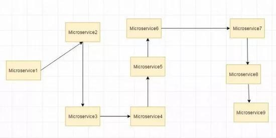
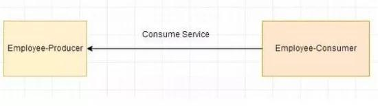

# The interview questions - Spring

## Spring 概述（10）

### 什么是 spring

Spring 是 **一个轻量级 Java 开发框架**，最早有 **Rod Johnson** 创建，目的是为了解决企业级应用开发的业务逻辑层和其他各层的耦合问题。它是一个分层的 JavaSE/JavaEE full-stack（一站式）轻量级开源框架，为开发 Java 应用程序提供全面的基础架构支持。Spring 负责基础架构，因此 Java 开发者可以专注于应用程序的开发。

Spring 最根本的使命是 **解决企业级应用开发的复杂性，即简化 Java 开发。**

Spring 可以做很多事情，它为企业级开发提供给了丰富的功能，但是这些功能的底层都依赖于它的两个核心特性，也就是 **依赖注入（dependency injection，DI）** 和 **面向切面编程（aspect-oriented programming，AOP）**。

为了降低 Java 开发的复杂性，Spring 采取了以下 4 种关键策略

1. 基于 POJO 的轻量级和最小侵入性编程；
2. 通过依赖注入和面向接口实现松耦合；
3. 基于切面和惯例进行声明式编程；
4. 通过切面和模板减少样板式代码。

### Spring 框架的设计目标，设计理念，和核心是什么

**Spring 设计目标：** Spring 为开发者提供一个一站式轻量级应用开发平台；

**Spring 设计理念：** 在 JavaEE 开发中，支持 POJO 和 JavaBean 开发方式，使应用面向接口开发，充分支持 OO（面向对象）设计方法；Spring 通过 IoC 容器实现对象耦合关系的管理，并实现依赖反转，将对象之间的依赖关系交给 IoC 容器，实现解耦；

**Spring 框架的核心：** IoC 容器和 AOP 模块。通过 IoC 容器管理 POJO 对象以及他们之间的耦合关系；通过 AOP 以动态非侵入的方式增强服务。

IoC 让相互协作的组件保持松散的耦合，而 AOP 编程允许你把遍布于应用各层的功能分离出来形成可重用的功能组件。

### Spring 的优缺点是什么

优点

1. 方便解耦，简化开发
    Spring 就是一个大工厂，可以将所有对象的创建和依赖关系的维护，交给 Spring 管理。
2. AOP 编程的支持
    Spring 提供面向切面编程，可以方便的实现对程序进行权限拦截、运行监控等功能。
3. 声明式事务的支持
    只需要通过配置就可以完成对事务的管理，而无需手动编程。
4. 方便程序的测试
    Spring 对 Junit4 支持，可以通过注解方便的测试 Spring 程序。
5. 方便集成各种优秀框架
    Spring 不排斥各种优秀的开源框架，其内部提供了对各种优秀框架的直接支持（如：Struts、Hibernate、MyBatis 等）。
6. 降低 JavaEE API 的使用难度
    Spring 对 JavaEE 开发中非常难用的一些 API（JDBC、JavaMail、远程调用等），都提供了封装，使这些 API 应用难度大大降低。

缺点

1. Spring 明明一个很轻量级的框架，却给人感觉大而全
2. Spring 依赖反射，反射影响性能
3. 使用门槛升高，入门 Spring 需要较长时间

### Spring 有哪些应用场景

**应用场景：** JavaEE 企业应用开发，包括 SSH、SSM 等

**Spring 价值：**

1. Spring 是非侵入式的框架，目标是使应用程序代码对框架依赖最小化；
2. Spring 提供一个一致的编程模型，使应用直接使用 POJO 开发，与运行环境隔离开来；
3. Spring 推动应用设计风格向面向对象和面向接口开发转变，提高了代码的重用性和可测试性；

### Spring 由哪些模块组成

Spring 总共大约有 20 个模块， 由 1300 多个不同的文件构成。 而这些组件被分别整合在核心容器`（Core Container）` 、`AOP（Aspect Oriented Programming）`和`设备支持（Instrmentation）` 、`数据访问与集成（Data Access/Integeration）` 、 `Web`、 `消息（Messaging）` 、 `Test` 等 6 个模块中。 以下是 Spring 5 的模块结构图：


1. spring core：提供了框架的基本组成部分，包括控制反转（Inversion of Control，IOC）和依赖注入（Dependency Injection，DI）功能。
2. spring beans：提供了 BeanFactory，是工厂模式的一个经典实现，Spring 将管理对象称为 Bean。
3. spring context：构建于 core 封装包基础上的 context 封装包，提供了一种框架式的对象访问方法。
4. spring jdbc：提供了一个 JDBC 的抽象层，消除了烦琐的 JDBC 编码和数据库厂商特有的错误代码解析， 用于简化 JDBC。
5. spring aop：提供了面向切面的编程实现，让你可以自定义拦截器、切点等。
6. spring Web：提供了针对 Web 开发的集成特性，例如文件上传，利用 servlet listeners 进行 ioc 容器初始化和针对 Web 的 ApplicationContext。
7. spring test：主要为测试提供支持的，支持使用 JUnit 或 TestNG 对 Spring 组件进行单元测试和集成测试。

### Spring 框架中都用到了哪些设计模式

1. 工厂模式：BeanFactory 就是简单工厂模式的体现，用来创建对象的实例；
2. 单例模式：Bean 默认为单例模式。
3. 代理模式：Spring 的 AOP 功能用到了 JDK 的动态代理和 CGLIB 字节码生成技术；
4. 模板方法：用来解决代码重复的问题。比如. RestTemplate, JmsTemplate, JpaTemplate。
5. 观察者模式：定义对象键一种一对多的依赖关系，当一个对象的状态发生改变时，所有依赖于它的对象都会得到通知被制动更新，如 Spring 中 listener 的实现–ApplicationListener。

### 详细讲解一下核心容器（spring context 应用上下文) 模块

这是基本的 Spring 模块，提供 spring 框架的基础功能，BeanFactory 是 任何以 spring 为基础的应用的核心。Spring 框架建立在此模块之上，它使 Spring 成为一个容器。

Bean 工厂是工厂模式的一个实现，提供了控制反转功能，用来把应用的配置和依赖从真正的应用代码中分离。最常用的就是 org.springframework.beans.factory.xml.XmlBeanFactory ，它根据 XML 文件中的定义加载 beans。该容器从 XML 文件读取配置元数据并用它去创建一个完全配置的系统或应用。

### Spring 框架中有哪些不同类型的事件

Spring 提供了以下 5 种标准的事件：

1. 上下文更新事件（ContextRefreshedEvent）：在调用 ConfigurableApplicationContext 接口中的 refresh () 方法时被触发。
2. 上下文开始事件（ContextStartedEvent）：当容器调用 ConfigurableApplicationContext 的 Start () 方法开始 / 重新开始容器时触发该事件。
3. 上下文停止事件（ContextStoppedEvent）：当容器调用 ConfigurableApplicationContext 的 Stop () 方法停止容器时触发该事件。
4. 上下文关闭事件（ContextClosedEvent）：当 ApplicationContext 被关闭时触发该事件。容器被关闭时，其管理的所有单例 Bean 都被销毁。
5. 请求处理事件（RequestHandledEvent）：在 Web 应用中，当一个 http 请求（request）结束触发该事件。如果一个 bean 实现了 ApplicationListener 接口，当一个 ApplicationEvent 被发布以后，bean 会自动被通知。

### Spring 应用程序有哪些不同组件

Spring 应用一般有以下组件：

1. 接口 - 定义功能。
2. Bean 类 - 它包含属性，setter 和 getter 方法，函数等。
3. Bean 配置文件 - 包含类的信息以及如何配置它们。
4. Spring 面向切面编程（AOP） - 提供面向切面编程的功能。
5. 用户程序 - 它使用接口。

### 使用 Spring 有哪些方式

使用 Spring 有以下方式：

1. 作为一个成熟的 Spring Web 应用程序。
2. 作为第三方 Web 框架，使用 Spring Frameworks 中间层。
3. 作为企业级 Java Bean，它可以包装现有的 POJO（Plain Old Java Objects）。
4. 用于远程使用。

## Spring 控制反转 (IOC)（13）

### 什么是 Spring IOC 容器

控制反转即 IoC (Inversion of Control)，它把传统上由程序代码直接操控的对象的调用权交给容器，通过容器来实现对象组件的装配和管理。所谓的 “控制反转” 概念就是对组件对象控制权的转移，从程序代码本身转移到了外部容器。

Spring IOC 负责创建对象，管理对象（通过依赖注入（DI），装配对象，配置对象，并且管理这些对象的整个生命周期。

### 控制反转 (IoC) 有什么作用

1. 管理对象的创建和依赖关系的维护。对象的创建并不是一件简单的事，在对象关系比较复杂时，如果依赖关系需要程序猿来维护的话，那是相当头疼的
2. 解耦，由容器去维护具体的对象
3. 托管了类的产生过程，比如我们需要在类的产生过程中做一些处理，最直接的例子就是代理，如果有容器程序可以把这部分处理交给容器，应用程序则无需去关心类是如何完成代理的

### IOC 的优点是什么

1. IOC 或 依赖注入把应用的代码量降到最低。
2. 它使应用容易测试，单元测试不再需要单例和 JNDI 查找机制。
3. 最小的代价和最小的侵入性使松散耦合得以实现。
4. IOC 容器支持加载服务时的饿汉式初始化和懒加载。

### Spring IoC 的实现机制

Spring 中的 IoC 的实现原理就是工厂模式加反射机制。

示例：

```java
interface Fruit {
   public abstract void eat();
 }

class Apple implements Fruit {
    public void eat(){
        System.out.println("Apple");
    }
}

class Orange implements Fruit {
    public void eat(){
        System.out.println("Orange");
    }
}

class Factory {
    public static Fruit getInstance(String ClassName) {
        Fruit f=null;
        try {
            f=(Fruit)Class.forName(ClassName).newInstance();
        } catch (Exception e) {
            e.printStackTrace();
        }
        return f;
    }
}

class Client {
    public static void main(String[] a) {
        Fruit f=Factory.getInstance("io.github.dunwu.spring.Apple");
        if(f!=null){
            f.eat();
        }
    }
}
```

### Spring 的 IoC 支持哪些功能

Spring 的 IoC 设计支持以下功能：

1. 依赖注入
2. 依赖检查
3. 自动装配
4. 支持集合
5. 指定初始化方法和销毁方法
6. 支持回调某些方法（但是需要实现 Spring 接口，略有侵入）

其中，最重要的就是依赖注入，从 XML 的配置上说，即 ref 标签。对应 Spring RuntimeBeanReference 对象。

对于 IoC 来说，最重要的就是容器。容器管理着 Bean 的生命周期，控制着 Bean 的依赖注入。

### BeanFactory 和 ApplicationContext 有什么区别

BeanFactory 和 ApplicationContext 是 Spring 的两大核心接口，都可以当做 Spring 的容器。其中 ApplicationContext 是 BeanFactory 的子接口。

**依赖关系:**

BeanFactory：是 Spring 里面最底层的接口，包含了各种 Bean 的定义，读取 bean 配置文档，管理 bean 的加载、实例化，控制 bean 的生命周期，维护 bean 之间的依赖关系。

ApplicationContext 接口作为 BeanFactory 的派生，除了提供 BeanFactory 所具有的功能外，还提供了更完整的框架功能：

1. 继承 MessageSource，因此支持国际化。
2. 统一的资源文件访问方式。
3. 提供在监听器中注册 bean 的事件。
4. 同时加载多个配置文件。
5. 载入多个（有继承关系）上下文 ，使得每一个上下文都专注于一个特定的层次，比如应用的 web 层。

**加载方式:**

BeanFactroy 采用的是延迟加载形式来注入 Bean 的，即只有在使用到某个 Bean 时 (调用 getBean ())，才对该 Bean 进行加载实例化。这样，我们就不能发现一些存在的 Spring 的配置问题。如果 Bean 的某一个属性没有注入，BeanFacotry 加载后，直至第一次使用调用 getBean 方法才会抛出异常。

ApplicationContext，它是在容器启动时，一次性创建了所有的 Bean。这样，在容器启动时，我们就可以发现 Spring 中存在的配置错误，这样有利于检查所依赖属性是否注入。 ApplicationContext 启动后预载入所有的单实例 Bean，通过预载入单实例 bean , 确保当你需要的时候，你就不用等待，因为它们已经创建好了。

相对于基本的 BeanFactory，ApplicationContext 唯一的不足是占用内存空间。当应用程序配置 Bean 较多时，程序启动较慢。

**创建方式:**

BeanFactory 通常以编程的方式被创建，ApplicationContext 还能以声明的方式创建，如使用 ContextLoader。

**注册方式:**

BeanFactory 和 ApplicationContext 都支持 BeanPostProcessor、BeanFactoryPostProcessor 的使用，但两者之间的区别是：BeanFactory 需要手动注册，而 ApplicationContext 则是自动注册。

### Spring 如何设计容器的，BeanFactory 和 ApplicationContext 的关系详解

Spring 作者 Rod Johnson 设计了两个接口用以表示容器。

1. BeanFactory
2. ApplicationContext

BeanFactory 简单粗暴，可以理解为就是个 HashMap，Key 是 BeanName，Value 是 Bean 实例。通常只提供注册（put），获取（get）这两个功能。我们可以称之为 “**低级容器**”。

ApplicationContext 可以称之为 “**高级容器**”。因为他比 BeanFactory 多了更多的功能。他继承了多个接口。因此具备了更多的功能。例如资源的获取，支持多种消息（例如 JSP tag 的支持），对 BeanFactory 多了工具级别的支持等待。所以你看他的名字，已经不是 BeanFactory 之类的工厂了，而是 “应用上下文”， 代表着整个大容器的所有功能。该接口定义了一个 refresh 方法，此方法是所有阅读 Spring 源码的人的最熟悉的方法，用于刷新整个容器，即重新加载 / 刷新所有的 bean。

当然，除了这两个大接口，还有其他的辅助接口，这里就不介绍他们了。

BeanFactory 和 ApplicationContext 的关系

为了更直观的展示 “低级容器” 和 “高级容器” 的关系，这里通过常用的 ClassPathXmlApplicationContext 类来展示整个容器的层级 UML 关系。


有点复杂？ 先不要慌，我来解释一下。

最上面的是 BeanFactory，下面的 3 个绿色的，都是功能扩展接口，这里就不展开讲。

看下面的隶属 ApplicationContext 粉红色的 “高级容器”，依赖着 “低级容器”，这里说的是依赖，不是继承哦。他依赖着 “低级容器” 的 getBean 功能。而高级容器有更多的功能：支持不同的信息源头，可以访问文件资源，支持应用事件（Observer 模式）。

通常用户看到的就是 “高级容器”。 但 BeanFactory 也非常够用啦！

左边灰色区域的是 “低级容器”， 只负载加载 Bean，获取 Bean。容器其他的高级功能是没有的。例如上图画的 refresh 刷新 Bean 工厂所有配置，生命周期事件回调等。

**小结:**

说了这么多，不知道你有没有理解 Spring IoC？ 这里小结一下：IoC 在 Spring 里，只需要低级容器就可以实现，2 个步骤：

1. 加载配置文件，解析成 BeanDefinition 放在 Map 里。
2. 调用 getBean 的时候，从 BeanDefinition 所属的 Map 里，拿出 Class 对象进行实例化，同时，如果有依赖关系，将递归调用 getBean 方法 —— 完成依赖注入。

上面就是 Spring 低级容器（BeanFactory）的 IoC。

至于高级容器 ApplicationContext，他包含了低级容器的功能，当他执行 refresh 模板方法的时候，将刷新整个容器的 Bean。同时其作为高级容器，包含了太多的功能。一句话，他不仅仅是 IoC。他支持不同信息源头，支持 BeanFactory 工具类，支持层级容器，支持访问文件资源，支持事件发布通知，支持接口回调等等。

### ApplicationContext 通常的实现是什么

1. FileSystemXmlApplicationContext ：此容器从一个 XML 文件中加载 beans 的定义，XML Bean 配置文件的全路径名必须提供给它的构造函数。
2. ClassPathXmlApplicationContext：此容器也从一个 XML 文件中加载 beans 的定义，这里，你需要正确设置 classpath 因为这个容器将在 classpath 里找 bean 配置。
3. WebXmlApplicationContext：此容器加载一个 XML 文件，此文件定义了一个 WEB 应用的所有 bean。

### 什么是 Spring 的依赖注入

控制反转 IoC 是一个很大的概念，可以用不同的方式来实现。其主要实现方式有两种：依赖注入和依赖查找

依赖注入：相对于 IoC 而言，依赖注入 (DI) 更加准确地描述了 IoC 的设计理念。所谓依赖注入（Dependency Injection），即组件之间的依赖关系由容器在应用系统运行期来决定，也就是由容器动态地将某种依赖关系的目标对象实例注入到应用系统中的各个关联的组件之中。组件不做定位查询，只提供普通的 Java 方法让容器去决定依赖关系。

### 依赖注入的基本原则

依赖注入的基本原则是：应用组件不应该负责查找资源或者其他依赖的协作对象。配置对象的工作应该由 IoC 容器负责，“查找资源” 的逻辑应该从应用组件的代码中抽取出来，交给 IoC 容器负责。容器全权负责组件的装配，它会把符合依赖关系的对象通过属性（JavaBean 中的 setter）或者是构造器传递给需要的对象。

### 依赖注入有什么优势

依赖注入之所以更流行是因为它是一种更可取的方式：让容器全权负责依赖查询，受管组件只需要暴露 JavaBean 的 setter 方法或者带参数的构造器或者接口，使容器可以在初始化时组装对象的依赖关系。其与依赖查找方式相比，主要优势为：

1. 查找定位操作与应用代码完全无关。
2. 不依赖于容器的 API，可以很容易地在任何容器以外使用应用对象。
3. 不需要特殊的接口，绝大多数对象可以做到完全不必依赖容器。

### 有哪些不同类型的依赖注入实现方式

依赖注入是时下最流行的 IoC 实现方式，依赖注入分为接口注入（Interface Injection），Setter 方法注入（Setter Injection）和构造器注入（Constructor Injection）三种方式。其中接口注入由于在灵活性和易用性比较差，现在从 Spring4 开始已被废弃。

**构造器依赖注入：** 构造器依赖注入通过容器触发一个类的构造器来实现的，该类有一系列参数，每个参数代表一个对其他类的依赖。

**Setter 方法注入：** Setter 方法注入是容器通过调用无参构造器或无参 static 工厂 方法实例化 bean 之后，调用该 bean 的 setter 方法，即实现了基于 setter 的依赖注入。

**构造器依赖注入和 Setter 方法注入的区别:**

| 构造函数注入 | setter 注入 |
|:-:|:-:|
| 没有部分注入 | 有部分注入 |
| 不会覆盖 setter 属性 | 会覆盖 setter 属性 |
| 任意修改都会创建一个新实例 | 任意修改不会创建一个新实例 |
| 适用于设置很多属性 | 适用于设置少量属性 |

两种依赖方式都可以使用，构造器注入和 Setter 方法注入。最好的解决方案是用构造器参数实现强制依赖，setter 方法实现可选依赖。

## Spring Beans（19）

### 什么是 Spring beans

Spring beans 是那些形成 Spring 应用的主干的 java 对象。它们被 Spring IOC 容器初始化，装配，和管理。这些 beans 通过容器中配置的元数据创建。比如，以 XML 文件中 的形式定义。

### 一个 Spring Bean 定义 包含什么

一个 Spring Bean 的定义包含容器必知的所有配置元数据，包括如何创建一个 bean，它的生命周期详情及它的依赖。

### 如何给 Spring 容器提供配置元数据？Spring 有几种配置方式

这里有三种重要的方法给 Spring 容器提供配置元数据。

1. XML 配置文件。
2. 基于注解的配置。
3. 基于 java 的配置。

### Spring 配置文件包含了哪些信息

Spring 配置文件是个 XML 文件，这个文件包含了类信息，描述了如何配置它们，以及如何相互调用。

### Spring 基于 xml 注入 bean 的几种方式

1. Set 方法注入；
2. 构造器注入：
   1. 通过 index 设置参数的位置；
   2. 通过 type 设置参数类型；
3. 静态工厂注入；
4. 实例工厂；

### 你怎样定义类的作用域

当定义一个 在 Spring 里，我们还能给这个 bean 声明一个作用域。它可以通过 bean 定义中的 scope 属性来定义。如，当 Spring 要在需要的时候每次生产一个新的 bean 实例，bean 的 scope 属性被指定为 prototype。另一方面，一个 bean 每次使用的时候必须返回同一个实例，这个 bean 的 scope 属性 必须设为 singleton。

### 解释 Spring 支持的几种 bean 的作用域

Spring 框架支持以下五种 bean 的作用域：

1. singleton : bean 在每个 Spring ioc 容器中只有一个实例。
2. prototype：一个 bean 的定义可以有多个实例。
3. request：每次 http 请求都会创建一个 bean，该作用域仅在基于 web 的 Spring ApplicationContext 情形下有效。
4. session：在一个 HTTP Session 中，一个 bean 定义对应一个实例。该作用域仅在基于 web 的 Spring ApplicationContext 情形下有效。
5. global-session：在一个全局的 HTTP Session 中，一个 bean 定义对应一个实例。该作用域仅在基于 web 的 Spring ApplicationContext 情形下有效。

**注意：** 缺省的 Spring bean 的作用域是 Singleton。使用 prototype 作用域需要慎重的思考，因为频繁创建和销毁 bean 会带来很大的性能开销。

### Spring 框架中的单例 bean 是线程安全的吗

不是，Spring 框架中的单例 bean 不是线程安全的。

spring 中的 bean 默认是单例模式，spring 框架并没有对单例 bean 进行多线程的封装处理。

实际上大部分时候 spring bean 无状态的（比如 dao 类），所有某种程度上来说 bean 也是安全的，但如果 bean 有状态的话（比如 view model 对象），那就要开发者自己去保证线程安全了，最简单的就是改变 bean 的作用域，把 “singleton” 变更为 “prototype”，这样请求 bean 相当于 new Bean () 了，所以就可以保证线程安全了。

- 有状态就是有数据存储功能。
- 无状态就是不会保存数据。

### Spring 如何处理线程并发问题

在一般情况下，只有无状态的 Bean 才可以在多线程环境下共享，在 Spring 中，绝大部分 Bean 都可以声明为 singleton 作用域，因为 Spring 对一些 Bean 中非线程安全状态采用 ThreadLocal 进行处理，解决线程安全问题。

ThreadLocal 和线程同步机制都是为了解决多线程中相同变量的访问冲突问题。同步机制采用了 “时间换空间” 的方式，仅提供一份变量，不同的线程在访问前需要获取锁，没获得锁的线程则需要排队。而 ThreadLocal 采用了 “空间换时间” 的方式。

ThreadLocal 会为每一个线程提供一个独立的变量副本，从而隔离了多个线程对数据的访问冲突。因为每一个线程都拥有自己的变量副本，从而也就没有必要对该变量进行同步了。ThreadLocal 提供了线程安全的共享对象，在编写多线程代码时，可以把不安全的变量封装进 ThreadLocal。

### 解释 Spring 框架中 bean 的生命周期

在传统的 Java 应用中，bean 的生命周期很简单。使用 Java 关键字 new 进行 bean 实例化，然后该 bean 就可以使用了。一旦该 bean 不再被使用，则由 Java 自动进行垃圾回收。相比之下，Spring 容器中的 bean 的生命周期就显得相对复杂多了。正确理解 Spring bean 的生命周期非常重要，因为你或许要利用 Spring 提供的扩展点来自定义 bean 的创建过程。下图展示了 bean 装载到 Spring 应用上下文中的一个典型的生命周期过程。


bean 在 Spring 容器中从创建到销毁经历了若干阶段，每一阶段都可以针对 Spring 如何管理 bean 进行个性化定制。

正如你所见，在 bean 准备就绪之前，bean 工厂执行了若干启动步骤。

我们对上图进行详细描述：

1. Spring 对 bean 进行实例化；
2. Spring 将值和 bean 的引用注入到 bean 对应的属性中；
3. 如果 bean 实现了 BeanNameAware 接口，Spring 将 bean 的 ID 传递给 setBean-Name () 方法；
4. 如果 bean 实现了 BeanFactoryAware 接口，Spring 将调用 setBeanFactory () 方法，将 BeanFactory 容器实例传入；
5. 如果 bean 实现了 ApplicationContextAware 接口，Spring 将调用 setApplicationContext () 方法，将 bean 所在的应用上下文的引用传入进来；
6. 如果 bean 实现了 BeanPostProcessor 接口，Spring 将调用它们的 post-ProcessBeforeInitialization () 方法；
7. 如果 bean 实现了 InitializingBean 接口，Spring 将调用它们的 after-PropertiesSet () 方法。类似地，如果 bean 使用 initmethod 声明了初始化方法，该方法也会被调用；
8. 如果 bean 实现了 BeanPostProcessor 接口，Spring 将调用它们的 post-ProcessAfterInitialization () 方法；
9. 此时，bean 已经准备就绪，可以被应用程序使用了，它们将一直驻留在应用上下文中，直到该应用上下文被销毁；
10. 如果 bean 实现了 DisposableBean 接口，Spring 将调用它的 destroy () 接口方法。同样，如果 bean 使用 destroy-method 声明了销毁方法，该方法也会被调用。

现在你已经了解了如何创建和加载一个 Spring 容器。但是一个空的容器并没有太大的价值，在你把东西放进去之前，它里面什么都没有。为了从 Spring 的 DI (依赖注入) 中受益，我们必须将应用对象装配进 Spring 容器中。

### 哪些是重要的 bean 生命周期方法？ 你能重载它们吗

有两个重要的 bean 生命周期方法，第一个是 setup ， 它是在容器加载 bean 的时候被调用。第二个方法是 teardown 它是在容器卸载类的时候被调用。

bean 标签有两个重要的属性（init-method 和 destroy-method）。用它们你可以自己定制初始化和注销方法。它们也有相应的注解（@PostConstruct 和 @PreDestroy）。

### 什么是 Spring 的内部 bean？什么是 Spring inner beans

在 Spring 框架中，当一个 bean 仅被用作另一个 bean 的属性时，它能被声明为一个内部 bean。内部 bean 可以用 setter 注入 “属性” 和构造方法注入 “构造参数” 的方式来实现，内部 bean 通常是匿名的，它们的 Scope 一般是 prototype。

### 在 Spring 中如何注入一个 java 集合

Spring 提供以下几种集合的配置元素：

1. 类型用于注入一列值，允许有相同的值。
2. 类型用于注入一组值，不允许有相同的值。
3. 类型用于注入一组键值对，键和值都可以为任意类型。
4. 类型用于注入一组键值对，键和值都只能为 String 类型。

### 什么是 bean 装配

装配，或 bean 装配是指在 Spring 容器中把 bean 组装到一起，前提是容器需要知道 bean 的依赖关系，如何通过依赖注入来把它们装配到一起。

### 什么是 bean 的自动装配

在 Spring 框架中，在配置文件中设定 bean 的依赖关系是一个很好的机制，Spring 容器能够自动装配相互合作的 bean，这意味着容器不需要和配置，能通过 Bean 工厂自动处理 bean 之间的协作。这意味着 Spring 可以通过向 Bean Factory 中注入的方式自动搞定 bean 之间的依赖关系。自动装配可以设置在每个 bean 上，也可以设定在特定的 bean 上。

### 解释不同方式的自动装配，spring 自动装配 bean 有哪些方式

在 spring 中，对象无需自己查找或创建与其关联的其他对象，由容器负责把需要相互协作的对象引用赋予各个对象，使用 autowire 来配置自动装载模式。

在 Spring 框架 xml 配置中共有 5 种自动装配：

1. no：默认的方式是不进行自动装配的，通过手工设置 ref 属性来进行装配 bean。
2. byName：通过 bean 的名称进行自动装配，如果一个 bean 的 property 与另一 bean 的 name 相同，就进行自动装配。
3. byType：通过参数的数据类型进行自动装配。
4. constructor：利用构造函数进行装配，并且构造函数的参数通过 byType 进行装配。
5. autodetect：自动探测，如果有构造方法，通过 construct 的方式自动装配，否则使用 byType 的方式自动装配。

### 使用 @Autowired 注解自动装配的过程是怎样的

使用 @Autowired 注解来自动装配指定的 bean。在使用 @Autowired 注解之前需要在 Spring 配置文件进行配置，<context:annotation-config />。

在启动 spring IoC 时，容器自动装载了一个 AutowiredAnnotationBeanPostProcessor 后置处理器，当容器扫描到 @Autowied、@Resource 或 @Inject 时，就会在 IoC 容器自动查找需要的 bean，并装配给该对象的属性。在使用 @Autowired 时，首先在容器中查询对应类型的 bean：

1. 如果查询结果刚好为一个，就将该 bean 装配给 @Autowired 指定的数据；
2. 如果查询的结果不止一个，那么 @Autowired 会根据名称来查找；
3. 如果上述查找的结果为空，那么会抛出异常。解决方法时，使用 required=false。

### 自动装配有哪些局限性

自动装配的局限性是：

**重写：** 你仍需用 和 配置来定义依赖，意味着总要重写自动装配。

**基本数据类型：** 你不能自动装配简单的属性，如基本数据类型，String 字符串，和类。

**模糊特性：** 自动装配不如显式装配精确，如果有可能，建议使用显式装配。

### 你可以在 Spring 中注入一个 null 和一个空字符串吗

可以。

## Spring 注解（8）

### 什么是基于 Java 的 Spring 注解配置？给一些注解的例子

基于 Java 的配置，允许你在少量的 Java 注解的帮助下，进行你的大部分 Spring 配置而非通过 XML 文件。

以 @Configuration 注解为例，它用来标记类可以当做一个 bean 的定义，被 Spring IOC 容器使用。

另一个例子是 @Bean 注解，它表示此方法将要返回一个对象，作为一个 bean 注册进 Spring 应用上下文。

```java
@Configuration
public class StudentConfig {
    @Bean
    public StudentBean myStudent() {
        return new StudentBean();
    }
}
```

### 怎样开启注解装配

注解装配在默认情况下是不开启的，为了使用注解装配，我们必须在 Spring 配置文件中配置 <context:annotation-config/> 元素。

### @Component, @Controller, @Repository, @Service 有何区别

- @Component：这将 java 类标记为 bean。它是任何 Spring 管理组件的通用构造型。spring 的组件扫描机制现在可以将其拾取并将其拉入应用程序环境中。
- @Controller：这将一个类标记为 Spring Web MVC 控制器。标有它的 Bean 会自动导入到 IoC 容器中。
- @Service：此注解是组件注解的特化。它不会对 @Component 注解提供任何其他行为。您可以在服务层类中使用 @Service 而不是 @Component，因为它以更好的方式指定了意图。
- @Repository：这个注解是具有类似用途和功能的 @Component 注解的特化。它为 DAO 提供了额外的好处。它将 DAO 导入 IoC 容器，并使未经检查的异常有资格转换为 Spring DataAccessException。

### @Required 注解有什么作用

这个注解表明 bean 的属性必须在配置的时候设置，通过一个 bean 定义的显式的属性值或通过自动装配，若 @Required 注解的 bean 属性未被设置，容器将抛出 BeanInitializationException。示例：

```java
public class Employee {
    private String name;
    @Required
    public void setName(String name){
        this.name=name;
    }
    public string getName(){
        return name;
    }
}
```

### @Autowired 注解有什么作用

@Autowired 默认是按照类型装配注入的，默认情况下它要求依赖对象必须存在（可以设置它 required 属性为 false）。@Autowired 注解提供了更细粒度的控制，包括在何处以及如何完成自动装配。它的用法和 @Required 一样，修饰 setter 方法、构造器、属性或者具有任意名称和 / 或多个参数的 PN 方法。

```java
public class Employee {
    private String name;
    @Autowired
    public void setName(String name) {
        this.name=name;
    }
    public string getName(){
        return name;
    }
}
```

### @Autowired 和 @Resource 之间的区别

@Autowired 可用于：构造函数、成员变量、Setter 方法

@Autowired 和 @Resource 之间的区别

1. @Autowired 默认是按照类型装配注入的，默认情况下它要求依赖对象必须存在（可以设置它 required 属性为 false）。
2. @Resource 默认是按照名称来装配注入的，只有当找不到与名称匹配的 bean 才会按照类型来装配注入。

### @Qualifier 注解有什么作用

当您创建多个相同类型的 bean 并希望仅使用属性装配其中一个 bean 时，您可以使用 @Qualifier 注解和 @Autowired 通过指定应该装配哪个确切的 bean 来消除歧义。

### @RequestMapping 注解有什么用

@RequestMapping 注解用于将特定 HTTP 请求方法映射到将处理相应请求的控制器中的特定类 / 方法。此注释可应用于两个级别：

1. 类级别：映射请求的 URL
2. 方法级别：映射 URL 以及 HTTP 请求方法

## Spring 数据访问（14）

### 解释对象 / 关系映射集成模块

Spring 通过提供 ORM 模块，支持我们在直接 JDBC 之上使用一个对象 / 关系映射映射 (ORM) 工具，Spring 支持集成主流的 ORM 框架，如 Hiberate，JDO 和 iBATIS，JPA，TopLink，JDO，OJB 。Spring 的事务管理同样支持以上所有 ORM 框架及 JDBC。

### 在 Spring 框架中如何更有效地使用 JDBC

使用 Spring JDBC 框架，资源管理和错误处理的代价都会被减轻。所以开发者只需写 statements 和 queries 从数据存取数据，JDBC 也可以在 Spring 框架提供的模板类的帮助下更有效地被使用，这个模板叫 JdbcTemplate

### 解释 JDBC 抽象和 DAO 模块

通过使用 JDBC 抽象和 DAO 模块，保证数据库代码的简洁，并能避免数据库资源错误关闭导致的问题，它在各种不同的数据库的错误信息之上，提供了一个统一的异常访问层。它还利用 Spring 的 AOP 模块给 Spring 应用中的对象提供事务管理服务。

### spring DAO 有什么用

Spring DAO（数据访问对象） 使得 JDBC，Hibernate 或 JDO 这样的数据访问技术更容易以一种统一的方式工作。这使得用户容易在持久性技术之间切换。它还允许您在编写代码时，无需考虑捕获每种技术不同的异常。

### spring JDBC API 中存在哪些类

1. JdbcTemplate
2. SimpleJdbcTemplate
3. NamedParameterJdbcTemplate
4. SimpleJdbcInsert
5. SimpleJdbcCall

### JdbcTemplate 是什么

JdbcTemplate 类提供了很多便利的方法解决诸如把数据库数据转变成基本数据类型或对象，执行写好的或可调用的数据库操作语句，提供自定义的数据错误处理。

### 使用 Spring 通过什么方式访问 Hibernate？使用 Spring 访问 Hibernate 的方法有哪些

在 Spring 中有两种方式访问 Hibernate：

1. 使用 Hibernate 模板和回调进行控制反转
2. 扩展 HibernateDAOSupport 并应用 AOP 拦截器节点

### 如何通过 HibernateDaoSupport 将 Spring 和 Hibernate 结合起来

用 Spring 的 SessionFactory 调用 LocalSessionFactory。集成过程分三步：

1. 配置 the Hibernate SessionFactory
2. 继承 HibernateDaoSupport 实现一个 DAO
3. 在 AOP 支持的事务中装配

### Spring 支持的事务管理类型， spring 事务实现方式有哪些

Spring 支持两种类型的事务管理：

1. **编程式事务管理：** 这意味你通过编程的方式管理事务，给你带来极大的灵活性，但是难维护。
2. **声明式事务管理：** 这意味着你可以将业务代码和事务管理分离，你只需用注解和 XML 配置来管理事务。

Spring 事务的实现方式和实现原理
Spring 事务的本质其实就是数据库对事务的支持，没有数据库的事务支持，spring 是无法提供事务功能的。真正的数据库层的事务提交和回滚是通过 binlog 或者 redo log 实现的。

### 说一下 Spring 的事务传播行为

spring 事务的传播行为说的是，当多个事务同时存在的时候，spring 如何处理这些事务的行为。

1. PROPAGATION_REQUIRED：如果当前没有事务，就创建一个新事务，如果当前存在事务，就加入该事务，该设置是最常用的设置。
2. PROPAGATION_SUPPORTS：支持当前事务，如果当前存在事务，就加入该事务，如果当前不存在事务，就以非事务执行。
3. PROPAGATION_MANDATORY：支持当前事务，如果当前存在事务，就加入该事务，如果当前不存在事务，就抛出异常。
4. PROPAGATION_REQUIRES_NEW：创建新事务，无论当前存不存在事务，都创建新事务。
5. PROPAGATION_NOT_SUPPORTED：以非事务方式执行操作，如果当前存在事务，就把当前事务挂起。
6. PROPAGATION_NEVER：以非事务方式执行，如果当前存在事务，则抛出异常。
7. PROPAGATION_NESTED：如果当前存在事务，则在嵌套事务内执行。如果当前没有事务，则按 REQUIRED 属性执行。

### 说一下 spring 的事务隔离

spring 有五大隔离级别，默认值为 ISOLATION_DEFAULT（使用数据库的设置），其他四个隔离级别和数据库的隔离级别一致：

1. ISOLATION_DEFAULT：用底层数据库的设置隔离级别，数据库设置的是什么我就用什么；
2. ISOLATION_READ_UNCOMMITTED：未提交读，最低隔离级别、事务未提交前，就可被其他事务读取（会出现幻读、脏读、不可重复读）；
3. ISOLATION_READ_COMMITTED：提交读，一个事务提交后才能被其他事务读取到（会造成幻读、不可重复读），SQL server 的默认级别；
4. ISOLATION_REPEATABLE_READ：可重复读，保证多次读取同一个数据时，其值都和事务开始时候的内容是一致，禁止读取到别的事务未提交的数据（会造成幻读），MySQL 的默认级别；
5. ISOLATION_SERIALIZABLE：序列化，代价最高最可靠的隔离级别，该隔离级别能防止脏读、不可重复读、幻读。

**脏读 ：** 表示一个事务能够读取另一个事务中还未提交的数据。比如，某个事务尝试插入记录 A，此时该事务还未提交，然后另一个事务尝试读取到了记录 A。

**不可重复读 ：** 是指在一个事务内，多次读同一数据。

**幻读 ：** 指同一个事务内多次查询返回的结果集不一样。比如同一个事务 A 第一次查询时候有 n 条记录，但是第二次同等条件下查询却有 n+1 条记录，这就好像产生了幻觉。发生幻读的原因也是另外一个事务新增或者删除或者修改了第一个事务结果集里面的数据，同一个记录的数据内容被修改了，所有数据行的记录就变多或者变少了。

### Spring 框架的事务管理有哪些优点

1. 为不同的事务 API 如 JTA，JDBC，Hibernate，JPA 和 JDO，提供一个不变的编程模式。
2. 为编程式事务管理提供了一套简单的 API 而不是一些复杂的事务 API
3. 支持声明式事务管理。
4. 和 Spring 各种数据访问抽象层很好得集成。

### 你更倾向用那种事务管理类型

大多数 Spring 框架的用户选择声明式事务管理，因为它对应用代码的影响最小，因此更符合一个无侵入的轻量级容器的思想。声明式事务管理要优于编程式事务管理，虽然比编程式事务管理（这种方式允许你通过代码控制事务）少了一点灵活性。唯一不足地方是，最细粒度只能作用到方法级别，无法做到像编程式事务那样可以作用到代码块级别。

## Spring 面向切面编程 (AOP)（13）

### 什么是 AOP

OOP (Object-Oriented Programming) 面向对象编程，允许开发者定义纵向的关系，但并适用于定义横向的关系，导致了大量代码的重复，而不利于各个模块的重用。

AOP (Aspect-Oriented Programming)，一般称为面向切面编程，作为面向对象的一种补充，用于将那些与业务无关，但却对多个对象产生影响的公共行为和逻辑，抽取并封装为一个可重用的模块，这个模块被命名为 “切面”（Aspect），减少系统中的重复代码，降低了模块间的耦合度，同时提高了系统的可维护性。可用于权限认证、日志、事务处理等。

### Spring AOP and AspectJ AOP 有什么区别？AOP 有哪些实现方式

AOP 实现的关键在于 代理模式，AOP 代理主要分为静态代理和动态代理。静态代理的代表为 AspectJ；动态代理则以 Spring AOP 为代表。

1. AspectJ 是静态代理的增强，所谓静态代理，就是 AOP 框架会在编译阶段生成 AOP 代理类，因此也称为编译时增强，他会在编译阶段将 AspectJ (切面) 织入到 Java 字节码中，运行的时候就是增强之后的 AOP 对象。
2. Spring AOP 使用的动态代理，所谓的动态代理就是说 AOP 框架不会去修改字节码，而是每次运行时在内存中临时为方法生成一个 AOP 对象，这个 AOP 对象包含了目标对象的全部方法，并且在特定的切点做了增强处理，并回调原对象的方法。

### JDK 动态代理和 CGLIB 动态代理的区别

Spring AOP 中的动态代理主要有两种方式，JDK 动态代理和 CGLIB 动态代理：

1. JDK 动态代理只提供接口的代理，不支持类的代理。核心 InvocationHandler 接口和 Proxy 类，InvocationHandler 通过 invoke () 方法反射来调用目标类中的代码，动态地将横切逻辑和业务编织在一起；接着，Proxy 利用 InvocationHandler 动态创建一个符合某一接口的的实例，生成目标类的代理对象。
2. 如果代理类没有实现 InvocationHandler 接口，那么 Spring AOP 会选择使用 CGLIB 来动态代理目标类。CGLIB（Code Generation Library），是一个代码生成的类库，可以在运行时动态的生成指定类的一个子类对象，并覆盖其中特定方法并添加增强代码，从而实现 AOP。CGLIB 是通过继承的方式做的动态代理，因此如果某个类被标记为 final，那么它是无法使用 CGLIB 做动态代理的。

静态代理与动态代理区别在于生成 AOP 代理对象的时机不同，相对来说 AspectJ 的静态代理方式具有更好的性能，但是 AspectJ 需要特定的编译器进行处理，而 Spring AOP 则无需特定的编译器处理。

InvocationHandler 的 invoke (Object proxy,Method method,Object [] args)：proxy 是最终生成的代理实例；method 是被代理目标实例的某个具体方法；args 是被代理目标实例某个方法的具体入参，在方法反射调用时使用。

### 如何理解 Spring 中的代理

将 Advice 应用于目标对象后创建的对象称为代理。在客户端对象的情况下，目标对象和代理对象是相同的。

Advice + Target Object = Proxy

### 解释一下 Spring AOP 里面的几个名词

1. 切面（Aspect）：切面是通知和切点的结合。通知和切点共同定义了切面的全部内容。 在 Spring AOP 中，切面可以使用通用类（基于模式的风格） 或者在普通类中以 @AspectJ 注解来实现。
2. 连接点（Join point）：指方法，在 Spring AOP 中，一个连接点 总是 代表一个方法的执行。 应用可能有数以千计的时机应用通知。这些时机被称为连接点。连接点是在应用执行过程中能够插入切面的一个点。这个点可以是调用方法时、抛出异常时、甚至修改一个字段时。切面代码可以利用这些点插入到应用的正常流程之中，并添加新的行为。
3. 通知（Advice）：在 AOP 术语中，切面的工作被称为通知。
4. 切入点（Pointcut）：切点的定义会匹配通知所要织入的一个或多个连接点。我们通常使用明确的类和方法名称，或是利用正则表达式定义所匹配的类和方法名称来指定这些切点。
5. 引入（Introduction）：引入允许我们向现有类添加新方法或属性。
6. 目标对象（Target Object）： 被一个或者多个切面（aspect）所通知（advise）的对象。它通常是一个代理对象。也有人把它叫做 被通知（adviced） 对象。 既然 Spring AOP 是通过运行时代理实现的，这个对象永远是一个 被代理（proxied） 对象。
7. 织入（Weaving）：织入是把切面应用到目标对象并创建新的代理对象的过程。在目标对象的生命周期里有多少个点可以进行织入：

---

1. 编译期：切面在目标类编译时被织入。AspectJ 的织入编译器是以这种方式织入切面的。
2. 类加载期：切面在目标类加载到 JVM 时被织入。需要特殊的类加载器，它可以在目标类被引入应用之前增强该目标类的字节码。AspectJ5 的加载时织入就支持以这种方式织入切面。
3. 运行期：切面在应用运行的某个时刻被织入。一般情况下，在织入切面时，AOP 容器会为目标对象动态地创建一个代理对象。SpringAOP 就是以这种方式织入切面。

### Spring 在运行时通知对象

通过在代理类中包裹切面，Spring 在运行期把切面织入到 Spring 管理的 bean 中。代理封装了目标类，并拦截被通知方法的调用，再把调用转发给真正的目标 bean。当代理拦截到方法调用时，在调用目标 bean 方法之前，会执行切面逻辑。

直到应用需要被代理的 bean 时，Spring 才创建代理对象。如果使用的是 ApplicationContext 的话，在 ApplicationContext 从 BeanFactory 中加载所有 bean 的时候，Spring 才会创建被代理的对象。因为 Spring 运行时才创建代理对象，所以我们不需要特殊的编译器来织入 SpringAOP 的切面。

### Spring 只支持方法级别的连接点

因为 Spring 基于动态代理，所以 Spring 只支持方法连接点。Spring 缺少对字段连接点的支持，而且它不支持构造器连接点。方法之外的连接点拦截功能，我们可以利用 Aspect 来补充。

### 在 Spring AOP 中，关注点和横切关注的区别是什么？在 spring aop 中 concern 和 cross-cutting concern 的不同之处

- 关注点（concern）是应用中一个模块的行为，一个关注点可能会被定义成一个我们想实现的一个功能。
- 横切关注点（cross-cutting concern）是一个关注点，此关注点是整个应用都会使用的功能，并影响整个应用，比如日志，安全和数据传输，几乎应用的每个模块都需要的功能。因此这些都属于横切关注点。

### Spring 通知有哪些类型

在 AOP 术语中，切面的工作被称为通知，实际上是程序执行时要通过 SpringAOP 框架触发的代码段。

Spring 切面可以应用 5 种类型的通知：

1. 前置通知（Before）：在目标方法被调用之前调用通知功能；
2. 后置通知（After）：在目标方法完成之后调用通知，此时不会关心方法的输出是什么；
3. 返回通知（After-returning ）：在目标方法成功执行之后调用通知；
4. 异常通知（After-throwing）：在目标方法抛出异常后调用通知；
5. 环绕通知（Around）：通知包裹了被通知的方法，在被通知的方法调用之前和调用之后执行自定义的行为。

同一个 aspect，不同 advice 的执行顺序：

1. 没有异常情况下的执行顺序：
    1. around before advice
    2. before advice
    3. target method to perform
    4. around after advice
    5. after advice
    6. afterReturning

2. 有异常情况下的执行顺序：
    1. around before advice
    2. before advice
    3. target method to perform
    4. around after advice
    5. after advice
    6. afterThrowing: Exception occurs
    7. java.lang.RuntimeException: Exception occurs

### 什么是切面 Aspect

aspect 由 pointcount 和 advice 组成，切面是通知和切点的结合。 它既包含了横切逻辑的定义，也包括了连接点的定义. Spring AOP 就是负责实施切面的框架，它将切面所定义的横切逻辑编织到切面所指定的连接点中.
AOP 的工作重心在于如何将增强编织目标对象的连接点上，这里包含两个工作:

1. 如何通过 pointcut 和 advice 定位到特定的 joinpoint 上
2. 如何在 advice 中编写切面代码.

可以简单地认为，使用 @Aspect 注解的类就是切面.


### 解释基于 XML Schema 方式的切面实现

在这种情况下，切面由常规类以及基于 XML 的配置实现。

### 解释基于注解的切面实现

在这种情况下 (基于 @AspectJ 的实现)，涉及到的切面声明的风格与带有 java5 标注的普通 java 类一致。

### 有几种不同类型的自动代理

1. BeanNameAutoProxyCreator
2. DefaultAdvisorAutoProxyCreator
3. Metadata autoproxying

## Spring MVC 概述

### 什么是 Spring MVC？简单介绍下你对 Spring MVC 的理解

Spring MVC 是一个基于 Java 的实现了 MVC 设计模式的请求驱动类型的轻量级 Web 框架，通过把模型 - 视图 - 控制器分离，将 web 层进行职责解耦，把复杂的 web 应用分成逻辑清晰的几部分，简化开发，减少出错，方便组内开发人员之间的配合。

Spring MVC 的优点

1. 可以支持各种视图技术，而不仅仅局限于 JSP；
2. 与 Spring 框架集成（如 IoC 容器、AOP 等）；
3. 清晰的角色分配：前端控制器 (dispatcherServlet) , 请求到处理器映射（handlerMapping), 处理器适配器（HandlerAdapter), 视图解析器（ViewResolver）。
4. 支持各种请求资源的映射策略。

## 核心组件

### Spring MVC 的主要组件

1. 前端控制器 DispatcherServlet（不需要程序员开发）
    作用：接收请求、响应结果，相当于转发器，有了 DispatcherServlet 就减少了其它组件之间的耦合度。
2. 处理器映射器 HandlerMapping（不需要程序员开发）
    作用：根据请求的 URL 来查找 Handler
3. 处理器适配器 HandlerAdapter
    注意：在编写 Handler 的时候要按照 HandlerAdapter 要求的规则去编写，这样适配器 HandlerAdapter 才可以正确的去执行 Handler。
4. 处理器 Handler（需要程序员开发）
5. 视图解析器 ViewResolver（不需要程序员开发）
    作用：进行视图的解析，根据视图逻辑名解析成真正的视图（view）
6. 视图 View（需要程序员开发 jsp）
    View 是一个接口， 它的实现类支持不同的视图类型（jsp，freemarker，pdf 等等）

### 什么是 DispatcherServlet

Spring 的 MVC 框架是围绕 DispatcherServlet 来设计的，它用来处理所有的 HTTP 请求和响应。

### 什么是 Spring MVC 框架的控制器

控制器提供一个访问应用程序的行为，此行为通常通过服务接口实现。控制器解析用户输入并将其转换为一个由视图呈现给用户的模型。Spring 用一个非常抽象的方式实现了一个控制层，允许用户创建多种用途的控制器。

### Spring MVC 的控制器是不是单例模式，如果是，有什么问题，怎么解决

答：是单例模式，所以在多线程访问的时候有线程安全问题，不要用同步，会影响性能的，解决方案是在控制器里面不能写字段。

## 工作原理

### 请描述 Spring MVC 的工作流程？描述一下 DispatcherServlet 的工作流程

1. 用户发送请求至前端控制器 DispatcherServlet；
2. DispatcherServlet 收到请求后，调用 HandlerMapping 处理器映射器，请求获取 Handle；
3. 处理器映射器根据请求 url 找到具体的处理器，生成处理器对象及处理器拦截器 (如果有则生成) 一并返回给 DispatcherServlet；
4. DispatcherServlet 调用 HandlerAdapter 处理器适配器；
5. HandlerAdapter 经过适配调用 具体处理器 (Handler，也叫后端控制器)；
6. Handler 执行完成返回 ModelAndView；
7. HandlerAdapter 将 Handler 执行结果 ModelAndView 返回给 DispatcherServlet；
8. DispatcherServlet 将 ModelAndView 传给 ViewResolver 视图解析器进行解析；
9. ViewResolver 解析后返回具体 View；
10. DispatcherServlet 对 View 进行渲染视图（即将模型数据填充至视图中）
11. DispatcherServlet 响应用户。


## MVC 框架

### MVC 是什么？MVC 设计模式的好处有哪些

mvc 是一种设计模式（设计模式就是日常开发中编写代码的一种好的方法和经验的总结）。模型（model）- 视图（view）- 控制器（controller），三层架构的设计模式。用于实现前端页面的展现与后端业务数据处理的分离。

mvc 设计模式的好处

1. 分层设计，实现了业务系统各个组件之间的解耦，有利于业务系统的可扩展性，可维护性。

2. 有利于系统的并行开发，提升开发效率。

## 常用注解

### 注解原理是什么

注解本质是一个继承了 Annotation 的特殊接口，其具体实现类是 Java 运行时生成的动态代理类。我们通过反射获取注解时，返回的是 Java 运行时生成的动态代理对象。通过代理对象调用自定义注解的方法，会最终调用 AnnotationInvocationHandler 的 invoke 方法。该方法会从 memberValues 这个 Map 中索引出对应的值。而 memberValues 的来源是 Java 常量池。

### Spring MVC 常用的注解有哪些

@RequestMapping：用于处理请求 url 映射的注解，可用于类或方法上。用于类上，则表示类中的所有响应请求的方法都是以该地址作为父路径。

@RequestBody：注解实现接收 http 请求的 json 数据，将 json 转换为 java 对象。

@ResponseBody：注解实现将 conreoller 方法返回对象转化为 json 对象响应给客户。

### SpingMvc 中的控制器的注解一般用哪个，有没有别的注解可以替代

答：一般用 @Controller 注解，也可以使用 @RestController,@RestController 注解相当于 @ResponseBody ＋ @Controller, 表示是表现层，除此之外，一般不用别的注解代替。

### @Controller 注解的作用

在 Spring MVC 中，控制器 Controller 负责处理由 DispatcherServlet 分发的请求，它把用户请求的数据经过业务处理层处理之后封装成一个 Model ，然后再把该 Model 返回给对应的 View 进行展示。在 Spring MVC 中提供了一个非常简便的定义 Controller 的方法，你无需继承特定的类或实现特定的接口，只需使用 @Controller 标记一个类是 Controller ，然后使用 @RequestMapping 和 @RequestParam 等一些注解用以定义 URL 请求和 Controller 方法之间的映射，这样的 Controller 就能被外界访问到。此外 Controller 不会直接依赖于 HttpServletRequest 和 HttpServletResponse 等 HttpServlet 对象，它们可以通过 Controller 的方法参数灵活的获取到。

@Controller 用于标记在一个类上，使用它标记的类就是一个 Spring MVC Controller 对象。分发处理器将会扫描使用了该注解的类的方法，并检测该方法是否使用了 @RequestMapping 注解。@Controller 只是定义了一个控制器类，而使用 @RequestMapping 注解的方法才是真正处理请求的处理器。单单使用 @Controller 标记在一个类上还不能真正意义上的说它就是 Spring MVC 的一个控制器类，因为这个时候 Spring 还不认识它。那么要如何做 Spring 才能认识它呢？这个时候就需要我们把这个控制器类交给 Spring 来管理。有两种方式：

- 在 Spring MVC 的配置文件中定义 MyController 的 bean 对象。
- 在 Spring MVC 的配置文件中告诉 Spring 该到哪里去找标记为 @Controller 的 Controller 控制器。

### @RequestMapping 注解的作用

RequestMapping 是一个用来处理请求地址映射的注解，可用于类或方法上。用于类上，表示类中的所有响应请求的方法都是以该地址作为父路径。

RequestMapping 注解有六个属性，下面我们把她分成三类进行说明（下面有相应示例）。

**value， method：**

value： 指定请求的实际地址，指定的地址可以是 URI Template 模式（后面将会说明）；

method： 指定请求的 method 类型， GET、POST、PUT、DELETE 等；

**consumes，produces：**

consumes： 指定处理请求的提交内容类型（Content-Type），例如 application/json, text/html;

produces: 指定返回的内容类型，仅当 request 请求头中的 (Accept) 类型中包含该指定类型才返回；

**params，headers：**

params： 指定 request 中必须包含某些参数值是，才让该方法处理。

headers： 指定 request 中必须包含某些指定的 header 值，才能让该方法处理请求。

### @ResponseBody 注解的作用

作用： 该注解用于将 Controller 的方法返回的对象，通过适当的 HttpMessageConverter 转换为指定格式后，写入到 Response 对象的 body 数据区。

使用时机：返回的数据不是 html 标签的页面，而是其他某种格式的数据时（如 json、xml 等）使用；

### @PathVariable 和 @RequestParam 的区别

请求路径上有个 id 的变量值，可以通过 @PathVariable 来获取 @RequestMapping (value = “/page/{id}”, method = RequestMethod.GET)

@RequestParam 用来获得静态的 URL 请求入参 spring 注解时 action 里用到。

## Spring MVC 其他

### Spring MVC 与 Struts2 区别

相同点

都是基于 mvc 的表现层框架，都用于 web 项目的开发。

不同点

1. 前端控制器不一样。Spring MVC 的前端控制器是 servlet：DispatcherServlet。struts2 的前端控制器是 filter：StrutsPreparedAndExcutorFilter。

2. 请求参数的接收方式不一样。Spring MVC 是使用方法的形参接收请求的参数，基于方法的开发，线程安全，可以设计为单例或者多例的开发，推荐使用单例模式的开发（执行效率更高），默认就是单例开发模式。struts2 是通过类的成员变量接收请求的参数，是基于类的开发，线程不安全，只能设计为多例的开发。

3. Struts 采用值栈存储请求和响应的数据，通过 OGNL 存取数据，Spring MVC 通过参数解析器是将 request 请求内容解析，并给方法形参赋值，将数据和视图封装成 ModelAndView 对象，最后又将 ModelAndView 中的模型数据通过 reques 域传输到页面。Jsp 视图解析器默认使用 jstl。

4. 与 spring 整合不一样。Spring MVC 是 spring 框架的一部分，不需要整合。在企业项目中，Spring MVC 使用更多一些。

### Spring MVC 怎么样设定重定向和转发的

- 转发：在返回值前面加 "forward:"，譬如 "`forward:user.do?name=method4`"

- 重定向：在返回值前面加 "redirect:"，譬如 "`redirect:http://www.baidu.com`"

### Spring MVC 怎么和 AJAX 相互调用的

通过 Jackson 框架就可以把 Java 里面的对象直接转化成 Js 可以识别的 Json 对象。具体步骤如下 ：

1. 加入 Jackson.jar
2. 在配置文件中配置 json 的映射
3. 在接受 Ajax 方法里面可以直接返回 Object,List 等，但方法前面要加上 @ResponseBody 注解。

### 如何解决 POST 请求中文乱码问题，GET 的又如何处理呢

- 解决 post 请求乱码问题：

在 web.xml 中配置一个 CharacterEncodingFilter 过滤器，设置成 utf-8；

```java
<filter>
    <filter-name>CharacterEncodingFilter</filter-name>
    <filter-class>org.springframework.web.filter.CharacterEncodingFilter</filter-class>

    <init-param>
        <param-name>encoding</param-name>
        <param-value>utf-8</param-value>
    </init-param>
</filter>

<filter-mapping>
    <filter-name>CharacterEncodingFilter</filter-name>
    <url-pattern>/*</url-pattern>
</filter-mapping>
```

- get 请求中文参数出现乱码解决方法有两个：

1. 修改 tomcat 配置文件添加编码与工程编码一致，如下：

    ```xml
    <ConnectorURIEncoding="utf-8" connectionTimeout="20000" port="8080" protocol="HTTP/1.1" redirectPort="8443"/>
    ```

2. 另外一种方法对参数进行重新编码：

    ```java
    String userName = new String(request.getParamter(“userName”).getBytes(“ISO8859-1”),“utf-8”)
    ```

    ISO8859-1 是 tomcat 默认编码，需要将 tomcat 编码后的内容按 utf-8 编码。

### Spring MVC 的异常处理

答：可以将异常抛给 Spring 框架，由 Spring 框架来处理；我们只需要配置简单的异常处理器，在异常处理器中添视图页面即可。

### 如果在拦截请求中，我想拦截 get 方式提交的方法，怎么配置

答：可以在 @RequestMapping 注解里面加上 method=RequestMethod.GET。

### 怎样在方法里面得到 Request, 或者 Session

答：直接在方法的形参中声明 request,Spring MVC 就自动把 request 对象传入。

### 如果想在拦截的方法里面得到从前台传入的参数，怎么得到

答：直接在形参里面声明这个参数就可以，但必须名字和传过来的参数一样。

### 如果前台有很多个参数传入，并且这些参数都是一个对象的，那么怎么样快速得到这个对象

答：直接在方法中声明这个对象，Spring MVC 就自动会把属性赋值到这个对象里面。

### Spring MVC 中函数的返回值是什么

答：返回值可以有很多类型，有 String, ModelAndView。ModelAndView 类把视图和数据都合并的一起的，但一般用 String 比较好。

### Spring MVC 用什么对象从后台向前台传递数据的

答：通过 ModelMap 对象，可以在这个对象里面调用 put 方法，把对象加到里面，前台就可以通过 el 表达式拿到。

### 怎么样把 ModelMap 里面的数据放入 Session 里面

答：可以在类上面加上 @SessionAttributes 注解，里面包含的字符串就是要放入 session 里面的 key。

### Spring MVC 里面拦截器是怎么写的

有两种写法，一种是实现 HandlerInterceptor 接口，另外一种是继承适配器类，接着在接口方法当中，实现处理逻辑；然后在 Spring MVC 的配置文件中配置拦截器即可：

```xml
<!-- 配置Spring MVC的拦截器 -->
<mvc:interceptors>
    <!-- 配置一个拦截器的Bean就可以了 默认是对所有请求都拦截 -->
    <bean id="myInterceptor" class="com.zwp.action.MyHandlerInterceptor"></bean>
    <!-- 只针对部分请求拦截 -->
    <mvc:interceptor>
       <mvc:mapping path="/modelMap.do" />
       <bean class="com.zwp.action.MyHandlerInterceptorAdapter" />
    </mvc:interceptor>
</mvc:interceptors>
```

### 介绍一下 WebApplicationContext

WebApplicationContext 继承了 ApplicationContext 并增加了一些 WEB 应用必备的特有功能，它不同于一般的 ApplicationContext ，因为它能处理主题，并找到被关联的 servle

## SpringBoot 概述

### 什么是 Spring Boot

Spring Boot 是 Spring 开源组织下的子项目，是 Spring 组件一站式解决方案，主要是简化了使用 Spring 的难度，简省了繁重的配置，提供了各种启动器，开发者能快速上手。

### Spring Boot 有哪些优点

Spring Boot 主要有如下优点：

1. 容易上手，提升开发效率，为 Spring 开发提供一个更快、更广泛的入门体验。
2. 开箱即用，远离繁琐的配置。
3. 提供了一系列大型项目通用的非业务性功能，例如：内嵌服务器、安全管理、运行数据监控、运行状况检查和外部化配置等。
4. 没有代码生成，也不需要 XML 配置。
5. 避免大量的 Maven 导入和各种版本冲突。

### Spring Boot 的核心注解是哪个？它主要由哪几个注解组成的

启动类上面的注解是 @SpringBootApplication，它也是 Spring Boot 的核心注解，主要组合包含了以下 3 个注解：

@SpringBootConfiguration：组合了 @Configuration 注解，实现配置文件的功能。

@EnableAutoConfiguration：打开自动配置的功能，也可以关闭某个自动配置的选项，如关闭数据源自动配置功能： @SpringBootApplication (exclude = { DataSourceAutoConfiguration.class})。

@ComponentScan：Spring 组件扫描。

## 配置

### 什么是 JavaConfig

Spring JavaConfig 是 Spring 社区的产品，它提供了配置 Spring IoC 容器的纯 Java 方法。因此它有助于避免使用 XML 配置。使用 JavaConfig 的优点在于：

1. 面向对象的配置。由于配置被定义为 JavaConfig 中的类，因此用户可以充分利用 Java 中的面向对象功能。一个配置类可以继承另一个，重写它的 @Bean 方法等。
2. 减少或消除 XML 配置。基于依赖注入原则的外化配置的好处已被证明。但是，许多开发人员不希望在 XML 和 Java 之间来回切换。JavaConfig 为开发人员提供了一种纯 Java 方法来配置与 XML 配置概念相似的 Spring 容器。从技术角度来讲，只使用 JavaConfig 配置类来配置容器是可行的，但实际上很多人认为将 JavaConfig 与 XML 混合匹配是理想的。
3. 类型安全和重构友好。JavaConfig 提供了一种类型安全的方法来配置 Spring 容器。由于 Java 5.0 对泛型的支持，现在可以按类型而不是按名称检索 bean，不需要任何强制转换或基于字符串的查找。

### Spring Boot 自动配置原理是什么

注解 @EnableAutoConfiguration, @Configuration, @ConditionalOnClass 就是自动配置的核心，

@EnableAutoConfiguration 给容器导入 META-INF/spring.factories 里定义的自动配置类。

筛选有效的自动配置类。

每一个自动配置类结合对应的 xxxProperties.java 读取配置文件进行自动配置功能

### 你如何理解 Spring Boot 配置加载顺序

在 Spring Boot 里面，可以使用以下几种方式来加载配置。

1. properties 文件；
2. YAML 文件；
3. 系统环境变量；
4. 命令行参数；
等等……

### 什么是 YAML

YAML 是一种人类可读的数据序列化语言。它通常用于配置文件。与属性文件相比，如果我们想要在配置文件中添加复杂的属性，YAML 文件就更加结构化，而且更少混淆。可以看出 YAML 具有分层配置数据。

### YAML 配置的优势在哪里

YAML 现在可以算是非常流行的一种配置文件格式了，无论是前端还是后端，都可以见到 YAML 配置。那么 YAML 配置和传统的 properties 配置相比到底有哪些优势呢？

1. 配置有序，在一些特殊的场景下，配置有序很关键
2. 支持数组，数组中的元素可以是基本数据类型也可以是对象
3. 简洁

相比 properties 配置文件，YAML 还有一个缺点，就是不支持 @PropertySource 注解导入自定义的 YAML 配置。

### Spring Boot 是否可以使用 XML 配置

Spring Boot 推荐使用 Java 配置而非 XML 配置，但是 Spring Boot 中也可以使用 XML 配置，通过 @ImportResource 注解可以引入一个 XML 配置。

### spring boot 核心配置文件是什么？bootstrap.properties 和 application.properties 有何区别

单纯做 Spring Boot 开发，可能不太容易遇到 bootstrap.properties 配置文件，但是在结合 Spring Cloud 时，这个配置就会经常遇到了，特别是在需要加载一些远程配置文件的时侯。

spring boot 核心的两个配置文件：

- bootstrap (. yml 或者 . properties)：boostrap 由父 ApplicationContext 加载的，比 applicaton 优先加载，配置在应用程序上下文的引导阶段生效。一般来说我们在 Spring Cloud Config 或者 Nacos 中会用到它。且 boostrap 里面的属性不能被覆盖；
- application (. yml 或者 . properties)： 由 ApplicatonContext 加载，用于 spring boot 项目的自动化配置。

### 什么是 Spring Profiles

Spring Profiles 允许用户根据配置文件（dev，test，prod 等）来注册 bean。因此，当应用程序在开发中运行时，只有某些 bean 可以加载，而在 PRODUCTION 中，某些其他 bean 可以加载。假设我们的要求是 Swagger 文档仅适用于 QA 环境，并且禁用所有其他文档。这可以使用配置文件来完成。Spring Boot 使得使用配置文件非常简单。

### 如何在自定义端口上运行 Spring Boot 应用程序

为了在自定义端口上运行 Spring Boot 应用程序，您可以在 application.properties 中指定端口。server.port = 8090

## 安全

### 如何实现 Spring Boot 应用程序的安全性

为了实现 Spring Boot 的安全性，我们使用 spring-boot-starter-security 依赖项，并且必须添加安全配置。它只需要很少的代码。配置类将必须扩展 WebSecurityConfigurerAdapter 并覆盖其方法。

### 比较一下 Spring Security 和 Shiro 各自的优缺点

由于 Spring Boot 官方提供了大量的非常方便的开箱即用的 Starter ，包括 Spring Security 的 Starter ，使得在 Spring Boot 中使用 Spring Security 变得更加容易，甚至只需要添加一个依赖就可以保护所有的接口，所以，如果是 Spring Boot 项目，一般选择 Spring Security 。当然这只是一个建议的组合，单纯从技术上来说，无论怎么组合，都是没有问题的。Shiro 和 Spring Security 相比，主要有如下一些特点：

1. Spring Security 是一个重量级的安全管理框架；Shiro 则是一个轻量级的安全管理框架
2. Spring Security 概念复杂，配置繁琐；Shiro 概念简单、配置简单
3. Spring Security 功能强大；Shiro 功能简单

### Spring Boot 中如何解决跨域问题

跨域可以在前端通过 JSONP 来解决，但是 JSONP 只可以发送 GET 请求，无法发送其他类型的请求，在 RESTful 风格的应用中，就显得非常鸡肋，因此我们推荐在后端通过 （CORS，Cross-origin resource sharing） 来解决跨域问题。这种解决方案并非 Spring Boot 特有的，在传统的 SSM 框架中，就可以通过 CORS 来解决跨域问题，只不过之前我们是在 XML 文件中配置 CORS ，现在可以通过实现 WebMvcConfigurer 接口然后重写 addCorsMappings 方法解决跨域问题。

```java
@Configuration
public class CorsConfig implements WebMvcConfigurer {

    @Override
    public void addCorsMappings(CorsRegistry registry) {
        registry.addMapping("/**")
                .allowedOrigins("*")
                .allowCredentials(true)
                .allowedMethods("GET", "POST", "PUT", "DELETE", "OPTIONS")
                .maxAge(3600);
    }

}
```

项目中前后端分离部署，所以需要解决跨域的问题。
我们使用 cookie 存放用户登录的信息，在 spring 拦截器进行权限控制，当权限不符合时，直接返回给用户固定的 json 结果。
当用户登录以后，正常使用；当用户退出登录状态时或者 token 过期时，由于拦截器和跨域的顺序有问题，出现了跨域的现象。
我们知道一个 http 请求，先走 filter，到达 servlet 后才进行拦截器的处理，如果我们把 cors 放在 filter 里，就可以优先于权限拦截器执行。

```java
@Configuration
public class CorsConfig {

    @Bean
    public CorsFilter corsFilter() {
        CorsConfiguration corsConfiguration = new CorsConfiguration();
        corsConfiguration.addAllowedOrigin("*");
        corsConfiguration.addAllowedHeader("*");
        corsConfiguration.addAllowedMethod("*");
        corsConfiguration.setAllowCredentials(true);
        UrlBasedCorsConfigurationSource urlBasedCorsConfigurationSource = new UrlBasedCorsConfigurationSource();
        urlBasedCorsConfigurationSource.registerCorsConfiguration("/**", corsConfiguration);
        return new CorsFilter(urlBasedCorsConfigurationSource);
    }
}
```

### 什么是 CSRF 攻击

CSRF 代表跨站请求伪造。这是一种攻击，迫使最终用户在当前通过身份验证的 Web 应用程序上执行不需要的操作。CSRF 攻击专门针对状态改变请求，而不是数据窃取，因为攻击者无法查看对伪造请求的响应。

## 监视器

### Spring Boot 中的监视器是什么

Spring boot actuator 是 spring 启动框架中的重要功能之一。Spring boot 监视器可帮助您访问生产环境中正在运行的应用程序的当前状态。有几个指标必须在生产环境中进行检查和监控。即使一些外部应用程序可能正在使用这些服务来向相关人员触发警报消息。监视器模块公开了一组可直接作为 HTTP URL 访问的 REST 端点来检查状态。

### 如何在 Spring Boot 中禁用 Actuator 端点安全性

默认情况下，所有敏感的 HTTP 端点都是安全的，只有具有 ACTUATOR 角色的用户才能访问它们。安全性是使用标准的 HttpServletRequest.isUserInRole 方法实施的。 我们可以使用来禁用安全性。只有在执行机构端点在防火墙后访问时，才建议禁用安全性。

### 我们如何监视所有 Spring Boot 微服务

Spring Boot 提供监视器端点以监控各个微服务的度量。这些端点对于获取有关应用程序的信息（如它们是否已启动）以及它们的组件（如数据库等）是否正常运行很有帮助。但是，使用监视器的一个主要缺点或困难是，我们必须单独打开应用程序的知识点以了解其状态或健康状况。想象一下涉及 50 个应用程序的微服务，管理员将不得不击中所有 50 个应用程序的执行终端。为了帮助我们处理这种情况，我们将使用位于的开源项目。 它建立在 Spring Boot Actuator 之上，它提供了一个 Web UI，使我们能够可视化多个应用程序的度量。

## 整合第三方项目

### 什么是 WebSockets

WebSocket 是一种计算机通信协议，通过单个 TCP 连接提供全双工通信信道。

1. WebSocket 是双向的 - 使用 WebSocket 客户端或服务器可以发起消息发送。
2. WebSocket 是全双工的 - 客户端和服务器通信是相互独立的。
3. 单个 TCP 连接 - 初始连接使用 HTTP，然后将此连接升级到基于套接字的连接。然后这个单一连接用于所有未来的通信
4. Light - 与 http 相比，WebSocket 消息数据交换要轻得多。

### 什么是 Spring Data

Spring Data 是 Spring 的一个子项目。用于简化数据库访问，支持 NoSQL 和 关系数据存储。其主要目标是使数据库的访问变得方便快捷。Spring Data 具有如下特点：

SpringData 项目支持 NoSQL 存储：

1. MongoDB （文档数据库）
2. Neo4j（图形数据库）
3. Redis（键 / 值存储）
4. Hbase（列族数据库）

SpringData 项目所支持的关系数据存储技术：

1. JDBC
2. JPA

Spring Data Jpa 致力于减少数据访问层 (DAO) 的开发量。开发者唯一要做的，就是声明持久层的接口，其他都交给 Spring Data JPA 来帮你完成！Spring Data JPA 通过规范方法的名字，根据符合规范的名字来确定方法需要实现什么样的逻辑。

### 什么是 Spring Batch

Spring Boot Batch 提供可重用的函数，这些函数在处理大量记录时非常重要，包括日志 / 跟踪，事务管理，作业处理统计信息，作业重新启动，跳过和资源管理。它还提供了更先进的技术服务和功能，通过优化和分区技术，可以实现极高批量和高性能批处理作业。简单以及复杂的大批量批处理作业可以高度可扩展的方式利用框架处理重要大量的信息。

### 什么是 FreeMarker 模板

FreeMarker 是一个基于 Java 的模板引擎，最初专注于使用 MVC 软件架构进行动态网页生成。使用 Freemarker 的主要优点是表示层和业务层的完全分离。程序员可以处理应用程序代码，而设计人员可以处理 html 页面设计。最后使用 freemarker 可以将这些结合起来，给出最终的输出页面。

### 如何集成 Spring Boot 和 ActiveMQ

对于集成 Spring Boot 和 ActiveMQ，我们使用依赖关系。 它只需要很少的配置，并且不需要样板代码。

### 什么是 Apache Kafka

Apache Kafka 是一个分布式发布 - 订阅消息系统。它是一个可扩展的，容错的发布 - 订阅消息系统，它使我们能够构建分布式应用程序。这是一个 Apache 顶级项目。Kafka 适合离线和在线消息消费。

### 什么是 Swagger？你用 Spring Boot 实现了它吗

Swagger 广泛用于可视化 API，使用 Swagger UI 为前端开发人员提供在线沙箱。Swagger 是用于生成 RESTful Web 服务的可视化表示的工具，规范和完整框架实现。它使文档能够以与服务器相同的速度更新。当通过 Swagger 正确定义时，消费者可以使用最少量的实现逻辑来理解远程服务并与其进行交互。因此，Swagger 消除了调用服务时的猜测。

### 前后端分离，如何维护接口文档

前后端分离开发日益流行，大部分情况下，我们都是通过 Spring Boot 做前后端分离开发，前后端分离一定会有接口文档，不然会前后端会深深陷入到扯皮中。一个比较笨的方法就是使用 word 或者 md 来维护接口文档，但是效率太低，接口一变，所有人手上的文档都得变。在 Spring Boot 中，这个问题常见的解决方案是 Swagger ，使用 Swagger 我们可以快速生成一个接口文档网站，接口一旦发生变化，文档就会自动更新，所有开发工程师访问这一个在线网站就可以获取到最新的接口文档，非常方便。

## Spring Boot 其他

### 如何重新加载 Spring Boot 上的更改，而无需重新启动服务器？Spring Boot 项目如何热部署

这可以使用 DEV 工具来实现。通过这种依赖关系，您可以节省任何更改，嵌入式 tomcat 将重新启动。Spring Boot 有一个开发工具（DevTools）模块，它有助于提高开发人员的生产力。Java 开发人员面临的一个主要挑战是将文件更改自动部署到服务器并自动重启服务器。开发人员可以重新加载 Spring Boot 上的更改，而无需重新启动服务器。这将消除每次手动部署更改的需要。Spring Boot 在发布它的第一个版本时没有这个功能。这是开发人员最需要的功能。DevTools 模块完全满足开发人员的需求。该模块将在生产环境中被禁用。它还提供 H2 数据库控制台以更好地测试应用程序。

```java
<dependency>
    <groupId>org.springframework.boot</groupId>
    <artifactId>spring-boot-devtools</artifactId>
</dependency>
```

### 您使用了哪些 starter maven 依赖项

使用了下面的一些依赖项

spring-boot-starter-activemq

spring-boot-starter-security

这有助于增加更少的依赖关系，并减少版本的冲突。

### Spring Boot 中的 starter 到底是什么

首先，这个 Starter 并非什么新的技术点，基本上还是基于 Spring 已有功能来实现的。首先它提供了一个自动化配置类，一般命名为 `XXXAutoConfiguration` ，在这个配置类中通过条件注解来决定一个配置是否生效（条件注解就是 Spring 中原本就有的），然后它还会提供一系列的默认配置，也允许开发者根据实际情况自定义相关配置，然后通过类型安全的属性注入将这些配置属性注入进来，新注入的属性会代替掉默认属性。正因为如此，很多第三方框架，我们只需要引入依赖就可以直接使用了。当然，开发者也可以自定义 Starter

### spring-boot-starter-parent 有什么用

我们都知道，新创建一个 Spring Boot 项目，默认都是有 parent 的，这个 parent 就是 spring-boot-starter-parent ，spring-boot-starter-parent 主要有如下作用：

1. 定义了 Java 编译版本为 1.8 。
2. 使用 UTF-8 格式编码。
3. 继承自 spring-boot-dependencies，这个里边定义了依赖的版本，也正是因为继承了这个依赖，所以我们在写依赖时才不需要写版本号。
4. 执行打包操作的配置。
5. 自动化的资源过滤。
6. 自动化的插件配置。
7. 针对 application.properties 和 application.yml 的资源过滤，包括通过 profile 定义的不同环境的配置文件，例如 application-dev.properties 和 application-dev.yml。

### Spring Boot 打成的 jar 和普通的 jar 有什么区别

Spring Boot 项目最终打包成的 jar 是可执行 jar ，这种 jar 可以直接通过 `java -jar xxx.jar` 命令来运行，这种 jar 不可以作为普通的 jar 被其他项目依赖，即使依赖了也无法使用其中的类。

Spring Boot 的 jar 无法被其他项目依赖，主要还是他和普通 jar 的结构不同。普通的 jar 包，解压后直接就是包名，包里就是我们的代码，而 Spring Boot 打包成的可执行 jar 解压后，在 `\BOOT-INF\classes` 目录下才是我们的代码，因此无法被直接引用。如果非要引用，可以在 pom.xml 文件中增加配置，将 Spring Boot 项目打包成两个 jar ，一个可执行，一个可引用。

### 运行 Spring Boot 有哪几种方式

1. 打包用命令或者放到容器中运行
2. 用 Maven/ Gradle 插件运行
3. 直接执行 main 方法运行

### Spring Boot 需要独立的容器运行吗

可以不需要，内置了 Tomcat/ Jetty 等容器。

### 开启 Spring Boot 特性有哪几种方式

1. 继承 spring-boot-starter-parent 项目
2. 导入 spring-boot-dependencies 项目依赖

### 如何使用 Spring Boot 实现异常处理

Spring 提供了一种使用 ControllerAdvice 处理异常的非常有用的方法。 我们通过实现一个 ControlerAdvice 类，来处理控制器类抛出的所有异常。

### 如何使用 Spring Boot 实现分页和排序

使用 Spring Boot 实现分页非常简单。使用 Spring Data-JPA 可以实现将可分页的传递给存储库方法。

### 微服务中如何实现 session 共享

在微服务中，一个完整的项目被拆分成多个不相同的独立的服务，各个服务独立部署在不同的服务器上，各自的 session 被从物理空间上隔离开了，但是经常，我们需要在不同微服务之间共享 session ，常见的方案就是 Spring Session + Redis 来实现 session 共享。将所有微服务的 session 统一保存在 Redis 上，当各个微服务对 session 有相关的读写操作时，都去操作 Redis 上的 session 。这样就实现了 session 共享，Spring Session 基于 Spring 中的代理过滤器实现，使得 session 的同步操作对开发人员而言是透明的，非常简便。

### Spring Boot 中如何实现定时任务

定时任务也是一个常见的需求，Spring Boot 中对于定时任务的支持主要还是来自 Spring 框架。

在 Spring Boot 中使用定时任务主要有两种不同的方式，一个就是使用 Spring 中的 @Scheduled 注解，另一个则是使用第三方框架 Quartz。

使用 Spring 中的 @Scheduled 的方式主要通过 @Scheduled 注解来实现。

使用 Quartz ，则按照 Quartz 的方式，定义 Job 和 Trigger 即可。

## Srping Cloud

### 为什么需要学习 Spring Cloud

不论是商业应用还是用户应用，在业务初期都很简单，我们通常会把它实现为单体结构的应用。但是，随着业务逐渐发展，产品思想会变得越来越复杂，单体结构的应用也会越来越复杂。这就会给应用带来如下的几个问题：

1. 代码结构混乱：业务复杂，导致代码量很大，管理会越来越困难。同时，这也会给业务的快速迭代带来巨大挑战；
2. 开发效率变低：开发人员同时开发一套代码，很难避免代码冲突。开发过程会伴随着不断解决冲突的过程，这会严重的影响开发效率；
3. 排查解决问题成本高：线上业务发现 bug，修复 bug 的过程可能很简单。但是，由于只有一套代码，需要重新编译、打包、上线，成本很高。

由于单体结构的应用随着系统复杂度的增高，会暴露出各种各样的问题。近些年来，微服务架构逐渐取代了单体架构，且这种趋势将会越来越流行。Spring Cloud 是目前最常用的微服务开发框架，已经在企业级开发中大量的应用。

### 什么是 Spring Cloud

Spring Cloud 是一系列框架的有序集合。它利用 Spring Boot 的开发便利性巧妙地简化了分布式系统基础设施的开发，如服务发现注册、配置中心、智能路由、消息总线、负载均衡、断路器、数据监控等，都可以用 Spring Boot 的开发风格做到一键启动和部署。Spring Cloud 并没有重复制造轮子，它只是将各家公司开发的比较成熟、经得起实际考验的服务框架组合起来，通过 Spring Boot 风格进行再封装屏蔽掉了复杂的配置和实现原理，最终给开发者留出了一套简单易懂、易部署和易维护的分布式系统开发工具包。

## Spring Cloud 设计目标与优缺点

### 设计目标

协调各个微服务，简化分布式系统开发。

### 优缺点

微服务的框架那么多比如：dubbo、Kubernetes，为什么就要使用 Spring Cloud 的呢？

优点：

1. 产出于 Spring 大家族，Spring 在企业级开发框架中无人能敌，来头很大，可以保证后续的更新、完善
2. 组件丰富，功能齐全。Spring Cloud 为微服务架构提供了非常完整的支持。例如、配置管理、服务发现、断路器、微服务网关等；
3. Spring Cloud 社区活跃度很高，教程很丰富，遇到问题很容易找到解决方案
4. 服务拆分粒度更细，耦合度比较低，有利于资源重复利用，有利于提高开发效率
5. 可以更精准的制定优化服务方案，提高系统的可维护性
6. 减轻团队的成本，可以并行开发，不用关注其他人怎么开发，先关注自己的开发
7. 微服务可以是跨平台的，可以用任何一种语言开发
8. 适于互联网时代，产品迭代周期更短

缺点：

1. 微服务过多，治理成本高，不利于维护系统
2. 分布式系统开发的成本高（容错，分布式事务等）对团队挑战大

总的来说优点大过于缺点，目前看来 Spring Cloud 是一套非常完善的分布式框架，目前很多企业开始用微服务、Spring Cloud 的优势是显而易见的。因此对于想研究微服务架构的同学来说，学习 Spring Cloud 是一个不错的选择。

### Spring Cloud 发展前景

Spring Cloud 对于中小型互联网公司来说是一种福音，因为这类公司往往没有实力或者没有足够的资金投入去开发自己的分布式系统基础设施，使用 Spring Cloud 一站式解决方案能在从容应对业务发展的同时大大减少开发成本。同时，随着近几年微服务架构和 Docker 容器概念的火爆，也会让 Spring Cloud 在未来越来越 “云” 化的软件开发风格中立有一席之地，尤其是在五花八门的分布式解决方案中提供了标准化的、全站式的技术方案，意义可能会堪比当年 Servlet 规范的诞生，有效推进服务端软件系统技术水平的进步。


## 主要项目

Spring Cloud 的子项目，大致可分成两类，一类是对现有成熟框架 "Spring Boot 化" 的封装和抽象，也是数量最多的项目；第二类是开发了一部分分布式系统的基础设施的实现，如 Spring Cloud Stream 扮演的就是 kafka, ActiveMQ 这样的角色。

#### Spring Cloud Config

集中配置管理工具，分布式系统中统一的外部配置管理，默认使用 Git 来存储配置，可以支持客户端配置的刷新及加密、解密操作。

#### Spring Cloud Netflix

Netflix OSS 开源组件集成，包括 Eureka、Hystrix、Ribbon、Feign、Zuul 等核心组件。

1. Eureka：服务治理组件，包括服务端的注册中心和客户端的服务发现机制；
2. Ribbon：负载均衡的服务调用组件，具有多种负载均衡调用策略；
3. Hystrix：服务容错组件，实现了断路器模式，为依赖服务的出错和延迟提供了容错能力；
4. Feign：基于 Ribbon 和 Hystrix 的声明式服务调用组件；
5. Zuul：API 网关组件，对请求提供路由及过滤功能。

#### Spring Cloud Bus

用于传播集群状态变化的消息总线，使用轻量级消息代理链接分布式系统中的节点，可以用来动态刷新集群中的服务配置。

#### Spring Cloud Consul

基于 Hashicorp Consul 的服务治理组件。

#### Spring Cloud Security

安全工具包，对 Zuul 代理中的负载均衡 OAuth2 客户端及登录认证进行支持。

#### Spring Cloud Sleuth

Spring Cloud 应用程序的分布式请求链路跟踪，支持使用 Zipkin、HTrace 和基于日志（例如 ELK）的跟踪。

#### Spring Cloud Stream

轻量级事件驱动微服务框架，可以使用简单的声明式模型来发送及接收消息，主要实现为 Apache Kafka 及 RabbitMQ。

#### Spring Cloud Task

用于快速构建短暂、有限数据处理任务的微服务框架，用于向应用中添加功能性和非功能性的特性。

#### Spring Cloud Zookeeper

基于 Apache Zookeeper 的服务治理组件。

#### Spring Cloud Gateway

API 网关组件，对请求提供路由及过滤功能。

#### Spring Cloud OpenFeign

基于 Ribbon 和 Hystrix 的声明式服务调用组件，可以动态创建基于 Spring MVC 注解的接口实现用于服务调用，在 Spring Cloud 2.0 中已经取代 Feign 成为了一等公民。

### Spring Cloud 的版本关系

Spring Cloud 是一个由许多子项目组成的综合项目，各子项目有不同的发布节奏。 为了管理 Spring Cloud 与各子项目的版本依赖关系，发布了一个清单，其中包括了某个 Spring Cloud 版本对应的子项目版本。 为了避免 Spring Cloud 版本号与子项目版本号混淆，Spring Cloud 版本采用了名称而非版本号的命名，这些版本的名字采用了伦敦地铁站的名字，根据字母表的顺序来对应版本时间顺序，例如 Angel 是第一个版本，Brixton 是第二个版本。 当 Spring Cloud 的发布内容积累到临界点或者一个重大 BUG 被解决后，会发布一个 "service releases" 版本，简称 SRX 版本，比如 Greenwich.SR2 就是 Spring Cloud 发布的 Greenwich 版本的第 2 个 SRX 版本。目前 Spring Cloud 的最新版本是 Hoxton。

#### Spring Cloud 和 SpringBoot 版本对应关系

| Spring Cloud Version | SpringBoot Version |
|:-:|:-:|
| Hoxton | 2.2.x |
| Greenwich | 2.1.x |
| Finchley | 2.0.x |
| Edgware | 1.5.x |
| Dalston | 1.5.x |

#### Spring Cloud 和各子项目版本对应关系

| Component | Edgware.SR6 | Greenwich.SR2 |
|:-:|:-:|:-:|
| spring-cloud-bus | 1.3.4.RELEASE | 2.1.2.RELEASE |
| spring-cloud-commons | 1.3.6.RELEASE | 2.1.2.RELEASE |
| spring-cloud-config | 1.4.7.RELEASE | 2.1.3.RELEASE |
| spring-cloud-netflix | 1.4.7.RELEASE | 2.1.2.RELEASE |
| spring-cloud-security | 1.2.4.RELEASE | 2.1.3.RELEASE |
| spring-cloud-consul | 1.3.6.RELEASE | 2.1.2.RELEASE |
| spring-cloud-sleuth | 1.3.6.RELEASE | 2.1.1.RELEASE |
| spring-cloud-stream | Ditmars.SR5 | Fishtown.SR3 |
| spring-cloud-zookeeper | 1.2.3.RELEASE | 2.1.2.RELEASE |
| spring-boot | 1.5.21.RELEASE | 2.1.5.RELEASE |
| spring-cloud-task | 1.2.4.RELEASE | 2.1.2.RELEASE |
| spring-cloud-gateway | 1.0.3.RELEASE | 2.1.2.RELEASE |
| spring-cloud-openfeign | 暂无 | 2.1.2.RELEASE |

注意：Hoxton 版本是基于 SpringBoot 2.2.x 版本构建的，不适用于 1.5.x 版本。随着 2019 年 8 月 SpringBoot 1.5.x 版本停止维护，Edgware 版本也将停止维护。

### SpringBoot 和 SpringCloud 的区别

SpringBoot 专注于快速方便的开发单个个体微服务。

SpringCloud 是关注全局的微服务协调整理治理框架，它将 SpringBoot 开发的一个个单体微服务整合并管理起来，

为各个微服务之间提供，配置管理、服务发现、断路器、路由、微代理、事件总线、全局锁、决策竞选、分布式会话等等集成服务

SpringBoot 可以离开 SpringCloud 独立使用开发项目， 但是 SpringCloud 离不开 SpringBoot ，属于依赖的关系

SpringBoot 专注于快速、方便的开发单个微服务个体，SpringCloud 关注全局的服务治理框架。

### 使用 Spring Boot 开发分布式微服务时，我们面临以下问题

1. 与分布式系统相关的复杂性 - 这种开销包括网络问题，延迟开销，带宽问题，安全问题。
2. 服务发现 - 服务发现工具管理群集中的流程和服务如何查找和互相交谈。它涉及一个服务目录，在该目录中注册服务，然后能够查找并连接到该目录中的服务。
3. 冗余 - 分布式系统中的冗余问题。
4. 负载平衡 -- 负载平衡改善跨多个计算资源的工作负荷，诸如计算机，计算机集群，网络链路，中央处理单元，或磁盘驱动器的分布。
5. 性能 - 问题 由于各种运营开销导致的性能问题。
6. 部署复杂性 - Devops 技能的要求。

### 服务注册和发现是什么意思？Spring Cloud 如何实现

当我们开始一个项目时，我们通常在属性文件中进行所有的配置。随着越来越多的服务开发和部署，添加和修改这些属性变得更加复杂。有些服务可能会下降，而某些位置可能会发生变化。手动更改属性可能会产生问题。 Eureka 服务注册和发现可以在这种情况下提供帮助。由于所有服务都在 Eureka 服务器上注册并通过调用 Eureka 服务器完成查找，因此无需处理服务地点的任何更改和处理。

### Spring Cloud 和 dubbo 区别

1. 服务调用方式 dubbo 是 RPC springcloud Rest Api
2. 注册中心，dubbo 是 zookeeper springcloud 是 eureka，也可以是 zookeeper
3. 服务网关，dubbo 本身没有实现，只能通过其他第三方技术整合，springcloud 有 Zuul 路由网关，作为路由服务器，进行消费者的请求分发，springcloud 支持断路器，与 git 完美集成配置文件支持版本控制，事物总线实现配置文件的更新与服务自动装配等等一系列的微服务架构要素。

### 负载平衡的意义什么

在计算中，负载平衡可以改善跨计算机，计算机集群，网络链接，中央处理单元或磁盘驱动器等多种计算资源的工作负载分布。负载平衡旨在优化资源使用，最大化吞吐量，最小化响应时间并避免任何单一资源的过载。使用多个组件进行负载平衡而不是单个组件可能会通过冗余来提高可靠性和可用性。负载平衡通常涉及专用软件或硬件，例如多层交换机或域名系统服务器进程。

### 什么是 Hystrix？它如何实现容错

Hystrix 是一个延迟和容错库，旨在隔离远程系统，服务和第三方库的访问点，当出现故障是不可避免的故障时，停止级联故障并在复杂的分布式系统中实现弹性。

通常对于使用微服务架构开发的系统，涉及到许多微服务。这些微服务彼此协作。

思考以下微服务



假设如果上图中的微服务 9 失败了，那么使用传统方法我们将传播一个异常。但这仍然会导致整个系统崩溃。

随着微服务数量的增加，这个问题变得更加复杂。微服务的数量可以高达 1000. 这是 hystrix 出现的地方 我们将使用 Hystrix 在这种情况下的 Fallback 方法功能。我们有两个服务 employee-consumer 使用由 employee-consumer 公开的服务。

简化图如下所示



现在假设由于某种原因，employee-producer 公开的服务会抛出异常。我们在这种情况下使用 Hystrix 定义了一个回退方法。这种后备方法应该具有与公开服务相同的返回类型。如果暴露服务中出现异常，则回退方法将返回一些值。

### 什么是 Hystrix 断路器？我们需要它吗

由于某些原因，employee-consumer 公开服务会引发异常。在这种情况下使用 Hystrix 我们定义了一个回退方法。如果在公开服务中发生异常，则回退方法返回一些默认值。


如果 firstPage method () 中的异常继续发生，则 Hystrix 电路将中断，并且员工使用者将一起跳过 firtsPage 方法，并直接调用回退方法。 断路器的目的是给第一页方法或第一页方法可能调用的其他方法留出时间，并导致异常恢复。可能发生的情况是，在负载较小的情况下，导致异常的问题有更好的恢复机会 。

### 什么是 Netflix Feign？它的优点是什么

Feign 是受到 Retrofit，JAXRS-2.0 和 WebSocket 启发的 java 客户端联编程序。

Feign 的第一个目标是将约束分母的复杂性统一到 http apis，而不考虑其稳定性。

在 employee-consumer 的例子中，我们使用了 employee-producer 使用 REST 模板公开的 REST 服务。

但是我们必须编写大量代码才能执行以下步骤

1. 使用功能区进行负载平衡。
2. 获取服务实例，然后获取基本 URL。
3. 利用 REST 模板来使用服务。 前面的代码如下

```java
@Controller
public class ConsumerControllerClient {
@Autowired
private LoadBalancerClient loadBalancer;
public void getEmployee() throws RestClientException, IOException {
    ServiceInstance serviceInstance=loadBalancer.choose("employee-producer");
    System.out.println(serviceInstance.getUri());
    String baseUrl=serviceInstance.getUri().toString();
    baseUrl=baseUrl+"/employee";
    RestTemplate restTemplate = new RestTemplate();
    ResponseEntity<String> response=null;
    try{
        response=restTemplate.exchange(baseUrl, HttpMethod.GET, getHeaders(),String.class);
    }
    catch (Exception ex)
        {
        System.out.println(ex);
    }
    System.out.println(response.getBody());
}
```

之前的代码，有像 NullPointer 这样的例外的机会，并不是最优的。我们将看到如何使用 Netflix Feign 使呼叫变得更加轻松和清洁。如果 Netflix Ribbon 依赖关系也在类路径中，那么 Feign 默认也会负责负载平衡。

### 什么是 Spring Cloud Bus？我们需要它吗

考虑以下情况：我们有多个应用程序使用 Spring Cloud Config 读取属性，而 Spring Cloud Config 从 GIT 读取这些属性。

下面的例子中多个员工生产者模块从 Employee Config Module 获取 Eureka 注册的财产。


如果假设 GIT 中的 Eureka 注册属性更改为指向另一台 Eureka 服务器，会发生什么情况。在这种情况下，我们将不得不重新启动服务以获取更新的属性。

还有另一种使用执行器端点 / 刷新的方式。但是我们将不得不为每个模块单独调用这个 url。例如，如果 Employee Producer1 部署在端口 8080 上，则调用 http：//localhost：8080 /refresh。同样对于 Employee Producer2 http：//localhost：8081 /refresh 等等。这又很麻烦。这就是 Spring Cloud Bus 发挥作用的地方。


Spring Cloud Bus 提供了跨多个实例刷新配置的功能。因此，在上面的示例中，如果我们刷新 Employee Producer1，则会自动刷新所有其他必需的模块。如果我们有多个微服务启动并运行，这特别有用。这是通过将所有微服务连接到单个消息代理来实现的。无论何时刷新实例，此事件都会订阅到侦听此代理的所有微服务，并且它们也会刷新。可以通过使用端点 / 总线 / 刷新来实现对任何单个实例的刷新。

### Spring Cloud 断路器的作用

当一个服务调用另一个服务由于网络原因或自身原因出现问题，调用者就会等待被调用者的响应 当更多的服务请求到这些资源导致更多的请求等待，发生连锁效应（雪崩效应）

断路器有完全打开状态：一段时间内 达到一定的次数无法调用 并且多次监测没有恢复的迹象 断路器完全打开 那么下次请求就不会请求到该服务

半开：短时间内 有恢复迹象 断路器会将部分请求发给该服务，正常调用时 断路器关闭

关闭：当服务一直处于正常状态 能正常调用

### 什么是 Spring Cloud Config

在分布式系统中，由于服务数量巨多，为了方便服务配置文件统一管理，实时更新，所以需要分布式配置中心组件。在 Spring Cloud 中，有分布式配置中心组件 spring cloud config ，它支持配置服务放在配置服务的内存中（即本地），也支持放在远程 Git 仓库中。在 spring cloud config 组件中，分两个角色，一是 config server，二是 config client。

使用：

1. 添加 pom 依赖
2. 配置文件添加相关配置
3. 启动类添加注解 @EnableConfigServer

### 什么是 Spring Cloud Gateway

Spring Cloud Gateway 是 Spring Cloud 官方推出的第二代网关框架，取代 Zuul 网关。网关作为流量的，在微服务系统中有着非常作用，网关常见的功能有路由转发、权限校验、限流控制等作用。

使用了一个 RouteLocatorBuilder 的 bean 去创建路由，除了创建路由 RouteLocatorBuilder 可以让你添加各种 predicates 和 filters，predicates 断言的意思，顾名思义就是根据具体的请求的规则，由具体的 route 去处理，filters 是各种过滤器，用来对请求做各种判断和修改。
